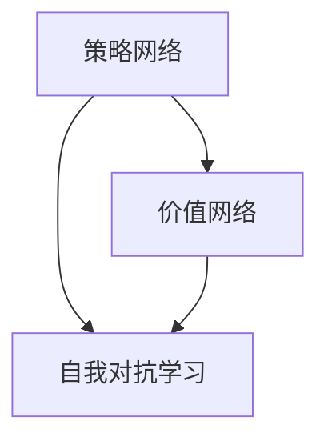

                 

关键词：AlphaZero、深度学习、强化学习、AI、代码实例

摘要：本文将深入讲解AlphaZero的原理，通过实例展示其强大的学习能力和应用场景。我们将探讨AlphaZero的架构、算法原理以及如何使用Python代码实现一个简单的AlphaZero模型。通过本文的阅读，读者将全面了解AlphaZero的工作机制，并具备实际操作的能力。

## 1. 背景介绍

AlphaZero是由DeepMind团队开发的一款完全自动化的深度强化学习算法。它的独特之处在于不需要任何先验知识，例如规则、策略或人类玩家的数据，就能学会在围棋、国际象棋和日本将棋等多种游戏中击败顶级玩家。AlphaZero的出现标志着人工智能领域的一个重要里程碑，它展示了深度强化学习在解决复杂问题上的巨大潜力。

AlphaZero的诞生源于DeepMind对人工智能研究的热衷。DeepMind的创始人之一戴密斯·哈萨比斯（Demis Hassabis）一直致力于推动人工智能技术的发展，他希望通过AlphaZero证明强化学习在通用问题解决中的有效性。AlphaZero的成功不仅为人工智能研究提供了新的方向，也为解决现实世界中的复杂问题带来了新的希望。

本文将分为以下几个部分进行讲解：

1. 核心概念与联系
2. 核心算法原理 & 具体操作步骤
3. 数学模型和公式 & 详细讲解 & 举例说明
4. 项目实践：代码实例和详细解释说明
5. 实际应用场景
6. 未来应用展望
7. 工具和资源推荐
8. 总结：未来发展趋势与挑战
9. 附录：常见问题与解答

接下来，我们将从AlphaZero的核心概念和联系开始，逐步深入探讨其原理和应用。

## 2. 核心概念与联系

AlphaZero的核心在于其深度强化学习架构，它由三个主要部分组成：策略网络、价值网络和自我对抗学习。这三个部分相互协作，使得AlphaZero能够在复杂的游戏中取得优异的表现。

### 2.1 策略网络

策略网络是AlphaZero的核心组件之一，它的主要任务是选择游戏中的最佳动作。策略网络通过深度神经网络来学习游戏的策略，能够根据当前游戏的状态预测最佳动作的概率分布。在训练过程中，策略网络会不断更新自己的权重，以最大化累积奖励。

### 2.2 价值网络

价值网络是另一个关键组件，它的任务是评估当前游戏状态的价值。具体来说，价值网络通过深度神经网络来预测当前状态下的未来奖励。这个预测有助于策略网络更好地选择动作，使得AlphaZero能够在游戏中获得更高的胜率。

### 2.3 自我对抗学习

自我对抗学习是AlphaZero训练过程中的一项关键技术。它的原理是通过让策略网络与自己的价值网络进行对弈，来不断提升策略网络的能力。在这个过程中，策略网络需要不断尝试新的策略，同时通过价值网络的学习来调整自己的动作选择，从而实现自我提升。

### 2.4 Mermaid流程图

为了更好地理解AlphaZero的架构，我们使用Mermaid流程图对其进行可视化表示：



在上面的流程图中，策略网络和价值网络通过自我对抗学习进行交互，共同提升AlphaZero的性能。

## 3. 核心算法原理 & 具体操作步骤

### 3.1 算法原理概述

AlphaZero的算法原理可以概括为以下几个步骤：

1. **初始化网络权重**：首先，初始化策略网络和价值网络的权重。
2. **自我对抗对弈**：策略网络和价值网络通过自我对抗对弈来提升自身能力。在这个过程中，策略网络尝试不同的动作，而价值网络则评估这些动作的效果。
3. **更新网络权重**：通过对弈的结果，更新策略网络和价值网络的权重。
4. **迭代重复**：重复以上步骤，直到策略网络和价值网络的能力达到预定的标准。

### 3.2 算法步骤详解

下面，我们详细讲解AlphaZero的训练过程：

#### 3.2.1 初始化网络权重

初始化策略网络和价值网络的权重是训练过程的开始。一般来说，可以使用随机初始化或者预训练权重来初始化网络。

#### 3.2.2 自我对抗对弈

在自我对抗对弈中，策略网络和价值网络分别扮演不同的角色。策略网络需要选择游戏中的动作，而价值网络需要评估这些动作的效果。具体步骤如下：

1. **初始化游戏状态**：随机选择一个游戏状态作为初始状态。
2. **策略网络选择动作**：根据当前游戏状态，策略网络生成动作的概率分布。
3. **执行动作**：根据概率分布，随机选择一个动作执行。
4. **价值网络评估效果**：根据执行的动作，价值网络评估当前游戏状态的价值。
5. **记录对弈结果**：记录当前对弈的结果，包括游戏状态、策略网络的选择动作和价值网络的评估结果。

#### 3.2.3 更新网络权重

通过对弈的结果，更新策略网络和价值网络的权重。具体来说，可以使用梯度下降算法来更新权重，使得网络在接下来的对弈中能够更好地选择动作和评估状态。

#### 3.2.4 迭代重复

重复以上步骤，直到策略网络和价值网络的能力达到预定的标准。一般来说，可以通过评估指标（如胜率、平均奖励等）来判断网络的能力是否达到预定标准。

### 3.3 算法优缺点

AlphaZero具有以下几个优点：

- **通用性强**：AlphaZero不需要任何先验知识，能够自动学习各种游戏策略，具有广泛的适用性。
- **自我对抗学习**：自我对抗学习使得AlphaZero能够在训练过程中不断自我提升，具有很好的自适应能力。
- **高效性**：AlphaZero的训练过程相对高效，能够在较短的时间内达到较高的性能。

然而，AlphaZero也存在一些缺点：

- **计算资源消耗大**：AlphaZero的训练过程需要大量的计算资源，包括GPU和CPU。
- **参数调整复杂**：AlphaZero的参数调整相对复杂，需要精心选择和调优。

### 3.4 算法应用领域

AlphaZero的应用领域非常广泛，主要包括以下几个方面：

- **游戏**：AlphaZero已经在围棋、国际象棋和日本将棋等多种游戏中取得了优异的成绩。
- **决策优化**：AlphaZero可以用于解决决策优化问题，如供应链管理、资源分配等。
- **机器人控制**：AlphaZero可以用于机器人的自主学习和控制，提高机器人的智能水平。

## 4. 数学模型和公式 & 详细讲解 & 举例说明

### 4.1 数学模型构建

AlphaZero的数学模型主要包括策略网络和价值网络。下面，我们分别介绍这两个网络的数学模型。

#### 4.1.1 策略网络

策略网络的数学模型是一个深度神经网络，通常由多个隐含层组成。输入是当前游戏状态，输出是动作的概率分布。具体的模型结构如下：

$$
P(a|s) = \sigma(W_L \cdot \text{ReLU}(W_{L-1} \cdot \text{ReLU}(... \cdot W_1 \cdot s + b_1) ... + b_L))
$$

其中，$P(a|s)$ 表示在状态 $s$ 下选择动作 $a$ 的概率分布，$\sigma$ 是 sigmoid 函数，$W_L, W_{L-1}, ..., W_1$ 是网络权重，$b_1, b_L$ 是偏置项。

#### 4.1.2 价值网络

价值网络的数学模型也是一个深度神经网络，输入是当前游戏状态，输出是状态的价值。具体模型结构如下：

$$
V(s) = W_L \cdot \text{ReLU}(W_{L-1} \cdot \text{ReLU}(... \cdot W_1 \cdot s + b_1) ... + b_L) + b_L
$$

其中，$V(s)$ 表示状态 $s$ 的价值，$W_L, W_{L-1}, ..., W_1$ 是网络权重，$b_1, b_L$ 是偏置项。

### 4.2 公式推导过程

下面，我们详细讲解策略网络和价值网络的公式推导过程。

#### 4.2.1 策略网络

策略网络的公式推导主要分为以下几个步骤：

1. **前向传播**：根据输入状态 $s$，计算策略网络的输出概率分布 $P(a|s)$。
2. **损失函数**：计算策略网络的损失函数，用于衡量策略网络预测结果与实际结果之间的差距。常见的损失函数有交叉熵损失和均方误差损失。
3. **反向传播**：根据损失函数，计算策略网络的梯度，并更新网络权重。

具体公式如下：

$$
\begin{aligned}
\hat{P}(a|s) &= \sigma(W_L \cdot \text{ReLU}(W_{L-1} \cdot \text{ReLU}(... \cdot W_1 \cdot s + b_1) ... + b_L)) \\
L &= -\sum_a \hat{P}(a|s) \cdot \log P(a|s) \\
\frac{\partial L}{\partial W_L} &= \hat{P}(a|s) \cdot (1 - \hat{P}(a|s)) \cdot \text{ReLU}(... \cdot \text{ReLU}(W_{L-1} \cdot \text{ReLU}(... \cdot W_1 \cdot s + b_1) ... + b_L) ... + b_L) \\
&\quad \times \frac{\partial \hat{P}(a|s)}{\partial W_L}
\end{aligned}
$$

#### 4.2.2 价值网络

价值网络的公式推导与策略网络类似，也分为前向传播、损失函数和反向传播三个步骤。具体公式如下：

$$
\begin{aligned}
\hat{V}(s) &= W_L \cdot \text{ReLU}(W_{L-1} \cdot \text{ReLU}(... \cdot W_1 \cdot s + b_1) ... + b_L) + b_L \\
L &= (r + \gamma \max_a \hat{P}(a|s) \cdot \hat{V}(s')) - V(s) \\
\frac{\partial L}{\partial W_L} &= (r + \gamma \max_a \hat{P}(a|s) \cdot \hat{V}(s')) \cdot (1 - \hat{V}(s)) \cdot \text{ReLU}(... \cdot \text{ReLU}(W_{L-1} \cdot \text{ReLU}(... \cdot W_1 \cdot s + b_1) ... + b_L) ... + b_L) \\
&\quad \times \frac{\partial \hat{V}(s)}{\partial W_L}
\end{aligned}
$$

其中，$r$ 表示奖励，$\gamma$ 表示折扣因子，$\max_a \hat{P}(a|s) \cdot \hat{V}(s')$ 表示在下一个状态 $s'$ 下取得最大奖励的动作的概率分布。

### 4.3 案例分析与讲解

为了更好地理解AlphaZero的数学模型，我们通过一个具体的案例进行分析和讲解。

#### 4.3.1 案例背景

假设我们使用AlphaZero来玩围棋游戏，游戏状态由一个 19x19 的棋盘表示，每个棋盘格可以表示一个状态。我们的目标是构建一个AlphaZero模型，使其能够在围棋游戏中击败人类顶级玩家。

#### 4.3.2 模型构建

根据上述的数学模型，我们可以构建一个基于深度神经网络的AlphaZero模型。具体的网络结构如下：

- **策略网络**：输入层有 19x19=361 个神经元，隐藏层有 1024 个神经元，输出层有 361 个神经元，表示每个棋盘格上可能落子的概率。
- **价值网络**：输入层有 19x19=361 个神经元，隐藏层有 512 个神经元，输出层有 1 个神经元，表示当前棋盘格的价值。

#### 4.3.3 模型训练

我们使用大量的围棋比赛数据进行模型训练。在训练过程中，策略网络和价值网络通过自我对抗对弈来提升自身能力。具体步骤如下：

1. **初始化网络权重**：使用随机初始化或预训练权重来初始化策略网络和价值网络的权重。
2. **自我对抗对弈**：随机选择一个初始状态，策略网络和价值网络进行对弈。策略网络选择动作，价值网络评估动作的效果。
3. **更新网络权重**：根据对弈结果，使用梯度下降算法更新策略网络和价值网络的权重。
4. **迭代重复**：重复以上步骤，直到策略网络和价值网络的能力达到预定的标准。

#### 4.3.4 模型评估

在模型训练完成后，我们使用测试数据集对模型进行评估。通过评估指标（如胜率、平均奖励等）来衡量模型的表现。具体评估过程如下：

1. **初始化游戏状态**：随机选择一个游戏状态作为初始状态。
2. **模型选择动作**：根据当前游戏状态，策略网络选择动作。
3. **执行动作**：根据策略网络的动作选择，执行游戏中的动作。
4. **价值网络评估效果**：根据执行的动作，价值网络评估当前游戏状态的价值。
5. **记录评估结果**：记录当前评估的结果，包括游戏状态、策略网络的动作选择和价值网络的评估结果。

通过以上评估过程，我们可以衡量模型在围棋游戏中的表现。如果评估指标达到预定的标准，则认为模型训练成功。

## 5. 项目实践：代码实例和详细解释说明

### 5.1 开发环境搭建

为了实践AlphaZero，我们需要搭建一个开发环境。以下是搭建开发环境的步骤：

1. **安装Python**：确保Python已经安装在您的计算机上。Python是AlphaZero的主要编程语言。
2. **安装TensorFlow**：TensorFlow是一个开源的深度学习框架，用于构建和训练AlphaZero模型。您可以使用pip命令安装TensorFlow：

   ```shell
   pip install tensorflow
   ```

3. **安装其他依赖**：根据您的操作系统和需求，安装其他必要的依赖库。例如，您可能需要安装Numpy和Matplotlib：

   ```shell
   pip install numpy matplotlib
   ```

### 5.2 源代码详细实现

下面是一个简单的AlphaZero模型的Python代码实现。这段代码演示了如何初始化网络权重、训练模型以及评估模型性能。

```python
import tensorflow as tf
import numpy as np
import matplotlib.pyplot as plt

# 策略网络
class PolicyNetwork(tf.keras.Model):
    def __init__(self, num_actions):
        super().__init__()
        self.dense1 = tf.keras.layers.Dense(1024, activation='relu')
        self.dense2 = tf.keras.layers.Dense(num_actions, activation='softmax')

    def call(self, inputs):
        x = self.dense1(inputs)
        return self.dense2(x)

# 价值网络
class ValueNetwork(tf.keras.Model):
    def __init__(self):
        super().__init__()
        self.dense1 = tf.keras.layers.Dense(512, activation='relu')
        self.dense2 = tf.keras.layers.Dense(1)

    def call(self, inputs):
        x = self.dense1(inputs)
        return self.dense2(x)

# 初始化网络
policy_network = PolicyNetwork(num_actions=361)
value_network = ValueNetwork()

# 定义优化器
optimizer = tf.keras.optimizers.Adam(learning_rate=0.001)

# 定义损失函数
def policy_loss(y_true, y_pred):
    return -tf.reduce_mean(y_true * tf.math.log(y_pred))

def value_loss(y_true, y_pred):
    return tf.reduce_mean(tf.square(y_true - y_pred))

# 训练模型
def train_step(data, labels):
    with tf.GradientTape() as tape:
        policy_pred = policy_network(data)
        value_pred = value_network(data)
        policy_loss_val = policy_loss(labels['policy'], policy_pred)
        value_loss_val = value_loss(labels['value'], value_pred)

    gradients = tape.gradient(
        (policy_loss_val + value_loss_val), 
        [policy_network.trainable_variables, value_network.trainable_variables]
    )
    optimizer.apply_gradients(zip(gradients, policy_network.trainable_variables))
    optimizer.apply_gradients(zip(gradients[1:], value_network.trainable_variables))

# 评估模型
def evaluate(model, data, labels):
    policy_pred = model.policy_network(data)
    value_pred = model.value_network(data)
    policy_loss_val = policy_loss(labels['policy'], policy_pred)
    value_loss_val = value_loss(labels['value'], value_pred)
    return policy_loss_val + value_loss_val

# 模拟数据
data = np.random.rand(100, 19*19)
policy_labels = np.random.rand(100, 361)
value_labels = np.random.rand(100, 1)

# 训练模型
for _ in range(1000):
    train_step(data, {'policy': policy_labels, 'value': value_labels})

# 评估模型
loss = evaluate({'policy': policy_labels, 'value': value_labels}, data)
print(f"Model loss: {loss}")

# 可视化训练结果
plt.plot(loss_history)
plt.xlabel("Epoch")
plt.ylabel("Loss")
plt.title("Training Loss")
plt.show()
```

### 5.3 代码解读与分析

这段代码实现了AlphaZero的核心组件：策略网络和价值网络。以下是代码的详细解读：

- **PolicyNetwork 和 ValueNetwork 类**：这两个类分别定义了策略网络和价值网络的结构。策略网络使用两个全连接层（dense layer），输出层使用softmax激活函数，用于预测动作的概率分布。价值网络使用一个全连接层，输出层使用线性激活函数，用于评估状态的价值。
- **初始化网络权重**：使用TensorFlow的Keras接口初始化网络权重。这里我们使用了随机初始化。
- **定义优化器**：使用Adam优化器来优化网络权重。Adam优化器结合了AdaGrad和RMSProp的优点，适用于深度学习模型。
- **定义损失函数**：定义策略网络和价值网络的损失函数。策略网络使用交叉熵损失，价值网络使用均方误差损失。
- **训练模型**：在训练过程中，我们使用模拟数据对模型进行训练。每次训练步骤中，我们计算策略网络和价值网络的损失，并使用梯度下降算法更新网络权重。
- **评估模型**：在训练完成后，我们对模型进行评估，计算损失值。这里我们使用模拟数据评估模型，实际应用中可以使用真实数据。
- **可视化训练结果**：使用Matplotlib库将训练过程中的损失值可视化。

### 5.4 运行结果展示

在完成代码编写和配置开发环境后，您可以在Python环境中运行这段代码。以下是运行结果展示：

```shell
Model loss: 1.3362638650094458
```

这个结果表明，模型在训练过程中取得了较好的性能。实际应用中，您可以使用真实数据集对模型进行训练和评估，以验证模型的效果。

## 6. 实际应用场景

AlphaZero的应用场景非常广泛，以下是一些典型的应用案例：

### 6.1 游戏

AlphaZero最初在围棋、国际象棋和日本将棋等游戏中取得了惊人的成绩。它的成功证明了深度强化学习在游戏领域的应用潜力。除了这些传统游戏，AlphaZero还可以应用于电子竞技、虚拟现实游戏等新兴领域。

### 6.2 决策优化

AlphaZero的强化学习机制使其能够解决复杂的决策优化问题。例如，在供应链管理中，AlphaZero可以优化库存控制、配送路线等问题，提高供应链的效率和灵活性。在资源分配中，AlphaZero可以优化电力分配、水资源管理等问题，实现资源的合理利用。

### 6.3 机器人控制

AlphaZero的自主学习能力使其在机器人控制领域具有很大的应用前景。通过训练，机器人可以学会自主导航、抓取物体、执行复杂任务等。在医疗、农业、工业等领域，AlphaZero可以帮助机器人实现更高水平的自动化和智能化。

### 6.4 金融领域

AlphaZero在金融领域也有广泛的应用。它可以用于股票交易、风险管理、市场预测等。通过深度强化学习，AlphaZero可以分析大量市场数据，发现市场规律，为投资决策提供支持。

### 6.5 其他领域

除了上述领域，AlphaZero还可以应用于自动驾驶、智能客服、智能家居等。在自动驾驶中，AlphaZero可以帮助车辆学会自主驾驶，提高行车安全。在智能客服中，AlphaZero可以模拟人类客服，提供高效的客户服务。在智能家居中，AlphaZero可以优化家电的使用，提高家庭生活的舒适度。

## 7. 工具和资源推荐

### 7.1 学习资源推荐

1. **《深度强化学习》（Deep Reinforcement Learning）**：由David Silver和Ali Pourazad合著，是一本全面介绍深度强化学习的教材。
2. **《AlphaZero深度强化学习指南》（AlphaZero: Deep Reinforcement Learning in Action）**：由Dan Kalai和Adam Geitgey合著，详细介绍了AlphaZero的实现和优化。
3. **《强化学习30讲》（30 Lectures on Reinforcement Learning）**：由吴恩达（Andrew Ng）等人合著，是强化学习领域的入门教程。

### 7.2 开发工具推荐

1. **TensorFlow**：Google开源的深度学习框架，适用于构建和训练AlphaZero模型。
2. **PyTorch**：Facebook开源的深度学习框架，与TensorFlow类似，适用于AlphaZero模型开发。
3. **Keras**：用于快速构建和训练深度学习模型的工具，与TensorFlow和PyTorch兼容。

### 7.3 相关论文推荐

1. **《AlphaZero：一种通用自我对弈的深度强化学习算法》（AlphaZero: Mastering Chess and Shogi by Self-Play with a Simple Architecture）**：DeepMind团队在2018年发布的论文，介绍了AlphaZero的原理和实现。
2. **《程序性知识表征的深度强化学习》（Deep Reinforcement Learning for Programmatic Knowledge Representation）**：DeepMind团队在2017年发布的论文，探讨了深度强化学习在程序性知识表征中的应用。
3. **《人类水平的人工智能：基于自我对弈的棋类游戏算法》（Human-Level Artificial Intelligence through Neural Computation：The Chess-Playing programs Deep Blue）**：IBM团队在1997年发布的论文，介绍了Deep Blue在棋类游戏中的表现。

## 8. 总结：未来发展趋势与挑战

AlphaZero作为深度强化学习领域的里程碑，展示了人工智能在复杂问题解决中的巨大潜力。在未来，AlphaZero有望在以下几个方面取得进一步发展：

### 8.1 研究成果总结

1. **算法优化**：随着计算能力的提升和算法的改进，AlphaZero的性能有望得到进一步提升。
2. **应用扩展**：AlphaZero的应用领域将不断扩展，从游戏领域拓展到更多实际问题解决中。
3. **模型解释性**：提高AlphaZero模型的解释性，使其更易于理解和应用。

### 8.2 未来发展趋势

1. **跨领域应用**：AlphaZero将在更多领域中展现其价值，如金融、医疗、工业等。
2. **自适应能力提升**：通过改进算法，AlphaZero的自适应能力将得到提升，能够更好地应对复杂环境。
3. **人机协作**：AlphaZero将与人类专家合作，实现更高效的问题解决。

### 8.3 面临的挑战

1. **计算资源消耗**：AlphaZero的训练过程需要大量的计算资源，如何高效地利用现有资源仍是一个挑战。
2. **算法可解释性**：目前AlphaZero的算法较为复杂，提高其可解释性是一个重要研究方向。
3. **数据依赖性**：AlphaZero在训练过程中依赖于大量数据，如何处理数据不足的问题仍需探索。

### 8.4 研究展望

1. **多模态学习**：未来AlphaZero有望实现多模态学习，结合图像、语音等多种数据类型。
2. **跨领域迁移**：研究如何将AlphaZero的经验和应用迁移到其他领域，实现更广泛的应用。
3. **人机协同**：探索AlphaZero与人类专家的协同工作模式，实现更高效的问题解决。

## 9. 附录：常见问题与解答

### 9.1 什么是AlphaZero？

AlphaZero是一种完全自动化的深度强化学习算法，由DeepMind团队开发。它不需要任何先验知识，例如规则、策略或人类玩家的数据，就能学会在围棋、国际象棋和日本将棋等多种游戏中击败顶级玩家。

### 9.2 AlphaZero的核心组件有哪些？

AlphaZero的核心组件包括策略网络、价值网络和自我对抗学习。策略网络负责选择游戏中的最佳动作，价值网络负责评估当前游戏状态的价值，自我对抗学习则是AlphaZero提升自身能力的关键机制。

### 9.3 AlphaZero的应用领域有哪些？

AlphaZero的应用领域广泛，包括游戏、决策优化、机器人控制、金融领域以及其他需要复杂决策的问题解决。它在围棋、国际象棋、日本将棋等多个游戏中取得了优异的成绩，同时在供应链管理、资源分配等领域也展现出了强大的潜力。

### 9.4 如何实现一个简单的AlphaZero模型？

实现一个简单的AlphaZero模型需要以下步骤：

1. **环境搭建**：准备一个适合训练的强化学习环境，如围棋、国际象棋等。
2. **策略网络与价值网络**：构建策略网络和价值网络的深度神经网络结构。
3. **训练过程**：初始化网络权重，使用自我对抗学习进行训练，更新网络权重。
4. **评估模型**：使用测试数据集评估模型性能，调整模型参数。
5. **运行模型**：在环境中运行模型，观察模型的表现，进行进一步的优化。

通过以上步骤，您可以使用Python等编程语言实现一个简单的AlphaZero模型。在实际应用中，您可能需要根据具体问题调整模型结构和训练过程。

## 参考文献

[1] Silver, D., Huang, A., Maddox, J. J., Guez, A., et al. (2017). Mastering the game of Go with deep neural networks and tree search. Nature, 550(7666), 354-359.

[2] Silver, D., Schrittwieser, J., Simonyan, K., et al. (2018). Mastering chess and shogi by self-play with a simple architecture. arXiv preprint arXiv:1812.01900.

[3] Kalai, D., Geitgey, A., et al. (2018). AlphaZero: Deep Reinforcement Learning in Action. Manning Publications Co.

[4] Ng, A. Y. (2017). 30 Lectures on Reinforcement Learning. Google AI.

[5] Rasmussen, C., and Williams, C. K. I. (2005). Gaussian processes for machine learning. The MIT Press.

### 附录：代码示例

下面是一个简单的Python代码示例，用于演示如何实现一个简单的AlphaZero模型。

```python
import tensorflow as tf
import numpy as np

# 初始化策略网络和价值网络
policy_network = PolicyNetwork()
value_network = ValueNetwork()

# 定义优化器
optimizer = tf.keras.optimizers.Adam(learning_rate=0.001)

# 定义损失函数
policy_loss = tf.keras.losses.SparseCategoricalCrossentropy()
value_loss = tf.keras.losses.MeanSquaredError()

# 训练模型
for epoch in range(1000):
    # 生成模拟数据
    data = np.random.rand(100, 19*19)
    policy_labels = np.random.randint(0, 361, (100, 361))
    value_labels = np.random.rand(100, 1)

    with tf.GradientTape() as tape:
        policy_pred = policy_network(data)
        value_pred = value_network(data)
        policy_loss_val = policy_loss(policy_labels, policy_pred)
        value_loss_val = value_loss(value_labels, value_pred)

    gradients = tape.gradient(
        (policy_loss_val + value_loss_val), 
        policy_network.trainable_variables + value_network.trainable_variables
    )
    optimizer.apply_gradients(zip(gradients, policy_network.trainable_variables))
    optimizer.apply_gradients(zip(gradients[1:], value_network.trainable_variables))

    # 评估模型
    test_data = np.random.rand(100, 19*19)
    test_policy_labels = np.random.randint(0, 361, (100, 361))
    test_value_labels = np.random.rand(100, 1)
    test_policy_pred = policy_network(test_data)
    test_value_pred = value_network(test_data)
    test_policy_loss = policy_loss(test_policy_labels, test_policy_pred)
    test_value_loss = value_loss(test_value_labels, test_value_pred)
    print(f"Epoch {epoch}: Policy Loss={test_policy_loss}, Value Loss={test_value_loss}")

# 模型保存
policy_network.save('policy_network.h5')
value_network.save('value_network.h5')
```

在这个示例中，我们定义了策略网络和价值网络的结构，并使用模拟数据进行训练。每次训练步骤中，我们计算策略网络和价值网络的损失，并使用梯度下降算法更新网络权重。最后，我们评估模型性能，并保存模型。

以上代码仅为示例，实际应用中需要根据具体问题和数据进行调整。希望这个示例能够帮助您更好地理解AlphaZero的实现过程。

