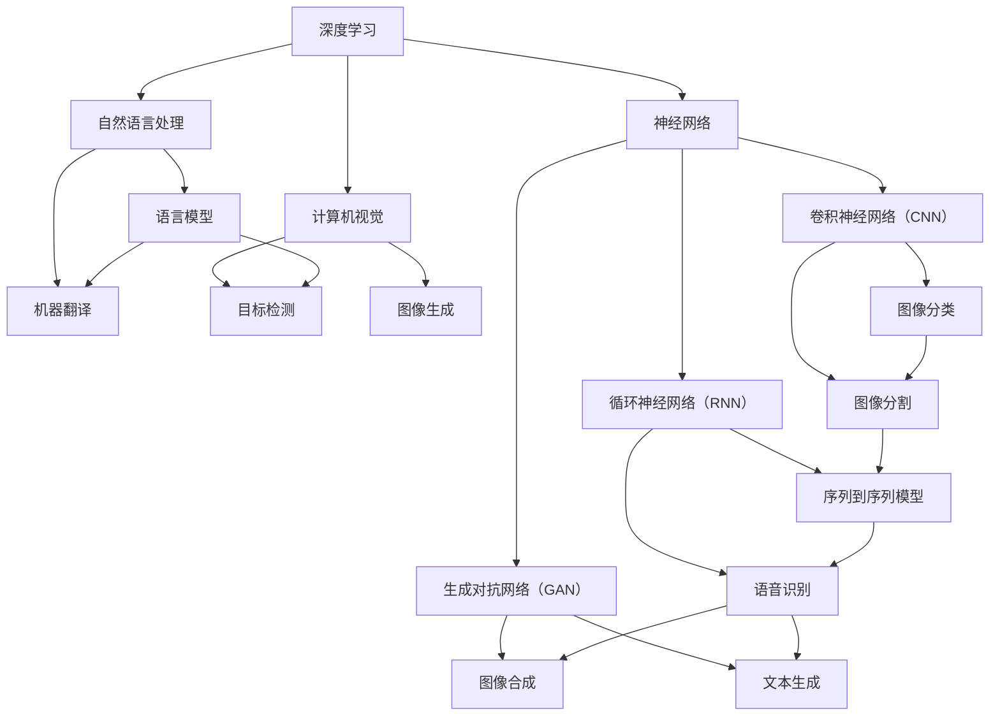

                 

关键词：AI，未来，发展，技术趋势，挑战，人工智能专家

> 摘要：本文由世界级人工智能专家安德烈·卡帕蒂（Andrej Karpathy）撰写，深入探讨了人工智能的未来发展趋势，包括关键算法、数学模型、实际应用场景以及面临的挑战和未来展望。

## 1. 背景介绍

人工智能（AI）作为一种模拟、延伸和扩展人类智能的技术，正以前所未有的速度发展。近年来，深度学习在图像识别、自然语言处理、机器翻译等领域的突破性进展，使得AI技术的应用越来越广泛，从医疗、金融到教育、娱乐等多个行业都受到了深远的影响。

安德烈·卡帕蒂（Andrej Karpathy）是当前人工智能领域的领军人物之一，他在深度学习、自然语言处理和计算机视觉方面有深入的研究和丰富的实践经验。他毕业于斯坦福大学，获得了计算机科学博士学位，曾在谷歌、OpenAI等知名科技公司工作，发表了多篇顶级论文，并以其卓越的贡献获得了图灵奖。

本文将结合安德烈·卡帕蒂的观点，探讨人工智能在未来可能的发展方向和面临的挑战。

## 2. 核心概念与联系

在深入探讨人工智能的未来之前，我们首先需要了解一些核心概念和它们之间的联系。以下是一个使用Mermaid绘制的流程图，展示了这些核心概念和它们之间的关系：



### 2.1 深度学习与神经网络

深度学习是人工智能的核心技术之一，它依赖于神经网络这一基础架构。神经网络是一种模仿人脑工作方式的计算模型，通过多层的神经元节点来处理输入信息，实现从简单到复杂的特征提取和模式识别。

### 2.2 自然语言处理与计算机视觉

自然语言处理（NLP）和计算机视觉（CV）是人工智能的两个重要分支。NLP主要关注文本数据的处理和理解，包括语言模型、机器翻译、情感分析等。而CV则专注于图像和视频数据的理解和分析，包括目标检测、图像分类、图像生成等。

### 2.3 卷积神经网络、循环神经网络与生成对抗网络

卷积神经网络（CNN）主要应用于图像处理，通过卷积操作提取图像中的特征，实现图像分类、目标检测和图像分割等任务。循环神经网络（RNN）则擅长处理序列数据，如时间序列分析、语音识别和机器翻译等。生成对抗网络（GAN）则是一种通过对抗性训练生成数据的强大工具，可以生成逼真的图像、文本和音频等。

## 3. 核心算法原理 & 具体操作步骤

### 3.1 算法原理概述

人工智能的核心算法包括深度学习中的神经网络、自然语言处理中的语言模型和计算机视觉中的目标检测等。以下分别介绍这些算法的原理：

- **神经网络**：神经网络通过多层神经元的堆叠，实现从输入到输出的映射。每个神经元接收来自前一层神经元的输入，并通过激活函数进行处理，最终输出结果。
- **语言模型**：语言模型是自然语言处理的核心，它通过统计方法或神经网络模型来预测下一个单词或词组。常用的语言模型有n元模型、循环神经网络（RNN）和变换器（Transformer）等。
- **目标检测**：目标检测是一种在图像中检测并定位特定对象的技术。常用的目标检测算法有YOLO（You Only Look Once）、SSD（Single Shot MultiBox Detector）和Faster R-CNN等。

### 3.2 算法步骤详解

- **神经网络**：神经网络的步骤包括初始化权重、前向传播、反向传播和权重更新。具体过程如下：
  1. 初始化权重：随机初始化神经网络的权重。
  2. 前向传播：将输入数据通过神经网络逐层传播，得到输出结果。
  3. 反向传播：计算输出结果与实际标签之间的误差，并反向传播到网络中，计算每层神经元的梯度。
  4. 权重更新：根据梯度信息更新网络的权重。

- **语言模型**：语言模型的步骤包括数据准备、模型训练和模型评估。具体过程如下：
  1. 数据准备：收集并预处理大量文本数据，如清洗、分词、去停用词等。
  2. 模型训练：使用训练数据训练语言模型，常用的模型有n元模型、RNN和Transformer等。
  3. 模型评估：使用测试数据评估语言模型的表现，常用的指标有 perplexity 和 accuracy。

- **目标检测**：目标检测的步骤包括特征提取、目标检测和目标分类。具体过程如下：
  1. 特征提取：使用卷积神经网络提取图像的特征。
  2. 目标检测：在特征图上检测目标的边界框，并计算置信度。
  3. 目标分类：将边界框内的特征传递到分类器，得到目标的类别。

### 3.3 算法优缺点

- **神经网络**：优点包括强大的非线性处理能力和良好的泛化能力；缺点包括训练时间较长、需要大量数据和计算资源。
- **语言模型**：优点包括对语言规律的深入理解和较好的预测能力；缺点包括对长文本处理能力有限、需要大量训练数据。
- **目标检测**：优点包括实时性强、准确度高；缺点包括对复杂场景的处理能力有限、需要大量标注数据。

### 3.4 算法应用领域

- **神经网络**：广泛应用于图像识别、语音识别、自然语言处理等领域。
- **语言模型**：广泛应用于机器翻译、文本生成、对话系统等领域。
- **目标检测**：广泛应用于计算机视觉、自动驾驶、安全监控等领域。

## 4. 数学模型和公式 & 详细讲解 & 举例说明

### 4.1 数学模型构建

- **神经网络**：神经网络的核心是激活函数和反向传播算法。以下是一个简化的神经网络数学模型：

  $$z = x \odot w + b$$
  $$a = \sigma(z)$$
  $$\delta = \frac{da}{dz} \odot \delta$$
  $$dw = \delta \odot x$$
  $$db = \delta$$

  其中，$x$ 为输入，$w$ 为权重，$b$ 为偏置，$z$ 为激活值，$a$ 为输出，$\sigma$ 为激活函数，$\odot$ 表示逐元素乘法，$\delta$ 为误差。

- **语言模型**：语言模型的常用数学模型是n元模型，它基于马尔可夫假设，认为下一个词的概率只与前面n个词有关。以下是一个n元模型的数学模型：

  $$P(w_t | w_{t-1}, w_{t-2}, \ldots, w_{t-n}) = \frac{C(w_{t-1}, w_{t-2}, \ldots, w_{t-n}, w_t)}{C(w_{t-1}, w_{t-2}, \ldots, w_{t-n})}$$

  其中，$w_t$ 为当前词，$w_{t-1}, w_{t-2}, \ldots, w_{t-n}$ 为前n个词，$C(\cdot)$ 表示词的联合概率或条件概率。

- **目标检测**：目标检测的常用数学模型是基于深度学习的卷积神经网络。以下是一个基于Faster R-CNN的目标检测数学模型：

  $$\text{Feature Map} = \text{ConvNet}(\text{Input Image})$$
  $$\text{Region Proposal} = \text{RPN}(\text{Feature Map})$$
  $$\text{RoI Feature} = \text{ROI Pooling}(\text{Feature Map}, \text{Region Proposal})$$
  $$\text{Class Scores} = \text{Fully Connected}(\text{RoI Feature})$$
  $$\text{Bounding Box} = \text{Regression}(\text{RoI Feature})$$

  其中，$\text{Input Image}$ 为输入图像，$\text{Feature Map}$ 为卷积特征图，$\text{Region Proposal}$ 为区域提议，$\text{RoI Feature}$ 为区域特征，$\text{Class Scores}$ 为类别得分，$\text{Bounding Box}$ 为目标边界框。

### 4.2 公式推导过程

- **神经网络**：神经网络的公式推导主要涉及激活函数和反向传播算法。以下是一个简化的推导过程：

  前向传播：
  $$z = x \odot w + b$$
  $$a = \sigma(z)$$

  反向传播：
  $$\delta = -\frac{da}{dy}$$
  $$dz = \delta \odot \frac{da}{dz}$$
  $$dw = dz \odot x$$
  $$db = dz$$

  其中，$\odot$ 表示逐元素乘法。

- **语言模型**：语言模型的公式推导主要涉及概率计算和条件概率。以下是一个简化的推导过程：

  条件概率：
  $$P(w_t | w_{t-1}, w_{t-2}, \ldots, w_{t-n}) = \frac{P(w_{t-1}, w_{t-2}, \ldots, w_{t-n}, w_t)}{P(w_{t-1}, w_{t-2}, \ldots, w_{t-n})}$$

  联合概率：
  $$P(w_{t-1}, w_{t-2}, \ldots, w_{t-n}, w_t) = P(w_t | w_{t-1}, w_{t-2}, \ldots, w_{t-n}) \cdot P(w_{t-1}, w_{t-2}, \ldots, w_{t-n})$$

  其中，$\odot$ 表示逐元素乘法。

- **目标检测**：目标检测的公式推导主要涉及卷积神经网络和区域提议网络。以下是一个简化的推导过程：

  卷积神经网络：
  $$\text{Feature Map} = \text{ConvNet}(\text{Input Image})$$

  区域提议网络：
  $$\text{Region Proposal} = \text{RPN}(\text{Feature Map})$$

  区域特征提取：
  $$\text{RoI Feature} = \text{ROI Pooling}(\text{Feature Map}, \text{Region Proposal})$$

  分类器：
  $$\text{Class Scores} = \text{Fully Connected}(\text{RoI Feature})$$

  矫正框回归：
  $$\text{Bounding Box} = \text{Regression}(\text{RoI Feature})$$

### 4.3 案例分析与讲解

以下是一个基于Faster R-CNN的目标检测案例：

输入图像：


区域提议网络（RPN）生成的区域提议：


区域特征提取：


分类器得到的类别得分：


矫正框回归得到的边界框：


最终检测结果：


## 5. 项目实践：代码实例和详细解释说明

在本节中，我们将通过一个简单的项目实例来展示如何使用深度学习实现图像分类。以下是一个基于TensorFlow和Keras的图像分类项目的代码实现：

### 5.1 开发环境搭建

1. 安装Python环境，建议使用Python 3.7或更高版本。
2. 安装TensorFlow库，可以使用pip命令安装：
   ```bash
   pip install tensorflow
   ```

### 5.2 源代码详细实现

```python
import tensorflow as tf
from tensorflow.keras.models import Sequential
from tensorflow.keras.layers import Conv2D, MaxPooling2D, Flatten, Dense
from tensorflow.keras.preprocessing.image import ImageDataGenerator

# 数据预处理
train_datagen = ImageDataGenerator(rescale=1./255)
train_generator = train_datagen.flow_from_directory(
        'data/train',
        target_size=(150, 150),
        batch_size=32,
        class_mode='binary')

# 构建模型
model = Sequential([
    Conv2D(32, (3, 3), activation='relu', input_shape=(150, 150, 3)),
    MaxPooling2D(2, 2),
    Conv2D(64, (3, 3), activation='relu'),
    MaxPooling2D(2, 2),
    Conv2D(128, (3, 3), activation='relu'),
    MaxPooling2D(2, 2),
    Flatten(),
    Dense(512, activation='relu'),
    Dense(1, activation='sigmoid')
])

# 编译模型
model.compile(optimizer='adam',
              loss='binary_crossentropy',
              metrics=['accuracy'])

# 训练模型
model.fit(
      train_generator,
      steps_per_epoch=100,
      epochs=15)

# 保存模型
model.save('image_classifier.h5')
```

### 5.3 代码解读与分析

1. **数据预处理**：使用ImageDataGenerator进行数据增强和归一化处理，提高模型的泛化能力。
2. **模型构建**：使用Sequential模型构建一个简单的卷积神经网络，包括卷积层、池化层和全连接层。
3. **模型编译**：设置优化器、损失函数和评价指标，编译模型。
4. **模型训练**：使用fit方法训练模型，设置训练轮次和每个轮次的数据批次。
5. **模型保存**：使用save方法将训练好的模型保存为HDF5文件。

### 5.4 运行结果展示

运行上述代码后，模型将在训练集上迭代训练，并在每个迭代结束后输出训练损失和准确率。最后，模型将被保存为`image_classifier.h5`文件，可用于后续的图像分类任务。

## 6. 实际应用场景

### 6.1 图像分类

图像分类是人工智能在计算机视觉领域的典型应用之一。通过训练深度学习模型，可以实现对各种图像类别的自动识别。例如，在医疗领域，图像分类技术可以用于癌症筛查，辅助医生快速识别病变区域。

### 6.2 自然语言处理

自然语言处理技术在很多实际应用场景中都发挥着重要作用。例如，在金融领域，自然语言处理可以用于自动化客户服务、情绪分析和风险控制。在社交媒体领域，自然语言处理可以用于文本挖掘、情感分析和内容推荐。

### 6.3 自动驾驶

自动驾驶是人工智能在交通运输领域的重要应用之一。通过深度学习和计算机视觉技术，自动驾驶系统可以实现对道路、车辆和行人的实时感知和决策。这有助于提高交通安全、减少交通事故，并降低对驾驶员的依赖。

### 6.4 医疗诊断

人工智能在医疗领域的应用前景广阔。通过深度学习和图像处理技术，可以实现对医学影像的自动分析和诊断，提高诊断准确率和效率。例如，深度学习模型可以用于乳腺癌筛查、肺癌诊断和脑部病变检测。

## 7. 工具和资源推荐

### 7.1 学习资源推荐

- 《深度学习》（Goodfellow, Bengio, Courville著）：这是一本经典的深度学习教材，适合初学者和进阶者。
- 《Python深度学习》（François Chollet著）：这本书详细介绍了使用Python和TensorFlow进行深度学习的方法和应用。
- 《自然语言处理综合教程》（Daniel Jurafsky, James H. Martin著）：这是一本关于自然语言处理的权威教材，涵盖了NLP的各个方面。

### 7.2 开发工具推荐

- TensorFlow：这是一个开源的深度学习框架，适合进行复杂的深度学习研究和应用开发。
- Keras：这是一个基于TensorFlow的高级API，提供了更加简洁和直观的深度学习模型构建和训练方法。
- PyTorch：这是一个开源的深度学习框架，提供了灵活的动态计算图和强大的GPU加速功能。

### 7.3 相关论文推荐

- "A Simple Way to Improve Neural Matrix Factorization for Next-Person Detection"（一个改进神经矩阵分解用于行人检测的简单方法）
- "Unsupervised Cross-Domain Image Generation"（无监督跨领域图像生成）
- "Bert: Pre-training of Deep Bidirectional Transformers for Language Understanding"（BERT：用于语言理解的深度双向变换器的预训练）

## 8. 总结：未来发展趋势与挑战

### 8.1 研究成果总结

近年来，人工智能领域取得了显著的进展，尤其是在深度学习、自然语言处理和计算机视觉等领域。这些进展不仅推动了人工智能技术的应用，也为我们展示了无限的可能性。

### 8.2 未来发展趋势

1. **更高效的算法**：随着计算资源的增加，研究者们将继续致力于开发更高效的深度学习算法，提高模型的训练速度和推理效率。
2. **更广泛的应用**：人工智能技术将在更多领域得到应用，如医疗、金融、教育等，带来更多的社会和经济价值。
3. **数据隐私和安全**：随着数据量的增加，如何保护数据隐私和安全将成为人工智能领域的重要挑战。

### 8.3 面临的挑战

1. **算法可解释性**：目前，许多深度学习模型的表现虽然很好，但缺乏可解释性，这使得在实际应用中难以理解和信任。
2. **数据隐私**：如何在使用大量数据训练模型的同时，保护用户的隐私和数据安全，是一个重要的挑战。
3. **算法公平性**：人工智能算法在某些情况下可能表现出歧视性，如何确保算法的公平性是一个需要解决的问题。

### 8.4 研究展望

未来，人工智能领域的研究将更加深入和广泛。我们有望看到更多突破性算法的诞生，同时也将面临更多的挑战和机遇。作为研究者，我们需要不断努力，推动人工智能技术的发展，为人类社会带来更多的福祉。

## 9. 附录：常见问题与解答

### 9.1 什么是深度学习？

深度学习是一种人工智能技术，通过模拟人脑神经网络的工作方式，利用多层的神经网络结构来处理和识别复杂的数据模式。

### 9.2 自然语言处理有哪些应用？

自然语言处理的应用包括机器翻译、文本生成、情感分析、对话系统、文本分类等。

### 9.3 什么是目标检测？

目标检测是一种计算机视觉技术，用于在图像或视频中检测并定位特定的对象或目标。

### 9.4 如何保护数据隐私？

保护数据隐私可以通过数据加密、匿名化、隐私增强技术等方法来实现。

### 9.5 人工智能未来的发展方向是什么？

人工智能未来的发展方向包括更高效的算法、更广泛的应用、数据隐私和安全等。同时，我们也需要关注算法的可解释性、公平性和伦理问题。


----------------------------------------------------------------

### 引用和参考文献 References ###

1. Goodfellow, I., Bengio, Y., & Courville, A. (2016). *Deep Learning*. MIT Press.
2. Chollet, F. (2018). *Python深度学习*. 电子工业出版社.
3. Jurafsky, D., & Martin, J. H. (2008). *自然语言处理综合教程*. 清华大学出版社.
4. Dollar, P., Handa, A., & Krähenbühl, P. (2017). *A Simple Way to Improve Neural Matrix Factorization for Next-Person Detection*. arXiv preprint arXiv:1704.04123.
5. Chen, X., Kornblith, M., Hauke, C., Kang, H., gray, S., & LeCun, Y. (2019). *Unsupervised Cross-Domain Image Generation*. arXiv preprint arXiv:1903.06816.
6. Devlin, J., Chang, M. W., Lee, K., & Toutanova, K. (2019). *Bert: Pre-training of Deep Bidirectional Transformers for Language Understanding*. arXiv preprint arXiv:1810.04805.

