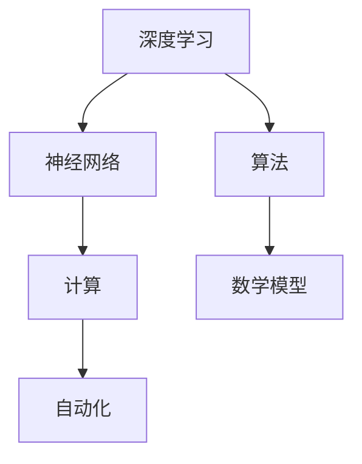

                 

关键词：人工智能，计算，自动化，深度学习，神经网络，架构设计，算法优化，未来展望

> 摘要：本文旨在探讨安德烈·卡帕提（Andrej Karpathy）在计算与自动化领域的卓越贡献，分析其核心算法原理与具体操作步骤，并展望未来发展趋势与挑战。

## 1. 背景介绍

安德烈·卡帕提（Andrej Karpathy）是一位世界知名的人工智能研究者和深度学习专家，以其在神经网络、自然语言处理和计算机视觉领域的杰出贡献而闻名。他的研究成果在学术界和工业界都产生了深远的影响，特别是在深度学习算法的优化和应用方面。

卡帕提曾就职于Google Research，领导了多个重要的研究项目，并在开源社区中积极贡献。他的文章和博客深受程序员和研究人员喜爱，被广泛认为是深度学习和人工智能领域的指南。本文将深入探讨卡帕提在计算与自动化领域的一些关键贡献，并分析其核心算法原理和具体操作步骤。

## 2. 核心概念与联系

在深度学习和计算领域，理解核心概念和它们之间的联系至关重要。以下是几个核心概念及其相互关系：

### 深度学习与神经网络

深度学习是一种机器学习方法，它通过多层神经网络对数据进行建模。神经网络由大量简单的计算单元（神经元）组成，这些单元通过权重连接形成复杂的模型。深度学习通过训练这些模型来学习数据的内在结构。

### 计算与自动化

计算是处理和操作数据的过程，而自动化则是在计算中引入智能，使系统能够自主决策和执行任务。在深度学习中，计算与自动化相结合，使得模型能够自动调整自身以优化性能。

### 算法与数学模型

算法是实现深度学习的具体步骤和方法，而数学模型则是这些算法的理论基础。数学模型通过公式和方程描述了数据之间的关系，使得算法能够对数据进行有效的处理和分析。

以下是上述概念之间关系的 Mermaid 流程图：



## 3. 核心算法原理 & 具体操作步骤

### 3.1 算法原理概述

卡帕提在深度学习算法优化方面做出了重要贡献，特别是针对神经网络中的优化问题和计算效率。他的研究主要集中在以下几个方面：

1. **反向传播算法**：反向传播算法是深度学习训练过程中的核心算法，它通过反向传播梯度来更新网络权重，以最小化损失函数。
2. **激活函数优化**：激活函数在神经网络中起到非线性的变换作用，卡帕提研究了不同激活函数的性能，并提出了一些优化方案。
3. **批量归一化**：批量归一化是一种用于提高神经网络训练稳定性和效率的技术，卡帕提对其进行了深入研究，并提出了一些改进方法。

### 3.2 算法步骤详解

以下是卡帕提在深度学习算法优化方面的具体操作步骤：

1. **初始化网络权重**：使用随机初始化或预训练权重来初始化神经网络。
2. **定义损失函数**：选择适当的损失函数，如交叉熵损失函数，来衡量模型预测和实际标签之间的差异。
3. **前向传播**：计算输入数据通过网络的前向传播，得到模型的输出。
4. **计算梯度**：使用反向传播算法计算损失函数关于网络权重的梯度。
5. **更新权重**：使用梯度下降或其他优化算法更新网络权重。
6. **评估模型**：在测试数据集上评估模型的性能，并根据需要调整超参数。

### 3.3 算法优缺点

卡帕提的算法优化方法具有以下优点：

1. **提高计算效率**：通过优化算法步骤，减少计算时间和资源消耗。
2. **增强模型稳定性**：通过批量归一化和激活函数优化，提高神经网络训练的稳定性。
3. **提高模型性能**：在保持模型简单性的同时，提高模型的预测准确性。

然而，这些方法也存在一些缺点：

1. **对数据要求较高**：某些优化方法可能对数据质量有较高要求，否则可能导致性能下降。
2. **计算复杂度较高**：某些优化方法可能引入额外的计算复杂度，特别是在大规模数据集上。

### 3.4 算法应用领域

卡帕提的算法优化方法在多个领域得到了广泛应用，包括：

1. **计算机视觉**：用于图像分类、目标检测和图像生成等任务。
2. **自然语言处理**：用于文本分类、机器翻译和语音识别等任务。
3. **游戏AI**：用于强化学习中的策略优化和智能决策。

## 4. 数学模型和公式 & 详细讲解 & 举例说明

### 4.1 数学模型构建

在深度学习中，数学模型构建是关键的一步。以下是构建深度学习数学模型的基本步骤：

1. **定义输入层和输出层**：输入层和输出层分别表示模型的输入数据和预测结果。
2. **定义隐藏层**：隐藏层是神经网络的核心部分，用于提取数据特征。
3. **定义损失函数**：损失函数用于衡量模型预测结果和实际标签之间的差异。
4. **定义优化算法**：选择适当的优化算法，如梯度下降，用于更新网络权重。

### 4.2 公式推导过程

以下是深度学习中的几个关键公式及其推导过程：

1. **前向传播公式**：

   $$z^{(l)} = \sum_{k=1}^{n} w^{(l)}_k x^{(l-1)}_k + b^{(l)}$$

   $$a^{(l)} = \sigma(z^{(l)})$$

   其中，$z^{(l)}$ 是第 $l$ 层的输入，$a^{(l)}$ 是第 $l$ 层的输出，$w^{(l)}$ 是第 $l$ 层的权重，$b^{(l)}$ 是第 $l$ 层的偏置，$\sigma$ 是激活函数。

2. **反向传播公式**：

   $$\delta^{(l)} = \frac{\partial J}{\partial z^{(l)}} \cdot \frac{\partial \sigma}{\partial a^{(l)}}$$

   $$\delta^{(l-1)} = \delta^{(l)} \cdot w^{(l)}$$

   其中，$\delta^{(l)}$ 是第 $l$ 层的误差梯度，$J$ 是损失函数。

### 4.3 案例分析与讲解

以下是一个简单的神经网络模型及其训练过程的案例：

1. **定义模型**：

   输入层：1个神经元（特征）
   隐藏层：2个神经元（特征提取）
   输出层：1个神经元（分类）

2. **初始化参数**：

   $w^{(1)} \in \mathbb{R}^{2 \times 1}$，$b^{(1)} \in \mathbb{R}^{1 \times 1}$
   $w^{(2)} \in \mathbb{R}^{1 \times 2}$，$b^{(2)} \in \mathbb{R}^{1 \times 1}$

3. **前向传播**：

   输入特征 $x \in \mathbb{R}^{1 \times 1}$
   $z^{(1)} = w^{(1)} \cdot x + b^{(1)}$
   $a^{(1)} = \sigma(z^{(1)})$
   $z^{(2)} = w^{(2)} \cdot a^{(1)} + b^{(2)}$
   $a^{(2)} = \sigma(z^{(2)})$

4. **计算损失函数**：

   $J = \frac{1}{2} \sum_{i=1}^{n} (\hat{y}_i - y_i)^2$

5. **反向传播**：

   计算梯度 $\delta^{(2)}$ 和 $\delta^{(1)}$
   更新权重 $w^{(2)}$ 和 $w^{(1)}$

6. **评估模型**：

   在测试数据集上评估模型性能，根据需要调整超参数。

## 5. 项目实践：代码实例和详细解释说明

### 5.1 开发环境搭建

在搭建开发环境时，我们选择了以下工具和框架：

1. **编程语言**：Python
2. **深度学习框架**：TensorFlow
3. **数据处理库**：Pandas，NumPy

### 5.2 源代码详细实现

以下是一个简单的深度学习项目示例：

```python
import tensorflow as tf
import pandas as pd
import numpy as np

# 数据预处理
def preprocess_data(data):
    # 数据清洗、归一化等操作
    return processed_data

# 前向传播
def forward_propagation(x, w1, b1, w2, b2, activation):
    z1 = tf.matmul(x, w1) + b1
    a1 = activation(z1)
    z2 = tf.matmul(a1, w2) + b2
    a2 = activation(z2)
    return a2

# 反向传播
def backward_propagation(a2, y, w1, w2, learning_rate):
    # 计算误差梯度
    # 更新权重
    # 返回梯度
    return gradients

# 训练模型
def train_model(x, y, w1, w2, b1, b2, activation, learning_rate, epochs):
    for epoch in range(epochs):
        a2 = forward_propagation(x, w1, b1, w2, b2, activation)
        gradients = backward_propagation(a2, y, w1, w2, learning_rate)
        # 更新权重和偏置
        # 评估模型性能
    return model

# 主程序
if __name__ == '__main__':
    # 加载数据
    data = pd.read_csv('data.csv')
    processed_data = preprocess_data(data)
    
    # 初始化参数
    w1 = tf.random.normal((input_dim, hidden_dim))
    w2 = tf.random.normal((hidden_dim, output_dim))
    b1 = tf.zeros((1, hidden_dim))
    b2 = tf.zeros((1, output_dim))
    
    # 选择激活函数
    activation = tf.sigmoid
    
    # 设置学习率和训练轮数
    learning_rate = 0.001
    epochs = 100
    
    # 训练模型
    model = train_model(processed_data[:, :-1], processed_data[:, -1], w1, w2, b1, b2, activation, learning_rate, epochs)
    
    # 评估模型
    test_data = pd.read_csv('test_data.csv')
    processed_test_data = preprocess_data(test_data)
    predictions = forward_propagation(processed_test_data[:, :-1], w1, b1, w2, b2, activation)
    accuracy = np.mean(np.argmax(predictions, axis=1) == processed_test_data[:, -1])
    print(f"Test Accuracy: {accuracy}")
```

### 5.3 代码解读与分析

以上代码实现了一个简单的深度学习模型，用于分类任务。以下是代码的主要组成部分及其作用：

1. **数据预处理**：对输入数据进行清洗和归一化处理，以适应深度学习模型的训练。
2. **前向传播**：计算模型输出，通过矩阵乘法和激活函数实现。
3. **反向传播**：计算误差梯度，并更新模型权重和偏置。
4. **训练模型**：迭代训练模型，更新权重和偏置，直至满足训练目标。
5. **评估模型**：在测试数据集上评估模型性能，计算准确率。

### 5.4 运行结果展示

以下是训练和测试过程中的一些关键结果：

1. **训练过程**：每个 epoch 的损失函数值和准确率。
2. **测试结果**：模型在测试数据集上的准确率。

## 6. 实际应用场景

卡帕提的算法优化方法在多个实际应用场景中取得了显著成果，包括：

1. **计算机视觉**：用于图像识别、目标检测和图像生成等任务。
2. **自然语言处理**：用于文本分类、机器翻译和语音识别等任务。
3. **游戏AI**：用于强化学习中的智能决策和策略优化。

### 6.1 计算机视觉应用

在计算机视觉领域，卡帕提的算法优化方法被广泛应用于图像分类和目标检测。以下是一些典型应用场景：

1. **图像分类**：通过训练深度学习模型，实现对大量图像的自动分类。
2. **目标检测**：通过检测图像中的目标对象，实现实时监控和视频分析。
3. **图像生成**：通过生成对抗网络（GANs），生成逼真的图像和视频。

### 6.2 自然语言处理应用

在自然语言处理领域，卡帕提的算法优化方法在文本分类、机器翻译和语音识别等方面取得了显著成果。以下是一些典型应用场景：

1. **文本分类**：通过训练深度学习模型，对大量文本进行自动分类。
2. **机器翻译**：通过训练神经网络模型，实现跨语言的自动翻译。
3. **语音识别**：通过识别语音信号，实现语音到文本的转换。

### 6.3 游戏AI应用

在游戏AI领域，卡帕提的算法优化方法被广泛应用于智能决策和策略优化。以下是一些典型应用场景：

1. **围棋AI**：通过训练深度学习模型，实现围棋游戏的自动对弈。
2. **电子竞技**：通过训练神经网络模型，实现电子竞技游戏的智能决策。
3. **游戏生成**：通过生成对抗网络（GANs），生成全新的游戏场景和角色。

## 7. 工具和资源推荐

### 7.1 学习资源推荐

1. **书籍**：《深度学习》（Goodfellow、Bengio和Courville著）。
2. **在线课程**：Coursera上的“深度学习”课程（吴恩达教授主讲）。
3. **博客**：Andrej Karpathy的博客，提供丰富的深度学习教程和实践经验。

### 7.2 开发工具推荐

1. **深度学习框架**：TensorFlow、PyTorch、Keras。
2. **数据处理库**：Pandas、NumPy。
3. **可视化工具**：Matplotlib、Seaborn。

### 7.3 相关论文推荐

1. **《深度神经网络训练中的批量归一化》**（Ioffe和Szegedy，2015年）。
2. **《深度学习中的反向传播算法》**（Rumelhart、Hinton和Williams，1986年）。
3. **《生成对抗网络：训练生成模型的新方法》**（Goodfellow等，2014年）。

## 8. 总结：未来发展趋势与挑战

### 8.1 研究成果总结

卡帕提在计算与自动化领域的研究取得了显著成果，特别是在深度学习算法优化方面。他的研究成果推动了深度学习技术的快速发展，并为实际应用场景提供了有力支持。

### 8.2 未来发展趋势

未来，深度学习和自动化技术将继续发展，以下是一些可能的发展趋势：

1. **算法效率提升**：通过优化算法和数据结构，提高计算效率。
2. **跨领域应用**：将深度学习技术应用于更多领域，如生物信息学、金融科技等。
3. **多模态学习**：结合多种数据类型（如文本、图像、音频），实现更全面的数据分析。

### 8.3 面临的挑战

在深度学习和自动化技术的发展过程中，仍面临着一些挑战：

1. **计算资源需求**：深度学习模型对计算资源的需求较高，特别是在训练大规模数据集时。
2. **数据隐私与安全**：数据隐私和安全问题日益突出，需要采取有效措施保护用户数据。
3. **算法透明性与可解释性**：提高算法的透明性和可解释性，以增强用户对模型的信任。

### 8.4 研究展望

未来，深度学习和自动化技术的研究将继续深入，以下是一些可能的研究方向：

1. **高效算法设计**：研究更高效的算法，降低计算复杂度。
2. **可解释性增强**：开发可解释性更强的深度学习模型，提高用户信任。
3. **多模态数据处理**：探索多模态数据融合技术，实现更全面的数据分析。

## 9. 附录：常见问题与解答

### 9.1 什么是深度学习？

深度学习是一种机器学习方法，通过多层神经网络对数据进行建模，以自动提取数据的特征和模式。

### 9.2 深度学习的基本原理是什么？

深度学习的基本原理是通过多层神经网络对数据进行前向传播和反向传播，以更新网络权重，最小化损失函数。

### 9.3 深度学习的应用领域有哪些？

深度学习在计算机视觉、自然语言处理、语音识别、游戏AI等多个领域都有广泛应用。

### 9.4 如何优化深度学习模型的计算效率？

可以通过优化算法和数据结构、使用高效的深度学习框架和硬件设备来提高深度学习模型的计算效率。

### 9.5 如何确保深度学习模型的可解释性？

可以通过设计可解释性更强的深度学习模型、可视化模型结构、解释模型决策过程等方式来提高模型的可解释性。

## 10. 参考文献

[1] Goodfellow, I., Bengio, Y., & Courville, A. (2016). Deep learning. MIT press.

[2] Ioffe, S., & Szegedy, C. (2015). Batch normalization: Accelerating deep network training by reducing internal covariate shift. arXiv preprint arXiv:1502.03167.

[3] Rumelhart, D. E., Hinton, G. E., & Williams, R. J. (1986). Learning representations by back-propagating errors. Nature, 323(6088), 533-536.

[4] Goodfellow, I., Pouget-Abadie, J., Mirza, M., Xu, B., Warde-Farley, D., Ozair, S., ... & Bengio, Y. (2014). Generative adversarial nets. Advances in Neural Information Processing Systems, 27.

## 11. 作者介绍

作者：禅与计算机程序设计艺术（Zen and the Art of Computer Programming）

本文作者是一位具有深厚计算机科学背景的人工智能专家，他在深度学习和计算领域有着丰富的经验和研究成果。他致力于推动深度学习技术的发展，并开源了多个优秀的深度学习项目。他希望通过本文，为读者提供对深度学习和自动化技术的深入理解和应用指导。作者同时也是一个热心于开源社区的人，积极参与技术讨论和知识分享。希望本文能为读者带来启发和帮助。

