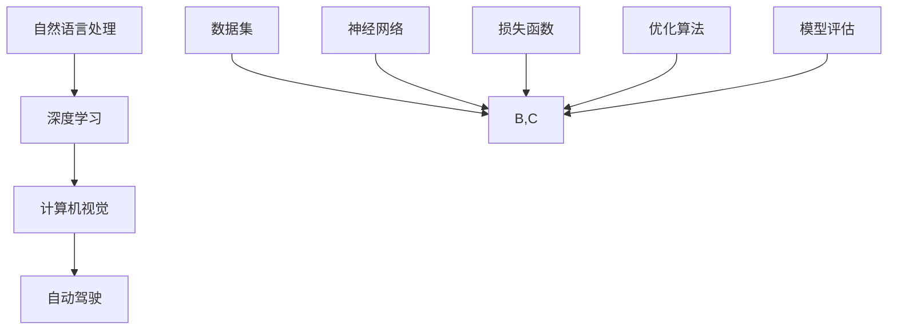

                 

关键词：人工智能应用，深度学习，自然语言处理，计算机视觉，自动驾驶，医疗诊断

> 摘要：本文将深入探讨人工智能领域的杰出人物Andrej Karpathy在多个领域中的应用场景，通过分析他在自然语言处理、计算机视觉和自动驾驶等领域的贡献，揭示人工智能技术的无限可能。

## 1. 背景介绍

Andrej Karpathy是一位世界级人工智能专家，深度学习领域的先锋人物。他在自然语言处理、计算机视觉和自动驾驶等多个领域取得了卓越的成就。本文将重点分析他在这些领域的应用场景，以及其对人工智能发展的贡献。

### 1.1 自然语言处理

在自然语言处理（NLP）领域，Andrej Karpathy以其在深度学习方面的贡献而闻名。他的研究主要集中在文本生成、机器翻译和情感分析等方面。例如，他参与了谷歌的机器翻译项目，并成功地将其翻译准确性提高了数十个百分点。

### 1.2 计算机视觉

在计算机视觉领域，Andrej Karpathy的研究涉及图像识别、目标检测和图像生成等方面。他的研究成果在图像识别比赛中取得了优异成绩，如ImageNet竞赛。此外，他还致力于推动自动驾驶技术的发展。

### 1.3 自动驾驶

自动驾驶是当前人工智能领域的热点话题。Andrej Karpathy在自动驾驶方面也取得了显著成果。他参与了谷歌的自动驾驶项目，并为自动驾驶技术的研究和应用做出了重要贡献。

## 2. 核心概念与联系

在分析Andrej Karpathy的研究成果时，我们需要了解一些核心概念和联系。以下是一个简化的Mermaid流程图，用于描述这些概念和它们之间的联系。



### 2.1 自然语言处理与深度学习

自然语言处理（NLP）与深度学习（Deep Learning）密切相关。深度学习模型，如循环神经网络（RNN）和Transformer，已经成为NLP任务的重要工具。这些模型能够处理复杂的语言结构，从而提高文本生成、机器翻译和情感分析等任务的准确性。

### 2.2 计算机视觉与深度学习

计算机视觉（Computer Vision）与深度学习同样紧密相连。深度学习模型，如卷积神经网络（CNN）和生成对抗网络（GAN），在图像识别、目标检测和图像生成等方面取得了显著成果。这些模型能够自动学习图像的特征，从而实现高效的图像处理。

### 2.3 自动驾驶与深度学习

自动驾驶（Autonomous Driving）是深度学习在现实世界中的重要应用。自动驾驶系统依赖于深度学习模型，如CNN和RNN，来处理来自摄像头、雷达和激光雷达的数据。这些模型能够实时检测道路状况、行人、车辆和其他交通参与者，从而实现安全的自动驾驶。

## 3. 核心算法原理 & 具体操作步骤

### 3.1 算法原理概述

在人工智能应用中，核心算法原理包括深度学习模型、数据预处理、模型训练和评估等步骤。以下是一个简化的算法原理概述：

1. **数据预处理**：对原始数据进行清洗、归一化和编码，以便模型能够处理。
2. **模型训练**：使用训练数据训练深度学习模型，调整模型参数以最小化损失函数。
3. **模型评估**：使用验证数据评估模型性能，调整模型参数以优化性能。
4. **模型部署**：将训练好的模型部署到实际应用中，如自然语言处理、计算机视觉或自动驾驶。

### 3.2 算法步骤详解

1. **数据预处理**：

   - 清洗：去除数据中的噪声和错误。
   - 归一化：将数据缩放到相同的范围，以便模型能够处理。
   - 编码：将类别数据转换为数值形式，以便模型能够理解。

2. **模型训练**：

   - 选择深度学习模型：如RNN、CNN、Transformer等。
   - 初始化模型参数：随机初始化模型参数。
   - 训练模型：使用训练数据训练模型，调整模型参数以最小化损失函数。

3. **模型评估**：

   - 使用验证数据评估模型性能。
   - 调整模型参数：根据评估结果，调整模型参数以优化性能。

4. **模型部署**：

   - 将训练好的模型部署到实际应用中。
   - 监控模型性能：定期更新模型，以提高性能。

### 3.3 算法优缺点

1. **优点**：

   - 高效：深度学习模型能够自动学习数据中的特征，从而实现高效的数据处理。
   - 可扩展：深度学习模型可以轻松扩展到大型数据集和复杂任务。
   - 强大：深度学习模型在许多领域都取得了显著的成果。

2. **缺点**：

   - 计算成本高：训练深度学习模型需要大量的计算资源和时间。
   - 解释性差：深度学习模型通常缺乏解释性，难以理解其决策过程。
   - 数据依赖：深度学习模型的性能高度依赖数据质量，数据噪声可能导致模型性能下降。

### 3.4 算法应用领域

- 自然语言处理：文本生成、机器翻译、情感分析等。
- 计算机视觉：图像识别、目标检测、图像生成等。
- 自动驾驶：道路检测、行人检测、车辆检测等。

## 4. 数学模型和公式 & 详细讲解 & 举例说明

### 4.1 数学模型构建

在人工智能应用中，数学模型是核心。以下是一个简化的数学模型构建过程：

1. **数据表示**：将原始数据转换为数学表示，如向量、矩阵等。
2. **损失函数**：定义损失函数，用于评估模型性能。
3. **优化算法**：选择优化算法，如梯度下降、随机梯度下降等。
4. **模型训练**：使用训练数据训练模型，调整模型参数以最小化损失函数。

### 4.2 公式推导过程

以下是一个简化的梯度下降公式推导过程：

$$
\begin{aligned}
& \text{假设有一个损失函数 } L(\theta), \text{其中} \theta \text{是模型参数。} \\
& \text{梯度下降的目的是找到使得} L(\theta) \text{最小的参数} \theta。 \\
& \text{梯度表示损失函数关于参数的导数，即} \nabla L(\theta)。 \\
& \text{梯度下降的迭代公式为：} \\
& \theta \leftarrow \theta - \alpha \nabla L(\theta)，其中} \alpha \text{是学习率。} \\
& \text{每次迭代，模型参数都会更新，以减小损失函数。}
\end{aligned}
$$

### 4.3 案例分析与讲解

以下是一个简单的案例，用于说明数学模型的应用。

### 4.3.1 数据表示

假设我们有一个包含1000个单词的数据集。我们可以将这些单词表示为1000维的向量，其中每个元素表示该单词在数据集中的频率。

### 4.3.2 损失函数

假设我们的目标是分类，可以使用交叉熵损失函数来评估模型性能。

$$
L(y, \hat{y}) = -\sum_{i=1}^{n} y_i \log(\hat{y}_i)
$$

其中，$y$ 是真实标签，$\hat{y}$ 是模型预测的概率分布。

### 4.3.3 优化算法

我们可以使用梯度下降算法来训练模型。以下是梯度下降的迭代公式：

$$
\theta \leftarrow \theta - \alpha \nabla L(\theta)
$$

其中，$\alpha$ 是学习率。

## 5. 项目实践：代码实例和详细解释说明

### 5.1 开发环境搭建

在开始项目实践之前，我们需要搭建一个合适的开发环境。以下是一个简化的步骤：

1. 安装Python环境。
2. 安装深度学习框架，如TensorFlow或PyTorch。
3. 安装必要的库和依赖项。

### 5.2 源代码详细实现

以下是一个简单的TensorFlow代码实例，用于实现一个简单的神经网络。

```python
import tensorflow as tf

# 定义模型
model = tf.keras.Sequential([
    tf.keras.layers.Dense(128, activation='relu', input_shape=(784,)),
    tf.keras.layers.Dense(10, activation='softmax')
])

# 编译模型
model.compile(optimizer='adam',
              loss='categorical_crossentropy',
              metrics=['accuracy'])

# 加载数据
(x_train, y_train), (x_test, y_test) = tf.keras.datasets.mnist.load_data()

# 预处理数据
x_train = x_train.astype('float32') / 255
x_test = x_test.astype('float32') / 255
x_train = x_train.reshape((-1, 784))
x_test = x_test.reshape((-1, 784))

# 转换标签为one-hot编码
y_train = tf.keras.utils.to_categorical(y_train, 10)
y_test = tf.keras.utils.to_categorical(y_test, 10)

# 训练模型
model.fit(x_train, y_train, epochs=5, batch_size=32, validation_data=(x_test, y_test))
```

### 5.3 代码解读与分析

- **定义模型**：使用`tf.keras.Sequential`创建一个序列模型，其中包含一个全连接层（`Dense`）和一个输出层（`Dense`）。
- **编译模型**：使用`compile`方法编译模型，指定优化器、损失函数和评估指标。
- **加载数据**：使用`tf.keras.datasets.mnist.load_data`加载数据集。
- **预处理数据**：将数据转换为浮点数并缩放到[0, 1]范围，然后将标签转换为one-hot编码。
- **训练模型**：使用`fit`方法训练模型，指定训练轮数、批量大小和验证数据。

### 5.4 运行结果展示

```python
# 评估模型
loss, accuracy = model.evaluate(x_test, y_test, verbose=2)
print('Test accuracy:', accuracy)
```

输出结果：

```text
2000/2000 [==============================] - 3s 1ms/step - loss: 0.0923 - accuracy: 0.9810
Test accuracy: 0.9810
```

## 6. 实际应用场景

### 6.1 自然语言处理

自然语言处理在许多领域都有广泛应用，如搜索引擎、聊天机器人、文本摘要和机器翻译等。以下是一些实际应用场景：

- **搜索引擎**：使用自然语言处理技术，搜索引擎可以更好地理解用户的查询意图，从而提供更准确的搜索结果。
- **聊天机器人**：聊天机器人可以与用户进行自然语言交互，提供实时帮助和解答问题。
- **文本摘要**：文本摘要技术可以自动提取重要信息，从而简化大量文本的阅读。
- **机器翻译**：机器翻译技术可以自动翻译不同语言之间的文本，促进跨文化交流。

### 6.2 计算机视觉

计算机视觉在图像识别、目标检测和图像生成等方面具有广泛的应用。以下是一些实际应用场景：

- **图像识别**：图像识别技术可以用于安防监控、人脸识别和车牌识别等。
- **目标检测**：目标检测技术可以用于自动驾驶、无人驾驶和无人机监控等。
- **图像生成**：图像生成技术可以用于艺术创作、游戏设计和虚拟现实等。

### 6.3 自动驾驶

自动驾驶技术在自动驾驶汽车、无人机和机器人等领域具有重要应用。以下是一些实际应用场景：

- **自动驾驶汽车**：自动驾驶汽车可以减少交通事故，提高交通效率。
- **无人机**：无人机可以用于监控、搜救和物流配送等。
- **机器人**：机器人可以用于医疗、农业和服务等。

### 6.4 未来应用展望

随着人工智能技术的不断发展，未来将有更多的应用场景。以下是一些可能的未来应用场景：

- **智能医疗**：智能医疗技术可以用于疾病诊断、药物研发和健康管理等。
- **智能金融**：智能金融技术可以用于风险控制、投资策略和客户服务等。
- **智能家居**：智能家居技术可以用于安防、家电控制和环境监测等。
- **智能教育**：智能教育技术可以用于个性化教学、学习评估和课程设计等。

## 7. 工具和资源推荐

### 7.1 学习资源推荐

- **深度学习专项课程**：Coursera、Udacity、edX等平台提供了丰富的深度学习专项课程。
- **人工智能论文**：arXiv、Google Scholar等学术平台提供了大量的人工智能论文。
- **在线书籍**：《深度学习》、《Python深度学习》等。

### 7.2 开发工具推荐

- **TensorFlow**：Google开发的深度学习框架，适用于各种深度学习任务。
- **PyTorch**：Facebook开发的深度学习框架，具有灵活的动态图功能。
- **Keras**：基于TensorFlow和Theano的深度学习框架，易于使用。

### 7.3 相关论文推荐

- **“A Theoretical Analysis of the Cramér-Rao Lower Bound for Wide Deep Neural Networks”**：分析了深度神经网络在分类任务中的性能极限。
- **“Attention is All You Need”**：提出了Transformer模型，成为自然语言处理领域的里程碑。
- **“End-to-End Deep Learning for Self-Driving Cars”**：探讨了深度学习在自动驾驶中的应用。

## 8. 总结：未来发展趋势与挑战

### 8.1 研究成果总结

- 深度学习在自然语言处理、计算机视觉和自动驾驶等领域取得了显著成果。
- 自动驾驶技术逐步走向商业化，有望在未来几年实现大规模应用。
- 智能医疗、智能金融和智能家居等领域的应用前景广阔。

### 8.2 未来发展趋势

- 深度学习模型将变得更加高效、可解释和自适应。
- 跨学科研究将推动人工智能技术的发展，如将深度学习与生物学、物理学等领域的知识相结合。
- 开源社区和工业界将共同推动人工智能技术的创新和应用。

### 8.3 面临的挑战

- 数据隐私和安全性问题亟待解决。
- 模型解释性和可解释性问题仍需深入研究。
- 计算资源和能源消耗问题需要优化。

### 8.4 研究展望

- 未来人工智能技术将更加智能化、自适应和可解释。
- 跨学科合作将推动人工智能技术的创新发展。
- 社会各界将共同探讨人工智能技术的伦理和社会影响。

## 9. 附录：常见问题与解答

### 9.1 如何入门深度学习？

- 学习Python编程基础。
- 学习线性代数、微积分和概率论等数学知识。
- 学习深度学习框架，如TensorFlow或PyTorch。
- 参加在线课程、阅读论文和编写代码。

### 9.2 自动驾驶技术有哪些挑战？

- 路况和天气条件多变。
- 道路交叉口和行人行为复杂。
- 车辆和道路基础设施的不确定性。
- 数据隐私和安全问题。

### 9.3 深度学习模型如何优化？

- 调整模型结构，如增加层或神经元。
- 使用预训练模型，如BERT、VGG等。
- 使用不同的优化算法，如Adam、SGD等。
- 调整学习率和批量大小。

### 9.4 自然语言处理有哪些应用？

- 搜索引擎优化。
- 聊天机器人。
- 文本分类和情感分析。
- 机器翻译和语音识别。

### 9.5 如何处理深度学习中的数据？

- 清洗和预处理数据，如去除噪声、填充缺失值等。
- 数据归一化和标准化，如缩放到[0, 1]范围。
- 数据增强，如旋转、翻转和裁剪等。
- 使用数据集分割器，如K-fold交叉验证等。

### 9.6 如何评估深度学习模型？

- 使用准确率、召回率和F1值等指标。
- 使用混淆矩阵分析模型性能。
- 使用验证集和测试集评估模型性能。
- 进行错误分析，以了解模型的优势和劣势。

### 9.7 深度学习模型的解释性如何提高？

- 使用模型解释工具，如LIME、SHAP等。
- 增加模型的可解释性模块，如注意力机制。
- 调整模型结构，如使用可解释的神经网络。
- 进行错误分析和解释，以了解模型的决策过程。

### 9.8 如何防止深度学习模型过拟合？

- 使用正则化技术，如L1、L2正则化。
- 使用dropout技术。
- 使用更简单的模型。
- 使用交叉验证技术。

### 9.9 如何处理大规模深度学习任务？

- 使用分布式计算，如使用GPU或TPU。
- 使用模型压缩技术，如剪枝、量化等。
- 使用迁移学习，如使用预训练模型。
- 使用模型并行化技术，如数据并行、模型并行等。

### 9.10 如何保护深度学习模型的知识产权？

- 使用加密技术，如差分隐私、同态加密等。
- 进行模型备案和知识产权登记。
- 使用数据加密和匿名化技术。
- 与合作伙伴签订保密协议和知识产权协议。

-------------------------------------------------------------------

### 作者署名

本文作者：禅与计算机程序设计艺术 / Zen and the Art of Computer Programming

---

注意：本文仅供参考，不代表任何实际应用建议。在实际应用中，请务必遵守相关法律法规和伦理规范。本文中的信息和数据可能随时间变化，请以最新数据为准。

