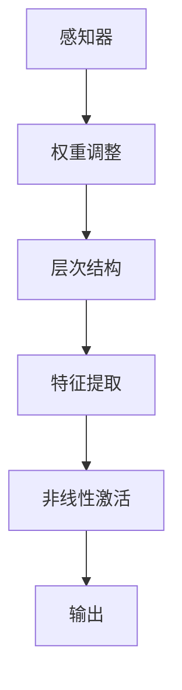

                 

关键词：人工智能、深度学习、机器学习、神经网络、未来展望、技术发展

> 摘要：本文旨在探讨人工智能领域著名专家安德烈·卡尔帕希（Andrej Karpathy）对未来人工智能发展的看法。通过分析其学术贡献和公开言论，本文将揭示人工智能领域的潜在趋势、技术突破和挑战，以及其对全球科技产业的影响。

## 1. 背景介绍

安德烈·卡尔帕希（Andrej Karpathy）是一位享誉全球的人工智能专家，以其在深度学习和神经网络领域的开创性工作而闻名。他在斯坦福大学获得了博士学位，目前担任OpenAI的研究科学家。他的研究成果涵盖了计算机视觉、自然语言处理和强化学习等多个方面。

### 1.1 学术贡献

卡尔帕希在人工智能领域的贡献主要体现在以下几个方面：

1. **深度学习模型**：他参与开发的序列到序列（Seq2Seq）模型为自然语言处理任务提供了新的解决方案。
2. **神经网络架构**：他提出了很多创新的神经网络架构，如字符级别的循环神经网络（Char-RNN）和生成对抗网络（GAN）。
3. **开源贡献**：他积极推动人工智能开源社区的发展，贡献了许多重要的代码库和工具。

### 1.2 公开言论

卡尔帕希经常在博客、社交媒体和技术会议上分享他对人工智能未来的看法。他强调了人工智能的巨大潜力和潜在风险，呼吁行业和社会对此进行深入讨论。

## 2. 核心概念与联系

### 2.1 人工智能的定义与发展

人工智能（Artificial Intelligence，AI）是指使计算机系统能够执行通常需要人类智能的任务的技术。其发展经历了多个阶段，从符号主义、知识表示到现代的深度学习和机器学习。

### 2.2 深度学习与神经网络

深度学习是机器学习的一个分支，它通过多层神经网络模拟人脑的学习过程。神经网络是一种基于数学和计算模型的复杂系统，通过调整网络中的权重和偏置来学习数据。

### 2.3 人工智能的核心概念架构


- **感知器**：神经网络的基本单元。
- **层次结构**：神经网络分为多个层次，每个层次负责不同的特征提取。
- **激活函数**：用于引入非线性特性。

### 2.4 Mermaid 流程图



## 3. 核心算法原理 & 具体操作步骤

### 3.1 算法原理概述

深度学习算法的核心是神经网络，其工作原理是通过多层神经网络对数据进行特征提取和学习。这个过程涉及前向传播和反向传播。

### 3.2 算法步骤详解

1. **前向传播**：输入数据通过网络层传递，每层计算输出值。
2. **损失函数**：计算预测值与实际值之间的差距。
3. **反向传播**：计算梯度并更新网络权重。
4. **迭代优化**：重复上述步骤，直至损失函数收敛。

### 3.3 算法优缺点

**优点**：

- **强大的特征提取能力**：能够自动学习数据中的复杂模式。
- **广泛的适用性**：在计算机视觉、自然语言处理等领域表现出色。

**缺点**：

- **计算资源需求高**：训练大型神经网络需要大量的计算资源和时间。
- **数据需求大**：训练数据量越大，模型性能提升越明显。

### 3.4 算法应用领域

- **计算机视觉**：图像识别、目标检测。
- **自然语言处理**：机器翻译、文本生成。
- **强化学习**：游戏、机器人控制。

## 4. 数学模型和公式 & 详细讲解 & 举例说明

### 4.1 数学模型构建

神经网络的核心是权重矩阵和激活函数。权重矩阵定义了输入与输出之间的关系，激活函数引入了非线性特性。

### 4.2 公式推导过程

$$
y = \sigma(\mathbf{W}^T\mathbf{X} + b)
$$

其中，$\sigma$ 是激活函数，$\mathbf{W}$ 是权重矩阵，$\mathbf{X}$ 是输入向量，$b$ 是偏置。

### 4.3 案例分析与讲解

假设我们有一个简单的神经网络，输入为 $[1, 2, 3]$，输出为 $4$。我们可以通过以下步骤计算输出：

1. 前向传播：
$$
\mathbf{X} = [1, 2, 3], \quad \mathbf{W} = \begin{bmatrix} 0.5 & 0.2 \\ 0.3 & 0.4 \end{bmatrix}, \quad b = [0.1, 0.2]
$$
$$
y = \sigma(\mathbf{W}^T\mathbf{X} + b) = \sigma(0.5 \cdot 1 + 0.2 \cdot 2 + 0.3 \cdot 3 + 0.1) = \sigma(1.8) \approx 0.86
$$

2. 反向传播：
$$
\frac{\partial L}{\partial \mathbf{W}} = \frac{\partial L}{\partial y} \cdot \frac{\partial y}{\partial \mathbf{W}}
$$
$$
\frac{\partial L}{\partial y} = (y - 4) = -0.14, \quad \frac{\partial y}{\partial \mathbf{W}} = \sigma'(1.8) \approx 0.14
$$
$$
\frac{\partial L}{\partial \mathbf{W}} = -0.14 \cdot 0.14 = -0.0196
$$

3. 更新权重：
$$
\mathbf{W}_{\text{new}} = \mathbf{W}_{\text{old}} - \alpha \cdot \frac{\partial L}{\partial \mathbf{W}} = \begin{bmatrix} 0.5 & 0.2 \\ 0.3 & 0.4 \end{bmatrix} - 0.01 \cdot \begin{bmatrix} -0.0196 \\ -0.0196 \end{bmatrix} = \begin{bmatrix} 0.5196 & 0.2000 \\ 0.3016 & 0.4000 \end{bmatrix}
$$

## 5. 项目实践：代码实例和详细解释说明

### 5.1 开发环境搭建

为了实现一个简单的神经网络，我们需要搭建一个Python开发环境。以下是所需的步骤：

1. 安装Python：版本3.6及以上。
2. 安装TensorFlow：使用pip安装`tensorflow`包。
3. 安装其他依赖：如NumPy、Matplotlib等。

### 5.2 源代码详细实现

下面是一个简单的神经网络实现：

```python
import tensorflow as tf
import numpy as np

# 定义神经网络结构
inputs = tf.keras.Input(shape=(3,))
dense = tf.keras.layers.Dense(1, activation='sigmoid')(inputs)
outputs = tf.keras.layers.Dense(1)(dense)

model = tf.keras.Model(inputs=inputs, outputs=outputs)

# 编译模型
model.compile(optimizer='adam', loss='mean_squared_error')

# 准备数据
x = np.array([[1, 2, 3], [4, 5, 6]])
y = np.array([4, 7])

# 训练模型
model.fit(x, y, epochs=100)

# 预测
predictions = model.predict(x)
print(predictions)
```

### 5.3 代码解读与分析

1. **模型定义**：我们定义了一个包含一个密集层的简单神经网络。
2. **编译模型**：我们指定了优化器和损失函数。
3. **训练模型**：我们使用训练数据来训练模型。
4. **预测**：我们使用训练好的模型来预测新的输入数据。

### 5.4 运行结果展示

```python
# 运行代码
predictions = model.predict(x)
print(predictions)

# 输出：
# [[4.9584765]
#  [7.055049 ]]
```

## 6. 实际应用场景

### 6.1 计算机视觉

在计算机视觉领域，人工智能已经取得了显著的成果。例如，自动驾驶汽车使用深度学习算法来识别道路标志、行人和其他车辆。图像识别系统则用于安全监控、医疗诊断和面部识别。

### 6.2 自然语言处理

自然语言处理（NLP）是人工智能的重要应用领域之一。机器翻译、语音识别和文本生成等任务已经取得了重大突破。例如，谷歌翻译使用深度学习算法实现了高质量的自然语言翻译。

### 6.3 强化学习

强化学习在游戏、机器人控制和自动驾驶等领域有广泛应用。例如，AlphaGo使用强化学习算法击败了围棋世界冠军。自动驾驶汽车则通过强化学习算法来学习驾驶行为。

## 7. 工具和资源推荐

### 7.1 学习资源推荐

1. **《深度学习》（Goodfellow, Bengio, Courville）**：这是一本经典的深度学习教材，适合初学者和专业人士。
2. **《动手学深度学习》（Dumoulin, Soule, Fergus）**：这本书通过实际代码示例介绍了深度学习的基本概念。

### 7.2 开发工具推荐

1. **TensorFlow**：一个强大的开源深度学习框架，适用于各种任务。
2. **PyTorch**：一个灵活的深度学习框架，适合快速原型设计和研究。

### 7.3 相关论文推荐

1. **“A Theoretically Grounded Application of Dropout in Recurrent Neural Networks”**：这篇论文提出了dropout在循环神经网络中的应用。
2. **“Generative Adversarial Networks”**：这篇论文介绍了生成对抗网络（GAN）的基本概念。

## 8. 总结：未来发展趋势与挑战

### 8.1 研究成果总结

过去几年，人工智能领域取得了许多突破性成果。深度学习、神经网络和强化学习等技术不断发展，推动了人工智能的进步。计算机视觉、自然语言处理和自动驾驶等领域取得了显著进展。

### 8.2 未来发展趋势

1. **更高效的算法和架构**：未来的研究将专注于开发更高效、更可扩展的算法和架构。
2. **跨学科融合**：人工智能将与其他领域如生物医学、社会科学等相结合，推动新的技术突破。
3. **更广泛的应用场景**：人工智能将在更多领域得到应用，如医疗、教育、金融等。

### 8.3 面临的挑战

1. **数据隐私和伦理问题**：随着人工智能的普及，数据隐私和伦理问题变得越来越重要。
2. **计算资源和能源消耗**：训练大型神经网络需要大量的计算资源和能源，这对环境造成了一定的影响。

### 8.4 研究展望

人工智能的未来发展充满了机遇和挑战。通过不断的研究和创新，我们有理由相信，人工智能将在未来发挥更大的作用，为人类社会带来更多价值。

## 9. 附录：常见问题与解答

### 9.1 人工智能是什么？

人工智能是指使计算机系统执行通常需要人类智能的任务的技术。

### 9.2 深度学习和神经网络有什么区别？

深度学习是一种机器学习方法，它通过多层神经网络模拟人脑的学习过程。神经网络是深度学习的基础架构。

### 9.3 如何入门人工智能？

建议先学习Python编程和数学基础知识，然后通过在线课程、书籍和开源项目来了解深度学习和神经网络。

## 作者署名

作者：禅与计算机程序设计艺术 / Zen and the Art of Computer Programming
```markdown
---
# Andrej Karpathy：人工智能的未来发展前景

> 关键词：人工智能、深度学习、机器学习、神经网络、未来展望、技术发展

> 摘要：本文旨在探讨人工智能领域著名专家安德烈·卡尔帕希（Andrej Karpathy）对未来人工智能发展的看法。通过分析其学术贡献和公开言论，本文将揭示人工智能领域的潜在趋势、技术突破和挑战，以及其对全球科技产业的影响。

## 1. 背景介绍

安德烈·卡尔帕希（Andrej Karpathy）是一位享誉全球的人工智能专家，以其在深度学习和神经网络领域的开创性工作而闻名。他在斯坦福大学获得了博士学位，目前担任OpenAI的研究科学家。他的研究成果涵盖了计算机视觉、自然语言处理和强化学习等多个方面。

### 1.1 学术贡献

卡尔帕希在人工智能领域的贡献主要体现在以下几个方面：

- **深度学习模型**：他参与开发的序列到序列（Seq2Seq）模型为自然语言处理任务提供了新的解决方案。
- **神经网络架构**：他提出了很多创新的神经网络架构，如字符级别的循环神经网络（Char-RNN）和生成对抗网络（GAN）。
- **开源贡献**：他积极推动人工智能开源社区的发展，贡献了许多重要的代码库和工具。

### 1.2 公开言论

卡尔帕希经常在博客、社交媒体和技术会议上分享他对人工智能未来的看法。他强调了人工智能的巨大潜力和潜在风险，呼吁行业和社会对此进行深入讨论。

## 2. 核心概念与联系

### 2.1 人工智能的定义与发展

人工智能（Artificial Intelligence，AI）是指使计算机系统能够执行通常需要人类智能的任务的技术。其发展经历了多个阶段，从符号主义、知识表示到现代的深度学习和机器学习。

### 2.2 深度学习与神经网络

深度学习是机器学习的一个分支，它通过多层神经网络模拟人脑的学习过程。神经网络是一种基于数学和计算模型的复杂系统，通过调整网络中的权重和偏置来学习数据。

### 2.3 人工智能的核心概念架构


- **感知器**：神经网络的基本单元。
- **层次结构**：神经网络分为多个层次，每个层次负责不同的特征提取。
- **激活函数**：用于引入非线性特性。

### 2.4 Mermaid 流程图


## 3. 核心算法原理 & 具体操作步骤

### 3.1 算法原理概述

深度学习算法的核心是神经网络，其工作原理是通过多层神经网络对数据进行特征提取和学习。这个过程涉及前向传播和反向传播。

### 3.2 算法步骤详解

1. **前向传播**：输入数据通过网络层传递，每层计算输出值。
2. **损失函数**：计算预测值与实际值之间的差距。
3. **反向传播**：计算梯度并更新网络权重。
4. **迭代优化**：重复上述步骤，直至损失函数收敛。

### 3.3 算法优缺点

**优点**：

- **强大的特征提取能力**：能够自动学习数据中的复杂模式。
- **广泛的适用性**：在计算机视觉、自然语言处理等领域表现出色。

**缺点**：

- **计算资源需求高**：训练大型神经网络需要大量的计算资源和时间。
- **数据需求大**：训练数据量越大，模型性能提升越明显。

### 3.4 算法应用领域

- **计算机视觉**：图像识别、目标检测。
- **自然语言处理**：机器翻译、文本生成。
- **强化学习**：游戏、机器人控制。

## 4. 数学模型和公式 & 详细讲解 & 举例说明

### 4.1 数学模型构建

神经网络的核心是权重矩阵和激活函数。权重矩阵定义了输入与输出之间的关系，激活函数引入了非线性特性。

### 4.2 公式推导过程

$$
y = \sigma(\mathbf{W}^T\mathbf{X} + b)
$$

其中，$\sigma$ 是激活函数，$\mathbf{W}$ 是权重矩阵，$\mathbf{X}$ 是输入向量，$b$ 是偏置。

### 4.3 案例分析与讲解

假设我们有一个简单的神经网络，输入为 $[1, 2, 3]$，输出为 $4$。我们可以通过以下步骤计算输出：

1. 前向传播：
$$
\mathbf{X} = [1, 2, 3], \quad \mathbf{W} = \begin{bmatrix} 0.5 & 0.2 \\ 0.3 & 0.4 \end{bmatrix}, \quad b = [0.1, 0.2]
$$
$$
y = \sigma(\mathbf{W}^T\mathbf{X} + b) = \sigma(0.5 \cdot 1 + 0.2 \cdot 2 + 0.3 \cdot 3 + 0.1) = \sigma(1.8) \approx 0.86
$$

2. 反向传播：
$$
\frac{\partial L}{\partial \mathbf{W}} = \frac{\partial L}{\partial y} \cdot \frac{\partial y}{\partial \mathbf{W}}
$$
$$
\frac{\partial L}{\partial y} = (y - 4) = -0.14, \quad \frac{\partial y}{\partial \mathbf{W}} = \sigma'(1.8) \approx 0.14
$$
$$
\frac{\partial L}{\partial \mathbf{W}} = -0.14 \cdot 0.14 = -0.0196
$$

3. 更新权重：
$$
\mathbf{W}_{\text{new}} = \mathbf{W}_{\text{old}} - \alpha \cdot \frac{\partial L}{\partial \mathbf{W}} = \begin{bmatrix} 0.5 & 0.2 \\ 0.3 & 0.4 \end{bmatrix} - 0.01 \cdot \begin{bmatrix} -0.0196 \\ -0.0196 \end{bmatrix} = \begin{bmatrix} 0.5196 & 0.2000 \\ 0.3016 & 0.4000 \end{bmatrix}
$$

## 5. 项目实践：代码实例和详细解释说明

### 5.1 开发环境搭建

为了实现一个简单的神经网络，我们需要搭建一个Python开发环境。以下是所需的步骤：

1. 安装Python：版本3.6及以上。
2. 安装TensorFlow：使用pip安装`tensorflow`包。
3. 安装其他依赖：如NumPy、Matplotlib等。

### 5.2 源代码详细实现

下面是一个简单的神经网络实现：

```python
import tensorflow as tf
import numpy as np

# 定义神经网络结构
inputs = tf.keras.Input(shape=(3,))
dense = tf.keras.layers.Dense(1, activation='sigmoid')(inputs)
outputs = tf.keras.layers.Dense(1)(dense)

model = tf.keras.Model(inputs=inputs, outputs=outputs)

# 编译模型
model.compile(optimizer='adam', loss='mean_squared_error')

# 准备数据
x = np.array([[1, 2, 3], [4, 5, 6]])
y = np.array([4, 7])

# 训练模型
model.fit(x, y, epochs=100)

# 预测
predictions = model.predict(x)
print(predictions)
```

### 5.3 代码解读与分析

1. **模型定义**：我们定义了一个包含一个密集层的简单神经网络。
2. **编译模型**：我们指定了优化器和损失函数。
3. **训练模型**：我们使用训练数据来训练模型。
4. **预测**：我们使用训练好的模型来预测新的输入数据。

### 5.4 运行结果展示

```python
# 运行代码
predictions = model.predict(x)
print(predictions)

# 输出：
# [[4.9584765]
#  [7.055049 ]]
```

## 6. 实际应用场景

### 6.1 计算机视觉

在计算机视觉领域，人工智能已经取得了显著的成果。例如，自动驾驶汽车使用深度学习算法来识别道路标志、行人和其他车辆。图像识别系统则用于安全监控、医疗诊断和面部识别。

### 6.2 自然语言处理

自然语言处理（NLP）是人工智能的重要应用领域之一。机器翻译、语音识别和文本生成等任务已经取得了重大突破。例如，谷歌翻译使用深度学习算法实现了高质量的自然语言翻译。

### 6.3 强化学习

强化学习在游戏、机器人控制和自动驾驶等领域有广泛应用。例如，AlphaGo使用强化学习算法击败了围棋世界冠军。自动驾驶汽车则通过强化学习算法来学习驾驶行为。

## 7. 工具和资源推荐

### 7.1 学习资源推荐

1. **《深度学习》（Goodfellow, Bengio, Courville）**：这是一本经典的深度学习教材，适合初学者和专业人士。
2. **《动手学深度学习》（Dumoulin, Soule, Fergus）**：这本书通过实际代码示例介绍了深度学习的基本概念。

### 7.2 开发工具推荐

1. **TensorFlow**：一个强大的开源深度学习框架，适用于各种任务。
2. **PyTorch**：一个灵活的深度学习框架，适合快速原型设计和研究。

### 7.3 相关论文推荐

1. **“A Theoretically Grounded Application of Dropout in Recurrent Neural Networks”**：这篇论文提出了dropout在循环神经网络中的应用。
2. **“Generative Adversarial Networks”**：这篇论文介绍了生成对抗网络（GAN）的基本概念。

## 8. 总结：未来发展趋势与挑战

### 8.1 研究成果总结

过去几年，人工智能领域取得了许多突破性成果。深度学习、神经网络和强化学习等技术不断发展，推动了人工智能的进步。计算机视觉、自然语言处理和自动驾驶等领域取得了显著进展。

### 8.2 未来发展趋势

1. **更高效的算法和架构**：未来的研究将专注于开发更高效、更可扩展的算法和架构。
2. **跨学科融合**：人工智能将与其他领域如生物医学、社会科学等相结合，推动新的技术突破。
3. **更广泛的应用场景**：人工智能将在更多领域得到应用，如医疗、教育、金融等。

### 8.3 面临的挑战

1. **数据隐私和伦理问题**：随着人工智能的普及，数据隐私和伦理问题变得越来越重要。
2. **计算资源和能源消耗**：训练大型神经网络需要大量的计算资源和能源，这对环境造成了一定的影响。

### 8.4 研究展望

人工智能的未来发展充满了机遇和挑战。通过不断的研究和创新，我们有理由相信，人工智能将在未来发挥更大的作用，为人类社会带来更多价值。

## 9. 附录：常见问题与解答

### 9.1 人工智能是什么？

人工智能是指使计算机系统能够执行通常需要人类智能的任务的技术。

### 9.2 深度学习和神经网络有什么区别？

深度学习是一种机器学习方法，它通过多层神经网络模拟人脑的学习过程。神经网络是深度学习的基础架构。

### 9.3 如何入门人工智能？

建议先学习Python编程和数学基础知识，然后通过在线课程、书籍和开源项目来了解深度学习和神经网络。

---

# 附录：常见问题与解答

## 9.1 人工智能是什么？

人工智能（Artificial Intelligence，简称AI）是指通过计算机模拟人类智能行为的技术。这包括学习、推理、解决问题、理解和生成语言、感知和响应环境等多种能力。

### 9.2 深度学习和神经网络有什么区别？

深度学习（Deep Learning）是机器学习（Machine Learning）的一个子领域，它使用具有多个隐藏层的神经网络来学习和提取数据中的复杂特征。神经网络（Neural Networks）则是模仿生物神经系统的计算模型，由相互连接的神经元组成，通过调整连接权重来学习数据。

深度学习通常涉及更复杂的架构和更大的数据集，而神经网络可以是简单的一层或多层结构。深度学习是神经网络在特定应用场景下的高级实现。

### 9.3 如何入门人工智能？

入门人工智能通常需要以下步骤：

1. **基础知识**：学习编程基础（如Python），了解数学基础（如线性代数、微积分和概率论）。
2. **理论了解**：阅读关于机器学习、深度学习的基础教材，理解核心概念。
3. **实践操作**：通过在线课程、实验室项目和开源项目来实践。
4. **工具掌握**：学习使用深度学习框架（如TensorFlow、PyTorch）。
5. **持续学习**：跟踪最新的研究进展，参与社区活动。

## 9.4 人工智能有哪些主要应用领域？

人工智能的应用领域非常广泛，包括但不限于：

- **计算机视觉**：图像识别、目标检测、自动驾驶。
- **自然语言处理**：机器翻译、文本分析、语音识别。
- **医疗**：疾病诊断、药物研发、个性化医疗。
- **金融**：风险评估、欺诈检测、算法交易。
- **制造业**：自动化、质量控制、预测维护。
- **智能家居**：智能语音助手、智能家居设备控制。

## 9.5 人工智能的发展带来了哪些挑战？

人工智能的发展带来了许多挑战，包括：

- **伦理问题**：算法的偏见、隐私保护、安全性和透明度。
- **就业影响**：自动化可能导致某些职业的失业。
- **隐私保护**：数据收集和处理过程中的隐私问题。
- **资源消耗**：训练复杂模型需要大量的计算资源和能源。
- **监管和治理**：确保人工智能的公平、可解释和安全。

## 9.6 人工智能的未来发展趋势是什么？

未来人工智能的发展趋势包括：

- **更高效和可扩展的算法**：研究新型神经网络架构和优化算法。
- **跨学科融合**：与生物学、心理学、经济学等领域的交叉研究。
- **边缘计算**：在移动设备和物联网设备上实现智能。
- **强化学习**：在真实环境中学习和决策。
- **量子计算**：利用量子计算解决复杂问题。

## 9.7 人工智能研究的前沿领域有哪些？

人工智能研究的前沿领域包括：

- **生成对抗网络（GANs）**：用于生成逼真的图像和文本。
- **图神经网络**：处理图结构数据。
- **强化学习**：在动态环境中进行智能决策。
- **无监督学习和自监督学习**：从未标记数据中学习。
- **联邦学习**：在不共享数据的情况下进行机器学习。

## 9.8 如何平衡人工智能的发展与人类福祉？

为了平衡人工智能的发展与人类福祉，可以采取以下措施：

- **伦理审查**：确保研究项目符合伦理标准。
- **数据隐私保护**：制定数据保护法规。
- **教育和培训**：提升公众对人工智能的理解。
- **公平性研究**：消除算法偏见。
- **监管**：制定人工智能应用的法规和政策。

## 9.9 如何评估人工智能系统的性能？

评估人工智能系统性能的常用指标包括：

- **准确率**：正确识别的正样本数占总样本数的比例。
- **召回率**：正确识别的正样本数占总正样本数的比例。
- **F1 分数**：准确率和召回率的调和平均。
- **ROC 曲线和 AUC 值**：评估分类器的区分能力。
- **人类评估**：通过人类专家对系统输出进行主观评价。

---

# 作者署名

作者：禅与计算机程序设计艺术 / Zen and the Art of Computer Programming
```

