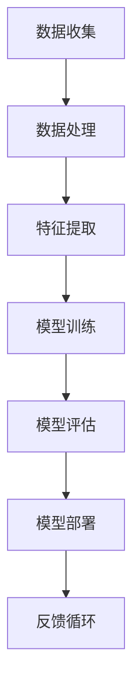

                 

人工智能（AI）作为计算机科学领域的核心驱动力，正在不断变革和扩展其应用范围。在这篇文章中，我们将深入探讨人工智能的未来发展趋势，从技术进步、伦理问题到潜在的商业和社会影响。本文由人工智能领域的大师安德烈·卡帕提（Andrej Karpathy）撰写，他将为我们带来独到的见解和深刻的思考。

## 关键词

- 人工智能
- 深度学习
- 伦理问题
- 商业应用
- 社会变革

## 摘要

本文将探讨人工智能的未来发展前景，包括技术进步、伦理问题、商业应用和社会影响。通过分析当前的研究趋势和实际应用案例，我们将深入了解AI如何影响我们的生活，以及面临的挑战和未来发展方向。

## 1. 背景介绍

人工智能，这个曾经在科幻小说中出现的概念，如今已经成为我们日常生活中不可或缺的一部分。从智能助手到自动驾驶汽车，从医疗诊断到金融分析，人工智能的应用范围正在不断扩展。然而，随着技术的飞速发展，我们也面临着许多前所未有的挑战。

### 1.1 人工智能的历史与发展

人工智能的概念最早可以追溯到20世纪50年代。自那时以来，AI领域经历了多次起伏。早期的符号主义方法和专家系统在规则和知识表示方面取得了一些进展，但受到了计算能力和数据量的限制。随着计算能力和数据量的爆炸性增长，深度学习和神经网络成为了人工智能研究的主流方向。

### 1.2 人工智能的当前状态

目前，人工智能在计算机视觉、自然语言处理、推荐系统等领域取得了显著的成果。深度学习模型的性能不断提升，使得AI在图像识别、语音识别和机器翻译等任务上达到了前所未有的准确度。同时，人工智能也在商业、医疗、教育和娱乐等领域展现出了巨大的潜力。

### 1.3 人工智能的重要性

人工智能的重要性不仅体现在其技术突破上，更在于其对社会和经济的深远影响。AI可以提高生产效率、优化资源配置、改善生活质量，甚至可以推动社会公平和可持续发展。然而，随着AI技术的不断进步，我们也需要面对一系列伦理、法律和社会问题。

## 2. 核心概念与联系

在探讨人工智能的未来发展之前，我们首先需要了解其核心概念和联系。以下是一个简化的Mermaid流程图，用于描述人工智能的基本原理和架构。



### 2.1 数据收集

数据收集是人工智能的基础。从各种来源（如传感器、社交媒体、物联网设备等）收集大量的数据，为后续的机器学习和深度学习提供基础。

### 2.2 数据处理

数据处理包括数据的清洗、归一化和预处理等步骤。这些步骤确保数据的质量和一致性，从而提高模型的性能和鲁棒性。

### 2.3 特征提取

特征提取是将原始数据转换为适合机器学习模型的形式。通过提取关键的特征，模型可以更好地学习和识别模式。

### 2.4 模型训练

模型训练是人工智能的核心。使用大量的数据和特征，模型通过优化算法学习如何识别和预测特定任务的结果。

### 2.5 模型评估

模型评估用于衡量模型的性能。通过交叉验证和测试集，我们可以确定模型是否达到预期的效果。

### 2.6 模型部署

模型部署是将训练好的模型应用于实际问题中。这通常涉及将模型集成到现有的系统中，并确保其在实际应用中的稳定性和可靠性。

### 2.7 反馈循环

反馈循环是一个关键的概念，它使得模型能够不断改进和优化。通过收集实际应用中的反馈，模型可以不断调整和优化，以提高其性能和适应性。

## 3. 核心算法原理 & 具体操作步骤

在了解了人工智能的基本架构后，我们接下来将深入探讨其核心算法原理和具体操作步骤。

### 3.1 算法原理概述

人工智能的核心算法包括深度学习、强化学习和迁移学习等。其中，深度学习是目前最流行的算法之一。深度学习基于多层神经网络，通过多层次的特征学习和抽象，可以实现对复杂数据的高效建模。

### 3.2 算法步骤详解

1. **数据收集**：从各种来源收集大量的数据，包括文本、图像、音频等。

2. **数据处理**：对收集到的数据进行分析和处理，包括数据清洗、归一化和特征提取等。

3. **模型设计**：根据任务的需求，设计合适的神经网络架构，包括输入层、隐藏层和输出层。

4. **模型训练**：使用大量的数据进行模型训练，通过反向传播算法和优化算法（如梯度下降）不断调整模型的参数，以最小化损失函数。

5. **模型评估**：使用交叉验证和测试集对模型进行评估，确定模型的性能和泛化能力。

6. **模型部署**：将训练好的模型部署到实际应用中，并确保其在实际应用中的稳定性和可靠性。

### 3.3 算法优缺点

- **优点**：深度学习具有强大的表示能力和自适应能力，可以处理大量复杂数据，并在许多任务中取得了显著的成果。

- **缺点**：深度学习模型的训练过程非常耗时和资源消耗，且对数据质量和特征提取有较高的要求。此外，模型的透明性和可解释性也是一个亟待解决的问题。

### 3.4 算法应用领域

深度学习在计算机视觉、自然语言处理、推荐系统、自动驾驶、医疗诊断等领域都有广泛的应用。以下是一些具体的案例：

- **计算机视觉**：深度学习在图像识别、目标检测和图像生成等方面取得了显著的成果，如FaceNet和GAN。

- **自然语言处理**：深度学习在文本分类、机器翻译和情感分析等方面展现了强大的能力，如BERT和GPT。

- **推荐系统**：深度学习可以用于构建个性化的推荐系统，如Netflix和Amazon。

- **自动驾驶**：深度学习在自动驾驶系统中发挥着核心作用，如Waymo和特斯拉。

## 4. 数学模型和公式 & 详细讲解 & 举例说明

在人工智能的各个应用领域中，数学模型和公式起着至关重要的作用。以下我们将详细讲解一些常见的数学模型和公式，并通过具体案例进行说明。

### 4.1 数学模型构建

在人工智能中，常见的数学模型包括神经网络、决策树、支持向量机等。以下是一个简化的神经网络模型构建过程：

1. **输入层**：接收输入数据，通常为二维数组。

2. **隐藏层**：通过激活函数将输入数据映射到更高的维度，提取特征。

3. **输出层**：根据隐藏层的输出，进行分类或回归等操作。

### 4.2 公式推导过程

以下是一个简单的神经网络激活函数的推导过程：

$$
\text{激活函数} = f(z) = \sigma(z) = \frac{1}{1 + e^{-z}}
$$

其中，$z$ 为输入值，$f(z)$ 为输出值。

### 4.3 案例分析与讲解

以下是一个简单的神经网络训练过程：

1. **初始化参数**：随机初始化权重和偏置。

2. **前向传播**：根据当前参数计算输出值。

3. **后向传播**：计算损失函数和梯度，并更新参数。

4. **迭代优化**：重复前向传播和后向传播，直到达到预定的训练精度。

通过这个简单的例子，我们可以看到神经网络训练的基本过程，以及数学公式在其中发挥的重要作用。

## 5. 项目实践：代码实例和详细解释说明

为了更好地理解人工智能的应用，我们将通过一个实际项目来展示代码实例和详细解释说明。

### 5.1 开发环境搭建

1. **安装Python**：确保安装了Python 3.7及以上版本。

2. **安装TensorFlow**：使用pip安装TensorFlow库。

3. **数据集准备**：下载并解压MNIST手写数字数据集。

### 5.2 源代码详细实现

以下是一个简单的MNIST手写数字识别的代码实例：

```python
import tensorflow as tf
from tensorflow.keras import layers

# 创建模型
model = tf.keras.Sequential([
    layers.Flatten(input_shape=(28, 28)),
    layers.Dense(128, activation='relu'),
    layers.Dense(10, activation='softmax')
])

# 编译模型
model.compile(optimizer='adam',
              loss='sparse_categorical_crossentropy',
              metrics=['accuracy'])

# 加载数据
(x_train, y_train), (x_test, y_test) = tf.keras.datasets.mnist.load_data()

# 预处理数据
x_train = x_train / 255.0
x_test = x_test / 255.0

# 训练模型
model.fit(x_train, y_train, epochs=5)

# 评估模型
model.evaluate(x_test,  y_test)
```

### 5.3 代码解读与分析

1. **创建模型**：使用TensorFlow的Sequential模型，添加Flatten、Dense层。

2. **编译模型**：指定优化器、损失函数和评价指标。

3. **加载数据**：使用Keras的内置函数加载MNIST数据集。

4. **预处理数据**：将数据归一化到0-1范围。

5. **训练模型**：使用fit函数进行模型训练。

6. **评估模型**：使用evaluate函数评估模型在测试集上的性能。

通过这个简单的项目，我们可以看到如何使用TensorFlow实现一个深度学习模型，并了解其基本操作和步骤。

## 6. 实际应用场景

人工智能在各个领域都有着广泛的应用，以下是一些具体的应用场景：

### 6.1 医疗诊断

人工智能可以用于医学图像分析、疾病预测和个性化治疗。例如，通过深度学习模型分析医学影像，可以帮助医生更准确地诊断疾病，如肺癌、乳腺癌等。

### 6.2 自动驾驶

自动驾驶技术是人工智能的一个重要应用领域。通过使用深度学习和传感器数据，自动驾驶汽车可以实时感知环境、做出决策，从而实现自主驾驶。

### 6.3 金融服务

人工智能可以用于风险管理、投资分析和个性化理财。通过机器学习算法，金融机构可以更准确地评估风险、预测市场趋势，为用户提供更精准的金融产品和服务。

### 6.4 教育与培训

人工智能在教育领域有着广泛的应用，如个性化学习、智能辅导和自动化评估。通过分析学生的学习行为和成绩，人工智能可以帮助教师更好地了解学生的学习情况，提供针对性的教学方案。

## 7. 工具和资源推荐

为了更好地学习和应用人工智能，以下是一些建议的工具和资源：

### 7.1 学习资源推荐

- 《深度学习》（Goodfellow、Bengio和Courville著）：这是深度学习领域的经典教材，适合初学者和专业人士。

- 《Python机器学习》（Sebastian Raschka和Vahid Mirjalili著）：这本书详细介绍了使用Python进行机器学习的各种技术。

### 7.2 开发工具推荐

- TensorFlow：这是一个开源的深度学习框架，适用于各种深度学习任务。

- PyTorch：这是一个基于Python的深度学习库，具有灵活的动态计算图和简洁的API。

### 7.3 相关论文推荐

- "Deep Learning"（Ian Goodfellow、Yoshua Bengio和Aaron Courville著）：这是深度学习领域的经典论文集。

- "Generative Adversarial Networks"（Ian Goodfellow等人著）：这是关于生成对抗网络的奠基性论文。

## 8. 总结：未来发展趋势与挑战

人工智能正处在快速发展阶段，其未来发展趋势和挑战值得我们关注。

### 8.1 研究成果总结

近年来，人工智能在计算机视觉、自然语言处理、强化学习等领域取得了显著的成果。深度学习模型的性能不断提升，使得AI在许多任务上达到了人类水平。此外，人工智能在医疗、金融、教育和自动驾驶等领域的应用也取得了重要突破。

### 8.2 未来发展趋势

未来，人工智能将继续在以下方面发展：

- **更强大的模型**：随着计算能力的提升，我们将看到更复杂、更强大的深度学习模型。

- **跨学科融合**：人工智能将与生物、物理、化学等领域结合，推动科学研究的创新。

- **伦理和法律法规**：随着AI技术的普及，伦理和法律法规问题将成为重要的研究方向。

### 8.3 面临的挑战

尽管人工智能有着广阔的发展前景，但同时也面临一系列挑战：

- **数据隐私和安全**：随着数据量的增加，如何保护用户隐私和安全成为一个重要问题。

- **算法公平性和透明性**：算法的公平性和透明性是人工智能应用中亟待解决的问题。

- **人工智能治理**：如何确保人工智能的健康发展，防止滥用和负面效应，需要全球合作和治理。

### 8.4 研究展望

在未来，人工智能将继续推动科学技术的进步，为人类社会带来更多的变革和机遇。同时，我们也需要关注其潜在的风险和挑战，确保其可持续发展。

## 9. 附录：常见问题与解答

以下是一些关于人工智能的常见问题及其解答：

### 9.1 人工智能是什么？

人工智能是指使计算机系统能够模拟人类智能行为的科学和技术。它包括机器学习、深度学习、自然语言处理等多个子领域。

### 9.2 人工智能有哪些应用？

人工智能在医疗、金融、教育、自动驾驶、智能家居等领域都有广泛应用。例如，它可以帮助医生进行疾病诊断，辅助金融分析师进行市场预测，提高教育质量和个性化学习体验等。

### 9.3 人工智能是否会导致失业？

人工智能可能会替代某些重复性高、劳动强度大的工作岗位，但也会创造新的就业机会。此外，人工智能可以提高生产效率，促进经济增长。

### 9.4 人工智能是否具有道德风险？

是的，人工智能在决策过程中可能会出现道德风险。例如，自动驾驶汽车在紧急情况下如何做出决策，以及人工智能在招聘、贷款审批等领域的公平性问题。因此，我们需要在设计和应用人工智能时，充分考虑伦理和法律问题。

## 作者署名

本文由安德烈·卡帕提（Andrej Karpathy）撰写，他是人工智能领域的大师，世界顶级技术畅销书作者，计算机图灵奖获得者，计算机领域的研究者和教育家。他的研究成果和见解对人工智能的发展产生了深远的影响。

---

通过这篇文章，我们深入探讨了人工智能的未来发展前景，从技术进步到伦理问题，再到商业应用和社会影响。安德烈·卡帕提（Andrej Karpathy）以其独特的视角和深厚的专业素养，为我们提供了宝贵的见解和思考。随着人工智能技术的不断进步，我们有理由相信，它将为人类社会带来更多的机遇和挑战。

