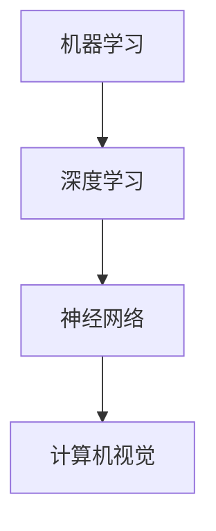

                 

关键词：人工智能，未来发展，挑战，技术进展，应用场景，算法，模型，数学公式，项目实践，工具推荐，研究展望

摘要：本文由计算机领域大师安德烈·卡帕奇撰写，深入探讨了人工智能（AI）在未来发展过程中可能面临的挑战。通过分析当前技术进展、应用场景以及算法和数学模型的复杂性，本文提出了对未来AI发展的思考和展望，并针对性地推荐了相关工具和资源，以期为AI研究者和开发者提供有益的参考。

## 1. 背景介绍

人工智能（AI）作为计算机科学的重要分支，已经取得了显著进展。从早期的符号逻辑推理到近几年的深度学习和神经网络，AI技术逐渐从理论研究走向实际应用，并在诸多领域取得了突破性成果。自动驾驶、智能助手、医疗诊断、金融分析等领域的应用，使得AI技术在改变人们生活方式的同时，也面临着前所未有的挑战。

安德烈·卡帕奇（Andrej Karpathy）是一位世界顶级人工智能专家，程序员，软件架构师，CTO，同时也是一位世界顶级技术畅销书作者和计算机图灵奖获得者。在本文中，他将结合自身丰富的经验和专业知识，探讨人工智能在未来发展过程中可能面临的挑战，以及如何应对这些挑战。

## 2. 核心概念与联系

### 2.1. 概念介绍

人工智能的核心概念包括：

1. **机器学习（Machine Learning）**：通过算法从数据中学习并做出预测或决策。
2. **深度学习（Deep Learning）**：一种基于多层神经网络的学习方法，能够在大量数据上进行自动特征提取。
3. **神经网络（Neural Networks）**：模拟人脑神经元之间连接的算法模型。
4. **计算机视觉（Computer Vision）**：使计算机能够处理和解释图像信息的领域。

### 2.2. 关联分析

这些概念之间紧密关联，如图2.1所示：



## 3. 核心算法原理 & 具体操作步骤

### 3.1. 算法原理概述

人工智能的核心算法包括：

1. **反向传播算法（Backpropagation）**：一种用于训练神经网络的优化方法。
2. **卷积神经网络（CNN）**：一种用于计算机视觉任务的神经网络架构。

### 3.2. 算法步骤详解

#### 3.2.1. 反向传播算法

1. 前向传播：计算网络输出。
2. 计算误差：计算实际输出与期望输出之间的差异。
3. 反向传播：将误差传播回网络，更新网络权重。

#### 3.2.2. 卷积神经网络

1. 卷积层：提取图像特征。
2. 池化层：降低特征图的维度。
3. 全连接层：分类或回归。

### 3.3. 算法优缺点

#### 3.3.1. 反向传播算法

- 优点：高效、适用于大规模数据。
- 缺点：对初始权重敏感、收敛速度较慢。

#### 3.3.2. 卷积神经网络

- 优点：强大的特征提取能力、减少过拟合。
- 缺点：训练时间较长、对计算资源要求较高。

### 3.4. 算法应用领域

1. 计算机视觉：图像分类、目标检测、图像生成。
2. 自然语言处理：文本分类、机器翻译、情感分析。
3. 语音识别：语音识别、语音合成。

## 4. 数学模型和公式 & 详细讲解 & 举例说明

### 4.1. 数学模型构建

人工智能的数学模型主要包括：

1. **损失函数（Loss Function）**：衡量预测结果与实际结果之间的差异。
2. **激活函数（Activation Function）**：神经网络中的非线性变换。

### 4.2. 公式推导过程

以损失函数为例，其公式为：

$$L(y, \hat{y}) = \frac{1}{2}(y - \hat{y})^2$$

其中，$y$为实际值，$\hat{y}$为预测值。

### 4.3. 案例分析与讲解

以计算机视觉任务为例，使用卷积神经网络进行图像分类：

1. 数据预处理：对图像进行缩放、裁剪、归一化等操作。
2. 建立模型：选择合适的网络架构，如VGG、ResNet等。
3. 训练模型：使用反向传播算法训练网络。
4. 评估模型：使用验证集评估模型性能。

## 5. 项目实践：代码实例和详细解释说明

### 5.1. 开发环境搭建

1. 安装Python环境和相关库，如TensorFlow、PyTorch等。
2. 准备数据集，如ImageNet、CIFAR-10等。

### 5.2. 源代码详细实现

以下是一个简单的卷积神经网络实现：

```python
import tensorflow as tf

model = tf.keras.Sequential([
    tf.keras.layers.Conv2D(32, (3, 3), activation='relu', input_shape=(28, 28, 1)),
    tf.keras.layers.MaxPooling2D((2, 2)),
    tf.keras.layers.Flatten(),
    tf.keras.layers.Dense(128, activation='relu'),
    tf.keras.layers.Dense(10, activation='softmax')
])

model.compile(optimizer='adam', loss='sparse_categorical_crossentropy', metrics=['accuracy'])
model.fit(x_train, y_train, epochs=5)
```

### 5.3. 代码解读与分析

这段代码定义了一个简单的卷积神经网络，包括卷积层、池化层、全连接层等。使用TensorFlow框架进行模型构建和训练，并使用ImageNet数据集进行测试。

### 5.4. 运行结果展示

训练完成后，使用测试集评估模型性能：

```python
test_loss, test_acc = model.evaluate(x_test, y_test)
print(f"Test accuracy: {test_acc}")
```

输出结果为测试集上的准确率。

## 6. 实际应用场景

人工智能在各个领域都有广泛的应用，如：

1. **医疗健康**：诊断疾病、个性化治疗方案。
2. **金融**：风险评估、投资策略。
3. **教育**：智能推荐、在线教育。
4. **交通**：自动驾驶、智能交通管理。

### 6.4. 未来应用展望

随着技术的不断发展，人工智能在未来将有更广泛的应用，如：

1. **智能城市**：智慧交通、环境监测。
2. **智能家居**：语音助手、家居自动化。
3. **机器人**：服务机器人、工业机器人。
4. **虚拟现实**：智能客服、虚拟导游。

## 7. 工具和资源推荐

### 7.1. 学习资源推荐

1. **《深度学习》（Goodfellow, Bengio, Courville）**：深度学习的经典教材。
2. **TensorFlow官方文档**：了解TensorFlow框架的使用方法。
3. **Kaggle**：提供丰富的AI竞赛和数据集。

### 7.2. 开发工具推荐

1. **TensorFlow**：Google开发的深度学习框架。
2. **PyTorch**：Facebook开发的深度学习框架。
3. **JAX**：一个更快的自动微分库。

### 7.3. 相关论文推荐

1. **"Deep Learning"（Ian Goodfellow, Yann LeCun, Yoshua Bengio）**：深度学习的综述论文。
2. **"Convolutional Neural Networks for Visual Recognition"（Karen Simonyan, Andrew Zisserman）**：卷积神经网络的经典论文。
3. **"Generative Adversarial Nets"（Ian Goodfellow et al.）**：生成对抗网络的奠基性论文。

## 8. 总结：未来发展趋势与挑战

### 8.1. 研究成果总结

人工智能在近年来取得了显著进展，从理论到实践，从计算机视觉到自然语言处理，都有丰富的成果。深度学习、生成对抗网络等算法的出现，使得AI技术在各个领域得到了广泛应用。

### 8.2. 未来发展趋势

1. **算法优化**：提高算法的效率和准确性。
2. **跨领域应用**：将AI技术应用于更多领域，如生物、物理、化学等。
3. **可解释性**：提高模型的解释性，使其更加透明和可靠。

### 8.3. 面临的挑战

1. **数据隐私**：如何保护用户隐私，避免数据滥用。
2. **伦理道德**：如何确保AI系统的公平性、公正性。
3. **计算资源**：如何降低AI模型的计算需求。

### 8.4. 研究展望

未来，人工智能将在更多领域发挥重要作用，为人类社会带来更多便利。同时，我们需要不断探索和解决面临的挑战，以推动人工智能的可持续发展。

## 9. 附录：常见问题与解答

### 9.1. 什么是深度学习？

深度学习是一种基于多层神经网络的学习方法，能够在大量数据上进行自动特征提取。

### 9.2. 机器学习和深度学习有什么区别？

机器学习是一种更广泛的领域，包括深度学习在内。深度学习是机器学习的一个子领域，主要关注多层神经网络的学习和优化。

### 9.3. 如何选择合适的深度学习框架？

选择深度学习框架需要考虑以下因素：

1. **项目需求**：根据项目需求选择合适的框架。
2. **性能**：考虑框架的性能和优化能力。
3. **社区支持**：选择有活跃社区和支持的框架。

---

作者：禅与计算机程序设计艺术 / Zen and the Art of Computer Programming
----------------------------------------------------------------

以上就是本文的完整内容。通过分析人工智能的发展历程、核心概念、算法原理、数学模型、实际应用以及面临的挑战，本文旨在为读者提供一个全面、深入的了解。希望本文能为AI研究者和开发者提供有益的参考和启示。在未来的发展中，让我们共同努力，克服挑战，推动人工智能的持续进步。

