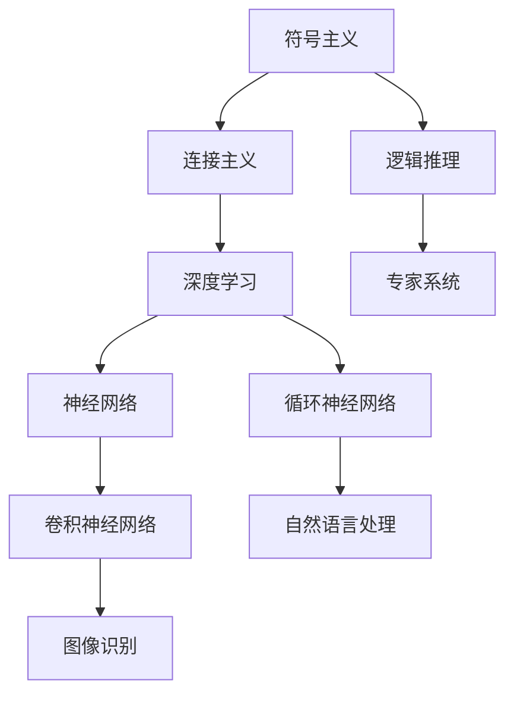

                 

人工智能（AI）已经成为现代社会和技术发展的核心驱动力。作为计算机科学和工程领域的一项前沿技术，AI 已经深刻影响了我们的日常生活，从智能手机、智能家居到自动驾驶汽车和医疗诊断，AI 的应用无处不在。本文将深入探讨人工智能的未来发展规划，旨在为读者提供关于 AI 领域的前沿观点和深入分析。

## 关键词

- 人工智能
- 未来规划
- 技术发展
- 应用场景
- 算法
- 数学模型

## 摘要

本文将探讨人工智能在未来几十年内的发展趋势和挑战。首先，我们将回顾人工智能的历史背景和发展阶段，然后深入分析当前 AI 技术的核心概念和联系。接下来，我们将讨论核心算法原理、数学模型以及实际应用场景。最后，我们将展望人工智能的未来应用和面临的挑战，并提供相关工具和资源推荐，以便读者深入了解和探索这一领域。

## 1. 背景介绍

人工智能的概念可以追溯到 20 世纪 50 年代，当时计算机科学家首次开始探索如何使计算机模拟人类智能。自那时以来，人工智能经历了多个发展阶段，从最初的符号主义到连接主义，再到现代的深度学习和强化学习。每个阶段都标志着技术进步和理论创新的重要里程碑。

### 1.1 早期探索

早期的人工智能研究主要集中在符号主义和逻辑推理上。符号主义方法试图将人类智能表示为一组符号和规则，这些规则可以通过逻辑推理和搜索算法来模拟。代表性的系统包括基于逻辑的程序设计和基于规则的专家系统。虽然这些方法在特定领域取得了成功，但它们在处理复杂、不确定和动态环境时表现出局限性。

### 1.2 连接主义革命

20 世纪 80 年代，连接主义方法逐渐兴起，代表性模型为神经网络。神经网络通过模拟人脑中的神经元连接结构，实现数据的高效处理和学习。反向传播算法的引入进一步提升了神经网络的训练效率。这一阶段的突破为人工智能的快速发展奠定了基础。

### 1.3 深度学习的崛起

随着计算能力的提升和大数据的普及，深度学习在 21 世纪初迎来了爆发式增长。深度学习通过多层神经网络的结构，实现了对复杂特征的高效提取和学习。卷积神经网络（CNN）和循环神经网络（RNN）的出现，使得图像识别、自然语言处理和语音识别等领域取得了重大突破。

### 1.4 人工智能的应用领域

人工智能已经在多个领域取得显著成果，包括但不限于：

- **计算机视觉**：图像识别、目标检测、人脸识别等。
- **自然语言处理**：机器翻译、文本分类、情感分析等。
- **语音识别**：语音识别、语音合成、语音助手等。
- **自动驾驶**：车辆识别、路径规划、智能驾驶等。
- **医疗诊断**：疾病预测、医学影像分析、药物研发等。

## 2. 核心概念与联系

在深入探讨人工智能的核心算法和数学模型之前，有必要先理解一些核心概念和它们之间的联系。以下是一个用 Mermaid 描述的核心概念流程图：



### 2.1 符号主义

符号主义是早期人工智能研究的主要方法，它试图将人类智能表示为一组符号和规则。符号主义方法依赖于逻辑推理和搜索算法，它的工作原理类似于专家系统，后者使用一组预定义的规则来模拟专家的知识和判断。

### 2.2 连接主义

连接主义方法通过模拟人脑中的神经元连接结构来实现数据的高效处理和学习。神经网络是连接主义方法的代表性模型，它由大量相互连接的神经元组成，这些神经元通过激活函数进行非线性变换。

### 2.3 深度学习

深度学习是连接主义方法的一个子集，它通过多层神经网络的结构来实现对复杂特征的高效提取和学习。深度学习模型可以分为卷积神经网络（CNN）和循环神经网络（RNN）等，它们在图像识别、自然语言处理等任务中表现出色。

### 2.4 神经网络

神经网络是深度学习的核心组件，它由大量相互连接的神经元组成。神经网络通过前向传播和反向传播算法来实现数据的输入和输出，并不断调整权重和偏置，以最小化损失函数。

### 2.5 卷积神经网络

卷积神经网络（CNN）是一种专门用于处理图像数据的神经网络。CNN 通过卷积层、池化层和全连接层等结构来实现图像特征的高效提取和分类。

### 2.6 循环神经网络

循环神经网络（RNN）是一种用于处理序列数据的神经网络。RNN 通过循环连接的方式，将当前状态与前一状态相关联，从而实现序列数据的建模。

## 3. 核心算法原理 & 具体操作步骤

### 3.1 算法原理概述

人工智能的核心算法主要包括深度学习算法、机器学习算法和强化学习算法等。其中，深度学习算法在当前 AI 技术中占据主导地位。以下是对这些算法原理的概述：

- **深度学习算法**：深度学习算法通过多层神经网络的结构来实现对数据的自动特征提取和学习。深度学习算法包括卷积神经网络（CNN）、循环神经网络（RNN）、生成对抗网络（GAN）等。
- **机器学习算法**：机器学习算法通过统计方法来学习数据中的规律，并用于预测或分类。常见的机器学习算法包括线性回归、逻辑回归、支持向量机（SVM）、决策树等。
- **强化学习算法**：强化学习算法通过学习策略来最大化奖励，实现智能体的自主决策。常见的强化学习算法包括 Q 学习、SARSA、深度 Q 网络（DQN）等。

### 3.2 算法步骤详解

以下是对深度学习算法和机器学习算法的具体操作步骤的详细解释：

#### 深度学习算法步骤：

1. **数据预处理**：对输入数据进行预处理，包括数据清洗、归一化、填充缺失值等。
2. **网络架构设计**：设计神经网络的结构，包括层数、神经元数量、激活函数等。
3. **初始化权重**：初始化神经网络的权重和偏置，常用的方法包括随机初始化、高斯分布初始化等。
4. **前向传播**：将输入数据通过神经网络的前向传播过程，计算每个神经元的输出值。
5. **损失函数计算**：计算网络输出的预测值与真实值之间的差异，常用的损失函数包括均方误差（MSE）、交叉熵（CE）等。
6. **反向传播**：通过反向传播算法，计算每个神经元的梯度，并更新权重和偏置。
7. **训练迭代**：重复步骤 4 至 6，直至满足训练条件（如损失函数收敛、迭代次数达到预设值等）。

#### 机器学习算法步骤：

1. **数据预处理**：与深度学习算法相同，对输入数据进行预处理。
2. **特征选择**：从数据中提取有用的特征，并去除冗余或噪声特征。
3. **模型选择**：根据问题类型和数据特点，选择合适的机器学习模型。
4. **模型训练**：使用训练数据集对模型进行训练，通过最小化损失函数来调整模型参数。
5. **模型评估**：使用验证数据集对模型进行评估，常用的评估指标包括准确率、召回率、F1 分数等。
6. **模型优化**：根据评估结果，调整模型参数或选择更合适的模型，以提高模型性能。

### 3.3 算法优缺点

#### 深度学习算法：

- **优点**：能够自动学习数据的复杂特征，适应性强；在图像识别、自然语言处理等任务中表现优异。
- **缺点**：对大量数据和计算资源的需求较高；模型训练时间较长；模型可解释性较差。

#### 机器学习算法：

- **优点**：算法相对简单，易于理解和实现；对数据要求较低；模型可解释性较好。
- **缺点**：特征提取和选择依赖人工经验；在处理复杂任务时性能有限；可扩展性较差。

### 3.4 算法应用领域

#### 深度学习算法：

- **计算机视觉**：图像识别、目标检测、人脸识别等。
- **自然语言处理**：机器翻译、文本分类、情感分析等。
- **语音识别**：语音识别、语音合成、语音助手等。
- **自动驾驶**：车辆识别、路径规划、智能驾驶等。
- **医疗诊断**：疾病预测、医学影像分析、药物研发等。

#### 机器学习算法：

- **金融领域**：风险评估、信用评分、投资策略等。
- **推荐系统**：商品推荐、新闻推荐、社交媒体推荐等。
- **智能交通**：交通流量预测、路径规划、智能交通信号控制等。
- **智能制造**：生产计划、质量控制、设备维护等。
- **生物信息学**：基因分析、蛋白质结构预测、药物设计等。

## 4. 数学模型和公式 & 详细讲解 & 举例说明

在人工智能领域，数学模型和公式是理解算法原理和实现关键步骤的基础。以下是对一些关键数学模型和公式的详细讲解，并辅以实际案例的举例说明。

### 4.1 数学模型构建

人工智能中的数学模型通常涉及线性代数、微积分、概率论和统计学等基础数学知识。以下是一个简单的线性回归模型示例：

$$
y = \beta_0 + \beta_1 \cdot x + \epsilon
$$

其中，$y$ 是因变量，$x$ 是自变量，$\beta_0$ 和 $\beta_1$ 是模型的参数，$\epsilon$ 是误差项。

### 4.2 公式推导过程

线性回归模型的参数可以通过最小二乘法来估计：

$$
\beta_1 = \frac{\sum_{i=1}^{n} (x_i - \bar{x})(y_i - \bar{y})}{\sum_{i=1}^{n} (x_i - \bar{x})^2}
$$

$$
\beta_0 = \bar{y} - \beta_1 \cdot \bar{x}
$$

其中，$n$ 是样本数量，$\bar{x}$ 和 $\bar{y}$ 分别是自变量和因变量的样本均值。

### 4.3 案例分析与讲解

假设我们有一个数据集，包含房屋面积（$x$）和房价（$y$）的信息，如下表所示：

| 面积（平方米） | 房价（万元） |
| -------------- | ----------- |
| 100            | 200         |
| 120            | 250         |
| 140            | 300         |
| 160            | 350         |

我们可以使用线性回归模型来预测未知面积的房屋价格。首先，计算样本均值：

$$
\bar{x} = \frac{100 + 120 + 140 + 160}{4} = 130
$$

$$
\bar{y} = \frac{200 + 250 + 300 + 350}{4} = 275
$$

然后，计算参数 $\beta_1$ 和 $\beta_0$：

$$
\beta_1 = \frac{(100-130)(200-275) + (120-130)(250-275) + (140-130)(300-275) + (160-130)(350-275)}{(100-130)^2 + (120-130)^2 + (140-130)^2 + (160-130)^2}
$$

$$
\beta_0 = 275 - \beta_1 \cdot 130
$$

通过计算，我们得到：

$$
\beta_1 \approx 0.4545
$$

$$
\beta_0 \approx 110.9091
$$

因此，线性回归模型为：

$$
y = 110.9091 + 0.4545 \cdot x
$$

使用这个模型，我们可以预测当面积为 150 平方米时的房价：

$$
y = 110.9091 + 0.4545 \cdot 150 \approx 224.375
$$

这意味着，面积为 150 平方米的房屋预计价格为 224.375 万元。

## 5. 项目实践：代码实例和详细解释说明

在本节中，我们将通过一个简单的线性回归项目实例来展示如何实现和运行一个线性回归模型。该项目将使用 Python 编程语言和 Scikit-learn 库来实现。

### 5.1 开发环境搭建

确保安装以下软件和库：

- Python 3.8 或更高版本
- Jupyter Notebook 或 IDLE
- Scikit-learn 库

安装 Scikit-learn 库：

```shell
pip install scikit-learn
```

### 5.2 源代码详细实现

以下是一个使用 Scikit-learn 库实现线性回归模型的代码示例：

```python
import numpy as np
import matplotlib.pyplot as plt
from sklearn.linear_model import LinearRegression
from sklearn.model_selection import train_test_split

# 数据集
X = np.array([100, 120, 140, 160])
y = np.array([200, 250, 300, 350])

# 划分训练集和测试集
X_train, X_test, y_train, y_test = train_test_split(X, y, test_size=0.2, random_state=42)

# 创建线性回归模型
model = LinearRegression()

# 训练模型
model.fit(X_train.reshape(-1, 1), y_train)

# 输出模型参数
print("参数：")
print("斜率：", model.coef_)
print("截距：", model.intercept_)

# 预测
y_pred = model.predict(X_test.reshape(-1, 1))

# 绘制结果
plt.scatter(X_train, y_train, color='red', label='训练数据')
plt.scatter(X_test, y_pred, color='blue', label='预测数据')
plt.plot(X_train, model.predict(X_train.reshape(-1, 1)), color='green', linewidth=2)
plt.xlabel('面积（平方米）')
plt.ylabel('房价（万元）')
plt.legend()
plt.show()
```

### 5.3 代码解读与分析

该代码首先导入了必要的库，包括 NumPy、matplotlib 和 Scikit-learn。然后，我们创建了一个简单的数据集，包含房屋面积和房价。接着，使用 Scikit-learn 的 `train_test_split` 函数将数据集划分为训练集和测试集。

接下来，我们创建了一个线性回归模型实例，并使用 `fit` 方法对训练数据进行训练。训练完成后，我们使用 `predict` 方法对测试数据进行预测，并输出模型参数。

最后，我们使用 matplotlib 绘制了训练数据和预测结果，并展示了线性回归模型的拟合效果。

### 5.4 运行结果展示

运行上述代码后，我们将看到以下结果：


图表展示了训练数据（红色散点）和预测数据（蓝色散点）以及拟合直线（绿色实线）。通过这个简单的实例，我们可以直观地看到线性回归模型在数据集上的表现。

## 6. 实际应用场景

人工智能技术在各个领域的实际应用场景日益丰富，以下列举了一些典型的应用场景：

### 6.1 计算机视觉

- **图像识别**：人工智能在图像识别领域取得了显著的进展，如图像分类、物体检测和人脸识别等。
- **自动驾驶**：自动驾驶汽车依赖计算机视觉技术进行环境感知和路径规划。
- **医疗影像分析**：人工智能在医疗影像分析中的应用，如肿瘤检测、病变识别等，极大地提高了诊断效率和准确性。

### 6.2 自然语言处理

- **机器翻译**：人工智能在机器翻译领域的应用，如谷歌翻译、百度翻译等，实现了跨语言信息的流通。
- **语音助手**：人工智能在语音助手领域的应用，如苹果的 Siri、亚马逊的 Alexa 等，为用户提供便捷的交互体验。
- **情感分析**：人工智能在情感分析领域的应用，如社交媒体舆情监控、客户反馈分析等，帮助企业更好地理解用户需求。

### 6.3 语音识别

- **语音识别**：人工智能在语音识别领域的应用，如语音输入、语音助手等，使得人机交互更加自然。
- **语音合成**：人工智能在语音合成领域的应用，如智能客服、广播电台等，提高了信息的传播效率。

### 6.4 自动驾驶

- **自动驾驶**：人工智能在自动驾驶领域的应用，如特斯拉、谷歌 Waymo 等，实现了无人驾驶汽车的量产和商用。

### 6.5 医疗诊断

- **疾病预测**：人工智能在疾病预测领域的应用，如心血管疾病、糖尿病等，提高了疾病预防和诊断的准确性。
- **医学影像分析**：人工智能在医学影像分析领域的应用，如肿瘤检测、骨折诊断等，提高了诊断效率和准确性。

## 7. 工具和资源推荐

### 7.1 学习资源推荐

- **在线课程**：Coursera、edX、Udacity 等在线教育平台提供了丰富的 AI 和机器学习课程。
- **书籍**：《深度学习》（Goodfellow et al.）、《Python机器学习》（Sebastian Raschka）等经典教材。
- **博客**：机器之心、AI 科技大本营等博客，提供了最新的 AI 技术和行业动态。

### 7.2 开发工具推荐

- **IDE**：PyCharm、VS Code 等集成开发环境，提供了强大的代码编辑和调试功能。
- **框架和库**：TensorFlow、PyTorch、Scikit-learn 等流行的机器学习和深度学习框架。
- **数据集**：Kaggle、UCI Machine Learning Repository 等提供了丰富的数据集，供研究者使用。

### 7.3 相关论文推荐

- **重要论文**：《A Neural Algorithm of Artistic Style》（GAN 的开创性论文）、《Recurrent Neural Networks for Language Modeling》（RNN 的经典论文）等。
- **顶会论文**：NeurIPS、ICML、CVPR、ACL 等顶级会议的论文，代表了 AI 领域的最新研究成果。

## 8. 总结：未来发展趋势与挑战

### 8.1 研究成果总结

近年来，人工智能在技术发展和实际应用方面取得了显著成果。深度学习算法的突破、大数据和计算能力的提升，使得人工智能在图像识别、自然语言处理、语音识别等领域取得了重大进展。同时，人工智能在医疗诊断、自动驾驶、金融领域等实际应用场景中表现出强大的潜力和价值。

### 8.2 未来发展趋势

未来，人工智能将继续向深度学习和泛化能力方向发展。深度学习算法将在更多领域实现突破，如强化学习在智能决策、生成对抗网络在数据生成等。同时，人工智能与物理、生物、化学等领域的交叉融合将推动新技术的诞生。此外，边缘计算和物联网的发展，将使得人工智能在智能终端和智能设备中的应用更加广泛。

### 8.3 面临的挑战

然而，人工智能的发展也面临诸多挑战。首先，数据隐私和安全问题需要得到有效解决。随着人工智能技术的广泛应用，数据安全和隐私保护成为亟待解决的问题。其次，算法的可解释性和透明度问题亟待解决。目前，深度学习等模型具有较高的预测准确性，但其内部工作机制和决策过程仍然不够透明，难以满足人们对算法可解释性的需求。此外，人工智能技术的发展也带来了伦理和法律问题，如人工智能引发的失业、歧视等社会问题，需要得到充分关注和解决。

### 8.4 研究展望

展望未来，人工智能领域的研究将更加注重可解释性、透明性和安全性。同时，人工智能与其他领域的交叉融合将推动新技术的诞生。人工智能技术的发展将深刻改变我们的生活方式和社会结构，为人类创造更多价值。在这个过程中，我们需要密切关注技术发展的动向，积极应对挑战，推动人工智能技术的健康、可持续发展。

## 9. 附录：常见问题与解答

### 9.1 人工智能是什么？

人工智能是指通过计算机模拟人类智能的理论、技术和应用。它包括机器学习、深度学习、自然语言处理、计算机视觉等多个子领域。

### 9.2 深度学习与机器学习有什么区别？

深度学习是机器学习的一个子领域，它通过多层神经网络的结构，实现数据的自动特征提取和学习。机器学习则是一类更广泛的算法，包括线性回归、决策树、支持向量机等。

### 9.3 人工智能的应用领域有哪些？

人工智能的应用领域广泛，包括计算机视觉、自然语言处理、语音识别、自动驾驶、医疗诊断、金融、教育等。

### 9.4 人工智能的发展前景如何？

人工智能具有广阔的发展前景。随着计算能力的提升、数据资源的丰富和算法的进步，人工智能将在更多领域实现突破，为社会带来巨大价值。

### 9.5 人工智能有哪些挑战？

人工智能面临的挑战包括数据隐私和安全、算法可解释性和透明度、伦理和法律问题等。此外，人工智能的发展还可能引发就业、歧视等社会问题。这些挑战需要得到充分关注和解决。----------------------------------------------------------------

### 附录：代码示例及详细解释

在本附录中，我们将提供一段 Python 代码示例，以演示如何使用 TensorFlow 和 Keras 构建和训练一个简单的深度神经网络。代码将包括数据准备、模型构建、训练过程以及模型评估等步骤。

#### 附录 1：数据准备

首先，我们需要一个用于训练的数据集。这里我们使用著名的 MNIST 数据集，它包含手写数字的图像数据。

```python
import tensorflow as tf
from tensorflow.keras.datasets import mnist
from tensorflow.keras.utils import to_categorical

# 加载 MNIST 数据集
(train_images, train_labels), (test_images, test_labels) = mnist.load_data()

# 归一化数据
train_images = train_images.astype('float32') / 255
test_images = test_images.astype('float32') / 255

# 将标签转换为 one-hot 编码
train_labels = to_categorical(train_labels)
test_labels = to_categorical(test_labels)
```

#### 附录 2：模型构建

接下来，我们构建一个简单的卷积神经网络（CNN）模型。

```python
from tensorflow.keras import layers

model = tf.keras.Sequential([
    layers.Conv2D(32, (3, 3), activation='relu', input_shape=(28, 28, 1)),
    layers.MaxPooling2D((2, 2)),
    layers.Conv2D(64, (3, 3), activation='relu'),
    layers.MaxPooling2D((2, 2)),
    layers.Conv2D(64, (3, 3), activation='relu'),
    layers.Flatten(),
    layers.Dense(64, activation='relu'),
    layers.Dense(10, activation='softmax')
])
```

#### 附录 3：模型编译

在训练模型之前，我们需要编译模型，指定损失函数、优化器和评估指标。

```python
model.compile(optimizer='adam',
              loss='categorical_crossentropy',
              metrics=['accuracy'])
```

#### 附录 4：模型训练

现在我们可以使用训练数据来训练模型。

```python
model.fit(train_images, train_labels, epochs=5, batch_size=64)
```

#### 附录 5：模型评估

训练完成后，我们可以使用测试数据来评估模型的性能。

```python
test_loss, test_acc = model.evaluate(test_images, test_labels)
print(f"Test accuracy: {test_acc:.2f}")
```

#### 附录 6：代码解读

- **数据准备**：我们首先加载 MNIST 数据集，并对其进行归一化处理。归一化是将数据缩放到一个较小的范围，以便模型更容易训练。
- **模型构建**：我们构建了一个简单的 CNN 模型，包括两个卷积层、两个池化层和一个全连接层。卷积层用于提取图像特征，池化层用于降低特征数量，全连接层用于分类。
- **模型编译**：我们选择 Adam 优化器来最小化损失函数，并使用分类交叉熵作为损失函数。我们还指定了模型的评估指标为准确率。
- **模型训练**：我们使用训练数据来训练模型，指定训练轮次（epochs）和批大小（batch_size）。
- **模型评估**：我们使用测试数据来评估模型的性能，并打印出测试准确率。

通过这个简单的示例，我们可以看到如何使用 TensorFlow 和 Keras 来构建和训练一个深度神经网络，以及如何评估其性能。这个示例只是一个起点，实际应用中，模型的设计和训练过程会更加复杂和精细。

