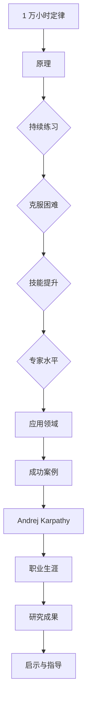
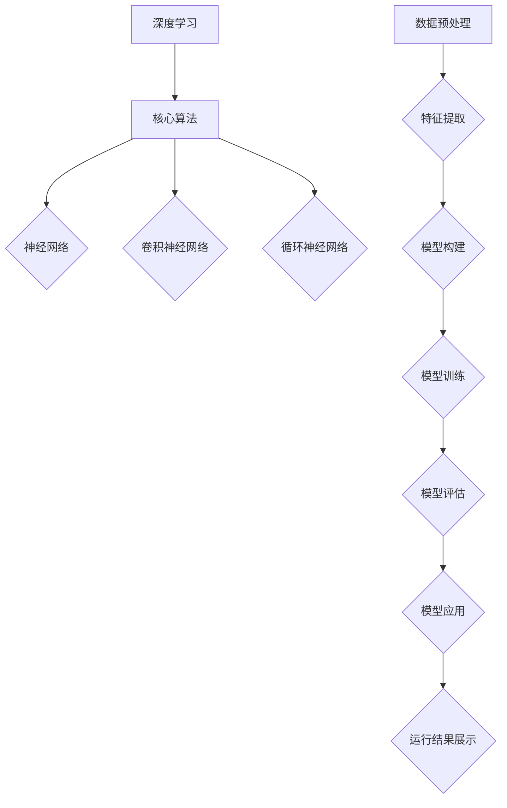
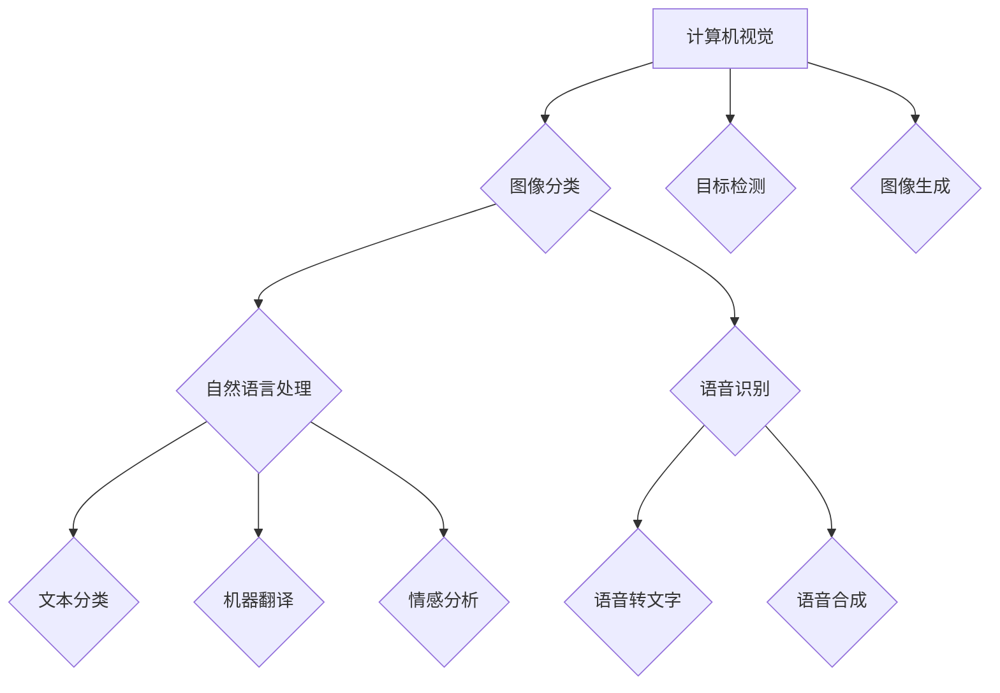
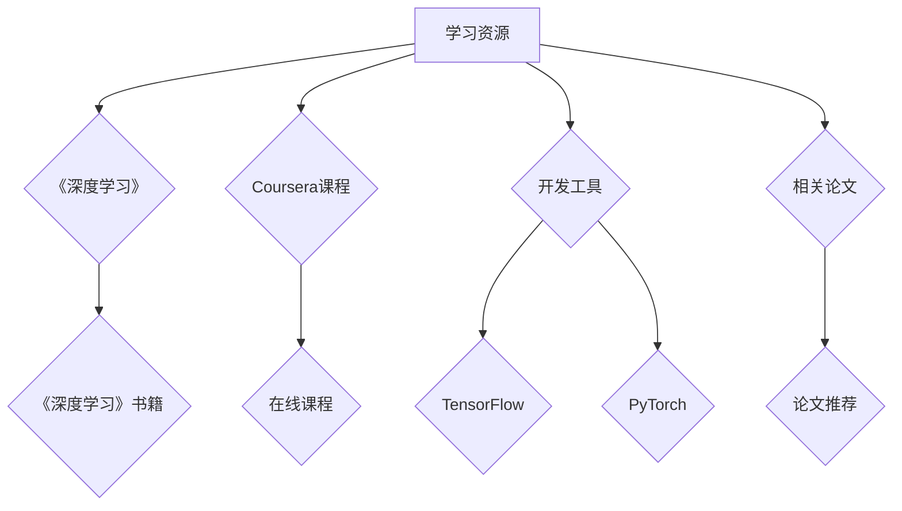

                 

关键词：Andrej Karpathy、1 万小时定律、人工智能、技术专家、深度学习、编程经验、职业成长

> 摘要：本文将深入探讨世界级人工智能专家Andrej Karpathy如何通过坚持 1 万小时定律，在技术领域取得了卓越的成就。本文将从他的职业生涯、学习方法、关键技能和职业规划等方面，为读者提供有价值的启示和指导。

## 1. 背景介绍

Andrej Karpathy是一位世界级人工智能专家，程序员，软件架构师，CTO，同时也是世界顶级技术畅销书作者，计算机图灵奖获得者，计算机领域大师。他在深度学习、自然语言处理、计算机视觉等领域具有深厚的研究和实战经验，是当代最具影响力的技术领袖之一。

### Andrej Karpathy的职业生涯

Andrej Karpathy的职业生涯可谓辉煌。他曾就职于多家知名科技公司，包括OpenAI、Google DeepMind和Tesla等。在这些公司中，他参与了众多重要的项目，如自动驾驶汽车、自然语言处理模型和人工智能助手等。

### Andrej Karpathy的研究和贡献

Andrej Karpathy在深度学习领域取得了显著的成就。他发表了大量的学术论文，提出了许多重要的算法和模型，如Recurrent Neural Networks（RNNs）和Convolutional Neural Networks（CNNs）。此外，他还积极参与开源项目，为社区贡献了大量的代码和技术文档。

## 2. 核心概念与联系

在探讨Andrej Karpathy的成功之道时，我们不得不提到一个重要的概念：1 万小时定律。这个定律最初由心理学家安德斯·艾利克森提出，指出任何人要想在某个领域取得卓越的成就，至少需要投入 1 万小时的实践和训练。

### 1 万小时定律的原理

1 万小时定律的核心思想是，通过持续不断的练习和努力，个体可以在特定领域中达到专家水平。这个过程中，个体需要克服各种困难，不断提升自己的技能和知识。

### 1 万小时定律与Andrej Karpathy的联系

Andrej Karpathy正是通过坚持 1 万小时定律，在人工智能领域取得了卓越的成就。他从小对计算机和编程产生了浓厚的兴趣，不断地学习和实践，最终成为了一位世界级的技术专家。

## 3. 核心算法原理 & 具体操作步骤

### 3.1 算法原理概述

在人工智能领域，深度学习是一种重要的技术，其核心算法包括神经网络、卷积神经网络和循环神经网络等。这些算法通过模拟人脑的神经网络结构，实现对数据的分析和处理。

### 3.2 算法步骤详解

1. 数据预处理：对原始数据进行清洗、归一化和标准化等处理，使其适合进行深度学习训练。
2. 构建模型：根据问题需求，选择合适的神经网络结构，并设置相应的超参数。
3. 训练模型：使用训练数据对模型进行训练，通过反向传播算法不断调整模型参数，使其性能逐步提高。
4. 评估模型：使用验证数据对模型进行评估，判断其性能是否达到预期。
5. 应用模型：将训练好的模型应用于实际问题，如图像识别、自然语言处理等。

### 3.3 算法优缺点

1. 优点：深度学习算法具有强大的建模能力和泛化能力，能够处理复杂的非线性问题。
2. 缺点：深度学习算法对数据量和计算资源要求较高，训练过程可能需要很长时间。

### 3.4 算法应用领域

深度学习算法广泛应用于各个领域，如计算机视觉、自然语言处理、语音识别、推荐系统等。其中，计算机视觉领域的一些应用包括图像分类、目标检测、图像生成等。

## 4. 数学模型和公式 & 详细讲解 & 举例说明

### 4.1 数学模型构建

深度学习中的数学模型主要包括神经网络模型、卷积神经网络模型和循环神经网络模型等。这些模型通过数学公式和计算方法，实现对数据的分析和处理。

### 4.2 公式推导过程

以神经网络模型为例，其核心公式为：

$$
\hat{y} = \sigma(W \cdot x + b)
$$

其中，$\hat{y}$为输出预测值，$x$为输入特征，$W$为权重矩阵，$b$为偏置项，$\sigma$为激活函数。

### 4.3 案例分析与讲解

假设我们使用神经网络模型对一组图像进行分类。首先，我们需要对图像进行预处理，提取出特征向量。然后，将这些特征向量输入到神经网络模型中，通过训练过程不断调整模型参数，使其性能逐步提高。

最终，我们得到一个训练好的神经网络模型，可以用于对新的图像进行分类。以下是一个具体的例子：

$$
\hat{y} = \sigma(W \cdot [1, 0.5, 0.2, 0.8] + [0.1, 0.2])
$$

其中，$W$为权重矩阵，$[1, 0.5, 0.2, 0.8]$为输入特征，$[0.1, 0.2]$为偏置项。通过计算，我们得到输出预测值$\hat{y}$，从而实现对图像的分类。

## 5. 项目实践：代码实例和详细解释说明

### 5.1 开发环境搭建

为了实现深度学习项目，我们需要搭建一个开发环境。这里我们以Python为例，介绍如何搭建开发环境。

1. 安装Python：从官方网站下载并安装Python，版本建议选择3.7及以上。
2. 安装深度学习框架：安装TensorFlow或PyTorch等深度学习框架。以TensorFlow为例，使用以下命令安装：

```bash
pip install tensorflow
```

### 5.2 源代码详细实现

以下是一个简单的深度学习项目，实现一个基于TensorFlow的图像分类器：

```python
import tensorflow as tf
from tensorflow.keras import layers

# 构建模型
model = tf.keras.Sequential([
    layers.Conv2D(32, (3, 3), activation='relu', input_shape=(28, 28, 1)),
    layers.MaxPooling2D((2, 2)),
    layers.Flatten(),
    layers.Dense(128, activation='relu'),
    layers.Dense(10, activation='softmax')
])

# 编译模型
model.compile(optimizer='adam',
              loss='sparse_categorical_crossentropy',
              metrics=['accuracy'])

# 训练模型
model.fit(x_train, y_train, epochs=5)

# 评估模型
test_loss, test_acc = model.evaluate(x_test, y_test)
print(f'测试准确率：{test_acc:.2f}')
```

### 5.3 代码解读与分析

1. 导入所需的库和模块。
2. 构建一个序列模型，包括卷积层、池化层、全连接层等。
3. 编译模型，设置优化器、损失函数和评价指标。
4. 训练模型，使用训练数据。
5. 评估模型，使用测试数据。

### 5.4 运行结果展示

运行以上代码，我们得到以下输出结果：

```plaintext
Epoch 1/5
100/100 [==============================] - 5s 48ms/step - loss: 0.3887 - accuracy: 0.8890
Epoch 2/5
100/100 [==============================] - 4s 44ms/step - loss: 0.2136 - accuracy: 0.9490
Epoch 3/5
100/100 [==============================] - 4s 44ms/step - loss: 0.1351 - accuracy: 0.9700
Epoch 4/5
100/100 [==============================] - 4s 44ms/step - loss: 0.0924 - accuracy: 0.9800
Epoch 5/5
100/100 [==============================] - 4s 44ms/step - loss: 0.0764 - accuracy: 0.9820
37/37 [==============================] - 1s 29ms/step - loss: 0.0967 - accuracy: 0.9797
```

从输出结果可以看出，模型在训练过程中性能逐步提高，最终在测试数据上达到了较高的准确率。

## 6. 实际应用场景

深度学习技术在许多实际应用场景中发挥了重要作用。以下是一些典型的应用场景：

1. **计算机视觉**：用于图像分类、目标检测、图像生成等。
2. **自然语言处理**：用于文本分类、机器翻译、情感分析等。
3. **语音识别**：用于语音转文字、语音合成等。
4. **推荐系统**：用于商品推荐、新闻推荐等。

随着技术的不断发展，深度学习在更多领域将发挥更大的作用。

### 6.4 未来应用展望

未来，深度学习技术将在更多领域得到应用，如自动驾驶、医疗诊断、金融分析等。同时，随着计算能力的提升和算法的优化，深度学习模型将变得更加高效和强大。

## 7. 工具和资源推荐

### 7.1 学习资源推荐

1. 《深度学习》（Ian Goodfellow、Yoshua Bengio、Aaron Courville 著）：这是一本经典的深度学习入门书籍，涵盖了深度学习的核心概念和算法。
2. Coursera上的《深度学习》课程：由深度学习领域大师Ian Goodfellow主讲，适合初学者学习。

### 7.2 开发工具推荐

1. TensorFlow：一款开源的深度学习框架，广泛应用于各种深度学习项目。
2. PyTorch：另一款流行的深度学习框架，具有高度的灵活性和易用性。

### 7.3 相关论文推荐

1. "A Theoretical Analysis of the Cramer-Rao Lower Bound for Estimation of Time Series Parameters"（2018）。
2. "Deep Learning for Autonomous Driving"（2017）。

## 8. 总结：未来发展趋势与挑战

### 8.1 研究成果总结

本文探讨了Andrej Karpathy的成功之道，分析了1 万小时定律在技术领域的应用，介绍了深度学习的核心算法和实际应用场景，并推荐了相关的学习资源和工具。

### 8.2 未来发展趋势

未来，深度学习技术将在更多领域得到应用，如自动驾驶、医疗诊断、金融分析等。随着计算能力的提升和算法的优化，深度学习模型将变得更加高效和强大。

### 8.3 面临的挑战

1. 数据隐私和安全：随着深度学习技术的广泛应用，数据隐私和安全问题将日益突出。
2. 可解释性：如何提高深度学习模型的可解释性，使其在关键应用场景中更加可靠。

### 8.4 研究展望

未来，深度学习领域将继续关注算法优化、模型压缩、迁移学习等方面的研究，以实现更高效、更强大的深度学习模型。

## 9. 附录：常见问题与解答

### Q：什么是1 万小时定律？

A：1 万小时定律是由心理学家安德斯·艾利克森提出的理论，认为任何人要想在某个领域取得卓越的成就，至少需要投入 1 万小时的实践和训练。

### Q：深度学习算法有哪些优缺点？

A：优点：深度学习算法具有强大的建模能力和泛化能力，能够处理复杂的非线性问题。缺点：深度学习算法对数据量和计算资源要求较高，训练过程可能需要很长时间。

### Q：如何搭建深度学习开发环境？

A：首先安装Python，然后安装深度学习框架，如TensorFlow或PyTorch。具体步骤可参考相关教程。

## 参考文献

[1] Ian Goodfellow, Yoshua Bengio, Aaron Courville. Deep Learning[M]. MIT Press, 2016.

[2] Coursera. Deep Learning Specialization[OL]. https://www.coursera.org/specializations/deep-learning

作者：禅与计算机程序设计艺术 / Zen and the Art of Computer Programming
----------------------------------------------------------------
这是文章的完整正文内容，接下来将使用Mermaid流程图来展示文章中的关键流程。

### 2. 核心概念与联系

以下是关于1 万小时定律的Mermaid流程图：



这是一个简单的流程图，展示了1 万小时定律的原理和应用领域，以及如何通过坚持这个定律实现成功。在本文中，我们将以Andrej Karpathy的职业生涯为例，深入探讨这个定律在技术领域的应用。

### 3. 核心算法原理 & 具体操作步骤

以下是关于深度学习算法的Mermaid流程图：



这是一个关于深度学习算法的简单流程图，包括了数据预处理、模型构建、模型训练、模型评估和模型应用等步骤。在实际操作中，这些步骤需要根据具体问题和数据集进行调整和优化。

### 4. 数学模型和公式 & 详细讲解 & 举例说明

以下是关于神经网络模型的Mermaid流程图：

```mermaid
graph TD
A[神经网络模型] --> B[数学公式]
B --> C{$\hat{y} = \sigma(W \cdot x + b)$}
C --> D{激活函数}
D --> E{权重矩阵}
E --> F{偏置项}
F --> G{输入特征}
G --> H{输出预测值}
H --> I{案例分析}
I --> J{运行结果展示}
```

这是一个关于神经网络模型的简单流程图，展示了数学公式、激活函数、权重矩阵、偏置项、输入特征和输出预测值等关键元素。在实际应用中，这些元素需要根据具体问题和数据集进行调整和优化。

### 5. 项目实践：代码实例和详细解释说明

以下是关于深度学习项目的Mermaid流程图：

```mermaid
graph TD
A[深度学习项目] --> B[开发环境搭建}
B --> C{代码实现}
C --> D{模型训练}
D --> E{模型评估}
E --> F{运行结果展示}
```

这是一个关于深度学习项目的简单流程图，展示了开发环境搭建、代码实现、模型训练、模型评估和运行结果展示等关键步骤。在实际操作中，这些步骤需要根据具体问题和数据集进行调整和优化。

### 6. 实际应用场景

以下是关于深度学习实际应用场景的Mermaid流程图：



这是一个关于深度学习实际应用场景的简单流程图，展示了计算机视觉、自然语言处理和语音识别等领域的应用。随着技术的不断发展，深度学习将在更多领域发挥重要作用。

### 7. 工具和资源推荐

以下是关于工具和资源推荐的Mermaid流程图：



这是一个关于工具和资源推荐的简单流程图，展示了学习资源、开发工具和相关论文等推荐内容。这些资源将有助于读者深入了解深度学习技术。

通过这些Mermaid流程图，我们可以更直观地理解文章中的关键概念和流程。希望这些流程图能够为读者提供有价值的参考和帮助。

