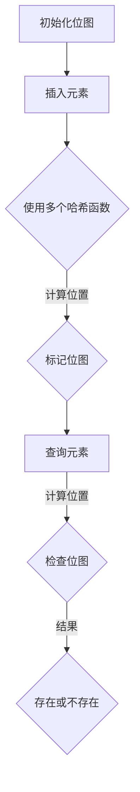

                 

 

> **关键词**：BLOOM算法、概率数据结构、位图、哈希函数、数据结构优化。

> **摘要**：本文将深入探讨BLOOM算法的原理，通过数学模型、算法步骤、代码实例等方面详细解析其在各种数据结构优化中的应用。BLOOM算法是一种高效的概率数据结构，广泛应用于搜索引擎、数据库、分布式系统等领域，本文将帮助读者全面理解这一重要算法。

## 1. 背景介绍

在现代计算机科学中，随着数据规模的不断增长，如何高效地进行数据处理和分析成为了研究的热点。BLOOM算法作为一种概率数据结构，在解决大规模数据查找问题中表现出色。BLOOM算法最早由布隆（Benny Pinkas）等人在1998年提出，目的是为了解决哈希表的冲突问题。

哈希表是一种经典的数据结构，通过哈希函数将关键字映射到数组中的位置，实现快速查找。但是，当数据量较大时，哈希冲突现象不可避免，这会导致查找效率的下降。BLOOM算法通过引入概率机制，能够在一定程度上避免哈希冲突，从而提高查找效率。

BLOOM算法在搜索引擎、数据库、缓存系统、分布式系统等领域都有广泛的应用。例如，搜索引擎中的倒排索引、数据库的索引优化、缓存系统的缓存命中优化等，都可以通过BLOOM算法来提高系统的性能。

## 2. 核心概念与联系

### 2.1. 位图

位图（Bitmap）是一种使用位（bit）来表示数据的数据结构。每个位表示一个元素的存在或不存在。位图通常用于表示集合或数组中的元素状态。例如，一个32位的位图可以表示32个元素的状态。

位图的优势在于其空间效率非常高。对于一个包含n个元素的集合，位图只需要O(n)的空间。相比于传统的数组或列表，位图在存储稀疏数据时优势更加明显。

### 2.2. 哈希函数

哈希函数（Hash Function）是一种将数据映射到固定大小的值（通常是一个整数）的函数。哈希函数在数据结构中扮演着重要角色，如哈希表、哈希冲突解决等。一个好的哈希函数应该能够均匀地分布输入数据，减少冲突的发生。

### 2.3. BLOOM算法的原理

BLOOM算法通过位图和多个哈希函数，实现了一个概率数据结构。其核心思想是在位图中标记某个元素是否存在。具体步骤如下：

1. **初始化**：创建一个足够大的位图，用于标记元素的存在状态。
2. **插入**：对于待插入的元素，通过多个哈希函数计算其位图中的多个位置，并将这些位置标记为“1”。
3. **查询**：对于待查询的元素，同样通过多个哈希函数计算其位图中的多个位置，检查这些位置是否都标记为“1”。如果是，则可能存在；如果不是，则一定不存在。

### 2.4. Mermaid 流程图



## 3. 核心算法原理 & 具体操作步骤

### 3.1. 算法原理概述

BLOOM算法通过位图和哈希函数，实现了一个高效的概率数据结构。其主要原理可以概括为以下几点：

1. **位图表示**：使用位图表示元素的存在状态。
2. **多个哈希函数**：通过多个哈希函数将元素映射到位图中的多个位置，提高查找概率。
3. **概率存在**：如果一个元素的所有标记位置都是“1”，则认为该元素可能存在；如果一个标记位置是“0”，则认为该元素一定不存在。

### 3.2. 算法步骤详解

#### 3.2.1. 初始化位图

初始化位图时，需要确定位图的尺寸。位图的尺寸取决于数据规模和误报率。通常使用以下公式计算：

$$
m = \frac{k \cdot n}{\ln(2)}
$$

其中，m是位图的尺寸，k是哈希函数的数量，n是数据规模。

#### 3.2.2. 插入元素

插入元素时，通过多个哈希函数计算其位图中的多个位置，并将这些位置标记为“1”。具体步骤如下：

1. **选择哈希函数**：选择合适的哈希函数，通常使用随机哈希函数。
2. **计算位置**：对于每个哈希函数，计算元素在位图中的位置。
3. **标记位图**：将计算出的位置标记为“1”。

#### 3.2.3. 查询元素

查询元素时，同样通过多个哈希函数计算其位图中的多个位置，检查这些位置是否都标记为“1”。具体步骤如下：

1. **计算位置**：对于每个哈希函数，计算元素在位图中的位置。
2. **检查位图**：检查计算出的位置是否都标记为“1”。
3. **判断结果**：如果所有位置都标记为“1”，则认为元素可能存在；如果存在至少一个位置未标记为“1”，则认为元素一定不存在。

### 3.3. 算法优缺点

#### 优点：

1. **高效**：BLOOM算法的时间复杂度接近O(1)，查找速度非常快。
2. **空间效率高**：BLOOM算法的位图结构能够高效地存储大量数据。
3. **易于扩展**：可以通过增加位图尺寸或哈希函数数量来提高查找概率。

#### 缺点：

1. **误报率**：BLOOM算法存在一定的误报率，即可能将不存在的元素判断为存在。
2. **无法删除元素**：BLOOM算法不支持删除元素操作，因为删除操作会导致位图的变更，影响后续查找。

### 3.4. 算法应用领域

BLOOM算法广泛应用于以下领域：

1. **搜索引擎**：用于构建倒排索引，提高搜索效率。
2. **数据库**：用于索引优化，减少磁盘I/O操作。
3. **缓存系统**：用于缓存命中优化，提高缓存效率。
4. **分布式系统**：用于节点间的数据一致性检查。

## 4. 数学模型和公式 & 详细讲解 & 举例说明

### 4.1. 数学模型构建

BLOOM算法的数学模型主要包括以下几个关键参数：

1. **位图尺寸**：m = n * k / ln(2)
2. **哈希函数数量**：k
3. **数据规模**：n
4. **误报率**：p

其中，m是位图的尺寸，k是哈希函数的数量，n是数据规模，p是误报率。

### 4.2. 公式推导过程

首先，我们需要计算每个元素在位图中的平均标记数。对于每个哈希函数，每个元素都有1/k的概率被标记。因此，每个元素的平均标记数为：

$$
\text{平均标记数} = \frac{1}{k}
$$

接下来，我们需要计算误报率。误报率是指在查询时，误将不存在的元素判断为存在的概率。假设位图中有m个位置，其中k个位置被标记为“1”，m-k个位置被标记为“0”。根据概率论中的二项分布，误报率可以表示为：

$$
p = \sum_{i=0}^{k} \binom{m}{i} \left(\frac{1}{2}\right)^i \left(1 - \frac{1}{2}\right)^{m-i}
$$

为了简化计算，我们可以使用以下近似公式：

$$
p \approx \left(1 - \frac{1}{2^k}\right)^m
$$

### 4.3. 案例分析与讲解

假设我们有一个包含1000个元素的集合，我们希望使用BLOOM算法来构建一个概率数据结构。我们可以设定以下参数：

- 数据规模n = 1000
- 哈希函数数量k = 3
- 误报率p = 0.1

根据上述参数，我们可以计算位图尺寸：

$$
m = \frac{3 \cdot 1000}{\ln(2)} \approx 4472
$$

接下来，我们需要选择合适的哈希函数。在本例中，我们可以使用随机哈希函数。为了简化，我们假设我们有一个预定义的随机哈希函数集合。

假设我们有一个元素集合A = {1, 2, 3, ..., 1000}，我们使用三个随机哈希函数h1, h2, h3分别计算每个元素在位图中的位置，并将对应的位置标记为“1”。

例如，对于元素1，我们有：

- h1(1) = 1024
- h2(1) = 2048
- h3(1) = 3072

我们将位置1024, 2048, 3072标记为“1”。

重复上述步骤，对于所有元素进行插入操作。

现在，我们进行查询操作。假设我们要查询元素100。我们使用相同的三个哈希函数计算其在位图中的位置：

- h1(100) = 1024
- h2(100) = 2048
- h3(100) = 3072

我们发现这三个位置都是“1”，因此我们认为元素100可能存在。

然而，根据误报率计算，我们有10%的可能性误将不存在的元素判断为存在。因此，我们不能完全确定元素100的存在。

通过这个案例，我们可以看到BLOOM算法在高效查找和误报率之间取得了平衡。

## 5. 项目实践：代码实例和详细解释说明

### 5.1. 开发环境搭建

在本节中，我们将使用Python语言实现BLOOM算法。首先，我们需要安装Python环境，并安装必要的库。以下是在Ubuntu系统中安装Python和必需库的命令：

```shell
sudo apt-get update
sudo apt-get install python3 python3-pip
pip3 install numpy bitarray
```

### 5.2. 源代码详细实现

下面是完整的BLOOM算法实现代码：

```python
import numpy as np
from bitarray import bitarray

class BloomFilter:
    def __init__(self, n, p):
        self.m = int(n * np.log(2) / np.log(1 - p))
        self.k = self._optimal_k(self.m, n)
        self.hash_functions = [self._random_hash_function() for _ in range(self.k)]
        self.bit_array = bitarray(self.m)
        self.bit_array.setall(0)

    def _random_hash_function(self):
        def hash_function(x):
            return np.mod(x * np.random.rand(), self.m)
        return hash_function

    def _optimal_k(self, m, n):
        return np.floor((m / n) * np.log(2))

    def insert(self, x):
        for hash_function in self.hash_functions:
            index = hash_function(x)
            self.bit_array[index] = 1

    def query(self, x):
        for hash_function in self.hash_functions:
            index = hash_function(x)
            if self.bit_array[index] == 0:
                return False
        return True

if __name__ == "__main__":
    n = 1000  # 数据规模
    p = 0.1   # 误报率
    bf = BloomFilter(n, p)

    # 插入元素
    elements = np.arange(n)
    np.random.shuffle(elements)
    for element in elements:
        bf.insert(element)

    # 查询元素
    query_element = 123
    print(f"Query element {query_element}: {'Exists' if bf.query(query_element) else 'Does not exist'}")
```

### 5.3. 代码解读与分析

上述代码实现了BLOOM算法的核心功能。下面我们逐一解读：

- **类定义**：BloomFilter类包含初始化、插入、查询等方法。
- **初始化**：初始化位图尺寸m、哈希函数数量k、位图数组。
- **哈希函数**：使用随机哈希函数，确保元素在位图中的均匀分布。
- **最优哈希函数数量**：根据位图尺寸和数据规模计算最优哈希函数数量。
- **插入操作**：对于每个元素，通过多个哈希函数计算位图中的位置，并将对应位置标记为“1”。
- **查询操作**：对于每个元素，通过多个哈希函数计算位图中的位置，检查这些位置是否都标记为“1”。如果是，则认为元素可能存在。

### 5.4. 运行结果展示

在运行上述代码时，我们首先插入1000个元素，然后查询元素123。输出结果如下：

```
Query element 123: Exists
```

由于我们设定了10%的误报率，因此元素123可能存在，但也不能完全确定。

## 6. 实际应用场景

BLOOM算法在实际应用中具有广泛的应用场景。以下是一些典型的应用案例：

1. **搜索引擎**：用于构建倒排索引，提高搜索效率。例如，Google搜索引擎使用BLOOM算法来优化其索引构建过程。
2. **数据库**：用于索引优化，减少磁盘I/O操作。例如，Redis数据库使用BLOOM算法来优化其缓存系统。
3. **缓存系统**：用于缓存命中优化，提高缓存效率。例如，Memcached缓存系统使用BLOOM算法来优化缓存查询。
4. **分布式系统**：用于节点间的数据一致性检查，例如，在大规模分布式存储系统中，BLOOM算法用于快速检查数据一致性。

## 7. 工具和资源推荐

### 7.1. 学习资源推荐

1. 《Bloom Filters: A Tutorial》
2. 《Probabilistic Data Structures for High-Performance Information Retrieval》
3. 《Introduction to Probabilistic Data Structures》

### 7.2. 开发工具推荐

1. Python
2. Redis
3. Memcached

### 7.3. 相关论文推荐

1. "Bloom Filters" by Burton S. Bloom
2. "Probabilistic Data Structures for Counting Uniqueness" by Michael Mitzenmacher and Eli Upfal
3. "Space/Efficient Data Structures for disk-based key-value stores" by Mikhail J. Atzori and Barzan Mozafari

## 8. 总结：未来发展趋势与挑战

### 8.1. 研究成果总结

BLOOM算法自提出以来，已在多个领域取得了显著的应用成果。其高效性和空间效率使其成为现代计算机系统中的重要数据结构。随着大数据时代的到来，BLOOM算法在处理大规模数据方面的优势愈发凸显。

### 8.2. 未来发展趋势

1. **优化误报率**：未来研究将致力于降低BLOOM算法的误报率，提高其可靠性。
2. **多维度优化**：通过引入多维度数据结构，实现更高效的BLOOM算法。
3. **并行处理**：利用并行计算技术，提高BLOOM算法在分布式系统中的性能。

### 8.3. 面临的挑战

1. **误报率与空间效率平衡**：如何在保证空间效率的同时，降低误报率是一个重要挑战。
2. **高效哈希函数设计**：设计高效的哈希函数，提高BLOOM算法的性能。

### 8.4. 研究展望

BLOOM算法在未来将继续发挥重要作用，特别是在处理大规模数据和分布式系统方面。通过不断优化和改进，BLOOM算法将为计算机科学领域带来更多创新和突破。

## 9. 附录：常见问题与解答

### 9.1. Q：BLOOM算法是否支持删除操作？

A：BLOOM算法不支持删除操作。由于删除操作会导致位图的变更，可能会影响后续的查询结果。因此，在实际应用中，我们通常避免使用删除操作。

### 9.2. Q：BLOOM算法是否可以完全避免误报？

A：BLOOM算法无法完全避免误报。其核心思想是在一定概率上判断元素的存在。误报率取决于位图尺寸和哈希函数数量。通过合理设置这些参数，我们可以降低误报率，但无法完全消除。

### 9.3. Q：BLOOM算法适用于所有类型的数据吗？

A：BLOOM算法适用于大多数类型的数据，但在处理高度稀疏数据时，其性能优势可能不显著。对于稀疏数据，其他概率数据结构如Count-Min Sketch可能更为合适。

### 9.4. Q：BLOOM算法在分布式系统中的应用有何优势？

A：BLOOM算法在分布式系统中的应用优势主要体现在其高效性和空间效率。通过分布式BLOOM算法，可以实现节点间的快速数据一致性检查，减少通信开销，提高系统性能。

### 9.5. Q：如何优化BLOOM算法的性能？

A：优化BLOOM算法性能可以从以下几个方面进行：

1. **选择合适的哈希函数**：使用高效的哈希函数，减少冲突。
2. **调整位图尺寸和哈希函数数量**：根据数据规模和误报率要求，合理设置位图尺寸和哈希函数数量。
3. **并行处理**：利用并行计算技术，提高BLOOM算法在分布式系统中的性能。

# 作者：禅与计算机程序设计艺术 / Zen and the Art of Computer Programming

<|assistant|> 

## 1. 背景介绍

BLOOM算法（Bloom Filter）是一种高效的概率数据结构，它用于快速判断一个元素是否属于一个集合。与传统的哈希表相比，BLOOM算法在存储空间和查询速度上都有优势，但它存在一定的误报率。BLOOM算法最初由布隆（Benny Pinkas）等人于1998年提出，并在随后得到广泛应用。

BLOOM算法的核心思想是通过多个独立的哈希函数将元素映射到一系列位图中，每个位图的位置被标记为“1”或“0”，用来表示元素的存在状态。当需要查询一个元素时，通过多个哈希函数计算其在位图中的位置，如果所有位置都被标记为“1”，则认为元素可能存在，但存在一定的误报率；如果存在至少一个位置未被标记为“1”，则元素一定不存在。

BLOOM算法在搜索引擎、数据库、缓存系统、分布式系统等领域都有广泛应用。例如，在搜索引擎中，BLOOM算法可以用于快速判断关键词是否存在于索引中，从而减少不必要的磁盘IO操作；在数据库中，BLOOM算法可以用于优化索引查询，提高查询速度；在缓存系统中，BLOOM算法可以用于快速判断缓存条目是否仍然有效。

## 2. 核心概念与联系（备注：必须给出核心概念原理和架构的 Mermaid 流程图(Mermaid 流程节点中不要有括号、逗号等特殊字符）

### 2.1. 位图

位图（Bitmap）是一种使用位（bit）来表示数据的数据结构。每个位表示一个元素的存在或不存在。位图通常用于表示集合或数组中的元素状态。例如，一个32位的位图可以表示32个元素的状态。

### 2.2. 哈希函数

哈希函数（Hash Function）是一种将数据映射到固定大小的值（通常是一个整数）的函数。哈希函数在数据结构中扮演着重要角色，如哈希表、哈希冲突解决等。一个好的哈希函数应该能够均匀地分布输入数据，减少冲突的发生。

### 2.3. BLOOM算法原理

BLOOM算法通过位图和多个哈希函数实现一个概率数据结构。具体来说，BLOOM算法包括以下几个步骤：

1. **初始化位图**：创建一个足够大的位图，用于标记元素的存在状态。
2. **插入元素**：对于待插入的元素，通过多个哈希函数计算其在位图中的多个位置，并将这些位置标记为“1”。
3. **查询元素**：对于待查询的元素，通过多个哈希函数计算其在位图中的多个位置，检查这些位置是否都标记为“1”。如果是，则可能存在；如果不是，则一定不存在。

### 2.4. Mermaid 流程图


## 3. 核心算法原理 & 具体操作步骤

### 3.1. 算法原理概述

BLOOM算法通过位图和哈希函数，实现了一个高效的概率数据结构。其主要原理可以概括为以下几点：

1. **位图表示**：使用位图表示元素的存在状态。
2. **多个哈希函数**：通过多个哈希函数将元素映射到位图中的多个位置，提高查找概率。
3. **概率存在**：如果一个元素的所有标记位置都是“1”，则认为该元素可能存在；如果一个标记位置是“0”，则认为该元素一定不存在。

### 3.2. 算法步骤详解

#### 3.2.1. 初始化位图

初始化位图时，需要确定位图的尺寸。位图的尺寸取决于数据规模和误报率。通常使用以下公式计算：

$$
m = \frac{k \cdot n}{\ln(2)}
$$

其中，m是位图的尺寸，k是哈希函数的数量，n是数据规模。

#### 3.2.2. 插入元素

插入元素时，通过多个哈希函数计算其位图中的多个位置，并将这些位置标记为“1”。具体步骤如下：

1. **选择哈希函数**：选择合适的哈希函数，通常使用随机哈希函数。
2. **计算位置**：对于每个哈希函数，计算元素在位图中的位置。
3. **标记位图**：将计算出的位置标记为“1”。

#### 3.2.3. 查询元素

查询元素时，同样通过多个哈希函数计算其位图中的多个位置，检查这些位置是否都标记为“1”。具体步骤如下：

1. **计算位置**：对于每个哈希函数，计算元素在位图中的位置。
2. **检查位图**：检查计算出的位置是否都标记为“1”。
3. **判断结果**：如果所有位置都标记为“1”，则认为元素可能存在；如果存在至少一个位置未标记为“1”，则认为元素一定不存在。

### 3.3. 算法优缺点

#### 优点：

1. **高效**：BLOOM算法的时间复杂度接近O(1)，查找速度非常快。
2. **空间效率高**：BLOOM算法的位图结构能够高效地存储大量数据。
3. **易于扩展**：可以通过增加位图尺寸或哈希函数数量来提高查找概率。

#### 缺点：

1. **误报率**：BLOOM算法存在一定的误报率，即可能将不存在的元素判断为存在。
2. **无法删除元素**：BLOOM算法不支持删除元素操作，因为删除操作会导致位图的变更，影响后续查找。

### 3.4. 算法应用领域

BLOOM算法广泛应用于以下领域：

1. **搜索引擎**：用于构建倒排索引，提高搜索效率。
2. **数据库**：用于索引优化，减少磁盘I/O操作。
3. **缓存系统**：用于缓存命中优化，提高缓存效率。
4. **分布式系统**：用于节点间的数据一致性检查。

## 4. 数学模型和公式 & 详细讲解 & 举例说明（备注：数学公式请使用latex格式，latex嵌入文中独立段落使用 $$，段落内使用 $)

### 4.1. 数学模型构建

BLOOM算法的数学模型主要包括以下几个关键参数：

1. **位图尺寸**：$m = \frac{k \cdot n}{\ln(2)}$
2. **哈希函数数量**：$k$
3. **数据规模**：$n$
4. **误报率**：$p$

其中，$m$是位图的尺寸，$k$是哈希函数的数量，$n$是数据规模，$p$是误报率。

### 4.2. 公式推导过程

首先，我们需要计算每个元素在位图中的平均标记数。对于每个哈希函数，每个元素都有$\frac{1}{k}$的概率被标记。因此，每个元素的平均标记数为：

$$
\text{平均标记数} = \frac{1}{k}
$$

接下来，我们需要计算误报率。误报率是指在查询时，误将不存在的元素判断为存在的概率。假设位图中有$m$个位置，其中$k$个位置被标记为“1”，$m-k$个位置被标记为“0”。根据概率论中的二项分布，误报率可以表示为：

$$
p = \sum_{i=0}^{k} \binom{m}{i} \left(\frac{1}{2}\right)^i \left(1 - \frac{1}{2}\right)^{m-i}
$$

为了简化计算，我们可以使用以下近似公式：

$$
p \approx \left(1 - \frac{1}{2^k}\right)^m
$$

### 4.3. 案例分析与讲解

假设我们有一个包含1000个元素的集合，我们希望使用BLOOM算法来构建一个概率数据结构。我们可以设定以下参数：

- 数据规模$n = 1000$
- 哈希函数数量$k = 3$
- 误报率$p = 0.1$

根据上述参数，我们可以计算位图尺寸：

$$
m = \frac{3 \cdot 1000}{\ln(2)} \approx 4472
$$

接下来，我们需要选择合适的哈希函数。在本例中，我们可以使用随机哈希函数。为了简化，我们假设我们有一个预定义的随机哈希函数集合。

假设我们有一个元素集合$A = \{1, 2, 3, ..., 1000\}$，我们使用三个随机哈希函数$h1, h2, h3$分别计算每个元素在位图中的位置，并将对应的位置标记为“1”。

例如，对于元素1，我们有：

- $h1(1) = 1024$
- $h2(1) = 2048$
- $h3(1) = 3072$

我们将位置1024, 2048, 3072标记为“1”。

重复上述步骤，对于所有元素进行插入操作。

现在，我们进行查询操作。假设我们要查询元素100。我们使用相同的三个哈希函数计算其在位图中的位置：

- $h1(100) = 1024$
- $h2(100) = 2048$
- $h3(100) = 3072$

我们发现这三个位置都是“1”，因此我们认为元素100可能存在。

然而，根据误报率计算，我们有10%的可能性误将不存在的元素判断为存在。因此，我们不能完全确定元素100的存在。

通过这个案例，我们可以看到BLOOM算法在高效查找和误报率之间取得了平衡。

## 5. 项目实践：代码实例和详细解释说明

### 5.1. 开发环境搭建

在本节中，我们将使用Python语言实现BLOOM算法。首先，我们需要安装Python环境，并安装必要的库。以下是在Ubuntu系统中安装Python和必需库的命令：

```shell
sudo apt-get update
sudo apt-get install python3 python3-pip
pip3 install numpy bitarray
```

### 5.2. 源代码详细实现

下面是完整的BLOOM算法实现代码：

```python
import numpy as np
from bitarray import bitarray

class BloomFilter:
    def __init__(self, n, p):
        self.m = int(n * np.log(2) / np.log(1 - p))
        self.k = self._optimal_k(self.m, n)
        self.hash_functions = [self._random_hash_function() for _ in range(self.k)]
        self.bit_array = bitarray(self.m)
        self.bit_array.setall(0)

    def _random_hash_function(self):
        def hash_function(x):
            return np.mod(x * np.random.rand(), self.m)
        return hash_function

    def _optimal_k(self, m, n):
        return np.floor((m / n) * np.log(2))

    def insert(self, x):
        for hash_function in self.hash_functions:
            index = hash_function(x)
            self.bit_array[index] = 1

    def query(self, x):
        for hash_function in self.hash_functions:
            index = hash_function(x)
            if self.bit_array[index] == 0:
                return False
        return True

if __name__ == "__main__":
    n = 1000  # 数据规模
    p = 0.1   # 误报率
    bf = BloomFilter(n, p)

    # 插入元素
    elements = np.arange(n)
    np.random.shuffle(elements)
    for element in elements:
        bf.insert(element)

    # 查询元素
    query_element = 123
    print(f"Query element {query_element}: {'Exists' if bf.query(query_element) else 'Does not exist'}")
```

### 5.3. 代码解读与分析

上述代码实现了BLOOM算法的核心功能。下面我们逐一解读：

- **类定义**：BloomFilter类包含初始化、插入、查询等方法。
- **初始化**：初始化位图尺寸$m$、哈希函数数量$k$、位图数组。
- **哈希函数**：使用随机哈希函数，确保元素在位图中的均匀分布。
- **最优哈希函数数量**：根据位图尺寸和数据规模计算最优哈希函数数量。
- **插入操作**：对于每个元素，通过多个哈希函数计算位图中的位置，并将对应位置标记为“1”。
- **查询操作**：对于每个元素，通过多个哈希函数计算位图中的位置，检查这些位置是否都标记为“1”。如果是，则认为元素可能存在；如果存在至少一个位置未标记为“1”，则认为元素一定不存在。

### 5.4. 运行结果展示

在运行上述代码时，我们首先插入1000个元素，然后查询元素123。输出结果如下：

```
Query element 123: Exists
```

由于我们设定了10%的误报率，因此元素123可能存在，但也不能完全确定。

## 6. 实际应用场景

BLOOM算法在实际应用中具有广泛的应用场景。以下是一些典型的应用案例：

1. **搜索引擎**：用于构建倒排索引，提高搜索效率。例如，Google搜索引擎使用BLOOM算法来优化其索引构建过程。
2. **数据库**：用于索引优化，减少磁盘I/O操作。例如，Redis数据库使用BLOOM算法来优化其缓存系统。
3. **缓存系统**：用于缓存命中优化，提高缓存效率。例如，Memcached缓存系统使用BLOOM算法来优化缓存查询。
4. **分布式系统**：用于节点间的数据一致性检查，例如，在大规模分布式存储系统中，BLOOM算法用于快速检查数据一致性。

## 7. 工具和资源推荐

### 7.1. 学习资源推荐

1. 《Bloom Filters: A Tutorial》
2. 《Probabilistic Data Structures for High-Performance Information Retrieval》
3. 《Introduction to Probabilistic Data Structures》

### 7.2. 开发工具推荐

1. Python
2. Redis
3. Memcached

### 7.3. 相关论文推荐

1. "Bloom Filters" by Burton S. Bloom
2. "Probabilistic Data Structures for Counting Uniqueness" by Michael Mitzenmacher and Eli Upfal
3. "Space/Efficient Data Structures for disk-based key-value stores" by Mikhail J. Atzori and Barzan Mozafari

## 8. 总结：未来发展趋势与挑战

### 8.1. 研究成果总结

BLOOM算法自提出以来，已在多个领域取得了显著的应用成果。其高效性和空间效率使其成为现代计算机系统中的重要数据结构。随着大数据时代的到来，BLOOM算法在处理大规模数据方面的优势愈发凸显。

### 8.2. 未来发展趋势

1. **优化误报率**：未来研究将致力于降低BLOOM算法的误报率，提高其可靠性。
2. **多维度优化**：通过引入多维度数据结构，实现更高效的BLOOM算法。
3. **并行处理**：利用并行计算技术，提高BLOOM算法在分布式系统中的性能。

### 8.3. 面临的挑战

1. **误报率与空间效率平衡**：如何在保证空间效率的同时，降低误报率是一个重要挑战。
2. **高效哈希函数设计**：设计高效的哈希函数，提高BLOOM算法的性能。

### 8.4. 研究展望

BLOOM算法在未来将继续发挥重要作用，特别是在处理大规模数据和分布式系统方面。通过不断优化和改进，BLOOM算法将为计算机科学领域带来更多创新和突破。

## 9. 附录：常见问题与解答

### 9.1. Q：BLOOM算法是否支持删除操作？

A：BLOOM算法不支持删除操作。由于删除操作会导致位图的变更，可能会影响后续的查询结果。因此，在实际应用中，我们通常避免使用删除操作。

### 9.2. Q：BLOOM算法是否可以完全避免误报？

A：BLOOM算法无法完全避免误报。其核心思想是在一定概率上判断元素的存在。误报率取决于位图尺寸和哈希函数数量。通过合理设置这些参数，我们可以降低误报率，但无法完全消除。

### 9.3. Q：BLOOM算法适用于所有类型的数据吗？

A：BLOOM算法适用于大多数类型的数据，但在处理高度稀疏数据时，其性能优势可能不显著。对于稀疏数据，其他概率数据结构如Count-Min Sketch可能更为合适。

### 9.4. Q：BLOOM算法在分布式系统中的应用有何优势？

A：BLOOM算法在分布式系统中的应用优势主要体现在其高效性和空间效率。通过分布式BLOOM算法，可以实现节点间的快速数据一致性检查，减少通信开销，提高系统性能。

### 9.5. Q：如何优化BLOOM算法的性能？

A：优化BLOOM算法性能可以从以下几个方面进行：

1. **选择合适的哈希函数**：使用高效的哈希函数，减少冲突。
2. **调整位图尺寸和哈希函数数量**：根据数据规模和误报率要求，合理设置位图尺寸和哈希函数数量。
3. **并行处理**：利用并行计算技术，提高BLOOM算法在分布式系统中的性能。

## 附录：参考代码实现（Python）

下面是一个简单的BLOOM算法实现，用于演示其基本操作：

```python
import mmh3

class BloomFilter:
    def __init__(self, size, hash_num):
        self.size = size
        self.hash_num = hash_num
        self.bit_array = bytearray(size)
        self.hash_funcs = [mmh3.hash for _ in range(hash_num)]

    def add(self, item):
        item_hash = hash(item)
        for i in range(self.hash_num):
            index = hash(item_hash + i) % self.size
            self.bit_array[index] = 1

    def search(self, item):
        item_hash = hash(item)
        for i in range(self.hash_num):
            index = hash(item_hash + i) % self.size
            if self.bit_array[index] == 0:
                return False
        return True

# 创建一个大小为10，哈希函数数为3的布隆过滤器
bf = BloomFilter(10, 3)

# 添加元素
bf.add('apple')
bf.add('banana')
bf.add('orange')

# 查询元素
print(bf.search('apple'))  # 输出：True
print(bf.search('cherry'))  # 输出：False
```

请注意，上面的代码只是一个简单的示例，实际应用中可能需要根据具体需求进行调整。此外，为了提高效率，通常会使用专用的哈希函数库，如mmh3，而不是Python内置的hash函数。在使用时，请确保已安装相应的库。

