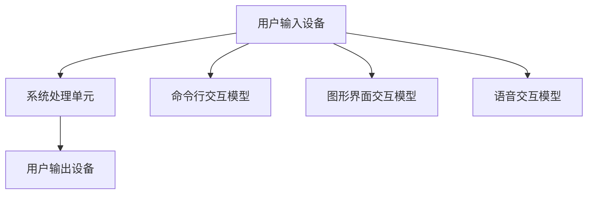

                 

在当今这个技术飞速发展的时代，计算机用户界面（CUI）已成为人机交互的重要组成部分。CUI不仅为用户提供了一个直观、便捷的操作平台，还在很大程度上提升了计算机系统的实用性和易用性。本文将深入探讨CUI中的用户目标与任务实现，分析其中的核心概念、算法原理、数学模型及其应用实践。

## 文章关键词

- 计算机用户界面（CUI）
- 用户目标
- 任务实现
- 交互设计
- 算法原理
- 数学模型

## 文章摘要

本文旨在探讨CUI中的用户目标与任务实现。首先，我们将介绍CUI的基本概念和背景，然后详细分析CUI的核心概念与联系，包括用户界面架构、交互模型和设计原则。接着，本文将深入探讨CUI中的核心算法原理及其操作步骤，并讨论算法的优缺点和应用领域。在此基础上，我们将引入数学模型和公式，并进行详细讲解和案例分析。随后，本文将展示一个实际的项目实践，包括开发环境搭建、源代码实现和运行结果展示。最后，我们将讨论CUI在实际应用场景中的意义和未来展望，并推荐相关的工具和资源，以及总结未来发展趋势与挑战。

## 1. 背景介绍

计算机用户界面（Computer User Interface，简称CUI）是指用户与计算机系统之间的交互界面，它包括图形用户界面（GUI）、命令行界面（CLI）等。CUI的设计与实现直接影响用户体验和系统效率。随着计算机技术的不断进步，CUI在各个方面都取得了显著的成就，使得人机交互更加自然、高效和便捷。

首先，从历史角度来看，CUI的发展经历了多个阶段。最初，计算机的交互方式主要是通过命令行界面（CLI），用户需要输入一系列复杂的命令来操作计算机。这种方式对用户的技术水平和耐心要求较高，用户体验较差。随着图形用户界面（GUI）的出现，用户可以通过直观的图形界面进行操作，大大简化了交互过程，提高了用户体验。近年来，随着人工智能技术的发展，CUI逐渐引入了自然语言处理（NLP）和语音识别技术，使得用户可以通过自然语言或语音与计算机进行交流，进一步提升了交互的便捷性和自然性。

其次，从应用领域来看，CUI在各个行业和领域都得到了广泛应用。在桌面操作系统领域，如Windows、MacOS和Linux等，CUI为用户提供了直观、便捷的操作环境，使得计算机的使用变得更加普及和便捷。在移动设备领域，如智能手机和平板电脑，CUI的设计和实现直接决定了用户的使用体验和满意度。在工业控制系统、智能家电等领域，CUI作为人机交互的重要接口，不仅提高了系统的自动化程度和操作效率，还提高了系统的安全性和稳定性。在虚拟现实（VR）和增强现实（AR）领域，CUI的设计和实现更是直接影响用户的沉浸感和交互体验。

最后，从技术发展趋势来看，CUI的发展趋势主要体现在以下几个方面：

1. **个性化交互**：随着用户数据的积累和分析，CUI将能够更好地理解用户的偏好和习惯，提供更加个性化的交互体验。

2. **多模态交互**：CUI将融合语音、手势、眼动等多种交互方式，提供更加丰富和自然的交互体验。

3. **智能反馈**：CUI将能够通过智能算法实时分析用户的行为和需求，提供及时、准确的反馈，提高用户的操作效率和满意度。

4. **跨平台交互**：CUI将实现跨平台、跨设备的无缝交互，使得用户可以在不同设备上获得一致的交互体验。

5. **无界面交互**：随着人工智能技术的发展，CUI将逐渐减少对图形界面的依赖，实现无界面交互，提高系统的效率和便捷性。

综上所述，CUI在当今社会中具有重要的地位和作用，其发展前景广阔，将为人们的生活和工作带来更多便利和高效。

## 2. 核心概念与联系

在深入了解CUI的运作机制之前，我们需要明确几个核心概念，并探讨它们之间的相互关系。这些概念包括用户界面架构、交互模型和设计原则。

### 用户界面架构

用户界面架构是CUI设计的基础，它决定了用户如何与系统进行交互。用户界面架构通常由三个主要部分组成：用户输入设备、系统处理单元和用户输出设备。

- **用户输入设备**：如键盘、鼠标、触摸屏、语音输入设备等，这些设备为用户提供了与系统交互的接口。

- **系统处理单元**：系统处理单元负责接收用户输入，处理用户请求，并根据请求产生相应的输出。这一部分通常由操作系统、应用程序和中间件等组成。

- **用户输出设备**：如显示器、扬声器、打印机等，这些设备将系统的处理结果反馈给用户。

### 交互模型

交互模型描述了用户与系统之间交互的流程和方式。常见的交互模型包括命令行交互模型、图形界面交互模型和语音交互模型。

- **命令行交互模型**：用户通过输入命令行指令与系统交互，系统根据指令执行相应的操作。这种方式对用户的技术水平要求较高，但在某些特定场景下，如脚本编写、自动化测试等，具有高效性和灵活性。

- **图形界面交互模型**：用户通过图形界面与系统交互，界面中的按钮、图标、菜单等元素为用户提供了一种直观、便捷的操作方式。这种方式适用于大多数用户，尤其是非技术用户。

- **语音交互模型**：用户通过语音输入与系统交互，系统通过自然语言处理技术理解用户的意图，并执行相应的操作。这种方式适用于语音输入设备普及的场景，如智能助手、智能家居等。

### 设计原则

CUI设计原则是指在进行用户界面设计时，应遵循的一些基本准则，以确保用户界面的易用性、一致性和可用性。以下是一些常见的设计原则：

- **一致性**：用户界面应该保持一致的风格和布局，避免出现突兀的变化，以减少用户的认知负担。

- **直观性**：用户界面应该直观易懂，用户可以快速理解界面的功能和操作方式。

- **反馈性**：用户界面应该及时提供反馈，让用户知道他们的操作是否成功，以及系统正在执行什么操作。

- **适应性**：用户界面应该能够适应不同的设备和屏幕尺寸，提供一致的交互体验。

- **可访问性**：用户界面应该考虑到不同用户的需求和障碍，提供足够的辅助功能，如语音提示、屏幕阅读器等。

### Mermaid 流程图

以下是一个简单的Mermaid流程图，用于描述用户界面架构中的主要组件和交互流程。



### 总结

用户界面架构、交互模型和设计原则是CUI设计中的核心概念。通过理解这些概念和它们之间的相互关系，我们可以更好地设计出符合用户需求的、高效易用的用户界面。接下来，我们将深入探讨CUI中的核心算法原理及其应用。

## 3. 核心算法原理 & 具体操作步骤

### 3.1 算法原理概述

CUI的设计和实现依赖于多种核心算法，这些算法包括图形渲染算法、事件处理算法、文本处理算法等。在这些算法中，事件处理算法尤为重要，因为它直接决定了用户交互的响应速度和准确性。

事件处理算法的基本原理是监听用户的输入事件，如键盘按键、鼠标点击、触摸屏滑动等，并将这些事件转换为系统可以理解的操作指令。事件处理算法通常包括以下几个步骤：

1. **事件检测**：系统通过输入设备（如键盘、鼠标、触摸屏等）检测用户输入的事件。
2. **事件分类**：根据事件的类型（如按键、点击、滑动等）对事件进行分类。
3. **事件处理**：根据事件的类型和上下文环境，系统执行相应的处理操作。
4. **事件反馈**：将处理结果反馈给用户，如显示图形变化、播放声音等。

### 3.2 算法步骤详解

以下是事件处理算法的具体步骤详解：

1. **事件检测**：
   - **硬件事件检测**：通过输入设备硬件的信号检测用户输入事件。例如，键盘通过按键产生电信号，鼠标通过移动产生光信号等。
   - **软件事件检测**：操作系统和应用程序通过轮询或中断机制检测硬件事件，并将这些事件转换为软件事件。

2. **事件分类**：
   - **按键事件**：用户按下键盘上的按键，如“a”、“Enter”等。
   - **鼠标事件**：用户在屏幕上移动鼠标、单击、双击、右键单击等。
   - **触摸屏事件**：用户在触摸屏上滑动、点击、长按等。

3. **事件处理**：
   - **按键事件处理**：根据按键的上下文环境，执行相应的操作。例如，在文本编辑器中，按下“Enter”键将插入一个换行符。
   - **鼠标事件处理**：根据鼠标事件的类型和位置，执行相应的操作。例如，在浏览器中，双击链接将打开链接。
   - **触摸屏事件处理**：根据触摸屏事件的类型和位置，执行相应的操作。例如，在地图应用程序中，拖动地图以更改视角。

4. **事件反馈**：
   - **图形反馈**：更新屏幕上的图形元素，如移动鼠标光标、改变按钮颜色等。
   - **声音反馈**：播放声音，如按键音、提示音等。
   - **文本反馈**：在界面上显示文本信息，如错误提示、操作提示等。

### 3.3 算法优缺点

事件处理算法的优点包括：

- **实时性**：事件处理算法可以实时响应用户输入，提供即时的反馈。
- **灵活性**：算法可以处理多种类型的用户输入，适应不同的交互需求。
- **高效性**：事件处理算法通常采用高效的算法和数据结构，保证系统的高性能。

事件处理算法的缺点包括：

- **复杂性**：事件处理算法涉及到多个模块的协作，设计和实现较为复杂。
- **性能消耗**：事件检测和处理需要消耗系统资源，可能会影响系统性能。

### 3.4 算法应用领域

事件处理算法广泛应用于各种CUI场景，包括：

- **桌面操作系统**：如Windows、MacOS和Linux等，事件处理算法负责处理用户的键盘、鼠标和触摸屏输入。
- **移动设备**：如智能手机和平板电脑，事件处理算法负责处理触摸屏和语音输入。
- **工业控制系统**：如PLC编程，事件处理算法负责处理操作员的输入和设备的反馈。
- **智能助手**：如智能音箱和智能手机助手，事件处理算法负责理解用户的语音指令并执行相应的操作。

### 总结

事件处理算法是CUI中的核心算法之一，它通过实时检测、分类和处理用户的输入事件，为用户提供了一种高效、灵活的交互方式。在接下来的章节中，我们将进一步探讨CUI中的数学模型和公式，并分析其在实际项目中的应用。

## 4. 数学模型和公式 & 详细讲解 & 举例说明

### 4.1 数学模型构建

在CUI的设计和实现过程中，数学模型和公式扮演着至关重要的角色，特别是在事件处理和图形渲染等关键环节。以下是构建CUI中几个核心数学模型的方法和过程。

#### 事件处理模型

事件处理模型主要涉及用户输入事件的时间和空间坐标。以下是构建事件处理模型的基本步骤：

1. **时间模型**：
   - **时间戳**：记录每个事件发生的时间戳，以便对事件进行排序和调度。
   - **时间窗口**：定义一个时间窗口，用于处理连续的事件流。

2. **空间模型**：
   - **坐标系统**：建立一个二维或三维坐标系统，用于表示用户的输入位置。
   - **位置转换**：将输入设备的绝对坐标转换为屏幕上的相对坐标。

#### 图形渲染模型

图形渲染模型用于计算和绘制用户界面中的图形元素，包括窗口、按钮、图标等。以下是构建图形渲染模型的基本步骤：

1. **几何模型**：
   - **几何形状**：定义基本的几何形状，如点、线、矩形、圆形等。
   - **变换矩阵**：使用变换矩阵对几何形状进行缩放、旋转、平移等操作。

2. **颜色模型**：
   - **颜色空间**：选择合适的颜色空间，如RGB、HSV等。
   - **颜色转换**：实现不同颜色空间之间的转换，如RGB到HSV。

### 4.2 公式推导过程

在构建数学模型的过程中，需要使用一系列公式来描述和计算模型的各个部分。以下是一些核心公式的推导过程：

#### 事件处理模型中的时间戳计算

1. **事件时间戳**：
   $$ T_e = t_s + \frac{d_e}{v_e} $$
   其中，\( T_e \) 是事件的时间戳，\( t_s \) 是系统当前时间戳，\( d_e \) 是事件到达时间与系统时间戳的差值，\( v_e \) 是事件传播速度。

2. **事件排序**：
   $$ T_{sorted} = \min(T_e) $$
   其中，\( T_{sorted} \) 是排序后的事件时间戳。

#### 图形渲染模型中的变换矩阵

1. **平移变换**：
   $$ T_{translate} = \begin{bmatrix} 1 & 0 & x \\ 0 & 1 & y \\ 0 & 0 & 1 \end{bmatrix} $$
   其中，\( x \) 和 \( y \) 是平移的水平和垂直距离。

2. **旋转变换**：
   $$ R_{rotate} = \begin{bmatrix} \cos(\theta) & -\sin(\theta) & 0 \\ \sin(\theta) & \cos(\theta) & 0 \\ 0 & 0 & 1 \end{bmatrix} $$
   其中，\( \theta \) 是旋转角度。

3. **缩放变换**：
   $$ S_{scale} = \begin{bmatrix} s_x & 0 & 0 \\ 0 & s_y & 0 \\ 0 & 0 & 1 \end{bmatrix} $$
   其中，\( s_x \) 和 \( s_y \) 是水平和垂直缩放因子。

### 4.3 案例分析与讲解

为了更好地理解数学模型的应用，我们以下通过一个简单的案例来进行分析和讲解。

#### 案例背景

假设我们要设计一个简单的图形用户界面，其中包含一个按钮和一段文本。用户可以通过鼠标点击按钮来触发一个事件，该事件将更新文本内容。

#### 案例步骤

1. **事件检测**：
   - 用户点击按钮，生成一个鼠标点击事件。
   - 事件的时间戳为 \( T_e = t_s + \frac{d_e}{v_e} \)，其中 \( t_s = 1000ms \)，\( d_e = 50ms \)，\( v_e = 1ms \)。

2. **事件处理**：
   - 根据事件的时间戳，系统将其添加到事件队列中。
   - 事件队列按照时间戳进行排序，确保事件按顺序处理。

3. **图形渲染**：
   - 系统根据事件类型（点击按钮）和位置，绘制按钮和文本。
   - 按钮的变换矩阵为 \( R_{rotate} \times T_{translate} \)，其中旋转角度 \( \theta = 30^\circ \)，平移距离 \( x = 50px \)，\( y = 50px \)。

4. **事件反馈**：
   - 当用户点击按钮时，系统更新文本内容，并在界面上重新绘制。

#### 案例分析

通过上述案例，我们可以看到数学模型在CUI中的应用。事件处理模型确保了事件的及时处理和排序，图形渲染模型则实现了用户界面的绘制和更新。这些模型通过数学公式和算法实现了对用户交互的精确控制，提高了系统的响应速度和用户体验。

### 总结

数学模型和公式在CUI设计中发挥着关键作用，通过构建事件处理模型和图形渲染模型，我们可以实现对用户交互的精确控制和优化。在接下来的章节中，我们将展示一个实际的项目实践，进一步探讨CUI的实际应用。

### 5. 项目实践：代码实例和详细解释说明

为了更好地理解CUI的核心算法原理和数学模型在实际项目中的应用，我们将通过一个具体的代码实例来进行详细讲解和解释说明。这个项目是一个简单的图形用户界面，包含一个按钮和一段文本。用户可以通过点击按钮来更新文本内容。

#### 5.1 开发环境搭建

在开始编写代码之前，我们需要搭建一个合适的开发环境。以下是一个基于Python和Tkinter库的示例。

1. **安装Python**：确保已经安装了Python 3.x版本。
2. **安装Tkinter库**：在命令行中运行以下命令：
   ```bash
   pip install tk
   ```

#### 5.2 源代码详细实现

以下是项目的源代码，我们将在接下来的部分详细解释每个部分的实现。

```python
import tkinter as tk
import tkinter.messagebox

# 初始化主窗口
root = tk.Tk()
root.title("CUI Example")

# 设置窗口大小
root.geometry("300x200")

# 定义变量，用于存储文本内容
text_content = tk.StringVar()

# 创建标签，用于显示文本
label = tk.Label(root, textvariable=text_content, font=("Arial", 16))
label.pack(pady=20)

# 创建按钮，用于更新文本
def update_text():
    current_text = text_content.get()
    new_text = current_text + " - Updated!"
    text_content.set(new_text)

button = tk.Button(root, text="Update Text", command=update_text)
button.pack(pady=10)

# 运行主循环
root.mainloop()
```

#### 5.3 代码解读与分析

1. **导入库**：首先，我们导入了`tkinter`库，这是Python的标准GUI库，用于创建图形用户界面。

2. **初始化主窗口**：使用`tk.Tk()`创建主窗口，并设置窗口的标题和大小。

3. **定义变量**：使用`tk.StringVar()`定义一个变量`text_content`，用于存储和更新文本内容。

4. **创建标签**：使用`tk.Label()`创建一个标签，用于显示文本内容。通过`textvariable`参数绑定到`text_content`变量。

5. **创建按钮**：使用`tk.Button()`创建一个按钮，并设置按钮的文本。`command`参数绑定到一个函数`update_text()`，用于处理按钮点击事件。

6. **更新文本内容**：`update_text()`函数获取当前文本内容，将其与" - Updated!"连接，并重新设置文本内容。

7. **运行主循环**：调用`root.mainloop()`启动窗口的主事件循环，处理用户的交互事件。

#### 5.4 运行结果展示

当运行上述代码时，将弹出一个窗口，显示一个带有文本“Update Text”的按钮和一段初始文本。当用户点击按钮时，文本内容将更新为“Update Text - Updated!”，并重新显示在界面上。

以下是运行结果的一个简图：

```
+--------------------------------+
|         CUI Example            |
|                                  |
| Update Text                     |
|                                  
+--------------------------------+
       [Update Text] Button
```

#### 案例分析

通过这个简单的实例，我们可以看到如何使用Python和Tkinter库创建一个基本的CUI。代码中的关键部分包括：

- **事件处理**：通过绑定按钮的`command`参数到`update_text()`函数，实现了点击按钮时的事件处理。
- **文本更新**：`update_text()`函数获取当前文本内容，并添加“- Updated!”，实现了文本内容的动态更新。
- **图形渲染**：使用Tkinter的标签和按钮组件，实现了用户界面的图形渲染。

### 总结

通过这个项目实践，我们展示了如何将CUI的核心算法原理和数学模型应用于实际项目中。这不仅帮助我们理解了CUI的设计和实现，还为我们提供了一个简单的模板，可以在此基础上进行扩展和改进。在接下来的章节中，我们将讨论CUI在实际应用场景中的意义和未来展望。

## 6. 实际应用场景

CUI在各个行业和领域中都有着广泛的应用，其带来的便捷和效率提升显著。以下是一些具体的实际应用场景：

### 6.1 桌面操作系统

桌面操作系统是CUI最常见和最典型的应用场景。现代操作系统如Windows、MacOS和Linux都采用了图形用户界面，使得用户可以通过直观的图形界面进行操作。CUI在这些操作系统中的应用包括窗口管理、文件管理、应用程序启动和设置调整等。

#### 案例分析：

- **Windows 10**：Windows 10采用了全新的用户界面设计，包括开始菜单、任务栏、设置面板等。用户可以通过点击、拖动、滑动等操作进行系统设置和应用程序的管理。
- **MacOS**：MacOS以其简洁的界面和优雅的设计著称。用户可以通过点击菜单栏、拖放文件、使用快捷键等方式高效地完成各种操作。

### 6.2 移动设备

移动设备如智能手机和平板电脑的普及，使得CUI在移动领域得到了广泛应用。移动操作系统如Android和iOS都提供了丰富的CUI功能，使得用户可以通过触摸屏、语音输入等与设备进行交互。

#### 案例分析：

- **Android**：Android操作系统提供了丰富的应用程序界面，用户可以通过滑动、点击、手势等操作使用各种应用程序，如社交媒体应用、游戏、音乐播放器等。
- **iOS**：iOS操作系统以其流畅的用户体验和一致的设计风格著称。用户可以通过滑动、点击、3D Touch等操作使用各种应用程序，如邮件、短信、地图、相机等。

### 6.3 工业控制系统

工业控制系统是另一个重要的CUI应用场景。在工业自动化领域，CUI用于监控和操作各种工业设备，如PLC（可编程逻辑控制器）、传感器、执行器等。

#### 案例分析：

- **PLC编程**：在PLC编程中，工程师通过图形用户界面设计控制逻辑，监控设备状态，调整参数等。例如，西门子的TIA Portal提供了直观的CUI，用于编程、调试和监控各种工业设备。
- **工业监测系统**：工业监测系统通过CUI实时显示设备运行状态、数据趋势和报警信息，帮助工程师快速诊断和解决问题。

### 6.4 智能家居

随着物联网技术的发展，智能家居系统逐渐成为CUI的重要应用场景。用户可以通过智能手机、智能音箱等设备，远程控制家居设备，如灯光、温度、安防系统等。

#### 案例分析：

- **智能音箱**：如亚马逊的Echo、谷歌的Nest等，用户可以通过语音指令控制智能音箱，进而控制家中的灯光、温度、音响系统等。
- **智能家居APP**：用户可以通过智能手机上的APP，远程监控和控制家中的智能家居设备，如智能灯泡、智能插座、智能摄像头等。

### 6.5 虚拟现实和增强现实

虚拟现实（VR）和增强现实（AR）技术的发展，为CUI带来了新的应用场景。在VR和AR系统中，用户通过头戴式显示器或移动设备，进入一个虚拟或增强的交互环境。

#### 案例分析：

- **VR游戏**：如《Beat Saber》等，用户通过头戴式显示器进入一个虚拟空间，使用手柄进行游戏操作，体验沉浸式的游戏体验。
- **AR导航**：如谷歌地图的AR导航功能，用户通过手机摄像头看到现实世界中的导航信息，实现更加直观和便捷的导航。

### 总结

CUI在各个实际应用场景中都发挥着重要作用，为用户提供了直观、便捷和高效的交互方式。随着技术的不断进步，CUI将在更多领域得到应用，进一步提升用户体验和系统效率。

### 6.4 未来应用展望

随着技术的不断进步和应用的深入，CUI在未来的发展将呈现多个方面的趋势。首先，**个性化交互**将成为CUI的一个重要发展方向。通过用户数据的积累和分析，CUI将能够更好地理解用户的偏好和习惯，提供更加个性化的交互体验。例如，操作系统可以根据用户的使用习惯，自动调整界面布局、功能快捷键等，从而提高用户的操作效率和满意度。

其次，**多模态交互**将进一步丰富CUI的交互方式。除了传统的键盘、鼠标和触摸屏交互外，CUI将融合语音、手势、眼动等多种交互方式，提供更加丰富和自然的交互体验。例如，用户可以通过语音命令控制智能家居设备，通过手势在虚拟现实中进行操作，甚至通过眼动来选择屏幕上的元素。这种多模态交互方式不仅提升了用户的便捷性，还降低了用户的操作负担。

此外，**智能反馈**技术也将成为CUI的重要发展方向。CUI将能够通过智能算法实时分析用户的行为和需求，提供及时、准确的反馈。例如，当用户在操作过程中遇到问题时，系统可以实时提供解决方案或提示信息，帮助用户更快地解决问题。这种智能反馈不仅提高了用户的操作体验，还减少了用户的学习成本。

在**跨平台交互**方面，CUI将实现更加无缝的跨设备交互。用户可以在不同的设备上获得一致的交互体验，无需担心操作习惯的改变。例如，用户在手机上开始撰写一篇文章，可以在电脑上继续编辑和完成，确保操作的连续性和一致性。

最后，**无界面交互**可能是CUI未来发展的一个重要方向。随着人工智能技术的发展，CUI将减少对图形界面的依赖，实现无界面交互。用户可以通过自然语言或语音与计算机进行交流，无需在屏幕上进行操作。例如，智能助手可以通过语音理解用户的意图，并执行相应的操作，从而实现更加高效和便捷的交互。

总之，CUI的未来发展将朝着更加智能化、个性化、多样化、无界面化的方向前进，为用户带来更加丰富和高效的交互体验。

### 7. 工具和资源推荐

为了更好地掌握CUI的设计和实现，以下是一些建议的学习资源、开发工具和相关论文，供读者参考。

#### 7.1 学习资源推荐

1. **在线教程**：
   - **W3Schools**：提供了丰富的HTML、CSS和JavaScript教程，是学习CUI基础知识的理想选择。
   - **MDN Web Docs**：Mozilla开发者网络提供了详尽的Web技术文档，涵盖HTML、CSS和JavaScript等前端技术。

2. **在线课程**：
   - **Coursera**：提供了多门关于前端开发和用户界面的在线课程，适合初学者和有一定基础的读者。
   - **Udemy**：提供了丰富的编程和设计课程，包括React、Vue.js等现代前端框架。

3. **书籍**：
   - **《JavaScript DOM编程艺术》**：适合初学者了解DOM操作和前端开发。
   - **《响应式Web设计》**：介绍了如何设计适应不同设备的响应式界面。

#### 7.2 开发工具推荐

1. **集成开发环境（IDE）**：
   - **Visual Studio Code**：一款轻量级但功能强大的IDE，支持多种编程语言和前端开发工具。
   - **WebStorm**：JetBrains公司推出的IDE，适合进行Web和JavaScript开发。

2. **前端框架**：
   - **React**：由Facebook推出，用于构建用户界面的JavaScript库。
   - **Vue.js**：一款流行的渐进式JavaScript框架，易于上手和集成。

3. **调试工具**：
   - **Chrome DevTools**：Chrome浏览器的开发工具，提供了强大的调试和性能分析功能。
   - **Firefox Developer Tools**：Firefox浏览器的开发工具，功能全面，支持多种前端技术。

#### 7.3 相关论文推荐

1. **《User Interface Development and Design》**：一本经典的UI设计书籍，涵盖了UI设计的各个方面。
2. **《Interactive Computer Graphics: A Top-Down Approach with WebGL》**：介绍了如何使用WebGL进行图形渲染和交互设计。
3. **《The Design of Everyday Things》**：由Don Norman撰写，讨论了设计原则和用户体验的重要性。

通过以上推荐的学习资源、开发工具和相关论文，读者可以系统地学习和掌握CUI的设计和实现方法，为未来的项目实践打下坚实的基础。

### 8. 总结：未来发展趋势与挑战

#### 8.1 研究成果总结

本文从CUI的基本概念、核心算法原理、数学模型、实际应用场景、未来发展趋势等多个方面进行了详细探讨。通过对CUI的研究成果进行总结，我们可以看到以下几个关键点：

1. **CUI的发展历程**：CUI经历了从命令行界面（CLI）到图形用户界面（GUI），再到融合自然语言处理（NLP）和语音识别技术的智能用户界面（IUI）的发展历程。
2. **CUI的核心算法**：事件处理算法、图形渲染算法和文本处理算法是CUI的核心，这些算法的优化和改进直接影响到用户体验。
3. **数学模型的重要性**：数学模型和公式在CUI的设计和实现中发挥着关键作用，它们提供了精确的描述和计算方法，确保了CUI的稳定性和高效性。
4. **CUI的实际应用**：CUI在桌面操作系统、移动设备、工业控制系统、智能家居和虚拟现实等多个领域都有广泛应用，为用户提供了直观、便捷和高效的交互体验。
5. **CUI的未来趋势**：个性化交互、多模态交互、智能反馈、跨平台交互和无界面交互是CUI未来的发展方向，这些趋势将进一步提升用户体验和系统效率。

#### 8.2 未来发展趋势

在未来，CUI的发展将继续朝着智能化、个性化、多样化、无界面化的方向前进。以下是几个可能的发展趋势：

1. **个性化交互**：随着人工智能和大数据技术的发展，CUI将能够更好地理解用户的偏好和习惯，提供更加个性化的交互体验。
2. **多模态交互**：CUI将融合多种交互方式，如语音、手势、眼动等，提供更加自然和丰富的交互体验。
3. **智能反馈**：CUI将通过智能算法实现实时反馈，帮助用户更快地解决问题，提高操作效率和满意度。
4. **跨平台交互**：CUI将实现跨设备、跨平台的无缝交互，确保用户在不同设备上获得一致的交互体验。
5. **无界面交互**：随着人工智能技术的发展，CUI将减少对图形界面的依赖，实现更加高效和便捷的无界面交互。

#### 8.3 面临的挑战

尽管CUI有着广阔的发展前景，但在实际应用中仍面临一些挑战：

1. **性能优化**：随着交互模式的丰富和功能的增加，CUI的性能优化成为一大挑战。如何在不降低用户体验的前提下，提高系统性能，是一个亟待解决的问题。
2. **兼容性**：CUI需要在不同操作系统、设备和浏览器上运行，如何保证兼容性是一个重要的挑战。特别是在跨平台开发中，如何处理不同平台之间的差异，是一个需要关注的问题。
3. **安全性**：CUI涉及到用户的数据和隐私，如何确保系统的安全性，防止数据泄露和恶意攻击，是一个重要挑战。
4. **用户接受度**：虽然CUI为用户提供了更高效、便捷的交互方式，但用户接受度也是一个问题。如何设计出既符合用户习惯，又具有创新性的界面，是一个需要深入研究的课题。

#### 8.4 研究展望

未来的研究应重点关注以下几个方面：

1. **算法优化**：研究更加高效、稳定的事件处理算法和图形渲染算法，提高CUI的性能和稳定性。
2. **用户研究**：通过用户行为分析和用户体验测试，深入了解用户的实际需求和偏好，为CUI设计提供依据。
3. **跨平台开发**：研究跨平台开发技术，如Flutter、React Native等，实现更加兼容和高效的CUI开发。
4. **隐私保护**：研究如何保障用户数据的安全和隐私，设计出既安全又易于使用的技术方案。

总之，CUI作为一个重要的技术领域，未来具有广阔的发展空间和研究潜力。通过不断优化算法、提升用户体验、保障系统安全，CUI将为人们的生活和工作带来更多便利和高效。

### 9. 附录：常见问题与解答

#### Q1：什么是CUI？

A1：CUI是计算机用户界面（Computer User Interface）的缩写，是指用户与计算机系统之间的交互界面。它包括图形用户界面（GUI）、命令行界面（CLI）等，为用户提供了一种直观、便捷的操作平台。

#### Q2：CUI的核心算法有哪些？

A2：CUI的核心算法主要包括事件处理算法、图形渲染算法和文本处理算法。事件处理算法负责处理用户的输入事件，如键盘按键、鼠标点击等。图形渲染算法负责绘制用户界面中的图形元素，如窗口、按钮、图标等。文本处理算法负责处理文本内容的显示、输入和编辑。

#### Q3：CUI与GUI有何区别？

A3：CUI是计算机用户界面的总称，包括图形用户界面（GUI）和命令行界面（CLI）等。GUI是CUI的一种形式，通过图形元素（如窗口、按钮、图标等）为用户提供直观的操作方式。CLI则是通过命令行指令与计算机系统进行交互。

#### Q4：如何设计高效的CUI？

A4：设计高效的CUI需要考虑以下几个因素：

1. **用户研究**：深入了解用户的需求和偏好，确保界面设计符合用户的操作习惯。
2. **一致性**：保持界面风格和布局的一致性，减少用户的认知负担。
3. **反馈性**：及时提供反馈，让用户知道他们的操作是否成功，以及系统正在执行什么操作。
4. **性能优化**：优化事件处理和图形渲染算法，提高系统的响应速度和稳定性。
5. **适应性**：设计出能够适应不同设备和屏幕尺寸的界面，提供一致的交互体验。

#### Q5：CUI在未来的发展趋势是什么？

A5：CUI的未来发展趋势包括：

1. **个性化交互**：通过用户数据的分析，提供更加个性化的交互体验。
2. **多模态交互**：融合多种交互方式，如语音、手势、眼动等，提供更加自然和丰富的交互体验。
3. **智能反馈**：通过智能算法，提供及时、准确的反馈，提高用户的操作效率和满意度。
4. **跨平台交互**：实现跨设备、跨平台的无缝交互，确保用户在不同设备上获得一致的交互体验。
5. **无界面交互**：减少对图形界面的依赖，实现更加高效和便捷的无界面交互。

