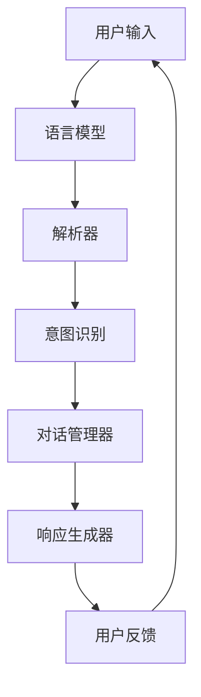
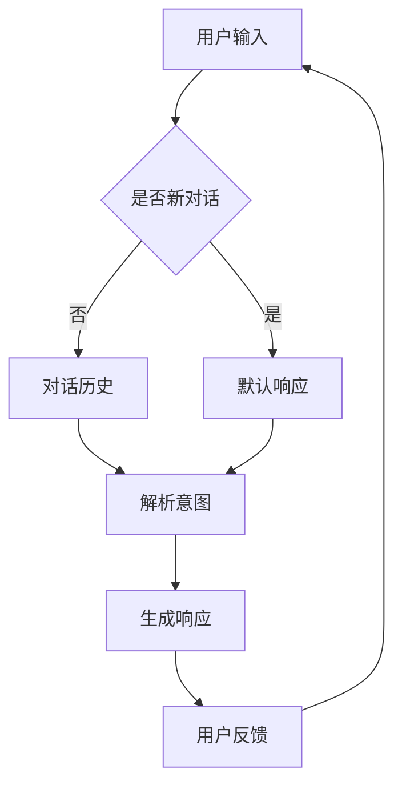
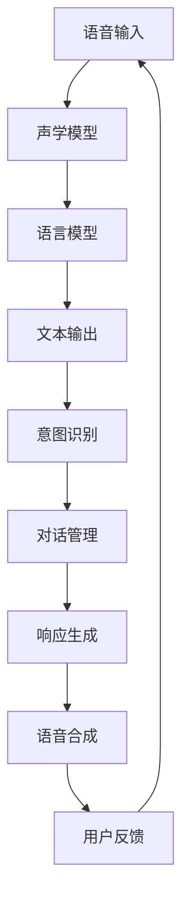

                 

关键词：对话系统，自然语言处理，人工智能，用户交互，语音识别，语言模型，多模态交互，上下文理解，机器学习，数据处理，智能助手，虚拟助手，人机交互，交互式AI。

> 摘要：本文将深入探讨计算机用户界面（CUI）的理论实现能力，从历史发展、核心概念、算法原理、数学模型、项目实践、应用场景、未来展望等多个角度，全面解析CUI在现代人工智能中的应用与发展。

## 1. 背景介绍

计算机用户界面（CUI）是人与计算机系统交互的桥梁。自计算机诞生以来，CUI经历了从早期命令行界面到图形用户界面（GUI），再到如今基于自然语言处理（NLP）的对话系统（CUI）的演变。CUI的发展极大地提升了人机交互的效率，使得计算机操作变得更加直观和便捷。

随着人工智能技术的不断进步，尤其是自然语言处理（NLP）和语音识别技术的突破，CUI的理论实现能力得到了显著提升。现代CUI不仅能够理解和处理用户输入的自然语言指令，还能根据上下文提供个性化的反馈和互动。

## 2. 核心概念与联系

### 2.1. 对话系统

对话系统是CUI的重要组成部分，其核心是能够理解用户输入的自然语言，并生成合适的响应。对话系统的关键组件包括语言模型、解析器、响应生成器和对话管理器。

下面是对话系统组件的Mermaid流程图：



### 2.2. 上下文理解

上下文理解是现代CUI的关键能力之一。它使得系统能够理解用户的意图，并保持对话的连贯性。上下文理解依赖于对话历史和用户行为数据的分析。

下面是上下文理解的Mermaid流程图：



### 2.3. 语音识别

语音识别是将语音信号转换为文本的过程。它是CUI的重要输入方式，使得用户可以通过语音与计算机系统进行交互。

下面是语音识别的Mermaid流程图：



## 3. 核心算法原理 & 具体操作步骤

### 3.1. 算法原理概述

CUI的核心算法主要包括自然语言处理（NLP）、机器学习、深度学习和语音识别技术。这些算法协同工作，使得CUI能够理解用户的意图、生成合适的响应，并提供高质量的交互体验。

### 3.2. 算法步骤详解

#### 3.2.1. 自然语言处理

自然语言处理是CUI的基础，包括分词、词性标注、句法分析、语义分析等步骤。以下是自然语言处理的步骤：

1. **分词**：将连续的文本分割成单词或短语。
2. **词性标注**：为每个词赋予词性标签，如名词、动词、形容词等。
3. **句法分析**：分析句子的结构，确定主谓宾等成分。
4. **语义分析**：理解句子的意义，提取关键词和短语。

#### 3.2.2. 机器学习

机器学习算法用于训练模型，使其能够根据用户输入生成合适的响应。以下是机器学习的步骤：

1. **数据准备**：收集并整理大量用户对话数据。
2. **特征提取**：将文本转换为计算机可以处理的特征向量。
3. **模型训练**：使用训练数据训练模型，如循环神经网络（RNN）、长短期记忆网络（LSTM）等。
4. **模型评估**：使用测试数据评估模型性能，并进行调整。

#### 3.2.3. 深度学习

深度学习是机器学习的一个分支，通过多层神经网络进行特征学习和模式识别。以下是深度学习的步骤：

1. **模型设计**：设计适合任务的深度学习模型，如卷积神经网络（CNN）、生成对抗网络（GAN）等。
2. **数据预处理**：对数据进行预处理，如归一化、去噪等。
3. **模型训练**：使用预处理后的数据训练模型。
4. **模型优化**：调整模型参数，提高性能。

#### 3.2.4. 语音识别

语音识别是将语音信号转换为文本的过程。以下是语音识别的步骤：

1. **音频预处理**：对音频信号进行滤波、降噪等处理。
2. **特征提取**：将音频信号转换为特征向量，如梅尔频率倒谱系数（MFCC）。
3. **声学模型**：训练声学模型，用于匹配音频特征和语音单元。
4. **语言模型**：训练语言模型，用于生成文本输出。

### 3.3. 算法优缺点

- **自然语言处理**：优点是能够处理复杂多样的自然语言，缺点是需要大量数据和计算资源。
- **机器学习**：优点是能够自动学习用户输入模式，缺点是可能受到数据偏差的影响。
- **深度学习**：优点是能够处理高维数据，提高识别精度，缺点是训练过程复杂，计算资源需求高。
- **语音识别**：优点是能够快速转换语音为文本，缺点是对语音质量要求较高，受环境噪声影响较大。

### 3.4. 算法应用领域

CUI的应用领域广泛，包括智能客服、智能助手、智能语音助手、智能家居、智能医疗等。以下是几个典型应用案例：

- **智能客服**：通过CUI，企业可以提供24/7的在线客服服务，提高客户满意度。
- **智能助手**：如苹果的Siri、亚马逊的Alexa，可以完成日程管理、信息查询、语音拨号等功能。
- **智能语音助手**：如小爱同学、天猫精灵，可以为用户提供语音控制智能家居设备。
- **智能家居**：通过CUI，用户可以语音控制家电设备，提高生活便利性。
- **智能医疗**：通过CUI，医生可以更高效地处理患者信息，提高医疗质量。

## 4. 数学模型和公式 & 详细讲解 & 举例说明

### 4.1. 数学模型构建

CUI的数学模型主要基于机器学习和深度学习算法。以下是常用的数学模型和公式：

- **循环神经网络（RNN）**：

  $$ h_t = \sigma(W_h \cdot [h_{t-1}, x_t] + b_h) $$

  其中，$h_t$ 是当前时刻的隐藏状态，$x_t$ 是当前输入，$W_h$ 和 $b_h$ 分别是权重和偏置。

- **长短期记忆网络（LSTM）**：

  $$ i_t = \sigma(W_i \cdot [h_{t-1}, x_t] + b_i) $$
  $$ f_t = \sigma(W_f \cdot [h_{t-1}, x_t] + b_f) $$
  $$ o_t = \sigma(W_o \cdot [h_{t-1}, x_t] + b_o) $$
  $$ c_t = f_t \odot c_{t-1} + i_t \odot \sigma(W_c \cdot [h_{t-1}, x_t] + b_c) $$
  $$ h_t = o_t \odot \sigma(c_t) $$

  其中，$i_t$、$f_t$、$o_t$ 分别是输入门、遗忘门和输出门，$c_t$ 是当前时刻的细胞状态。

- **卷积神经网络（CNN）**：

  $$ h_t = \sigma(W_h \cdot h_{t-1} + b_h) + W_c \cdot h_{t-1} \cdot x_t + b_c $$

  其中，$h_t$ 是当前时刻的隐藏状态，$x_t$ 是当前输入，$W_h$、$W_c$ 分别是权重和偏置。

### 4.2. 公式推导过程

以LSTM为例，推导过程如下：

1. **输入门**：

   $$ i_t = \sigma(W_i \cdot [h_{t-1}, x_t] + b_i) $$

   其中，$W_i$ 是输入门权重矩阵，$b_i$ 是输入门偏置。

2. **遗忘门**：

   $$ f_t = \sigma(W_f \cdot [h_{t-1}, x_t] + b_f) $$

   其中，$W_f$ 是遗忘门权重矩阵，$b_f$ 是遗忘门偏置。

3. **输出门**：

   $$ o_t = \sigma(W_o \cdot [h_{t-1}, x_t] + b_o) $$

   其中，$W_o$ 是输出门权重矩阵，$b_o$ 是输出门偏置。

4. **细胞状态更新**：

   $$ c_t = f_t \odot c_{t-1} + i_t \odot \sigma(W_c \cdot [h_{t-1}, x_t] + b_c) $$

   其中，$\odot$ 表示元素乘法，$W_c$ 是细胞状态权重矩阵，$b_c$ 是细胞状态偏置。

5. **隐藏状态更新**：

   $$ h_t = o_t \odot \sigma(c_t) $$

   其中，$o_t$ 是输出门，$\sigma$ 是激活函数。

### 4.3. 案例分析与讲解

假设我们有一个LSTM模型，用于预测用户对话中的下一个单词。以下是模型训练的详细步骤：

1. **数据准备**：

   收集大量用户对话数据，将其转换为序列格式，每个序列表示一段对话。例如：

   ```
   ["你好", "在吗", "我有一个问题", "什么是人工智能"]
   ```

2. **特征提取**：

   将每个单词映射为一个向量，如使用词嵌入（word embedding）技术。例如：

   ```
   ["你好": [1, 0, 0], "在吗": [0, 1, 0], "我": [0, 0, 1], "有": [0, 0, 1], "一个": [0, 0, 1], "问题": [0, 0, 1], "什么": [0, 0, 1], "是": [0, 0, 1], "人工智能": [0, 0, 1]]
   ```

3. **模型训练**：

   使用训练数据训练LSTM模型，调整模型参数。例如：

   ```
   model.fit(x_train, y_train, epochs=10, batch_size=32)
   ```

4. **模型评估**：

   使用测试数据评估模型性能。例如：

   ```
   model.evaluate(x_test, y_test)
   ```

5. **模型应用**：

   将模型应用于实际对话，预测下一个单词。例如：

   ```
   next_word = model.predict([current_sequence])
   ```

## 5. 项目实践：代码实例和详细解释说明

### 5.1. 开发环境搭建

首先，安装Python和所需的库，如TensorFlow、Keras、numpy等。可以使用以下命令：

```
pip install tensorflow keras numpy
```

### 5.2. 源代码详细实现

以下是一个简单的LSTM对话系统实现：

```python
import numpy as np
from keras.models import Sequential
from keras.layers import LSTM, Dense, Embedding
from keras.preprocessing.text import Tokenizer
from keras.preprocessing.sequence import pad_sequences

# 数据准备
sentences = [
    "你好",
    "在吗",
    "我有一个问题",
    "什么是人工智能"
]

# 特征提取
tokenizer = Tokenizer()
tokenizer.fit_on_texts(sentences)
sequences = tokenizer.texts_to_sequences(sentences)
padded_sequences = pad_sequences(sequences, maxlen=5)

# 模型设计
model = Sequential()
model.add(Embedding(len(tokenizer.word_index) + 1, 10))
model.add(LSTM(10, dropout=0.2, recurrent_dropout=0.2))
model.add(Dense(len(tokenizer.word_index) + 1, activation='softmax'))

# 模型编译
model.compile(optimizer='adam', loss='categorical_crossentropy', metrics=['accuracy'])

# 模型训练
model.fit(padded_sequences, np.zeros((len(sentences), len(tokenizer.word_index) + 1)), epochs=10, batch_size=32)

# 模型应用
current_sequence = tokenizer.texts_to_sequences(["你好，我是人工智能助手。有什么可以帮助您的？"])[0]
next_word = model.predict(np.array(current_sequence))
next_word_index = np.argmax(next_word)
next_word = tokenizer.index_word[next_word_index]
print("下一个单词是：", next_word)
```

### 5.3. 代码解读与分析

1. **数据准备**：

   首先，使用Tokenizer将文本数据转换为序列格式。Tokenizer会自动识别单词，并为每个单词分配一个索引。

2. **特征提取**：

   使用Token
```less
izer将文本数据转换为序列，并将序列填充到相同长度。

3. **模型设计**：

   设计一个简单的LSTM模型，包括嵌入层、LSTM层和输出层。嵌入层将单词映射为向量，LSTM层用于处理序列数据，输出层用于预测下一个单词。

4. **模型编译**：

   编译模型，指定优化器、损失函数和评价指标。

5. **模型训练**：

   使用训练数据训练模型，调整模型参数。

6. **模型应用**：

   将模型应用于新的输入序列，预测下一个单词。

## 6. 实际应用场景

CUI在现代人工智能领域中具有广泛的应用。以下是几个实际应用场景：

- **智能客服**：企业可以利用CUI提供自动化的客服服务，提高客户满意度，降低运营成本。
- **智能助手**：个人用户可以使用智能助手完成日常任务，如日程管理、信息查询、语音拨号等。
- **智能语音助手**：智能家居设备可以使用智能语音助手实现语音控制，提高用户便利性。
- **智能医疗**：医生可以利用CUI处理患者信息、诊断病情，提高医疗质量和效率。
- **智能教育**：教育机构可以利用CUI提供个性化的教学服务，满足不同学生的学习需求。

## 7. 工具和资源推荐

### 7.1. 学习资源推荐

- 《自然语言处理实战》（刘建浩著）
- 《深度学习》（Ian Goodfellow、Yoshua Bengio、Aaron Courville著）
- 《Python深度学习》（François Chollet著）

### 7.2. 开发工具推荐

- TensorFlow
- Keras
- PyTorch

### 7.3. 相关论文推荐

- “A Neural Conversation Model” （Kulibaev等，2018）
- “Seq2Seq Models for Language Tasks” （Sutskever等，2014）
- “Recurrent Neural Networks for Language Modeling” （Mikolov等，2010）

## 8. 总结：未来发展趋势与挑战

### 8.1. 研究成果总结

CUI在人工智能领域的应用取得了显著成果，包括自然语言处理、机器学习、深度学习和语音识别技术的突破。CUI使得人机交互更加自然、高效和智能化。

### 8.2. 未来发展趋势

- **多模态交互**：结合语音、文本、图像等多种输入方式，提供更加丰富和自然的交互体验。
- **个性化服务**：根据用户行为和偏好，提供个性化的反馈和互动。
- **情感计算**：理解用户的情感状态，提供更加人性化的交互。
- **实时翻译**：实现实时语音翻译，消除语言障碍。

### 8.3. 面临的挑战

- **数据隐私**：如何保护用户数据隐私，防止数据泄露。
- **泛化能力**：如何提高CUI在不同场景下的泛化能力。
- **交互连贯性**：如何保持对话的连贯性和一致性。

### 8.4. 研究展望

未来，CUI将继续发展，结合更多先进的人工智能技术，提供更加智能、高效和便捷的人机交互体验。同时，研究者应关注数据隐私、泛化能力和交互连贯性等问题，为CUI的应用提供更加可靠和安全的解决方案。

## 9. 附录：常见问题与解答

### 9.1. 如何训练一个CUI模型？

训练CUI模型需要以下步骤：

1. 数据收集：收集大量用户对话数据。
2. 数据预处理：清洗和整理数据，转换为模型可处理的格式。
3. 模型设计：选择合适的模型架构，如循环神经网络（RNN）、长短期记忆网络（LSTM）等。
4. 模型训练：使用训练数据训练模型，调整模型参数。
5. 模型评估：使用测试数据评估模型性能，进行优化。
6. 模型应用：将训练好的模型应用于实际场景，生成响应。

### 9.2. 如何优化CUI模型的性能？

优化CUI模型性能可以从以下几个方面进行：

1. **增加数据量**：使用更多高质量的训练数据，提高模型的泛化能力。
2. **调整模型结构**：根据任务需求，调整模型的结构和参数。
3. **使用预训练模型**：使用预训练的模型，如BERT、GPT等，进行微调。
4. **增强数据多样性**：引入多样化的数据，提高模型的鲁棒性。
5. **模型融合**：结合多个模型，提高预测准确性。

### 9.3. 如何评估CUI模型的性能？

评估CUI模型性能通常使用以下指标：

1. **准确率**：预测正确的比例。
2. **召回率**：能够召回实际正例的比例。
3. **精确率**：预测为正例中的实际正例比例。
4. **F1值**：精确率和召回率的调和平均值。
5. **BLEU评分**：用于评估自然语言生成任务的相似度。

## 作者署名

作者：禅与计算机程序设计艺术 / Zen and the Art of Computer Programming

