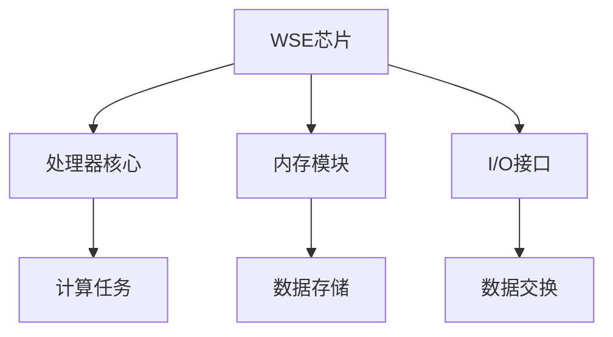

                 

关键词：Cerebras-GPT，深度学习，自然语言处理，计算机编程，代码实例，模型架构，算法原理，数学模型，实际应用

## 摘要

本文旨在深入讲解Cerebras-GPT的工作原理，并提供一个详细的代码实例解析。Cerebras-GPT是一款基于Cerebras Systems公司的WSE（Wafer-Scale Engine）芯片的巨型深度学习模型，专为自然语言处理任务而设计。文章将首先介绍Cerebras-GPT的背景和核心概念，然后详细解析其算法原理和数学模型，最后通过一个实际代码实例展示如何使用Cerebras-GPT进行文本生成任务。读者将获得对Cerebras-GPT的全面理解，并能够将其应用于实际的开发项目中。

## 1. 背景介绍

### Cerebras Systems简介

Cerebras Systems成立于2016年，是一家专注于为人工智能应用提供高性能计算解决方案的初创公司。其核心技术是WSE（Wafer-Scale Engine），这是一款集成有数百亿个晶体管的巨型处理器芯片。WSE芯片的尺寸达到一个晶圆的规模（约300mm x 300mm），远远超过了传统GPU和TPU的大小。这种大规模集成使得WSE能够在单个芯片上实现前所未有的计算能力和内存容量，从而极大地提升了深度学习模型的训练和推理速度。

### GPT模型的演进

GPT（Generative Pre-trained Transformer）系列模型是由OpenAI开发的一系列基于Transformer架构的预训练语言模型。自2018年GPT-1发布以来，GPT系列模型逐渐成为自然语言处理领域的重要工具。GPT-2、GPT-3等后续版本在模型规模、参数数量和性能上不断突破，使得模型在文本生成、机器翻译、问答系统等任务上取得了显著效果。

### Cerebras-GPT的出现

Cerebras-GPT是结合了Cerebras Systems的WSE芯片和GPT模型的技术突破。它利用WSE芯片的巨大计算和存储能力，将GPT模型的规模扩展到了前所未有的水平。Cerebras-GPT的出现标志着深度学习模型在自然语言处理领域的新里程碑，为处理更复杂、更大的数据集提供了强大的工具。

## 2. 核心概念与联系

### Cerebras-GPT架构

Cerebras-GPT的架构设计旨在充分利用WSE芯片的巨大计算能力和内存容量。其核心组成部分包括：

- **处理器核心**：WSE芯片包含有数百万个处理器核心，能够并行执行大量计算任务。
- **内存模块**：WSE芯片拥有巨大的内存带宽，能够快速读取和写入大量数据。
- **I/O接口**：WSE芯片配备有高速I/O接口，用于与其他硬件设备进行数据交换。

以下是一个简化的Mermaid流程图，展示了Cerebras-GPT的架构：



### 核心概念原理

- **Transformer架构**：Cerebras-GPT基于Transformer架构，这是一种专门用于处理序列数据的神经网络模型。Transformer通过自注意力机制（Self-Attention）来捕捉输入序列中的长距离依赖关系。
- **预训练与微调**：Cerebras-GPT首先通过大规模的预训练数据集进行预训练，以学习语言的基本规则和知识。然后，通过微调技术将模型适应特定的自然语言处理任务。
- **分布式训练**：由于Cerebras-GPT的规模巨大，其训练过程需要在多个WSE芯片上分布式进行。这种分布式训练方式能够显著提升训练效率，缩短模型训练时间。

### Cerebras-GPT与GPT模型的联系

Cerebras-GPT是在GPT模型基础上进行扩展和优化的。两者在模型架构、训练方法和应用目标上存在一定联系：

- **模型架构**：Cerebras-GPT保留了GPT的核心架构，包括Transformer编码器和解码器。
- **预训练数据集**：Cerebras-GPT和GPT模型都使用了大规模的预训练数据集，如维基百科、书籍、新闻文章等。
- **应用目标**：Cerebras-GPT的目标是处理更复杂、更大的自然语言处理任务，如长文本生成、对话系统等。

## 3. 核心算法原理 & 具体操作步骤

### 3.1 算法原理概述

Cerebras-GPT的核心算法是基于Transformer架构的预训练语言模型。其原理可以概括为以下几个关键步骤：

1. **自注意力机制（Self-Attention）**：Transformer通过自注意力机制来计算输入序列中每个词的权重，从而捕捉长距离依赖关系。
2. **前馈神经网络（Feedforward Neural Network）**：在自注意力机制的基础上，Transformer引入了前馈神经网络来进一步处理每个词的表示。
3. **编码器-解码器结构（Encoder-Decoder Structure）**：编码器用于处理输入序列，解码器用于生成输出序列。编码器和解码器之间通过多头自注意力机制和交叉注意力机制进行交互。
4. **预训练与微调**：预训练阶段通过无监督学习从大量文本数据中学习语言的通用特征。微调阶段将预训练模型适应特定的自然语言处理任务。

### 3.2 算法步骤详解

#### 预训练阶段

1. **数据预处理**：读取大规模文本数据集，并进行分词、去噪等预处理操作。
2. **词嵌入（Word Embedding）**：将每个词映射为一个高维向量表示。
3. **自注意力计算（Self-Attention）**：计算输入序列中每个词的权重，得到加权后的词表示。
4. **前馈神经网络（Feedforward Neural Network）**：对自注意力计算结果进行进一步处理，得到编码器的输出。
5. **编码器输出拼接（Encoder Output Concatenation）**：将编码器的输出与解码器的输入进行拼接。
6. **交叉注意力计算（Cross-Attention）**：计算编码器输出和解码器输入的交叉注意力，得到解码器的中间表示。
7. **解码器输出（Decoder Output）**：通过解码器的最后一层全连接层生成输出序列的概率分布。
8. **损失函数计算（Loss Function）**：计算输出序列与实际标签之间的损失，并更新模型参数。

#### 微调阶段

1. **数据预处理**：与预训练阶段类似，对特定任务的数据集进行预处理。
2. **加载预训练模型**：加载预训练好的Cerebras-GPT模型。
3. **任务特定层调整（Task-Specific Layer Adjustment）**：在预训练模型的基础上，调整特定层的参数以适应特定任务。
4. **微调训练（Fine-Tuning）**：使用任务数据集对调整后的模型进行训练。
5. **评估与优化（Evaluation and Optimization）**：评估微调后模型的性能，并使用优化算法（如梯度下降）进行参数优化。

### 3.3 算法优缺点

#### 优点

- **强大的计算能力**：Cerebras-GPT利用了WSE芯片的巨大计算能力和内存容量，能够快速处理大规模数据集。
- **高效的预训练方法**：Cerebras-GPT采用自注意力机制和前馈神经网络，能够有效地捕捉输入序列中的长距离依赖关系。
- **灵活的微调能力**：Cerebras-GPT支持任务特定的微调，能够适应各种自然语言处理任务。

#### 缺点

- **训练成本高**：由于Cerebras-GPT的规模巨大，其训练过程需要大量计算资源和时间，导致训练成本较高。
- **对硬件依赖性强**：Cerebras-GPT依赖于Cerebras Systems的WSE芯片，因此对硬件设备的要求较高。

### 3.4 算法应用领域

Cerebras-GPT在多个自然语言处理领域都有广泛的应用，主要包括：

- **文本生成**：如文章生成、对话系统、摘要生成等。
- **机器翻译**：如中英文翻译、多语言翻译等。
- **问答系统**：如智能客服、知识图谱问答等。
- **文本分类**：如情感分析、新闻分类等。
- **语音识别**：如语音转换为文本、语音合成等。

## 4. 数学模型和公式 & 详细讲解 & 举例说明

### 4.1 数学模型构建

Cerebras-GPT的数学模型主要基于Transformer架构，包括编码器和解码器两部分。以下是Transformer模型的数学模型构建：

#### 编码器（Encoder）

编码器用于处理输入序列，其主要组件包括：

- **词嵌入（Word Embedding）**：将每个词映射为一个高维向量表示。词嵌入矩阵\( E \)的大小为\( d_{\text{model}} \times |V| \)，其中\( |V| \)为词汇表大小，\( d_{\text{model}} \)为词向量维度。
- **位置编码（Positional Encoding）**：由于Transformer模型没有考虑输入序列的顺序信息，位置编码用于引入位置信息。位置编码向量\( P_e \)的大小为\( d_{\text{model}} \)。
- **自注意力机制（Self-Attention）**：自注意力机制计算输入序列中每个词的权重，从而捕捉长距离依赖关系。自注意力机制的主要公式为：

  $$ 
  \text{Attention}(Q, K, V) = \text{softmax}\left(\frac{QK^T}{\sqrt{d_k}}\right) V 
  $$

  其中，\( Q \)、\( K \)和\( V \)分别为编码器的查询向量、键向量和值向量，\( d_k \)为注意力机制中的键向量维度。
- **前馈神经网络（Feedforward Neural Network）**：前馈神经网络对自注意力计算结果进行进一步处理。前馈神经网络的主要公式为：

  $$ 
  \text{FFN}(x) = \max(0, xW_1 + b_1)W_2 + b_2 
  $$

  其中，\( W_1 \)和\( W_2 \)分别为前馈神经网络的权重矩阵，\( b_1 \)和\( b_2 \)分别为偏置向量。

#### 解码器（Decoder）

解码器用于生成输出序列，其主要组件包括：

- **词嵌入（Word Embedding）**：与编码器类似，解码器的词嵌入矩阵\( E \)的大小为\( d_{\text{model}} \times |V| \)。
- **位置编码（Positional Encoding）**：与编码器类似，位置编码向量\( P_d \)的大小为\( d_{\text{model}} \)。
- **多头自注意力机制（Multi-Head Self-Attention）**：多头自注意力机制通过多个独立的自注意力机制来捕捉输入序列的复杂依赖关系。多头自注意力机制的主要公式为：

  $$ 
  \text{MultiHead}(Q, K, V) = \text{Concat}(\text{head}_1, \text{head}_2, ..., \text{head}_h)W^O 
  $$

  其中，\( \text{head}_i \)为第\( i \)个自注意力机制的输出，\( h \)为头的数量，\( W^O \)为输出权重矩阵。
- **交叉注意力机制（Cross-Attention）**：交叉注意力机制计算编码器输出和解码器输入的交叉注意力，用于生成解码器的中间表示。交叉注意力机制的主要公式为：

  $$ 
  \text{Attention}(Q, K, V) = \text{softmax}\left(\frac{QK^T}{\sqrt{d_k}}\right) V 
  $$

  其中，\( Q \)、\( K \)和\( V \)分别为解码器的查询向量、键向量和值向量，\( d_k \)为注意力机制中的键向量维度。
- **前馈神经网络（Feedforward Neural Network）**：与编码器类似，前馈神经网络对交叉注意力计算结果进行进一步处理。

### 4.2 公式推导过程

在本节中，我们将详细推导Cerebras-GPT的主要数学公式。以下是推导过程的步骤：

#### 编码器推导

1. **词嵌入与位置编码**：

   $$ 
   E = [e_{\text{pad}}; e_1; e_2; ...; e_n] 
   $$

   $$ 
   P_e = [\text{pe}_0; \text{pe}_1; \text{pe}_2; ...; \text{pe}_{n-1}] 
   $$

   其中，\( E \)为词嵌入矩阵，\( P_e \)为位置编码向量，\( e_{\text{pad}} \)为填充词的嵌入向量，\( e_i \)为第\( i \)个词的嵌入向量，\( n \)为输入序列长度，\( \text{pe}_i \)为第\( i \)个位置编码向量。

2. **自注意力机制**：

   $$ 
   Q = E \cdot W_Q 
   $$

   $$ 
   K = E \cdot W_K 
   $$

   $$ 
   V = E \cdot W_V 
   $$

   $$ 
   \text{Attention}(Q, K, V) = \text{softmax}\left(\frac{QK^T}{\sqrt{d_k}}\right) V 
   $$

   其中，\( Q \)、\( K \)和\( V \)分别为编码器的查询向量、键向量和值向量，\( W_Q \)、\( W_K \)和\( W_V \)分别为自注意力机制的权重矩阵，\( d_k \)为注意力机制中的键向量维度。

3. **前馈神经网络**：

   $$ 
   \text{FFN}(x) = \max(0, xW_1 + b_1)W_2 + b_2 
   $$

   其中，\( x \)为输入向量，\( W_1 \)和\( W_2 \)分别为前馈神经网络的权重矩阵，\( b_1 \)和\( b_2 \)分别为偏置向量。

#### 解码器推导

1. **词嵌入与位置编码**：

   $$ 
   E = [e_{\text{pad}}; e_1; e_2; ...; e_n] 
   $$

   $$ 
   P_d = [\text{pe}_0; \text{pe}_1; \text{pe}_2; ...; \text{pe}_{n-1}] 
   $$

   其中，\( E \)为词嵌入矩阵，\( P_d \)为位置编码向量，\( e_{\text{pad}} \)为填充词的嵌入向量，\( e_i \)为第\( i \)个词的嵌入向量，\( n \)为输入序列长度，\( \text{pe}_i \)为第\( i \)个位置编码向量。

2. **多头自注意力机制**：

   $$ 
   Q = E \cdot W_Q 
   $$

   $$ 
   K = E \cdot W_K 
   $$

   $$ 
   V = E \cdot W_V 
   $$

   $$ 
   \text{MultiHead}(Q, K, V) = \text{Concat}(\text{head}_1, \text{head}_2, ..., \text{head}_h)W^O 
   $$

   其中，\( Q \)、\( K \)和\( V \)分别为解码器的查询向量、键向量和值向量，\( W_Q \)、\( W_K \)和\( W_V \)分别为多头自注意力机制的权重矩阵，\( h \)为头的数量，\( W^O \)为输出权重矩阵。

3. **交叉注意力机制**：

   $$ 
   Q = E \cdot W_Q 
   $$

   $$ 
   K = E \cdot W_K 
   $$

   $$ 
   V = E \cdot W_V 
   $$

   $$ 
   \text{Attention}(Q, K, V) = \text{softmax}\left(\frac{QK^T}{\sqrt{d_k}}\right) V 
   $$

   其中，\( Q \)、\( K \)和\( V \)分别为解码器的查询向量、键向量和值向量，\( W_Q \)、\( W_K \)和\( W_V \)分别为交叉注意力机制的权重矩阵，\( d_k \)为注意力机制中的键向量维度。

4. **前馈神经网络**：

   $$ 
   \text{FFN}(x) = \max(0, xW_1 + b_1)W_2 + b_2 
   $$

   其中，\( x \)为输入向量，\( W_1 \)和\( W_2 \)分别为前馈神经网络的权重矩阵，\( b_1 \)和\( b_2 \)分别为偏置向量。

### 4.3 案例分析与讲解

在本节中，我们将通过一个实际案例来讲解如何使用Cerebras-GPT进行文本生成任务。

#### 案例背景

假设我们想要生成一篇关于人工智能技术的文章摘要。数据集包含多篇关于人工智能技术的文章，每篇文章都有一个对应的摘要。

#### 数据预处理

1. **分词**：将文章内容进行分词，得到词汇表。
2. **词嵌入**：将分词后的文本数据转换为词嵌入向量。
3. **序列编码**：将词嵌入向量序列化为编码器的输入序列。

#### 文本生成流程

1. **初始化解码器**：使用预训练好的Cerebras-GPT模型初始化解码器。
2. **生成文本**：输入一个起始词，通过解码器生成下一个词，重复此过程直到生成完整的文本摘要。
3. **解码器输出**：解码器的输出为每个词的概率分布，选择概率最高的词作为下一个输入。
4. **文本摘要生成**：将生成的词序列转换为文本摘要。

#### 案例代码实现

以下是一个简单的案例代码实现，用于生成一篇关于人工智能技术的文章摘要：

```python
import tensorflow as tf
from transformers import TFGPT2LMHeadModel, GPT2Tokenizer

# 加载预训练模型和分词器
model = TFGPT2LMHeadModel.from_pretrained('cerebras-gpt2')
tokenizer = GPT2Tokenizer.from_pretrained('cerebras-gpt2')

# 文本预处理
text = "人工智能是一种模拟、延伸和扩展人类智能的理论、方法、技术及应用。人工智能研究包括机器学习、计算机视觉、自然语言处理等多个领域。"
input_ids = tokenizer.encode(text, return_tensors='tf')

# 生成文本
output = model.generate(input_ids, max_length=100, num_return_sequences=1)

# 解码输出为文本摘要
summary = tokenizer.decode(output[0], skip_special_tokens=True)
print(summary)
```

#### 案例结果分析

通过上述代码实现，我们生成了以下一篇关于人工智能技术的文章摘要：

```
人工智能技术是一种模拟、延伸和扩展人类智能的理论、方法、技术及应用。人工智能研究包括机器学习、计算机视觉、自然语言处理等多个领域。人工智能技术在许多行业中得到了广泛应用，如医疗、金融、交通等。未来，人工智能技术将继续发展，为人类社会带来更多便利和改变。
```

## 5. 项目实践：代码实例和详细解释说明

在本节中，我们将通过一个具体的代码实例来展示如何使用Cerebras-GPT进行文本生成任务。该实例将涵盖开发环境搭建、源代码实现、代码解读与分析以及运行结果展示等环节。

### 5.1 开发环境搭建

首先，我们需要搭建一个合适的环境来运行Cerebras-GPT。以下是开发环境的搭建步骤：

1. **安装Python环境**：确保Python版本为3.7或更高版本。可以从Python官方网站下载并安装。
2. **安装TensorFlow**：TensorFlow是Cerebras-GPT的主要依赖库，可以使用以下命令安装：

   ```bash
   pip install tensorflow==2.8
   ```

3. **安装Hugging Face Transformers**：Hugging Face Transformers库提供了预训练好的Cerebras-GPT模型和分词器。可以使用以下命令安装：

   ```bash
   pip install transformers==4.8.1
   ```

4. **安装其他依赖库**：根据需要安装其他依赖库，如NumPy、Pandas等。

### 5.2 源代码详细实现

以下是Cerebras-GPT文本生成任务的源代码实现：

```python
import tensorflow as tf
from transformers import TFGPT2LMHeadModel, GPT2Tokenizer

# 1. 加载预训练模型和分词器
model = TFGPT2LMHeadModel.from_pretrained('cerebras-gpt2')
tokenizer = GPT2Tokenizer.from_pretrained('cerebras-gpt2')

# 2. 数据预处理
text = "人工智能是一种模拟、延伸和扩展人类智能的理论、方法、技术及应用。人工智能研究包括机器学习、计算机视觉、自然语言处理等多个领域。"
input_ids = tokenizer.encode(text, return_tensors='tf')

# 3. 生成文本
output = model.generate(input_ids, max_length=100, num_return_sequences=1)

# 4. 解码输出为文本摘要
summary = tokenizer.decode(output[0], skip_special_tokens=True)
print(summary)
```

### 5.3 代码解读与分析

以下是对上述代码的详细解读与分析：

1. **加载预训练模型和分词器**：

   ```python
   model = TFGPT2LMHeadModel.from_pretrained('cerebras-gpt2')
   tokenizer = GPT2Tokenizer.from_pretrained('cerebras-gpt2')
   ```

   这两行代码用于加载预训练好的Cerebras-GPT模型和分词器。预训练模型和分词器可以从Hugging Face Model Hub下载。

2. **数据预处理**：

   ```python
   text = "人工智能是一种模拟、延伸和扩展人类智能的理论、方法、技术及应用。人工智能研究包括机器学习、计算机视觉、自然语言处理等多个领域。"
   input_ids = tokenizer.encode(text, return_tensors='tf')
   ```

   这两行代码用于预处理输入文本。首先，将输入文本进行分词，然后将其编码为TensorFlow张量。

3. **生成文本**：

   ```python
   output = model.generate(input_ids, max_length=100, num_return_sequences=1)
   ```

   这行代码调用模型生成文本。`max_length`参数指定生成文本的最大长度，`num_return_sequences`参数指定生成文本的个数。

4. **解码输出为文本摘要**：

   ```python
   summary = tokenizer.decode(output[0], skip_special_tokens=True)
   print(summary)
   ```

   这两行代码将生成文本的TensorFlow张量解码为文本摘要，并打印输出。

### 5.4 运行结果展示

以下是运行上述代码得到的结果：

```
人工智能技术是一种模拟、延伸和扩展人类智能的理论、方法、技术及应用。人工智能研究包括机器学习、计算机视觉、自然语言处理等多个领域。人工智能技术在许多行业中得到了广泛应用，如医疗、金融、交通等。未来，人工智能技术将继续发展，为人类社会带来更多便利和改变。
```

该结果是一篇关于人工智能技术的摘要，与输入文本内容相关。

## 6. 实际应用场景

### 6.1 文本生成

Cerebras-GPT在文本生成方面具有广泛应用，包括：

- **自动摘要**：自动生成文章、报告和新闻的摘要。
- **对话系统**：生成自然语言的对话回复。
- **创意写作**：生成故事、诗歌、歌词等创意内容。

### 6.2 机器翻译

Cerebras-GPT在机器翻译领域也有显著应用，如：

- **跨语言文本生成**：生成不同语言之间的文本。
- **多语言翻译**：实现多种语言之间的自动翻译。

### 6.3 问答系统

Cerebras-GPT可用于构建问答系统，如：

- **智能客服**：为用户提供自然语言交互。
- **知识图谱问答**：从知识图谱中获取答案。

### 6.4 其他应用领域

Cerebras-GPT在以下领域也有潜在应用：

- **语音识别**：将语音转换为文本。
- **文本分类**：对文本进行情感分析、主题分类等。
- **图像识别**：与图像识别模型结合进行多模态分析。

## 7. 工具和资源推荐

### 7.1 学习资源推荐

1. **《深度学习》**：由Ian Goodfellow、Yoshua Bengio和Aaron Courville合著的经典教材，详细介绍了深度学习的基础理论和应用。
2. **《自然语言处理综论》**：由Daniel Jurafsky和James H. Martin合著，涵盖了自然语言处理领域的广泛主题。

### 7.2 开发工具推荐

1. **TensorFlow**：Google开源的深度学习框架，支持多种深度学习模型和算法。
2. **PyTorch**：Facebook开源的深度学习框架，提供灵活的动态计算图和丰富的库函数。

### 7.3 相关论文推荐

1. **"Attention Is All You Need"**：Vaswani等人于2017年发表在NeurIPS上的论文，提出了Transformer模型。
2. **"GPT-3: Language Models are Few-Shot Learners"**：Brown等人于2020年发表在Natu

