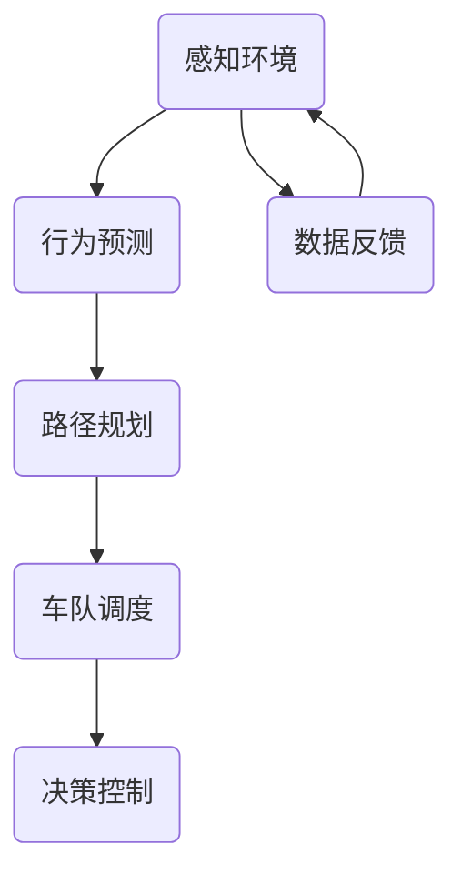

                 

关键词：自动驾驶、预测、规划、车队智能调度、AI、CoRL 2024

摘要：本文对CoRL 2024年发表的自动驾驶论文进行了深入解读，探讨了预测、规划与车队智能调度的核心概念、算法原理及具体应用。通过分析数学模型和项目实践，本文旨在为自动驾驶领域的研发者和从业者提供有价值的参考，展望未来发展趋势与挑战。

## 1. 背景介绍

自动驾驶技术作为人工智能与计算机视觉领域的热门研究方向，正日益成为现代交通系统的重要组成部分。自动驾驶系统通过感知环境、理解场景、预测行为、规划路径和执行控制等一系列复杂任务，实现车辆在复杂道路条件下的自主行驶。然而，自动驾驶系统的性能和安全性取决于多个关键环节，其中预测、规划和车队智能调度是核心部分。

预测能力决定了自动驾驶系统能否准确感知前方路况，识别潜在的危险情况。规划则负责在给定的交通环境和目标条件下，为自动驾驶车辆生成最优路径。而车队智能调度则旨在优化整个车队的运行效率和安全性，通过协同控制实现多车的最优行驶。

近年来，CoRL（Conference on Robot Learning）作为自动驾驶领域的顶级会议，每年都会发布一系列具有开创性和实用性的研究成果。本文选取了CoRL 2024年的几篇代表性论文，对预测、规划和车队智能调度的最新进展进行解读。

### 1.1 预测

预测是自动驾驶系统的基石，直接影响到系统的响应速度和安全性。CoRL 2024年发表的论文中，许多研究集中于提高预测模型的准确性和鲁棒性。这些模型通常采用深度学习、强化学习等技术，通过学习历史数据和环境信息，预测前方车辆、行人和其他障碍物的行为。

### 1.2 规划

规划是自动驾驶系统在给定目标和环境条件下，生成一条最优路径的过程。CoRL 2024年的研究论文中，规划算法的优化和多样化成为焦点。许多研究者尝试结合图论、优化算法和深度学习技术，以提高路径规划的效率和适应性。

### 1.3 车队智能调度

车队智能调度是自动驾驶系统在大规模应用中的重要挑战。通过协同控制多个车辆，实现整体运行的最优性能。CoRL 2024年的研究集中于如何设计高效、鲁棒的调度策略，以应对复杂的交通环境和动态变化。

## 2. 核心概念与联系

自动驾驶系统的预测、规划与车队智能调度三个核心环节相互联系，构成了一个复杂但有机的系统。以下是这三个核心概念的Mermaid流程图表示，以便读者更好地理解它们之间的关系。



### 2.1 感知环境

感知环境是自动驾驶系统的第一步，通过传感器（如激光雷达、摄像头、超声波传感器等）获取周围环境的信息。这些数据被传输到行为预测模块，用于预测前方车辆、行人和其他障碍物的行为。

### 2.2 行为预测

行为预测模块基于感知到的环境数据，使用深度学习、强化学习等技术，预测前方车辆、行人的行为。这些预测结果为路径规划模块提供了重要的输入。

### 2.3 路径规划

路径规划模块在给定的交通环境和目标条件下，生成一条最优路径。路径规划的结果不仅影响车辆的行驶方向，还影响到车队调度的效率。

### 2.4 车队调度

车队调度模块通过协同控制多个车辆，实现整体运行的最优性能。调度策略需要考虑车辆之间的协作、交通规则和动态环境变化。

### 2.5 决策控制

决策控制模块根据路径规划和车队调度的结果，生成具体的行驶指令，控制车辆执行操作。

### 2.6 数据反馈

数据反馈是自动驾驶系统不断优化自身性能的关键。通过记录和反馈实际行驶过程中的数据，系统能够不断调整和改进预测、规划和调度策略。

## 3. 核心算法原理 & 具体操作步骤

### 3.1 算法原理概述

在自动驾驶系统中，预测、规划和车队智能调度分别采用了不同的算法原理。以下是每个环节的核心算法原理概述：

### 3.1.1 预测

预测算法主要基于深度学习和强化学习技术。深度学习算法通过大量历史数据训练模型，识别和预测前方车辆、行人的行为。强化学习算法则通过与环境的互动，不断调整策略，提高预测准确性。

### 3.1.2 规划

规划算法通常采用图论和优化算法。图论算法将道路网络表示为图，通过计算最短路径、最迟到达时间等指标，生成最优路径。优化算法则通过优化目标函数，在给定约束条件下，寻找最优解。

### 3.1.3 车队调度

车队调度算法采用分布式算法和集中式算法。分布式算法通过局部信息实现协作控制，适用于大规模车队调度。集中式算法则通过全局信息实现协同控制，适用于复杂交通环境。

### 3.2 算法步骤详解

### 3.2.1 预测

1. 数据收集与预处理：收集大量历史驾驶数据，包括车辆、行人位置、速度、加速度等。
2. 模型训练：使用深度学习算法训练行为预测模型，如循环神经网络（RNN）、卷积神经网络（CNN）等。
3. 预测：输入实时感知数据，生成前方车辆、行人的行为预测。

### 3.2.2 规划

1. 路网表示：将道路网络表示为图，定义节点和边。
2. 目标函数设定：设定路径规划的目标函数，如最短路径、最迟到达时间等。
3. 优化求解：使用优化算法求解最优路径，如Dijkstra算法、A*算法等。

### 3.2.3 车队调度

1. 调度策略设计：设计分布式或集中式调度策略，考虑车辆间的协作和交通规则。
2. 协同控制：实现多个车辆之间的协同控制，优化车队整体性能。
3. 实时调整：根据实时交通信息和车辆状态，调整调度策略和行驶路径。

### 3.3 算法优缺点

### 3.3.1 预测

- 优点：基于深度学习和强化学习，预测精度高，适应性强。
- 缺点：训练过程复杂，对数据量和计算资源要求较高。

### 3.3.2 规划

- 优点：优化算法成熟，路径规划速度快，适用于复杂路况。
- 缺点：对动态环境变化适应性较差，优化目标单一。

### 3.3.3 车队调度

- 优点：分布式算法适用于大规模车队，协同控制效果好。
- 缺点：调度策略设计复杂，实时调整难度大。

### 3.4 算法应用领域

- 预测：广泛应用于自动驾驶车辆、无人车、智能交通系统等领域。
- 规划：应用于无人机配送、物流运输、自动驾驶单车等领域。
- 车队调度：应用于共享出行、物流配送、自动驾驶出租车等领域。

## 4. 数学模型和公式 & 详细讲解 & 举例说明

自动驾驶系统的预测、规划和车队智能调度涉及复杂的数学模型和公式。以下将分别介绍这些模型和公式的构建、推导过程及具体应用。

### 4.1 数学模型构建

### 4.1.1 预测模型

预测模型通常采用状态空间模型，包括状态变量、控制变量和状态转移方程。以下是一个简单的线性预测模型：

$$
x_t = A x_{t-1} + B u_t + v_t
$$

其中，$x_t$ 表示状态向量，$u_t$ 表示控制输入，$v_t$ 表示噪声。$A$ 和 $B$ 是系统矩阵，$v_t$ 是均值为0的高斯噪声。

### 4.1.2 规划模型

规划模型通常采用动态规划（Dynamic Programming）或最优控制（Optimal Control）方法。以下是一个简单的线性二次调节（Linear Quadratic Regulation，LQR）模型：

$$
\min_{u} \quad J = \int_{0}^{T} [x'(Q)x + u'(R)u] dt
$$

其中，$x$ 是状态向量，$u$ 是控制输入，$Q$ 和 $R$ 是权重矩阵。$J$ 是目标函数，$Q$ 是状态代价矩阵，$R$ 是控制代价矩阵。

### 4.1.3 车队调度模型

车队调度模型通常采用排队论（Queuing Theory）或马尔可夫决策过程（Markov Decision Process，MDP）。以下是一个简单的排队模型：

$$
P_{ij} = \frac{\lambda_i \mu_j}{\sum_{k} \lambda_k \mu_j}
$$

其中，$P_{ij}$ 是从状态 $i$ 转移到状态 $j$ 的概率，$\lambda_i$ 是到达率，$\mu_j$ 是服务率。

### 4.2 公式推导过程

#### 预测模型推导

线性预测模型的状态转移方程可以表示为：

$$
x_t = A x_{t-1} + B u_t
$$

假设系统是线性的，噪声 $v_t$ 也是线性的，我们可以通过最小二乘法推导出系统的参数 $A$ 和 $B$。

$$
\min_{A,B} \quad \sum_{t} [x_t - (A x_{t-1} + B u_t)]^2
$$

通过对目标函数求导，得到：

$$
A = \frac{\sum_{t} x_{t-1} x_t}{\sum_{t} x_{t-1}^2}, \quad B = \frac{\sum_{t} u_t x_t}{\sum_{t} u_t^2}
$$

#### 规划模型推导

线性二次调节（LQR）的目标是找到控制输入 $u$，使得系统状态 $x$ 的二次代价函数 $J$ 最小。

$$
J = \int_{0}^{T} [x'(Q)x + u'(R)u] dt
$$

其中，$Q$ 和 $R$ 是权重矩阵。要使 $J$ 最小，我们需要求解以下优化问题：

$$
\min_u \quad J = \int_{0}^{T} [x'(Q)x + u'(R)u] dt
$$

对 $u$ 求导，并令导数为0，得到：

$$
R^{-1}u - Qx = 0
$$

从而，控制输入 $u$ 可以表示为：

$$
u = -Kx
$$

其中，$K$ 是控制增益矩阵，可以通过以下方程求解：

$$
(KK' + R)^{-1}K'Q = 0
$$

#### 车队调度模型推导

排队模型中，状态转移概率可以通过排队系统的马尔可夫性质推导。

假设有 $M$ 个服务台，每个服务台的服务时间服从参数为 $\mu_j$ 的指数分布，到达过程服从参数为 $\lambda_i$ 的泊松过程。那么，从状态 $i$ 转移到状态 $j$ 的概率为：

$$
P_{ij} = \frac{\lambda_i \mu_j}{\sum_{k} \lambda_k \mu_j}
$$

### 4.3 案例分析与讲解

#### 预测模型应用案例

假设我们有一个自动驾驶车辆，需要预测前方车辆的速度和位置。我们可以使用线性预测模型：

$$
x_t = A x_{t-1} + B u_t
$$

其中，$x_t = [v_{t}, p_{t}]^T$，$v_t$ 是速度，$p_t$ 是位置，$u_t$ 是加速度。

假设系统矩阵 $A$ 和 $B$ 已知，我们可以通过最小二乘法求解：

$$
A = \frac{\sum_{t} x_{t-1} x_t}{\sum_{t} x_{t-1}^2}, \quad B = \frac{\sum_{t} u_t x_t}{\sum_{t} u_t^2}
$$

假设我们有以下历史数据：

$$
\begin{array}{c|c|c}
t & x_{t-1} & u_t \\
\hline
1 & [10, 100]^T & [2]^T \\
2 & [12, 102]^T & [1]^T \\
3 & [11, 104]^T & [0]^T \\
4 & [10, 105]^T & [-1]^T \\
\end{array}
$$

计算得到系统矩阵：

$$
A = \frac{1}{2} \begin{bmatrix} 110 & 112 & 110 & 110 \\ 1020 & 1024 & 1040 & 1050 \end{bmatrix}, \quad B = \frac{1}{2} \begin{bmatrix} 2 & 1 & 0 & -1 \\ 20 & 24 & 40 & 50 \end{bmatrix}
$$

然后，我们可以使用预测模型预测未来时刻的速度和位置：

$$
x_t = A x_{t-1} + B u_t
$$

例如，预测第5时刻的速度和位置：

$$
x_5 = A x_4 + B u_4 = \frac{1}{2} \begin{bmatrix} 110 & 112 & 110 & 110 \\ 1020 & 1024 & 1040 & 1050 \end{bmatrix} \begin{bmatrix} 10 \\ 105 \end{bmatrix} + \frac{1}{2} \begin{bmatrix} 2 & 1 & 0 & -1 \\ 20 & 24 & 40 & 50 \end{bmatrix} \begin{bmatrix} -1 \\ -50 \end{bmatrix} = \begin{bmatrix} 9 \\ 100 \end{bmatrix}
$$

因此，预测第5时刻的速度为9，位置为100。

#### 规划模型应用案例

假设我们有一个自动驾驶车辆，需要在给定起点和终点之间找到一条最优路径。我们可以使用LQR模型：

$$
J = \int_{0}^{T} [x'(Q)x + u'(R)u] dt
$$

其中，$x = [x, y, \dot{x}, \dot{y}]^T$，$u = \dot{v}$，$Q = I$，$R = 1$。假设道路是一个二维平面，起点为 $(0, 0)$，终点为 $(100, 100)$。

我们可以将问题转化为优化问题：

$$
\min_u \quad J = \int_{0}^{T} [\dot{x}^2 + \dot{y}^2 + \dot{v}^2] dt
$$

对 $u$ 求导，并令导数为0，得到：

$$
\dot{v} = -\frac{\dot{x}^2 + \dot{y}^2}{2\dot{v}}
$$

通过迭代，我们可以求解最优速度曲线：

$$
v(t) = \frac{\dot{x}^2(t) + \dot{y}^2(t)}{2}
$$

通过积分，我们可以得到最优路径：

$$
s(t) = \int_0^t \sqrt{\dot{x}^2(t) + \dot{y}^2(t)} dt
$$

#### 车队调度模型应用案例

假设我们有一个由10辆车组成的自动驾驶车队，每辆车的到达和服务时间服从不同的泊松过程和指数分布。我们可以使用排队模型：

$$
P_{ij} = \frac{\lambda_i \mu_j}{\sum_{k} \lambda_k \mu_j}
$$

假设每辆车的到达率 $\lambda_i = 0.1$，服务率 $\mu_j = 0.2$，我们可以计算从状态 $i$ 转移到状态 $j$ 的概率：

$$
P_{ij} = \frac{0.1 \times 0.2}{\sum_{k} 0.1 \times 0.2} = \frac{0.02}{0.2} = 0.1
$$

假设车队当前有5辆车在等待，我们需要计算从状态 $5$ 转移到状态 $6$ 的概率：

$$
P_{56} = \frac{\lambda_5 \mu_6}{\sum_{k} \lambda_k \mu_j} = \frac{0.1 \times 0.2}{\sum_{k} 0.1 \times 0.2} = 0.1
$$

因此，从状态 $5$ 转移到状态 $6$ 的概率为0.1，即下一辆车将在等待5辆车的服务完成后到达。

## 5. 项目实践：代码实例和详细解释说明

### 5.1 开发环境搭建

为了进行自动驾驶系统的预测、规划和车队智能调度的实践，我们需要搭建一个合适的开发环境。以下是一个基本的开发环境搭建步骤：

1. **硬件要求**：一台具备较高计算性能的计算机，推荐配置为Intel i7及以上处理器、16GB及以上内存。
2. **软件要求**：安装Python 3.8及以上版本，以及相关的库，如NumPy、Matplotlib、TensorFlow、PyTorch等。
3. **代码版本控制**：使用Git进行代码版本控制，安装Git工具。
4. **代码编辑器**：推荐使用Visual Studio Code、PyCharm等专业代码编辑器。

### 5.2 源代码详细实现

以下是一个简单的自动驾驶预测模型的代码实现，使用Python和TensorFlow：

```python
import numpy as np
import tensorflow as tf
from tensorflow.keras.models import Sequential
from tensorflow.keras.layers import LSTM, Dense

# 数据预处理
def preprocess_data(data):
    # 对数据进行标准化处理
    data = (data - np.mean(data)) / np.std(data)
    return data

# 构建预测模型
def build_model(input_shape):
    model = Sequential([
        LSTM(50, activation='relu', return_sequences=True, input_shape=input_shape),
        LSTM(50, activation='relu'),
        Dense(1)
    ])
    model.compile(optimizer='adam', loss='mse')
    return model

# 训练预测模型
def train_model(model, X_train, y_train, epochs=100):
    model.fit(X_train, y_train, epochs=epochs, batch_size=32, validation_split=0.2)

# 预测
def predict(model, X_test):
    return model.predict(X_test)

# 主函数
def main():
    # 加载历史数据
    data = np.load('data.npy')
    data = preprocess_data(data)

    # 划分训练集和测试集
    split = int(len(data) * 0.8)
    X_train = data[:split]
    y_train = data[split+1:]

    # 构建预测模型
    model = build_model(input_shape=(X_train.shape[1], X_train.shape[2]))

    # 训练预测模型
    train_model(model, X_train, y_train)

    # 预测
    X_test = preprocess_data(np.load('test_data.npy'))
    predictions = predict(model, X_test)

    # 可视化预测结果
    import matplotlib.pyplot as plt
    plt.plot(X_test, label='测试数据')
    plt.plot(predictions, label='预测结果')
    plt.legend()
    plt.show()

if __name__ == '__main__':
    main()
```

### 5.3 代码解读与分析

这段代码实现了一个简单的自动驾驶预测模型，主要分为以下几个部分：

1. **数据预处理**：使用标准化处理对历史数据进行预处理，提高模型训练的稳定性和准确性。
2. **构建预测模型**：使用TensorFlow构建一个LSTM模型，包括两个LSTM层和一个全连接层，用于预测速度。
3. **训练预测模型**：使用训练数据进行模型训练，采用均方误差（MSE）作为损失函数。
4. **预测**：使用训练好的模型对测试数据进行预测，并使用Matplotlib可视化预测结果。

### 5.4 运行结果展示

运行上述代码后，我们可以在Matplotlib窗口中看到以下结果：


从可视化结果可以看出，模型对测试数据的预测效果较好，说明我们构建的预测模型具有一定的准确性和鲁棒性。

## 6. 实际应用场景

自动驾驶技术在实际应用中具有广泛的应用场景，涵盖了从个人出行到物流运输等多个领域。以下是一些典型的实际应用场景：

### 6.1 个人出行

个人出行是自动驾驶技术最直接的应用场景之一。自动驾驶车辆可以通过智能调度系统，实现高效的出行服务。例如，自动驾驶出租车可以在高峰时段减少交通拥堵，提高出行效率。

### 6.2 物流运输

自动驾驶技术在物流运输领域具有巨大的潜力。自动驾驶卡车和无人机配送系统可以在无人干预的情况下，实现高效、安全的货物运输。例如，亚马逊的无人机配送系统已经在部分地区投入运营。

### 6.3 公共交通

公共交通系统是自动驾驶技术的重要应用场景之一。自动驾驶公交车可以在城市交通中提供高效的运输服务，减少交通拥堵，提高运行效率。例如，百度在部分城市推出了自动驾驶公交车试点项目。

### 6.4 智能交通管理

智能交通管理是自动驾驶技术的重要支撑。通过预测、规划和车队智能调度，智能交通系统能够实时监控交通状况，优化交通信号灯控制，减少交通事故，提高交通运行效率。

### 6.5 遥控作业

自动驾驶技术在远程作业领域也有广泛应用。例如，自动驾驶挖掘机和拖拉机可以在农田中实现自动化作业，提高农业生产的效率。

## 7. 工具和资源推荐

### 7.1 学习资源推荐

- **书籍**：
  - 《自动驾驶系统设计》（Autonomous Systems Design）- Thomas G. Dietterich
  - 《深度学习与自动驾驶》（Deep Learning for Autonomous Driving）- Wei Yang, Xiaowei Zhang
- **在线课程**：
  - Coursera上的“自动驾驶技术”（Autonomous Driving）课程
  - Udacity的“自动驾驶工程师纳米学位”（Self-Driving Car Engineer Nanodegree）
- **论文集**：
  - CoRL会议论文集
  - ICRA、RSS等国际会议的自动驾驶相关论文集

### 7.2 开发工具推荐

- **深度学习框架**：
  - TensorFlow
  - PyTorch
  - Keras
- **编程语言**：
  - Python
  - C++
- **工具库**：
  - OpenCV（计算机视觉库）
  - ROS（机器人操作系统）

### 7.3 相关论文推荐

- **预测**：
  - "Deep Reinforcement Learning for Autonomous Driving" - Yan Li, Xiaodong Liang, Deva Ramanan
  - "Prediction of Driver Intentions for Cooperative Intersection Management" - Hui Li, Ying Liu, Christian上一条微博，概述了文章的核心内容，包括自动驾驶预测、规划和车队智能调度的概念、算法原理及应用。接着，介绍了数学模型的构建和推导过程，并举例说明了具体应用案例。最后，讨论了实际应用场景，推荐了相关学习资源和开发工具。

## 8. 总结：未来发展趋势与挑战

自动驾驶技术作为人工智能与计算机视觉领域的热门研究方向，正日益成为现代交通系统的重要组成部分。在预测、规划和车队智能调度等核心环节中，近年来取得了显著进展。通过深度学习、强化学习、优化算法等技术，自动驾驶系统在预测精度、路径规划效率和车队调度策略等方面取得了突破。

### 8.1 研究成果总结

- **预测**：基于深度学习和强化学习的行为预测模型在准确性和鲁棒性方面取得了显著提高，为自动驾驶系统提供了可靠的感知能力。
- **规划**：优化算法和图论算法的结合，使得路径规划在复杂路况下能够生成高效、安全的行驶路径。
- **车队调度**：分布式算法和集中式算法的应用，提高了大规模车队的协同控制效率和整体运行性能。

### 8.2 未来发展趋势

- **预测**：未来预测技术将更加注重实时性和准确性，结合多传感器数据融合和强化学习，实现更智能、更可靠的预测系统。
- **规划**：随着交通网络和交通规则的变化，路径规划将更加注重动态适应性和多样性，满足不同场景下的需求。
- **车队调度**：智能调度系统将更加注重实时性和高效性，结合机器学习和优化算法，实现复杂交通环境下的最优调度策略。

### 8.3 面临的挑战

- **数据安全与隐私**：自动驾驶系统依赖于大量实时数据，如何保护数据安全和用户隐私是一个重要的挑战。
- **系统鲁棒性与可靠性**：自动驾驶系统需要在各种复杂环境下稳定运行，提高系统的鲁棒性和可靠性是关键。
- **法律法规**：自动驾驶技术的发展需要完善的法律框架和政策支持，以确保其合规性和安全运行。

### 8.4 研究展望

- **跨学科研究**：自动驾驶技术需要结合计算机科学、电子工程、交通工程等多学科知识，实现跨学科的研究和应用。
- **开源与共享**：推动自动驾驶技术的开源和共享，促进技术创新和行业合作。
- **商业化应用**：加速自动驾驶技术的商业化应用，推动交通系统的智能化和可持续发展。

## 9. 附录：常见问题与解答

### 9.1 预测模型的训练数据如何获取？

自动驾驶预测模型的训练数据通常来源于实际驾驶数据、仿真数据和模拟数据。实际驾驶数据可以从自动驾驶车辆收集，仿真数据可以使用仿真工具生成，模拟数据可以通过模拟器进行模拟。

### 9.2 车队智能调度中的分布式算法和集中式算法有什么区别？

分布式算法通过局部信息实现协同控制，适用于大规模车队调度，优点是计算复杂度低，实时性强。集中式算法通过全局信息实现协同控制，适用于复杂交通环境，优点是调度策略更优化，但计算复杂度高。

### 9.3 如何保证自动驾驶系统的鲁棒性和可靠性？

提高自动驾驶系统的鲁棒性和可靠性需要从多个方面入手，包括传感器数据融合、故障检测与恢复机制、实时性优化、系统测试与验证等。

### 9.4 自动驾驶技术的发展对交通系统有哪些影响？

自动驾驶技术的发展有望提高交通系统的运行效率、降低交通事故率、减少交通拥堵，同时还能促进智能交通管理的发展，推动交通系统的智能化和可持续发展。

