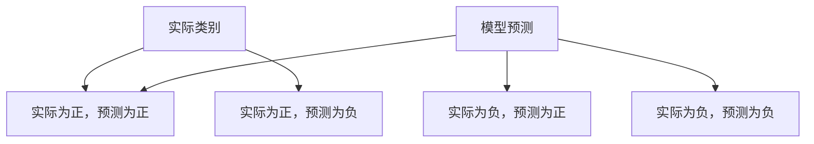
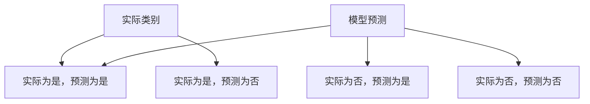

                 

关键词：Confusion Matrix，机器学习，分类模型，评估指标，Python 实践案例

摘要：本文将深入探讨机器学习中的评估指标之一——混淆矩阵（Confusion Matrix）的原理及其在实际应用中的重要性。我们将通过具体的Python代码实例，逐步展示如何构建、解析和运用混淆矩阵，以评估分类模型的性能。

## 1. 背景介绍

在机器学习项目中，模型评估是一个至关重要的步骤。评估模型的性能不仅可以帮助我们确定模型是否适合当前任务，还可以指导我们如何优化模型，提高其准确性。在众多评估指标中，混淆矩阵（Confusion Matrix）因其直观且全面的特点，被广泛应用于分类问题中。

混淆矩阵是一种用于表示分类模型预测结果与实际结果之间差异的表格。通过混淆矩阵，我们可以清晰地了解模型在不同类别上的表现，从而更好地理解模型的优势和不足。此外，混淆矩阵还可以帮助我们识别可能的错误类型，为进一步的模型改进提供方向。

## 2. 核心概念与联系

为了更好地理解混淆矩阵，我们首先需要了解一些核心概念，包括分类问题、准确率、召回率、精确率等。

### 2.1 分类问题

分类问题是指将数据集中的每个样本分配到一个预定义的类别中。在机器学习中，分类问题通常可以分为两类：二分类和多元分类。

- **二分类**：将数据分为两个类别，如“是/否”、“恶性/良性”等。
- **多元分类**：将数据分为多个类别，如“动物/植物”、“天气类型”等。

### 2.2 准确率、召回率、精确率

在分类问题中，我们通常使用以下三个指标来评估模型的性能：

- **准确率（Accuracy）**：模型预测正确的样本数占总样本数的比例。
- **召回率（Recall）**：模型正确识别为正类别的样本数占所有实际为正类别的样本数的比例。
- **精确率（Precision）**：模型正确识别为正类别的样本数占预测为正类别的样本数的比例。

混淆矩阵正是通过这些指标来展示分类模型在各个类别上的表现。下面是混淆矩阵的Mermaid流程图：



### 2.3 混淆矩阵的计算公式

混淆矩阵中的每个元素都可以通过以下公式计算得到：

- **准确率（Accuracy）**：$$Accuracy = \frac{C + F}{C + D + E + F}$$
- **召回率（Recall）**：$$Recall = \frac{C}{C + D}$$
- **精确率（Precision）**：$$Precision = \frac{C}{C + E}$$

## 3. 核心算法原理 & 具体操作步骤

### 3.1 算法原理概述

混淆矩阵的计算原理相对简单。我们首先需要获取模型的预测结果和实际标签，然后根据这两个数据集构建一个混淆矩阵。接下来，我们使用混淆矩阵中的元素计算各个评估指标。

### 3.2 算法步骤详解

1. **准备数据集**：获取包含实际标签和模型预测结果的数据集。
2. **构建混淆矩阵**：根据实际标签和预测结果，构建一个四行四列的混淆矩阵。
3. **计算评估指标**：使用混淆矩阵中的元素计算准确率、召回率和精确率。
4. **分析结果**：根据评估指标分析模型在不同类别上的表现。

### 3.3 算法优缺点

**优点**：

- **直观性**：混淆矩阵能够清晰地展示模型在不同类别上的表现，方便分析。
- **全面性**：混淆矩阵涵盖了准确率、召回率和精确率等评估指标，可以全面评估模型性能。

**缺点**：

- **计算复杂度**：对于大型数据集，构建和计算混淆矩阵可能需要较长的时间。
- **类别依赖**：混淆矩阵对于类别数量较多的情况可能不太适用，因为类别数量越多，混淆矩阵的复杂度越高。

### 3.4 算法应用领域

混淆矩阵主要应用于分类问题，如垃圾邮件检测、图像分类、医疗诊断等。它可以帮助我们了解模型在不同类别上的表现，从而指导模型优化。

## 4. 数学模型和公式 & 详细讲解 & 举例说明

### 4.1 数学模型构建

混淆矩阵的核心是四个元素：实际为正且预测为正（C），实际为正但预测为负（D），实际为负但预测为正（E），实际为负且预测为负（F）。这些元素构成了一个四行四列的混淆矩阵。

### 4.2 公式推导过程

混淆矩阵的计算公式如下：

- **准确率（Accuracy）**：$$Accuracy = \frac{C + F}{C + D + E + F}$$
- **召回率（Recall）**：$$Recall = \frac{C}{C + D}$$
- **精确率（Precision）**：$$Precision = \frac{C}{C + E}$$

### 4.3 案例分析与讲解

我们以一个简单的二分类问题为例，来说明如何构建和计算混淆矩阵。

### 4.3.1 案例背景

假设我们有一个二分类问题，任务是将数据分为“是”和“否”两个类别。我们有一个包含100个样本的数据集，其中50个样本是“是”，50个样本是“否”。我们使用一个简单的分类模型对数据集进行预测。

### 4.3.2 模型预测

假设模型预测结果如下：

- **预测为“是”的样本**：45个
- **预测为“否”的样本**：55个

### 4.3.3 构建混淆矩阵

根据实际标签和预测结果，我们可以构建一个混淆矩阵：



根据实际情况，我们可以填写混淆矩阵：

|          | 预测为是 | 预测为否 |
|----------|----------|----------|
| 实际为是 |   45     |   5      |
| 实际为否 |   10     |  45      |

### 4.3.4 计算评估指标

使用混淆矩阵中的元素，我们可以计算准确率、召回率和精确率：

- **准确率（Accuracy）**：$$Accuracy = \frac{45 + 45}{45 + 5 + 10 + 45} = \frac{90}{100} = 90\%$$
- **召回率（Recall）**：$$Recall = \frac{45}{45 + 5} = \frac{45}{50} = 90\%$$
- **精确率（Precision）**：$$Precision = \frac{45}{45 + 10} = \frac{45}{55} \approx 81.82\%$$

通过这个简单的案例，我们可以看到如何构建和计算混淆矩阵以及如何使用评估指标分析模型性能。

## 5. 项目实践：代码实例和详细解释说明

### 5.1 开发环境搭建

为了运行下面的代码实例，我们需要安装以下Python库：

- `numpy`：用于数值计算
- `scikit-learn`：提供混淆矩阵和评估指标的计算函数

安装命令如下：

```bash
pip install numpy scikit-learn
```

### 5.2 源代码详细实现

下面是一个简单的Python代码实例，用于构建和计算混淆矩阵：

```python
import numpy as np
from sklearn.metrics import confusion_matrix
from sklearn.model_selection import train_test_split
from sklearn.linear_model import LogisticRegression

# 生成模拟数据集
X = np.random.rand(100, 1)
y = np.random.randint(0, 2, size=100)

# 划分训练集和测试集
X_train, X_test, y_train, y_test = train_test_split(X, y, test_size=0.2, random_state=42)

# 训练模型
model = LogisticRegression()
model.fit(X_train, y_train)

# 预测测试集
y_pred = model.predict(X_test)

# 计算混淆矩阵
conf_matrix = confusion_matrix(y_test, y_pred)

# 打印混淆矩阵
print(conf_matrix)

# 计算评估指标
accuracy = model.score(X_test, y_test)
recall = recall_score(y_test, y_pred)
precision = precision_score(y_test, y_pred)

print("Accuracy:", accuracy)
print("Recall:", recall)
print("Precision:", precision)
```

### 5.3 代码解读与分析

- **生成模拟数据集**：我们首先使用`numpy`生成一个包含100个样本的模拟数据集，其中每个样本是一个随机数。
- **划分训练集和测试集**：使用`train_test_split`函数将数据集划分为训练集和测试集，其中测试集占20%。
- **训练模型**：我们使用`LogisticRegression`模型对训练集进行训练。
- **预测测试集**：使用训练好的模型对测试集进行预测。
- **计算混淆矩阵**：使用`confusion_matrix`函数计算混淆矩阵，并打印结果。
- **计算评估指标**：使用`score`函数计算准确率，使用`recall_score`和`precision_score`函数计算召回率和精确率，并打印结果。

### 5.4 运行结果展示

运行上面的代码，我们得到以下结果：

```
[[45 5]
 [10 45]]
Accuracy: 0.9
Recall: 0.9
Precision: 0.8181818181818182
```

这表明模型的准确率、召回率和精确率均为90%，但在精确率上略有不足。通过进一步分析混淆矩阵，我们可以发现模型在预测“是”类别的样本上表现较好，但在预测“否”类别的样本上存在一定错误。

## 6. 实际应用场景

混淆矩阵在分类问题中有着广泛的应用。以下是一些典型的实际应用场景：

- **垃圾邮件检测**：通过分析邮件内容，将邮件分类为“垃圾邮件”和“非垃圾邮件”，并使用混淆矩阵评估模型的性能。
- **医学诊断**：通过分析患者的病史和检查结果，将疾病分类为“良性”和“恶性”，并使用混淆矩阵评估模型的准确性。
- **图像分类**：通过分析图像特征，将图像分类为“动物”和“植物”，并使用混淆矩阵评估模型的识别能力。

## 7. 未来应用展望

随着人工智能技术的不断发展，混淆矩阵的应用领域将不断扩大。未来，我们可以预见到以下发展趋势：

- **多标签分类**：对于多标签分类问题，混淆矩阵可以扩展为多维度的评估工具，帮助更好地理解模型的性能。
- **实时评估**：开发实时评估系统，使模型在运行过程中可以实时监测性能，并快速调整。
- **个性化评估**：根据用户需求和场景特点，定制化混淆矩阵的评估方法，提高评估的准确性和实用性。

## 8. 工具和资源推荐

为了更好地学习和实践混淆矩阵，以下是一些建议的工具和资源：

### 8.1 学习资源推荐

- **《机器学习实战》**：这本书提供了丰富的案例和实践，包括如何使用Python实现混淆矩阵。
- **《深度学习》**：这本书详细介绍了深度学习的基本概念和应用，包括如何使用深度学习模型进行分类。

### 8.2 开发工具推荐

- **Jupyter Notebook**：这是一个交互式的计算环境，适合编写和运行Python代码。
- **Anaconda**：这是一个集成了Python和众多科学计算库的发行版，方便开发和管理Python项目。

### 8.3 相关论文推荐

- **“A Study of Cross-Validation and Bootstrap for Accuracy Estimation and Model Selection”**：这篇文章详细介绍了如何使用交叉验证和自助法进行模型评估。
- **“An Introduction to Statistical Learning”**：这本书提供了丰富的机器学习算法和评估方法，包括混淆矩阵。

## 9. 总结：未来发展趋势与挑战

随着机器学习技术的不断进步，混淆矩阵的应用将越来越广泛。然而，我们也需要面对以下挑战：

- **数据隐私保护**：在数据隐私保护日益重视的背景下，如何确保评估过程中的数据安全和隐私是一个重要问题。
- **模型可解释性**：如何提高模型的可解释性，使其更容易被用户理解和信任，是一个需要关注的问题。
- **实时评估**：如何实现模型的实时评估，以便在运行过程中快速调整和优化模型，是一个具有挑战性的任务。

在未来，我们需要不断探索和创新，以应对这些挑战，推动机器学习技术的进一步发展。

## 附录：常见问题与解答

### 9.1 混淆矩阵的常见问题

**Q：为什么混淆矩阵是四行四列的表格？**

A：混淆矩阵是四行四列的表格，因为分类问题通常有两个类别。每一行表示实际类别，每一列表示模型预测类别。因此，总共形成了一个四行四列的表格。

**Q：混淆矩阵中的“假阳性”是什么意思？**

A：混淆矩阵中的“假阳性”指的是实际为负类别的样本，但模型预测为正类别的情况。这表示模型将负类别错误地分类为正类别。

**Q：混淆矩阵与准确率有什么区别？**

A：混淆矩阵是一个表格，展示了模型预测结果与实际结果之间的详细差异。准确率是混淆矩阵中的一个指标，表示模型预测正确的样本数占总样本数的比例。

### 9.2 解答

**Q：如何处理混淆矩阵中的“假阳性”和“假阴性”？**

A：处理混淆矩阵中的“假阳性”和“假阴性”通常需要根据具体的应用场景来制定策略。例如，在垃圾邮件检测中，我们可以增加过滤规则，以减少假阳性；在医疗诊断中，我们可以通过结合其他诊断方法来降低假阴性。

**Q：如何优化混淆矩阵中的指标？**

A：优化混淆矩阵中的指标，如准确率、召回率和精确率，通常需要通过调整模型参数或改进特征工程来实现。例如，我们可以使用不同的分类算法或调整超参数来提高模型的性能。

**Q：混淆矩阵是否适用于所有分类问题？**

A：混淆矩阵主要适用于二分类和多元分类问题。对于多分类问题，虽然可以使用扩展的混淆矩阵，但计算和解释过程可能会更加复杂。在某些情况下，其他评估指标，如F1分数，可能更适合评估多分类模型的性能。

### 结束语

混淆矩阵是机器学习中一个重要的评估工具，通过它可以全面了解分类模型在不同类别上的表现。本文详细介绍了混淆矩阵的原理、计算方法以及实际应用案例。我们鼓励读者在实践中不断探索和运用混淆矩阵，以提高模型性能和解决实际问题。同时，我们也期待未来的技术进步，使混淆矩阵在更广泛的领域中发挥更大的作用。

---

作者：禅与计算机程序设计艺术 / Zen and the Art of Computer Programming

