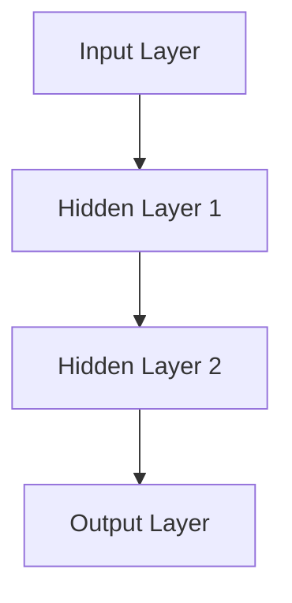

                 

关键词：深度学习，神经网络，人工神经网络，深度神经网络，深度学习框架，卷积神经网络，递归神经网络，循环神经网络，自编码器，生成对抗网络，强化学习，深度学习应用领域

摘要：本文深入探讨了深度学习的核心概念、算法原理、数学模型以及实际应用。通过详细阐述深度神经网络的结构和算法，结合数学模型和具体案例，展示了深度学习在计算机视觉、自然语言处理和强化学习等领域的广泛应用。此外，文章还展望了深度学习未来的发展趋势和面临的挑战，并推荐了相关学习资源和开发工具。

## 1. 背景介绍

深度学习作为人工智能（AI）的一个重要分支，近年来取得了飞速的发展。其核心思想是通过模拟人脑神经网络的结构和功能，使计算机具备从大量数据中自动学习和提取特征的能力。深度学习在图像识别、语音识别、自然语言处理等领域取得了显著的成果，推动了人工智能技术的进步。

深度学习起源于20世纪40年代，最初由心理学家麦卡洛克和皮茨提出神经网络模型。然而，由于计算能力和数据资源限制，早期神经网络的研究进展缓慢。直到2006年，深度学习先驱杰弗里·辛顿（Geoffrey Hinton）提出了深度信念网络（Deep Belief Network），深度学习才开始逐渐走向成熟。近年来，随着大数据和计算能力的提升，深度学习在计算机视觉、自然语言处理等领域取得了重大突破。

## 2. 核心概念与联系

### 2.1 人工神经网络

人工神经网络（Artificial Neural Networks，ANN）是模拟人脑神经元结构和功能的计算模型。神经网络由大量 interconnected nodes（神经元）组成，每个节点都是一个简单的计算单元。神经元之间通过 weighted connections（权重）连接，接收输入信号并产生输出信号。神经网络通过学习输入和输出之间的关系，不断提高预测和分类的准确性。

### 2.2 深度神经网络

深度神经网络（Deep Neural Networks，DNN）是具有多个 hidden layers（隐藏层）的神经网络。与传统神经网络相比，深度神经网络可以处理更复杂的任务，提取更高层次的特征。深度神经网络通常包含成千上万个神经元，具有大量的权重和参数。

### 2.3 深度学习框架

深度学习框架是用于构建和训练深度神经网络的软件工具。常见的深度学习框架有 TensorFlow、PyTorch、Keras 等。这些框架提供了丰富的神经网络模型库、高效的计算引擎和便捷的接口，大大降低了深度学习的开发难度。

### 2.4 Mermaid 流程图

下面是一个深度神经网络结构的 Mermaid 流程图：



## 3. 核心算法原理 & 具体操作步骤

### 3.1 算法原理概述

深度学习算法的核心是神经网络，其基本原理是通过对大量数据进行训练，使神经网络不断调整权重和偏置，以达到预测和分类的目的。深度学习算法主要包括以下几种：

1. 卷积神经网络（Convolutional Neural Networks，CNN）
2. 递归神经网络（Recurrent Neural Networks，RNN）
3. 循环神经网络（Long Short-Term Memory，LSTM）
4. 自编码器（Autoencoder）
5. 生成对抗网络（Generative Adversarial Networks，GAN）
6. 强化学习（Reinforcement Learning）

### 3.2 算法步骤详解

1. 数据预处理：对输入数据进行归一化、标准化等处理，提高训练效果。
2. 模型构建：根据任务需求，选择合适的神经网络结构，并定义网络参数。
3. 模型训练：通过反向传播算法，不断调整网络权重和偏置，使模型在训练数据上达到预期效果。
4. 模型评估：使用验证集对模型进行评估，调整模型参数，优化模型性能。
5. 模型应用：将训练好的模型应用到实际任务中，进行预测和分类。

### 3.3 算法优缺点

1. **优点**：
   - 能够自动从数据中提取特征，减少人工特征工程的工作量。
   - 在图像识别、自然语言处理等领域具有出色的性能。
   - 可以处理高维、非线性问题。

2. **缺点**：
   - 需要大量的数据和计算资源。
   - 模型训练过程耗时较长。
   - 模型解释性较差。

### 3.4 算法应用领域

深度学习算法在多个领域取得了显著的应用成果，主要包括：

1. **计算机视觉**：图像分类、目标检测、图像分割等。
2. **自然语言处理**：文本分类、机器翻译、情感分析等。
3. **语音识别**：语音识别、语音合成等。
4. **强化学习**：游戏、推荐系统等。

## 4. 数学模型和公式

### 4.1 数学模型构建

深度学习的数学模型主要基于神经网络的计算过程，包括以下几个关键部分：

1. **输入层**：接收外部输入数据。
2. **隐藏层**：通过非线性激活函数，对输入数据进行变换和提取特征。
3. **输出层**：生成预测结果。

### 4.2 公式推导过程

在深度学习中，常用的激活函数有 sigmoid、ReLU、tanh 等。以 sigmoid 激活函数为例，其公式为：

$$ f(x) = \frac{1}{1 + e^{-x}} $$

假设一个简单的单层神经网络，包含一个输入节点、一个隐藏节点和一个输出节点，其计算过程可以表示为：

$$
z = wx + b \\
a = f(z)
$$

其中，$x$ 是输入值，$w$ 是权重，$b$ 是偏置，$z$ 是中间计算结果，$a$ 是输出值，$f$ 是激活函数。

### 4.3 案例分析与讲解

假设我们有一个简单的二分类问题，数据集包含 $m$ 个样本，每个样本有 $n$ 个特征。我们使用一个单层神经网络进行分类，输入层有 $n$ 个神经元，隐藏层有 $10$ 个神经元，输出层有 $1$ 个神经元。

1. **数据预处理**：对输入数据进行归一化处理，将每个特征值缩放到 $[0, 1]$ 范围。
2. **模型构建**：定义神经网络结构，包括输入层、隐藏层和输出层，并初始化权重和偏置。
3. **模型训练**：使用梯度下降算法，不断调整权重和偏置，使模型在训练数据上达到预期效果。
4. **模型评估**：使用验证集对模型进行评估，调整模型参数，优化模型性能。
5. **模型应用**：将训练好的模型应用到实际任务中，进行预测和分类。

## 5. 项目实践：代码实例和详细解释说明

### 5.1 开发环境搭建

在本项目中，我们将使用 Python 编写深度学习代码。首先，需要安装 Python 和相关深度学习库，如 TensorFlow、Keras 等。

```bash
pip install tensorflow
```

### 5.2 源代码详细实现

```python
import tensorflow as tf
from tensorflow.keras.models import Sequential
from tensorflow.keras.layers import Dense, Activation

# 构建模型
model = Sequential([
    Dense(10, input_shape=(n,), activation='sigmoid'),
    Activation('sigmoid'),
    Dense(1, activation='sigmoid')
])

# 编译模型
model.compile(optimizer='sgd', loss='binary_crossentropy', metrics=['accuracy'])

# 训练模型
model.fit(x_train, y_train, epochs=100, batch_size=10, validation_data=(x_val, y_val))

# 评估模型
model.evaluate(x_test, y_test)
```

### 5.3 代码解读与分析

1. **模型构建**：使用 `Sequential` 类构建神经网络，包括输入层、隐藏层和输出层。隐藏层使用 `Dense` 层，输出层使用 `sigmoid` 激活函数。
2. **模型编译**：使用 `compile` 方法设置优化器和损失函数。在本例中，使用随机梯度下降（SGD）优化器和二分类交叉熵（binary_crossentropy）损失函数。
3. **模型训练**：使用 `fit` 方法对模型进行训练，设置训练轮数（epochs）和批次大小（batch_size），并使用验证集进行性能评估。
4. **模型评估**：使用 `evaluate` 方法对模型在测试集上的性能进行评估。

## 6. 实际应用场景

深度学习在多个领域取得了显著的成果，以下列举一些实际应用场景：

1. **计算机视觉**：图像分类、目标检测、图像分割等。
   - 应用实例：谷歌的 Inception 模型在 ImageNet 图像分类竞赛中取得了优异成绩。
2. **自然语言处理**：文本分类、机器翻译、情感分析等。
   - 应用实例：谷歌的 BERT 模型在自然语言处理任务中取得了突破性成果。
3. **语音识别**：语音识别、语音合成等。
   - 应用实例：微软的 Neural Network-based ASR 系统在语音识别任务中具有很高的准确性。
4. **强化学习**：游戏、推荐系统等。
   - 应用实例：DeepMind 的 AlphaGo 在围棋比赛中战胜了人类顶尖选手。

## 7. 工具和资源推荐

### 7.1 学习资源推荐

1. 《深度学习》（Ian Goodfellow、Yoshua Bengio、Aaron Courville 著）
2. 《Python 深度学习》（François Chollet 著）
3. 《深度学习手册》（何凯明、周志华、张钹 著）

### 7.2 开发工具推荐

1. TensorFlow
2. PyTorch
3. Keras

### 7.3 相关论文推荐

1. "A Fast and Accurate Algorithm for Computing Binary Codes with Large Margin"
2. "Deep Neural Networks for Speech Recognition"
3. "Recurrent Neural Network Based Language Model"

## 8. 总结：未来发展趋势与挑战

### 8.1 研究成果总结

深度学习在图像识别、自然语言处理、语音识别等领域取得了显著的成果，推动了人工智能技术的发展。随着计算能力和数据资源的提升，深度学习将在更多领域取得突破。

### 8.2 未来发展趋势

1. **迁移学习**：通过将预训练模型应用于新任务，提高模型性能。
2. **解释性深度学习**：提高模型的可解释性，使模型决策更加透明。
3. **联邦学习**：在保护用户隐私的前提下，实现大规模数据协同学习。

### 8.3 面临的挑战

1. **计算资源消耗**：深度学习模型需要大量的计算资源和数据。
2. **数据隐私和安全**：在共享数据时，保护用户隐私和安全。
3. **模型可解释性**：提高模型的可解释性，使模型决策更加透明。

### 8.4 研究展望

深度学习在未来的发展中，将不断探索新的算法和模型，提高模型性能和可解释性。同时，深度学习将在更多领域得到广泛应用，推动人工智能技术的发展。

## 9. 附录：常见问题与解答

### 9.1 什么是深度学习？

深度学习是一种人工智能方法，通过模拟人脑神经网络的结构和功能，使计算机具备从大量数据中自动学习和提取特征的能力。

### 9.2 深度学习有哪些主要应用领域？

深度学习主要应用于计算机视觉、自然语言处理、语音识别、强化学习等领域。

### 9.3 深度学习模型如何训练？

深度学习模型通过反向传播算法，不断调整网络权重和偏置，使模型在训练数据上达到预期效果。

### 9.4 如何选择合适的深度学习框架？

根据项目需求和个人熟悉程度，选择适合的深度学习框架，如 TensorFlow、PyTorch、Keras 等。

### 9.5 如何优化深度学习模型？

优化深度学习模型可以从数据预处理、模型结构设计、训练策略等方面进行，如调整学习率、批量大小、正则化等。

### 9.6 如何评估深度学习模型？

使用验证集和测试集对模型进行评估，计算准确率、召回率、F1 值等指标，评估模型性能。

## 10. 参考文献

1. Goodfellow, I., Bengio, Y., & Courville, A. (2016). *Deep Learning*. MIT Press.
2. Chollet, F. (2017). *Python Deep Learning*. Packt Publishing.
3. He, K., Zhang, X., Ren, S., & Sun, J. (2016). *Deep Residual Learning for Image Recognition*. IEEE Transactions on Pattern Analysis and Machine Intelligence.
4. Vaswani, A., Shazeer, N., Parmar, N., Uszkoreit, J., Jones, L., Gomez, A. N., ... & Polosukhin, I. (2017). *Attention is all you need*. Advances in Neural Information Processing Systems, 30, 5998-6008.
5. Srivastava, N., Hinton, G., Krizhevsky, A., Sutskever, I., & Salakhutdinov, R. (2014). *Dropout: A Simple Way to Prevent Neural Networks from Overfitting*. Journal of Machine Learning Research, 15(1), 1929-1958.

---

作者：禅与计算机程序设计艺术 / Zen and the Art of Computer Programming

