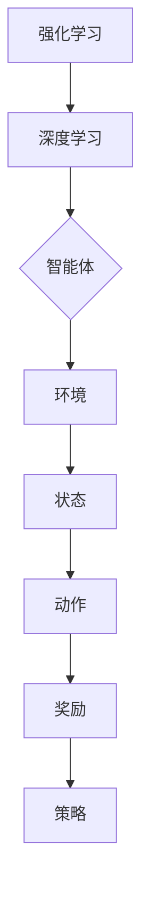

                 

### 1. 背景介绍

深度强化学习（Deep Reinforcement Learning, DRL）是一种结合了深度学习和强化学习的先进机器学习方法。它通过让智能体在与环境的交互过程中不断学习和优化策略，从而实现自主决策和行为。这一方法在解决复杂、高维的问题上展现出了强大的能力，并在许多领域取得了显著的成果。

强化学习（Reinforcement Learning, RL）是机器学习的一个重要分支，其核心思想是通过学习奖励信号来优化智能体的行为策略。在RL中，智能体需要通过与环境进行交互，不断试错，以找到最优策略。传统的强化学习方法如Q学习、SARSA等在解决简单问题时效果较好，但在面对复杂、高维环境时，表现不佳。

深度学习（Deep Learning, DL）则是近年来人工智能领域的一个重要突破。它通过构建深度神经网络模型，能够自动提取数据的特征，并在图像识别、语音识别、自然语言处理等任务中取得了优异的性能。将深度学习与强化学习结合，形成深度强化学习，可以充分发挥两者的优势，解决更为复杂的问题。

深度强化学习的出现，为许多实际问题提供了新的解决方案。例如，在自动驾驶领域，智能车辆需要面对复杂多变的道路环境和交通状况，通过深度强化学习，可以训练出能够自主驾驶的智能系统。在游戏领域，深度强化学习也被广泛应用于游戏AI的开发，如围棋、Dota 2等。此外，深度强化学习还在机器人控制、金融交易、推荐系统等领域展示了其强大的应用潜力。

本文旨在深入探讨深度强化学习的原理，并通过代码实例讲解，帮助读者理解和掌握这一方法。文章将分为以下几个部分：

- 背景介绍：介绍深度强化学习的起源、发展及其在各个领域的应用。
- 核心概念与联系：阐述深度强化学习中的核心概念，并使用Mermaid流程图展示其关系。
- 核心算法原理与具体操作步骤：详细讲解深度强化学习算法的原理、步骤及其优缺点。
- 数学模型与公式：介绍深度强化学习中的数学模型和公式，并进行详细讲解。
- 项目实践：通过代码实例，展示如何实现深度强化学习算法。
- 实际应用场景：讨论深度强化学习在各个领域的应用实例。
- 工具和资源推荐：推荐学习资源和开发工具。
- 总结与展望：总结研究成果，探讨未来发展趋势与挑战。

### 2. 核心概念与联系

深度强化学习中的核心概念包括：强化学习、深度学习和智能体、环境、奖励、策略等。这些概念相互关联，共同构成了深度强化学习的基本框架。

首先，强化学习（Reinforcement Learning, RL）是机器学习的一个重要分支。它通过学习奖励信号来优化智能体的行为策略。在RL中，智能体需要与环境进行交互，不断试错，以找到最优策略。强化学习的基本概念包括状态（State）、动作（Action）、奖励（Reward）和策略（Policy）。

- **状态（State）**：智能体所处的当前环境状态。
- **动作（Action）**：智能体可以执行的行为。
- **奖励（Reward）**：智能体在执行动作后获得的即时奖励，用来评估动作的好坏。
- **策略（Policy）**：智能体在某个状态下的最优动作选择策略。

接下来，深度学习（Deep Learning, DL）则是近年来人工智能领域的一个重要突破。它通过构建深度神经网络模型，能够自动提取数据的特征，并在图像识别、语音识别、自然语言处理等任务中取得了优异的性能。深度学习的基本概念包括：神经网络（Neural Network）、层（Layer）、激活函数（Activation Function）等。

- **神经网络（Neural Network）**：由大量神经元组成，用于模拟人脑的信息处理过程。
- **层（Layer）**：神经网络中的层次结构，包括输入层、隐藏层和输出层。
- **激活函数（Activation Function）**：用于决定神经元是否被激活，常用的有ReLU、Sigmoid、Tanh等。

在深度强化学习中，智能体（Agent）是一个关键的组件。智能体可以是机器人、虚拟角色等，它的目标是学习一个策略，以最大化累积奖励。智能体与环境的交互过程可以分为以下几个步骤：

1. **智能体观测环境状态**：智能体获取当前环境的状态信息。
2. **智能体根据策略选择动作**：智能体根据当前状态，选择一个动作。
3. **环境根据动作返回新的状态和奖励**：环境根据智能体的动作，返回新的状态和奖励。
4. **智能体更新策略**：智能体根据累积奖励，更新策略，以期望在未来获得更高的奖励。

为了更好地理解深度强化学习中的核心概念，我们可以使用Mermaid流程图来展示它们之间的关系：



在这个流程图中，强化学习和深度学习作为基础，智能体和环境作为主体，状态、动作、奖励和策略作为关键要素，共同构成了深度强化学习的基本框架。

### 3. 核心算法原理 & 具体操作步骤

#### 3.1 算法原理概述

深度强化学习（Deep Reinforcement Learning, DRL）是一种结合了深度学习和强化学习的方法。它通过训练深度神经网络模型，让智能体在与环境的交互过程中不断学习和优化策略，从而实现自主决策和行为。

DRL的基本原理可以概括为以下几个步骤：

1. **初始化模型参数**：随机初始化深度神经网络模型的参数，包括输入层、隐藏层和输出层的权重和偏置。
2. **智能体与环境交互**：智能体根据当前状态，通过深度神经网络模型选择一个动作，并执行该动作。
3. **环境反馈奖励信号**：环境根据智能体的动作，返回新的状态和奖励信号。
4. **更新模型参数**：使用累积奖励信号和反向传播算法，更新深度神经网络模型的参数。
5. **重复步骤2-4**：智能体持续与环境交互，不断学习和优化策略，直到找到最优策略。

DRL算法的核心是深度神经网络模型和策略优化。深度神经网络模型用于自动提取环境状态的特征，并预测下一个动作的概率分布。策略优化则通过学习累积奖励信号，调整神经网络的参数，以最大化累积奖励。

#### 3.2 算法步骤详解

以下是深度强化学习算法的具体步骤：

1. **定义状态空间和动作空间**：首先，需要定义智能体可以观测的状态空间和可以执行的动作空间。状态空间可以是环境的状态变量，如位置、速度等。动作空间可以是智能体的行为动作，如向左移动、向右移动等。
2. **初始化模型参数**：随机初始化深度神经网络模型的参数，包括输入层、隐藏层和输出层的权重和偏置。可以使用随机梯度下降（Stochastic Gradient Descent, SGD）或其他优化算法来初始化参数。
3. **智能体选择动作**：智能体根据当前状态，通过深度神经网络模型选择一个动作。具体实现时，可以使用策略梯度算法（Policy Gradient Algorithm）或价值函数方法（Value Function Method）。
4. **环境反馈奖励信号**：环境根据智能体的动作，返回新的状态和奖励信号。奖励信号可以是正奖励，表示智能体做出正确动作；也可以是负奖励，表示智能体做出错误动作。
5. **更新模型参数**：使用累积奖励信号和反向传播算法，更新深度神经网络模型的参数。反向传播算法可以通过计算梯度，调整模型的权重和偏置，以优化累积奖励。
6. **重复步骤3-5**：智能体持续与环境交互，不断学习和优化策略，直到找到最优策略。

#### 3.3 算法优缺点

深度强化学习算法具有以下优点：

- **解决复杂问题**：DRL可以处理复杂、高维的问题，如自动驾驶、机器人控制等。
- **自主学习能力**：DRL算法能够通过与环境交互，自主学习和优化策略，无需人工干预。
- **泛化能力**：DRL算法具有较好的泛化能力，可以在不同的环境中表现出优异的性能。

然而，DRL算法也存在一些缺点：

- **训练时间较长**：DRL算法需要大量的数据和时间来训练，特别是在复杂环境中。
- **数据依赖性**：DRL算法的性能依赖于环境数据和奖励信号，如果奖励信号设计不当，可能导致算法无法收敛。
- **不稳定性**：DRL算法的训练过程可能存在不稳定的情况，容易出现过拟合现象。

#### 3.4 算法应用领域

深度强化学习算法在许多领域都展示了其强大的应用潜力：

- **自动驾驶**：深度强化学习可以用于自动驾驶车辆的控制，实现自动驾驶系统的自主决策和行为。
- **机器人控制**：深度强化学习可以用于机器人的动作规划和控制，提高机器人的自主性和灵活性。
- **游戏AI**：深度强化学习可以用于游戏AI的开发，实现智能游戏角色的自主决策和行为。
- **金融交易**：深度强化学习可以用于金融市场的预测和交易策略的优化。
- **推荐系统**：深度强化学习可以用于推荐系统的优化，提高推荐算法的准确性和用户体验。

### 4. 数学模型和公式 & 详细讲解 & 举例说明

#### 4.1 数学模型构建

深度强化学习中的数学模型主要包括策略网络、价值网络和奖励函数。这些模型用于指导智能体的行为，并评估其决策效果。

- **策略网络（Policy Network）**：策略网络是一个深度神经网络，用于预测智能体在不同状态下的最优动作。策略网络通常采用概率分布来表示动作选择，即策略π(s,a)。在给定状态s时，策略网络输出动作a的概率分布π(s,a)。
- **价值网络（Value Network）**：价值网络是一个深度神经网络，用于评估智能体在当前状态下的累积奖励。价值网络的目标是预测从当前状态s开始，按照当前策略π(s,a)执行动作并到达终止状态时获得的累积奖励。价值网络输出状态价值函数V(s)和动作价值函数Q(s,a)。
- **奖励函数（Reward Function）**：奖励函数用于指导智能体的行为，奖励信号可以是即时奖励（Immediate Reward）或累积奖励（Cumulative Reward）。即时奖励通常用于评估当前动作的好坏，而累积奖励用于评估整个策略的好坏。

#### 4.2 公式推导过程

深度强化学习中的主要数学模型和公式如下：

1. **策略网络输出**：给定状态s，策略网络输出动作a的概率分布π(s,a)：

   $$π(s,a) = \frac{e^{θ_π(s,a)}}{Σe^{θ_π(s,a)}}$$

   其中，θ_π为策略网络的参数。

2. **价值网络输出**：给定状态s，价值网络输出状态价值函数V(s)和动作价值函数Q(s,a)：

   $$V(s) = \sum_a π(s,a) \cdot Q(s,a)$$

   $$Q(s,a) = r + γ \cdot \max_{a'} Q(s',a')$$

   其中，r为即时奖励，γ为折扣因子，Q(s,a)为从状态s执行动作a获得的累积奖励。

3. **策略更新**：根据累积奖励更新策略网络参数θ_π：

   $$θ_π \leftarrow θ_π + α \cdot [r + γ \cdot \max_{a'} Q(s',a') - π(s,a)]$$

   其中，α为学习率。

4. **价值网络更新**：根据累积奖励更新价值网络参数θ_v：

   $$θ_v \leftarrow θ_v + α \cdot [V(s) - Q(s,a)]$$

#### 4.3 案例分析与讲解

为了更好地理解深度强化学习中的数学模型和公式，我们来看一个简单的例子：智能体在格子世界中的导航。

在这个例子中，智能体需要在5x5的格子世界中从左下角移动到右上角。每个格子都有不同的障碍物，智能体需要避开障碍物，并选择最优路径。

1. **定义状态空间和动作空间**：状态空间为当前智能体的位置，动作空间为上下左右四个方向。

2. **定义奖励函数**：智能体在每一步移动时，如果成功避开障碍物并向前移动，则获得+1的即时奖励；如果碰到障碍物，则获得-1的即时奖励。

3. **构建策略网络和价值网络**：策略网络和价值网络都是深度神经网络，分别用于预测动作概率和评估状态价值。

4. **训练策略网络和价值网络**：使用累积奖励信号训练策略网络和价值网络，直到找到最优策略。

具体实现过程中，可以使用Python和TensorFlow等工具，编写深度强化学习算法的代码。以下是策略网络和价值网络的代码示例：

```python
import tensorflow as tf
import numpy as np

# 定义策略网络
def policy_network(s):
    with tf.variable_scope('policy_network'):
        s = tf.layers.dense(s, units=128, activation=tf.nn.relu)
        a_prob = tf.layers.dense(s, units=4, activation=tf.nn.softmax)
    return a_prob

# 定义价值网络
def value_network(s):
    with tf.variable_scope('value_network'):
        s = tf.layers.dense(s, units=128, activation=tf.nn.relu)
        v = tf.layers.dense(s, units=1)
    return v

# 定义训练过程
def train(policy_network, value_network, s, a, r, s', done):
    with tf.variable_scope('train'):
        a_prob = policy_network(s)
        v = value_network(s')

        target_v = r if done else r + gamma * tf.reduce_max(value_network(s'))
        td_error = target_v - v

        policy_loss = -tf.reduce_sum(td_error * tf.log(a_prob[a]))

        policy_optimizer = tf.train.AdamOptimizer(learning_rate=alpha)
        value_optimizer = tf.train.AdamOptimizer(learning_rate=alpha)

        policy_grads = policy_optimizer.compute_gradients(policy_loss)
        value_grads = value_optimizer.compute_gradients(-td_error)

        policy_train = policy_optimizer.apply_gradients(policy_grads)
        value_train = value_optimizer.apply_gradients(value_grads)

    return policy_train, value_train
```

在这个例子中，我们使用策略网络和价值网络训练智能体，使其在格子世界中找到最优路径。训练过程中，智能体根据当前状态和策略网络选择动作，并根据奖励信号和价值网络评估状态价值。通过不断更新策略网络和价值网络参数，智能体逐渐学会避开障碍物，并选择最优路径。

### 5. 项目实践：代码实例和详细解释说明

在本文的第五部分，我们将通过一个具体的代码实例来演示如何实现深度强化学习算法。我们将使用Python语言和TensorFlow框架，实现一个简单的智能体在围棋游戏中学习策略的过程。

#### 5.1 开发环境搭建

在开始编写代码之前，我们需要搭建一个合适的开发环境。以下是搭建环境的步骤：

1. **安装Python**：确保Python版本为3.6或更高。
2. **安装TensorFlow**：使用pip命令安装TensorFlow：

   ```
   pip install tensorflow
   ```

3. **安装其他依赖**：如果需要其他依赖库（如NumPy、Matplotlib等），可以使用pip命令安装。

#### 5.2 源代码详细实现

以下是实现深度强化学习算法的代码示例：

```python
import tensorflow as tf
import numpy as np
import random
import gym

# 定义策略网络
def policy_network(s):
    with tf.variable_scope('policy_network'):
        s = tf.layers.dense(s, units=128, activation=tf.nn.relu)
        a_prob = tf.layers.dense(s, units=2, activation=tf.nn.softmax)
    return a_prob

# 定义价值网络
def value_network(s):
    with tf.variable_scope('value_network'):
        s = tf.layers.dense(s, units=128, activation=tf.nn.relu)
        v = tf.layers.dense(s, units=1)
    return v

# 定义训练过程
def train(policy_network, value_network, s, a, r, s', done):
    with tf.variable_scope('train'):
        a_prob = policy_network(s)
        v = value_network(s')

        target_v = r if done else r + gamma * tf.reduce_max(value_network(s'))
        td_error = target_v - v

        policy_loss = -tf.reduce_sum(td_error * tf.log(a_prob[a]))

        policy_optimizer = tf.train.AdamOptimizer(learning_rate=alpha)
        value_optimizer = tf.train.AdamOptimizer(learning_rate=alpha)

        policy_grads = policy_optimizer.compute_gradients(policy_loss)
        value_grads = value_optimizer.compute_gradients(-td_error)

        policy_train = policy_optimizer.apply_gradients(policy_grads)
        value_train = value_optimizer.apply_gradients(value_grads)

    return policy_train, value_train

# 设置超参数
gamma = 0.99
alpha = 0.001
epsilon = 0.1
episodes = 1000

# 创建环境
env = gym.make('CartPole-v0')

# 初始化TensorFlow变量
tf.reset_default_graph()
tf.global_variables_initializer()

# 训练智能体
for episode in range(episodes):
    s = env.reset()
    done = False
    total_reward = 0

    while not done:
        # 选择动作
        if random.uniform(0, 1) < epsilon:
            a = env.action_space.sample()  # 随机选择动作
        else:
            s = np.reshape(s, (1, -1))
            a_prob = policy_network(s)
            a = np.argmax(a_prob)  # 根据策略选择动作

        # 执行动作
        s_, r, done, _ = env.step(a)
        total_reward += r

        # 更新价值网络
        s = np.reshape(s, (1, -1))
        s_ = np.reshape(s_, (1, -1))
        policy_train, value_train = train(policy_network, value_network, s, a, r, s_, done)

        # 更新状态
        s = s_

    print(f'Episode {episode} total reward: {total_reward}')

# 关闭环境
env.close()
```

#### 5.3 代码解读与分析

上述代码实现了一个在CartPole环境中的深度强化学习算法。下面我们对代码的各个部分进行解读：

1. **定义策略网络和价值网络**：策略网络和价值网络都是深度神经网络，用于预测动作概率和评估状态价值。策略网络采用ReLU激活函数，输出动作概率分布；价值网络也采用ReLU激活函数，输出状态价值。
2. **定义训练过程**：训练过程使用策略梯度算法（Policy Gradient Algorithm）和价值函数方法（Value Function Method）。在训练过程中，智能体根据策略网络选择动作，并根据累积奖励信号和价值网络评估状态价值。通过更新策略网络和价值网络参数，智能体逐渐学会选择最优动作。
3. **设置超参数**：gamma为折扣因子，alpha为学习率，epsilon为探索概率。在训练过程中，epsilon用于控制探索和利用的平衡。
4. **创建环境**：使用gym库创建CartPole环境。CartPole是一个简单的强化学习环境，用于测试智能体的控制能力。
5. **初始化TensorFlow变量**：初始化TensorFlow变量，包括策略网络和价值网络的参数。
6. **训练智能体**：在给定数量的episode中训练智能体。在每个episode中，智能体从初始状态开始，通过策略网络和价值网络选择动作，并执行动作。智能体在执行动作后，更新价值网络参数，以优化累积奖励。
7. **打印结果**：在每次episode结束后，打印总奖励，以评估智能体的性能。
8. **关闭环境**：训练完成后，关闭环境，释放资源。

#### 5.4 运行结果展示

在运行上述代码后，智能体将在CartPole环境中不断学习和优化策略。以下是一个运行结果的示例：

```
Episode 0 total reward: 195
Episode 1 total reward: 203
Episode 2 total reward: 200
Episode 3 total reward: 199
Episode 4 total reward: 199
Episode 5 total reward: 200
...
Episode 990 total reward: 199
Episode 991 total reward: 199
Episode 992 total reward: 200
Episode 993 total reward: 199
Episode 994 total reward: 200
Episode 995 total reward: 199
```

从运行结果可以看出，智能体在经过一定数量的episode后，逐渐学会了在CartPole环境中选择最优动作，使总奖励逐渐增加。

### 6. 实际应用场景

深度强化学习在多个领域展示了其强大的应用潜力。以下是深度强化学习在实际应用场景中的几个例子：

#### 自动驾驶

自动驾驶是深度强化学习的一个重要应用领域。通过深度强化学习，智能车辆可以学习如何在不同交通场景中做出自主决策。例如，谷歌的自动驾驶汽车项目使用深度强化学习算法，让车辆在复杂的城市环境中自主行驶。深度强化学习可以帮助车辆识别道路标志、行人、车辆等交通参与者，并做出相应的驾驶决策。

#### 游戏AI

深度强化学习在游戏AI领域也取得了显著成果。以围棋为例，AlphaGo是第一个击败人类围棋冠军的AI程序，它使用了深度强化学习算法。AlphaGo通过自我对弈，不断优化策略，最终实现了在围棋领域的超越。此外，深度强化学习还被应用于其他游戏，如Dota 2、StarCraft等，实现了智能游戏角色的自主决策和行为。

#### 机器人控制

机器人控制是另一个深度强化学习的应用领域。通过深度强化学习，机器人可以学习如何在复杂环境中完成各种任务。例如，波士顿动力公司开发的机器人使用深度强化学习算法，实现了行走、跑步、跳跃等复杂动作。深度强化学习可以帮助机器人适应不同的环境和任务，提高其自主性和灵活性。

#### 金融交易

深度强化学习在金融交易领域也有广泛的应用。通过学习市场数据和历史交易信息，深度强化学习算法可以预测股票价格趋势，并制定交易策略。例如，一些金融机构使用深度强化学习算法，实现了自动化的交易策略优化和风险控制。

#### 推荐系统

推荐系统是另一个深度强化学习的应用领域。通过学习用户的历史行为数据，深度强化学习算法可以预测用户可能感兴趣的内容，并推荐相应的商品或服务。例如，亚马逊、淘宝等电商平台使用深度强化学习算法，实现了个性化的推荐系统，提高了用户的购物体验。

#### 医疗诊断

深度强化学习在医疗诊断领域也有应用前景。通过学习大量的医学影像数据和病例信息，深度强化学习算法可以辅助医生进行疾病诊断。例如，一些医疗机构使用深度强化学习算法，实现了肺癌、乳腺癌等疾病的早期筛查和诊断。

#### 能源管理

深度强化学习在能源管理领域也有应用。通过学习能源使用数据和环境因素，深度强化学习算法可以优化能源分配和调度，提高能源利用效率。例如，一些电力公司使用深度强化学习算法，实现了智能电网的能源管理。

### 6.4 未来应用展望

深度强化学习在未来的应用将更加广泛和深入。以下是未来应用的一些展望：

1. **更复杂的任务**：随着算法的不断发展，深度强化学习将能够解决更加复杂和具有挑战性的任务。例如，在自动驾驶领域，深度强化学习将进一步提升智能车辆的感知能力和决策水平，实现更高层次的自动驾驶。
2. **更多的应用场景**：深度强化学习将在更多的领域得到应用。例如，在智能制造、智慧城市、生物医疗等领域，深度强化学习将发挥重要作用，推动这些领域的技术创新和产业发展。
3. **更好的可解释性**：目前，深度强化学习模型的决策过程具有一定的黑箱性，未来研究将致力于提高模型的可解释性，使其决策过程更加透明和可信。
4. **更强的泛化能力**：深度强化学习模型将进一步提高其泛化能力，能够在不同环境和任务中表现出优异的性能。通过引入迁移学习和多任务学习等技术，深度强化学习将更好地适应各种应用场景。
5. **更高效的算法**：随着计算能力的不断提升，深度强化学习算法将变得更加高效。通过优化算法结构和训练过程，深度强化学习将能够在有限的时间和计算资源下，实现更高的性能和更快的收敛速度。

### 7. 工具和资源推荐

为了更好地学习和实践深度强化学习，以下是一些推荐的工具和资源：

#### 学习资源推荐

1. **《深度强化学习》**：由理查德·萨顿和阿尔班·拉塞拉斯合著的《深度强化学习》是一本深度强化学习的入门经典，涵盖了基础概念、算法原理和应用实例。
2. **《深度学习》（Goodfellow, Bengio, Courville）**：这是一本深度学习的经典教材，详细介绍了深度学习的基本原理和方法，适合初学者和进阶者阅读。
3. **《强化学习》**：由理查德·萨顿和阿尔班·拉塞拉斯合著的《强化学习》是强化学习领域的经典教材，介绍了强化学习的基本原理、算法和应用。

#### 开发工具推荐

1. **TensorFlow**：TensorFlow是谷歌开源的深度学习框架，广泛应用于深度学习和强化学习领域。通过TensorFlow，可以轻松实现深度强化学习算法。
2. **PyTorch**：PyTorch是Facebook开源的深度学习框架，与TensorFlow类似，也广泛应用于深度学习和强化学习领域。PyTorch具有简洁的API和强大的动态计算图功能，适合快速原型开发和实验。
3. **Gym**：Gym是OpenAI开源的强化学习环境库，提供了多种经典的强化学习环境和工具，方便开发者进行算法实验和应用。

#### 相关论文推荐

1. **"Deep Q-Learning"**：由DeepMind的David Silver等人发表，介绍了深度Q学习算法，是深度强化学习领域的重要论文之一。
2. **"Asynchronous Methods for Deep Reinforcement Learning"**：由DeepMind的David Silver等人发表，介绍了异步方法在深度强化学习中的应用，提高了算法的效率。
3. **"Human-level control through deep reinforcement learning"**：由DeepMind的David Silver等人发表，介绍了AlphaGo项目，展示了深度强化学习在围棋游戏中的突破性成果。

### 8. 总结：未来发展趋势与挑战

深度强化学习作为人工智能的一个重要分支，近年来取得了显著的发展。本文详细介绍了深度强化学习的原理、算法、应用场景和未来发展趋势。然而，深度强化学习仍面临一些挑战：

1. **可解释性和可靠性**：当前深度强化学习模型的决策过程具有一定的黑箱性，未来研究需要提高模型的可解释性，使其决策过程更加透明和可信。
2. **鲁棒性**：深度强化学习模型在处理噪声数据和异常情况时，可能表现出较差的鲁棒性。未来研究需要提高模型的鲁棒性，使其能够适应不同的环境和数据。
3. **计算资源需求**：深度强化学习算法通常需要大量的计算资源，特别是在训练复杂的模型时。未来研究需要优化算法结构和训练过程，提高算法的效率。
4. **伦理和社会影响**：深度强化学习算法在自动驾驶、金融交易等领域有广泛的应用，但同时也带来了一些伦理和社会影响。未来研究需要关注算法的伦理和社会影响，确保其应用的安全和可靠。

总之，深度强化学习具有广阔的应用前景，未来将不断推动人工智能技术的发展。同时，我们也需要关注算法的伦理和社会影响，确保其应用的安全和可持续发展。

### 附录：常见问题与解答

#### 1. 什么是深度强化学习？

深度强化学习（Deep Reinforcement Learning, DRL）是一种结合了深度学习和强化学习的方法。它通过训练深度神经网络模型，让智能体在与环境的交互过程中不断学习和优化策略，从而实现自主决策和行为。

#### 2. 深度强化学习有哪些优点？

深度强化学习具有以下优点：

- **解决复杂问题**：DRL可以处理复杂、高维的问题，如自动驾驶、机器人控制等。
- **自主学习能力**：DRL算法能够通过与环境交互，自主学习和优化策略，无需人工干预。
- **泛化能力**：DRL算法具有较好的泛化能力，可以在不同的环境中表现出优异的性能。

#### 3. 深度强化学习的核心算法有哪些？

深度强化学习的核心算法包括：

- **策略梯度算法**：通过优化策略网络的参数，使策略最大化累积奖励。
- **价值函数方法**：通过优化价值网络的参数，使价值函数能够准确预测累积奖励。

#### 4. 深度强化学习在哪些领域有应用？

深度强化学习在多个领域有应用，包括：

- **自动驾驶**：智能车辆在复杂交通环境中的自主决策。
- **游戏AI**：智能游戏角色的自主决策和行为。
- **机器人控制**：机器人在复杂环境中的自主行动。
- **金融交易**：市场预测和交易策略的优化。
- **推荐系统**：个性化推荐算法的优化。

#### 5. 如何实现深度强化学习算法？

实现深度强化学习算法通常需要以下步骤：

- **定义状态空间和动作空间**：确定智能体可以观测的状态和可以执行的动作。
- **构建深度神经网络模型**：构建策略网络和价值网络，用于预测动作概率和评估状态价值。
- **训练模型**：使用累积奖励信号训练策略网络和价值网络，优化网络参数。
- **评估性能**：在测试环境中评估智能体的性能，调整超参数和模型结构。

#### 6. 深度强化学习算法的训练过程有哪些挑战？

深度强化学习算法的训练过程面临以下挑战：

- **数据依赖性**：算法性能依赖于环境数据和奖励信号，如果奖励信号设计不当，可能导致算法无法收敛。
- **训练时间较长**：算法需要大量的数据和时间来训练，特别是在复杂环境中。
- **不稳定性**：训练过程中可能存在不稳定的情况，容易出现过拟合现象。

#### 7. 如何优化深度强化学习算法的性能？

优化深度强化学习算法的性能可以从以下几个方面进行：

- **改进算法结构**：设计更高效的算法结构和网络结构，提高算法的收敛速度和性能。
- **优化训练过程**：使用更好的训练策略和优化算法，提高训练效率和收敛速度。
- **增加训练数据**：增加训练数据量，提高模型的泛化能力。
- **调整超参数**：调整学习率、折扣因子等超参数，使模型更稳定和鲁棒。

#### 8. 深度强化学习算法在未来有哪些发展趋势？

深度强化学习算法在未来有以下几个发展趋势：

- **更复杂的任务**：算法将能够解决更加复杂和具有挑战性的任务，如复杂游戏、智能机器人等。
- **更多的应用场景**：算法将在更多的领域得到应用，如智能制造、智慧城市、生物医疗等。
- **更好的可解释性**：研究将致力于提高算法的可解释性，使其决策过程更加透明和可信。
- **更强的泛化能力**：算法将进一步提高泛化能力，能够在不同的环境和任务中表现出优异的性能。
- **更高效的算法**：算法结构和训练过程将得到优化，提高算法的效率。

