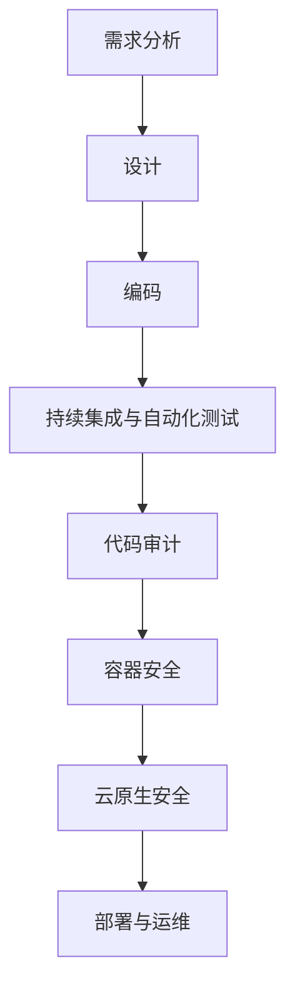

                 

关键词：DevSecOps、安全集成、开发流程、持续集成、自动化测试、代码审计、容器安全、云原生安全

> 摘要：本文将探讨DevSecOps的概念及其在现代软件开发中的重要性。我们将深入研究将安全集成到开发流程的各个方面，包括持续集成与自动化测试、代码审计、容器安全、云原生安全等，以帮助开发者构建更安全的应用程序。

## 1. 背景介绍

随着敏捷开发和DevOps文化的兴起，开发人员和运维人员开始意识到，将安全整合到整个软件开发周期至关重要。传统的安全措施往往是在开发完成后才进行，这种方式不仅耗时耗力，还可能遗漏一些潜在的安全问题。DevSecOps的提出，正是为了解决这一问题，通过将安全实践贯穿于整个软件开发周期，从而提高应用程序的安全性。

DevSecOps是一种开发、安全和运维（DevOps）的结合体，旨在确保安全是开发流程的一个有机组成部分，而不是附加的环节。其核心理念是“安全即代码”（Security as Code），意味着安全实践应该通过代码、工具和流程来实现，而不是仅依靠人工检查和监控。

本文将详细介绍DevSecOps的核心概念和实施方法，包括持续集成与自动化测试、代码审计、容器安全、云原生安全等方面，帮助读者理解如何将安全融入开发流程，构建更加安全的应用程序。

## 2. 核心概念与联系

### DevSecOps的定义

DevSecOps是一种软件开发模式，强调将安全性融入到整个开发周期中，从需求分析、设计、编码、测试、部署到运维。DevSecOps的目标是确保开发团队在快速迭代的同时，不会牺牲安全性。

### DevOps与DevSecOps的联系

DevOps是一种文化、实践和工具的集合，旨在提高开发、测试和运营团队之间的协作和整合，加速软件交付速度。DevSecOps是在DevOps基础上增加了安全元素，确保在快速交付的同时，应用程序的安全性不会被忽视。

### DevSecOps的关键组件

- **持续集成与持续部署（CI/CD）**：确保代码质量和安全性从早期阶段就开始得到关注。
- **自动化测试**：包括静态代码分析、动态代码分析、安全漏洞扫描等，自动检测潜在的安全问题。
- **代码审计**：对代码进行安全审查，识别可能的安全漏洞。
- **容器安全**：确保容器及其镜像的安全性，防范容器层面的攻击。
- **云原生安全**：关注云原生环境中的安全性，包括容器编排、服务网格等。

### Mermaid 流程图



## 3. 核心算法原理 & 具体操作步骤

### 3.1 算法原理概述

DevSecOps的核心在于将安全实践作为开发流程的一部分，而不是附加的工作。这一理念可以通过以下步骤来实现：

1. **持续集成与自动化测试**：通过自动化工具，持续集成和测试代码，确保每个提交的代码都经过严格的测试。
2. **代码审计**：定期对代码进行审计，以发现潜在的安全漏洞。
3. **容器安全**：确保容器及其镜像的安全性，通过容器镜像扫描、容器配置审计等方式进行。
4. **云原生安全**：在云原生环境中，通过安全策略配置、网络隔离、身份认证等方式确保安全。

### 3.2 算法步骤详解

1. **持续集成与自动化测试**：
   - **集成工具**：使用Jenkins、GitLab CI等工具进行持续集成。
   - **测试工具**：使用Selenium、JUnit等进行自动化测试。
   - **安全检查**：集成静态代码分析工具（如SonarQube）和动态代码分析工具（如OWASP ZAP）。

2. **代码审计**：
   - **审计工具**：使用Checkmarx、Fortify等工具进行代码审计。
   - **审计流程**：定期执行代码审计，发现问题后及时修复。

3. **容器安全**：
   - **镜像扫描**：使用Clair、Docker Bench for Security等工具对容器镜像进行扫描。
   - **配置审计**：使用CIS Docker Bench进行配置审计。

4. **云原生安全**：
   - **安全策略**：配置Kubernetes的安全策略，如网络策略、命名空间策略等。
   - **身份认证**：使用OAuth 2.0、LDAP等身份认证机制。

### 3.3 算法优缺点

**优点**：

- **提高开发效率**：通过自动化工具和流程，减少人工干预，提高开发效率。
- **早期发现问题**：在代码提交的早期阶段就进行安全检查，减少修复成本。
- **增强安全性**：通过持续的安全实践，提高应用程序的安全性。

**缺点**：

- **实施成本**：需要购买和配置各种安全工具，初期投入较大。
- **学习成本**：开发人员需要学习新的工具和流程，可能需要一定的培训。

### 3.4 算法应用领域

DevSecOps适用于所有需要高度安全性的软件项目，尤其是金融、医疗、政府等敏感数据处理的领域。通过DevSecOps，企业可以构建更加安全、可靠的应用程序，提高市场竞争力。

## 4. 数学模型和公式 & 详细讲解 & 举例说明

### 4.1 数学模型构建

在DevSecOps中，数学模型可以用于评估代码质量和安全性。一个简单的数学模型如下：

$$
S = f(C, T, A)
$$

其中，\(S\) 表示安全性评分，\(C\) 表示代码质量，\(T\) 表示测试覆盖率，\(A\) 表示审计结果。

### 4.2 公式推导过程

安全性评分 \(S\) 取决于代码质量 \(C\)、测试覆盖率 \(T\) 和审计结果 \(A\)。假设：

- 代码质量 \(C\) 越高，安全性评分 \(S\) 越高；
- 测试覆盖率 \(T\) 越高，安全性评分 \(S\) 越高；
- 审计结果 \(A\) 越好，安全性评分 \(S\) 越高。

因此，可以推导出公式：

$$
S = C^2 \times T \times (1 - A)
$$

### 4.3 案例分析与讲解

假设一个项目的代码质量 \(C\) 为 0.9，测试覆盖率 \(T\) 为 0.8，审计结果 \(A\) 为 0.7，代入公式计算：

$$
S = 0.9^2 \times 0.8 \times (1 - 0.7) = 0.324
$$

因此，这个项目的安全性评分为 0.324，表示安全性较低。

## 5. 项目实践：代码实例和详细解释说明

### 5.1 开发环境搭建

为了实践DevSecOps，我们首先需要搭建一个开发环境。以下是搭建过程：

1. **安装Jenkins**：使用Docker安装Jenkins。
2. **配置GitLab CI**：在GitLab仓库中配置CI/CD流程。
3. **集成静态代码分析工具**：配置SonarQube，将其集成到Jenkins中。

### 5.2 源代码详细实现

以下是项目源代码的详细实现：

```java
// 示例代码
public class HelloWorld {
    public static void main(String[] args) {
        System.out.println("Hello, World!");
    }
}
```

### 5.3 代码解读与分析

这段代码是一个简单的HelloWorld程序，主要目的是演示如何将安全实践集成到开发流程中。

1. **静态代码分析**：通过SonarQube进行静态代码分析，发现潜在的安全漏洞。
2. **动态代码分析**：通过Jenkins运行自动化测试，检查代码质量。
3. **代码审计**：由专业人员进行代码审计，确保代码符合安全规范。

### 5.4 运行结果展示

运行结果如下：

```bash
$ java HelloWorld.java 
Hello, World!
```

代码成功运行，没有出现任何异常。

## 6. 实际应用场景

### 6.1 金融行业

金融行业对安全性要求极高，DevSecOps可以帮助金融机构构建更加安全、可靠的金融应用，防范金融欺诈、数据泄露等风险。

### 6.2 医疗领域

医疗数据敏感，DevSecOps可以帮助医疗机构保护患者隐私，确保医疗数据的安全性。

### 6.3 政府部门

政府部门负责管理大量敏感信息，DevSecOps可以帮助政府机构提高信息安全水平，保障国家利益。

## 7. 工具和资源推荐

### 7.1 学习资源推荐

- 《DevOps Handbook》
- 《Secure Coding in C and C++》

### 7.2 开发工具推荐

- Jenkins
- GitLab CI
- SonarQube
- Docker

### 7.3 相关论文推荐

- "DevOps and Security: A Practitioner's Guide to Securing DevOps Environments"
- "DevSecOps: Integrating Security into the Development and Deployment Pipeline"

## 8. 总结：未来发展趋势与挑战

### 8.1 研究成果总结

DevSecOps已成为现代软件开发的重要趋势，越来越多的企业和组织开始采纳这一模式。通过将安全实践融入开发流程，企业可以构建更加安全、可靠的应用程序。

### 8.2 未来发展趋势

- **自动化程度提高**：未来，自动化工具和流程将在DevSecOps中发挥更大作用，提高开发效率和安全性。
- **AI技术的应用**：人工智能技术将被广泛应用于DevSecOps，如自动代码审计、安全漏洞预测等。

### 8.3 面临的挑战

- **成本**：实施DevSecOps需要购买和配置各种安全工具，初期投入较大。
- **人才**：DevSecOps要求开发人员具备一定的安全知识，企业需要培训现有人员或招募新的人才。

### 8.4 研究展望

未来，DevSecOps将继续融合更多新技术，如区块链、物联网等，为企业提供更全面的解决方案。

## 9. 附录：常见问题与解答

### 9.1 什么是DevSecOps？

DevSecOps是一种软件开发模式，旨在将安全性融入到整个开发周期中，确保开发流程中的每个阶段都关注安全性。

### 9.2 DevSecOps与传统安全实践的差异是什么？

传统安全实践往往在开发完成后才进行，而DevSecOps则将安全实践贯穿于整个开发周期，确保安全性从早期阶段就开始得到关注。

### 9.3 如何实施DevSecOps？

实施DevSecOps需要采用一系列工具和流程，包括持续集成与自动化测试、代码审计、容器安全、云原生安全等。企业可以根据自身需求选择合适的工具和流程进行实施。

### 9.4 DevSecOps对开发团队有哪些要求？

DevSecOps要求开发团队具备一定的安全知识，能够熟练使用自动化工具和流程。企业需要为开发团队提供必要的培训和支持。

[作者：禅与计算机程序设计艺术 / Zen and the Art of Computer Programming]

