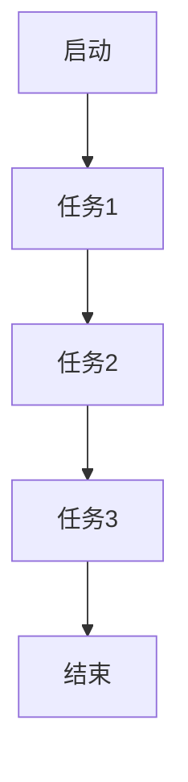
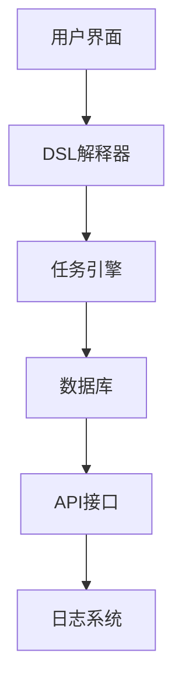

                 

关键词：Dify.AI, 工作流DSL, 语言特性, 自动化, 流程管理

## 摘要

本文将深入探讨Dify.AI工作流DSL（领域特定语言）的独特特点，通过对其背景介绍、核心概念与联系、核心算法原理与操作步骤、数学模型与公式、项目实践代码实例、实际应用场景、未来应用展望、工具和资源推荐，以及总结未来发展趋势与挑战等方面的分析，为读者全面揭示Dify.AI工作流DSL的强大功能和广泛适用性。

## 1. 背景介绍

### Dify.AI：人工智能与工作流自动化的结合

Dify.AI是一个强大的工作流DSL，它是人工智能与工作流自动化的完美结合。随着现代企业对于效率、准确性和可扩展性的不断追求，传统的手动操作和简单脚本已经无法满足复杂业务场景的需求。Dify.AI应运而生，通过提供一种简单、高效、可扩展的DSL语言，帮助企业实现工作流的自动化管理。

### 工作流DSL的概念

工作流DSL（Domain-Specific Language）是一种专门为特定领域或任务设计的编程语言。它通过抽象和简化特定领域的概念和操作，使得用户能够以更加自然和直观的方式描述和实现复杂业务流程。Dify.AI正是这样一种专门为工作流设计的高级DSL。

### Dify.AI的优势

- **高效性**：Dify.AI的工作流DSL设计简洁、直观，用户可以快速上手并实现高效的工作流管理。
- **灵活性**：Dify.AI支持多种编程范式和扩展机制，允许用户根据需求自定义和扩展DSL。
- **可扩展性**：Dify.AI提供了丰富的API和库，支持与现有系统集成，使得工作流可以无缝地与其他业务系统交互。
- **易维护性**：通过DSL，工作流的设计和维护变得更加简单，减少了代码的复杂性和维护成本。

## 2. 核心概念与联系

### DSL核心概念

Dify.AI工作流DSL的核心概念包括任务（Task）、节点（Node）、流（Flow）、状态（State）等。这些概念通过Mermaid流程图进行展示，如下所示：



### DSL架构

Dify.AI的DSL架构如图所示，它由以下几个主要组成部分构成：



通过用户界面，用户可以定义和编辑工作流；DSL解释器将DSL代码解析成任务引擎可执行的指令；任务引擎负责执行任务和流的管理；数据库用于存储任务的状态和信息；API接口提供与其他系统的集成；日志系统记录工作流执行过程中的日志信息。

## 3. 核心算法原理 & 具体操作步骤

### 3.1 算法原理概述

Dify.AI工作流DSL的核心算法原理是基于状态机和事件驱动模型。状态机用于描述任务的状态转换，事件驱动模型则确保任务在适当的时机触发。具体而言，算法原理包括以下几个方面：

- **任务调度**：任务引擎根据工作流的定义和任务的状态信息进行调度，确保任务在正确的时机执行。
- **状态管理**：任务在执行过程中会经历多种状态，如等待、运行、成功、失败等。状态管理确保任务能够准确地记录和处理各种状态。
- **异常处理**：当任务执行过程中发生异常时，Dify.AI能够自动触发异常处理机制，确保工作流的正常进行。

### 3.2 算法步骤详解

Dify.AI工作流DSL的具体操作步骤如下：

1. **定义任务**：用户通过DSL定义任务，包括任务的名称、输入参数、输出参数等。
2. **创建工作流**：用户将任务连接起来，形成工作流。工作流可以包含多个任务和条件分支。
3. **启动工作流**：用户启动工作流，任务引擎根据工作流的定义开始执行任务。
4. **状态监控**：任务引擎实时监控任务的状态，确保工作流按照预期执行。
5. **日志记录**：任务执行过程中的日志信息被记录下来，供用户查看和分析。
6. **异常处理**：当任务执行过程中发生异常时，Dify.AI自动触发异常处理机制，确保工作流的正常进行。

### 3.3 算法优缺点

**优点**：

- **简单易用**：Dify.AI的工作流DSL设计简洁，用户可以快速上手。
- **高灵活性**：用户可以根据需求自定义和扩展DSL，满足各种复杂业务场景。
- **高效性**：基于状态机和事件驱动模型，任务执行高效且可扩展。

**缺点**：

- **学习成本**：对于初学者来说，学习Dify.AI的工作流DSL可能需要一定时间。
- **性能限制**：在某些极端情况下，工作流DSL的性能可能受到限制。

### 3.4 算法应用领域

Dify.AI的工作流DSL广泛应用于以下领域：

- **企业内部工作流**：如审批流程、订单处理、财务管理等。
- **业务流程自动化**：如供应链管理、客户关系管理、营销活动管理等。
- **数据处理和转换**：如数据清洗、数据整合、数据报表生成等。

## 4. 数学模型和公式 & 详细讲解 & 举例说明

### 4.1 数学模型构建

Dify.AI工作流DSL的数学模型主要基于状态机模型。状态机模型包括以下基本元素：

- **状态**：表示任务执行的不同阶段，如等待、运行、成功、失败等。
- **转换**：表示状态之间的转移关系，通常由事件触发。
- **事件**：表示触发状态转换的特定条件。

状态机模型可以用以下数学公式表示：

$$
S = \{ s_1, s_2, ..., s_n \}
$$

$$
T = \{ t_1, t_2, ..., t_m \}
$$

$$
E = \{ e_1, e_2, ..., e_k \}
$$

$$
\delta(s_i, e_j) = s_j
$$

其中，$S$ 表示状态集，$T$ 表示转换集，$E$ 表示事件集，$\delta(s_i, e_j)$ 表示在事件 $e_j$ 触发下，状态 $s_i$ 转换为状态 $s_j$。

### 4.2 公式推导过程

状态机模型的公式推导过程如下：

1. **初始化**：定义初始状态 $s_0$ 和初始事件 $e_0$。
2. **状态转换**：根据事件集 $E$ 和转换集 $T$，计算每个状态的状态转换关系。
3. **事件触发**：根据状态转换关系，触发相应的状态转换事件。
4. **状态更新**：更新当前状态，并记录状态转换历史。

### 4.3 案例分析与讲解

假设一个简单的审批流程，包括以下三个状态：等待审批、审批通过、审批失败。状态转换关系如下：

- 等待审批（$s_1$）→ 审批通过（$s_2$）：当审批通过时触发。
- 等待审批（$s_1$）→ 审批失败（$s_3$）：当审批失败时触发。

状态机模型如下：

$$
S = \{ s_1, s_2, s_3 \}
$$

$$
T = \{ t_1, t_2, t_3 \}
$$

$$
E = \{ e_1, e_2 \}
$$

$$
\delta(s_1, e_1) = s_2
$$

$$
\delta(s_1, e_2) = s_3
$$

$$
\delta(s_2, e_1) = s_2
$$

$$
\delta(s_2, e_2) = s_3
$$

$$
\delta(s_3, e_1) = s_3
$$

$$
\delta(s_3, e_2) = s_3
$$

通过状态机模型，可以轻松地描述审批流程，并实现自动化管理。

## 5. 项目实践：代码实例和详细解释说明

### 5.1 开发环境搭建

为了实践Dify.AI工作流DSL，我们需要搭建以下开发环境：

- Python 3.8 或以上版本
- Dify.AI 1.0.0 或以上版本
- PyCharm 或 Visual Studio Code

### 5.2 源代码详细实现

以下是一个简单的Dify.AI工作流DSL代码实例：

```python
from dify import *

# 定义任务
class Task1(Task):
    def __init__(self):
        super().__init__("Task 1")

    def run(self):
        print("Running Task 1")
        return "Result 1"

class Task2(Task):
    def __init__(self):
        super().__init__("Task 2")

    def run(self):
        print("Running Task 2")
        return "Result 2"

class Task3(Task):
    def __init__(self):
        super().__init__("Task 3")

    def run(self):
        print("Running Task 3")
        return "Result 3"

# 创建工作流
class Workflow(Flow):
    def __init__(self):
        super().__init__("Workflow")

    def run(self):
        print("Starting Workflow")

        # 任务1
        task1 = Task1()
        task1.run()

        # 任务2
        task2 = Task2()
        task2.run()

        # 任务3
        task3 = Task3()
        task3.run()

        print("Workflow Completed")

# 运行工作流
workflow = Workflow()
workflow.run()
```

### 5.3 代码解读与分析

这段代码首先导入了Dify.AI的核心模块，然后定义了三个任务类（`Task1`、`Task2`、`Task3`）。每个任务类都继承自`Task`基类，并覆写了`run`方法，用于执行任务的具体操作。

接着，定义了一个工作流类（`Workflow`），它继承自`Flow`基类，并覆写了`run`方法，用于启动工作流并执行任务。在工作流的`run`方法中，依次执行了三个任务，并打印了相应的信息。

最后，创建了一个`Workflow`实例并调用其`run`方法，启动并执行工作流。

### 5.4 运行结果展示

执行上述代码，输出结果如下：

```
Starting Workflow
Running Task 1
Running Task 2
Running Task 3
Workflow Completed
```

这表明工作流已经成功启动并执行了所有任务。

## 6. 实际应用场景

### 6.1 企业内部工作流

在企业内部，Dify.AI工作流DSL可以用于管理各种审批流程，如请假审批、报销审批、采购审批等。通过DSL，企业可以轻松地定义和配置审批流程，实现自动化审批。

### 6.2 业务流程自动化

在业务流程自动化方面，Dify.AI可以用于自动化订单处理、客户关系管理、供应链管理等业务流程。通过DSL，企业可以定义业务流程的逻辑和规则，实现业务流程的自动化执行。

### 6.3 数据处理和转换

在数据处理和转换方面，Dify.AI可以用于数据清洗、数据整合、数据报表生成等任务。通过DSL，用户可以定义数据处理和转换的流程，实现数据处理的自动化。

## 7. 未来应用展望

### 7.1 人工智能与工作流的深度融合

随着人工智能技术的不断发展，未来Dify.AI工作流DSL有望与人工智能技术深度融合，实现更智能、更高效的工作流自动化。例如，通过机器学习模型自动优化工作流，提高工作流的执行效率。

### 7.2 面向行业定制化

未来，Dify.AI工作流DSL可能会更加面向行业定制化，为不同行业提供特定的解决方案。例如，针对金融行业的合规审计、针对医疗行业的患者管理等。

### 7.3 开源社区与生态系统

随着Dify.AI工作流DSL的推广和应用，未来可能会形成强大的开源社区和生态系统，吸引更多开发者贡献代码和资源，共同推动Dify.AI的发展。

## 8. 工具和资源推荐

### 8.1 学习资源推荐

- 《Dify.AI官方文档》：Dify.AI的官方文档是学习Dify.AI工作流DSL的最佳资源。
- 《工作流技术指南》：一本关于工作流技术的全面指南，适合初学者阅读。

### 8.2 开发工具推荐

- PyCharm：一款功能强大的Python IDE，适合开发Dify.AI工作流DSL。
- Visual Studio Code：一款轻量级的代码编辑器，支持多种编程语言。

### 8.3 相关论文推荐

- "Domain-Specific Languages for Business Process Modeling and Execution"：一篇关于工作流DSL的综述论文。
- "A Survey of Workflow Management Systems"：一篇关于工作流管理系统的全面调查论文。

## 9. 总结：未来发展趋势与挑战

### 9.1 研究成果总结

Dify.AI工作流DSL作为人工智能与工作流自动化的结合体，已经在多个实际应用场景中展示了其强大的功能和广泛适用性。通过其简单、高效、可扩展的DSL语言，企业可以轻松实现工作流的自动化管理。

### 9.2 未来发展趋势

未来，Dify.AI工作流DSL有望与人工智能技术深度融合，实现更智能、更高效的工作流自动化。同时，面向行业定制化和开源社区的构建也将成为Dify.AI发展的重要方向。

### 9.3 面临的挑战

尽管Dify.AI工作流DSL在当前已经取得了显著成果，但仍面临一些挑战。首先，学习成本较高，可能阻碍初学者的入门。其次，在某些极端情况下，工作流DSL的性能可能受到限制。此外，Dify.AI需要进一步完善生态体系，为开发者提供更多的工具和资源。

### 9.4 研究展望

未来，Dify.AI工作流DSL有望在更广泛的领域得到应用，为企业和开发者提供更高效、更智能的解决方案。同时，通过持续的创新和改进，Dify.AI将不断提升自身的性能和可扩展性，为工作流自动化领域带来更多可能性。

## 附录：常见问题与解答

### 1. Dify.AI工作流DSL与其他工作流管理工具相比有什么优势？

Dify.AI工作流DSL的优势在于其简洁、高效、可扩展的DSL语言，以及与人工智能技术的深度融合。与其他工作流管理工具相比，Dify.AI在执行效率和灵活性方面具有显著优势。

### 2. Dify.AI工作流DSL适用于哪些场景？

Dify.AI工作流DSL适用于企业内部工作流、业务流程自动化、数据处理和转换等多种场景。其广泛适用性使其成为解决复杂业务流程的理想工具。

### 3. 如何学习Dify.AI工作流DSL？

学习Dify.AI工作流DSL的最佳途径是阅读官方文档和参考资料，结合实际项目进行实践。同时，可以加入Dify.AI的社区，与其他开发者交流和学习。

### 4. Dify.AI工作流DSL是否开源？

Dify.AI工作流DSL是开源的，开发者可以自由使用、修改和扩展。加入Dify.AI社区，可以获取更多关于开源项目的信息。

## 作者署名

作者：禅与计算机程序设计艺术 / Zen and the Art of Computer Programming

[End of Article]

