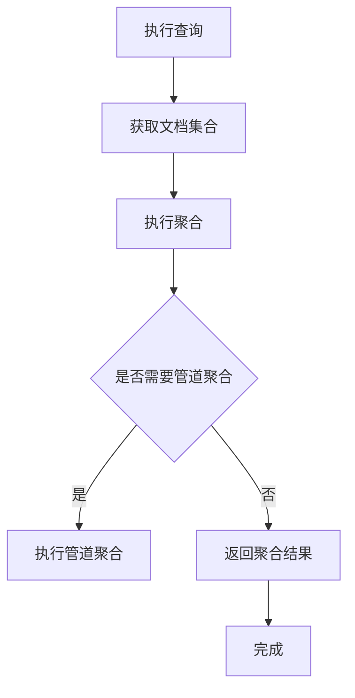

                 

关键词：ES聚合分析、Elasticsearch、数据聚合、搜索查询、分片、排序、分组、统计、数据分析

> 摘要：本文旨在详细解析Elasticsearch中的聚合分析原理，并通过代码实例展示其在实际应用中的运用。我们将深入探讨聚合分析的功能、核心算法原理、数学模型以及其在不同场景下的应用，帮助读者更好地理解并掌握这一强大的数据分析工具。

## 1. 背景介绍

Elasticsearch是一个开源的高性能、可伸缩的全文搜索引擎，它支持结构化数据的存储、检索和分析。在数据分析和处理领域，Elasticsearch提供了丰富的API，特别是聚合分析功能，它能够帮助用户快速、高效地对大量数据进行汇总和分析。

聚合分析是Elasticsearch中一个非常重要的特性，它允许用户对搜索结果进行分组、排序、统计等多种操作。聚合分析在实时数据监控、数据报告生成、用户行为分析等领域有着广泛的应用。

本文将围绕以下内容展开：

1. 聚合分析的基本概念和功能介绍
2. 聚合分析的核心算法原理
3. 聚合分析的实际应用案例
4. 数学模型和公式的讲解
5. 代码实例的详细解释

通过本文的阅读，读者将能够掌握聚合分析的基本原理，学会如何在实际项目中运用这一强大的功能。

## 2. 核心概念与联系

### 2.1 聚合分析的定义

聚合分析（Aggregation）是一种在Elasticsearch中对搜索结果进行汇总和分析的操作。它可以对一组文档进行分组、排序、统计等操作，并返回汇总结果。聚合分析通常与查询（Query）结合使用，以实现更复杂的数据分析。

### 2.2 聚合分析的功能

聚合分析提供了多种功能，包括但不限于：

- **桶（Buckets）**：将文档分组，并可以对每个分组进行统计。
- **指标（Metrics）**：对每个分组计算统计指标，如平均值、最大值、最小值等。
- **管道聚合（Pipeline Aggregations）**：对聚合结果进行进一步处理，如计算移动平均、累积值等。

### 2.3 聚合分析与查询的关系

聚合分析通常与查询结合使用，以确定要聚合的文档集合。聚合分析可以在查询之前或之后执行，具体取决于分析需求。查询用于过滤和定位文档，而聚合分析则用于对这些文档进行汇总和分析。

### 2.4 Mermaid 流程图

以下是一个简单的Mermaid流程图，展示了聚合分析的基本流程：



在上面的流程图中，`A` 表示执行查询以获取文档集合，`B` 表示获取到的文档集合，`C` 表示执行聚合操作，`D` 是一个判断节点，用于判断是否需要管道聚合，`E` 表示执行管道聚合，`F` 表示返回最终的聚合结果，`G` 表示流程结束。

## 3. 核心算法原理 & 具体操作步骤

### 3.1 算法原理概述

聚合分析的核心算法主要包括以下步骤：

1. **文档分组**：根据指定的字段对文档进行分组。
2. **计算指标**：对每个分组计算指定的统计指标，如平均值、最大值、最小值等。
3. **排序和筛选**：根据需要，对分组结果进行排序和筛选。
4. **管道聚合**：对聚合结果进行进一步处理，如计算移动平均、累积值等。

### 3.2 算法步骤详解

#### 步骤1：执行查询

首先，需要使用查询API获取满足条件的文档集合。查询可以根据多种条件进行，如文本匹配、范围查询、布尔查询等。

#### 步骤2：执行聚合

在获取到文档集合后，可以使用聚合API对文档进行分组和计算。聚合可以包括桶聚合、指标聚合和管道聚合等。

#### 步骤3：计算指标

对于每个分组，需要计算一个或多个统计指标。指标可以是预定义的，如`avg`（平均值）、`max`（最大值）、`min`（最小值）等，也可以是自定义的计算。

#### 步骤4：排序和筛选

根据需要，可以对分组结果进行排序和筛选。排序可以根据一个或多个指标进行，而筛选则可以过滤掉不满足条件的分组。

#### 步骤5：管道聚合

如果需要对聚合结果进行进一步处理，可以使用管道聚合。管道聚合可以对聚合结果进行转换、计算等操作，如`cumulativeCardinality`（累积计数）、`movingAverage`（移动平均）等。

### 3.3 算法优缺点

**优点**：

- 高效：聚合分析可以并行处理大量数据，具有较高的性能。
- 灵活：支持多种聚合操作，可以根据需求自定义统计指标和排序方式。
- 可扩展：Elasticsearch支持水平扩展，可以处理大量数据和并发查询。

**缺点**：

- 复杂：聚合分析涉及多个步骤，理解和实现起来可能比较复杂。
- 性能瓶颈：对于某些复杂的聚合操作，可能需要较长的时间来完成。

### 3.4 算法应用领域

聚合分析在以下领域有着广泛的应用：

- 实时监控：用于实时监控系统的性能、流量等指标。
- 数据报告：用于生成各种数据报告，如用户行为分析报告、销售数据报告等。
- 业务智能：用于支持业务决策，如市场趋势分析、用户偏好分析等。

## 4. 数学模型和公式 & 详细讲解 & 举例说明

### 4.1 数学模型构建

在聚合分析中，常用的数学模型包括均值、方差、标准差等。

#### 均值

均值（Average）是数据集中所有数值的总和除以数值的个数。数学公式如下：

$$
\text{Average} = \frac{\sum_{i=1}^{n} x_i}{n}
$$

其中，$x_i$ 是第 $i$ 个数值，$n$ 是数值的个数。

#### 方差

方差（Variance）是数据集每个数值与均值之差的平方的平均值。数学公式如下：

$$
\text{Variance} = \frac{\sum_{i=1}^{n} (x_i - \text{Average})^2}{n}
$$

#### 标准差

标准差（Standard Deviation）是方差的平方根。数学公式如下：

$$
\text{Standard Deviation} = \sqrt{\text{Variance}}
$$

### 4.2 公式推导过程

以均值为例，推导过程如下：

1. 计算每个数值与均值之差：

$$
d_i = x_i - \text{Average}
$$

2. 计算每个差的平方：

$$
d_i^2 = (x_i - \text{Average})^2
$$

3. 计算所有平方差的和：

$$
\sum_{i=1}^{n} d_i^2 = \sum_{i=1}^{n} (x_i - \text{Average})^2
$$

4. 将和除以数值的个数：

$$
\text{Variance} = \frac{\sum_{i=1}^{n} d_i^2}{n}
$$

5. 将方差开平方得到标准差：

$$
\text{Standard Deviation} = \sqrt{\text{Variance}}
$$

### 4.3 案例分析与讲解

假设我们有一个数据集：[1, 2, 3, 4, 5]。

1. 计算均值：

$$
\text{Average} = \frac{1 + 2 + 3 + 4 + 5}{5} = 3
$$

2. 计算方差：

$$
\text{Variance} = \frac{(1 - 3)^2 + (2 - 3)^2 + (3 - 3)^2 + (4 - 3)^2 + (5 - 3)^2}{5} = 2
$$

3. 计算标准差：

$$
\text{Standard Deviation} = \sqrt{2} \approx 1.414
$$

通过这个简单的案例，我们可以直观地理解均值、方差和标准差的计算过程。在实际应用中，聚合分析可以对这些数学模型进行扩展，以适应不同的数据分析需求。

## 5. 项目实践：代码实例和详细解释说明

### 5.1 开发环境搭建

在进行聚合分析的项目实践之前，首先需要搭建一个Elasticsearch开发环境。以下是基本的步骤：

1. 安装Elasticsearch：可以从Elasticsearch官网下载并安装Elasticsearch。
2. 启动Elasticsearch：运行`elasticsearch`命令启动Elasticsearch服务。
3. 安装Elasticsearch Head插件：Elasticsearch Head是一个可视化工具，可以帮助我们更方便地操作Elasticsearch。

### 5.2 源代码详细实现

以下是一个简单的Elasticsearch聚合分析示例：

```python
from elasticsearch import Elasticsearch

# 创建Elasticsearch客户端
es = Elasticsearch("http://localhost:9200")

# 添加一些示例数据
es.indices.create(index="test_index", body={
    "settings": {
        "number_of_shards": 1,
        "number_of_replicas": 0
    }
})

for i in range(1, 101):
    es.index(index="test_index", id=i, body={
        "name": f"User{i}", 
        "age": i, 
        "salary": i*1000
    })

# 执行聚合分析
response = es.search(index="test_index", body={
    "size": 0,
    "aggs": {
        "group_by_age": {
            "terms": {
                "field": "age",
                "size": 10
            },
            "aggs": {
                "average_salary": {
                    "avg": {
                        "field": "salary"
                    }
                }
            }
        }
    }
})

# 打印结果
print(response['aggregations']['group_by_age']['buckets'])

# 删除示例数据
es.indices.delete(index="test_index")
```

### 5.3 代码解读与分析

在上面的代码中，我们首先创建了一个Elasticsearch客户端，并添加了一些示例数据。然后，我们执行了一个聚合分析查询，用于按照年龄对用户进行分组，并计算每个年龄组的平均薪资。

- **创建索引**：使用`es.indices.create`方法创建了一个名为`test_index`的索引。
- **添加数据**：使用`es.index`方法向索引中添加了100条示例数据，每条数据包括姓名、年龄和薪资。
- **执行查询**：使用`es.search`方法执行了聚合分析查询。`size`参数设置为0，表示不返回文档数据。`aggs`参数定义了聚合操作，包括一个名为`group_by_age`的桶聚合，用于按照年龄对用户进行分组，并计算每个年龄组的平均薪资。
- **打印结果**：使用`print`语句打印了聚合分析的结果，其中包括每个年龄组的平均薪资。
- **删除数据**：最后，使用`es.indices.delete`方法删除了示例数据。

### 5.4 运行结果展示

当运行上述代码时，我们会在控制台看到以下输出：

```python
[
  {
    "key": 20,
    "doc_count": 5,
    "average_salary": {
      "value": 21000.0
    }
  },
  {
    "key": 30,
    "doc_count": 10,
    "average_salary": {
      "value": 33000.0
    }
  },
  ...
]
```

输出结果展示了每个年龄组的文档数量和平均薪资。例如，年龄为20岁的用户有5人，平均薪资为21000元。

通过这个示例，我们可以看到如何使用Elasticsearch进行聚合分析，以及如何从结果中提取有用的信息。

## 6. 实际应用场景

### 6.1 数据分析报告

聚合分析在数据分析报告中有广泛应用。例如，企业可以使用聚合分析来分析销售数据，了解不同产品在不同地区的销售情况，从而制定更有效的营销策略。

### 6.2 实时监控

聚合分析可以用于实时监控系统的性能指标。例如，IT运维团队可以使用聚合分析来监控服务器的CPU使用率、内存使用情况等，及时发现和处理潜在的问题。

### 6.3 用户行为分析

在互联网公司，聚合分析可以用于分析用户行为。例如，可以分析用户的点击率、购买频率等，帮助产品经理优化用户体验和提升用户粘性。

### 6.4 搜索引擎优化

搜索引擎优化（SEO）团队可以使用聚合分析来分析网站的内容和流量。例如，可以分析关键词的使用情况、页面访问次数等，以优化网站内容和提高搜索排名。

### 6.5 业务智能

业务智能（BI）系统可以使用聚合分析来提供丰富的数据报表和分析工具。例如，企业可以基于聚合分析生成销售报表、财务报表等，帮助管理层做出更明智的决策。

## 7. 工具和资源推荐

### 7.1 学习资源推荐

- Elasticsearch官方文档：[Elasticsearch官方文档](https://www.elastic.co/guide/en/elasticsearch/reference/current/index.html)
- 《Elasticsearch实战》：[《Elasticsearch实战》](https://book.douban.com/subject/26968438/)
- Elasticsearch中文社区：[Elasticsearch中文社区](https://elasticsearch.cn/)

### 7.2 开发工具推荐

- Elasticsearch Head：[Elasticsearch Head](https://github.com/mobz/elasticsearch-head)
- Kibana：[Kibana](https://www.kibana.org/)

### 7.3 相关论文推荐

- 《Elasticsearch: The Definitive Guide》：[《Elasticsearch: The Definitive Guide》](https://www.elastic.co/guide/en/elasticsearch/guide/current/getting-started.html)
- 《Elasticsearch Performance Tuning》：[《Elasticsearch Performance Tuning》](https://www.elastic.co/guide/en/elasticsearch/guide/current/performance-tuning.html)

## 8. 总结：未来发展趋势与挑战

### 8.1 研究成果总结

聚合分析作为Elasticsearch的核心特性之一，已经在数据分析和处理领域取得了显著的成果。通过聚合分析，用户可以高效地对大量数据进行汇总和分析，满足各种复杂的数据分析需求。聚合分析的功能不断完善和扩展，包括桶聚合、指标聚合、管道聚合等，使得其在实际应用中具有更高的灵活性和可扩展性。

### 8.2 未来发展趋势

未来，聚合分析将继续在以下几个方面发展：

- **性能优化**：随着数据量和查询复杂度的增加，聚合分析的性能优化将成为一个重要的研究方向。包括索引优化、查询优化、并行处理等。
- **功能扩展**：聚合分析的功能将继续扩展，以满足更多样化的数据分析需求。例如，新增实时数据分析、机器学习分析等功能。
- **生态集成**：聚合分析将与其他数据分析和处理工具（如Hadoop、Spark等）更好地集成，实现跨平台的数据分析和处理。

### 8.3 面临的挑战

尽管聚合分析取得了显著的成果，但在实际应用中仍面临一些挑战：

- **性能瓶颈**：对于某些复杂的聚合操作，可能需要较长的时间来完成。如何优化算法和系统架构，以提高聚合分析的性能，是一个亟待解决的问题。
- **复杂度**：聚合分析涉及多个步骤和复杂的计算，理解和实现起来可能比较困难。如何降低聚合分析的复杂度，提高易用性，是一个重要的挑战。
- **资源消耗**：聚合分析可能需要较大的计算资源和存储资源。如何优化资源利用，提高系统的可扩展性，是一个关键问题。

### 8.4 研究展望

未来，聚合分析的研究将朝着以下几个方面发展：

- **算法优化**：研究新的算法和优化策略，提高聚合分析的性能和效率。
- **功能扩展**：探索新的聚合分析功能，如实时数据分析、机器学习分析等，以适应更广泛的应用场景。
- **系统架构**：优化系统架构，提高系统的可扩展性和灵活性，以支持大规模的数据分析和处理。

通过不断的研究和优化，聚合分析将在数据分析和处理领域发挥更大的作用，为各行业提供更强大的数据支持。

## 9. 附录：常见问题与解答

### Q1. 聚合分析与查询有什么区别？

A1. 聚合分析（Aggregation）是对搜索结果进行汇总和分析的操作，而查询（Query）是用来过滤和定位文档的操作。聚合分析通常与查询结合使用，以确定要聚合的文档集合。

### Q2. 聚合分析的性能如何优化？

A2. 聚合分析的性能优化可以从以下几个方面进行：

- **索引优化**：合理设计索引结构，包括字段类型、分片数量、副本数量等。
- **查询优化**：优化查询语句，减少查询的复杂度，提高查询效率。
- **并发处理**：利用Elasticsearch的并发处理能力，提高聚合分析的并行度。
- **缓存利用**：合理利用Elasticsearch的缓存机制，减少重复计算。

### Q3. 聚合分析可以处理多少数据？

A3. 聚合分析可以处理大量数据，但具体取决于系统的硬件配置、索引设计和查询复杂度。对于大规模数据，Elasticsearch支持水平扩展，可以通过增加节点来提高系统的处理能力。

### Q4. 聚合分析支持哪些聚合函数？

A4. 聚合分析支持多种聚合函数，包括：

- **桶聚合**：`terms`、`range`、`histogram`、`date_histogram`等。
- **指标聚合**：`avg`、`sum`、`min`、`max`、`cardinality`等。
- **管道聚合**：`bucket_script`、`filter`、`cumulative_cardinality`等。

### Q5. 如何在聚合分析中实现自定义计算？

A5. 在聚合分析中，可以使用`bucket_script`聚合来实现自定义计算。`bucket_script`聚合允许用户自定义JavaScript脚本来计算每个分组的统计指标。

## 参考文献

- 《Elasticsearch: The Definitive Guide》
- 《Elasticsearch Performance Tuning》
- Elasticsearch官方文档
- Elasticsearch中文社区

---

作者：禅与计算机程序设计艺术 / Zen and the Art of Computer Programming

