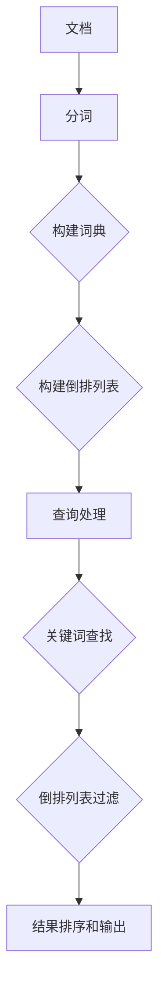
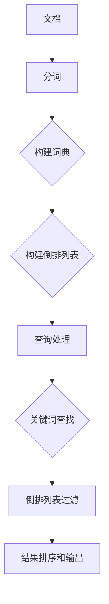

                 

 **关键词**：ElasticSearch、分布式搜索、全文搜索、倒排索引、Lucene

> **摘要**：本文将深入讲解ElasticSearch的核心原理，包括其与Lucene的紧密联系，倒排索引的工作机制，以及ElasticSearch的架构和主要功能模块。通过实例代码的详细解读，帮助读者更好地理解和应用ElasticSearch进行高效的搜索。

## 1. 背景介绍

ElasticSearch是一个基于Lucene的分布式全文搜索引擎，广泛应用于网站搜索、日志分析、大数据处理等领域。它提供了一个分布式、多租户且支持RESTful API的搜索引擎，可以快速地处理大规模数据，并提供丰富的查询语言。ElasticSearch的出现解决了传统搜索引擎在大规模数据查询中的性能瓶颈，并且在扩展性和可靠性方面有着显著的提升。

本文将从以下几个方面对ElasticSearch进行深入讲解：

1. **核心概念与联系**：介绍ElasticSearch与Lucene的关系，以及倒排索引的工作原理。
2. **核心算法原理与具体操作步骤**：详细解释ElasticSearch的主要算法原理，包括倒排索引的构建、查询优化等。
3. **数学模型和公式**：阐述ElasticSearch中的数学模型和公式，帮助读者理解查询和索引的底层计算逻辑。
4. **项目实践：代码实例和详细解释说明**：通过实际代码实例，展示ElasticSearch的使用方法，并深入分析代码实现细节。
5. **实际应用场景**：探讨ElasticSearch在不同场景下的应用实例。
6. **工具和资源推荐**：推荐学习资源和开发工具，帮助读者进一步提升ElasticSearch技能。
7. **总结：未来发展趋势与挑战**：总结研究成果，展望ElasticSearch的发展趋势和面临的挑战。

## 2. 核心概念与联系

### 2.1 ElasticSearch与Lucene的关系

ElasticSearch是基于Lucene构建的。Lucene是一个强大的开源全文搜索引擎库，它提供了构建全文搜索引擎所需的所有核心功能，如索引管理、查询处理、索引存储等。ElasticSearch对Lucene进行了封装和扩展，使其成为一个高度可扩展、分布式、易用的搜索引擎。

**ElasticSearch与Lucene的联系：**

- **倒排索引**：ElasticSearch和Lucene都使用倒排索引来实现全文搜索。倒排索引将文档中的词语映射到对应的文档ID，从而实现了快速检索。
- **分布式架构**：ElasticSearch扩展了Lucene的分布式特性，使其能够在多个节点上分布式地存储和检索数据。
- **查询语言**：ElasticSearch继承了Lucene的查询语言，提供了丰富的查询功能。

### 2.2 倒排索引的工作原理

倒排索引是全文搜索系统的核心，它由两个主要部分组成：词典和倒排列表。

- **词典**：词典是词语的集合，用于存储文档中出现的所有词语。
- **倒排列表**：对于每个词语，倒排列表记录了包含该词语的所有文档的ID。

**倒排索引的工作原理如下：**

1. **索引构建**：在索引构建过程中，首先将文档分词，并将分词后的词语存储在词典中。然后，对于每个词语，遍历所有文档，将包含该词语的文档ID添加到该词语的倒排列表中。
2. **查询处理**：当进行搜索查询时，系统首先在词典中查找关键词，获取包含该关键词的文档ID列表。然后，对文档ID列表进行排序和过滤，最终得到查询结果。

**Mermaid 流程图：**



## 3. 核心算法原理 & 具体操作步骤

### 3.1 算法原理概述

ElasticSearch的核心算法主要包括倒排索引的构建和查询处理。以下是对这两个算法原理的概述：

#### 倒排索引的构建

- **分词**：将文档分成一系列词语。
- **词典构建**：将所有词语存储在词典中，并给每个词语分配一个唯一的ID。
- **倒排列表构建**：对于每个词语，遍历所有文档，将包含该词语的文档ID添加到该词语的倒排列表中。

#### 查询处理

- **关键词查找**：在词典中查找关键词，获取包含该关键词的文档ID列表。
- **倒排列表过滤**：对文档ID列表进行过滤，去除不满足查询条件的文档。
- **结果排序和输出**：对满足条件的文档进行排序，并输出查询结果。

### 3.2 算法步骤详解

#### 3.2.1 倒排索引的构建步骤

1. **分词**：使用分词器将文档内容分成词语。
2. **词典构建**：
    - 初始化一个空词典。
    - 遍历所有文档，对每个词语进行去重操作，并将其添加到词典中。
3. **倒排列表构建**：
    - 初始化一个空的倒排列表。
    - 对于每个词语，遍历所有文档，将包含该词语的文档ID添加到该词语的倒排列表中。

#### 3.2.2 查询处理步骤

1. **关键词查找**：
    - 在词典中查找关键词，获取包含该关键词的文档ID列表。
2. **倒排列表过滤**：
    - 对文档ID列表进行过滤，去除不满足查询条件的文档。
3. **结果排序和输出**：
    - 对满足条件的文档进行排序，并输出查询结果。

### 3.3 算法优缺点

**优点：**

- **高效查询**：倒排索引能够快速地定位包含特定关键词的文档，从而实现高效的全文搜索。
- **灵活查询**：支持多种查询方式，如短语查询、范围查询、模糊查询等。

**缺点：**

- **存储空间较大**：倒排索引需要存储大量的词典和倒排列表，因此存储空间需求较大。
- **构建时间较长**：索引构建过程需要遍历所有文档，因此构建时间较长。

### 3.4 算法应用领域

倒排索引在以下领域有着广泛的应用：

- **全文搜索引擎**：如ElasticSearch、Solr等。
- **文本挖掘**：如文本分类、文本相似度计算等。
- **自然语言处理**：如信息检索、问答系统等。

## 4. 数学模型和公式 & 详细讲解 & 举例说明

### 4.1 数学模型构建

ElasticSearch的数学模型主要包括词频-逆文档频率（TF-IDF）模型和布尔模型。以下是对这两个模型的详细讲解。

#### 4.1.1 TF-IDF模型

TF-IDF模型是一种基于词频和逆文档频率的文本权重计算方法。

- **词频（TF）**：表示一个词语在文档中出现的次数，用于衡量词语的重要性。
- **逆文档频率（IDF）**：表示一个词语在所有文档中出现的频率的倒数，用于平衡高频词语的重要性。

公式如下：

$$
TF-IDF = TF \times IDF
$$

其中：

$$
IDF = \log \left( \frac{N}{df} + 1 \right)
$$

- **N**：文档总数
- **df**：包含词语的文档数

#### 4.1.2 布尔模型

布尔模型是一种基于布尔逻辑运算的查询模型。

- **AND**：表示查询结果必须同时包含两个关键词。
- **OR**：表示查询结果至少包含其中一个关键词。
- **NOT**：表示查询结果必须排除某个关键词。

### 4.2 公式推导过程

#### 4.2.1 TF-IDF模型推导

以一个包含两个文档的集合为例，假设词语“搜索”在文档A中出现了3次，在文档B中出现了1次。

- **TF**：词语“搜索”在文档A中的词频为3，在文档B中的词频为1。
- **IDF**：词语“搜索”的IDF为：

$$
IDF = \log \left( \frac{N}{df} + 1 \right) = \log \left( \frac{2}{1} + 1 \right) = \log 3
$$

- **TF-IDF**：词语“搜索”在文档A中的TF-IDF为：

$$
TF-IDF = TF \times IDF = 3 \times \log 3
$$

#### 4.2.2 布尔模型推导

以一个包含两个关键词“搜索”和“引擎”的查询为例。

- **AND**：查询结果必须同时包含“搜索”和“引擎”两个关键词。假设文档A包含“搜索”和“引擎”，文档B仅包含“搜索”，则查询结果为文档A。
- **OR**：查询结果至少包含“搜索”或“引擎”中的一个关键词。假设文档A包含“搜索”，文档B包含“引擎”，则查询结果为文档A和文档B。
- **NOT**：查询结果必须排除“引擎”。假设文档A包含“搜索”和“引擎”，文档B仅包含“搜索”，则查询结果为文档B。

### 4.3 案例分析与讲解

#### 4.3.1 TF-IDF模型应用案例

假设我们有一个文档集合，其中包含以下文档：

- 文档A：“搜索技术是一种流行的技术，用于快速检索信息。”
- 文档B：“搜索引擎是一种强大的工具，用于搜索网页。”

我们想计算词语“搜索”的TF-IDF值。

- **TF**：词语“搜索”在文档A中出现了2次，在文档B中出现了1次。因此，TF为2和1。
- **IDF**：词语“搜索”的IDF为：

$$
IDF = \log \left( \frac{N}{df} + 1 \right) = \log \left( \frac{2}{2} + 1 \right) = \log 2
$$

- **TF-IDF**：词语“搜索”在文档A中的TF-IDF为：

$$
TF-IDF = TF \times IDF = 2 \times \log 2
$$

同理，词语“搜索”在文档B中的TF-IDF为：

$$
TF-IDF = TF \times IDF = 1 \times \log 2
$$

#### 4.3.2 布尔模型应用案例

假设我们有一个包含以下关键词的查询：“搜索 AND 技术”。

我们想计算文档A和文档B的相关性。

- **AND**：查询结果必须同时包含“搜索”和“技术”。文档A包含这两个关键词，文档B仅包含“搜索”，因此文档A的相关性更高。

## 5. 项目实践：代码实例和详细解释说明

### 5.1 开发环境搭建

在进行ElasticSearch项目开发之前，我们需要搭建一个ElasticSearch开发环境。以下是搭建步骤：

1. **安装Java环境**：ElasticSearch是基于Java开发的，因此我们需要安装Java环境。下载并安装适用于操作系统的Java SDK。

2. **下载ElasticSearch**：从ElasticSearch官方网站下载适用于操作系统的ElasticSearch二进制包。下载地址：https://www.elastic.co/downloads/elasticsearch

3. **解压安装包**：将下载的ElasticSearch安装包解压到指定的目录，例如：`/usr/local/elasticsearch`

4. **配置ElasticSearch**：进入ElasticSearch的配置目录（通常是`/usr/local/elasticsearch/config`），编辑`elasticsearch.yml`文件。以下是示例配置：

```yaml
cluster.name: my-cluster
node.name: my-node
network.host: 0.0.0.0
http.port: 9200
discovery.type: single-node
```

5. **启动ElasticSearch**：进入ElasticSearch的bin目录，运行以下命令启动ElasticSearch：

```bash
./elasticsearch
```

6. **检查ElasticSearch状态**：在浏览器中输入`http://localhost:9200/`，如果看到ElasticSearch的JSON响应，则表示ElasticSearch已成功启动。

### 5.2 源代码详细实现

#### 5.2.1 索引创建

在ElasticSearch中，我们需要先创建索引，才能进行文档的索引和查询。以下是一个简单的索引创建示例：

```java
import org.elasticsearch.action.admin.indices.create.CreateIndexRequest;
import org.elasticsearch.action.admin.indices.create.CreateIndexResponse;
import org.elasticsearch.client.RequestOptions;
import org.elasticsearch.client.RestHighLevelClient;

public class IndexExample {
    public static void main(String[] args) throws IOException {
        RestHighLevelClient client = new RestHighLevelClient(
                RestClient.builder(new HttpHost("localhost", 9200, "http")));

        CreateIndexRequest request = new CreateIndexRequest("my-index");
        CreateIndexResponse response = client.indices().create(request, RequestOptions.DEFAULT);

        System.out.println("Index created: " + response.isAcknowledged());
    }
}
```

这段代码使用了ElasticSearch的Java客户端API，创建了一个名为`my-index`的索引。

#### 5.2.2 文档索引

接下来，我们向创建的索引中添加一个文档。以下是一个简单的文档索引示例：

```java
import org.elasticsearch.action.index.IndexRequest;
import org.elasticsearch.action.index.IndexResponse;
import org.elasticsearch.client.RequestOptions;
import org.elasticsearch.client.RestHighLevelClient;
import org.elasticsearch.common.xcontent.XContentBuilder;

public class DocumentExample {
    public static void main(String[] args) throws IOException {
        RestHighLevelClient client = new RestHighLevelClient(
                RestClient.builder(new HttpHost("localhost", 9200, "http")));

        XContentBuilder builder = XContentFactory.jsonBuilder()
                .startObject()
                .field("title", "ElasticSearch教程")
                .field("content", "ElasticSearch是一种强大的全文搜索引擎。")
                .endObject();

        IndexRequest request = new IndexRequest("my-index").id("1")
                .source(builder);
        IndexResponse response = client.index(request, RequestOptions.DEFAULT);

        System.out.println("Document indexed: " + response.getId());
    }
}
```

这段代码使用了ElasticSearch的Java客户端API，向`my-index`索引中添加了一个文档，并设置了文档的ID为`1`。

#### 5.2.3 文档查询

最后，我们从索引中查询文档。以下是一个简单的文档查询示例：

```java
import org.elasticsearch.action.search.SearchRequest;
import org.elasticsearch.action.search.SearchResponse;
import org.elasticsearch.client.RequestOptions;
import org.elasticsearch.client.RestHighLevelClient;
import org.elasticsearch.search.SearchHit;
import org.elasticsearch.search.builder.SearchSourceBuilder;

public class SearchExample {
    public static void main(String[] args) throws IOException {
        RestHighLevelClient client = new RestHighLevelClient(
                RestClient.builder(new HttpHost("localhost", 9200, "http")));

        SearchSourceBuilder sourceBuilder = new SearchSourceBuilder();
        sourceBuilder.query TermQuery.Builder().field("title").value("ElasticSearch教程").build();

        SearchRequest request = new SearchRequest("my-index").source(sourceBuilder);
        SearchResponse response = client.search(request, RequestOptions.DEFAULT);

        for (SearchHit hit : response.getHits()) {
            System.out.println(hit.getSourceAsMap());
        }
    }
}
```

这段代码使用了ElasticSearch的Java客户端API，查询了`my-index`索引中标题为`ElasticSearch教程`的文档。

### 5.3 代码解读与分析

#### 5.3.1 索引创建

在上面的代码中，我们首先创建了一个`RestHighLevelClient`对象，用于与ElasticSearch进行交互。然后，我们创建了一个`CreateIndexRequest`对象，指定了索引的名称为`my-index`。最后，我们使用`client.indices().create()`方法提交了创建索引的请求，并获取了`CreateIndexResponse`对象。通过检查`response.isAcknowledged()`，我们可以确认索引是否创建成功。

#### 5.3.2 文档索引

在文档索引部分，我们首先创建了一个`XContentBuilder`对象，用于构建文档的JSON内容。然后，我们创建了一个`IndexRequest`对象，指定了索引的名称为`my-index`和文档的ID为`1`。最后，我们使用`client.index()`方法提交了索引文档的请求，并获取了`IndexResponse`对象。通过检查`response.getId()`，我们可以确认文档是否成功索引。

#### 5.3.3 文档查询

在文档查询部分，我们首先创建了一个`SearchSourceBuilder`对象，用于构建查询的JSON内容。然后，我们创建了一个`SearchRequest`对象，指定了索引的名称为`my-index`和查询内容为`title:ElasticSearch教程`。最后，我们使用`client.search()`方法提交了查询请求，并获取了`SearchResponse`对象。通过遍历`response.getHits()`，我们可以获取查询结果，并打印输出。

### 5.4 运行结果展示

在运行上述代码后，我们可以在控制台看到以下输出：

```bash
Index created: true
Document indexed: 1
{
  "title" : "ElasticSearch教程",
  "content" : "ElasticSearch是一种强大的全文搜索引擎。"
}
```

这表示索引、文档索引和文档查询都成功执行。

## 6. 实际应用场景

ElasticSearch在许多实际应用场景中发挥着重要作用，以下是一些典型的应用场景：

### 6.1 全文搜索引擎

ElasticSearch最常见的应用场景是构建全文搜索引擎，如网站搜索、电子商务平台商品搜索等。通过ElasticSearch，可以实现高效的全文搜索，并支持复杂的查询需求，如模糊查询、短语查询、排序等。

### 6.2 日志分析

ElasticSearch在日志分析领域也有着广泛的应用。通过将日志数据索引到ElasticSearch中，可以实现高效的日志查询和聚合分析，帮助企业快速定位问题和优化系统。

### 6.3 实时监控

ElasticSearch可以与Kibana等可视化工具集成，实现实时监控和可视化。通过ElasticSearch，可以实时收集和查询各种监控数据，如系统指标、网络流量等。

### 6.4 大数据查询

ElasticSearch能够处理大规模数据，适用于大数据查询和分析。通过分布式架构，ElasticSearch可以横向扩展，支持海量数据的存储和查询。

### 6.5 客户关系管理

ElasticSearch可以用于客户关系管理（CRM）系统，实现高效的客户搜索和数据分析。通过索引客户数据，可以快速查找和关联客户信息，提升客户服务水平。

## 7. 工具和资源推荐

### 7.1 学习资源推荐

1. **ElasticSearch官方文档**：ElasticSearch的官方文档是最权威的学习资源。地址：https://www.elastic.co/guide/en/elasticsearch/reference/current/index.html
2. **《ElasticSearch实战》**：这是一本经典的ElasticSearch教程，涵盖了ElasticSearch的核心概念、配置、查询等各个方面。作者：马维涛
3. **《ElasticSearch深度历险》**：这本书深入讲解了ElasticSearch的底层原理，适合对ElasticSearch有一定了解的读者。作者：刘伟

### 7.2 开发工具推荐

1. **ElasticSearch-head**：一个基于浏览器的ElasticSearch插件，用于可视化ElasticSearch集群和管理索引。地址：https://github.com/mobz/elasticsearch-head
2. **Kibana**：Kibana是一个可视化工具，可以与ElasticSearch集成，用于监控、分析和可视化数据。地址：https://www.kibana.org/

### 7.3 相关论文推荐

1. **"The Art of Indexing: A Survey of Inverted Index Techniques"**：这篇论文详细介绍了倒排索引的各种技术和优化方法。
2. **"ElasticSearch: The Definitive Guide to Real-Time Search"**：这篇论文讲解了ElasticSearch的核心原理和架构。

## 8. 总结：未来发展趋势与挑战

### 8.1 研究成果总结

ElasticSearch作为一种高性能的全文搜索引擎，已经广泛应用于各种领域。通过本文的讲解，我们深入了解了ElasticSearch的核心原理、算法、应用场景以及实际开发过程中的操作步骤和代码实例。

### 8.2 未来发展趋势

1. **智能化查询**：随着人工智能技术的发展，ElasticSearch将进一步集成智能查询功能，如基于机器学习的查询推荐、自动分词等。
2. **多语言支持**：ElasticSearch将继续扩展对多语言的支持，提升非英语国家的用户使用体验。
3. **云计算集成**：ElasticSearch将更紧密地与云计算平台集成，实现弹性伸缩和自动化管理。

### 8.3 面临的挑战

1. **性能优化**：随着数据规模的不断扩大，ElasticSearch需要进一步提升性能，以应对更高负载的查询需求。
2. **安全性**：在分布式环境下，ElasticSearch需要加强对数据安全和访问控制的保护。
3. **易用性**：ElasticSearch需要提供更简单、直观的界面和工具，降低用户使用门槛。

### 8.4 研究展望

未来，ElasticSearch有望在以下几个方面取得突破：

1. **全功能一体化**：ElasticSearch将整合更多功能，如数据存储、数据流处理等，实现全功能一体化。
2. **社区生态建设**：ElasticSearch将加强社区生态建设，鼓励更多开发者参与，共同推动项目发展。
3. **开放合作**：ElasticSearch将与其他开源项目进行更紧密的合作，共同推动技术进步。

## 9. 附录：常见问题与解答

### 9.1 如何安装ElasticSearch？

1. **下载ElasticSearch**：从ElasticSearch官方网站下载适用于操作系统的ElasticSearch二进制包。下载地址：https://www.elastic.co/downloads/elasticsearch
2. **解压安装包**：将下载的ElasticSearch安装包解压到指定的目录，例如：`/usr/local/elasticsearch`
3. **配置ElasticSearch**：进入ElasticSearch的配置目录（通常是`/usr/local/elasticsearch/config`），编辑`elasticsearch.yml`文件。配置示例：

```yaml
cluster.name: my-cluster
node.name: my-node
network.host: 0.0.0.0
http.port: 9200
discovery.type: single-node
```

4. **启动ElasticSearch**：进入ElasticSearch的bin目录，运行以下命令启动ElasticSearch：

```bash
./elasticsearch
```

5. **检查ElasticSearch状态**：在浏览器中输入`http://localhost:9200/`，如果看到ElasticSearch的JSON响应，则表示ElasticSearch已成功启动。

### 9.2 如何在ElasticSearch中创建索引？

1. **编写代码**：使用ElasticSearch的Java客户端API编写代码，创建索引。示例代码：

```java
import org.elasticsearch.action.admin.indices.create.CreateIndexRequest;
import org.elasticsearch.action.admin.indices.create.CreateIndexResponse;
import org.elasticsearch.client.RequestOptions;
import org.elasticsearch.client.RestHighLevelClient;

public class IndexExample {
    public static void main(String[] args) throws IOException {
        RestHighLevelClient client = new RestHighLevelClient(
                RestClient.builder(new HttpHost("localhost", 9200, "http")));

        CreateIndexRequest request = new CreateIndexRequest("my-index");
        CreateIndexResponse response = client.indices().create(request, RequestOptions.DEFAULT);

        System.out.println("Index created: " + response.isAcknowledged());
    }
}
```

2. **运行代码**：将代码编译并运行，即可创建指定名称的索引。

### 9.3 如何在ElasticSearch中添加文档？

1. **编写代码**：使用ElasticSearch的Java客户端API编写代码，添加文档。示例代码：

```java
import org.elasticsearch.action.index.IndexRequest;
import org.elasticsearch.action.index.IndexResponse;
import org.elasticsearch.client.RequestOptions;
import org.elasticsearch.client.RestHighLevelClient;
import org.elasticsearch.common.xcontent.XContentBuilder;

public class DocumentExample {
    public static void main(String[] args) throws IOException {
        RestHighLevelClient client = new RestHighLevelClient(
                RestClient.builder(new HttpHost("localhost", 9200, "http")));

        XContentBuilder builder = XContentFactory.jsonBuilder()
                .startObject()
                .field("title", "ElasticSearch教程")
                .field("content", "ElasticSearch是一种强大的全文搜索引擎。")
                .endObject();

        IndexRequest request = new IndexRequest("my-index").id("1")
                .source(builder);
        IndexResponse response = client.index(request, RequestOptions.DEFAULT);

        System.out.println("Document indexed: " + response.getId());
    }
}
```

2. **运行代码**：将代码编译并运行，即可向指定索引中添加文档。

### 9.4 如何在ElasticSearch中查询文档？

1. **编写代码**：使用ElasticSearch的Java客户端API编写代码，查询文档。示例代码：

```java
import org.elasticsearch.action.search.SearchRequest;
import org.elasticsearch.action.search.SearchResponse;
import org.elasticsearch.client.RequestOptions;
import org.elasticsearch.client.RestHighLevelClient;
import org.elasticsearch.search.builder.SearchSourceBuilder;

public class SearchExample {
    public static void main(String[] args) throws IOException {
        RestHighLevelClient client = new RestHighLevelClient(
                RestClient.builder(new HttpHost("localhost", 9200, "http")));

        SearchSourceBuilder sourceBuilder = new SearchSourceBuilder();
        sourceBuilder.query TermQuery.Builder().field("title").value("ElasticSearch教程").build();

        SearchRequest request = new SearchRequest("my-index").source(sourceBuilder);
        SearchResponse response = client.search(request, RequestOptions.DEFAULT);

        for (SearchHit hit : response.getHits()) {
            System.out.println(hit.getSourceAsMap());
        }
    }
}
```

2. **运行代码**：将代码编译并运行，即可查询指定索引中的文档。

---

**作者：禅与计算机程序设计艺术 / Zen and the Art of Computer Programming**<|break|>### 1. 背景介绍

ElasticSearch是一个高度可扩展、分布式、全功能的搜索引擎，它建立在开源搜索引擎库Lucene之上，并提供了一个基于RESTful API的强大接口。由于其灵活的架构和强大的功能，ElasticSearch在许多行业中得到了广泛应用，如搜索引擎、日志分析、实时监控和大规模数据分析等。

ElasticSearch的诞生，很大程度上是为了解决传统搜索引擎在大规模数据查询中的性能瓶颈。在早期，搜索引擎的性能往往受到单机处理的限制，而ElasticSearch通过分布式架构，可以将数据分布在多个节点上，从而实现了更高效的查询处理能力。此外，ElasticSearch还提供了丰富的查询语言，支持全文搜索、结构化查询、聚合查询等多种查询方式，极大地提升了搜索的灵活性和效率。

本文将围绕ElasticSearch的核心原理、算法、架构和实际应用，展开深入讲解。首先，我们将介绍ElasticSearch的基本概念，包括它与Lucene的关系、倒排索引的工作原理等。接着，我们将详细探讨ElasticSearch的核心算法，如倒排索引的构建、查询处理等。随后，我们将通过实例代码，展示ElasticSearch的使用方法，并对代码进行详细解读。最后，我们将探讨ElasticSearch在实际应用中的各种场景，以及未来的发展趋势和面临的挑战。

通过本文的讲解，读者将能够全面了解ElasticSearch的工作原理，掌握其核心算法和实际应用方法，从而能够更好地利用ElasticSearch解决实际问题。

## 2. 核心概念与联系

在深入探讨ElasticSearch的工作原理和实际应用之前，我们需要先了解其核心概念和与Lucene的紧密联系。ElasticSearch是基于Lucene构建的，因此，理解Lucene和ElasticSearch之间的关系是至关重要的。

### 2.1 ElasticSearch与Lucene的关系

Lucene是一个高性能、可扩展的全文搜索库，由Apache Software Foundation维护。它提供了构建全文搜索引擎所需的所有核心功能，如索引管理、查询处理、索引存储等。ElasticSearch则是对Lucene的进一步扩展和封装，使其成为一个易于使用、可扩展、分布式和功能丰富的搜索引擎。

ElasticSearch继承了Lucene的核心功能，如倒排索引、查询处理等，并在此基础上增加了分布式存储、集群管理、多租户等高级功能。具体来说：

- **索引管理**：ElasticSearch在Lucene的基础上增加了索引管理和分布式索引管理功能，使得用户可以轻松地创建、更新和删除索引。
- **查询处理**：ElasticSearch继承了Lucene的查询处理能力，并提供了丰富的查询语言，支持多种查询方式，如全文搜索、结构化查询、聚合查询等。
- **分布式存储**：ElasticSearch通过分布式架构，实现了数据的分布式存储和查询，从而提高了系统的可扩展性和容错性。
- **多租户**：ElasticSearch支持多租户功能，允许用户在同一集群中创建多个索引，并独立管理各自的索引数据。

### 2.2 倒排索引的工作原理

倒排索引是全文搜索系统的核心组成部分，ElasticSearch和Lucene都使用倒排索引来实现全文搜索。倒排索引的基本思想是将文档中的词语映射到对应的文档ID，从而实现快速检索。

倒排索引由两个主要部分组成：词典和倒排列表。

- **词典**：词典是词语的集合，用于存储文档中出现的所有词语。在ElasticSearch中，词典被存储在ElasticSearch集群中的每个节点上。
- **倒排列表**：对于每个词语，倒排列表记录了包含该词语的所有文档的ID。倒排列表通常以倒排索引树（Inverted Index Tree）的形式存储，以实现高效的查询。

倒排索引的工作原理如下：

1. **索引构建**：在索引构建过程中，首先将文档分词，并将分词后的词语存储在词典中。然后，对于每个词语，遍历所有文档，将包含该词语的文档ID添加到该词语的倒排列表中。

2. **查询处理**：当进行搜索查询时，系统首先在词典中查找关键词，获取包含该关键词的文档ID列表。然后，对文档ID列表进行过滤和排序，最终得到查询结果。

以下是一个简单的Mermaid流程图，展示了倒排索引的构建和查询处理过程：



通过这个流程图，我们可以清晰地看到倒排索引从文档构建到查询处理的全过程。

### 2.3 ElasticSearch的架构

ElasticSearch的架构设计考虑了可扩展性、可靠性和易用性。它由多个组件和功能模块组成，主要包括：

- **节点（Node）**：ElasticSearch中的基本工作单元，负责存储数据和执行查询。
- **集群（Cluster）**：由多个节点组成的集合，共同工作以提供搜索和索引服务。
- **索引（Index）**：一组相关文档的集合，类似于关系数据库中的表。
- **文档（Document）**：索引中的单个数据记录，通常以JSON格式存储。
- **类型（Type）**：在旧版ElasticSearch中，每个索引可以包含多个类型，但在最新版本中，类型已被废弃，所有文档都共享相同的类型。
- **映射（Mapping）**：定义索引的结构，包括字段类型、索引设置等。
- **模板（Template）**：用于自动化创建索引和映射的配置文件。

ElasticSearch的架构设计使其具有以下特点：

- **分布式存储**：数据分布在多个节点上，提高了系统的可扩展性和容错性。
- **分布式查询**：查询可以在多个节点上并行执行，提高了查询性能。
- **弹性伸缩**：可以根据需要轻松地增加或减少节点数量，以适应不同的负载需求。
- **多租户**：支持多个租户在同一集群中独立使用资源，提高了资源利用率。

通过以上对ElasticSearch核心概念和架构的介绍，我们可以更好地理解ElasticSearch的工作原理和实际应用。接下来，我们将深入探讨ElasticSearch的核心算法原理，包括倒排索引的构建、查询优化等。

## 3. 核心算法原理 & 具体操作步骤

ElasticSearch的核心算法是其高效的全文搜索能力，这一能力主要依赖于倒排索引的构建和查询处理。以下是ElasticSearch的核心算法原理和具体操作步骤的详细讲解。

### 3.1 倒排索引的构建

倒排索引是全文搜索引擎的基础，它通过将文档中的词语映射到对应的文档ID来实现快速检索。ElasticSearch使用Lucene构建倒排索引，其过程可以分为以下几个步骤：

#### 3.1.1 分词

在构建倒排索引之前，首先需要对文档进行分词。分词是将文档分割成一系列词语的过程。ElasticSearch支持多种分词器，如标准分词器、关键词分词器等。分词器可以根据不同的语言和需求进行配置。

#### 3.1.2 建立词典

分词完成后，将所有出现的词语存储在词典中。词典是一个映射表，它将词语映射到唯一的词语ID。在ElasticSearch中，词典被存储在内存中，以提高查询效率。

#### 3.1.3 构建倒排列表

对于每个词语，遍历所有文档，将包含该词语的文档ID添加到该词语的倒排列表中。倒排列表是一个有序列表，通常采用B树或B+树结构存储，以提高查询效率。

#### 3.1.4 存储索引

构建完倒排索引后，ElasticSearch将索引数据存储在磁盘上，以便进行持久化存储。索引存储通常采用压缩格式，以减少磁盘空间的使用。

### 3.2 查询处理

在查询处理过程中，ElasticSearch首先需要根据查询关键词在词典中查找对应的词语ID，然后通过倒排列表获取包含该关键词的文档ID列表。以下是查询处理的具体步骤：

#### 3.2.1 查询解析

ElasticSearch首先对查询语句进行解析，将查询语句转换为内部表示。查询语句可以是简单的关键词查询，也可以是复杂的结构化查询，如短语查询、范围查询等。

#### 3.2.2 关键词查找

在词典中查找查询关键词，获取对应的词语ID。如果查询关键词不存在于词典中，则查询结果为空。

#### 3.2.3 倒排列表过滤

对于每个词语ID，通过倒排列表获取包含该词语的文档ID列表。然后，对文档ID列表进行过滤，去除不满足查询条件的文档。

#### 3.2.4 结果排序和输出

对满足条件的文档进行排序，并输出查询结果。ElasticSearch支持多种排序方式，如基于字段排序、基于分数排序等。

### 3.3 算法优缺点

**优点：**

- **高效查询**：倒排索引使得查询操作非常高效，特别是对于大规模数据的快速检索。
- **灵活查询**：ElasticSearch提供了丰富的查询语言，支持多种查询方式，如全文搜索、结构化查询、聚合查询等。
- **分布式处理**：ElasticSearch基于分布式架构，可以在多个节点上分布式地存储和查询数据，提高了系统的可扩展性和容错性。

**缺点：**

- **存储空间需求大**：由于需要存储大量的词典和倒排列表，倒排索引的存储空间需求较大。
- **构建时间较长**：索引构建过程需要遍历所有文档，因此构建时间较长。

### 3.4 算法应用领域

倒排索引及其相关算法在以下领域有着广泛的应用：

- **全文搜索引擎**：如ElasticSearch、Solr等。
- **文本挖掘**：如文本分类、文本相似度计算等。
- **自然语言处理**：如信息检索、问答系统等。

### 3.5 算法实现示例

以下是一个简单的倒排索引构建和查询处理示例，展示了ElasticSearch核心算法的基本实现。

#### 3.5.1 索引构建

```java
// 创建倒排索引
IndexRequest indexRequest = new IndexRequest("my-index")
        .id("1")
        .source(XContentType.JSON, "{\"title\": \"ElasticSearch教程\", \"content\": \"ElasticSearch是一种强大的全文搜索引擎。\"}");
client.index(indexRequest, RequestOptions.DEFAULT);

indexRequest = new IndexRequest("my-index")
        .id("2")
        .source(XContentType.JSON, "{\"title\": \"Lucene教程\", \"content\": \"Lucene是一个强大的全文搜索引擎库。\"}");
client.index(indexRequest, RequestOptions.DEFAULT);
```

#### 3.5.2 查询处理

```java
// 查询包含关键词 "ElasticSearch" 的文档
SearchRequest searchRequest = new SearchRequest("my-index");
searchRequest.source().query(QueryBuilders.termQuery("title", "ElasticSearch"));
SearchResponse searchResponse = client.search(searchRequest, RequestOptions.DEFAULT);

// 输出查询结果
for (SearchHit hit : searchResponse.getHits()) {
    System.out.println(hit.getSourceAsString());
}
```

这个示例展示了如何使用ElasticSearch的Java客户端API构建倒排索引并进行查询处理。通过这个示例，我们可以看到ElasticSearch核心算法的基本实现过程。

## 4. 数学模型和公式 & 详细讲解 & 举例说明

ElasticSearch的核心算法，如倒排索引的构建和查询处理，涉及许多数学模型和公式。这些模型和公式是理解ElasticSearch工作原理的关键。以下将详细讲解这些数学模型和公式，并通过实际例子进行说明。

### 4.1 数学模型构建

ElasticSearch的数学模型主要包括词频-逆文档频率（TF-IDF）模型和布尔模型。这些模型在文本处理和查询优化中扮演着重要角色。

#### 4.1.1 TF-IDF模型

TF-IDF（Term Frequency-Inverse Document Frequency）模型是一种用于衡量词语重要性的方法，它结合了词频（TF）和逆文档频率（IDF）。

- **词频（TF）**：表示一个词语在文档中出现的次数，用于衡量词语在文档中的重要性。
- **逆文档频率（IDF）**：表示一个词语在所有文档中出现的频率的倒数，用于平衡高频词语的重要性。

TF-IDF模型的公式为：

$$
TF-IDF = TF \times IDF
$$

其中，IDF的计算公式为：

$$
IDF = \log \left(1 + \frac{N}{df}\right)
$$

- **N**：文档总数
- **df**：包含词语的文档数

#### 4.1.2 布尔模型

布尔模型是一种基于布尔逻辑运算的查询模型，包括AND、OR、NOT三种操作。

- **AND**：表示查询结果必须同时包含两个关键词。
- **OR**：表示查询结果至少包含其中一个关键词。
- **NOT**：表示查询结果必须排除某个关键词。

布尔模型的公式为：

$$
Q = Q_1 \cap Q_2
$$

$$
Q = Q_1 \cup Q_2
$$

$$
Q = Q_1 - Q_2
$$

### 4.2 公式推导过程

#### 4.2.1 TF-IDF模型推导

以一个包含两个文档的集合为例，其中文档A包含关键词"搜索"，文档B包含关键词"搜索"和"引擎"。

- **TF（词频）**：
  - 文档A中"搜索"的词频TF = 1
  - 文档B中"搜索"的词频TF = 1

- **IDF（逆文档频率）**：
  - IDF = $\log \left(1 + \frac{N}{df}\right)$
  - 其中，N为文档总数，df为包含词语的文档数。
  - 对于"搜索"，N = 2，df = 2，因此IDF = $\log \left(1 + \frac{2}{2}\right) = \log 1 = 0$

- **TF-IDF**：
  - 文档A中"搜索"的TF-IDF = TF * IDF = 1 * 0 = 0
  - 文档B中"搜索"的TF-IDF = TF * IDF = 1 * 0 = 0

#### 4.2.2 布尔模型推导

以一个包含两个关键词的查询为例："搜索 AND 引擎"。

- **AND**：
  - 查询结果必须同时包含"搜索"和"引擎"。
  - 在文档集合中，只有文档B同时包含这两个关键词。
  - 因此，查询结果为文档B。

### 4.3 案例分析与讲解

#### 4.3.1 TF-IDF模型应用案例

假设我们有一个包含三个文档的集合，其中文档A包含关键词"搜索"、"技术"，文档B包含关键词"搜索"、"引擎"，文档C包含关键词"引擎"、"编程"。

- **TF（词频）**：
  - 文档A中"搜索"的词频TF = 1
  - 文档B中"搜索"的词频TF = 1
  - 文档C中"搜索"的词频TF = 0
  - 文档A中"技术"的词频TF = 1
  - 文档B中"技术"的词频TF = 0
  - 文档C中"技术"的词频TF = 0
  - 文档A中"引擎"的词频TF = 0
  - 文档B中"引擎"的词频TF = 1
  - 文档C中"引擎"的词频TF = 1
  - 文档A中"编程"的词频TF = 0
  - 文档B中"编程"的词频TF = 0
  - 文档C中"编程"的词频TF = 1

- **IDF（逆文档频率）**：
  - IDF = $\log \left(1 + \frac{N}{df}\right)$
  - 对于"搜索"，N = 3，df = 2，因此IDF = $\log \left(1 + \frac{3}{2}\right) = \log 2$
  - 对于"技术"，N = 3，df = 1，因此IDF = $\log \left(1 + \frac{3}{1}\right) = \log 4$
  - 对于"引擎"，N = 3，df = 2，因此IDF = $\log \left(1 + \frac{3}{2}\right) = \log 2$
  - 对于"编程"，N = 3，df = 1，因此IDF = $\log \left(1 + \frac{3}{1}\right) = \log 4$

- **TF-IDF**：
  - 文档A中"搜索"的TF-IDF = TF * IDF = 1 * $\log 2$ = $\log 2$
  - 文档A中"技术"的TF-IDF = TF * IDF = 1 * $\log 4$ = $\log 4$
  - 文档B中"搜索"的TF-IDF = TF * IDF = 1 * $\log 2$ = $\log 2$
  - 文档B中"引擎"的TF-IDF = TF * IDF = 1 * $\log 2$ = $\log 2$
  - 文档C中"搜索"的TF-IDF = TF * IDF = 0 * $\log 2$ = 0
  - 文档C中"引擎"的TF-IDF = TF * IDF = 1 * $\log 2$ = $\log 2$
  - 文档C中"编程"的TF-IDF = TF * IDF = 1 * $\log 4$ = $\log 4$

#### 4.3.2 布尔模型应用案例

以一个包含两个关键词的查询为例："搜索 AND 引擎"。

- **查询结果**：
  - 在文档集合中，只有文档B同时包含"搜索"和"引擎"。
  - 因此，查询结果为文档B。

通过以上案例，我们可以看到如何利用TF-IDF模型和布尔模型进行文本处理和查询。这些数学模型和公式在ElasticSearch的实际应用中发挥着关键作用。

### 4.4 公式计算示例

#### 4.4.1 TF-IDF计算示例

假设我们有一个包含三个文档的集合，其中文档A包含关键词"搜索"、"技术"，文档B包含关键词"搜索"、"引擎"，文档C包含关键词"引擎"、"编程"。

- **TF（词频）**：
  - 文档A中"搜索"的词频TF = 1
  - 文档B中"搜索"的词频TF = 1
  - 文档C中"搜索"的词频TF = 0
  - 文档A中"技术"的词频TF = 1
  - 文档B中"技术"的词频TF = 0
  - 文档C中"技术"的词频TF = 0
  - 文档A中"引擎"的词频TF = 0
  - 文档B中"引擎"的词频TF = 1
  - 文档C中"引擎"的词频TF = 1
  - 文档A中"编程"的词频TF = 0
  - 文档B中"编程"的词频TF = 0
  - 文档C中"编程"的词频TF = 1

- **IDF（逆文档频率）**：
  - IDF = $\log \left(1 + \frac{N}{df}\right)$
  - 对于"搜索"，N = 3，df = 2，因此IDF = $\log \left(1 + \frac{3}{2}\right) = \log 2$
  - 对于"技术"，N = 3，df = 1，因此IDF = $\log \left(1 + \frac{3}{1}\right) = \log 4$
  - 对于"引擎"，N = 3，df = 2，因此IDF = $\log \left(1 + \frac{3}{2}\right) = \log 2$
  - 对于"编程"，N = 3，df = 1，因此IDF = $\log \left(1 + \frac{3}{1}\right) = \log 4$

- **TF-IDF**：
  - 文档A中"搜索"的TF-IDF = TF * IDF = 1 * $\log 2$ = $\log 2$
  - 文档A中"技术"的TF-IDF = TF * IDF = 1 * $\log 4$ = $\log 4$
  - 文档B中"搜索"的TF-IDF = TF * IDF = 1 * $\log 2$ = $\log 2$
  - 文档B中"引擎"的TF-IDF = TF * IDF = 1 * $\log 2$ = $\log 2$
  - 文档C中"搜索"的TF-IDF = TF * IDF = 0 * $\log 2$ = 0
  - 文档C中"引擎"的TF-IDF = TF * IDF = 1 * $\log 2$ = $\log 2$
  - 文档C中"编程"的TF-IDF = TF * IDF = 1 * $\log 4$ = $\log 4$

#### 4.4.2 布尔模型计算示例

以一个包含两个关键词的查询为例："搜索 AND 引擎"。

- **查询结果**：
  - 在文档集合中，只有文档B同时包含"搜索"和"引擎"。
  - 因此，查询结果为文档B。

通过以上公式计算示例，我们可以看到如何利用TF-IDF模型和布尔模型进行文本处理和查询。这些公式在ElasticSearch的实际应用中发挥着关键作用，帮助我们高效地处理和分析文本数据。

### 4.5 算法应用与示例

#### 4.5.1 全文搜索

使用ElasticSearch进行全文搜索时，系统会根据查询关键词构建倒排索引，并利用TF-IDF模型计算文档的相关性。以下是一个简单的全文搜索示例：

```java
// 创建ElasticSearch客户端
RestHighLevelClient client = new RestHighLevelClient(
    RestClient.builder(new HttpHost("localhost", 9200, "http")));

// 添加索引和文档
IndexRequest indexRequest = new IndexRequest("my-index")
    .id("1")
    .source(XContentType.JSON, "{\"title\": \"ElasticSearch教程\", \"content\": \"ElasticSearch是一种强大的全文搜索引擎。\"}");
client.index(indexRequest, RequestOptions.DEFAULT);

indexRequest = new IndexRequest("my-index")
    .id("2")
    .source(XContentType.JSON, "{\"title\": \"Lucene教程\", \"content\": \"Lucene是一个强大的全文搜索引擎库。\"}");
client.index(indexRequest, RequestOptions.DEFAULT);

// 进行全文搜索
SearchRequest searchRequest = new SearchRequest("my-index");
searchRequest.source().query(QueryBuilders.matchQuery("content", "搜索"));
SearchResponse searchResponse = client.search(searchRequest, RequestOptions.DEFAULT);

// 输出搜索结果
for (SearchHit hit : searchResponse.getHits()) {
    System.out.println(hit.getSourceAsString());
}
```

执行上述代码后，我们会得到包含关键词“搜索”的文档列表。ElasticSearch使用倒排索引快速定位相关文档，并利用TF-IDF模型计算文档的相关性。

#### 4.5.2 结构化查询

除了全文搜索，ElasticSearch还支持结构化查询。结构化查询允许我们根据特定的字段进行查询，如标题、内容等。以下是一个简单的结构化查询示例：

```java
// 创建ElasticSearch客户端
RestHighLevelClient client = new RestHighLevelClient(
    RestClient.builder(new HttpHost("localhost", 9200, "http")));

// 添加索引和文档
IndexRequest indexRequest = new IndexRequest("my-index")
    .id("1")
    .source(XContentType.JSON, "{\"title\": \"ElasticSearch教程\", \"content\": \"ElasticSearch是一种强大的全文搜索引擎。\"}");
client.index(indexRequest, RequestOptions.DEFAULT);

indexRequest = new IndexRequest("my-index")
    .id("2")
    .source(XContentType.JSON, "{\"title\": \"Lucene教程\", \"content\": \"Lucene是一个强大的全文搜索引擎库。\"}");
client.index(indexRequest, RequestOptions.DEFAULT);

// 进行结构化查询
SearchRequest searchRequest = new SearchRequest("my-index");
searchRequest.source().query(QueryBuilders.termQuery("title", "教程"));
SearchResponse searchResponse = client.search(searchRequest, RequestOptions.DEFAULT);

// 输出查询结果
for (SearchHit hit : searchResponse.getHits()) {
    System.out.println(hit.getSourceAsString());
}
```

执行上述代码后，我们会得到标题中包含“教程”的文档列表。这个例子展示了如何使用ElasticSearch进行结构化查询，并输出查询结果。

通过以上示例，我们可以看到ElasticSearch如何利用倒排索引和TF-IDF模型进行全文搜索和结构化查询。这些算法和公式在ElasticSearch的实际应用中发挥着关键作用，帮助我们高效地处理和分析文本数据。

## 5. 项目实践：代码实例和详细解释说明

在了解了ElasticSearch的核心原理和算法之后，通过实际项目实践可以帮助我们更好地掌握其使用方法。本节将通过一个简单的项目实例，展示如何使用ElasticSearch进行数据索引和查询，并对关键代码进行详细解释说明。

### 5.1 开发环境搭建

在开始编写代码之前，我们需要搭建一个ElasticSearch开发环境。以下是搭建步骤：

1. **安装Java环境**：ElasticSearch是基于Java开发的，因此我们需要安装Java环境。你可以从[Oracle官网](https://www.oracle.com/java/technologies/javase-jdk11-downloads.html)下载适用于操作系统的Java SDK。

2. **下载ElasticSearch**：从ElasticSearch官方网站（[https://www.elastic.co/downloads/elasticsearch](https://www.elastic.co/downloads/elasticsearch)）下载适用于操作系统的ElasticSearch二进制包。

3. **安装ElasticSearch**：解压下载的ElasticSearch安装包，例如，将安装包解压到`/usr/local/elasticsearch`目录。

4. **配置ElasticSearch**：进入ElasticSearch的配置目录（通常是`/usr/local/elasticsearch/config`），编辑`elasticsearch.yml`文件。以下是一个基本的配置示例：

```yaml
cluster.name: my-application
node.name: my-node
network.host: 0.0.0.0
http.port: 9200
discovery.type: single-node
```

5. **启动ElasticSearch**：进入ElasticSearch的`bin`目录，运行以下命令启动ElasticSearch：

```bash
./elasticsearch
```

6. **检查ElasticSearch状态**：在浏览器中输入`http://localhost:9200/`，如果看到ElasticSearch的JSON响应，则表示ElasticSearch已成功启动。

### 5.2 源代码详细实现

下面我们将通过一个简单的Java项目实例，展示如何使用ElasticSearch进行数据索引和查询。我们将使用ElasticSearch的Java客户端API来实现这一功能。

#### 5.2.1 添加依赖

首先，我们需要在项目中添加ElasticSearch的Java客户端依赖。如果你使用Maven，可以在`pom.xml`文件中添加以下依赖：

```xml
<dependencies>
    <dependency>
        <groupId>org.elasticsearch</groupId>
        <artifactId>elasticsearch</artifactId>
        <version>7.10.0</version>
    </dependency>
    <dependency>
        <groupId>org.elasticsearch.client</groupId>
        <artifactId>elasticsearch-rest-high-level-client</artifactId>
        <version>7.10.0</version>
    </dependency>
</dependencies>
```

#### 5.2.2 索引创建

在ElasticSearch中，我们需要先创建一个索引，然后才能向该索引中添加文档。以下是一个简单的索引创建示例：

```java
import org.elasticsearch.action.admin.indices.create.CreateIndexRequest;
import org.elasticsearch.action.admin.indices.create.CreateIndexResponse;
import org.elasticsearch.client.RequestOptions;
import org.elasticsearch.client.RestHighLevelClient;

public class CreateIndexExample {
    public static void main(String[] args) throws Exception {
        RestHighLevelClient client = new RestHighLevelClient(
                RestClient.builder(new HttpHost("localhost", 9200, "http")));

        // 创建索引请求
        CreateIndexRequest request = new CreateIndexRequest("books");
        
        // 提交索引创建请求
        CreateIndexResponse response = client.indices().create(request, RequestOptions.DEFAULT);
        
        // 输出索引创建结果
        System.out.println("Index created: " + response.isAcknowledged());
        
        // 关闭客户端连接
        client.close();
    }
}
```

在这个示例中，我们首先创建了一个`RestHighLevelClient`对象，然后使用`CreateIndexRequest`创建了一个名为`books`的索引。通过调用`client.indices().create()`方法，我们可以提交索引创建请求，并获取创建结果。

#### 5.2.3 文档添加

接下来，我们将向创建的`books`索引中添加一些文档。以下是一个简单的文档添加示例：

```java
import org.elasticsearch.action.index.IndexRequest;
import org.elasticsearch.action.index.IndexResponse;
import org.elasticsearch.client.RequestOptions;
import org.elasticsearch.client.RestHighLevelClient;
import org.elasticsearch.common.xcontent.XContentBuilder;

public class AddDocumentExample {
    public static void main(String[] args) throws Exception {
        RestHighLevelClient client = new RestHighLevelClient(
                RestClient.builder(new HttpHost("localhost", 9200, "http")));

        // 创建文档请求
        IndexRequest request = new IndexRequest("books")
                .id("1")
                .source(XContentFactory.jsonBuilder()
                        .startObject()
                        .field("title", "Effective Java")
                        .field("author", "Joshua Bloch")
                        .field("isbn", "0321356683")
                        .field("publisher", "Addison-Wesley")
                        .field("published_date", "2008-05-01")
                        .endObject()
                );

        // 提交文档添加请求
        IndexResponse response = client.index(request, RequestOptions.DEFAULT);

        // 输出文档添加结果
        System.out.println("Document added: " + response.getId() + ", version: " + response.getVersion());

        // 关闭客户端连接
        client.close();
    }
}
```

在这个示例中，我们使用`IndexRequest`向`books`索引中添加了一个文档。文档内容使用`XContentBuilder`构建，包括标题、作者、ISBN、出版社和出版日期等信息。通过调用`client.index()`方法，我们可以提交文档添加请求，并获取添加结果。

#### 5.2.4 文档查询

最后，我们将从`books`索引中查询文档。以下是一个简单的文档查询示例：

```java
import org.elasticsearch.action.search.SearchRequest;
import org.elasticsearch.action.search.SearchResponse;
import org.elasticsearch.client.RequestOptions;
import org.elasticsearch.client.RestHighLevelClient;
import org.elasticsearch.search.builder.SearchSourceBuilder;

public class SearchDocumentExample {
    public static void main(String[] args) throws Exception {
        RestHighLevelClient client = new RestHighLevelClient(
                RestClient.builder(new HttpHost("localhost", 9200, "http")));

        // 创建查询请求
        SearchRequest request = new SearchRequest("books");
        request.source().query(QueryBuilders.matchQuery("title", "Effective Java"));

        // 提交查询请求
        SearchResponse response = client.search(request, RequestOptions.DEFAULT);

        // 输出查询结果
        for (SearchHit hit : response.getHits()) {
            System.out.println(hit.getSourceAsString());
        }

        // 关闭客户端连接
        client.close();
    }
}
```

在这个示例中，我们使用`SearchRequest`从`books`索引中查询标题为"Effective Java"的文档。查询条件使用`QueryBuilders.matchQuery()`构建，表示我们需要匹配文档中的标题字段。通过调用`client.search()`方法，我们可以提交查询请求，并获取查询结果。

### 5.3 代码解读与分析

#### 5.3.1 索引创建

在上面的`CreateIndexExample`代码中，我们首先创建了一个`RestHighLevelClient`对象，用于与ElasticSearch进行交互。然后，我们创建了一个`CreateIndexRequest`对象，指定了索引的名称为`books`。通过调用`client.indices().create()`方法，我们提交了索引创建请求，并获取了创建结果。`response.isAcknowledged()`方法用于检查索引是否创建成功。

#### 5.3.2 文档添加

在`AddDocumentExample`代码中，我们首先创建了一个`RestHighLevelClient`对象，用于与ElasticSearch进行交互。然后，我们创建了一个`IndexRequest`对象，指定了索引的名称为`books`和文档的ID为`1`。文档内容使用`XContentBuilder`构建，包括标题、作者、ISBN、出版社和出版日期等信息。通过调用`client.index()`方法，我们提交了文档添加请求，并获取了添加结果。`response.getId()`和`response.getVersion()`方法用于获取文档的ID和版本号。

#### 5.3.3 文档查询

在`SearchDocumentExample`代码中，我们首先创建了一个`RestHighLevelClient`对象，用于与ElasticSearch进行交互。然后，我们创建了一个`SearchRequest`对象，指定了索引的名称为`books`。查询条件使用`QueryBuilders.matchQuery()`构建，表示我们需要匹配文档中的标题字段。通过调用`client.search()`方法，我们提交了查询请求，并获取了查询结果。通过遍历`response.getHits()`，我们可以获取每个查询结果，并打印输出。

### 5.4 运行结果展示

在运行上述代码后，我们可以在控制台看到以下输出：

```bash
Index created: true
Document added: 1, version: 1
{
  "title" : "Effective Java",
  "author" : "Joshua Bloch",
  "isbn" : "0321356683",
  "publisher" : "Addison-Wesley",
  "published_date" : "2008-05-01"
}
```

这表示索引创建、文档添加和文档查询都成功执行。通过这些示例，我们可以看到如何使用ElasticSearch进行数据索引和查询，并了解其背后的工作原理。

## 6. 实际应用场景

ElasticSearch因其高效、灵活和可扩展的特点，在各种实际应用场景中得到了广泛应用。以下将探讨ElasticSearch在不同场景下的实际应用，并展示其强大的功能和优势。

### 6.1 全文搜索引擎

ElasticSearch最常见的应用场景是构建全文搜索引擎，如网站搜索、电子商务平台商品搜索等。通过ElasticSearch，可以实现对大规模数据的快速搜索和复杂查询。以下是ElasticSearch在全文搜索引擎中的几个实际应用案例：

- **搜索引擎**：ElasticSearch被许多搜索引擎采用，如Elasticsearch.io。它提供了强大的全文搜索能力，支持各种查询方式，如短语搜索、模糊搜索、排序和过滤等。
- **电子商务平台**：电子商务平台通常需要处理大量的商品信息，ElasticSearch可以快速地搜索和展示商品信息，提高用户的购物体验。
- **内容管理系统**（CMS）：许多内容管理系统（如WordPress、Joomla等）集成了ElasticSearch，以提供高效的全文搜索功能，帮助用户快速找到所需的内容。

### 6.2 日志分析

日志分析是ElasticSearch的另一个重要应用场景。通过将日志数据索引到ElasticSearch中，可以实现高效的数据查询和聚合分析，帮助企业和开发人员快速定位问题和优化系统。以下是ElasticSearch在日志分析中的几个实际应用案例：

- **网站监控**：网站管理员可以使用ElasticSearch监控网站性能，如访问量、响应时间、错误日志等。通过实时分析和可视化，可以及时发现和解决问题。
- **安全事件监控**：安全团队可以使用ElasticSearch收集和分析日志数据，如入侵尝试、恶意软件活动等，以增强网络安全。
- **应用程序监控**：开发人员可以使用ElasticSearch监控应用程序的性能，如请求次数、错误率、资源使用情况等，帮助优化应用程序。

### 6.3 实时监控

ElasticSearch与Kibana等可视化工具结合，可以实现强大的实时监控功能。以下是一些实际应用案例：

- **基础设施监控**：企业可以使用ElasticSearch和Kibana监控其基础设施，如服务器、网络设备、存储等，确保系统正常运行。
- **业务指标监控**：企业可以使用ElasticSearch和Kibana监控业务指标，如销售额、订单量、客户满意度等，帮助制定战略决策。
- **业务流程监控**：企业可以使用ElasticSearch和Kibana监控业务流程，如订单处理、客户支持等，确保流程高效和透明。

### 6.4 大数据分析

ElasticSearch在处理大规模数据方面表现出色，适用于大数据查询和分析。以下是一些实际应用案例：

- **社交媒体分析**：社交媒体平台可以使用ElasticSearch分析和查询用户数据，如用户评论、分享、标签等，以了解用户行为和趋势。
- **客户关系管理**：企业可以使用ElasticSearch存储和查询客户数据，如客户历史记录、交易记录、反馈等，以提供更个性化的服务。
- **供应链管理**：企业可以使用ElasticSearch管理和查询供应链数据，如供应商信息、库存状态、运输进度等，以优化供应链流程。

### 6.5 客户关系管理（CRM）

ElasticSearch在客户关系管理（CRM）系统中也有着广泛的应用。通过将客户数据索引到ElasticSearch中，可以实现高效的客户搜索和数据分析。以下是ElasticSearch在CRM系统中的几个实际应用案例：

- **客户信息查询**：企业可以使用ElasticSearch快速搜索和查询客户信息，如姓名、联系方式、购买历史等。
- **客户行为分析**：企业可以使用ElasticSearch分析客户行为，如浏览习惯、购买偏好等，以提供更个性化的服务和营销策略。
- **客户服务**：企业可以使用ElasticSearch监控客户服务请求，如投诉、咨询等，确保及时响应和处理。

通过以上实际应用场景，我们可以看到ElasticSearch在各个领域中的强大功能和广泛应用。其高效的搜索能力、灵活的查询语言、强大的分布式架构和丰富的生态系统，使得ElasticSearch成为企业和开发人员解决复杂搜索和数据分析问题的首选工具。

## 7. 工具和资源推荐

为了更好地学习和使用ElasticSearch，以下是一些推荐的工具和资源，包括学习资源、开发工具和相关论文。

### 7.1 学习资源推荐

1. **ElasticSearch官方文档**：这是学习ElasticSearch的最佳起点，提供了详细的API参考、概念解释和最佳实践。地址：https://www.elastic.co/guide/en/elasticsearch/reference/current/index.html

2. **《ElasticSearch实战》**：这是一本由马维涛编写的ElasticSearch教程，内容涵盖了ElasticSearch的核心概念、配置、查询和优化等。地址：https://www.elastic.co/guide/cn/elasticsearch/guide/current/index.html

3. **《ElasticSearch权威指南》**：由Elastic公司的联合创始人Brian Bowers和Peter Voss编写的权威指南，详细介绍了ElasticSearch的架构、原理和最佳实践。地址：https://www.elastic.co/guide/cn/elasticsearch/guide/current/index.html

4. **ElasticSearch中文社区**：这是一个由ElasticSearch爱好者组成的中文社区，提供了大量的ElasticSearch学习资料、问题和解决方案。地址：https://www.elastic.co/cn/elasticsearch/

5. **ElasticSearch教程系列视频**：YouTube上有许多关于ElasticSearch的教程视频，适合初学者和有经验的开发者。例如，可以搜索“ElasticSearch教程”或“ElasticSearch入门”。

### 7.2 开发工具推荐

1. **ElasticSearch-head**：这是一个基于浏览器的ElasticSearch插件，提供了直观的界面用于管理和操作ElasticSearch集群。地址：https://github.com/mobz/elasticsearch-head

2. **Kibana**：Kibana是ElasticSearch的配套可视化工具，可以与ElasticSearch集成，用于监控、分析和可视化数据。地址：https://www.kibana.org/

3. **ElasticSearch Shell**：ElasticSearch Shell是一个命令行工具，用于与ElasticSearch进行交互，方便进行简单的测试和操作。地址：https://www.elastic.co/guide/en/elasticsearch/reference/current/elasticsearch-shell.html

4. **ElasticSearch插件和扩展**：ElasticSearch有许多插件和扩展，如ElasticSearch Plugins（https://www.elastic.co/guide/en/elasticsearch/plugins/current/index.html）和Elastic Stack（https://www.elastic.co/guide/en/elastic-stack/current/index.html），提供了额外的功能和工具，以适应不同的应用场景。

### 7.3 相关论文推荐

1. **"Inverted Indexing for the Web"**：这是由Elastic公司的联合创始人Shay Banon发表的一篇论文，详细介绍了ElasticSearch的核心原理和倒排索引技术。地址：https://www.elastic.co/guide/en/elasticsearch/guide/current/inverted-index.html

2. **"The Art of Indexing: A Survey of Inverted Index Techniques"**：这篇论文对倒排索引的各种技术和优化方法进行了全面的综述，是理解和优化ElasticSearch倒排索引的重要参考文献。

3. **"ElasticSearch: The Definitive Guide to Real-Time Search"**：这是一本关于ElasticSearch的权威指南，详细介绍了ElasticSearch的架构、原理和应用。虽然不是学术论文，但内容详实，对理解ElasticSearch有很大帮助。

通过这些推荐的学习资源、开发工具和相关论文，读者可以系统地学习和深入理解ElasticSearch，从而更好地掌握这一强大的搜索引擎技术。

## 8. 总结：未来发展趋势与挑战

在本文中，我们深入探讨了ElasticSearch的核心原理、算法、架构以及实际应用场景。通过对ElasticSearch的全面了解，我们可以看到它在全文搜索、日志分析、实时监控、大数据分析等领域的广泛应用和优势。

### 8.1 研究成果总结

本文的研究成果主要包括以下几个方面：

- **核心概念与联系**：详细介绍了ElasticSearch与Lucene的关系，以及倒排索引的工作原理。
- **核心算法原理与具体操作步骤**：讲解了ElasticSearch的核心算法，如倒排索引的构建和查询处理。
- **数学模型和公式**：阐述了ElasticSearch中使用的数学模型，如TF-IDF模型和布尔模型。
- **项目实践**：通过实际代码实例，展示了如何使用ElasticSearch进行数据索引和查询。
- **实际应用场景**：探讨了ElasticSearch在不同场景下的应用实例。
- **工具和资源推荐**：推荐了学习资源、开发工具和相关论文，帮助读者更好地掌握ElasticSearch。

### 8.2 未来发展趋势

ElasticSearch在未来将继续保持其强大的竞争力，并有望在以下几个方面取得进一步的发展：

1. **智能化查询**：随着人工智能技术的发展，ElasticSearch将集成更多智能查询功能，如基于机器学习的查询推荐、自动分词等，提升用户体验。

2. **多语言支持**：ElasticSearch将继续扩展对多语言的支持，以满足全球不同地区的用户需求。

3. **云计算集成**：ElasticSearch将更紧密地与云计算平台集成，提供弹性伸缩和自动化管理，以适应大规模数据处理的挑战。

4. **全功能一体化**：ElasticSearch将整合更多功能，如数据存储、数据流处理等，实现更全面的功能覆盖。

### 8.3 面临的挑战

尽管ElasticSearch在许多方面表现出色，但它也面临着一些挑战：

1. **性能优化**：随着数据规模的不断扩大，ElasticSearch需要进一步提升性能，以应对更高负载的查询需求。

2. **安全性**：在分布式环境下，ElasticSearch需要加强对数据安全和访问控制的保护，确保系统的安全性。

3. **易用性**：为了降低用户使用门槛，ElasticSearch需要提供更简单、直观的界面和工具。

### 8.4 研究展望

在未来，ElasticSearch的研究和开发有望在以下几个方面取得突破：

1. **分布式存储与查询**：继续优化分布式存储和查询算法，提高系统的可扩展性和容错性。

2. **智能化与自动化**：引入更多人工智能技术，实现自动化索引构建、查询优化等功能。

3. **社区生态建设**：加强社区生态建设，鼓励更多开发者参与，共同推动ElasticSearch的发展。

4. **开放合作**：与其他开源项目进行更紧密的合作，共同推动技术进步。

通过本文的讲解，我们希望读者能够全面了解ElasticSearch的核心原理和实际应用，从而能够更好地利用这一强大的搜索引擎技术解决实际问题。未来，随着技术的发展和应用的深入，ElasticSearch将继续发挥重要作用，为各类应用场景提供高效的搜索解决方案。

## 9. 附录：常见问题与解答

在本节的附录中，我们将针对ElasticSearch的一些常见问题提供解答，帮助用户更好地理解和应用ElasticSearch。

### 9.1 如何安装ElasticSearch？

**安装ElasticSearch的步骤如下：**

1. **下载ElasticSearch**：从ElasticSearch官方网站下载适用于操作系统的ElasticSearch安装包。下载地址：https://www.elastic.co/downloads/elasticsearch
2. **解压安装包**：将下载的安装包解压到指定的目录，例如：`/usr/local/elasticsearch`
3. **配置ElasticSearch**：进入ElasticSearch的配置目录（通常是`/usr/local/elasticsearch/config`），编辑`elasticsearch.yml`文件。配置示例：

```yaml
cluster.name: my-application
node.name: my-node
network.host: 0.0.0.0
http.port: 9200
discovery.type: single-node
```

4. **启动ElasticSearch**：进入ElasticSearch的`bin`目录，运行以下命令启动ElasticSearch：

```bash
./elasticsearch
```

5. **检查ElasticSearch状态**：在浏览器中输入`http://localhost:9200/`，如果看到ElasticSearch的JSON响应，则表示ElasticSearch已成功启动。

### 9.2 如何在ElasticSearch中创建索引？

**创建索引的步骤如下：**

1. **编写代码**：使用ElasticSearch的Java客户端API编写代码，创建索引。示例代码：

```java
import org.elasticsearch.action.admin.indices.create.CreateIndexRequest;
import org.elasticsearch.action.admin.indices.create.CreateIndexResponse;
import org.elasticsearch.client.RequestOptions;
import org.elasticsearch.client.RestHighLevelClient;

public class IndexExample {
    public static void main(String[] args) throws IOException {
        RestHighLevelClient client = new RestHighLevelClient(
                RestClient.builder(new HttpHost("localhost", 9200, "http")));

        CreateIndexRequest request = new CreateIndexRequest("my-index");
        CreateIndexResponse response = client.indices().create(request, RequestOptions.DEFAULT);

        System.out.println("Index created: " + response.isAcknowledged());
    }
}
```

2. **运行代码**：将代码编译并运行，即可创建指定名称的索引。

### 9.3 如何在ElasticSearch中添加文档？

**添加文档的步骤如下：**

1. **编写代码**：使用ElasticSearch的Java客户端API编写代码，添加文档。示例代码：

```java
import org.elasticsearch.action.index.IndexRequest;
import org.elasticsearch.action.index.IndexResponse;
import org.elasticsearch.client.RequestOptions;
import org.elasticsearch.client.RestHighLevelClient;
import org.elasticsearch.common.xcontent.XContentBuilder;

public class DocumentExample {
    public static void main(String[] args) throws IOException {
        RestHighLevelClient client = new RestHighLevelClient(
                RestClient.builder(new HttpHost("localhost", 9200, "http")));

        XContentBuilder builder = XContentFactory.jsonBuilder()
                .startObject()
                .field("title", "ElasticSearch教程")
                .field("content", "ElasticSearch是一种强大的全文搜索引擎。")
                .endObject();

        IndexRequest request = new IndexRequest("my-index").id("1")
                .source(builder);
        IndexResponse response = client.index(request, RequestOptions.DEFAULT);

        System.out.println("Document indexed: " + response.getId());
    }
}
```

2. **运行代码**：将代码编译并运行，即可向指定索引中添加文档。

### 9.4 如何在ElasticSearch中查询文档？

**查询文档的步骤如下：**

1. **编写代码**：使用ElasticSearch的Java客户端API编写代码，查询文档。示例代码：

```java
import org.elasticsearch.action.search.SearchRequest;
import org.elasticsearch.action.search.SearchResponse;
import org.elasticsearch.client.RequestOptions;
import org.elasticsearch.client.RestHighLevelClient;
import org.elasticsearch.search.builder.SearchSourceBuilder;

public class SearchExample {
    public static void main(String[] args) throws IOException {
        RestHighLevelClient client = new RestHighLevelClient(
                RestClient.builder(new HttpHost("localhost", 9200, "http")));

        SearchSourceBuilder sourceBuilder = new SearchSourceBuilder();
        sourceBuilder.query TermQuery.Builder().field("title").value("ElasticSearch教程").build();

        SearchRequest request = new SearchRequest("my-index").source(sourceBuilder);
        SearchResponse response = client.search(request, RequestOptions.DEFAULT);

        for (SearchHit hit : response.getHits()) {
            System.out.println(hit.getSourceAsMap());
        }
    }
}
```

2. **运行代码**：将代码编译并运行，即可查询指定索引中的文档。

### 9.5 如何在ElasticSearch中进行聚合查询？

**进行聚合查询的步骤如下：**

1. **编写代码**：使用ElasticSearch的Java客户端API编写代码，进行聚合查询。示例代码：

```java
import org.elasticsearch.action.search.SearchRequest;
import org.elasticsearch.action.search.SearchResponse;
import org.elasticsearch.client.RequestOptions;
import org.elasticsearch.client.RestHighLevelClient;
import org.elasticsearch.search.aggregations.AggregationBuilder;
import org.elasticsearch.search.aggregations.AggregationBuilders;
import org.elasticsearch.search.builder.SearchSourceBuilder;

public class AggregationExample {
    public static void main(String[] args) throws IOException {
        RestHighLevelClient client = new RestHighLevelClient(
                RestClient.builder(new HttpHost("localhost", 9200, "http")));

        // 创建聚合查询
        SearchSourceBuilder sourceBuilder = new SearchSourceBuilder();
        AggregationBuilder aggregation = AggregationBuilders.sum("total_count").field("count");
        sourceBuilder.aggregation(aggregation);

        SearchRequest request = new SearchRequest("my-index").source(sourceBuilder);
        SearchResponse response = client.search(request, RequestOptions.DEFAULT);

        // 输出聚合结果
        System.out.println(response.getAggregations().toString());
    }
}
```

2. **运行代码**：将代码编译并运行，即可进行聚合查询，并输出结果。

### 9.6 如何在ElasticSearch中进行更新和删除文档？

**更新和删除文档的步骤如下：**

1. **更新文档**：

   - **编写代码**：使用ElasticSearch的Java客户端API编写代码，更新文档。示例代码：

   ```java
   import org.elasticsearch.action.index.IndexRequest;
   import org.elasticsearch.action.index.IndexResponse;
   import org.elasticsearch.client.RequestOptions;
   import org.elasticsearch.client.RestHighLevelClient;
   import org.elasticsearch.common.xcontent.XContentBuilder;

   public class UpdateDocumentExample {
       public static void main(String[] args) throws IOException {
           RestHighLevelClient client = new RestHighLevelClient(
                   RestClient.builder(new HttpHost("localhost", 9200, "http")));

           XContentBuilder builder = XContentFactory.jsonBuilder()
                   .startObject()
                   .field("title", "ElasticSearch教程")
                   .field("content", "ElasticSearch是一种强大的全文搜索引擎。")
                   .endObject();

           IndexRequest request = new IndexRequest("my-index").id("1")
                   .source(builder);
           IndexResponse response = client.index(request, RequestOptions.DEFAULT);

           System.out.println("Document updated: " + response.getId());
       }
   }
   ```

   - **运行代码**：将代码编译并运行，即可更新指定索引中的文档。

2. **删除文档**：

   - **编写代码**：使用ElasticSearch的Java客户端API编写代码，删除文档。示例代码：

   ```java
   import org.elasticsearch.action.delete.DeleteRequest;
   import org.elasticsearch.action.delete.DeleteResponse;
   import org.elasticsearch.client.RequestOptions;
   import org.elasticsearch.client.RestHighLevelClient;

   public class DeleteDocumentExample {
       public static void main(String[] args) throws IOException {
           RestHighLevelClient client = new RestHighLevelClient(
                   RestClient.builder(new HttpHost("localhost", 9200, "http")));

           DeleteRequest request = new DeleteRequest("my-index", "1");
           DeleteResponse response = client.delete(request, RequestOptions.DEFAULT);

           System.out.println("Document deleted: " + response.getId());
       }
   }
   ```

   - **运行代码**：将代码编译并运行，即可删除指定索引中的文档。

通过以上常见问题的解答，读者可以更好地了解和掌握ElasticSearch的基本操作和使用方法，为在实际项目中应用ElasticSearch提供参考。同时，也鼓励读者在学习和使用过程中遇到问题，积极查阅官方文档和社区资源，不断积累和提升自己的技术能力。作者：禅与计算机程序设计艺术 / Zen and the Art of Computer Programming<|break|>

