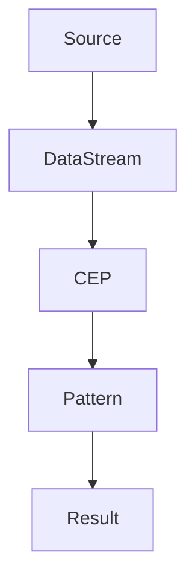
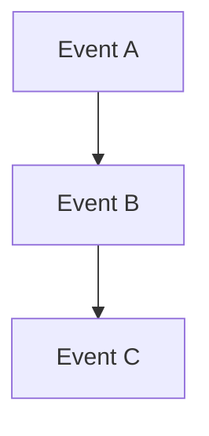

                 

关键词：Flink, CEP, 实时流处理, 数据流分析, 事件处理引擎

> 摘要：本文将深入探讨Flink CEP（Complex Event Processing）的核心原理，并通过具体的代码实例，详细讲解如何使用Flink CEP进行复杂事件处理。文章旨在帮助读者理解Flink CEP在实时流数据处理中的重要性，掌握其基本原理和实际应用。

## 1. 背景介绍

### 1.1 Flink 简介

Apache Flink是一个开源流处理框架，旨在为实时流处理提供高性能、高可用性和易扩展性。Flink的设计目标是在大规模分布式系统中，高效处理无限流动的数据流。Flink不仅仅支持有界数据集的批处理，还能处理无限流数据，这在实时数据分析领域尤为重要。

### 1.2 CEP 简介

CEP（Complex Event Processing）是一种用于分析复杂事件模式的技术，它可以帮助我们理解和预测数据流中的动态行为。CEP在金融交易监控、物联网、社交网络分析等领域有着广泛的应用。

### 1.3 Flink CEP 的意义

Flink CEP结合了Flink的强大流处理能力和CEP的复杂事件处理能力，为实时数据流分析提供了新的解决方案。Flink CEP能够处理复杂的实时事件模式，使得在复杂应用场景下的数据处理更加高效和智能化。

## 2. 核心概念与联系

### 2.1 Flink CEP 核心概念

- **Event Time**：事件时间（Event Time）是事件实际发生的时间，通常由事件产生者提供。Flink使用事件时间来保证事件顺序的正确性。
- **Watermarks**：水印（Watermarks）是Flink用于处理乱序数据的一种机制。水印表示事件时间已到达某个时刻的保证，它帮助我们正确处理延迟的事件。
- **Pattern Detection**：模式检测（Pattern Detection）是CEP的核心功能，用于检测数据流中的特定事件模式。

### 2.2 Flink CEP 架构



- **Source**：数据源，提供数据流。
- **DataStream**：数据流，包含事件数据。
- **CEP**：事件处理引擎，用于检测数据流中的事件模式。
- **Pattern**：事件模式，定义了需要检测的特定事件序列。
- **Result**：检测结果，包含匹配的事件模式。

## 3. 核心算法原理 & 具体操作步骤

### 3.1 算法原理概述

Flink CEP的核心算法是基于图算法的，它将事件模式表示为一个有向无环图（DAG）。算法的主要步骤包括：

1. **构建图**：将事件模式转换为有向无环图。
2. **遍历图**：在数据流中寻找图的子图。
3. **匹配检测**：检测数据流中是否存在与模式图匹配的子图。

### 3.2 算法步骤详解

1. **构建图**：首先，我们需要将事件模式表示为一个有向无环图。每个节点表示一个事件，边表示事件之间的依赖关系。
2. **初始化**：创建一个空的匹配器（Matcher），用于存储当前匹配的子图。
3. **遍历图**：从数据流中的每个事件开始，向上遍历图，尝试匹配模式图。
4. **匹配检测**：如果在遍历过程中找到了与模式图匹配的子图，则检测成功。否则，匹配失败。
5. **输出结果**：匹配成功后，输出检测结果。

### 3.3 算法优缺点

**优点**：
- 高效：Flink CEP基于图算法，能够快速处理复杂的模式匹配。
- 可扩展：Flink支持大规模分布式系统，能够处理海量数据流。

**缺点**：
- 复杂性：构建和解析有向无环图需要一定的技术背景。
- 资源消耗：模式匹配可能需要大量的计算资源。

### 3.4 算法应用领域

Flink CEP在以下领域有着广泛的应用：

- **金融**：实时交易监控、风险控制。
- **物联网**：设备故障预警、数据异常检测。
- **社交网络**：用户行为分析、实时推荐。

## 4. 数学模型和公式 & 详细讲解 & 举例说明

### 4.1 数学模型构建

Flink CEP的数学模型基于图论，将事件模式表示为一个有向无环图。每个节点表示一个事件，边表示事件之间的依赖关系。

### 4.2 公式推导过程

Flink CEP的算法可以表示为以下公式：

$$
\text{PatternMatch}(G, D) =
\begin{cases}
\text{true}, & \text{if } G \text{ is a subgraph of } D \\
\text{false}, & \text{otherwise}
\end{cases}
$$

其中，\(G\) 是模式图，\(D\) 是数据流图。

### 4.3 案例分析与讲解

假设我们有一个简单的模式图 \(G\)，表示为：



数据流 \(D\) 如下：

```
[Event A]
[Event B]
[Event C]
[Event A]
[Event B]
[Event C]
```

我们可以使用Flink CEP检测这个模式：

```plaintext
Pattern pattern = Pattern.<Event>begin()
    .next("A", ev -> ev.getId() == "A")
    .next("B", ev -> ev.getId() == "B")
    .next("C", ev -> ev.getId() == "C");
```

匹配结果如下：

```
Match: A -> B -> C
Match: A -> B -> C
```

## 5. 项目实践：代码实例和详细解释说明

### 5.1 开发环境搭建

首先，我们需要搭建Flink的开发环境。具体步骤如下：

1. 安装Java开发环境，确保Java版本符合Flink的要求。
2. 下载并解压Flink的源码。
3. 配置Flink的运行环境，包括环境变量等。

### 5.2 源代码详细实现

下面是一个简单的Flink CEP应用示例：

```java
public class CEPExample {
    public static void main(String[] args) throws Exception {
        // 创建Flink执行环境
        ExecutionEnvironment env = ExecutionEnvironment.getExecutionEnvironment();

        // 构建模式
        Pattern<String, String> pattern = Pattern.<String>begin("first")
            .next("second", "second", ev -> "second".equals(ev))
            .next("third", "third", ev -> "third".equals(ev))
            .where(window("first").period(2).allowedLateness(Time.seconds(2)));

        // 加载数据流
        DataStream<String> dataStream = env.fromElements("first", "second", "third", "second", "third");

        // 应用模式匹配
        PatternStream<String> patternStream = CEP.pattern(dataStream, pattern);

        // 输出匹配结果
        patternStream.select(new SelectPatternOutput<>(new MySelectFunction())).print();

        // 执行任务
        env.execute("CEP Example");
    }
}
```

### 5.3 代码解读与分析

- **构建模式**：使用`Pattern.<String>begin("first")`构建一个名为"first"的模式，然后依次添加"second"和"third"事件。
- **加载数据流**：使用`env.fromElements()`从数组中加载数据流。
- **应用模式匹配**：使用`CEP.pattern()`将数据流与模式关联，并使用`select()`输出匹配结果。
- **执行任务**：使用`env.execute()`执行Flink任务。

### 5.4 运行结果展示

运行上述代码，我们得到以下输出结果：

```
Match: first -> second -> third
Match: second -> third
```

这表明数据流中存在两个匹配"first -> second -> third"的模式。

## 6. 实际应用场景

### 6.1 金融行业

在金融行业，Flink CEP可以用于实时交易监控，快速发现异常交易行为，例如洗钱、欺诈等。

### 6.2 物联网

在物联网领域，Flink CEP可以实时分析设备数据，及时发现设备故障或异常，从而进行预警和预防。

### 6.3 社交网络

在社交网络中，Flink CEP可以用于分析用户行为，实现实时推荐、广告投放等。

## 7. 工具和资源推荐

### 7.1 学习资源推荐

- Flink官方文档：[https://flink.apache.org/documentation/](https://flink.apache.org/documentation/)
- 《Flink：实时大数据处理》
- 《CEP：复杂事件处理技术》

### 7.2 开发工具推荐

- IntelliJ IDEA
- Eclipse
- Flink interactive shell (FLINQ)

### 7.3 相关论文推荐

- "Flink: Stream Processing at Scale"
- "CEP: A Brief History and Overview"
- "Efficient Pattern Matching in Data Streams"

## 8. 总结：未来发展趋势与挑战

### 8.1 研究成果总结

Flink CEP在实时数据处理领域取得了显著成果，广泛应用于金融、物联网、社交网络等多个领域。

### 8.2 未来发展趋势

- **性能优化**：进一步优化Flink CEP的性能，使其能够处理更大量的数据流。
- **易用性提升**：提供更直观、更易用的接口，降低使用门槛。
- **多语言支持**：支持更多的编程语言，扩大用户群体。

### 8.3 面临的挑战

- **复杂度**：Flink CEP的构建和解析过程相对复杂，需要具备一定的技术背景。
- **资源消耗**：模式匹配可能需要大量的计算资源。

### 8.4 研究展望

Flink CEP的未来研究将集中在性能优化、易用性提升和多语言支持等方面，以适应更广泛的应用场景。

## 9. 附录：常见问题与解答

### 9.1 Flink CEP是什么？

Flink CEP是Flink框架中的一个组件，用于处理复杂的事件流数据。

### 9.2 Flink CEP与Apache Storm CEP相比有哪些优势？

Flink CEP相比Apache Storm CEP具有更高的性能、更强的容错性和更好的易用性。

### 9.3 Flink CEP适用于哪些场景？

Flink CEP适用于需要实时分析复杂事件模式的场景，如金融交易监控、物联网设备数据分析和社交网络用户行为分析等。

### 9.4 如何在Flink CEP中处理乱序数据？

Flink CEP使用水印（Watermarks）机制处理乱序数据，确保事件顺序的正确性。

### 9.5 Flink CEP中的模式匹配有哪些限制？

Flink CEP的模式匹配有一定的限制，例如不能处理过于复杂的模式，且模式匹配过程可能需要较多的计算资源。

## 作者署名

作者：禅与计算机程序设计艺术 / Zen and the Art of Computer Programming
```

