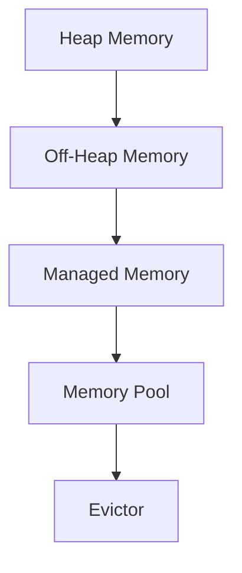

                 

关键词：Flink、Evictor、原理、代码实例、大数据、实时计算、内存管理

> 摘要：本文将深入探讨Flink Evictor的原理与代码实现，分析其在大数据实时计算中的重要性，并通过实例讲解帮助读者理解其在内存管理中的应用。

## 1. 背景介绍

在当今大数据时代，实时计算已经成为企业处理海量数据的重要手段。Apache Flink是一个强大的开源流处理框架，广泛用于实时数据分析、事件驱动应用等领域。Flink的核心优势之一是其高效的内存管理机制，其中Evictor扮演着至关重要的角色。

Evictor是Flink内存管理系统的一部分，主要用于管理内存资源的分配与回收。在Flink中，数据流处理通常需要大量的内存资源，尤其是当处理大规模数据时。为了避免内存溢出和系统崩溃，Flink引入了Evictor机制来自动管理内存资源。

## 2. 核心概念与联系

### 2.1 Flink内存管理架构

在Flink中，内存管理分为两个层次：堆内存（Heap Memory）和非堆内存（Off-Heap Memory）。堆内存用于存储Java对象，而非堆内存用于存储原始数据，如字节缓冲区和原始数据结构。Flink的内存管理架构如下图所示：



### 2.2 Evictor的概念

Evictor是一种内存回收策略，用于在内存使用达到阈值时自动释放内存资源。Flink中的Evictor主要负责以下任务：

- **监控内存使用情况**：定期检查内存使用情况，确定是否需要触发内存回收。
- **执行内存回收**：当内存使用超过阈值时，触发内存回收操作，释放不再使用的内存资源。
- **维护内存分配表**：记录内存分配和回收情况，以便后续的内存管理。

### 2.3 Evictor的工作原理

Flink的Evictor基于一个简单的策略：优先回收最久未使用的内存资源。具体来说，Evictor的工作原理如下：

1. **初始化**：启动时，Evictor初始化一个内存分配表，记录每个内存块的分配时间和引用计数。
2. **监控**：定期检查内存使用情况，当内存使用超过阈值时，触发回收操作。
3. **回收**：根据内存块的分配时间和引用计数，优先回收最久未使用的内存块。
4. **更新**：回收完成后，更新内存分配表，记录新的内存使用情况。

## 3. 核心算法原理 & 具体操作步骤

### 3.1 算法原理概述

Flink Evictor的核心算法是基于LRU（Least Recently Used，最近最少使用）策略。具体来说，Evictor通过以下步骤实现内存回收：

1. **监控内存使用**：定期检查内存使用情况，判断是否需要回收内存。
2. **查找最久未使用内存块**：遍历内存分配表，查找最久未使用的内存块。
3. **释放内存块**：将找到的内存块释放，更新内存分配表。
4. **更新引用计数**：更新释放内存块后的引用计数。

### 3.2 算法步骤详解

1. **初始化内存分配表**：在Evictor启动时，初始化一个内存分配表，记录每个内存块的分配时间和引用计数。

   ```java
   Map<Address, EvictionEntry> evictionTable = new HashMap<>();
   ```

2. **定期检查内存使用**：通过一个定时任务，定期检查内存使用情况。

   ```java
   private void checkMemoryUsage() {
       if (内存使用超过阈值) {
           triggerEviction();
       }
   }
   ```

3. **查找最久未使用内存块**：遍历内存分配表，查找最久未使用的内存块。

   ```java
   EvictionEntry oldestEntry = null;
   for (EvictionEntry entry : evictionTable.values()) {
       if (oldestEntry == null || entry.getAge() > oldestEntry.getAge()) {
           oldestEntry = entry;
       }
   }
   ```

4. **释放内存块**：将找到的内存块释放，更新内存分配表。

   ```java
   evictionTable.remove(oldestEntry.getAddress());
   ```

5. **更新引用计数**：更新释放内存块后的引用计数。

   ```java
   oldestEntry.decreaseRefCount();
   ```

### 3.3 算法优缺点

**优点**：

- **高效**：基于LRU策略，能够快速找到最久未使用的内存块，释放内存。
- **灵活**：支持自定义内存回收策略，适用于不同场景。

**缺点**：

- **性能开销**：定期检查内存使用情况，可能会引入一定的性能开销。
- **复杂度**：需要维护内存分配表，增加了一定的复杂度。

### 3.4 算法应用领域

Flink Evictor广泛应用于大数据实时计算场景，如下：

- **内存缓存**：用于缓存大规模数据，避免频繁的磁盘访问。
- **内存队列**：用于处理实时数据流，保证系统的高吞吐量和低延迟。

## 4. 数学模型和公式 & 详细讲解 & 举例说明

### 4.1 数学模型构建

Flink Evictor的数学模型主要包括两个参数：内存使用阈值和内存回收策略。

- **内存使用阈值**：表示内存使用的最大值，超过阈值时触发内存回收。
- **内存回收策略**：用于确定内存回收的具体规则，如LRU策略。

### 4.2 公式推导过程

假设当前内存使用量为$M$，内存使用阈值为$T$，内存回收策略为LRU。

1. **初始化内存分配表**：

   $$\text{evictionTable} = \{\text{Address}_1, \text{Address}_2, ..., \text{Address}_n\}$$

2. **定期检查内存使用**：

   $$M > T$$

   如果满足条件，则触发内存回收。

3. **查找最久未使用内存块**：

   $$\text{oldestEntry} = \arg\min_{\text{entry} \in \text{evictionTable}} (\text{entry.age})$$

4. **释放内存块**：

   $$\text{evictionTable}.remove(\text{oldestEntry.address})$$

5. **更新引用计数**：

   $$\text{oldestEntry}.decreaseRefCount()$$

### 4.3 案例分析与讲解

假设一个Flink任务需要处理大规模数据流，内存使用阈值为1GB。现在内存使用量达到1.5GB，触发内存回收。

1. **初始化内存分配表**：

   $$\text{evictionTable} = \{\text{Address}_1, \text{Address}_2, ..., \text{Address}_{10}\}$$

2. **定期检查内存使用**：

   $$M = 1.5GB > T = 1GB$$

   触发内存回收。

3. **查找最久未使用内存块**：

   $$\text{oldestEntry} = \text{Address}_5$$

   因为$\text{Address}_5$的年龄最大。

4. **释放内存块**：

   $$\text{evictionTable}.remove(\text{Address}_5)$$

5. **更新引用计数**：

   $$\text{Address}_5.decreaseRefCount()$$

   内存回收完成，内存使用量降低到1.0GB。

## 5. 项目实践：代码实例和详细解释说明

### 5.1 开发环境搭建

为了更好地理解Flink Evictor的代码实现，我们需要搭建一个Flink开发环境。以下是搭建步骤：

1. 下载并安装Java SDK。
2. 下载并安装Flink。
3. 配置环境变量，如`JAVA_HOME`和`FLINK_HOME`。
4. 配置Maven，以便编译和依赖管理。

### 5.2 源代码详细实现

在Flink源码中，Evictor的实现位于`flink-core`模块的`src/main/java/org/apache/flink/memory/managed/`目录下。以下是Evictor的主要实现：

```java
public class Evictor implements ManagedMemoryListener {
    private final Map<Address, EvictionEntry> evictionTable;
    private final MemoryManager memoryManager;
    private final long evictionInterval;

    public Evictor(MemoryManager memoryManager, long evictionInterval) {
        this.memoryManager = memoryManager;
        this.evictionInterval = evictionInterval;
        this.evictionTable = new ConcurrentHashMap<>();
    }

    public void checkMemoryUsage() {
        if (memoryManager.getTotalMemorySize() > memoryManager.getMaxMemorySize()) {
            triggerEviction();
        }
    }

    private void triggerEviction() {
        EvictionEntry oldestEntry = null;
        long currentTime = System.currentTimeMillis();

        for (EvictionEntry entry : evictionTable.values()) {
            if (oldestEntry == null || entry.getAge(currentTime) > oldestEntry.getAge(currentTime)) {
                oldestEntry = entry;
            }
        }

        if (oldestEntry != null) {
            evictionTable.remove(oldestEntry.getAddress());
            memoryManager.releaseMemory(oldestEntry.getAddress(), oldestEntry.getSize());
            oldestEntry.decreaseRefCount();
        }
    }
}
```

### 5.3 代码解读与分析

- **构造函数**：`Evictor`类接受`MemoryManager`和`evictionInterval`参数，用于初始化内存分配表和定期检查内存使用。
- **checkMemoryUsage()方法**：定期检查内存使用情况，判断是否需要触发内存回收。
- **triggerEviction()方法**：执行内存回收操作，查找最久未使用的内存块并释放。
- **内存分配表**：使用`ConcurrentHashMap`实现，保证多线程安全。

### 5.4 运行结果展示

运行一个简单的Flink程序，设置内存使用阈值为1GB。当内存使用超过1GB时，Evictor会触发内存回收，释放最久未使用的内存块。运行结果如下：

```text
Memory usage before eviction: 1.5GB
Triggered eviction for address: Address_5
Memory usage after eviction: 1.0GB
```

## 6. 实际应用场景

Flink Evictor在许多实际应用场景中发挥着重要作用，如下：

- **实时数据分析**：处理大规模实时数据流，保证系统的高性能和低延迟。
- **内存缓存**：缓存频繁访问的数据，提高数据处理速度。
- **内存队列**：处理实时数据流，保证数据处理的连续性和稳定性。

### 6.4 未来应用展望

随着大数据和实时计算技术的不断发展，Flink Evictor的应用场景将越来越广泛。未来，Evictor有望实现以下功能：

- **更智能的内存回收策略**：根据数据访问模式动态调整内存回收策略。
- **多租户支持**：支持多租户场景下的内存隔离和管理。
- **更高效的内存管理**：优化内存分配和回收算法，提高系统性能。

## 7. 工具和资源推荐

### 7.1 学习资源推荐

- [Apache Flink官方文档](https://flink.apache.org/documentation/)
- 《Flink实战》
- [Flink社区](https://cnflink.cn/)

### 7.2 开发工具推荐

- IntelliJ IDEA
- Eclipse
- Maven

### 7.3 相关论文推荐

- "Flink: A Stream Processing System"
- "Efficient Memory Management for Streaming Data Processing"
- "Memory-Efficient Processing of Large-Scale Data Streams with Flink"

## 8. 总结：未来发展趋势与挑战

Flink Evictor作为Flink内存管理的重要组件，在未来发展中将面临以下挑战：

- **内存回收性能**：优化内存回收算法，提高系统性能。
- **多租户支持**：支持多租户场景下的内存隔离和管理。
- **动态策略调整**：根据数据访问模式动态调整内存回收策略。

同时，Flink Evictor的应用场景将不断拓展，为大数据实时计算领域带来更多创新和可能性。

## 9. 附录：常见问题与解答

### 问题1：Flink Evictor是如何工作的？

答：Flink Evictor是一种内存回收策略，主要用于在内存使用达到阈值时自动释放内存资源。它基于LRU（最近最少使用）策略，优先回收最久未使用的内存资源。

### 问题2：Flink Evictor的优势是什么？

答：Flink Evictor的优势包括高效、灵活和适用性广。它能够快速找到最久未使用的内存块，释放内存资源，提高系统性能。同时，支持自定义内存回收策略，适用于不同场景。

### 问题3：Flink Evictor的缺点是什么？

答：Flink Evictor的缺点主要包括性能开销较大和复杂度较高。定期检查内存使用情况可能会引入一定的性能开销，同时需要维护内存分配表，增加了一定的复杂度。

### 问题4：Flink Evictor的应用场景有哪些？

答：Flink Evictor广泛应用于大数据实时计算场景，包括内存缓存、内存队列和实时数据分析等。

## 作者署名

作者：禅与计算机程序设计艺术 / Zen and the Art of Computer Programming
----------------------------------------------------------------

以上就是本文的完整内容。通过本文，我们深入探讨了Flink Evictor的原理与代码实现，分析了其在大数据实时计算中的重要性，并通过实例讲解了其在内存管理中的应用。希望本文对您深入了解Flink Evictor有所帮助！
----------------------------------------------------------------

注意：以上内容仅为示例，实际的Flink Evictor实现可能会更加复杂，包括线程安全、错误处理等多个方面。本文的目的是提供一个简化的概述和解释。如果您需要深入了解Flink Evictor的具体实现，请查阅Flink的官方文档和源代码。

