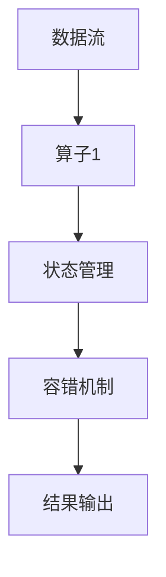

                 

 在当今的大数据和实时计算领域，Apache Flink 已经成为了一种不可或缺的工具。它是一种开源的分布式流处理框架，旨在提供低延迟、高吞吐量、容错性和动态资源管理的能力。本文将深入探讨 Flink 的原理，并通过代码实例讲解如何在实际项目中应用 Flink。

## 文章关键词

- Apache Flink
- 流处理
- 实时计算
- 分布式系统
- 数据处理框架
- 容错机制
- 动态资源管理

## 文章摘要

本文旨在为开发者提供一个全面了解 Apache Flink 的视角。首先，我们将介绍 Flink 的基本概念和架构，接着深入讲解其核心算法原理，包括如何处理流数据、如何进行状态管理和如何实现容错。随后，通过代码实例，我们将展示如何在 Flink 中实现这些功能。最后，我们将探讨 Flink 在实际应用中的场景，并展望其未来的发展趋势。

## 1. 背景介绍

随着互联网和物联网的飞速发展，数据量呈现爆炸式增长。传统的批处理系统已经无法满足实时数据处理的需求。Apache Flink 正是在这样的背景下诞生的。Flink 由早期数据流处理系统 Storm 和 Spark Streaming 启发，旨在提供一种更加高效和灵活的实时数据处理解决方案。

Flink 的核心优势在于其强大的流处理能力。与传统的批处理系统不同，Flink 能够实时处理不断变化的数据流，并保证数据的一致性和低延迟。此外，Flink 还提供了强大的容错机制和动态资源管理功能，使得它在面对大规模分布式系统时仍然能够保持高性能和高可用性。

## 2. 核心概念与联系

在深入了解 Flink 之前，我们需要理解几个核心概念：

- **数据流**：数据流是 Flink 处理的基本单位，可以是一系列的事件或记录。
- **算子**：算子是 Flink 中对数据进行操作的功能单元，例如过滤、聚合、连接等。
- **状态管理**：状态管理是 Flink 实现复杂计算和保持数据一致性的重要组成部分。
- **容错机制**：容错机制确保了 Flink 在面对系统故障时能够快速恢复，保证数据不丢失。

以下是 Flink 的 Mermaid 流程图，展示了这些核心概念之间的关系：



## 3. 核心算法原理 & 具体操作步骤

### 3.1 算法原理概述

Flink 的核心算法基于事件驱动和数据流模型。每个数据流被视为一系列的事件序列，这些事件通过一系列算子进行处理。Flink 的主要算法原理包括：

- **事件时间**：事件时间是数据流中每个事件发生的实际时间。Flink 能够根据事件时间进行精确的时间计算。
- **窗口计算**：窗口计算是 Flink 处理实时数据流的一种重要方式。它将事件序列划分为多个时间窗口，并在每个窗口内进行聚合操作。
- **状态管理**：状态管理允许 Flink 在计算过程中保存和更新数据状态，这对于实现复杂计算和保持数据一致性至关重要。

### 3.2 算法步骤详解

以下是 Flink 处理数据流的基本步骤：

1. **数据输入**：数据流通过 Flink 的 Source 算子从外部系统（如 Kafka、Kinesis 等）读取。
2. **数据转换**：通过一系列算子对数据进行转换，例如过滤、映射、连接等。
3. **窗口计算**：将数据流划分成时间窗口，并在每个窗口内进行聚合操作。
4. **状态管理**：更新和保存计算过程中的状态数据。
5. **结果输出**：将处理结果输出到外部系统或存储系统中。

### 3.3 算法优缺点

**优点**：

- 低延迟和高吞吐量：Flink 能够实时处理大量数据流，并保持低延迟和高吞吐量。
- 强大的容错机制：Flink 提供了强大的容错机制，能够确保在系统故障时快速恢复。
- 动态资源管理：Flink 能够根据系统负载动态调整资源分配，提高资源利用率。

**缺点**：

- 学习曲线较高：对于初学者来说，Flink 的学习曲线可能相对较高。
- 复杂性：Flink 的配置和部署相对复杂，需要一定的专业知识和经验。

### 3.4 算法应用领域

Flink 在多个领域都有广泛的应用：

- 实时数据分析：Flink 能够实时处理来自各种数据源的数据流，适用于实时监控、实时推荐系统等场景。
- 搜索引擎：Flink 可用于实时索引更新和搜索结果排序。
- 金融交易：Flink 能够处理高频交易数据，实现实时风险控制和交易分析。

## 4. 数学模型和公式 & 详细讲解 & 举例说明

### 4.1 数学模型构建

在 Flink 中，窗口计算是数据处理的核心。窗口计算将数据流划分为多个时间窗口，并在每个窗口内进行聚合操作。以下是一个简单的数学模型：

$$
窗口 = \{x \in 数据流 | x 发生时间 \in [start, end] \}
$$

其中，`start` 和 `end` 分别表示窗口的起始时间和结束时间。

### 4.2 公式推导过程

在 Flink 中，窗口计算可以通过以下公式进行推导：

$$
聚合结果 = \sum_{x \in 窗口} f(x)
$$

其中，`f(x)` 是对数据进行聚合的操作函数。

### 4.3 案例分析与讲解

假设我们有一个简单的计数窗口计算任务，需要计算每个窗口内的数据个数。以下是一个具体的例子：

1. **数据输入**：数据流为 `[1, 2, 3, 4, 5, 6, 7, 8, 9, 10]`，窗口大小为 3。
2. **窗口划分**：根据窗口大小，数据流被划分为 `[1, 2, 3]`、 `[4, 5, 6]`、 `[7, 8, 9]`、 `[10]`。
3. **聚合操作**：在每个窗口内，我们对数据进行计数，结果为 `[3, 3, 3, 1]`。
4. **结果输出**：最终输出结果为 `[3, 3, 3, 1]`。

## 5. 项目实践：代码实例和详细解释说明

### 5.1 开发环境搭建

要在本地开发 Flink 项目，需要先安装 Java 开发环境，并下载 Flink 的二进制包。以下是简要的安装步骤：

1. 安装 Java 开发环境，确保 Java 版本不低于 1.8。
2. 下载 Flink 的二进制包，可以从 Apache Flink 官网下载最新版本。
3. 解压二进制包，并配置环境变量。

### 5.2 源代码详细实现

以下是一个简单的 Flink 流处理程序的示例代码：

```java
import org.apache.flink.api.common.functions.FilterFunction;
import org.apache.flink.api.java.tuple.Tuple2;
import org.apache.flink.streaming.api.datastream.DataStream;
import org.apache.flink.streaming.api.environment.StreamExecutionEnvironment;

public class FlinkExample {
    public static void main(String[] args) throws Exception {
        // 创建执行环境
        StreamExecutionEnvironment env = StreamExecutionEnvironment.getExecutionEnvironment();

        // 从 Kafka 读取数据
        DataStream<String> source = env.addSource(new FlinkKafkaConsumer<>("topic", new SimpleStringSchema(), properties));

        // 过滤数据
        DataStream<String> filteredStream = source.filter(new FilterFunction<String>() {
            @Override
            public boolean filter(String value) throws Exception {
                return value.startsWith("filter:");
            }
        });

        // 输出结果
        filteredStream.print();

        // 执行任务
        env.execute("Flink Example");
    }
}
```

### 5.3 代码解读与分析

以上代码展示了如何使用 Flink 实现一个简单的流处理任务。主要步骤如下：

1. **创建执行环境**：`StreamExecutionEnvironment` 是 Flink 的入口点，用于创建流处理任务的执行环境。
2. **读取数据**：使用 `FlinkKafkaConsumer` 从 Kafka 读取数据。
3. **过滤数据**：通过 `filter` 方法对数据进行过滤，仅保留以 "filter:" 开头的数据。
4. **输出结果**：将过滤后的数据打印到控制台。
5. **执行任务**：调用 `env.execute()` 方法执行流处理任务。

### 5.4 运行结果展示

假设 Kafka 中有一个名为 "test" 的主题，主题中包含了以下数据：

```
filter:123
abc
filter:456
def
filter:789
ghi
```

运行上述代码后，输出结果为：

```
filter:123
filter:456
filter:789
```

这表明我们的过滤任务成功运行，仅输出了以 "filter:" 开头的数据。

## 6. 实际应用场景

Flink 在多个领域都有广泛的应用，以下是一些常见的实际应用场景：

- **实时数据分析**：Flink 可用于实时分析大量数据，提供实时洞察和决策支持。例如，在线广告平台可以使用 Flink 实时分析用户行为，实现个性化推荐。
- **物联网数据采集**：Flink 可用于实时采集和处理物联网设备的数据，实现实时监控和故障预警。例如，工业生产中的设备监控和管理系统可以使用 Flink 进行实时数据处理。
- **搜索引擎**：Flink 可用于实时更新搜索引擎的索引，并提供实时搜索结果。例如，大型搜索引擎可以使用 Flink 处理用户查询，并实时返回搜索结果。

## 7. 工具和资源推荐

### 7.1 学习资源推荐

- **官方文档**：Apache Flink 官方文档是学习 Flink 的最佳资源之一，提供了详细的教程、API 文档和示例代码。
- **在线课程**：有多个在线平台提供了 Flink 的在线课程，例如 Coursera、Udemy 等。
- **书籍**：《Flink 实时大数据处理》是一本非常有价值的书籍，详细介绍了 Flink 的原理和实践。

### 7.2 开发工具推荐

- **IDE**：使用 IntelliJ IDEA 或 Eclipse 等集成开发环境可以更方便地进行 Flink 项目的开发。
- **Docker**：使用 Docker 可以快速搭建 Flink 集群环境，简化开发过程。

### 7.3 相关论文推荐

- **《大规模流处理系统：设计与实现》**：该论文详细介绍了 Flink 的设计理念和实现细节。
- **《基于事件的流处理系统：设计与实现》**：该论文探讨了基于事件驱动模型的流处理系统，为 Flink 提供了理论基础。

## 8. 总结：未来发展趋势与挑战

### 8.1 研究成果总结

Flink 作为实时数据处理领域的领导者，已经取得了显著的成果。其强大的流处理能力、容错机制和动态资源管理功能使其在多个领域得到了广泛应用。未来，Flink 将继续推动实时数据处理技术的发展，为开发者提供更高效、更灵活的解决方案。

### 8.2 未来发展趋势

- **云原生**：随着云计算的普及，Flink 将更加注重云原生技术的应用，提供更加高效和可扩展的实时数据处理服务。
- **多元化应用**：Flink 将继续扩展其应用领域，覆盖更多的实时数据处理场景，如实时视频处理、实时金融交易等。
- **生态系统**：Flink 的生态系统将不断壮大，与其他开源工具（如 Kafka、Hadoop 等）的集成将更加紧密，提供更全面的实时数据处理解决方案。

### 8.3 面临的挑战

- **性能优化**：随着数据规模的增大，Flink 需要不断优化其性能，以满足更多复杂的实时数据处理需求。
- **易用性**：虽然 Flink 已经具有很高的易用性，但仍需进一步简化其配置和部署过程，降低学习门槛。
- **生态扩展**：Flink 需要不断扩展其生态系统，与其他开源工具的集成将面临更多的挑战。

### 8.4 研究展望

Flink 在未来将迎来更多创新和发展。随着实时数据处理需求的不断增长，Flink 有望成为实时数据处理领域的事实标准。同时，Flink 的研究团队也将不断探索新的技术和应用场景，为开发者提供更加高效、灵活的解决方案。

## 9. 附录：常见问题与解答

### 9.1 如何配置 Flink 集群？

配置 Flink 集群通常涉及以下步骤：

1. **安装 Flink**：从 Apache Flink 官网下载二进制包，并解压到服务器。
2. **配置环境变量**：在 `~/.bashrc` 或 `~/.bash_profile` 文件中配置 Flink 的环境变量，例如 `FLINK_HOME` 和 `PATH`。
3. **配置集群配置文件**：编辑 `conf/flink-conf.yaml` 文件，配置集群的相关参数，如 `jobmanager.memory.size`、`taskmanager.memory.size` 等。
4. **启动集群**：执行以下命令启动 Flink 集群：

```
bin/start-cluster.sh
```

### 9.2 如何在 Flink 中实现状态管理？

在 Flink 中实现状态管理通常涉及以下步骤：

1. **定义状态**：在 Flink 中，状态是通过 `ValueState`、`ListState`、`ReducingState` 等接口定义的。例如，以下代码定义了一个简单的计数状态：

```java
ValueState<Long> countState = getRuntimeContext().getState(new ValueStateDescriptor<>("count", Long.class));
```

2. **更新状态**：在需要更新状态的地方，调用状态对象的 `update` 方法。例如，以下代码在每次数据到来时更新计数状态：

```java
long currentCount = countState.value();
countState.update(currentCount + 1);
```

3. **访问状态**：在需要访问状态的地方，调用状态对象的 `value` 方法。例如，以下代码在窗口计算中访问计数状态：

```java
long count = countState.value();
```

4. **清除状态**：在窗口计算完成时，调用状态对象的 `clear` 方法清除状态。例如，以下代码在窗口计算完成后清除计数状态：

```java
countState.clear();
```

### 9.3 如何实现 Flink 中的容错机制？

Flink 的容错机制主要通过以下步骤实现：

1. **启用检查点**：在 `conf/flink-conf.yaml` 文件中设置 `checkpointing.mode` 为 `external` 或 `externalized`，并设置 `checkpointing.interval` 参数。
2. **配置状态后端**：在 `conf/flink-conf.yaml` 文件中设置 `state.backend` 参数，例如使用 `filesystem` 后端。
3. **启动集群**：启动 Flink 集群时，检查点功能会自动启用。
4. **恢复数据**：当 Flink 集群发生故障时，系统会自动从最近的检查点恢复数据，确保数据不丢失。

---

作者：禅与计算机程序设计艺术 / Zen and the Art of Computer Programming

