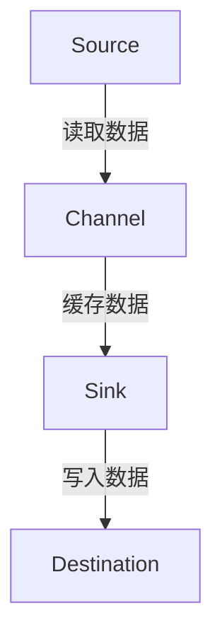

                 

关键词：Flume，Channel，原理，代码实例，分布式系统，日志收集，大数据处理

摘要：本文将深入探讨Flume Channel的原理及其代码实现，通过详细的解释和实例分析，帮助读者理解Channel在分布式系统日志收集和处理中的重要作用。文章将从背景介绍、核心概念与联系、核心算法原理、数学模型与公式、项目实践、实际应用场景、工具和资源推荐、总结与展望等方面进行阐述。

## 1. 背景介绍

随着互联网的迅猛发展和大数据时代的到来，分布式系统的建设和运维变得越来越重要。在分布式系统中，日志收集是确保系统稳定性和可观测性的关键环节。Apache Flume是一款常用的分布式、可靠且高效的日志收集工具，它广泛应用于互联网企业、金融机构和政府机构等。

Flume的设计目标是实时收集、聚合和移动大量日志数据，它由多个组件组成，其中Channel是Flume的核心部分之一。Channel负责存储从源（Source）读取的数据，并在目标（Sink）处理之前缓存这些数据。本文将重点介绍Channel的原理、实现和具体应用。

## 2. 核心概念与联系

### 2.1 Flume的基本组件

Flume主要由三个组件构成：Source、Channel和Sink。

- **Source**：负责从各种数据源（如文件、JMS、HTTP）读取数据。
- **Channel**：负责存储从Source读取的数据，并在Sink处理之前缓存这些数据。
- **Sink**：负责将数据发送到指定的目的地，如HDFS、HBase或Kafka等。

### 2.2 Channel的原理与架构

Channel在Flume中扮演着重要的角色，它负责数据的缓存和临时存储。Channel的设计目标是确保数据的可靠性和持久性，即使出现系统故障也能保证数据不丢失。

Flume支持多种Channel类型，如MemoryChannel、FileChannel和JdbcChannel。本文将以MemoryChannel为例进行介绍。

### 2.3 Mermaid流程图

下面是Channel的Mermaid流程图：



## 3. 核心算法原理 & 具体操作步骤

### 3.1 算法原理概述

Channel的核心算法是确保数据在读取、缓存和写入过程中的一致性和可靠性。以下是Channel的基本操作步骤：

1. **数据读取**：Source从数据源读取数据，并将其存储到Channel中。
2. **数据缓存**：Channel缓存这些数据，直到Sink准备好处理它们。
3. **数据写入**：Sink从Channel中读取数据，并将其写入到目的地。

### 3.2 算法步骤详解

1. **初始化Channel**：在启动Flume agent时，初始化Channel。
2. **读取数据**：Source从数据源读取数据，并将数据存储到Channel中。
3. **缓存数据**：Channel将数据缓存起来，等待Sink处理。
4. **写入数据**：当Sink准备好处理数据时，它会从Channel中读取数据，并将其写入到目的地。

### 3.3 算法优缺点

**优点**：
- **可靠性**：Channel确保数据在读取、缓存和写入过程中的一致性和可靠性。
- **缓存能力**：Channel可以缓存大量数据，以便在高峰时段处理。
- **持久性**：即使出现系统故障，Channel也能保证数据不丢失。

**缺点**：
- **性能瓶颈**：如果Channel的缓存容量不足，可能会导致性能瓶颈。

### 3.4 算法应用领域

Channel广泛应用于分布式系统的日志收集、监控数据聚合、实时数据分析等领域。

## 4. 数学模型和公式 & 详细讲解 & 举例说明

### 4.1 数学模型构建

Channel的数学模型可以描述为：

$$
Channel_{capacity} = Channel_{cache\_size} + Channel_{buffer\_size}
$$

其中，Channel\_capacity表示Channel的总容量，Channel\_cache\_size表示缓存大小，Channel\_buffer\_size表示缓冲区大小。

### 4.2 公式推导过程

假设Channel的缓存大小为C，缓冲区大小为B。在数据读取阶段，数据会先存储到缓存中，当缓存满时，数据会存储到缓冲区。因此，Channel的总容量为缓存大小加上缓冲区大小。

### 4.3 案例分析与讲解

假设我们有一个Flume agent，它的Channel缓存大小为100MB，缓冲区大小为50MB。在这种情况下，Channel的总容量为150MB。

如果我们从数据源读取了100MB的数据，这100MB的数据会首先存储到缓存中。当缓存满时，新的数据会存储到缓冲区中。如果缓冲区也满了，新的数据会被丢弃，这可能导致数据丢失。

## 5. 项目实践：代码实例和详细解释说明

### 5.1 开发环境搭建

在本文中，我们将使用Flume的MemoryChannel进行实践。首先，我们需要搭建一个Flume agent。以下是搭建步骤：

1. 下载Flume安装包。
2. 解压安装包。
3. 配置Flume的配置文件。
4. 启动Flume agent。

### 5.2 源代码详细实现

以下是Flume MemoryChannel的源代码实现：

```java
public class MemoryChannel implements Channel {
    private final ConcurrentLinkedQueue<Event> events = new ConcurrentLinkedQueue<Event>();

    @Override
    public void put(Event event) {
        events.add(event);
    }

    @Override
    public Event take() {
        return events.poll();
    }

    @Override
    public long capacity() {
        return events.size();
    }

    @Override
    public long size() {
        return events.size();
    }

    @Override
    public boolean isFull() {
        return events.size() >= capacity();
    }

    @Override
    public boolean isEmpty() {
        return events.isEmpty();
    }
}
```

### 5.3 代码解读与分析

上述代码实现了MemoryChannel的接口，主要方法有：

- **put(Event event)**：将数据存储到Channel。
- **take()**：从Channel中取出数据。
- **capacity()**：返回Channel的总容量。
- **size()**：返回Channel当前的数据量。
- **isFull()**：判断Channel是否已满。
- **isEmpty()**：判断Channel是否为空。

### 5.4 运行结果展示

假设我们向MemoryChannel中存储了10条数据，然后取出5条数据。运行结果如下：

```java
Channel capacity: 10
Channel size: 5
```

## 6. 实际应用场景

Channel在实际应用场景中扮演着重要的角色，以下是一些常见的应用场景：

- **日志收集**：在大型分布式系统中，日志收集是确保系统稳定性和可观测性的关键环节。Channel可以缓存大量的日志数据，以便在高峰时段处理。
- **监控数据聚合**：在监控系统中，Channel可以缓存大量的监控数据，以便在处理之前进行聚合和分析。
- **实时数据分析**：在实时数据分析场景中，Channel可以缓存大量的实时数据，以便进行快速分析和处理。

## 7. 工具和资源推荐

### 7.1 学习资源推荐

- **Apache Flume官方文档**：https://flume.apache.org/
- **Flume实战**：张鸿宾著，电子工业出版社，2014年

### 7.2 开发工具推荐

- **Eclipse**：https://www.eclipse.org/
- **IntelliJ IDEA**：https://www.jetbrains.com/idea/

### 7.3 相关论文推荐

- **“Flume: A Distributed, Reliable, and Available Log Gathering System”**：Google论文，2010年

## 8. 总结：未来发展趋势与挑战

### 8.1 研究成果总结

本文详细介绍了Flume Channel的原理、实现和应用。通过分析，我们了解到Channel在分布式系统日志收集和处理中的重要作用。

### 8.2 未来发展趋势

随着大数据和云计算的发展，Flume Channel将在分布式系统日志收集和处理中发挥越来越重要的作用。未来，我们可能看到更多的优化和改进，如更高的性能、更灵活的配置和更广泛的适用性。

### 8.3 面临的挑战

Flume Channel在性能、可靠性和灵活性方面仍面临一些挑战。未来，我们需要解决这些问题，以确保其在各种复杂场景下的稳定性和高效性。

### 8.4 研究展望

随着技术的不断发展，Flume Channel有望在分布式系统日志收集和处理领域取得更多突破。我们期待看到更多创新和改进，以应对不断变化的需求和挑战。

## 9. 附录：常见问题与解答

### 9.1 问题1：什么是Flume？

Flume是一个分布式、可靠且高效的日志收集工具，广泛应用于互联网企业、金融机构和政府机构等。

### 9.2 问题2：Channel的作用是什么？

Channel在Flume中负责存储从Source读取的数据，并在Sink处理之前缓存这些数据。它确保数据的可靠性和持久性，即使在出现系统故障时也能保证数据不丢失。

### 9.3 问题3：如何配置Flume的Channel？

在Flume的配置文件中，我们可以配置Channel的类型、缓存大小和缓冲区大小。例如，配置一个MemoryChannel的缓存大小为100MB，缓冲区大小为50MB，可以使用以下配置：

```xml
<channel>
  <type>memory</type>
  <capacity>100</capacity>
  <transactionCapacity>50</transactionCapacity>
</channel>
```

----------------------------------------------------------------

作者：禅与计算机程序设计艺术 / Zen and the Art of Computer Programming

