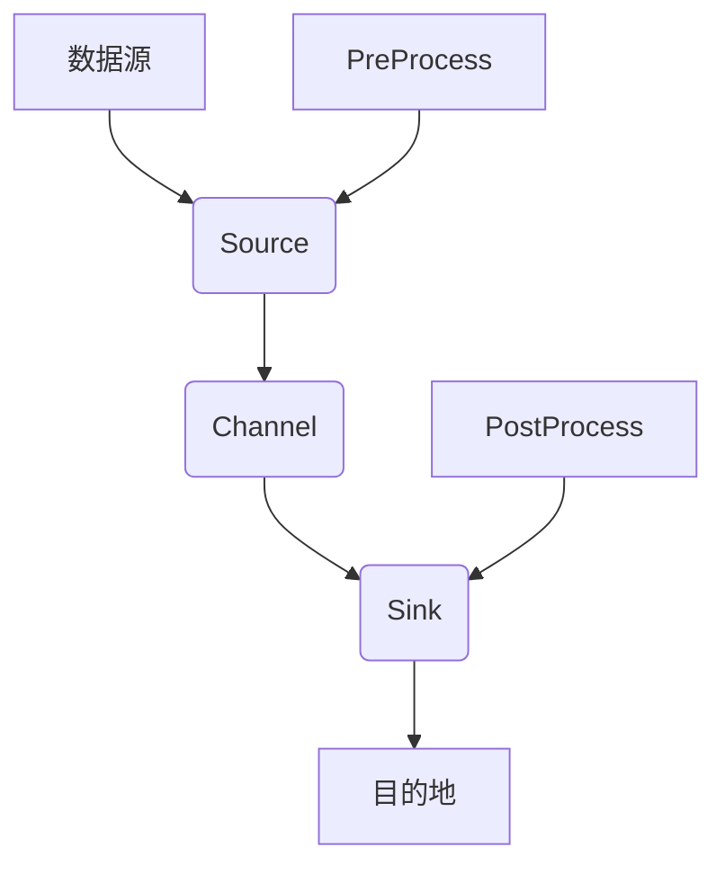

                 

 

## 1. 背景介绍

Flume是一种分布式、可靠且可用的服务，用于有效地收集、聚合和移动大量日志数据。它被广泛用于处理各种日志数据场景，例如网站服务器日志、应用服务器日志、消息队列日志等。Flume的主要目的是将各种来源的日志数据聚合到一个中心化的位置，以便进行后续的数据处理和分析。

在Flume的架构中，Interceptor是一个非常重要的组件。Interceptor的作用是在数据从源头传输到目的地之前，对数据进行预处理或者过滤。Interceptor可以用于实现多种功能，如数据清洗、数据转换、数据过滤等。

本文将详细介绍Flume Interceptor的原理和实现，并通过代码实例来展示Interceptor的具体应用。

## 2. 核心概念与联系

在介绍Interceptor的具体实现之前，我们需要了解一些与Interceptor相关的核心概念。

### 2.1. Flume的架构

Flume的架构主要包括以下几个组件：

1. **Agent**：Flume的基本工作单元，它由一个或者多个Source、Channel和Sink组成。
2. **Source**：负责从数据源读取数据，并将其传递到Channel中。
3. **Channel**：负责暂时存储从Source接收到的数据，直到Sink将数据发送到目的地。
4. **Sink**：负责将Channel中的数据发送到目的地，如HDFS、HBase等。

### 2.2. Interceptor

Interceptor是Flume中用于对数据进行预处理或者过滤的组件。Interceptor可以插在Flume的Source、Sink或者Channel中，根据放置的位置，Interceptor可以有不同的作用。

1. **Source Interceptor**：放置在Source中，主要用于过滤或者转换从数据源读取的数据。
2. **Sink Interceptor**：放置在Sink中，主要用于过滤或者转换从Channel中发送到目的地的数据。
3. **Channel Interceptor**：放置在Channel中，主要用于过滤或者转换Channel中的数据。

### 2.3. Interceptor的原理

Interceptor的核心原理是通过实现特定的接口，对数据进行预处理或者过滤。Interceptor的执行流程如下：

1. **PreProcess**：在数据被传递到Channel或者从Channel传递到Sink之前，Interceptor会执行PreProcess方法，对数据进行预处理。
2. **PostProcess**：在数据从Channel传递到Sink之后，Interceptor会执行PostProcess方法，对数据进行后处理。

### 2.4. Interceptor的Mermaid流程图

下面是Interceptor的Mermaid流程图，用于展示Interceptor的执行流程和作用：



## 3. 核心算法原理 & 具体操作步骤

### 3.1 算法原理概述

Interceptor的核心原理是通过实现特定的接口，对数据进行预处理或者过滤。Interceptor的主要功能包括：

1. **过滤**：根据特定的规则过滤数据，只保留符合条件的记录。
2. **转换**：对数据进行转换，例如将JSON格式的日志转换为CSV格式。
3. ** enrich**：在数据中添加额外的信息，例如添加日志的产生时间、日志的来源等。

### 3.2 算法步骤详解

Interceptor的执行步骤如下：

1. **初始化**：创建Interceptor实例，并设置Interceptor的相关参数。
2. **PreProcess**：在数据被传递到Channel或者从Channel传递到Sink之前，Interceptor会执行PreProcess方法，对数据进行预处理。
3. **PostProcess**：在数据从Channel传递到Sink之后，Interceptor会执行PostProcess方法，对数据进行后处理。

### 3.3 算法优缺点

Interceptor的优点包括：

1. **灵活性**：可以通过实现Interceptor接口，自定义数据过滤和转换逻辑。
2. **可扩展性**：可以同时使用多个Interceptor，实现对数据的多种处理。

Interceptor的缺点包括：

1. **性能开销**：Interceptor会对数据进行额外的处理，可能会影响整体性能。
2. **复杂度**：需要自定义Interceptor的逻辑，可能会增加代码的复杂度。

### 3.4 算法应用领域

Interceptor主要应用于以下领域：

1. **日志收集**：在日志收集过程中，可以使用Interceptor对日志进行过滤和转换，例如只收集包含特定关键词的日志。
2. **数据转换**：在数据传输过程中，可以使用Interceptor将一种数据格式转换为另一种格式。
3. **数据 enrich**：在数据存储之前，可以使用Interceptor添加额外的信息，例如日志的产生时间、日志的来源等。

## 4. 数学模型和公式 & 详细讲解 & 举例说明

Interceptor的核心功能是通过算法对数据进行预处理或者过滤。下面将介绍Interceptor的数学模型和公式，并详细讲解每个步骤。

### 4.1 数学模型构建

Interceptor的数学模型可以表示为：

$$
Output = f(Input, Parameter)
$$

其中，`Input` 是输入数据，`Parameter` 是Interceptor的参数，`f` 是Interceptor的算法。

### 4.2 公式推导过程

Interceptor的算法通常可以分为以下几个步骤：

1. **过滤**：根据特定的规则过滤数据，只保留符合条件的记录。过滤的规则可以用数学表达式表示为：

   $$
   Output = \begin{cases}
   Input & \text{if } Input \text{ meets the criteria} \\
   \text{null} & \text{otherwise}
   \end{cases}
   $$

2. **转换**：对数据进行转换，例如将JSON格式的日志转换为CSV格式。转换的规则可以用数学表达式表示为：

   $$
   Output = \text{JSON_to_CSV}(Input)
   $$

3. **enrich**：在数据中添加额外的信息，例如添加日志的产生时间、日志的来源等。enrich的规则可以用数学表达式表示为：

   $$
   Output = Input \cup \{ \text{additional information} \}
   $$

### 4.3 案例分析与讲解

下面通过一个具体的案例来讲解Interceptor的数学模型和公式。

### 案例背景

假设有一个日志文件，其中包含以下字段：时间戳、日志等级、日志内容。我们需要实现一个Interceptor，只保留日志等级为“INFO”的日志，并将日志内容转换为小写。

### 数学模型和公式

根据案例背景，Interceptor的数学模型和公式可以表示为：

$$
Output = \begin{cases}
\text{lowercase}(Input[\text{日志内容}]) & \text{if } Input[\text{日志等级}] = "INFO" \\
\text{null} & \text{otherwise}
\end{cases}
$$

### 步骤详解

1. **过滤**：根据日志等级过滤数据，只保留日志等级为“INFO”的日志。
2. **转换**：将日志内容转换为小写。
3. **enrich**：无额外的信息需要添加。

### 案例实施

假设输入的日志数据为：

```
时间戳：2022-01-01 12:00:00
日志等级：INFO
日志内容：这是一个INFO日志。
```

根据Interceptor的数学模型和公式，处理后的输出数据为：

```
时间戳：2022-01-01 12:00:00
日志等级：INFO
日志内容：这是一个info日志。
```

## 5. 项目实践：代码实例和详细解释说明

在了解了Flume Interceptor的原理和数学模型后，接下来我们将通过一个具体的代码实例来详细解释Interceptor的实现和运行过程。

### 5.1 开发环境搭建

在开始编写代码之前，我们需要搭建一个Flume的开发环境。以下是搭建Flume开发环境的步骤：

1. **安装Java环境**：Flume是基于Java编写的，因此我们需要安装Java环境。可以从[Oracle官网](https://www.oracle.com/java/technologies/javase-jdk11-downloads.html)下载Java SDK。
2. **安装Flume**：可以从[Flume官网](https://flume.apache.org/)下载Flume的二进制包。解压后，将bin目录添加到系统的环境变量中。
3. **创建Flume配置文件**：创建一个Flume的配置文件，例如`flume.conf`，用于配置Source、Channel和Sink。

以下是一个简单的Flume配置文件示例：

```plaintext
# agent配置
a1.sources.r1.type = exec
a1.sources.r1.command = tail -n 0 -F /path/to/logfile.log

a1.sinks.k1.type = logger

a1.channels.c1.type = memory
a1.channels.c1.capacity = 10000
a1.channels.c1.transactionCapacity = 1000

# 流路径配置
a1.sources.r1.channels = c1
a1.sinks.k1.channel = c1
```

### 5.2 源代码详细实现

接下来，我们将实现一个简单的Interceptor，用于过滤日志等级为“INFO”的日志，并将日志内容转换为小写。

1. **创建Interceptor接口**：首先，我们需要创建一个实现Interceptor接口的类。

```java
import org.apache.flume.Context;
import org.apache.flume.interceptor.Interceptor;

import java.util.List;

public class SimpleInterceptor implements Interceptor {
    // Interceptor的初始化方法
    @Override
    public void initialize() {
        // 初始化代码
    }

    // 预处理方法，在数据传递到Channel之前执行
    @Override
    public Event preProcess(Event event) {
        if ("INFO".equals(event_HEADERS.get("LOG_LEVEL"))) {
            event_HEADERS.put("LOWER_CASE_CONTENT", event_HEADERS.get("LOG_CONTENT").toLowerCase());
            return event;
        }
        return null;
    }

    // 后处理方法，在数据从Channel传递到Sink之后执行
    @Override
    public Event postProcess(Event event) {
        // 后处理代码
        return event;
    }

    // 清理方法
    @Override
    public void close() {
        // 清理代码
    }

    // 配置方法
    public void configure(Context context) {
        // 从配置中读取参数
    }
}
```

2. **实现InterceptorFactory接口**：为了让Flume能够使用我们自定义的Interceptor，我们需要实现InterceptorFactory接口，用于创建Interceptor实例。

```java
import org.apache.flume.interceptor.Interceptor;
import org.apache.flume.interceptor.InterceptorFactory;

public class SimpleInterceptorFactory implements InterceptorFactory {
    @Override
    public Interceptor getInterceptor(Context context) {
        return new SimpleInterceptor();
    }
}
```

3. **修改Flume配置文件**：在Flume配置文件中添加Interceptor的配置。

```plaintext
# 添加Interceptor配置
a1.sources.r1.interceptors = i1
a1.sources.r1.interceptors.i1.type = org.apache.flume.example.SimpleInterceptorFactory

# 设置Interceptor的参数
a1.sources.r1.interceptors.i1.parameters.LOG_LEVEL = INFO
a1.sources.r1.interceptors.i1.parameters.LOWER_CASE_CONTENT = TRUE
```

### 5.3 代码解读与分析

1. **Interceptor接口**：`SimpleInterceptor`类实现了`Interceptor`接口，并实现了`initialize`、`preProcess`、`postProcess`和`close`方法。`initialize`方法用于初始化Interceptor，`preProcess`方法用于在数据传递到Channel之前对数据进行预处理，`postProcess`方法用于在数据从Channel传递到Sink之后对数据进行后处理，`close`方法用于清理Interceptor。

2. **InterceptorFactory接口**：`SimpleInterceptorFactory`类实现了`InterceptorFactory`接口，用于创建`SimpleInterceptor`实例。在Flume配置文件中，我们通过指定`type`为`org.apache.flume.example.SimpleInterceptorFactory`来使用自定义的Interceptor。

3. **Flume配置文件**：在Flume配置文件中，我们通过添加`interceptors`和`interceptors.parameters`配置来启用Interceptor，并设置Interceptor的参数。

### 5.4 运行结果展示

在配置好Flume和Interceptor之后，我们可以启动Flume Agent，并模拟日志数据输入，来查看Interceptor的运行结果。

1. **启动Flume Agent**：

```bash
bin/flume-ng agent -c conf -f conf/flume.conf -n a1
```

2. **模拟日志数据输入**：

```bash
echo "INFO: This is an INFO log." >> /path/to/logfile.log
```

3. **查看Interceptor运行结果**：

通过日志输出或者日志分析工具（如Grok、Kibana等），我们可以看到只有日志等级为“INFO”的日志被保留，并且日志内容被转换为小写。

## 6. 实际应用场景

Flume Interceptor在实际应用中具有广泛的应用场景，以下列举几个常见的应用场景：

### 6.1 日志收集

在大型分布式系统中，日志数据量巨大，且日志格式多样。通过使用Flume Interceptor，可以实现对不同类型日志的过滤、转换和 enrich。例如，可以设置一个Source Interceptor，只收集包含特定关键词的日志，并将日志内容转换为JSON格式，以便后续处理。

### 6.2 数据转换

在数据传输过程中，可能需要对数据进行格式转换，如将CSV格式转换为JSON格式。可以使用Flume Sink Interceptor，在数据写入HDFS之前进行转换。

### 6.3 数据 enrich

在日志数据存储之前，可以添加额外的信息，如日志的产生时间、日志的来源等。通过Channel Interceptor，可以在数据从Channel传递到Sink之前完成数据的 enrich。

### 6.4 应用监控

通过Flume Interceptor，可以实现对应用监控数据的实时处理。例如，在采集应用监控数据时，可以设置一个Source Interceptor，过滤掉异常数据，并将监控数据转换为指标格式，如Prometheus。

## 7. 工具和资源推荐

### 7.1 学习资源推荐

1. **Flume官方文档**：[Flume官方文档](https://flume.apache.org/releases.html)是学习Flume的最好资源。
2. **Apache Flume用户邮件列表**：加入Apache Flume用户邮件列表，可以与其他用户交流经验，解决遇到的问题。
3. **Flume社区**：[Flume社区](https://flume.apache.org/community.html)提供了丰富的社区资源和交流平台。

### 7.2 开发工具推荐

1. **IntelliJ IDEA**：一款强大的Java集成开发环境，支持Flume插件，便于开发Flume应用程序。
2. **Maven**：用于构建和依赖管理的工具，可以简化Flume应用程序的开发过程。

### 7.3 相关论文推荐

1. **《Flume: Distributed Data Collection for Internet-Scale Applications》**：介绍了Flume的设计和实现，是理解Flume核心技术的重要论文。
2. **《Dataflow-based Approach for Large-scale Data Collection and Management》**：介绍了基于数据流的方法在大规模数据收集和管理中的应用，与Flume有相似之处。

## 8. 总结：未来发展趋势与挑战

### 8.1 研究成果总结

Flume作为一个分布式、可靠且可用的日志数据收集系统，已经在多个实际应用场景中得到了验证。通过Interceptor，Flume可以实现对日志数据的过滤、转换和 enrich，提高了数据处理的灵活性和可扩展性。

### 8.2 未来发展趋势

随着大数据和云计算的快速发展，Flume在未来有望在以下方面得到进一步发展：

1. **性能优化**：通过改进数据传输和存储机制，提高Flume的整体性能。
2. **生态扩展**：引入更多的Interceptor和Sink，支持更丰富的数据处理场景。
3. **与云服务的集成**：与云服务提供商的日志管理系统进行深度集成，实现更便捷的日志数据收集和管理。

### 8.3 面临的挑战

尽管Flume在日志数据收集领域具有显著的优势，但仍面临以下挑战：

1. **资源消耗**：Interceptor的额外处理可能会增加系统资源的消耗，影响整体性能。
2. **复杂性**：自定义Interceptor需要较高的开发门槛，可能增加项目的复杂性。
3. **可靠性**：在大规模分布式环境中，确保Flume和Interceptor的可靠性仍是一个挑战。

### 8.4 研究展望

为了应对上述挑战，未来的研究可以从以下几个方面进行：

1. **性能优化**：通过改进算法和数据结构，降低Interceptor的性能开销。
2. **简化开发**：提供更简单、易用的Interceptor开发框架，降低开发难度。
3. **可靠性增强**：通过分布式系统理论和容错机制，提高Flume和Interceptor的可靠性。

## 9. 附录：常见问题与解答

### 9.1 如何自定义Interceptor？

要自定义Interceptor，需要实现`Interceptor`接口，并实现`initialize`、`preProcess`、`postProcess`和`close`方法。然后，需要实现`InterceptorFactory`接口，用于创建Interceptor实例。最后，在Flume配置文件中添加Interceptor的配置。

### 9.2 Interceptor的性能开销如何优化？

可以通过以下方式优化Interceptor的性能开销：

1. **减少数据处理复杂度**：简化Interceptor的算法，减少不必要的计算。
2. **批量处理**：将多个数据记录合并为一个批处理，减少I/O操作。
3. **内存管理**：合理使用内存，避免内存泄露和溢出。

### 9.3 如何调试Interceptor？

可以使用以下方法调试Interceptor：

1. **日志输出**：在Interceptor中添加日志输出，方便调试。
2. **单元测试**：编写单元测试，验证Interceptor的功能和性能。
3. **调试工具**：使用IDE的调试工具，如断点、单步执行等。

---

本文详细介绍了Flume Interceptor的原理、实现和应用。通过代码实例，读者可以了解如何自定义Interceptor，并掌握Interceptor的调试技巧。在实际应用中，Interceptor具有广泛的应用场景，通过合理使用Interceptor，可以实现对日志数据的灵活处理。未来，Flume和Interceptor在性能优化、生态扩展和可靠性增强等方面仍具有巨大的发展潜力。希望本文对读者在Flume日志收集领域的实践有所帮助。作者：禅与计算机程序设计艺术 / Zen and the Art of Computer Programming。

