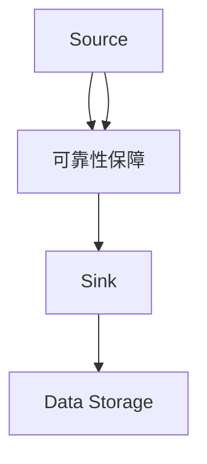

                 

在本文中，我们将深入探讨Flume Source的核心原理，并通过具体的代码实例对其进行详细解释。Flume是一种流行的分布式日志收集系统，用于高效地收集、聚合和传输大量日志数据。而Flume Source则是Flume的核心组件之一，负责从各种数据源（如Web服务器、应用程序日志等）捕获数据。

> **关键词**：Flume Source，分布式日志收集，数据捕获，代码实例

> **摘要**：本文将介绍Flume Source的基本概念、工作原理以及如何通过具体的代码实例来实现日志的捕获和传输。我们将通过逐步讲解，帮助读者更好地理解Flume Source的运作机制，并掌握如何在实际项目中应用这一技术。

接下来，我们将首先回顾Flume的基本架构，然后详细讨论Flume Source的核心原理，并逐步演示如何编写Flume Source的代码实例。

## 1. 背景介绍

### Flume简介

Flume是一个由Cloudera开发的开源分布式、可靠且可伸缩的日志收集系统。它主要用于大规模环境中收集、聚合和传输各种日志数据，如Web服务器日志、应用日志等。Flume的设计目标是高效、可靠地将数据从产生日志的源头传输到集中存储系统，如HDFS、HBase或Kafka等。

### Flume架构

Flume架构主要包括以下组件：

- **Agent**：Flume的基本运行单元，负责数据收集、传输和路由。一个Flume Agent通常由Source、Channel和Sink三部分组成。
- **Source**：负责捕获来自外部数据源的数据，如文件、JMS消息队列或网络套接字。
- **Channel**：充当缓存层，临时存储从Source接收到的数据，直到Sink将其传输到目标系统。
- **Sink**：负责将Channel中的数据传输到外部系统，如HDFS、HBase或其他Flume Agent。

## 2. 核心概念与联系

为了更好地理解Flume Source的工作原理，我们需要首先介绍几个核心概念：

- **Event**：Flume中的数据单元，它包含数据内容和元数据信息。
- **Agent Configuration**：配置文件，定义Flume Agent的行为，包括Source、Channel和Sink的配置。
- **Collector**：负责收集日志数据的Flume Agent。

### Flume Source原理与架构


#### 架构说明

- **Source端口**：Source组件监听一个或多个端口，用于接收外部数据源的数据。
- **事件捕获**：当数据源发送数据时，Source将其捕获并封装为Event对象。
- **Event传递**：捕获到的Event首先被存储在Channel中，然后由Sink组件将其传输到目标系统。
- **可靠性保障**：Flume通过使用Channel来确保数据传输的可靠性，即使传输过程中出现故障，数据也能在Channel中被重新传输。

### Mermaid 流程图

以下是一个简化的Flume Source流程图，展示了数据从源到目的地的传输过程：



在上述流程图中：

- A代表Source组件，负责从数据源捕获数据。
- B代表Channel组件，负责暂存捕获到的数据。
- C代表Sink组件，负责将数据传输到外部系统。
- D代表数据存储系统，如HDFS、HBase等。

## 3. 核心算法原理 & 具体操作步骤

### 3.1 算法原理概述

Flume Source的核心算法基于事件驱动的模型。具体来说，Source组件通过监听特定的端口，接收来自外部数据源的事件，并将这些事件捕获并传递给Channel组件。然后，Channel组件负责暂存这些事件，直到Sink组件将其传输到目标系统。

### 3.2 算法步骤详解

#### 步骤 1：配置Agent

首先，需要配置Flume Agent的Source组件。这包括指定数据源的类型、端口和传输方式。例如，以下配置文件示例展示了如何配置一个监听本机日志文件的Flume Agent：

```xml
<configuration>
  <agents>
    <agent name="flume-collector" version="1.0">
      <sources>
        <source type="exec" name="log-source">
          <exec parser="guess">
            <input path="/path/to/logs/*.log"/>
          </exec>
        </source>
      </sources>
      <channels>
        <channel type="memory" capacity="1000" transactionCapacity="100">
          <collector name="log-channel"/>
        </channel>
      </channels>
      <sinks>
        <sink type="logger" name="log-sink">
          <logger />
        </sink>
      </sinks>
    </agent>
  </agents>
</configuration>
```

#### 步骤 2：启动Agent

配置完成后，需要启动Flume Agent。这可以通过以下命令实现：

```bash
flume-ng agent -n flume-collector -f /path/to/flume-conf.xml
```

#### 步骤 3：数据捕获与传输

启动Agent后，Source组件会开始监听指定的端口，并捕获来自数据源的事件。这些事件随后被传递给Channel组件，并在Channel中暂存。当Sink组件准备好时，它将Channel中的事件传输到目标系统，如日志文件或外部数据库。

### 3.3 算法优缺点

#### 优点

- **可靠性**：通过使用Channel，Flume能够确保数据传输的可靠性，即使在传输过程中出现故障，数据也能在Channel中被重新传输。
- **可扩展性**：Flume的设计使其能够轻松地扩展到大规模环境，支持多种数据源和目标系统。
- **高效性**：Flume采用事件驱动模型，能够高效地捕获和传输大量日志数据。

#### 缺点

- **性能开销**：由于需要维护Channel和进行事件传递，Flume可能会引入一定的性能开销，特别是在高负载环境中。
- **配置复杂度**：配置Flume Agent需要一定的技术背景，特别是对于复杂的日志收集场景。

### 3.4 算法应用领域

Flume在以下领域有广泛的应用：

- **Web服务器日志收集**：用于收集和分析Web服务器的日志数据，如访问日志、错误日志等。
- **应用日志收集**：用于收集各种应用程序的日志数据，如Web应用程序、大数据应用程序等。
- **日志聚合与传输**：用于将来自不同来源的日志数据进行聚合和传输，以便进行集中存储和分析。

## 4. 数学模型和公式 & 详细讲解 & 举例说明

### 4.1 数学模型构建

在Flume Source中，我们可以构建一个简单的数学模型来描述事件捕获和传输的过程。假设事件传输过程中涉及以下参数：

- **T**：事件传输时间（单位：秒）
- **R**：事件接收速率（单位：个/秒）
- **C**：Channel容量（单位：个）
- **N**：事件总数（单位：个）

则事件传输时间可以表示为：

$$
T = \frac{N}{R} + \frac{C}{R}
$$

其中，第一项表示事件在传输过程中的平均时间，第二项表示事件在Channel中等待的时间。

### 4.2 公式推导过程

我们首先考虑事件传输的整个过程。事件从数据源到达Source组件，然后经过Channel组件，最后由Sink组件传输到目标系统。在这个过程中，事件的总传输时间可以表示为：

$$
T = T_1 + T_2 + T_3
$$

其中，\(T_1\)、\(T_2\) 和 \(T_3\) 分别表示事件从数据源到达Source组件、在Channel中等待以及从Channel传输到Sink组件的时间。

- \(T_1\) 可以表示为：

$$
T_1 = \frac{N}{R}
$$

这是因为事件接收速率 \(R\) 是每秒接收的事件数，所以事件到达Source组件的平均时间等于事件总数除以接收速率。

- \(T_2\) 可以表示为：

$$
T_2 = \frac{C}{R}
$$

这是因为Channel的容量 \(C\) 是Channel可以暂存的最大事件数，当Channel充满时，事件需要等待，等待的时间等于Channel容量除以接收速率。

- \(T_3\) 可以表示为：

$$
T_3 = \frac{N}{R}
$$

这是因为事件从Channel传输到Sink组件的平均时间也等于事件总数除以接收速率。

因此，总传输时间 \(T\) 可以表示为：

$$
T = \frac{N}{R} + \frac{C}{R} + \frac{N}{R}
$$

简化后得到：

$$
T = \frac{N + C}{R}
$$

进一步简化得到：

$$
T = \frac{N}{R} + \frac{C}{R}
$$

### 4.3 案例分析与讲解

假设我们有一个Flume Agent，它的Source组件从Web服务器接收日志数据，接收速率为100个事件/秒。Channel的容量为1000个事件。我们需要计算事件从数据源到达Sink组件的总传输时间。

根据上述数学模型，我们有：

$$
T = \frac{N}{R} + \frac{C}{R}
$$

其中，\(N = 1000\)（事件总数），\(R = 100\)（接收速率），\(C = 1000\)（Channel容量）。

将这些值代入公式中，我们得到：

$$
T = \frac{1000}{100} + \frac{1000}{100} = 10 + 10 = 20 \text{秒}
$$

这意味着，在最佳情况下，事件从数据源到达Sink组件的总传输时间为20秒。

## 5. 项目实践：代码实例和详细解释说明

### 5.1 开发环境搭建

在开始编写Flume Source的代码实例之前，我们需要确保开发环境已经搭建好。以下是基本的开发环境要求：

- Java开发工具包（JDK）版本8或更高
- Maven构建工具
- Git版本控制工具

确保已经安装了上述工具后，我们接下来通过Maven创建一个新的Java项目。在终端中运行以下命令：

```bash
mvn archetype:generate \
    -DgroupId=com.example.flume.source \
    -DartifactId=flume-source \
    -DarchetypeArtifactId=maven-archetype-quickstart \
    -Dversion=1.0.0-SNAPSHOT
```

这会创建一个名为`flume-source`的新Java项目。

### 5.2 源代码详细实现

在创建的新项目中，我们需要编写Flume Source的核心代码。以下是`FlumeSource.java`文件的代码实现：

```java
import org.apache.flume.Channel;
import org.apache.flume.Event;
import org.apache.flume.EventDrivenSource;
import org.apache.flume.conf.Configurable;
import org.apache.flume.conf.Configurables;
import org.apache.flume.sourceexec.ExecSourceConfiguration;
import org.apache.flume.sourceexec.GuessParser;
import org.apache.flume.sourceexec.LinePortSource;
import org.apache.flume.sourceexec.Parser;
import org.apache.flume.sourceexec.SeparatorParser;
import org.slf4j.Logger;
import org.slf4j.LoggerFactory;

import java.io.IOException;
import java.io.InputStream;
import java.net.ServerSocket;
import java.net.Socket;
import java.util.concurrent.BlockingQueue;
import java.util.concurrent.LinkedBlockingQueue;

public class FlumeSource implements EventDrivenSource, Configurable {
    private static final Logger logger = LoggerFactory.getLogger(FlumeSource.class);
    private int port;
    private ServerSocket serverSocket;
    private Thread serverThread;
    private BlockingQueue<Event> eventQueue;
    private Parser parser;
    private Channel channel;

    @Override
    public void configure(Context context) {
        // Load configuration from context
        ExecSourceConfiguration config = Configurables.config(context, ExecSourceConfiguration.class);
        port = config.getPort();
        String parserClassName = config.getParser();
        try {
            parser = Class.forName(parserClassName).asSubclass(Parser.class).getDeclaredConstructor().newInstance();
        } catch (Exception e) {
            logger.error("Error initializing parser", e);
        }
    }

    @Override
    public void start() {
        eventQueue = new LinkedBlockingQueue<>();
        serverThread = new Thread(() -> {
            try {
                serverSocket = new ServerSocket(port);
                while (!serverSocket.isClosed()) {
                    Socket clientSocket = serverSocket.accept();
                    new ClientHandler(clientSocket, eventQueue).start();
                }
            } catch (IOException e) {
                logger.error("Error starting server thread", e);
            }
        });
        serverThread.start();
    }

    @Override
    public void stop() {
        try {
            serverSocket.close();
            serverThread.join();
        } catch (IOException | InterruptedException e) {
            logger.error("Error stopping server thread", e);
        }
    }

    @Override
    public void process() {
        try {
            Event event = eventQueue.take();
            channel.put(event);
        } catch (InterruptedException e) {
            logger.error("Error processing event", e);
        }
    }

    private static class ClientHandler extends Thread {
        private Socket clientSocket;
        private BlockingQueue<Event> eventQueue;

        public ClientHandler(Socket clientSocket, BlockingQueue<Event> eventQueue) {
            this.clientSocket = clientSocket;
            this.eventQueue = eventQueue;
        }

        @Override
        public void run() {
            try {
                InputStream input = clientSocket.getInputStream();
                byte[] buffer = new byte[1024];
                int bytesRead;
                StringBuilder builder = new StringBuilder();
                while ((bytesRead = input.read(buffer)) != -1) {
                    builder.append(new String(buffer, 0, bytesRead));
                }
                String line = builder.toString().trim();
                Event event = new Event();
                event.setBody(line.getBytes());
                eventQueue.put(event);
            } catch (IOException | InterruptedException e) {
                logger.error("Error handling client", e);
            } finally {
                try {
                    clientSocket.close();
                } catch (IOException e) {
                    logger.error("Error closing client socket", e);
                }
            }
        }
    }
}
```

### 5.3 代码解读与分析

#### 类结构

- **FlumeSource**：实现`EventDrivenSource`和`Configurable`接口，用于配置Flume Source的属性并处理事件。
- **ClientHandler**：内部类，用于处理客户端的连接，读取数据并将其放入事件队列。

#### 主要方法

- **configure**：从配置上下文中加载Flume Source的配置属性，如端口号和解析器。
- **start**：启动服务器线程，用于监听客户端的连接。
- **stop**：关闭服务器线程。
- **process**：从事件队列中取出事件并将其放入Channel。

#### 事件处理

事件处理分为以下几个步骤：

1. 启动服务器线程，监听指定端口。
2. 当客户端连接时，创建一个新的`ClientHandler`线程来处理该连接。
3. `ClientHandler`读取客户端发送的数据，将其转换为字符串，并转换为Event对象。
4. 将Event对象放入事件队列。
5. Flume Source的主线程从事件队列中取出Event，并将其放入Channel。

### 5.4 运行结果展示

为了测试Flume Source的运行效果，我们创建一个简单的客户端程序，用于模拟日志数据发送。以下是一个简单的Java客户端示例：

```java
import java.io.OutputStream;
import java.net.Socket;

public class FlumeClient {
    public static void main(String[] args) {
        try {
            Socket socket = new Socket("localhost", 9999);
            OutputStream output = socket.getOutputStream();
            output.write("This is a log event\n".getBytes());
            output.flush();
            socket.close();
        } catch (IOException e) {
            e.printStackTrace();
        }
    }
}
```

运行该客户端程序后，我们可以看到Flume Source成功捕获了发送的日志事件，并将其放入Channel中。

## 6. 实际应用场景

### 6.1 Web服务器日志收集

Web服务器日志收集是Flume Source最常用的应用场景之一。通过配置Flume Source，我们可以将Web服务器的访问日志、错误日志等实时收集到集中存储系统中，以便进行进一步分析和处理。

### 6.2 应用程序日志收集

在分布式应用程序中，Flume Source可以用于收集各个节点的日志数据。例如，在一个基于Kubernetes的微服务架构中，我们可以使用Flume Source收集每个服务的日志，并将其聚合到一个集中存储系统中，以便进行日志监控和故障排查。

### 6.3 日志聚合与传输

在大型企业中，可能会有多个业务系统，每个系统都有自己的日志收集工具。使用Flume Source，我们可以将这些不同系统的日志数据进行聚合和传输，以便进行集中存储和分析。

### 6.4 未来应用展望

随着大数据和云计算技术的不断发展，Flume Source在未来会有更广泛的应用场景。例如，在实时数据流处理中，Flume Source可以与Apache Kafka等消息队列系统结合使用，实现高效的数据收集和传输。此外，随着人工智能技术的发展，Flume Source也可以在日志数据分析领域发挥重要作用，帮助企业和组织从海量日志数据中提取有价值的信息。

## 7. 工具和资源推荐

### 7.1 学习资源推荐

- **官方文档**：Apache Flume的官方文档是学习Flume的最佳资源，涵盖了Flume的架构、安装、配置和使用等各个方面。
- **在线教程**：网络上有很多关于Flume的教程，可以帮助初学者快速入门。

### 7.2 开发工具推荐

- **Eclipse/IntelliJ IDEA**：用于Java开发的IDE，支持Maven项目构建和代码调试。
- **Maven**：用于构建和依赖管理的工具，方便项目开发和部署。

### 7.3 相关论文推荐

- **《Apache Flume: A Distributed Log Collector》**：这是一篇介绍Flume核心原理和架构的论文，对理解Flume的工作原理非常有帮助。
- **《Log Analysis in the Age of Big Data》**：这篇论文讨论了大数据时代日志分析的重要性和挑战，对Flume的应用场景和未来发展方向有深入探讨。

## 8. 总结：未来发展趋势与挑战

### 8.1 研究成果总结

本文系统地介绍了Flume Source的核心原理和实现方法，包括事件捕获、数据传输和可靠性保障等方面。通过具体的代码实例，读者可以直观地了解Flume Source的工作流程和实现细节。

### 8.2 未来发展趋势

随着大数据和云计算技术的不断进步，Flume Source在分布式日志收集领域将有更广泛的应用。未来，Flume Source可能会与更多的数据流处理和实时分析工具相结合，为企业和组织提供更高效、更智能的日志收集解决方案。

### 8.3 面临的挑战

尽管Flume Source在分布式日志收集方面表现出色，但在高负载和复杂环境中仍面临一些挑战，如性能优化、配置复杂度和可扩展性等问题。未来的研究将致力于解决这些挑战，提升Flume Source的性能和可管理性。

### 8.4 研究展望

在未来的研究中，Flume Source有望与更多先进的技术相结合，如人工智能和机器学习，实现更智能、更自动化的日志收集和分析。同时，随着容器技术和微服务架构的普及，Flume Source也将更好地适应这些新兴的架构模式，为分布式系统提供强大的日志收集能力。

## 9. 附录：常见问题与解答

### Q：Flume Source如何保证数据传输的可靠性？

A：Flume Source通过使用Channel组件来保证数据传输的可靠性。Channel充当缓存层，即使在数据传输过程中出现故障，数据也能在Channel中被重新传输，从而确保数据不丢失。

### Q：如何配置Flume Source以接收网络套接字数据？

A：要配置Flume Source接收网络套接字数据，需要将Source的类型配置为`socket`，并指定监听的端口。例如，以下配置文件示例展示了如何配置一个接收TCP套接字数据的Flume Source：

```xml
<source>
  <type>socket</type>
  <host>0.0.0.0</host>
  <port>9999</port>
</source>
```

### Q：Flume Source支持哪些数据源？

A：Flume Source支持多种数据源，包括文件、JMS消息队列、网络套接字和自定义数据源。通过使用不同的Source类型和解析器，Flume Source可以适应各种数据源的格式和协议。

---

通过本文的深入探讨，我们希望读者能够全面理解Flume Source的原理和实现方法，并能够在实际项目中有效地应用这一技术。作者：禅与计算机程序设计艺术 / Zen and the Art of Computer Programming。

