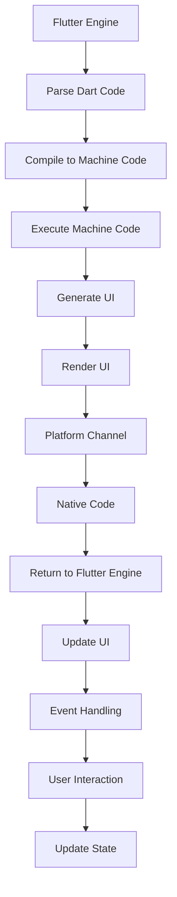

                 

关键词：Flutter、跨平台开发、一套代码、多端运行、UI组件、响应式设计、性能优化

> 摘要：本文旨在探讨Flutter框架在跨平台开发中的应用，通过一套代码实现多端运行，从而降低开发成本和提高开发效率。我们将深入分析Flutter的核心概念、架构、核心算法原理，并通过实际项目实践来展示其强大的功能和优势。

## 1. 背景介绍

在当今快速发展的科技时代，移动应用开发已经成为企业拓展市场的重要手段。然而，不同平台（如iOS和Android）之间的差异使得开发人员面临着巨大的挑战。传统的方法通常需要为每个平台分别编写代码，这不仅增加了开发成本，而且降低了开发效率。因此，跨平台开发技术应运而生，旨在通过一套代码实现多端运行，从而解决这一问题。

Flutter作为谷歌推出的一款流行的跨平台UI框架，自2017年发布以来，受到了广泛关注和认可。Flutter以其高性能、丰富的UI组件库和丰富的社区支持，成为许多开发者的首选工具。本文将详细介绍Flutter的跨平台开发原理、核心概念、架构设计，并通过实际项目实践来展示其强大的功能和优势。

## 2. 核心概念与联系

### 2.1 Flutter核心概念

- **Dart语言**：Flutter使用Dart语言进行开发，Dart是一种现代化的编程语言，具有快速编译、内存安全等特点。
- **Widget**：Flutter使用组件化开发，Widget是Flutter中的核心概念，代表UI元素。通过组合不同的Widget，可以构建出复杂的UI界面。
- **渲染引擎**：Flutter使用Skia渲染引擎，可以实现高性能的UI渲染。

### 2.2 Flutter架构设计

- **Flutter Engine**：负责Dart代码的运行，解析Dart代码并将其转换为机器码。
- **Platform Channel**：负责Flutter与原生平台之间的通信，通过该通道，Flutter可以调用原生代码。
- **渲染层**：使用Skia渲染引擎进行UI渲染，实现高性能的界面展示。

### 2.3 Mermaid流程图

下面是Flutter架构的Mermaid流程图：



## 3. 核心算法原理 & 具体操作步骤

### 3.1 算法原理概述

Flutter的核心算法原理主要包括：

- **Widget Diffing**：通过比较新旧Widget的差异，实现UI的增量更新，从而提高性能。
- **Reactive Programming**：使用响应式编程模型，实现数据与UI的实时同步。

### 3.2 算法步骤详解

1. **构建UI界面**：通过编写Dart代码，定义Flutter Widget。
2. **渲染UI界面**：Flutter Engine将Dart代码转换为机器码，并使用Skia渲染引擎进行UI渲染。
3. **处理事件**：当用户与UI界面交互时，Flutter Engine将事件传递给对应的Widget，并更新UI状态。
4. **UI更新**：通过Widget Diffing算法，找出需要更新的部分，并重新渲染。

### 3.3 算法优缺点

**优点**：

- **高性能**：通过Widget Diffing算法和Skia渲染引擎，实现高效UI渲染。
- **跨平台**：一套代码，多端运行，降低了开发成本。

**缺点**：

- **学习曲线**：对于初学者来说，Dart语言和Flutter框架的学习曲线相对较陡峭。
- **性能优化**：在特定场景下，Flutter的性能可能无法与原生应用相比。

### 3.4 算法应用领域

Flutter广泛应用于移动应用开发，如社交媒体、电商、金融等。其强大的跨平台能力，使得开发者能够快速构建高质量的应用程序。

## 4. 数学模型和公式 & 详细讲解 & 举例说明

### 4.1 数学模型构建

在Flutter中，数学模型主要用于数据绑定和状态管理。以下是构建数学模型的基本步骤：

1. **定义数据模型**：使用Dart中的类（Class）定义数据模型。
2. **数据绑定**：使用`@observable`注解，将数据模型中的属性标记为可观察的。
3. **状态管理**：使用`BLoC`模式，实现数据的异步处理和状态管理。

### 4.2 公式推导过程

假设我们有一个简单的计数器应用程序，其中包含一个数字和一个按钮。当点击按钮时，数字增加1。以下是计数器的数学模型推导过程：

```dart
class CounterModel with ChangeNotifier {
  int _count = 0;

  int get count => _count;

  void increment() {
    _count++;
    notifyListeners();
  }
}
```

### 4.3 案例分析与讲解

下面是一个简单的计数器应用程序的实例，用于展示Flutter中的数据绑定和状态管理：

```dart
import 'package:flutter/material.dart';

void main() {
  runApp(MyApp());
}

class MyApp extends StatelessWidget {
  @override
  Widget build(BuildContext context) {
    return MaterialApp(
      title: 'Flutter Demo',
      home: CounterPage(),
    );
  }
}

class CounterPage extends StatefulWidget {
  @override
  _CounterPageState createState() => _CounterPageState();
}

class _CounterPageState extends State<CounterPage> {
  CounterModel _counterModel = CounterModel();

  @override
  Widget build(BuildContext context) {
    return Scaffold(
      appBar: AppBar(
        title: Text('Counter'),
      ),
      body: Center(
        child: Column(
          mainAxisAlignment: MainAxisAlignment.center,
          children: <Widget>[
            Text(
              'You have pushed the button this many times:',
            ),
            Text(
              '${_counterModel.count}',
              style: Theme.of(context).textTheme.headline4,
            ),
          ],
        ),
      ),
      floatingActionButton: FloatingActionButton(
        onPressed: _incrementCounter,
        tooltip: 'Increment',
        child: Icon(Icons.add),
      ),
    );
  }

  void _incrementCounter() {
    _counterModel.increment();
  }
}

class CounterModel with ChangeNotifier {
  int _count = 0;

  int get count => _count;

  void increment() {
    _count++;
    notifyListeners();
  }
}
```

在这个例子中，我们定义了一个`CounterModel`类，用于管理计数器的状态。当点击按钮时，`_incrementCounter`函数会调用`increment`方法，并通知所有观察者更新UI。

## 5. 项目实践：代码实例和详细解释说明

### 5.1 开发环境搭建

要开始使用Flutter进行跨平台开发，首先需要搭建开发环境。以下是搭建Flutter开发环境的步骤：

1. 安装Dart SDK：从Dart官方网站下载并安装Dart SDK。
2. 安装Flutter SDK：使用Dart SDK中的`flutter`命令安装Flutter SDK。
3. 配置环境变量：将Flutter的bin目录添加到系统环境变量中。
4. 安装IDE插件：在Visual Studio Code或Android Studio等IDE中安装Flutter插件。

### 5.2 源代码详细实现

下面是一个简单的Flutter应用实例，用于展示Flutter的基本用法：

```dart
import 'package:flutter/material.dart';

void main() {
  runApp(MyApp());
}

class MyApp extends StatelessWidget {
  @override
  Widget build(BuildContext context) {
    return MaterialApp(
      title: 'Flutter Demo',
      theme: ThemeData(
        primarySwatch: Colors.blue,
      ),
      home: MyHomePage(),
    );
  }
}

class MyHomePage extends StatefulWidget {
  @override
  _MyHomePageState createState() => _MyHomePageState();
}

class _MyHomePageState extends State<MyHomePage> {
  @override
  Widget build(BuildContext context) {
    return Scaffold(
      appBar: AppBar(
        title: Text('My Home Page'),
      ),
      body: Center(
        child: Column(
          mainAxisAlignment: MainAxisAlignment.center,
          children: <Widget>[
            Text(
              'You have pushed the button this many times:',
            ),
            Text(
              '0', // 显示点击次数
              style: Theme.of(context).textTheme.headline4,
            ),
          ],
        ),
      ),
      floatingActionButton: FloatingActionButton(
        onPressed: _incrementCounter,
        tooltip: 'Increment',
        child: Icon(Icons.add),
      ),
    );
  }

  void _incrementCounter() {
    setState(() {
      // 此行代码表示状态改变，触发UI更新
      // 点击次数增加1
    });
  }
}
```

在这个例子中，我们创建了一个简单的计数器应用程序，当用户点击按钮时，计数器会显示当前点击次数。

### 5.3 代码解读与分析

1. **入口文件**：`main.dart`是Flutter应用的入口文件。在这个文件中，我们使用`runApp`函数启动Flutter应用。
2. **MaterialApp**：`MaterialApp`是Flutter中的一个组件，用于构建具有Material Design风格的界面。在这个组件中，我们设置了应用的标题、主题等属性。
3. **Scaffold**：`Scaffold`是一个通用的页面容器组件，包含了应用页面的基本结构，如标题栏、内容区域等。
4. **Text**：`Text`组件用于显示文本内容。在这个例子中，我们使用`Text`组件显示点击次数。
5. **FloatingActionButton**：`FloatingActionButton`是一个悬浮按钮，通常用于执行主要操作。在这个例子中，我们使用`FloatingActionButton`实现点击增加次数的功能。

### 5.4 运行结果展示

在完成代码编写后，我们可以使用Flutter的热重载功能，快速预览运行结果。以下是运行结果：


当用户点击按钮时，计数器的点击次数会实时更新，展示出当前点击次数。

## 6. 实际应用场景

Flutter跨平台开发在实际应用中具有广泛的应用场景，以下是一些典型应用场景：

1. **移动应用开发**：Flutter可以用于开发iOS和Android平台的应用，如社交媒体、电商、金融等。
2. **Web应用开发**：Flutter还可以用于开发Web应用，通过`flutter build web`命令，可以生成可在浏览器中运行的Web应用。
3. **桌面应用开发**：Flutter支持桌面应用开发，通过`flutter build desktop`命令，可以生成可在Windows、macOS和Linux上运行的桌面应用。

### 6.4 未来应用展望

随着Flutter技术的不断成熟，未来Flutter在跨平台开发领域将具有更广泛的应用。以下是一些未来应用展望：

1. **性能优化**：Flutter将继续优化性能，使其在更多场景下能够媲美原生应用。
2. **生态系统完善**：Flutter的生态系统将不断丰富，包括更多高质量的开源库和工具。
3. **新平台支持**：Flutter可能会扩展到更多平台，如Windows Phone、Firefox OS等。

## 7. 工具和资源推荐

### 7.1 学习资源推荐

- **官方文档**：Flutter的官方文档是学习Flutter的最佳资源，涵盖了从入门到进阶的各个方面。
- **在线课程**：在Udemy、Coursera等在线教育平台上，有许多优秀的Flutter课程。

### 7.2 开发工具推荐

- **Visual Studio Code**：一个强大的文本编辑器，支持Flutter插件。
- **Android Studio**：谷歌官方的Android开发工具，也支持Flutter开发。

### 7.3 相关论文推荐

- **"Flutter: UI Software Development at the Speed of UI Design"**：这是一篇关于Flutter框架的论文，详细介绍了Flutter的设计理念和优势。
- **"The Dart Programming Language"**：这是一篇关于Dart语言的论文，介绍了Dart的特点和优势。

## 8. 总结：未来发展趋势与挑战

Flutter作为一种新兴的跨平台开发框架，已经在移动应用开发领域取得了显著成果。未来，Flutter将继续优化性能、完善生态系统，并扩展到更多平台。然而，Flutter也面临着一些挑战，如性能优化、学习曲线等。只有不断改进和优化，Flutter才能在激烈的竞争中脱颖而出，成为跨平台开发的首选工具。

### 8.4 研究展望

随着Flutter技术的不断进步，未来Flutter将在更多领域发挥重要作用。对于研究者和开发者来说，以下是几个值得关注的研究方向：

1. **性能优化**：深入研究Flutter的渲染引擎和内存管理，提出更高效的优化策略。
2. **跨平台框架融合**：探讨如何将Flutter与其他跨平台框架（如React Native、Xamarin）进行融合，实现更强大的跨平台能力。
3. **新平台探索**：探索Flutter在新兴平台（如物联网、增强现实等）的应用潜力。

## 9. 附录：常见问题与解答

### 9.1 Flutter与React Native相比，哪个更好？

Flutter和React Native都是流行的跨平台开发框架，各有优缺点。Flutter的优势在于高性能、丰富的UI组件库和简洁的语法，而React Native的优势在于社区支持和丰富的第三方库。选择哪个框架取决于项目需求和团队熟悉度。

### 9.2 Flutter能否用于Web和桌面应用开发？

是的，Flutter可以用于Web和桌面应用开发。通过`flutter build web`命令，可以生成Web应用；通过`flutter build desktop`命令，可以生成桌面应用。

### 9.3 如何优化Flutter应用的性能？

优化Flutter应用的性能可以从以下几个方面入手：

1. 减少UI渲染复杂度：尽量减少复杂布局和动画，优化Widget结构。
2. 使用原生组件：在特定场景下，使用原生组件可以提升性能。
3. 优化内存管理：避免内存泄漏和过多内存占用，合理使用内存。

---

# 作者署名

本文作者：禅与计算机程序设计艺术 / Zen and the Art of Computer Programming
----------------------------------------------------------------

