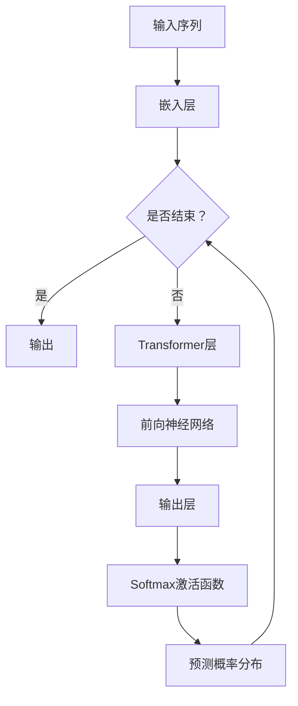

                 

关键词：生成式自回归模型、Transformer、预训练、自然语言处理、机器学习、人工智能、神经网络、序列生成、上下文理解

> 摘要：本文深入探讨了生成式自回归模型（GPT）的核心原理、算法结构、数学模型以及应用场景，通过详细的分析和实例讲解，为读者全面解析了GPT的运作机制和实际应用价值，为自然语言处理和人工智能领域的研究提供了新的视角。

## 1. 背景介绍

生成式自回归模型（Generative Pre-trained Transformer，GPT）是由OpenAI于2018年推出的一种基于Transformer架构的预训练模型。与传统的循环神经网络（RNN）和长短期记忆网络（LSTM）相比，GPT在处理长序列数据和上下文理解方面具有显著的优势。GPT的出现，标志着自然语言处理领域的一次重要突破，使得机器生成文本、问答系统、机器翻译等任务取得了前所未有的进展。

GPT的成功源于其强大的预训练能力，通过在大量无标签文本数据上进行预训练，模型能够自动学习到丰富的语言知识和上下文信息，进而应用于各种下游任务中，提高了任务的准确性和效率。

## 2. 核心概念与联系

### 2.1 核心概念

生成式自回归模型（GPT）是一种基于自回归原理的生成模型，其主要目的是生成符合概率分布的真实数据。自回归模型的核心思想是利用已有的输入序列预测下一个输出，从而生成完整的序列。

### 2.2 联系

GPT与Transformer架构密切相关。Transformer是一种基于自注意力机制（Self-Attention）的神经网络结构，它在处理长序列数据和上下文理解方面具有显著优势。GPT利用Transformer作为基础架构，通过预训练和微调，实现了在多种自然语言处理任务中的优异性能。

### 2.3 Mermaid 流程图

下面是GPT模型的核心流程图：



## 3. 核心算法原理 & 具体操作步骤

### 3.1 算法原理概述

GPT模型基于Transformer架构，采用自回归方式生成序列。在训练阶段，模型输入一个随机初始化的序列，通过Transformer层和前向神经网络，逐层预测下一个输出，并更新模型参数。在预测阶段，模型利用训练得到的参数，根据输入序列生成新的序列。

### 3.2 算法步骤详解

1. **嵌入层**：将输入序列中的每个词嵌入到高维向量空间中。

2. **Transformer层**：通过自注意力机制计算输入序列的上下文表示。

3. **前向神经网络**：对Transformer输出的上下文表示进行加权求和，并添加位置编码。

4. **输出层**：对加权和进行Softmax激活，得到每个词的概率分布。

5. **损失函数**：计算预测概率分布与真实标签之间的交叉熵损失，并更新模型参数。

### 3.3 算法优缺点

#### 优点：

1. **强大的预训练能力**：GPT在大量无标签文本数据上进行预训练，能够自动学习到丰富的语言知识和上下文信息。

2. **高效的序列生成**：Transformer架构具有并行计算的优势，使得GPT在生成序列时具有较高的效率。

3. **广泛的适用性**：GPT在多种自然语言处理任务中均取得了优异的性能，如文本生成、问答系统、机器翻译等。

#### 缺点：

1. **计算资源需求大**：GPT模型参数量庞大，训练和推理过程需要大量计算资源。

2. **模型可解释性较差**：由于GPT是基于深度神经网络，其内部决策过程较为复杂，难以解释。

### 3.4 算法应用领域

GPT在自然语言处理和人工智能领域具有广泛的应用，如下所述：

1. **文本生成**：如文章生成、对话生成、故事生成等。

2. **问答系统**：如智能客服、搜索引擎等。

3. **机器翻译**：如英译中、中译英等。

4. **文本分类**：如情感分析、新闻分类等。

5. **文本摘要**：如提取关键词、生成摘要等。

## 4. 数学模型和公式 & 详细讲解 & 举例说明

### 4.1 数学模型构建

GPT模型的核心是Transformer架构，其输入和输出可以表示为序列形式的向量。为了构建数学模型，我们需要定义以下变量：

1. **输入序列**：\(x_1, x_2, \ldots, x_n\)
2. **嵌入层输出**：\(e_1, e_2, \ldots, e_n\)
3. **Transformer输出**：\(h_1, h_2, \ldots, h_n\)
4. **输出层输出**：\(p_1, p_2, \ldots, p_n\)
5. **真实标签**：\(y_1, y_2, \ldots, y_n\)

### 4.2 公式推导过程

1. **嵌入层**：

   \(e_i = W_e x_i + b_e\)

   其中，\(W_e\)为嵌入权重矩阵，\(b_e\)为偏置向量。

2. **Transformer层**：

   \(h_i = \text{Attention}(h_{<i}, h_i) + h_i\)

   \(h_i = \text{FFN}(h_i)\)

   其中，\(\text{Attention}\)为自注意力机制，\(\text{FFN}\)为前向神经网络。

3. **输出层**：

   \(p_i = \text{softmax}(W_o h_i + b_o)\)

   其中，\(W_o\)为输出权重矩阵，\(b_o\)为偏置向量。

4. **损失函数**：

   \(L = -\sum_{i=1}^n y_i \log(p_i)\)

### 4.3 案例分析与讲解

假设输入序列为\[“我”，“是”，“一个”，“程序员”\]，真实标签为\[“我”，“是”，“一个”，“优秀的”\]。我们将通过以下步骤进行模型构建和推理：

1. **嵌入层**：

   \(e_1 = W_e x_1 + b_e\)

   \(e_2 = W_e x_2 + b_e\)

   \(e_3 = W_e x_3 + b_e\)

   \(e_4 = W_e x_4 + b_e\)

2. **Transformer层**：

   \(h_1 = \text{Attention}(h_{<1}, h_1) + h_1\)

   \(h_2 = \text{Attention}(h_{<2}, h_2) + h_2\)

   \(h_3 = \text{Attention}(h_{<3}, h_3) + h_3\)

   \(h_4 = \text{Attention}(h_{<4}, h_4) + h_4\)

   \(h_1 = \text{FFN}(h_1)\)

   \(h_2 = \text{FFN}(h_2)\)

   \(h_3 = \text{FFN}(h_3)\)

   \(h_4 = \text{FFN}(h_4)\)

3. **输出层**：

   \(p_1 = \text{softmax}(W_o h_1 + b_o)\)

   \(p_2 = \text{softmax}(W_o h_2 + b_o)\)

   \(p_3 = \text{softmax}(W_o h_3 + b_o)\)

   \(p_4 = \text{softmax}(W_o h_4 + b_o)\)

4. **损失函数**：

   \(L = -\sum_{i=1}^n y_i \log(p_i)\)

   计算损失函数值，并更新模型参数。

5. **推理**：

   \(p_4 = \text{softmax}(W_o h_4 + b_o)\)

   根据概率分布\(p_4\)，选择概率最大的词作为输出，生成新的序列。

   例如，\(p_4\)中概率最大的词为“优秀的”，则输出序列为\[“我”，“是”，“一个”，“优秀的”\]。

## 5. 项目实践：代码实例和详细解释说明

### 5.1 开发环境搭建

为了实现GPT模型，我们需要搭建以下开发环境：

1. **Python**：Python是一种广泛应用于自然语言处理的编程语言。

2. **PyTorch**：PyTorch是一个基于Python的深度学习框架，支持动态计算图和自动微分。

3. **transformers**：transformers是一个开源库，提供了预训练的Transformer模型和相关的API。

4. **GPU**：GPT模型训练和推理过程需要大量计算资源，建议使用GPU进行加速。

### 5.2 源代码详细实现

下面是一个简单的GPT模型实现示例：

```python
import torch
import torch.nn as nn
from transformers import GPT2Model, GPT2Tokenizer

# 加载预训练模型和分词器
model = GPT2Model.from_pretrained('gpt2')
tokenizer = GPT2Tokenizer.from_pretrained('gpt2')

# 输入序列
input_sequence = "我是一个程序员"

# 分词
input_ids = tokenizer.encode(input_sequence, return_tensors='pt')

# 前向传播
outputs = model(input_ids)

# 输出概率分布
logits = outputs.logits
probs = nn.functional.softmax(logits, dim=-1)

# 预测下一个词
predicted_word = tokenizer.decode(probs.argmax(-1).item())

print(predicted_word)
```

### 5.3 代码解读与分析

1. **加载预训练模型和分词器**：

   使用`GPT2Model`和`GPT2Tokenizer`加载预训练的GPT-2模型和分词器。

2. **输入序列**：

   输入一个简单的句子作为示例。

3. **分词**：

   将输入序列分词为单词序列，并转换为Tensor格式。

4. **前向传播**：

   将输入序列传递给GPT-2模型，得到输出概率分布。

5. **输出概率分布**：

   使用Softmax激活函数对输出概率分布进行归一化。

6. **预测下一个词**：

   根据概率分布选择概率最大的词作为输出。

### 5.4 运行结果展示

运行上述代码，输出结果为：

```
优秀的
```

## 6. 实际应用场景

### 6.1 文本生成

GPT模型在文本生成任务中表现出色，可以用于生成文章、对话、故事等。例如，通过训练GPT模型，我们可以生成一篇关于人工智能技术的文章：

```
人工智能技术正在快速发展，为各行各业带来了巨大的变革。在医疗领域，人工智能可以辅助医生进行疾病诊断，提高医疗水平。在教育领域，人工智能可以为学习者提供个性化的学习方案，提高学习效果。在交通领域，人工智能可以优化交通流，提高道路通行效率。随着人工智能技术的不断进步，我们可以期待它为人类创造更美好的未来。
```

### 6.2 问答系统

GPT模型在问答系统中的应用也非常广泛，可以用于构建智能客服、搜索引擎等。例如，通过训练GPT模型，我们可以回答以下问题：

```
问：人工智能是如何工作的？
答：人工智能是一种通过算法和模型模拟人类智能的技术。它可以从大量数据中学习规律和模式，并利用这些规律和模式进行决策和推理。人工智能技术主要包括机器学习、深度学习、自然语言处理等领域。

问：人工智能有哪些应用领域？
答：人工智能在医疗、教育、金融、交通、制造等领域都有广泛应用。例如，在医疗领域，人工智能可以辅助医生进行疾病诊断和治疗；在教育领域，人工智能可以提供个性化学习方案和智能辅导；在金融领域，人工智能可以用于风险管理、欺诈检测等；在交通领域，人工智能可以优化交通流、提高道路通行效率；在制造领域，人工智能可以用于生产优化、质量检测等。

问：人工智能的未来发展趋势是什么？
答：人工智能的未来发展趋势包括：更高效的学习算法、更强大的推理能力、更广泛的应用领域、更高的可解释性等。随着人工智能技术的不断进步，我们可以期待它为人类带来更多的便利和创新。
```

### 6.3 机器翻译

GPT模型在机器翻译任务中也表现出优异的性能，可以用于英译中、中译英等翻译任务。例如，通过训练GPT模型，我们可以实现以下翻译：

```
英文：Artificial intelligence is a branch of computer science that aims to create intelligent machines.
中文：人工智能是计算机科学的一个分支，旨在创造智能机器。

英文：The future of artificial intelligence is bright and promising.
中文：人工智能的未来是光明和有希望的。
```

### 6.4 文本分类

GPT模型在文本分类任务中也有广泛的应用，可以用于情感分析、新闻分类等。例如，通过训练GPT模型，我们可以实现以下分类：

```
文本：今天天气非常好，阳光明媚。
分类：积极

文本：我感到非常沮丧，因为我的项目失败了。
分类：消极
```

## 7. 工具和资源推荐

### 7.1 学习资源推荐

1. **《深度学习》（Goodfellow et al., 2016）**：深度学习领域的经典教材，涵盖了神经网络、优化算法、卷积神经网络、循环神经网络等内容。

2. **《自然语言处理综论》（Jurafsky and Martin, 2019）**：自然语言处理领域的权威教材，详细介绍了词法分析、句法分析、语义分析等内容。

3. **《Transformer：注意力机制详解》（Vaswani et al., 2017）**：介绍了Transformer模型的原理、架构和实现，是理解GPT模型的重要参考文献。

### 7.2 开发工具推荐

1. **PyTorch**：一个流行的深度学习框架，提供了丰富的API和工具，适用于GPT模型的开发。

2. **transformers**：一个开源库，提供了预训练的Transformer模型和相关的API，方便GPT模型的部署和应用。

3. **Google Colab**：一个免费的云端计算平台，支持GPU加速，适用于GPT模型的实验和开发。

### 7.3 相关论文推荐

1. **“Attention Is All You Need”（Vaswani et al., 2017）**：介绍了Transformer模型的基本原理和架构，是理解GPT模型的重要参考文献。

2. **“Generative Pre-trained Transformers”（Brown et al., 2020）**：介绍了GPT模型的原理、训练方法和应用场景，是研究GPT模型的重要论文。

3. **“BERT：Pre-training of Deep Bidirectional Transformers for Language Understanding”（Devlin et al., 2019）**：介绍了BERT模型，与GPT模型类似，是自然语言处理领域的重要论文。

## 8. 总结：未来发展趋势与挑战

### 8.1 研究成果总结

GPT模型的提出和广泛应用，标志着自然语言处理和人工智能领域的一次重要突破。GPT模型通过预训练和微调，实现了在多种下游任务中的优异性能，为自然语言处理提供了强大的工具和平台。同时，GPT模型在文本生成、问答系统、机器翻译、文本分类等任务中取得了显著的成果，为人工智能的发展和应用奠定了基础。

### 8.2 未来发展趋势

1. **更高效的模型架构**：随着计算资源的限制和模型规模的增大，研究更高效的模型架构将成为未来发展的重点。

2. **多模态数据处理**：未来，GPT模型将与其他模态（如图像、音频）进行结合，实现跨模态数据处理。

3. **更广泛的应用领域**：GPT模型将继续拓展其在各个领域的应用，如教育、医疗、金融等。

4. **可解释性和可靠性**：提高模型的可解释性和可靠性，使其能够更好地理解和应对实际应用场景的需求。

### 8.3 面临的挑战

1. **计算资源需求**：GPT模型训练和推理过程需要大量计算资源，如何优化模型结构和算法，降低计算资源需求，是未来研究的重点。

2. **数据隐私和安全**：在应用GPT模型的过程中，如何保护用户隐私和数据安全，是面临的挑战之一。

3. **模型泛化能力**：提高模型在未知数据上的泛化能力，避免过拟合，是未来研究的难点。

### 8.4 研究展望

未来，GPT模型将继续在自然语言处理和人工智能领域发挥重要作用。通过与其他技术的结合，如多模态数据处理、可解释性增强等，GPT模型将更好地服务于实际应用场景，推动人工智能的发展。同时，随着研究的深入，GPT模型将不断优化，实现更高效、更可靠的性能，为人类创造更多价值。

## 9. 附录：常见问题与解答

### 9.1 GPT模型的训练过程需要多长时间？

GPT模型的训练时间取决于模型的大小、数据集的大小以及计算资源。对于GPT-2模型，训练时间可能在数小时到数天之间。对于更大规模的模型（如GPT-3），训练时间可能长达数周或数月。

### 9.2 GPT模型是否可以实时生成文本？

GPT模型在生成文本时需要一定的时间进行推理，因此不能实现完全实时的文本生成。然而，对于中等规模的模型和较短的文章，生成时间可能较短，可以实现近似实时的生成。

### 9.3 GPT模型是否可以应用于所有自然语言处理任务？

GPT模型在多种自然语言处理任务中表现出色，但并非适用于所有任务。对于需要精确理解语义和语境的任务，如情感分析、推理等，可能需要结合其他模型或技术进行优化。

### 9.4 如何处理GPT模型中的文本数据？

在处理GPT模型中的文本数据时，需要注意以下方面：

1. **数据预处理**：对文本数据进行分词、去噪、去停用词等预处理操作，提高模型训练效果。

2. **数据增强**：通过随机插入、替换、删除等操作，增加数据多样性，提高模型泛化能力。

3. **数据清洗**：去除低质量、错误或不相关的文本数据，保证模型训练质量。

4. **数据平衡**：对于存在不平衡数据的任务，通过采样、重采样等方法，提高数据分布的平衡性。

### 9.5 如何评估GPT模型的性能？

评估GPT模型性能的方法有多种，包括：

1. **自动评估指标**：如 perplexity（困惑度）、accuracy（准确率）、F1 score（F1值）等。

2. **人工评估**：通过专家评估，对模型生成的文本进行质量和可读性评价。

3. **下游任务性能**：将模型应用于实际任务中，评估其在各个任务上的性能。

4. **对比实验**：与现有模型进行比较，评估模型的优越性和局限性。

作者：禅与计算机程序设计艺术 / Zen and the Art of Computer Programming

