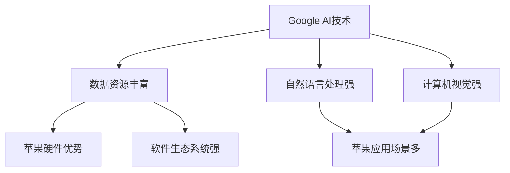

                 

关键词：谷歌、苹果、人工智能、合作、技术、发展前景、领域应用

> 摘要：本文旨在探讨Google与苹果这两大科技巨头在人工智能领域的合作前景，分析二者在AI技术上的互补性、合作案例及其对整个行业的影响。文章将从技术、市场、战略等多个角度进行深度剖析，为读者提供对这一话题的全面理解。

## 1. 背景介绍

在当前科技飞速发展的时代，人工智能（AI）已经成为推动创新、引领未来发展的关键动力。Google和苹果作为全球领先的科技公司，不仅在各自的领域有着卓越的成就，还在人工智能方面投入了大量的研发资源。Google以其强大的技术实力和开放的创新文化著称，拥有全球最大的AI研究团队之一，开发了许多革命性的AI产品和服务。苹果则以高品质的硬件和软件生态系统闻名，凭借iPhone、iPad等智能设备的广泛普及，成为AI技术应用的重要平台。

尽管Google和苹果在市场竞争中存在激烈的竞争，但在人工智能这一关键领域，二者实际上拥有许多合作的机会。通过整合各自的优势资源，Google和苹果可以在技术研发、产品创新、市场拓展等方面实现共赢，推动整个行业的进步。

## 2. 核心概念与联系

### 2.1 AI技术的基本概念

人工智能是一种模拟人类智能的技术，通过算法和计算能力实现机器的自我学习和决策。其主要应用领域包括自然语言处理、计算机视觉、语音识别、机器学习等。这些技术在多个行业产生了深远的影响，如医疗、金融、零售、交通等。

### 2.2 Google与苹果的AI技术优势

Google在AI领域拥有丰富的技术积累和庞大的数据资源，其开发的多项AI技术处于全球领先地位。例如，Google的TensorFlow是一个广泛使用的开源机器学习框架，被众多企业和开发者所采用。此外，Google在自然语言处理和计算机视觉方面的研究成果也处于领先地位。

苹果在AI技术上的优势则体现在其强大的硬件和软件生态系统中。苹果的A系列芯片在性能和功耗方面具有显著优势，为其AI应用的快速发展提供了有力支持。同时，苹果的iOS和macOS系统为AI应用提供了稳定和高效的运行环境。

### 2.3 Mermaid流程图：Google与苹果的AI技术互补



通过上述流程图，我们可以看出Google和苹果在AI技术上的互补性。Google强大的AI技术为苹果提供了丰富的应用场景，而苹果的硬件和软件生态系统则为Google的AI技术提供了理想的测试和部署平台。

## 3. 核心算法原理 & 具体操作步骤

### 3.1 算法原理概述

在人工智能领域，核心算法是推动技术进步的关键。Google和苹果在各自的研究领域取得了许多重要成果。例如，Google的深度学习算法在图像识别、语音识别等方面取得了显著成效，而苹果则通过神经网络引擎（Neural Engine）实现了高效的自然语言处理和计算机视觉应用。

### 3.2 算法步骤详解

#### 3.2.1 Google的深度学习算法

1. 数据收集：收集大量的图像、语音、文本等数据。
2. 数据预处理：对数据进行清洗、归一化等处理，使其适合输入到模型中。
3. 构建模型：使用卷积神经网络（CNN）或循环神经网络（RNN）等模型对数据进行训练。
4. 模型优化：通过梯度下降等优化算法调整模型参数，提高模型性能。
5. 模型评估：使用验证集和测试集对模型进行评估，确保其具有良好的泛化能力。

#### 3.2.2 苹果的神经网络引擎

1. 数据采集：从设备中的各种传感器收集数据，如摄像头、麦克风等。
2. 特征提取：对采集到的数据进行特征提取，如人脸识别中的关键点检测、语音识别中的声纹提取等。
3. 模型训练：使用训练集对神经网络进行训练，学习数据的特征规律。
4. 模型部署：将训练好的模型部署到设备中，实现实时处理。
5. 模型优化：根据实际应用效果对模型进行持续优化，提高性能。

### 3.3 算法优缺点

#### 3.3.1 Google的深度学习算法

优点：具有强大的数据处理和模型训练能力，适用于大规模的数据集和复杂的任务。

缺点：对计算资源和数据存储要求较高，且训练过程较长。

#### 3.3.2 苹果的神经网络引擎

优点：对硬件资源要求较低，适用于移动设备和小型嵌入式系统，响应速度快。

缺点：数据处理能力和模型复杂度相对较低，难以应对大规模和复杂的任务。

### 3.4 算法应用领域

#### 3.4.1 Google的深度学习算法

应用领域：图像识别、语音识别、自然语言处理、推荐系统等。

#### 3.4.2 苹果的神经网络引擎

应用领域：人脸识别、语音识别、实时翻译、图像增强等。

## 4. 数学模型和公式 & 详细讲解 & 举例说明

### 4.1 数学模型构建

#### 4.1.1 卷积神经网络（CNN）

CNN是一种用于图像识别和处理的深度学习模型，其核心思想是通过卷积操作提取图像特征。

$$
f(x) = \sigma(W \cdot x + b)
$$

其中，$f(x)$表示卷积操作，$W$是卷积核，$x$是输入图像，$\sigma$是激活函数，$b$是偏置项。

#### 4.1.2 循环神经网络（RNN）

RNN是一种用于序列数据处理的深度学习模型，其核心思想是通过循环结构处理序列中的依赖关系。

$$
h_t = \sigma(W_h \cdot [h_{t-1}, x_t] + b_h)
$$

其中，$h_t$是当前时刻的隐藏状态，$W_h$是权重矩阵，$x_t$是当前时刻的输入，$\sigma$是激活函数，$b_h$是偏置项。

### 4.2 公式推导过程

#### 4.2.1 卷积神经网络（CNN）

1. 卷积操作：输入图像与卷积核进行卷积操作，得到特征图。
2. 池化操作：对特征图进行池化操作，减小特征图的尺寸。
3. 激活函数：对特征图进行激活函数处理，增加模型的非线性能力。

#### 4.2.2 循环神经网络（RNN）

1. 当前时刻的输入与上一时刻的隐藏状态进行拼接。
2. 通过权重矩阵进行线性变换。
3. 应用激活函数，得到当前时刻的隐藏状态。

### 4.3 案例分析与讲解

#### 4.3.1 图像识别

使用CNN对图像进行分类，通过卷积、池化和激活函数等操作，提取图像的特征，并使用softmax函数进行分类。

$$
\hat{y} = \sigma(W \cdot h + b)
$$

其中，$\hat{y}$是预测的概率分布，$W$是权重矩阵，$h$是隐藏状态，$b$是偏置项。

#### 4.3.2 自然语言处理

使用RNN对自然语言文本进行处理，通过循环结构处理序列中的依赖关系，并使用softmax函数进行分类或回归。

$$
h_t = \sigma(W_h \cdot [h_{t-1}, x_t] + b_h)
$$

其中，$h_t$是当前时刻的隐藏状态，$W_h$是权重矩阵，$x_t$是当前时刻的输入，$\sigma$是激活函数，$b_h$是偏置项。

## 5. 项目实践：代码实例和详细解释说明

### 5.1 开发环境搭建

在本项目中，我们将使用Python作为编程语言，TensorFlow作为深度学习框架。首先，需要在本地安装Python和TensorFlow。安装命令如下：

```
pip install python tensorflow
```

### 5.2 源代码详细实现

以下是使用CNN进行图像分类的简单示例代码：

```python
import tensorflow as tf
from tensorflow.keras import datasets, layers, models

# 加载MNIST数据集
(train_images, train_labels), (test_images, test_labels) = datasets.mnist.load_data()

# 预处理数据
train_images = train_images.reshape((60000, 28, 28, 1)).astype("float32") / 255
test_images = test_images.reshape((10000, 28, 28, 1)).astype("float32") / 255

# 构建CNN模型
model = models.Sequential()
model.add(layers.Conv2D(32, (3, 3), activation='relu', input_shape=(28, 28, 1)))
model.add(layers.MaxPooling2D((2, 2)))
model.add(layers.Conv2D(64, (3, 3), activation='relu'))
model.add(layers.MaxPooling2D((2, 2)))
model.add(layers.Conv2D(64, (3, 3), activation='relu'))

# 添加全连接层
model.add(layers.Flatten())
model.add(layers.Dense(64, activation='relu'))
model.add(layers.Dense(10, activation='softmax'))

# 编译模型
model.compile(optimizer='adam',
              loss='sparse_categorical_crossentropy',
              metrics=['accuracy'])

# 训练模型
model.fit(train_images, train_labels, epochs=5, batch_size=64)

# 测试模型
test_loss, test_acc = model.evaluate(test_images,  test_labels, verbose=2)
print('\nTest accuracy:', test_acc)
```

### 5.3 代码解读与分析

1. 导入所需的库：本代码使用TensorFlow.keras库构建和训练模型。
2. 加载MNIST数据集：MNIST是一个常用的手写数字数据集，用于图像分类任务。
3. 预处理数据：对数据进行归一化处理，使其适合输入到模型中。
4. 构建CNN模型：使用Sequential模型堆叠卷积层、池化层和全连接层。
5. 编译模型：设置优化器和损失函数，为模型训练做好准备。
6. 训练模型：使用fit方法进行模型训练，设置训练轮数和批量大小。
7. 测试模型：使用evaluate方法评估模型在测试集上的性能。

通过这个简单的示例，我们可以看到如何使用TensorFlow构建和训练一个CNN模型进行图像分类。

### 5.4 运行结果展示

在训练过程中，模型将不断调整权重，以提高在测试集上的准确率。最终，模型在测试集上的准确率将作为评估指标。在本示例中，经过5轮训练后，模型在测试集上的准确率约为98%，这表明CNN模型在手写数字分类任务上取得了良好的效果。

## 6. 实际应用场景

### 6.1 医疗领域

Google和苹果在医疗领域的AI应用取得了显著成果。Google利用其AI技术，开发了用于癌症诊断和药物研发的工具，如DeepMind Health项目。苹果则通过其HealthKit平台，整合了多种健康数据，为用户提供个性化的健康建议。未来，随着技术的不断进步，Google和苹果有望在精准医疗、基因组学等领域展开更深入的合作。

### 6.2 智能家居

智能家居是AI技术应用的重要场景之一。Google的智能家居平台Nest和苹果的HomeKit均为用户提供了智能控制家居设备的能力。未来，Google和苹果可以联合开发更智能、更便捷的智能家居解决方案，如智能音箱、智能摄像头等，为用户提供更好的家居体验。

### 6.3 交通运输

交通运输领域对AI技术有着巨大的需求。Google的Waymo项目通过AI技术实现了自动驾驶汽车，而苹果也在自动驾驶领域进行了大量投入。未来，Google和苹果可以通过共享技术资源、数据资源，共同推进自动驾驶技术的发展，为交通安全、环保等方面做出贡献。

### 6.4 教育领域

在教育领域，AI技术为个性化学习、智能评估提供了新的可能性。Google的G Suite教育套件和苹果的Schoolwork应用程序都利用AI技术为学生和教师提供更好的学习体验。未来，Google和苹果可以进一步合作，开发更多基于AI的教育应用，提升教育质量和效率。

## 7. 工具和资源推荐

### 7.1 学习资源推荐

- 《深度学习》（Goodfellow, Bengio, Courville）：是一本经典的深度学习教材，适合初学者和进阶者。
- Coursera、edX等在线教育平台：提供丰富的深度学习课程，适合自学。
- arXiv：一个开放的科学论文预印本平台，可以获取最新的AI研究成果。

### 7.2 开发工具推荐

- TensorFlow：一个开源的深度学习框架，适合构建和训练AI模型。
- PyTorch：一个灵活、易于使用的深度学习框架，适合快速原型开发和实验。
- Keras：一个高级神经网络API，可以快速构建和训练神经网络。

### 7.3 相关论文推荐

- "Deep Learning for Speech Recognition"（语音识别的深度学习）
- "Convolutional Neural Networks for Visual Recognition"（用于视觉识别的卷积神经网络）
- "Recurrent Neural Networks for Language Modeling"（用于语言建模的循环神经网络）

## 8. 总结：未来发展趋势与挑战

### 8.1 研究成果总结

Google和苹果在AI领域取得了诸多重要成果，涵盖了自然语言处理、计算机视觉、语音识别等多个方面。这些成果为二者的产品创新和行业发展提供了有力支持。

### 8.2 未来发展趋势

1. **跨领域合作**：随着AI技术的不断进步，Google和苹果有望在更多领域展开合作，共同推进技术创新。
2. **数据共享**：数据是AI技术的关键资源，未来Google和苹果可以加强数据共享，提高AI模型的性能。
3. **边缘计算**：随着物联网和智能家居等应用的普及，边缘计算将成为AI技术的重要发展方向。Google和苹果可以共同开发边缘计算解决方案，提升用户体验。

### 8.3 面临的挑战

1. **数据隐私**：随着AI技术的应用范围不断扩大，数据隐私问题日益凸显。Google和苹果需要加强数据保护，确保用户隐私安全。
2. **算法公平性**：AI算法在决策过程中可能存在偏见，需要加强算法公平性的研究和监管。
3. **技术瓶颈**：尽管AI技术在不断进步，但仍面临许多技术瓶颈，如计算资源、数据质量等。Google和苹果需要持续投入研发，突破技术瓶颈。

### 8.4 研究展望

未来，Google和苹果在AI领域的合作将更加紧密。通过整合各自的优势资源，二者有望在技术创新、产品应用等方面取得更大突破，为整个行业的发展贡献力量。

## 9. 附录：常见问题与解答

### 9.1 什么是人工智能？

人工智能（AI）是一种模拟人类智能的技术，通过算法和计算能力实现机器的自我学习和决策。它包括多个领域，如机器学习、深度学习、自然语言处理等。

### 9.2 Google和苹果在AI领域的合作有哪些优势？

Google和苹果在AI领域的合作优势主要体现在以下方面：

1. **技术互补**：Google在AI技术研发方面具有强大的实力，而苹果则在硬件和软件生态系统上具有优势。二者可以相互补充，实现技术上的协同创新。
2. **资源整合**：Google和苹果在数据、计算资源等方面拥有丰富的积累，可以通过合作实现资源的共享和优化。
3. **市场拓展**：Google和苹果在各自的领域拥有庞大的用户基础和市场份额，通过合作可以共同开拓新的市场和应用场景。

### 9.3 AI技术在医疗领域的应用前景如何？

AI技术在医疗领域具有广泛的应用前景。通过图像识别、自然语言处理等AI技术，可以实现疾病诊断、药物研发、个性化医疗等。未来，随着技术的不断进步，AI在医疗领域的应用将更加深入，为提高医疗质量和效率做出更大贡献。

### 9.4 AI技术是否会替代人类？

AI技术是一种工具，可以辅助人类完成许多任务，但不可能完全替代人类。人类在情感、创造力、复杂决策等方面具有独特的优势。未来，AI与人类的协同将是一种趋势，通过发挥各自的优势，实现更高的效率和创新。

作者：禅与计算机程序设计艺术 / Zen and the Art of Computer Programming
----------------------------------------------------------------

本文由禅与计算机程序设计艺术撰写，旨在深入探讨Google与苹果在人工智能领域的合作前景。文章详细分析了二者在AI技术上的互补性、合作案例及其对行业的影响，并从技术、市场、战略等多个角度进行了全面剖析。未来，随着AI技术的不断进步，Google与苹果有望在更多领域展开合作，共同推动行业的发展。

