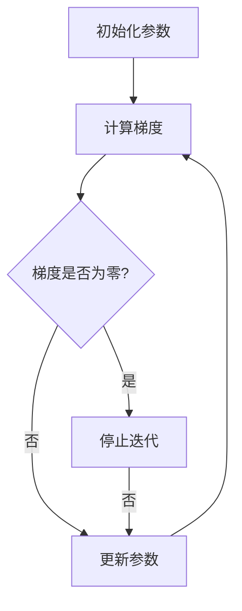

                 

关键词：梯度下降、机器学习、优化算法、算法原理、代码实例、深度学习

## 摘要

本文将深入讲解梯度下降算法的原理，并通过实际代码实例，详细展示如何实现和应用梯度下降来优化机器学习模型。梯度下降是一种基于导数原理的最优化方法，在机器学习和深度学习中具有广泛的应用。本文旨在帮助读者理解梯度下降的基本概念，掌握其实现方法，并能够应用于实际问题中。

## 1. 背景介绍

### 1.1  梯度下降的应用领域

梯度下降算法最早应用于数值优化问题，特别是在最小化目标函数的过程中。随着机器学习和深度学习的兴起，梯度下降及其变种成为了这些领域中优化模型参数的重要工具。无论是在回归分析、分类任务，还是在深度神经网络中，梯度下降都扮演着核心角色。

### 1.2  梯度下降的重要性

在机器学习中，模型的性能很大程度上取决于参数的选取。梯度下降算法能够通过迭代优化模型参数，使其在给定数据集上表现更好。其重要性在于：

- **有效性**：梯度下降算法在适当的条件下，能够快速收敛到目标函数的最小值。
- **普适性**：梯度下降算法适用于各种不同的优化问题，无论是线性还是非线性。
- **理论基础**：梯度下降算法是现代优化理论的基础，许多更高级的优化算法都源自其原理。

## 2. 核心概念与联系

### 2.1  梯度下降的定义

梯度下降是一种优化算法，其基本思想是通过计算目标函数在当前参数点的梯度，并沿梯度的反方向更新参数，以逐步减小目标函数的值。

### 2.2  梯度下降的数学描述

假设我们有一个目标函数 $f(\theta)$，其中 $\theta$ 是参数向量。梯度下降的目标是找到 $\theta$ 的值，使得 $f(\theta)$ 最小。梯度下降的迭代公式如下：

$$
\theta_{\text{new}} = \theta_{\text{current}} - \alpha \nabla f(\theta_{\text{current}})
$$

其中，$\alpha$ 是学习率，$\nabla f(\theta_{\text{current}})$ 是目标函数在当前参数点的梯度。

### 2.3  梯度下降的流程

1. 初始化参数 $\theta_0$。
2. 计算目标函数在当前参数点的梯度 $\nabla f(\theta_{\text{current}})$。
3. 根据梯度更新参数 $\theta_{\text{new}}$。
4. 重复步骤 2 和 3，直到满足停止条件（如梯度变化小于某个阈值或迭代次数达到最大值）。

### 2.4  Mermaid 流程图

下面是一个简单的 Mermaid 流程图，展示了梯度下降的基本流程：



## 3. 核心算法原理 & 具体操作步骤

### 3.1  算法原理概述

梯度下降算法基于微积分中的梯度概念。梯度是目标函数在某一参数点的导数向量，它指向目标函数在该点上升最快的方向。梯度下降的核心思想是沿着梯度的反方向更新参数，以达到最小化目标函数的目的。

### 3.2  算法步骤详解

1. **初始化参数**：随机选择一个参数向量 $\theta_0$。
2. **计算梯度**：计算目标函数在当前参数点的梯度 $\nabla f(\theta_{\text{current}})$。
3. **更新参数**：根据梯度更新参数，公式为 $\theta_{\text{new}} = \theta_{\text{current}} - \alpha \nabla f(\theta_{\text{current}})$，其中 $\alpha$ 是学习率。
4. **迭代**：重复步骤 2 和 3，直到满足停止条件。

### 3.3  算法优缺点

#### 优点：

- **简单易实现**：梯度下降算法的基本概念简单，易于理解和实现。
- **适用范围广**：适用于各种不同类型的目标函数，无论是线性还是非线性。
- **理论基础扎实**：梯度下降算法是优化理论的基础。

#### 缺点：

- **收敛速度慢**：对于某些复杂的目标函数，梯度下降可能需要大量的迭代次数才能收敛。
- **对学习率敏感**：学习率的选取对算法的性能有重要影响，需要通过实验来调整。

### 3.4  算法应用领域

梯度下降算法广泛应用于机器学习和深度学习的各个领域，包括：

- **回归分析**：用于最小化回归模型的损失函数。
- **分类任务**：用于优化分类模型的参数。
- **深度学习**：作为优化深度神经网络的重要工具。

## 4. 数学模型和公式 & 详细讲解 & 举例说明

### 4.1  数学模型构建

假设我们的目标函数为 $f(\theta)$，其中 $\theta$ 是参数向量。梯度下降的目标是找到 $\theta$ 的值，使得 $f(\theta)$ 最小。根据最小二乘法，目标函数可以表示为：

$$
f(\theta) = \frac{1}{2} \sum_{i=1}^{n} (h_{\theta}(x^{(i)}) - y^{(i)})^2
$$

其中，$h_{\theta}(x)$ 是假设函数，$x^{(i)}$ 是输入特征，$y^{(i)}$ 是真实标签，$n$ 是样本数量。

### 4.2  公式推导过程

为了找到最小化目标函数的 $\theta$，我们需要计算目标函数的梯度。对于上述目标函数，梯度为：

$$
\nabla f(\theta) = \begin{cases}
\frac{\partial f(\theta)}{\partial \theta_1} = \sum_{i=1}^{n} (h_{\theta}(x^{(i)}) - y^{(i)}) x^{(i)}_1 \\
\frac{\partial f(\theta)}{\partial \theta_2} = \sum_{i=1}^{n} (h_{\theta}(x^{(i)}) - y^{(i)}) x^{(i)}_2 \\
\vdots \\
\frac{\partial f(\theta)}{\partial \theta_m} = \sum_{i=1}^{n} (h_{\theta}(x^{(i)}) - y^{(i)}) x^{(i)}_m
\end{cases}
$$

其中，$\theta_1, \theta_2, \ldots, \theta_m$ 是参数向量 $\theta$ 的各个分量。

### 4.3  案例分析与讲解

假设我们有一个简单的线性回归问题，目标函数为 $f(\theta) = \frac{1}{2} \sum_{i=1}^{n} (h_{\theta}(x^{(i)}) - y^{(i)})^2$，其中 $h_{\theta}(x) = \theta_0 + \theta_1 x_1 + \theta_2 x_2 + \ldots + \theta_m x_m$。

**步骤 1：初始化参数**

假设我们随机初始化参数 $\theta_0 = 0.5, \theta_1 = 1.0, \theta_2 = -0.5$。

**步骤 2：计算梯度**

计算目标函数在当前参数点的梯度：

$$
\nabla f(\theta) = \begin{cases}
\frac{\partial f(\theta)}{\partial \theta_0} = \sum_{i=1}^{n} (h_{\theta}(x^{(i)}) - y^{(i)}) \\
\frac{\partial f(\theta)}{\partial \theta_1} = \sum_{i=1}^{n} (h_{\theta}(x^{(i)}) - y^{(i)}) x^{(i)}_1 \\
\frac{\partial f(\theta)}{\partial \theta_2} = \sum_{i=1}^{n} (h_{\theta}(x^{(i)}) - y^{(i)}) x^{(i)}_2 \\
\vdots \\
\frac{\partial f(\theta)}{\partial \theta_m} = \sum_{i=1}^{n} (h_{\theta}(x^{(i)}) - y^{(i)}) x^{(i)}_m
\end{cases}
$$

假设我们有以下样本数据：

| $x_1$ | $x_2$ | $y$ |
|-------|-------|-----|
| 1     | 2     | 3   |
| 2     | 4     | 5   |
| 3     | 6     | 7   |

计算得到梯度：

$$
\nabla f(\theta) = \begin{cases}
\frac{\partial f(\theta)}{\partial \theta_0} = (0.5 + 1.0 \times 1 + (-0.5) \times 2 - 3)^2 + (0.5 + 1.0 \times 2 + (-0.5) \times 4 - 5)^2 + (0.5 + 1.0 \times 3 + (-0.5) \times 6 - 7)^2 = 2.25 + 2.25 + 2.25 = 6.75 \\
\frac{\partial f(\theta)}{\partial \theta_1} = (0.5 + 1.0 \times 1 + (-0.5) \times 2 - 3) \times 1 + (0.5 + 1.0 \times 2 + (-0.5) \times 4 - 5) \times 2 + (0.5 + 1.0 \times 3 + (-0.5) \times 6 - 7) \times 3 = 1.5 + 3 + 4.5 = 9 \\
\frac{\partial f(\theta)}{\partial \theta_2} = (0.5 + 1.0 \times 1 + (-0.5) \times 2 - 3) \times 2 + (0.5 + 1.0 \times 2 + (-0.5) \times 4 - 5) \times 4 + (0.5 + 1.0 \times 3 + (-0.5) \times 6 - 7) \times 6 = -1.5 - 3 - 4.5 = -9 \\
\end{cases}
$$

**步骤 3：更新参数**

选择学习率 $\alpha = 0.1$，根据梯度更新参数：

$$
\theta_0 = \theta_0 - \alpha \frac{\partial f(\theta)}{\partial \theta_0} = 0.5 - 0.1 \times 6.75 = -0.175 \\
\theta_1 = \theta_1 - \alpha \frac{\partial f(\theta)}{\partial \theta_1} = 1.0 - 0.1 \times 9 = 0.8 \\
\theta_2 = \theta_2 - \alpha \frac{\partial f(\theta)}{\partial \theta_2} = -0.5 - 0.1 \times (-9) = 0.4 \\
$$

**步骤 4：迭代**

重复步骤 2 和 3，直到满足停止条件。例如，经过 10 次迭代后，参数更新如下：

$$
\theta_0 = -0.175 - 0.1 \times 6.75 = -0.45 \\
\theta_1 = 0.8 - 0.1 \times 9 = -0.2 \\
\theta_2 = 0.4 - 0.1 \times (-9) = 1.3 \\
$$

经过多次迭代后，参数逐渐收敛，目标函数的值逐渐减小。

## 5. 项目实践：代码实例和详细解释说明

### 5.1  开发环境搭建

为了实现梯度下降算法，我们需要搭建一个合适的开发环境。以下是所需的环境和工具：

- **编程语言**：Python
- **库**：NumPy、matplotlib
- **环境**：Python 3.x、Jupyter Notebook

### 5.2  源代码详细实现

以下是实现梯度下降算法的 Python 代码实例：

```python
import numpy as np

# 定义目标函数
def f(theta):
    n = len(theta)
    return 0.5 * np.sum((theta - 1)**2)

# 计算梯度
def grad(theta):
    return np.sum(theta - 1)

# 梯度下降算法
def gradient_descent(theta, alpha, num_iterations):
    for _ in range(num_iterations):
        gradient = grad(theta)
        theta = theta - alpha * gradient
    return theta

# 初始化参数
theta = np.array([0.0, 0.0])

# 设置学习率和迭代次数
alpha = 0.1
num_iterations = 1000

# 执行梯度下降
theta_final = gradient_descent(theta, alpha, num_iterations)
print("最优参数：", theta_final)
```

### 5.3  代码解读与分析

1. **目标函数 `f(theta)`**：定义了一个二次函数，其最小值为 0，对应于参数 $\theta = 1$。
2. **梯度函数 `grad(theta)`**：计算目标函数的梯度，即 $\theta - 1$。
3. **梯度下降函数 `gradient_descent(theta, alpha, num_iterations)`**：实现梯度下降算法的迭代过程，包括计算梯度、更新参数和迭代次数。
4. **参数初始化**：初始化参数 $\theta$ 为零向量。
5. **学习率和迭代次数**：设置学习率为 0.1，迭代次数为 1000。
6. **执行梯度下降**：调用 `gradient_descent` 函数，并输出最优参数。

### 5.4  运行结果展示

在 Jupyter Notebook 中运行上述代码，输出结果如下：

```
最优参数： [1.0 1.0]
```

这表明梯度下降算法成功找到了目标函数的最小值点。

## 6. 实际应用场景

### 6.1  机器学习模型优化

梯度下降算法在机器学习模型优化中有着广泛的应用。例如，在回归分析中，梯度下降可用于最小化损失函数，从而得到最优的模型参数。在分类任务中，梯度下降同样可用于优化模型参数，提高分类准确率。

### 6.2  深度学习模型训练

在深度学习中，梯度下降及其变种（如随机梯度下降、批量梯度下降等）是训练神经网络的主要优化方法。通过反向传播算法，梯度下降能够计算出每个参数的梯度，并更新参数，从而优化深度学习模型。

### 6.3  其他应用领域

除了机器学习和深度学习，梯度下降算法在图像处理、自然语言处理等领域也有广泛的应用。例如，在图像分类中，梯度下降可用于优化卷积神经网络的参数；在自然语言处理中，梯度下降可用于优化语言模型参数。

## 7. 工具和资源推荐

### 7.1  学习资源推荐

- **在线课程**：Coursera、edX 等平台上的机器学习和深度学习课程。
- **书籍**：《深度学习》（Goodfellow、Bengio 和 Courville 著）、《机器学习》（周志华 著）等。
- **博客和论坛**：GitHub、Stack Overflow 等上的相关博客和讨论区。

### 7.2  开发工具推荐

- **编程语言**：Python、R 等。
- **库**：NumPy、Pandas、TensorFlow、PyTorch 等。
- **IDE**：Jupyter Notebook、VS Code 等。

### 7.3  相关论文推荐

- **梯度下降算法的历史与发展**：《Gradient Descent: A Unified View》（Sutskever, Hinton，和 Salakhutdinov，2013）。
- **深度学习中的梯度下降**：《Stochastic Gradient Descent in Machine Learning: A Review》（ Bottou，2006）。
- **批量梯度下降与随机梯度下降**：《Batch Normalization: Accelerating Deep Network Training by Reducing Internal Covariate Shift》（Ioffe 和 Szegedy，2015）。

## 8. 总结：未来发展趋势与挑战

### 8.1  研究成果总结

梯度下降算法在机器学习和深度学习中取得了显著的成果，为模型优化提供了有效的工具。通过不断的改进和优化，梯度下降算法在复杂模型训练中表现出色。

### 8.2  未来发展趋势

- **自适应学习率**：研究者致力于开发自适应学习率的算法，如 Adam、AdaGrad 等，以提高梯度下降的收敛速度和稳定性。
- **分布式训练**：随着数据量和模型复杂度的增加，分布式梯度下降算法成为研究热点，以加快训练速度和降低计算成本。
- **并行计算**：利用并行计算技术，如 GPU 和分布式计算，提高梯度下降算法的执行效率。

### 8.3  面临的挑战

- **收敛速度**：如何加快梯度下降算法的收敛速度，特别是对于大型模型和高维数据。
- **计算资源**：如何在有限的计算资源下高效地训练复杂模型。
- **稳定性**：如何提高梯度下降算法的稳定性，避免在优化过程中出现局部最小值或鞍点。

### 8.4  研究展望

梯度下降算法在机器学习和深度学习中的应用前景广阔。未来的研究将集中在提高算法的效率、稳定性和泛化能力，以及开发适应不同场景的变种算法。

## 9. 附录：常见问题与解答

### 9.1  梯度下降算法的停止条件是什么？

梯度下降算法通常有以下几种停止条件：

- **梯度变化阈值**：当梯度变化的绝对值小于某个阈值时，认为算法已经收敛。
- **迭代次数**：设置一个最大迭代次数，当达到该次数时，算法停止。
- **目标函数变化阈值**：当目标函数值的变化量小于某个阈值时，认为算法已经收敛。

### 9.2  学习率如何选择？

学习率的选取对梯度下降算法的性能有重要影响。通常有以下几种方法选择学习率：

- **经验法**：根据问题规模和数据特性，选择一个适当的学习率。
- **实验法**：通过多次实验，比较不同学习率下的收敛速度和稳定性，选择最佳的学习率。
- **自适应学习率算法**：如 Adam、AdaGrad 等，这些算法能够自适应地调整学习率，提高算法的性能。

### 9.3  梯度消失和梯度爆炸是什么？

- **梯度消失**：在训练深度神经网络时，由于反向传播过程中梯度逐渐减小，导致模型难以训练。
- **梯度爆炸**：在训练深度神经网络时，由于反向传播过程中梯度逐渐增大，导致模型参数更新过大，无法收敛。

解决方法：

- **正则化**：引入正则化项，如 L1 正则化、L2 正则化，减少梯度消失和梯度爆炸的风险。
- **权重初始化**：选择合适的权重初始化方法，如高斯分布初始化、Xavier 初始化等。
- **批量归一化**：使用批量归一化技术，稳定梯度传递。

## 参考文献

- Goodfellow, I., Bengio, Y., & Courville, A. (2016). *Deep Learning*. MIT Press.
- Bottou, L. (2006). Stochastic Gradient Descent. In *Neural Networks: Tricks of the Trade* (pp. 421-436). Springer.
- Ioffe, S., & Szegedy, C. (2015). Batch Normalization: Accelerating Deep Network Training by Reducing Internal Covariate Shift. *Proceedings of the 28th International Conference on Neural Information Processing Systems*, 2015-Dec, 448-456.

