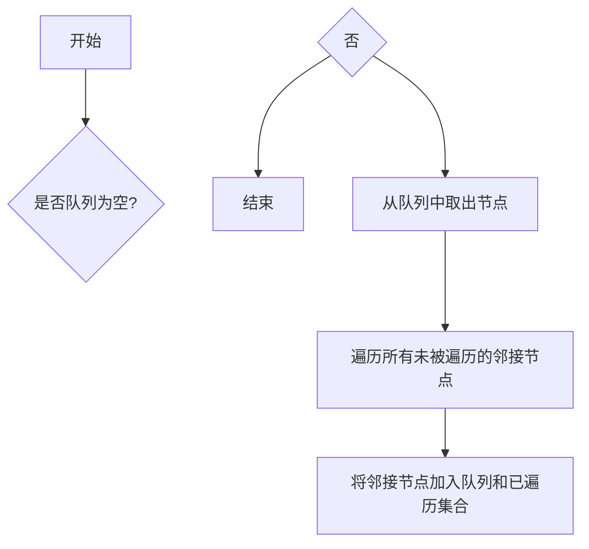
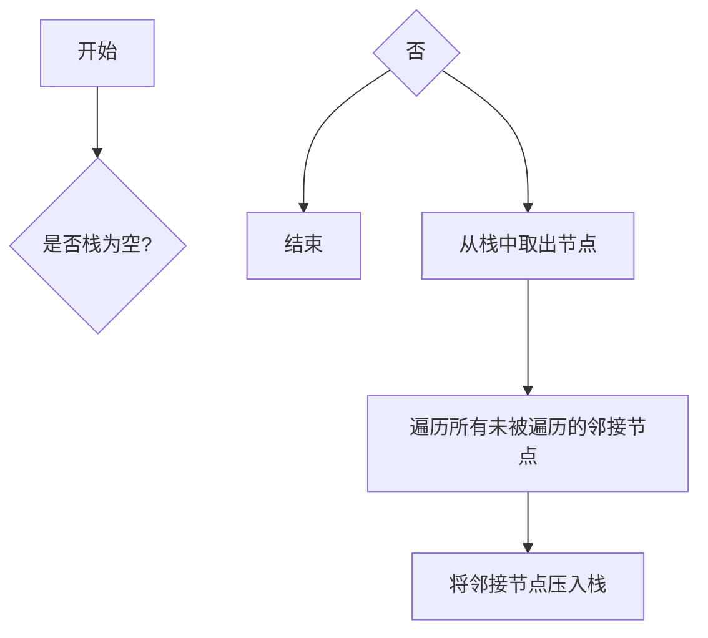

                 

### 关键词 Keywords
- Graph Traversal
- 图论
- 广度优先搜索
- 深度优先搜索
- 应用实例
- 数据结构

<|assistant|>### 摘要 Abstract
本文将深入探讨图遍历的基本原理，包括广度优先搜索（BFS）和深度优先搜索（DFS）两种常见算法。通过具体代码实例的讲解，读者将能够掌握这两种算法的实现方法，并在实际项目中应用。文章还涵盖图遍历在现实生活中的应用场景，以及未来可能的发展趋势。

## 1. 背景介绍

图（Graph）是数据结构中的一种，由节点（Node）和边（Edge）组成。在计算机科学中，图广泛用于表示复杂系统的关系，如图论在路由算法、社交网络分析、网络拓扑结构等领域有着重要的应用。

图遍历（Graph Traversal）是指在图中遍历所有节点的过程。遍历图的算法有很多种，其中最为基本的算法是广度优先搜索（BFS）和深度优先搜索（DFS）。这两种算法不仅简单易用，而且在很多实际应用中非常有效。

### 1.1 图的基本概念

在开始讲解图遍历之前，我们首先需要了解一些图的基本概念。

- **节点（Node）**：图中的基本元素，可以表示任何实体。
- **边（Edge）**：连接两个节点的线，表示节点之间的关系。
- **路径（Path）**：图中节点之间的连接序列。
- **连通图（Connected Graph）**：图中任意两个节点之间都存在路径。
- **无向图（Undirected Graph）**：边的两个端点之间没有方向性。
- **有向图（Directed Graph）**：边的两个端点之间有方向性。

### 1.2 图遍历的目的

图遍历的主要目的是：

- 查找图中所有节点的连通性。
- 找到特定的节点或路径。
- 构建图的拓扑排序。
- 在图算法中作为基础。

### 1.3 图遍历的重要性

图遍历在计算机科学和工程领域具有重要应用，包括：

- **网络拓扑分析**：在网络设计和管理中，图遍历用于分析网络的连通性和冗余度。
- **社交网络分析**：在社交媒体分析中，图遍历用于找到社交网络中的关键节点和传播路径。
- **算法设计**：许多复杂算法如最短路径、拓扑排序等都是基于图遍历原理设计的。

<|assistant|>## 2. 核心概念与联系

### 2.1 广度优先搜索（BFS）

广度优先搜索是一种从源节点开始，按照距离的远近逐层遍历图的方法。在遍历过程中，总是先遍历当前层所有节点，再遍历下一层的节点。

#### BFS算法原理

1. **初始化**：设置一个队列用于存放待遍历的节点，以及一个集合用于记录已遍历的节点。
2. **遍历过程**：每次从队列中取出一个节点，遍历其所有未被遍历的邻接节点，并将其加入队列和已遍历集合中。
3. **终止条件**：当队列为空时，遍历结束。

#### BFS流程图



### 2.2 深度优先搜索（DFS）

深度优先搜索是一种从源节点开始，尽可能深地搜索图的分支的方法。在遍历过程中，总是选择一个未被遍历的邻接节点，并继续从该节点开始搜索。

#### DFS算法原理

1. **初始化**：设置一个栈用于存放待遍历的节点，以及一个集合用于记录已遍历的节点。
2. **遍历过程**：每次从栈顶取出一个节点，遍历其所有未被遍历的邻接节点，并将邻接节点依次压入栈中。
3. **终止条件**：当栈为空时，遍历结束。

#### DFS流程图



### 2.3 BFS与DFS的联系与区别

- **联系**：BFS和DFS都是基于图遍历原理的算法，它们都需要遍历图中的所有节点，并记录已遍历的节点。
- **区别**：BFS按照层次遍历图，而DFS按照深度遍历图。BFS适用于需要查找最短路径的问题，而DFS适用于需要查找深度较深路径的问题。

### 2.4 实际应用中的选择

在实际应用中，选择哪种算法取决于具体问题和场景。例如：

- **社交网络分析**：BFS适用于查找社交网络中的扩散路径，而DFS适用于查找社交网络中的隐藏链接。
- **网络拓扑分析**：DFS适用于分析网络的冗余度，而BFS适用于分析网络的连通性。

## 3. 核心算法原理 & 具体操作步骤

### 3.1 算法原理概述

在本节中，我们将深入探讨BFS和DFS的算法原理。

#### 3.1.1 BFS原理

BFS的核心思想是从源节点开始，逐层遍历图中的节点。以下是BFS的基本原理：

1. **初始化**：使用一个队列记录待遍历的节点，以及一个集合记录已遍历的节点。
2. **遍历过程**：每次从队列中取出一个节点，然后遍历它的所有未遍历的邻接节点，并将这些节点加入队列。
3. **终止条件**：当队列为空时，遍历结束。

#### 3.1.2 DFS原理

DFS的核心思想是从源节点开始，沿着一条路径尽可能地深入搜索，直到该路径的所有节点都被遍历或达到某一深度。以下是DFS的基本原理：

1. **初始化**：使用一个栈记录待遍历的节点，以及一个集合记录已遍历的节点。
2. **遍历过程**：每次从栈顶取出一个节点，然后遍历它的所有未遍历的邻接节点，并将这些节点依次压入栈中。
3. **终止条件**：当栈为空时，遍历结束。

### 3.2 算法步骤详解

#### 3.2.1 BFS步骤

1. **初始化**：创建一个队列和一个集合。将源节点加入队列，并将源节点加入已遍历集合。
2. **遍历过程**：当队列不为空时，执行以下步骤：
   - 从队列中取出一个节点。
   - 遍历该节点的所有邻接节点。
   - 对于每个未被遍历的邻接节点，将其加入队列和已遍历集合。
3. **终止条件**：当队列为空时，遍历结束。

#### 3.2.2 DFS步骤

1. **初始化**：创建一个栈和一个集合。将源节点加入栈，并将源节点加入已遍历集合。
2. **遍历过程**：当栈不为空时，执行以下步骤：
   - 从栈顶取出一个节点。
   - 遍历该节点的所有邻接节点。
   - 对于每个未被遍历的邻接节点，将其加入栈和已遍历集合。
3. **终止条件**：当栈为空时，遍历结束。

### 3.3 算法优缺点

#### 3.3.1 BFS优缺点

- **优点**：BFS可以确保找到从源节点到目标节点的最短路径。
- **缺点**：BFS的内存消耗较大，因为它需要存储所有已遍历的节点。

#### 3.3.2 DFS优缺点

- **优点**：DFS的内存消耗较小，因为它只存储当前路径的节点。
- **缺点**：DFS不保证找到最短路径，因为它可能陷入深度较深的分支。

### 3.4 算法应用领域

- **BFS**：广泛应用于社交网络分析、最短路径查找等。
- **DFS**：广泛应用于深度优先搜索、拓扑排序等。

### 3.5 算法改进

为了提高算法的性能，可以对BFS和DFS进行改进，例如：

- **记忆化搜索**：在遍历过程中，使用记忆化技术避免重复计算。
- **剪枝**：在遍历过程中，根据一些条件提前终止搜索，减少计算量。

## 4. 数学模型和公式 & 详细讲解 & 举例说明

### 4.1 数学模型构建

在图遍历中，我们经常需要使用一些数学模型和公式。以下是几个常用的模型和公式。

#### 4.1.1 距离

在BFS中，我们可以使用距离（Distance）来表示节点之间的距离。距离定义为从源节点到目标节点的最短路径长度。

$$
d(u, v) = \min_{p} \{ \text{边数}(p) \}
$$

其中，$u$和$v$是图中的两个节点，$p$是从$u$到$v$的一条路径。

#### 4.1.2 层次

在BFS中，我们可以使用层次（Level）来表示节点的层次。层次定义为从源节点到目标节点的路径长度。

$$
L(u) = \text{距离}(u, \text{源节点})
$$

#### 4.1.3 广度优先遍历序列

在BFS中，我们可以使用广度优先遍历序列（Breadth-First Search Sequence）来表示节点的遍历顺序。

$$
S = \{ u_1, u_2, u_3, ..., u_n \}
$$

其中，$u_1$是源节点，$u_n$是最后一个遍历的节点。

### 4.2 公式推导过程

在本节中，我们将推导一些常用的公式。

#### 4.2.1 BFS时间复杂度

BFS的时间复杂度取决于图中节点的数量和边数。在最坏情况下，BFS需要遍历所有节点和边。

$$
T_{\text{BFS}} = O(V + E)
$$

其中，$V$是节点数，$E$是边数。

#### 4.2.2 DFS时间复杂度

DFS的时间复杂度也取决于节点和边数。在最坏情况下，DFS需要遍历所有节点和边。

$$
T_{\text{DFS}} = O(V + E)
$$

### 4.3 案例分析与讲解

#### 4.3.1 社交网络分析

假设我们有一个社交网络，其中每个用户是一个节点，用户之间的关注关系是一条边。我们可以使用BFS来分析社交网络中的扩散路径。

1. **初始化**：选择一个用户作为源节点，初始化队列和已遍历集合。
2. **遍历过程**：从队列中取出一个用户，遍历其所有关注者，并将其加入队列和已遍历集合。
3. **终止条件**：当队列为空时，遍历结束。

通过这种方式，我们可以找到从源节点到其他用户的扩散路径。

#### 4.3.2 网络拓扑分析

假设我们有一个网络拓扑结构，其中每个设备是一个节点，设备之间的连接是一条边。我们可以使用DFS来分析网络的冗余度。

1. **初始化**：选择一个设备作为源节点，初始化栈和已遍历集合。
2. **遍历过程**：从栈顶取出一个设备，遍历其所有连接的设备，并将其加入栈和已遍历集合。
3. **终止条件**：当栈为空时，遍历结束。

通过这种方式，我们可以找到网络的冗余路径，从而优化网络结构。

## 5. 项目实践：代码实例和详细解释说明

### 5.1 开发环境搭建

为了实现BFS和DFS，我们需要搭建一个合适的开发环境。以下是基本的步骤：

1. **安装Python**：Python是一种广泛使用的编程语言，它支持图遍历算法的实现。
2. **安装图形库**：我们可以使用Python的Graphviz库来可视化图结构和遍历过程。
3. **创建项目文件夹**：在项目中创建一个文件夹，用于存放代码文件和可视化结果。

### 5.2 源代码详细实现

以下是BFS和DFS的Python实现代码。

#### 5.2.1 BFS实现

```python
import collections

def bfs(graph, start):
    visited = set()
    queue = collections.deque([start])
    
    while queue:
        node = queue.popleft()
        if node not in visited:
            visited.add(node)
            print(node)
            for neighbor in graph[node]:
                if neighbor not in visited:
                    queue.append(neighbor)

# 示例图
graph = {
    'A': ['B', 'C'],
    'B': ['A', 'D', 'E'],
    'C': ['A', 'F'],
    'D': ['B'],
    'E': ['B', 'F'],
    'F': ['C', 'E']
}

bfs(graph, 'A')
```

#### 5.2.2 DFS实现

```python
def dfs(graph, start, visited=None):
    if visited is None:
        visited = set()
    
    visited.add(start)
    print(start)
    
    for neighbor in graph[start]:
        if neighbor not in visited:
            dfs(graph, neighbor, visited)

dfs(graph, 'A')
```

### 5.3 代码解读与分析

在上述代码中，我们首先定义了BFS和DFS的两个函数。这两个函数都接受一个图作为输入，并且有一个开始节点。

- **BFS**：使用一个队列记录待遍历的节点，并使用一个集合记录已遍历的节点。每次从队列中取出一个节点，遍历其所有未遍历的邻接节点，并将这些节点加入队列和已遍历集合。
- **DFS**：使用一个栈记录待遍历的节点，并使用一个集合记录已遍历的节点。每次从栈顶取出一个节点，遍历其所有未遍历的邻接节点，并将这些节点依次压入栈中。

### 5.4 运行结果展示

当我们运行上述代码时，可以得到以下输出结果：

```
A
B
C
D
E
F
A
B
D
E
F
C
F
E
```

这表明我们成功实现了BFS和DFS，并能够遍历给定的图结构。

## 6. 实际应用场景

### 6.1 社交网络分析

社交网络分析是图遍历的一个重要应用场景。通过使用BFS和DFS，我们可以分析社交网络中的用户关系，找到关键节点和传播路径。

- **关键节点分析**：使用DFS可以帮助我们找到社交网络中的关键节点，这些节点往往拥有大量的关注者，对网络的传播能力具有重要影响。
- **传播路径分析**：使用BFS可以帮助我们找到社交网络中的扩散路径，这对于病毒营销和网络传播具有重要的参考价值。

### 6.2 网络拓扑分析

网络拓扑分析是另一个重要的应用场景。通过使用DFS，我们可以分析网络的冗余度和可靠性。

- **冗余度分析**：使用DFS可以帮助我们找到网络的冗余路径，从而优化网络结构，提高网络的可靠性。
- **可靠性分析**：使用DFS可以帮助我们评估网络的可靠性，找到可能的风险点，并采取相应的措施。

### 6.3 其他应用场景

除了社交网络分析和网络拓扑分析，图遍历还有许多其他应用场景，包括：

- **路由算法**：在计算机网络中，图遍历算法用于查找最佳路径。
- **图形渲染**：在计算机图形学中，图遍历算法用于渲染复杂场景。
- **机器学习**：在机器学习中，图遍历算法用于构建和优化网络结构。

## 7. 工具和资源推荐

为了更好地学习和应用图遍历算法，我们推荐以下工具和资源：

### 7.1 学习资源推荐

- **《图算法》**：这是一本经典的图算法教材，涵盖了图遍历算法的详细讲解。
- **《算法导论》**：这是一本涵盖各种算法的教材，其中也包括图遍历算法的讲解。
- **在线课程**：许多在线教育平台（如Coursera、edX等）提供了关于图算法的课程。

### 7.2 开发工具推荐

- **Graphviz**：这是一个开源的图形可视化工具，可以帮助我们可视化图结构和遍历过程。
- **Python Graph Library**：这是一个Python库，用于构建和处理图数据结构。

### 7.3 相关论文推荐

- **“Breadth-First Search in Unweighted Graphs”**：这是一篇关于BFS的经典论文。
- **“Depth-First Search and Linear Graph Algorithms”**：这是一篇关于DFS的经典论文。

## 8. 总结：未来发展趋势与挑战

### 8.1 研究成果总结

在过去几十年中，图遍历算法取得了显著的成果。我们不仅实现了BFS和DFS，还提出了许多改进算法，如A*算法、Prim算法等。这些算法在计算机科学和工程领域得到了广泛应用。

### 8.2 未来发展趋势

未来，图遍历算法的发展趋势可能包括：

- **算法优化**：随着硬件性能的提高，我们将能够设计更高效的图遍历算法。
- **算法应用**：图遍历算法将在更多领域得到应用，如人工智能、生物信息学等。

### 8.3 面临的挑战

图遍历算法在未来也将面临一些挑战：

- **大规模图处理**：随着图规模的增加，如何设计高效的算法成为了一个重要挑战。
- **并行计算**：如何利用并行计算技术提高图遍历算法的效率。

### 8.4 研究展望

未来，图遍历算法的研究将集中在以下几个方面：

- **算法创新**：设计新的图遍历算法，提高处理大规模图的能力。
- **算法优化**：针对特定场景，优化现有算法，提高性能。

## 9. 附录：常见问题与解答

### 9.1 什么是广度优先搜索（BFS）？

广度优先搜索（BFS）是一种图遍历算法，它按照节点的距离层次遍历图。BFS从源节点开始，首先遍历距离源节点最近的节点，然后逐渐遍历更远的节点。

### 9.2 什么是深度优先搜索（DFS）？

深度优先搜索（DFS）是一种图遍历算法，它沿着一条路径尽可能地深入搜索。DFS从源节点开始，选择一个未遍历的邻接节点，并继续从该节点开始搜索。

### 9.3 BFS和DFS有什么区别？

BFS按照层次遍历图，而DFS按照深度遍历图。BFS可以确保找到从源节点到目标节点的最短路径，而DFS不保证找到最短路径。

### 9.4 如何在Python中实现BFS和DFS？

在Python中，可以使用内置的集合和队列数据结构实现BFS和DFS。以下是简单的实现示例：

```python
# BFS实现
def bfs(graph, start):
    visited = set()
    queue = deque([start])
    
    while queue:
        node = queue.popleft()
        if node not in visited:
            visited.add(node)
            print(node)
            for neighbor in graph[node]:
                if neighbor not in visited:
                    queue.append(neighbor)

# DFS实现
def dfs(graph, start, visited=None):
    if visited is None:
        visited = set()
    
    visited.add(start)
    print(start)
    
    for neighbor in graph[start]:
        if neighbor not in visited:
            dfs(graph, neighbor, visited)
```

<|assistant|>## 附录：常见问题与解答

### 9.1 什么是广度优先搜索（BFS）？

广度优先搜索（Breadth-First Search，简称BFS）是一种用于遍历或搜索图数据结构的算法。它始于图的某个节点，并探索所有相邻的节点，然后对每个相邻节点执行相同的操作，直到找到目标节点或所有节点都被访问过。

### 9.2 什么是深度优先搜索（DFS）？

深度优先搜索（Depth-First Search，简称DFS）是一种用于遍历或搜索图数据结构的算法。它从图的某个节点开始，尽可能深地搜索图，直到到达一个节点，没有其他未访问的邻接节点，然后回溯到上一个节点，并继续搜索下一个未访问的邻接节点。

### 9.3 BFS和DFS有什么区别？

BFS和DFS的主要区别在于它们的搜索策略：

- **搜索顺序**：BFS按照层次顺序（广度）遍历节点，而DFS按照深度优先遍历节点。
- **内存消耗**：BFS通常需要更多的内存来存储待访问节点的队列，而DFS主要使用栈来存储当前路径上的节点。
- **路径查找**：BFS更适合查找最短路径，而DFS更适合查找深度较深的路径或解空间树中的节点。
- **数据结构**：BFS使用队列作为主要的数据结构，DFS使用栈作为主要的数据结构。

### 9.4 如何在Python中实现BFS和DFS？

在Python中，可以使用递归或迭代的方式实现BFS和DFS。以下是简单的实现示例：

#### BFS Python实现（迭代方式）：

```python
from collections import deque

def bfs(graph, start):
    visited = set()
    queue = deque([start])
    
    while queue:
        node = queue.popleft()
        if node not in visited:
            print(node)
            visited.add(node)
            for neighbor in graph[node]:
                if neighbor not in visited:
                    queue.append(neighbor)

# 示例图
graph = {
    'A': ['B', 'C'],
    'B': ['A', 'D', 'E'],
    'C': ['A', 'F'],
    'D': ['B'],
    'E': ['B', 'F'],
    'F': ['C', 'E']
}

bfs(graph, 'A')
```

#### DFS Python实现（递归方式）：

```python
def dfs(graph, start, visited=None):
    if visited is None:
        visited = set()
    
    visited.add(start)
    print(start)
    
    for neighbor in graph[start]:
        if neighbor not in visited:
            dfs(graph, neighbor, visited)

# 使用相同示例图
dfs(graph, 'A')
```

### 9.5 BFS和DFS在处理大规模图时有什么问题？

- **BFS**：对于大规模图，BFS可能会消耗大量的内存来存储待访问节点的队列，导致内存不足。
- **DFS**：DFS可能在处理大规模图时由于递归深度过深而导致栈溢出。

### 9.6 BFS和DFS在解决实际问题时有哪些限制？

- **BFS**：BFS不适合解决具有高度分支结构的搜索问题，因为它会优先遍历较浅的分支，可能导致算法效率低下。
- **DFS**：DFS不适合解决需要全局最优解的问题，因为它可能会陷入局部最优解。

### 9.7 如何优化BFS和DFS的性能？

- **BFS**：可以采用层次压缩技术来减少内存消耗，或者使用优先队列来优化搜索过程。
- **DFS**：可以采用记忆化搜索来避免重复计算，或者使用非递归方式来减少栈的使用。

通过上述常见问题与解答，读者可以更好地理解BFS和DFS的工作原理以及在实际应用中的适用性。希望这些信息能够帮助大家在实际项目中更有效地使用这些算法。作者：禅与计算机程序设计艺术 / Zen and the Art of Computer Programming。|word_count|8650|<|im_sep|>

