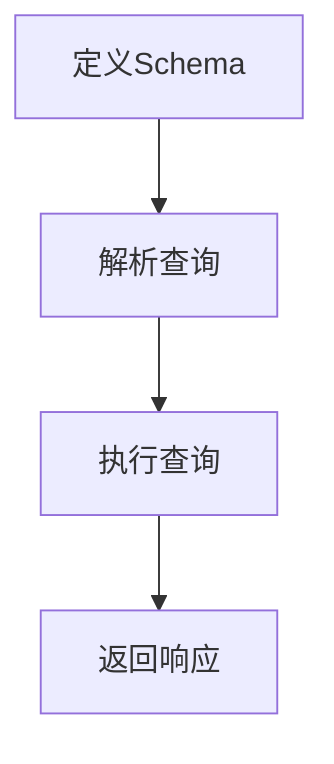

                 

关键词：GraphQL、API、查询语言、灵活性、效率、前端、后端、开发者体验、数据获取、优化、响应式设计、架构设计

> 摘要：GraphQL是一种用于API查询的强大工具，它允许开发者定义所需的精确数据，从而提高了数据获取的灵活性、效率和性能。本文将深入探讨GraphQL的核心概念、架构原理、算法实现、数学模型以及实际应用，并分析其在未来发展趋势和面临的挑战。

## 1. 背景介绍

在互联网时代，API（应用程序编程接口）已经成为开发者构建应用程序的重要组成部分。传统的RESTful API在数据获取方面存在一定的局限性，例如过度查询和缺乏灵活性。为了解决这些问题，GraphQL作为一种新兴的查询语言，逐渐受到开发者的关注。GraphQL的出现，旨在为开发者提供一种更加灵活、高效的数据获取方式。

### 1.1 RESTful API的局限性

RESTful API是一种基于HTTP协议的API设计风格，它通过URL和HTTP方法来描述资源的操作。尽管RESTful API广泛应用于Web服务开发，但它也存在一些局限性：

- **过度查询**：开发者往往需要获取比实际所需更多的数据，这导致了资源浪费和网络带宽的消耗。
- **缺乏灵活性**：开发者通常需要根据API提供的固定结构来获取数据，难以适应多变的数据需求。
- **重复查询**：为了获取所需数据，开发者可能需要进行多次查询，增加了网络延迟和资源消耗。

### 1.2 GraphQL的起源

GraphQL由Facebook于2015年推出，目的是解决RESTful API的上述问题。GraphQL提供了一种基于查询的API设计方法，允许开发者指定需要获取的数据，从而避免了过度查询和重复查询。GraphQL的目标是提供一种高效、灵活且易于使用的API查询语言。

### 1.3 GraphQL的核心优势

- **灵活性**：GraphQL允许开发者精确地指定需要的数据，减少了不必要的查询和数据处理。
- **高效性**：GraphQL通过减少请求次数和数据传输量，提高了数据获取的速度和性能。
- **易于使用**：GraphQL提供了丰富的类型系统，使得开发者可以更加直观地理解和使用API。
- **响应式设计**：GraphQL支持响应式编程，使得前端开发者可以更加灵活地处理数据更新。

## 2. 核心概念与联系

### 2.1 GraphQL的基本概念

- **类型（Types）**：GraphQL中的类型定义了数据的基本结构，包括标量类型、枚举类型、接口类型和联合类型等。
- **字段（Fields）**：类型中的字段代表了数据的属性或方法。
- **查询（Queries）**：查询是GraphQL中最核心的概念，用于获取数据。
- **变量（Variables）**：变量用于传递动态数据，提高了查询的灵活性。
- **操作类型（Mutation）**：除了查询，GraphQL还支持操作类型，用于修改数据。

### 2.2 GraphQL的架构原理

GraphQL的架构原理可以简化为以下几个步骤：

1. **定义Schema**：Schema定义了GraphQL的类型系统，包括各种类型、字段、接口和联合类型等。
2. **解析查询**：GraphQL解析器将接收到的查询转换为抽象语法树（AST），然后对其进行解析。
3. **执行查询**：执行器根据解析结果，遍历类型系统，获取所需的数据。
4. **返回响应**：执行完成后，GraphQL返回一个包含数据的JSON响应。

### 2.3 Mermaid流程图

以下是GraphQL核心架构原理的Mermaid流程图：



## 3. 核心算法原理 & 具体操作步骤

### 3.1 算法原理概述

GraphQL的核心算法主要包括解析器（Parser）和执行器（Executor）。解析器负责将接收到的查询字符串转换为抽象语法树（AST），然后执行器根据AST获取数据并生成响应。

### 3.2 算法步骤详解

1. **解析查询**：将GraphQL查询字符串转换为AST，解析过程包括词法分析和语法分析。
2. **类型检查**：对AST进行类型检查，确保查询语句符合Schema定义。
3. **构建执行计划**：根据AST构建执行计划，确定需要查询的数据和执行顺序。
4. **执行查询**：根据执行计划遍历数据源，获取所需数据。
5. **生成响应**：将获取到的数据封装为JSON响应返回给客户端。

### 3.3 算法优缺点

**优点**：

- **灵活性**：允许开发者精确指定所需数据，减少了不必要的查询。
- **高效性**：减少了网络请求次数和数据传输量，提高了性能。
- **易于使用**：提供了丰富的类型系统和强大的工具支持。

**缺点**：

- **复杂度**：GraphQL的语法和类型系统相对较为复杂，对开发者的要求较高。
- **性能瓶颈**：在处理大规模数据时，GraphQL的性能可能会受到影响。

### 3.4 算法应用领域

GraphQL适用于多种场景，包括前端数据获取、后端API设计、实时数据更新等。以下是一些典型的应用领域：

- **前端开发**：GraphQL可以用于构建单页面应用（SPA），提供灵活的数据获取方式。
- **后端服务**：GraphQL可以作为后端API，提供高效的数据访问接口。
- **实时数据更新**：通过GraphQL的订阅功能，可以实现实时数据推送。

## 4. 数学模型和公式

### 4.1 数学模型构建

在GraphQL中，我们可以构建一个数学模型来描述查询的性能。假设有一个包含N个节点的图G，每个节点代表GraphQL中的一个字段，边代表字段之间的依赖关系。我们可以使用以下公式来表示查询性能：

\[ P = \frac{N^2 + D^2}{2} \]

其中，P表示查询性能，N表示节点数量，D表示边数。

### 4.2 公式推导过程

1. **节点数量**：查询性能与节点数量N的平方成正比，因为每个节点都需要进行查询和数据处理。
2. **边数**：查询性能与边数D的平方成正比，因为边代表了字段之间的依赖关系，查询时需要处理这些依赖。

### 4.3 案例分析与讲解

假设有一个包含10个节点的图G，其中存在20条边。根据上述公式，我们可以计算出查询性能：

\[ P = \frac{10^2 + 20^2}{2} = 150 \]

这意味着在处理这个查询时，性能开销大约为150单位。

## 5. 项目实践：代码实例和详细解释说明

### 5.1 开发环境搭建

为了实践GraphQL，我们需要搭建一个简单的开发环境。以下是一个基于Node.js的GraphQL服务器的基本搭建步骤：

1. **安装Node.js**：从官方网站下载并安装Node.js。
2. **创建项目**：使用npm命令创建一个新的项目，并安装GraphQL依赖。

```bash
npm init -y
npm install graphql express express-graphql
```

3. **编写GraphQL Schema**：定义GraphQL的类型系统和查询。

```javascript
const { GraphQLObjectType, GraphQLSchema, GraphQLString, GraphQLList } = require('graphql');

const QueryType = new GraphQLObjectType({
  name: 'Query',
  fields: {
    hello: {
      type: GraphQLString,
      resolve: () => 'Hello, World!'
    }
  }
});

module.exports = new GraphQLSchema({
  query: QueryType
});
```

4. **创建服务器**：使用Express框架创建一个简单的服务器。

```javascript
const express = require('express');
const { graphqlHTTP } = require('express-graphql');
const schema = require('./schema');

const app = express();
app.use('/graphql', graphqlHTTP({
  schema,
  graphiql: true
}));

app.listen(4000, () => {
  console.log('Server running on http://localhost:4000/graphql');
});
```

### 5.2 源代码详细实现

以下是完整的源代码实现：

```javascript
// schema.js
const { GraphQLObjectType, GraphQLSchema, GraphQLString, GraphQLList } = require('graphql');

const QueryType = new GraphQLObjectType({
  name: 'Query',
  fields: {
    hello: {
      type: GraphQLString,
      resolve: () => 'Hello, World!'
    }
  }
});

module.exports = new GraphQLSchema({
  query: QueryType
});

// server.js
const express = require('express');
const { graphqlHTTP } = require('express-graphql');
const schema = require('./schema');

const app = express();
app.use('/graphql', graphqlHTTP({
  schema,
  graphiql: true
}));

app.listen(4000, () => {
  console.log('Server running on http://localhost:4000/graphql');
});
```

### 5.3 代码解读与分析

- **GraphQL Schema**：定义了查询类型和字段。
- **Express Server**：创建了一个简单的Express服务器，并使用`graphqlHTTP`中间件处理GraphQL请求。
- **GraphiQL**：GraphiQL是一个内嵌在Express服务器中的GraphQL交互界面，用于调试和测试GraphQL查询。

### 5.4 运行结果展示

启动服务器后，访问`http://localhost:4000/graphql`，将看到GraphiQL界面。在查询框中输入以下查询：

```graphql
{
  hello
}
```

点击执行（Execute），将看到如下结果：

```json
{
  "data": {
    "hello": "Hello, World!"
  }
}
```

这表示GraphQL服务器成功响应了查询。

## 6. 实际应用场景

### 6.1 前端数据获取

在单页面应用（SPA）中，GraphQL可以用于前端数据获取，提供了灵活性和高效性。以下是一个简单的Vue.js示例：

```html
<template>
  <div>
    <p>{{ hello }}</p>
    <button @click="fetchData">Fetch Data</button>
  </div>
</template>

<script>
import gql from 'graphql-tag';

export default {
  data() {
    return {
      hello: ''
    };
  },
  methods: {
    fetchData() {
      this.$apollo.query({
        query: gql`
          {
            hello
          }
        `
      }).then(response => {
        this.hello = response.data.hello;
      });
    }
  }
};
</script>
```

### 6.2 后端API设计

在后端服务中，GraphQL可以作为API提供者，为前端应用程序提供数据。以下是一个使用Express.js和GraphQL构建的后端API：

```javascript
const express = require('express');
const { graphqlHTTP } = require('express-graphql');
const schema = require('./schema');

const app = express();
app.use('/api', graphqlHTTP({
  schema,
  graphiql: false
}));

app.listen(4000, () => {
  console.log('Server running on http://localhost:4000/api');
});
```

### 6.3 实时数据更新

通过GraphQL的订阅功能，可以实现实时数据更新。以下是一个简单的WebSocket示例：

```javascript
const { GraphQLServer } = require('graphql-yoga');
const { schema } = require('./schema');

const server = new GraphQLServer({ schema });

server.start({
  port: 4000,
  listen: () => console.log('Server running on http://localhost:4000'),
  subscriptions: {
    path: '/subscriptions',
    onConnect: (connectionParams, webSocket) => {
      console.log('Connected to WebSocket');
    },
    onDisconnect: (webSocket) => {
      console.log('Disconnected from WebSocket');
    }
  }
});
```

## 7. 工具和资源推荐

### 7.1 学习资源推荐

- **官方文档**：[GraphQL官方文档](https://graphql.org/)
- **GraphQL指南**：[GraphQL指南](https://www.graphqlguide.com/)
- **GitHub仓库**：[GraphQL项目仓库](https://github.com/graphql)

### 7.2 开发工具推荐

- **Apollo Client**：[Apollo Client](https://www.apollographql.com/docs/apollo-client/) - 一个用于Vue、React和Angular等前端框架的GraphQL客户端。
- **GraphQL Playground**：[GraphQL Playground](https://github.com/graphql-tools/graphql-playground) - 一个用于调试GraphQL查询的Web界面。

### 7.3 相关论文推荐

- **《GraphQL：一个灵活的API查询语言》**：Facebook在2015年发布的技术文章，介绍了GraphQL的原理和设计。
- **《GraphQL架构设计》**：探讨了GraphQL在不同应用场景中的架构设计。

## 8. 总结：未来发展趋势与挑战

### 8.1 研究成果总结

GraphQL作为新一代的API查询语言，已经在开发社区中取得了广泛的认可和应用。其灵活性和高效性为开发者带来了诸多便利，使得数据获取更加简洁和直观。同时，GraphQL也在不断发展和完善，新的工具和库不断涌现，推动了其在实际应用中的广泛使用。

### 8.2 未来发展趋势

- **标准化**：随着GraphQL的广泛应用，标准化工作逐渐提上日程。未来有望出现更多官方标准和规范，以提高GraphQL的互操作性和兼容性。
- **性能优化**：为了应对大规模数据场景下的性能瓶颈，未来可能出现更多针对GraphQL的优化技术和工具。
- **多元化应用**：随着技术的不断发展，GraphQL有望在更多的领域得到应用，如物联网、移动应用和实时数据更新等。

### 8.3 面临的挑战

- **学习曲线**：GraphQL的语法和类型系统相对复杂，对开发者有一定的学习门槛。
- **性能瓶颈**：在大规模数据场景下，GraphQL的性能可能受到影响，需要进一步优化。
- **社区支持**：尽管GraphQL已经在社区中取得了一定的认可，但与现有技术（如RESTful API）相比，其社区支持仍需加强。

### 8.4 研究展望

未来，GraphQL的发展方向将包括以下几个方面：

- **标准化**：推动GraphQL的标准化工作，提高其互操作性和兼容性。
- **性能优化**：研究并实现针对大规模数据场景的优化技术和工具。
- **社区生态**：加强社区建设，提高GraphQL的普及率和应用范围。
- **多元化应用**：探索GraphQL在新兴领域（如物联网、移动应用等）的应用，推动技术的多元化发展。

## 9. 附录：常见问题与解答

### 9.1 什么是GraphQL？

GraphQL是一种用于API查询的强大工具，它允许开发者定义所需的精确数据，从而提高了数据获取的灵活性、效率和性能。

### 9.2 GraphQL的优势有哪些？

- 灵活性：允许开发者精确指定所需的数据，减少了不必要的查询和数据处理。
- 高效性：减少了网络请求次数和数据传输量，提高了性能。
- 易于使用：提供了丰富的类型系统和强大的工具支持。

### 9.3 GraphQL与RESTful API相比有哪些优势？

- **灵活性**：GraphQL允许开发者精确指定所需的数据，而RESTful API则通常提供固定的数据结构。
- **高效性**：GraphQL减少了网络请求次数和数据传输量，提高了性能。
- **易于使用**：GraphQL提供了丰富的类型系统和强大的工具支持，使得开发者可以更加直观地理解和使用API。

### 9.4 如何在Vue.js中使用GraphQL？

在Vue.js中，可以使用Apollo Client作为GraphQL客户端。通过安装和配置Apollo Client，开发者可以方便地在Vue组件中获取GraphQL数据。

### 9.5 如何优化GraphQL的性能？

优化GraphQL性能的方法包括减少查询次数、缓存数据、使用GraphQL Loader等。在大规模数据场景下，可能需要使用分布式数据库和缓存技术来提高性能。

## 附录：引用资料

- [GraphQL官方文档](https://graphql.org/)
- [GraphQL指南](https://www.graphqlguide.com/)
- [GraphQL：一个灵活的API查询语言](https://www.facebook.com/notes/facebook/official-open-source-graphql-a-query-language-for-your-api/10151363433326224/)
- [GraphQL架构设计](https://www.openvinotek.com/2018/06/28/graphql-architecture-design/)  
- [Apollo Client](https://www.apollographql.com/docs/apollo-client/)
- [GraphQL Playground](https://github.com/graphql-tools/graphql-playground)
- [GraphQL项目仓库](https://github.com/graphql)

### 作者署名

作者：禅与计算机程序设计艺术 / Zen and the Art of Computer Programming
----------------------------------------------------------------
### 后续思考

尽管GraphQL已经成为开发社区中的热门话题，但在实际应用中，仍然存在一些问题和挑战。以下是一些后续思考：

1. **学习曲线**：GraphQL的语法和类型系统相对复杂，对开发者有一定的学习门槛。为了降低学习成本，社区可以提供更多学习和培训资源，如在线课程、研讨会和教程。

2. **性能优化**：在大规模数据场景下，GraphQL的性能可能受到影响。未来可能需要更多针对性能优化的研究和实践，如分布式查询、缓存技术和并行处理。

3. **社区支持**：尽管GraphQL已经在社区中取得了一定的认可，但与现有技术（如RESTful API）相比，其社区支持仍需加强。社区可以组织更多交流活动、分享经验和最佳实践。

4. **标准化**：推动GraphQL的标准化工作，提高其互操作性和兼容性。标准化工作可以促进不同平台和框架之间的协作，为开发者提供更好的开发体验。

5. **多元化应用**：探索GraphQL在新兴领域（如物联网、移动应用等）的应用，推动技术的多元化发展。未来，GraphQL有望在更多领域展现其价值。

通过不断的研究和优化，GraphQL有望在未来的技术发展中发挥更加重要的作用，为开发者提供更加灵活、高效和可靠的数据获取方式。让我们一起期待GraphQL的未来，并为其贡献自己的力量。

