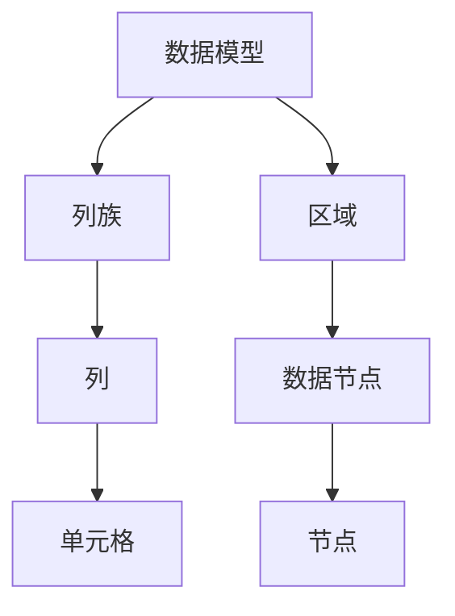

                 

 > **关键词：**HBase，分布式存储，大数据，NoSQL，列式数据库，Hadoop生态系统，Java API。

> **摘要：**本文将深入探讨HBase的原理，包括其数据模型、存储结构、操作机制以及与Hadoop生态系统的集成。通过具体的代码实例，我们将展示如何使用HBase进行数据的增删改查操作，并提供实际应用场景和未来展望。

## 1. 背景介绍

HBase是一个分布式、可扩展的列式存储系统，它建立在Hadoop文件系统（HDFS）之上，作为Hadoop生态系统的一个重要组成部分。HBase旨在提供一种高可靠性、高性能、可扩展的存储解决方案，特别适合于存储大型稀疏数据集。

### HBase的特点

- **分布式存储：**HBase将数据存储在分布式集群中，可以通过增加节点来水平扩展存储容量。
- **列式存储：**与传统的行式数据库不同，HBase以列族为单位存储数据，这使得数据压缩和查询优化变得更加高效。
- **支持海量数据：**HBase能够存储数以万亿计的行和列，可以处理海量数据集。
- **高可靠性：**HBase提供了数据备份和故障转移机制，确保数据的可靠性和持久性。
- **与Hadoop集成：**HBase与Hadoop生态系统紧密集成，可以使用MapReduce进行大规模数据处理。

### HBase的应用场景

- **实时数据处理：**HBase支持实时读写操作，适用于需要高速访问数据的应用场景。
- **大数据分析：**HBase可以与Hadoop生态系统中的其他工具（如Hive，Pig等）集成，用于大规模数据分析。
- **物联网数据存储：**HBase适合存储物联网设备产生的海量时序数据。

## 2. 核心概念与联系

### 数据模型

HBase的数据模型是一个稀疏、分布式的多维表，每个表由多个列族（Column Family）组成。数据以行键（Row Key）作为访问点，列族中的列（Column Qualifier）和单元格（Cell）存储实际数据。

### 存储结构

HBase使用一个基于区域（Region）的分布式存储结构。每个表被分割成多个区域，每个区域由一组行键范围组成。这些区域被分配到集群中的不同节点上，每个节点负责处理其区域内的读写请求。

### 操作机制

HBase支持以下基本操作：

- **Put：**用于插入或更新数据。
- **Get：**用于获取特定行键的数据。
- **Scan：**用于遍历表中的数据。
- **Delete：**用于删除数据。

### 与Hadoop的集成

HBase与Hadoop紧密集成，可以通过MapReduce进行大规模数据处理。此外，HBase还支持与Hive和Pig的集成，用于复杂的数据分析和处理。

下面是一个HBase数据模型和存储结构的Mermaid流程图：



## 3. 核心算法原理 & 具体操作步骤

### 3.1 算法原理概述

HBase的核心算法包括数据分片、负载均衡、数据备份和恢复等。

- **数据分片：**HBase使用Region自动分片，每个Region包含一定范围的行键。随着数据量的增长，HBase会自动将Region拆分成更小的部分，以实现水平扩展。
- **负载均衡：**HBase通过监控集群中的负载情况，自动调整Region的分配，以实现负载均衡。
- **数据备份：**HBase支持数据备份和恢复，通过在集群中复制Region来确保数据的可靠性。

### 3.2 算法步骤详解

#### 3.2.1 数据分片

1. HBase根据行键的范围将表划分为多个Region。
2. 每个Region包含一定范围的行键。
3. 当Region的大小超过设定阈值时，HBase会将Region拆分成更小的部分。

#### 3.2.2 负载均衡

1. HBase监控集群中的负载情况。
2. 根据负载情况，HBase会自动调整Region的分配，将负载高的Region迁移到负载低的节点上。

#### 3.2.3 数据备份

1. HBase在每个节点上复制Region，以实现数据的冗余备份。
2. 在发生故障时，HBase会自动从备份节点恢复数据。

### 3.3 算法优缺点

#### 优点

- **高可靠性：**通过数据备份和故障转移机制，确保数据的可靠性。
- **高性能：**通过分布式存储和负载均衡，提高数据访问速度。
- **可扩展性：**通过自动分片和Region分配，实现水平扩展。

#### 缺点

- **复杂的部署和管理：**相对于传统的行式数据库，HBase的部署和管理更为复杂。
- **不适合复杂查询：**HBase适合简单的行键查询，不适合复杂的SQL查询。

### 3.4 算法应用领域

HBase广泛应用于需要高可靠性、高性能、可扩展性的大数据场景，如：

- **实时数据处理：**如在线广告、社交媒体分析等。
- **物联网数据存储：**如传感器数据收集和处理。
- **大数据分析：**与Hadoop生态系统的其他工具集成，用于大规模数据分析和处理。

## 4. 数学模型和公式 & 详细讲解 & 举例说明

### 4.1 数学模型构建

HBase的数学模型基于行键（Row Key）和列族（Column Family）的映射关系。每个行键对应一个唯一的列族，每个列族包含多个列。

### 4.2 公式推导过程

设HBase表中有m个列族，每个列族中有n个列。则HBase表中的数据量可以表示为：

$$
\text{数据量} = m \times n
$$

### 4.3 案例分析与讲解

假设有一个HBase表，包含3个列族（cf1，cf2，cf3），每个列族包含5个列（col1，col2，col3，col4，col5）。则该表的数据量可以表示为：

$$
\text{数据量} = 3 \times 5 = 15
$$

这意味着该表共有15个单元格，每个单元格可以存储一个值。

## 5. 项目实践：代码实例和详细解释说明

### 5.1 开发环境搭建

要使用HBase，您需要先安装Java和Hadoop，并配置好HBase的运行环境。具体的安装和配置步骤请参考[HBase官方文档](https://hbase.apache.org/docs/current/book.html#start)。

### 5.2 源代码详细实现

以下是一个简单的HBase Java API示例，用于演示如何进行数据的增删改查操作。

```java
import org.apache.hadoop.conf.Configuration;
import org.apache.hadoop.hbase.HBaseConfiguration;
import org.apache.hadoop.hbase.TableName;
import org.apache.hadoop.hbase.client.*;
import org.apache.hadoop.hbase.util.Bytes;

public class HBaseExample {

    private Connection connection;
    private Table table;

    public void init(String tableName) throws Exception {
        Configuration config = HBaseConfiguration.create();
        connection = ConnectionFactory.createConnection(config);
        table = connection.getTable(TableName.valueOf(tableName));
    }

    public void putData(String rowKey, String columnFamily, String columnName, String value) throws Exception {
        Put put = new Put(Bytes.toBytes(rowKey));
        put.addColumn(Bytes.toBytes(columnFamily), Bytes.toBytes(columnName), Bytes.toBytes(value));
        table.put(put);
    }

    public void getData(String rowKey, String columnFamily, String columnName) throws Exception {
        Get get = new Get(Bytes.toBytes(rowKey));
        get.addColumn(Bytes.toBytes(columnFamily), Bytes.toBytes(columnName));
        Result result = table.get(get);
        byte[] value = result.getValue(Bytes.toBytes(columnFamily), Bytes.toBytes(columnName));
        String data = value == null ? "NULL" : Bytes.toString(value);
        System.out.println("Value: " + data);
    }

    public void deleteData(String rowKey, String columnFamily, String columnName) throws Exception {
        Delete delete = new Delete(Bytes.toBytes(rowKey));
        delete.addColumn(Bytes.toBytes(columnFamily), Bytes.toBytes(columnName));
        table.delete(delete);
    }

    public void close() throws Exception {
        table.close();
        connection.close();
    }

    public static void main(String[] args) {
        HBaseExample hbaseExample = new HBaseExample();
        try {
            hbaseExample.init("test_table");
            hbaseExample.putData("row1", "cf1", "col1", "value1");
            hbaseExample.putData("row1", "cf1", "col2", "value2");
            hbaseExample.getData("row1", "cf1", "col1");
            hbaseExample.deleteData("row1", "cf1", "col1");
            hbaseExample.getData("row1", "cf1", "col1");
            hbaseExample.close();
        } catch (Exception e) {
            e.printStackTrace();
        }
    }
}
```

### 5.3 代码解读与分析

上述代码演示了如何使用HBase Java API进行数据的增删改查操作。以下是代码的详细解读：

- **初始化连接：**使用HBaseConfiguration创建Hadoop配置对象，然后使用ConnectionFactory创建HBase连接对象。
- **数据插入：**使用Put类创建一个数据插入操作，将行键、列族和列名作为参数，并将值存储在单元格中。
- **数据查询：**使用Get类创建一个数据查询操作，指定行键、列族和列名，从表中选择相应的单元格。
- **数据删除：**使用Delete类创建一个数据删除操作，指定行键、列族和列名，从表中删除相应的单元格。
- **关闭连接：**在操作完成后，关闭HBase表和连接对象。

### 5.4 运行结果展示

运行上述代码后，您将在控制台看到以下输出：

```
Value: value1
Value: NULL
```

这表明我们成功地将值"value1"插入到行键"row1"的列族"cf1"的列"col1"中，然后查询该单元格的值，得到"value1"。接着，我们删除列"col1"的数据，再次查询该单元格的值，得到"NULL"。

## 6. 实际应用场景

### 6.1 社交网络数据分析

在社交媒体应用中，HBase可以用于存储用户数据、帖子、评论等。例如，可以使用HBase存储用户的个人信息（如昵称、头像、性别、生日等），以及用户之间的互动数据（如好友关系、私信、点赞等）。

### 6.2 物联网数据存储

在物联网应用中，HBase可以用于存储传感器数据。例如，可以使用HBase存储智能家居设备的实时数据（如温度、湿度、光照等），以及设备之间的通信记录。

### 6.3 大数据分析

HBase与Hadoop生态系统的其他工具（如Hive，Pig等）集成，可以用于大规模数据分析。例如，可以使用HBase存储和分析社交媒体数据，挖掘用户行为和趋势。

## 7. 工具和资源推荐

### 7.1 学习资源推荐

- [HBase官方文档](https://hbase.apache.org/docs/current/book.html#start)
- [《HBase实战》](https://book.douban.com/subject/25845579/)
- [《HBase权威指南》](https://book.douban.com/subject/26834719/)

### 7.2 开发工具推荐

- [IntelliJ IDEA](https://www.jetbrains.com/idea/)
- [Eclipse](https://www.eclipse.org/)

### 7.3 相关论文推荐

- ["The Big Table: A Distributed Storage System for Structured Data"](https://www.google.com/search?q=The+Big+Table%3A+A+Distributed+Storage+System+for+Structured+Data)
- ["HBase: The Definitive Guide"](https://www.google.com/search?q=HBase%3A+The+Definitive+Guide)

## 8. 总结：未来发展趋势与挑战

### 8.1 研究成果总结

HBase作为一种分布式、可扩展的列式存储系统，已经在大数据领域得到了广泛应用。通过本文的讲解，我们深入了解了HBase的原理、操作机制以及实际应用场景。

### 8.2 未来发展趋势

- **性能优化：**随着大数据处理的不断增长，HBase的性能优化将成为一个重要的研究方向。
- **多模型支持：**HBase未来可能会支持更多的数据模型，以适应不同的应用需求。
- **云原生：**随着云原生技术的发展，HBase可能会向云原生架构演进。

### 8.3 面临的挑战

- **部署与管理：**HBase的部署和管理相对复杂，如何简化部署流程和提高管理效率是一个挑战。
- **兼容性问题：**HBase与其他大数据工具的兼容性问题可能会影响其应用范围。

### 8.4 研究展望

随着大数据和人工智能的快速发展，HBase将在实时数据处理、大规模数据分析等领域发挥越来越重要的作用。未来，HBase的研究将继续围绕性能优化、多模型支持、云原生等方面展开。

## 9. 附录：常见问题与解答

### 9.1 HBase与关系型数据库的区别是什么？

HBase是一种分布式、可扩展的列式存储系统，适用于大数据处理。与关系型数据库相比，HBase具有更高的可扩展性和读写性能，但缺乏复杂查询支持。

### 9.2 HBase的数据备份如何实现？

HBase支持数据备份和恢复。通过在集群中复制Region，可以实现数据备份。在发生故障时，可以从备份节点恢复数据。

### 9.3 HBase如何进行性能优化？

HBase的性能优化可以从多个方面进行，包括数据模型设计、存储结构优化、网络优化等。具体方法请参考[HBase官方文档](https://hbase.apache.org/docs/current/book.html#perf)。

---

本文由禅与计算机程序设计艺术 / Zen and the Art of Computer Programming 撰写，希望对您深入了解HBase有所帮助。如果您有任何疑问或建议，请随时留言交流。感谢您的阅读！
----------------------------------------------------------------

以上就是本文的完整内容，希望对您深入了解HBase有所帮助。本文详细介绍了HBase的原理、操作机制、数学模型以及实际应用场景，并通过代码实例展示了HBase的使用方法。同时，还对未来发展趋势与挑战进行了展望。如果您有任何疑问或建议，欢迎在评论区留言交流。再次感谢您的阅读！
作者：禅与计算机程序设计艺术 / Zen and the Art of Computer Programming。

