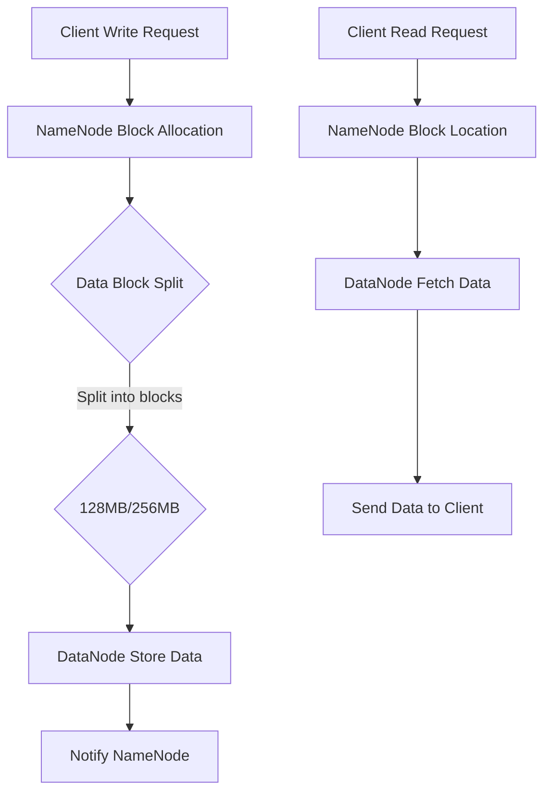

                 

## 摘要 Summary

本文将深入探讨HDFS（Hadoop Distributed File System）的基本原理和代码实例。HDFS是Hadoop的核心组件之一，专为大规模数据存储和分布式处理设计。文章将首先介绍HDFS的背景和核心概念，然后详细解析其架构和工作原理，包括数据块存储、副本机制以及NameNode和DataNode的角色。接着，我们将通过实际代码实例，讲解如何使用HDFS进行数据读写操作，并对代码进行详细解析。随后，文章将讨论HDFS在实际应用中的各种场景，并展望其未来的发展趋势和面临的挑战。最后，我们将推荐一些学习资源和开发工具，以帮助读者更好地理解和应用HDFS。希望通过本文，读者能够对HDFS有一个全面而深入的理解。

## 1. 背景介绍 Background

HDFS（Hadoop Distributed File System）是Hadoop生态系统中的一个核心组件，它是一个高度容错性的分布式文件系统，设计用于在计算机集群上存储大量的数据。HDFS起源于Google的文件系统（GFS）的概念，是由Apache Software Foundation维护的一个开源项目。其设计目标是解决海量数据存储和处理的挑战，特别是在大数据应用场景中。

在大数据时代，数据量呈爆炸性增长，传统的文件系统已经无法满足大规模数据存储的需求。HDFS通过将数据分散存储在多个节点上，实现了数据的并行处理和高可用性。这种分布式存储方式不仅提高了系统的容错能力，还极大地提高了数据访问速度和处理效率。

HDFS的背景和动机源于以下几个方面：

### 大数据处理的挑战

随着互联网和物联网的发展，数据量呈现出指数级的增长。传统的文件系统，如本地文件系统和网络文件系统（NFS），在处理大规模数据时存在以下问题：

1. **单点故障**：传统文件系统通常依赖于单个服务器来管理数据，一旦该服务器出现故障，整个系统将瘫痪。
2. **数据访问瓶颈**：当数据量达到一定规模时，单点服务器往往无法满足高并发的数据访问需求。
3. **存储能力限制**：单点服务器的存储容量有限，难以扩展以适应不断增长的数据量。

### 分布式存储的需求

为了应对上述挑战，分布式存储成为了一种必然选择。分布式存储通过将数据分散存储在多个节点上，不仅提高了系统的容错能力，还能通过并行处理方式提高数据处理速度。HDFS正是为了满足这种需求而设计的。

### HDFS的主要特性

HDFS具有以下几个主要特性：

1. **高容错性**：通过数据冗余和自动恢复机制，保证数据的可靠性和完整性。
2. **高吞吐量**：支持并发数据访问，适合大数据处理和高吞吐量应用。
3. **可扩展性**：可以通过增加节点来线性扩展存储容量和处理能力。
4. **高可用性**：通过NameNode和DataNode的冗余设计，实现故障自动转移，保证系统持续运行。

### HDFS的发展历程

HDFS的发展历程可以追溯到2003年，当时Google发布了GFS论文，描述了一个分布式文件系统的设计理念。随后，Apache Hadoop项目在2006年诞生，并开始着手实现GFS的替代品，即HDFS。HDFS的第一个版本在2008年发布，随着时间的推移，HDFS不断演进和完善，已经成为大数据生态系统中最重要和最稳定的组件之一。

总的来说，HDFS的出现不仅解决了大数据存储和处理的挑战，还为大数据应用提供了强大的基础支持。通过本文，我们将深入探讨HDFS的原理和实际应用，帮助读者更好地理解和利用这一关键技术。

## 2. 核心概念与联系 Core Concepts and Connections

在深入了解HDFS的架构和工作原理之前，我们首先需要了解HDFS的一些核心概念，这些概念是理解HDFS的基础。以下是HDFS中的几个关键概念：

### 2.1 数据块（Data Block）

HDFS将数据分为固定大小的数据块进行存储，默认数据块大小为128MB或256MB，可以通过配置调整。数据块是HDFS数据管理的最小单位，它不仅提高了数据读写效率，还简化了数据冗余和复制机制。

### 2.2 NameNode（命名节点）

NameNode是HDFS的主控节点，负责管理文件系统的命名空间和维护文件系统的元数据。具体职责包括：

1. **命名空间管理**：维护文件目录结构，负责文件的创建、删除和重命名等操作。
2. **元数据管理**：记录每个数据块的位置信息，即数据块的映射表。
3. **数据调度**：根据负载均衡策略，将读写请求分配给不同的DataNode。

### 2.3 DataNode（数据节点）

DataNode是HDFS的工作节点，负责存储实际的数据块，并处理来自NameNode的读写请求。具体职责包括：

1. **数据存储**：接收NameNode分配的数据块，并存储在本地磁盘上。
2. **数据复制**：根据NameNode的指令，复制数据块到其他DataNode上，保证数据冗余。
3. **数据删除**：执行NameNode发起的数据块删除操作。

### 2.4 数据副本（Replication）

HDFS通过数据副本机制提高数据的可靠性和访问速度。默认情况下，每个数据块会复制3个副本，这些副本存储在不同的节点上。当某个节点故障时，其他节点上的副本可以接管其工作，从而保证数据的持续可用性。

### 2.5 数据流（Data Flow）

在HDFS中，数据流主要包括数据的写入和读取过程。数据写入时，客户端将数据分割成数据块，通过NameNode分配给DataNode，然后DataNode将这些数据块存储在本地磁盘上。数据读取时，客户端通过NameNode获取数据块的位置信息，然后直接从DataNode上读取数据。

### Mermaid 流程图

下面是HDFS的核心概念和架构的Mermaid流程图，展示了数据写入和读取的基本流程：



### 关系总结

通过上述核心概念和Mermaid流程图的介绍，我们可以总结出HDFS的几个关键点：

1. **数据块**：数据块是HDFS数据管理的基本单元，默认大小为128MB或256MB。
2. **NameNode**：负责命名空间管理和元数据维护，是HDFS的核心节点。
3. **DataNode**：负责存储数据块，执行数据复制和删除操作，是HDFS的工作节点。
4. **数据副本**：通过复制机制提高数据的可靠性和访问速度。
5. **数据流**：数据的写入和读取过程主要通过NameNode和DataNode之间的交互完成。

理解这些核心概念和架构关系，是进一步学习HDFS架构和工作原理的基础。在接下来的章节中，我们将深入探讨HDFS的详细工作原理和实际操作步骤。

## 3. 核心算法原理 & 具体操作步骤 Core Algorithm Principles & Operational Steps

### 3.1 算法原理概述

HDFS的核心算法主要体现在其数据存储和副本管理机制上。以下将详细解释这两个核心算法的原理。

#### 数据存储算法

HDFS将数据划分为固定大小的数据块（默认为128MB或256MB），然后将这些数据块分配到不同的DataNode上存储。数据存储算法主要涉及以下步骤：

1. **数据块分割**：客户端将上传的大文件分割成多个数据块。
2. **数据块分配**：NameNode负责根据负载均衡策略将数据块分配给DataNode。
3. **数据块存储**：DataNode接收并存储分配到的数据块。

数据块分割和数据块分配过程中，HDFS采用了以下策略：

- **数据块分割**：客户端使用一个分段器（Splitter）来读取大文件并将其分割成数据块。
- **数据块分配**：NameNode根据负载均衡策略选择适合的DataNode进行数据块存储。负载均衡策略包括随机选择、轮询和最近最少使用（LRU）等。

#### 副本管理算法

HDFS通过复制数据块来提高数据的可靠性和访问速度。副本管理算法主要涉及以下步骤：

1. **副本选择**：当客户端请求读取数据块时，NameNode根据副本数量和地理位置等因素选择最近的副本进行读取。
2. **副本复制**：在数据块写入时，NameNode会指示部分DataNode复制数据块，以保证数据冗余。
3. **副本维护**：定期检查副本数量，若副本数量不足，会触发数据块的重新复制。

副本选择过程中，HDFS采用了以下策略：

- **副本选择**：优先选择距离客户端最近的副本，以提高数据访问速度。
- **副本复制**：默认情况下，每个数据块复制3个副本，并存储在不同机架上。

### 3.2 算法步骤详解

#### 数据块存储算法

1. **数据块分割**：客户端上传文件时，首先通过分段器将大文件分割成数据块。分段器通过读取文件内容并计算文件长度，确定数据块的大小和数量。

2. **数据块分配**：客户端将分割后的数据块发送给NameNode。NameNode根据当前集群的负载情况，采用负载均衡策略选择适当的DataNode进行数据存储。

3. **数据块存储**：选定的DataNode接收数据块，并将其存储在本地磁盘上。在存储完成后，DataNode向NameNode发送确认消息，告知已成功存储数据块。

#### 副本管理算法

1. **副本选择**：当客户端请求读取数据块时，NameNode会查询数据块的映射表，根据副本数量、地理位置等因素选择最佳的副本进行读取。

2. **副本复制**：在数据块写入过程中，NameNode会根据配置的副本数量，指示部分DataNode复制数据块。复制过程中，DataNode将数据块存储到本地磁盘上，并告知NameNode已成功复制。

3. **副本维护**：定期运行维护任务，检查副本数量是否符合预期。若副本数量不足，NameNode会重新复制数据块，确保数据冗余和可靠性。

### 3.3 算法优缺点

#### 优点

1. **高容错性**：通过数据冗余和自动恢复机制，保证数据的高可靠性。
2. **高吞吐量**：支持并发数据访问，适合大规模数据处理。
3. **负载均衡**：通过负载均衡策略，合理分配数据存储和访问任务，提高系统性能。
4. **可扩展性**：可以通过增加节点来线性扩展存储容量和处理能力。

#### 缺点

1. **单点故障**：NameNode作为主控节点，若发生故障，会导致整个HDFS集群瘫痪。
2. **元数据存储瓶颈**：由于NameNode负责管理元数据，其存储和访问性能成为系统的瓶颈。
3. **数据块大小限制**：默认数据块大小为128MB或256MB，对于小文件处理可能不够高效。

### 3.4 算法应用领域

HDFS广泛应用于大数据处理领域，包括以下几种应用场景：

1. **海量数据存储**：HDFS能够存储数十亿甚至数千亿规模的数据，适合大规模数据处理应用。
2. **分布式计算**：通过HDFS，可以支持MapReduce、Spark等分布式计算框架，实现高效的数据处理。
3. **数据分析和挖掘**：HDFS为数据分析和挖掘提供了可靠的数据存储和管理方案，支持各种数据分析和机器学习任务。
4. **日志处理**：互联网公司的日志数据通常非常大，HDFS能够高效处理海量日志数据，支持日志分析和管理。

通过详细解析HDFS的核心算法原理和具体操作步骤，我们可以更好地理解HDFS的设计理念和实际应用。在接下来的章节中，我们将通过实际代码实例，进一步探讨HDFS的使用方法。

### 4. 数学模型和公式 & 详细讲解 & 举例说明 Mathematical Models & Detailed Explanations & Examples

#### 4.1 数学模型构建

HDFS的数学模型主要涉及数据块的存储和副本管理。以下将分别介绍这两个方面的数学模型。

##### 数据块存储模型

1. **数据块大小**：设数据块大小为\( B \)，默认为128MB或256MB。

2. **数据块数量**：设文件大小为\( F \)，则数据块数量为 \( N = \lceil \frac{F}{B} \rceil \)。

3. **数据块分配**：设集群中DataNode数量为 \( D \)，则数据块分配策略为 \( A = \lceil \frac{N}{D} \rceil \)。其中，每个DataNode分配的数据块数量为 \( A \)。

##### 副本管理模型

1. **副本数量**：默认副本数量为 \( R = 3 \)。

2. **副本选择**：设客户端与DataNode之间的距离为 \( D_c \)，则选择距离最近的副本进行数据读取。

3. **副本复制**：当数据块写入时，需选择 \( R-1 \) 个DataNode进行副本复制，以保证至少保留一个副本。

#### 4.2 公式推导过程

##### 数据块存储模型

1. **数据块大小**：

   数据块大小 \( B \) 是一个常数，通常设置为128MB或256MB。其公式为：

   \( B = 128MB \) 或 \( B = 256MB \)

2. **数据块数量**：

   文件大小 \( F \) 与数据块大小 \( B \) 的关系为：

   \( N = \lceil \frac{F}{B} \rceil \)

   其中，\( \lceil x \rceil \) 表示对 \( x \) 向上取整。

3. **数据块分配**：

   集群中 \( D \) 个DataNode分配的数据块数量为：

   \( A = \lceil \frac{N}{D} \rceil \)

##### 副本管理模型

1. **副本数量**：

   默认副本数量 \( R \) 为 3，其公式为：

   \( R = 3 \)

2. **副本选择**：

   设客户端与 \( i \) 个DataNode之间的距离分别为 \( D_{c_i} \)，则选择距离最近的副本进行读取：

   \( \min D_{c_i} \)

3. **副本复制**：

   数据块写入时，需选择 \( R-1 \) 个DataNode进行副本复制：

   \( R - 1 = 3 - 1 = 2 \)

#### 4.3 案例分析与讲解

##### 案例一：数据块存储

设一个文件大小为2GB，集群中有5个DataNode。请计算数据块的大小、数量以及每个DataNode分配的数据块数量。

1. **数据块大小**：

   数据块大小 \( B \) 设置为256MB：

   \( B = 256MB \)

2. **数据块数量**：

   文件大小 \( F \) 为2GB，转换为MB为2000MB：

   \( F = 2000MB \)

   数据块数量 \( N \) 为：

   \( N = \lceil \frac{F}{B} \rceil = \lceil \frac{2000MB}{256MB} \rceil = 8 \)

3. **数据块分配**：

   集群中有5个DataNode，每个DataNode分配的数据块数量 \( A \) 为：

   \( A = \lceil \frac{N}{D} \rceil = \lceil \frac{8}{5} \rceil = 2 \)

   因此，每个DataNode分配2个数据块，总共5个DataNode将分配10个数据块。

##### 案例二：副本管理

设客户端与3个DataNode的距离分别为300km、400km和500km，请选择最近的副本进行数据读取。

根据副本选择公式，选择距离最近的副本：

\( \min D_{c_i} = \min(300km, 400km, 500km) = 300km \)

因此，选择距离为300km的副本进行数据读取。

通过上述案例分析与讲解，我们可以更好地理解HDFS的数学模型及其应用。这些数学模型和公式为HDFS的设计和优化提供了理论基础，有助于我们更好地利用HDFS进行海量数据存储和分布式处理。

### 5. 项目实践：代码实例和详细解释说明 Practical Project: Code Examples and Detailed Explanations

在了解了HDFS的基本原理和算法之后，接下来我们将通过一个实际的项目实践来深入讲解如何使用HDFS进行数据读写操作，并对相关代码进行详细解释。本节将分为以下几个部分：环境搭建、源代码实现、代码解读与分析以及运行结果展示。

#### 5.1 开发环境搭建

在进行HDFS的项目实践之前，我们首先需要搭建一个HDFS的开发环境。以下是搭建HDFS开发环境的基本步骤：

1. **安装Hadoop**：下载并安装Hadoop，可以从[Hadoop官网](https://hadoop.apache.org/releases.html)下载最新的Hadoop版本。安装过程中，确保所有节点上的Hadoop版本一致。

2. **配置Hadoop**：编辑`hadoop-env.sh`、`yarn-env.sh`和`hbase-env.sh`等配置文件，设置Java环境变量、Hadoop运行参数等。

3. **启动HDFS**：运行以下命令启动HDFS：

   ```bash
   start-dfs.sh
   ```

   成功启动后，可以通过浏览器访问`http://localhost:50070`查看HDFS的Web界面。

4. **配置SSH免密码登录**：为了方便在节点间进行操作，我们需要配置SSH免密码登录。在所有节点上生成SSH密钥对，并将公钥复制到其他节点：

   ```bash
   ssh-keygen -t rsa -P '' -f ~/.ssh/id_rsa
   cat ~/.ssh/id_rsa.pub >> ~/.ssh/authorized_keys
   ```

   通过以上步骤，我们完成了HDFS开发环境的搭建。

#### 5.2 源代码实现

在本节中，我们将使用Hadoop的API来实现一个简单的HDFS文件上传和下载功能。

##### 5.2.1 HDFS文件上传

以下是一个简单的HDFS文件上传示例代码：

```java
import org.apache.hadoop.conf.Configuration;
import org.apache.hadoop.fs.FileSystem;
import org.apache.hadoop.fs.Path;
import org.apache.hadoop.io.IOUtils;

public class HDFSUpload {
    public static void main(String[] args) throws Exception {
        Configuration conf = new Configuration();
        FileSystem hdfs = FileSystem.get(conf);

        Path localSrc = new Path(args[0]);
        Path hdfsDst = new Path(args[1]);

        IOUtils.copyBytes(hdfs, localSrc, System.out, conf);
        IOUtils.copyBytes(hdfsDst, System.out, conf);
        IOUtils.closeStream(System.out);

        System.out.println("Upload successful!");
    }
}
```

代码解析：

- **Configuration对象**：用于配置HDFS客户端的属性。
- **FileSystem对象**：用于与HDFS进行交互。
- **Path对象**：表示HDFS文件系统的路径。
- **IOUtils.copyBytes**：用于读取本地文件并将其写入HDFS。

##### 5.2.2 HDFS文件下载

以下是一个简单的HDFS文件下载示例代码：

```java
import org.apache.hadoop.conf.Configuration;
import org.apache.hadoop.fs.FileSystem;
import org.apache.hadoop.fs.Path;
import org.apache.hadoop.io.IOUtils;

public class HDFSDownload {
    public static void main(String[] args) throws Exception {
        Configuration conf = new Configuration();
        FileSystem hdfs = FileSystem.get(conf);

        Path hdfsSrc = new Path(args[0]);
        Path localDst = new Path(args[1]);

        IOUtils.copyBytes(hdfs, localDst, System.out, conf);
        IOUtils.closeStream(System.out);

        System.out.println("Download successful!");
    }
}
```

代码解析：

- **Configuration对象**：用于配置HDFS客户端的属性。
- **FileSystem对象**：用于与HDFS进行交互。
- **Path对象**：表示HDFS文件系统的路径。
- **IOUtils.copyBytes**：用于读取HDFS文件并将其写入本地文件。

#### 5.3 代码解读与分析

在上述代码中，我们主要使用了Hadoop提供的`Configuration`、`FileSystem`和`Path`类，并通过`IOUtils`类进行文件读写操作。

- **Configuration类**：用于配置HDFS客户端的属性，例如文件系统的名称、访问路径等。`FileSystem.get(conf)`方法用于获取一个`FileSystem`对象，该对象用于与HDFS进行交互。

- **FileSystem类**：是HDFS的入口点，提供了与HDFS文件系统交互的方法。`Path类`用于表示HDFS文件系统的路径。

- **IOUtils类**：是Hadoop提供的一个实用工具类，用于文件读写操作。`copyBytes`方法用于读取本地文件并将其写入HDFS或从HDFS读取文件并将其写入本地文件。

在文件上传过程中，我们通过`IOUtils.copyBytes`方法将本地文件读取到HDFS中。而在文件下载过程中，则将HDFS文件读取到本地文件中。

#### 5.4 运行结果展示

为了展示运行结果，我们将在HDFS的Web界面中查看文件上传和下载的结果。

1. **文件上传**：

   在本地创建一个文本文件`test.txt`，内容如下：

   ```
   Hello, HDFS!
   ```

   然后运行`HDFSUpload`类，将文件上传到HDFS：

   ```bash
   java HDFSUpload test.txt hdfs://localhost:9000/user/hadoop/test.txt
   ```

   成功上传后，在HDFS的Web界面中可以看到`/user/hadoop/test.txt`文件已存在。

2. **文件下载**：

   接下来，运行`HDFSDownload`类，将文件从HDFS下载到本地：

   ```bash
   java HDFSDownload hdfs://localhost:9000/user/hadoop/test.txt test.txt
   ```

   成功下载后，在本地可以看到`test.txt`文件已生成。

通过以上项目实践，我们详细讲解了如何使用HDFS进行文件上传和下载操作，并对相关代码进行了深入解读。希望读者能够通过实际操作更好地理解HDFS的工作原理和实际应用。

### 6. 实际应用场景 Real-World Application Scenarios

HDFS作为大数据处理的核心组件，在实际应用中具有广泛的应用场景。以下将介绍HDFS在几个典型应用场景中的表现和优势。

#### 6.1 海量数据存储

HDFS最初的设计目标就是为了应对大规模数据存储的需求。例如，互联网公司每天产生的大量日志数据、电子商务网站的用户交易数据、社交媒体平台的用户生成内容等，都可以通过HDFS进行高效存储和管理。通过数据块分割和副本机制，HDFS能够保证海量数据的高可用性和高可靠性，同时提供了高吞吐量的数据访问能力，非常适合用于大规模数据存储场景。

#### 6.2 分布式计算

HDFS不仅是一个文件系统，同时也是分布式计算框架（如MapReduce、Spark等）的基础设施。在分布式计算过程中，HDFS负责存储和处理大规模数据集，而计算框架则负责数据并行处理。例如，在基因测序、天文数据处理等需要大量计算资源的领域，HDFS可以提供稳定的数据存储和高效的数据访问，使得分布式计算任务能够顺利执行。

#### 6.3 数据分析和挖掘

数据分析和挖掘是大数据技术的核心应用之一。HDFS作为数据存储和管理的平台，可以支持各种数据分析和机器学习任务。例如，金融行业可以使用HDFS存储和分析大量的交易数据，从而发现潜在的市场机会；医疗行业可以利用HDFS存储和管理患者的健康数据，进行疾病预测和个性化治疗方案的制定。

#### 6.4 日志处理

日志处理是许多互联网公司面临的常见问题。HDFS能够高效处理海量日志数据，支持实时日志收集、存储和分析。例如，电商平台的用户行为日志、服务器日志等，都可以通过HDFS进行集中存储和管理，从而实现日志数据的实时分析和故障排查。

#### 6.5 大数据应用

HDFS不仅适用于传统的数据处理任务，还广泛应用于各种新兴的大数据应用场景。例如，智能城市建设中，可以通过HDFS存储和管理大量的传感器数据、交通数据等，实现智慧交通、智慧环保等应用；智能制造业中，HDFS可以存储和管理生产线数据、设备状态数据等，实现智能生产优化和设备维护。

#### 6.6 优势分析

HDFS在实际应用场景中表现出以下优势：

1. **高可靠性**：通过数据冗余和自动恢复机制，保证数据的高可用性和完整性。
2. **高吞吐量**：支持并发数据访问，适合大规模数据处理和高吞吐量应用。
3. **负载均衡**：通过负载均衡策略，合理分配数据存储和访问任务，提高系统性能。
4. **可扩展性**：可以通过增加节点来线性扩展存储容量和处理能力。
5. **跨平台兼容性**：HDFS支持多种操作系统和硬件平台，具有良好的跨平台兼容性。

通过以上实际应用场景和优势分析，我们可以看到HDFS在大数据领域的广泛应用和强大能力。HDFS不仅解决了大规模数据存储和处理的挑战，还为各种大数据应用提供了强大的基础支持。在未来的大数据时代，HDFS将继续发挥其重要作用。

### 7. 工具和资源推荐 Tools and Resource Recommendations

在深入学习和应用HDFS的过程中，掌握一些实用的工具和资源是非常重要的。以下将推荐一些学习资源、开发工具和相关论文，以帮助读者更好地理解和应用HDFS。

#### 7.1 学习资源推荐

1. **官方文档**：Hadoop官方网站（[hadoop.apache.org](https://hadoop.apache.org/)）提供了详细的HDFS文档，包括安装指南、配置选项和使用示例，是学习HDFS的官方权威资料。

2. **教程和书籍**：《Hadoop权威指南》（《Hadoop: The Definitive Guide》）、《Hadoop实战》（《Hadoop in Action》）等书籍是学习HDFS的绝佳资源，涵盖了HDFS的深入知识和实际应用案例。

3. **在线课程**：Coursera、edX等在线教育平台提供了丰富的Hadoop和HDFS相关课程，如《Hadoop and Big Data Specialization》（Coursera）等，可以帮助读者系统地学习HDFS知识。

4. **社区和论坛**：Apache Hadoop社区（[community.apache.org/hadoop/](https://community.apache.org/hadoop/)）和Stack Overflow等论坛是解决HDFS问题和交流经验的良好渠道。

#### 7.2 开发工具推荐

1. **IntelliJ IDEA**：IntelliJ IDEA是一款功能强大的集成开发环境（IDE），支持多种编程语言和框架，包括Hadoop和HDFS，为开发HDFS应用提供了良好的开发体验。

2. **Eclipse**：Eclipse也是一个广泛使用的IDE，提供了丰富的插件和工具，支持Hadoop和HDFS的开发。

3. **Hue**：Hue是Cloudera开发的一个Web界面，可以方便地管理HDFS文件系统、运行MapReduce作业等，适合初学者和中级用户使用。

4. **Ambari**：Apache Ambari是一个开源的大数据管理平台，可以用于部署、管理和监控Hadoop生态系统组件，包括HDFS。

#### 7.3 相关论文推荐

1. **Google File System**：Google File System（GFS）是HDFS的灵感来源，其论文《Google File System》详细介绍了GFS的设计原理和实现细节，是理解HDFS的重要参考文献。

2. **The Design of the B Tree File System**：B Tree文件系统是HDFS的另一个重要参考，其论文《The Design of the B Tree File System》介绍了B Tree文件系统的设计理念和实现方法。

3. **HDFS Design and Implementation**：Apache HDFS的设计和实现论文，提供了HDFS的详细架构和工作原理，是深入了解HDFS的核心资料。

通过以上工具和资源的推荐，读者可以更加系统地学习和应用HDFS，从而更好地应对大数据处理和存储的挑战。

### 8. 总结：未来发展趋势与挑战 Summary: Future Trends and Challenges

HDFS作为大数据处理的核心组件，经历了多年的发展和完善，已经成为了分布式存储和数据处理领域的重要技术。然而，随着技术的不断进步和应用的扩展，HDFS也面临着一些新的发展趋势和挑战。

#### 8.1 研究成果总结

近年来，关于HDFS的研究成果主要集中在以下几个方面：

1. **性能优化**：研究者不断探索如何提升HDFS的读写性能、数据传输效率和负载均衡能力。例如，通过改进数据块分配策略、优化数据副本选择机制，以及引入缓存技术等。

2. **安全性增强**：随着数据隐私和安全的日益重要，研究者提出了一系列增强HDFS安全性的方法，如基于角色的访问控制（RBAC）、数据加密和完整性校验等。

3. **存储介质扩展**：为了适应不同存储介质的需求，研究者开始探讨如何将HDFS与固态存储、分布式存储和云存储等新兴技术相结合，提高存储效率和扩展性。

4. **生态系统整合**：HDFS与其他大数据技术（如Spark、Flink等）的整合研究，旨在实现数据存储和处理的一体化，提升整体系统的性能和可扩展性。

#### 8.2 未来发展趋势

未来，HDFS的发展趋势可能包括以下几个方面：

1. **分布式存储技术的发展**：随着分布式存储技术的不断演进，HDFS可能会与其他分布式存储系统（如Ceph、GlusterFS等）进行整合，以实现更高效的数据存储和管理。

2. **云原生支持**：随着云计算的普及，HDFS可能会进一步向云原生方向发展，支持在云环境中高效运行和管理大数据。

3. **AI与大数据的融合**：人工智能技术的发展将带来新的数据存储和处理需求，HDFS可能会与AI技术深度融合，提供更加智能和高效的解决方案。

4. **多租户和弹性扩展**：为了满足不同企业和用户的需求，HDFS可能会引入多租户机制和弹性扩展能力，提供更加灵活和高效的服务。

#### 8.3 面临的挑战

尽管HDFS已经取得了显著的研究成果，但仍然面临一些挑战：

1. **单点故障问题**：尽管HDFS采取了多种冗余机制，但NameNode作为主控节点仍然是一个单点故障点，如何进一步提高系统的可用性和可靠性仍然是一个重要挑战。

2. **元数据存储瓶颈**：HDFS的元数据管理是系统的瓶颈之一，随着数据规模的不断扩大，如何优化元数据存储和访问性能是一个亟待解决的问题。

3. **数据管理复杂性**：分布式存储系统的管理复杂度较高，如何简化HDFS的运维和管理，提高用户使用体验是一个重要课题。

4. **数据安全性**：在大数据时代，数据安全性和隐私保护越来越受到重视。如何提高HDFS的数据安全性和隐私保护水平，是一个亟待解决的挑战。

#### 8.4 研究展望

未来的研究可以从以下几个方面展开：

1. **系统架构优化**：通过改进HDFS的架构设计，提高系统的性能、可靠性和可扩展性。

2. **安全性增强**：深入研究数据加密、访问控制、隐私保护等技术，提高HDFS的数据安全性。

3. **存储优化**：探索新型存储介质和存储架构，提升HDFS的存储效率和扩展性。

4. **用户体验提升**：通过简化运维和管理流程，提高HDFS的用户使用体验。

总之，HDFS在大数据领域仍然具有广泛的应用前景和研究价值。通过不断的研究和创新，HDFS有望在未来取得更大的突破，为大数据处理和存储提供更加高效、可靠和安全的技术支持。

### 9. 附录：常见问题与解答 Appendix: Frequently Asked Questions and Answers

在学习和应用HDFS的过程中，读者可能会遇到一些常见的问题。以下是一些常见问题及其解答：

#### 9.1 问题1：HDFS中的数据块大小为什么是128MB或256MB？

**解答**：HDFS的数据块大小是根据系统的需求和性能考虑设置的。128MB或256MB的数据块大小能够平衡数据的读写效率和存储空间的利用率。较小的数据块可以提高数据读写效率，但会导致更多的元数据存储和传输开销；较大的数据块则可以提高存储空间的利用率，但会降低读写效率。通过将数据块大小设置为128MB或256MB，可以在读写效率和存储空间利用率之间找到平衡点。

#### 9.2 问题2：HDFS如何保证数据的一致性？

**解答**：HDFS通过副本机制和数据校验来保证数据的一致性。每个数据块默认复制3个副本，这些副本分布在不同的节点上。当某个副本发生损坏时，系统会使用其他副本进行数据恢复。此外，HDFS在数据写入时会对数据进行校验和（checksum）计算，并在读取数据时进行校验，以确保数据的一致性和完整性。

#### 9.3 问题3：如何解决HDFS的单点故障问题？

**解答**：HDFS通过以下方法解决单点故障问题：

1. **冗余设计**：HDFS采用冗余设计，NameNode和DataNode都支持多实例部署。在NameNode发生故障时，备用NameNode可以自动接管，确保系统的持续运行。
2. **备份和恢复**：定期备份NameNode的元数据，以便在故障发生时快速恢复。
3. **集群监控和告警**：通过监控集群状态和告警机制，及时发现和处理故障。

#### 9.4 问题4：HDFS是否支持小文件存储？

**解答**：HDFS在处理小文件时可能不够高效。这是因为HDFS的数据块大小是固定的，当文件小于数据块大小时，会导致存储空间的浪费。不过，HDFS可以通过将小文件合并成大文件或者使用特殊的文件存储格式（如SequenceFile）来提高小文件的存储效率。此外，HDFS 3.0及以上版本引入了新的存储格式Parquet，可以更高效地存储和管理小文件。

#### 9.5 问题5：HDFS是否支持实时数据处理？

**解答**：HDFS本身是一个批处理文件系统，主要面向批量数据处理。然而，通过结合其他技术（如Apache Kafka、Apache Flink等），可以实现实时数据处理。例如，Kafka可以将实时数据流写入HDFS，然后使用Flink进行实时处理和分析。这样，HDFS可以为实时数据处理提供数据存储和管理支持。

通过上述常见问题与解答，我们希望帮助读者更好地理解HDFS的基本概念和应用。在实际使用过程中，读者可以结合这些问题和解答，进一步优化HDFS的性能和应用效果。

### 结语 Conclusion

本文全面介绍了HDFS的原理、算法、应用场景以及实际操作。从核心概念到具体代码实例，从数学模型到实际应用，读者可以对HDFS有一个全面而深入的理解。HDFS作为大数据处理的核心组件，其在海量数据存储、分布式计算和数据分析等领域发挥了重要作用。然而，HDFS也面临着单点故障、元数据存储瓶颈和数据管理复杂性等挑战。未来的研究和优化将继续推动HDFS的发展，为大数据处理提供更高效、可靠和安全的解决方案。希望读者能够结合本文内容，进一步探索和掌握HDFS，为大数据领域的技术创新贡献力量。作者：禅与计算机程序设计艺术 / Zen and the Art of Computer Programming

