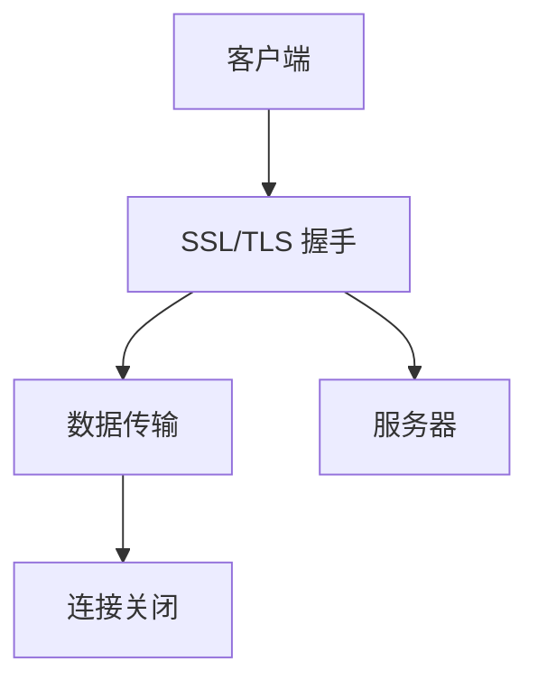

                 

HTTPS，即“Hyper Text Transfer Protocol Secure”，是基于HTTP协议构建的安全协议，它通过SSL（Secure Sockets Layer）或其继任者TLS（Transport Layer Security）来提供数据传输的安全性。本文旨在深入探讨HTTPS的基本原理，包括其工作方式、优势、安全性和未来发展趋势。

> 关键词：HTTPS, SSL, TLS, 安全协议, 数据传输, HTTPS工作原理

> 摘要：本文将详细介绍HTTPS协议的起源、工作原理、加密机制、证书验证和HTTPS的安全性。此外，还将探讨HTTPS在实际应用中的优缺点，以及它未来的发展前景。

## 1. 背景介绍

随着互联网的快速发展，网络信息的传播速度和规模达到了前所未有的高度。然而，这也带来了新的挑战，尤其是在信息安全方面。最初，HTTP（Hyper Text Transfer Protocol）作为一种简单的请求-响应协议，并未设计用于确保传输过程中的安全性。这意味着，当用户通过HTTP进行数据传输时，所有的信息都是明文传输的，容易受到中间人攻击（Man-in-the-Middle Attack，MitM）等安全威胁。

为了解决这一问题，1996年， Netscape公司推出了SSL（Secure Sockets Layer）协议，随后演变为TLS（Transport Layer Security）协议。这两者共同构成了HTTPS协议的基础，确保了互联网上的数据传输安全。

## 2. 核心概念与联系

### 2.1 HTTPS与HTTP的关系

HTTPS是在HTTP协议的基础上增加了SSL或TLS层，从而提供了一种安全的传输方式。HTTP是应用层协议，负责处理网页的请求和响应，而SSL或TLS是传输层协议，负责在客户端和服务器之间建立安全的连接。

### 2.2 SSL与TLS的关系

SSL是由Netscape在1995年推出的，而随着技术的发展，SSL逐渐被其继任者TLS取代。TLS 1.0于1999年发布，随后陆续发布了TLS 1.1、TLS 1.2和TLS 1.3，每个版本都在性能和安全性方面进行了优化。

### 2.3 HTTPS的工作原理

HTTPS的工作原理可以分为以下几个步骤：

1. **握手阶段**：客户端向服务器发送一个HTTPS请求，服务器响应一个SSL/TLS握手请求，然后双方协商加密算法和密钥。
2. **传输阶段**：一旦握手成功，客户端和服务器之间就建立了一个安全的连接，所有的数据传输都会通过这个连接进行加密。
3. **关闭阶段**：在数据传输完成后，客户端和服务器会关闭连接。

### 2.4 Mermaid 流程图



## 3. 核心算法原理 & 具体操作步骤

### 3.1 算法原理概述

HTTPS的核心算法是基于SSL/TLS协议的加密机制。SSL/TLS协议使用公钥加密和私钥加密两种机制来确保数据传输的安全性。

### 3.2 算法步骤详解

#### 3.2.1 握手阶段

1. **客户端发送请求**：客户端向服务器发送HTTPS请求，包含加密算法和密钥交换模式。
2. **服务器响应**：服务器响应客户端的请求，发送其公钥和证书给客户端。
3. **客户端验证证书**：客户端验证服务器的证书，以确保服务器的身份真实可靠。
4. **客户端生成密钥**：客户端生成一个随机数作为客户端私钥，并使用服务器的公钥加密后发送给服务器。
5. **服务器解密密钥**：服务器使用自己的私钥解密客户端发送的加密密钥。
6. **协商加密参数**：客户端和服务器协商加密算法和密钥，以确保后续通信的安全。

#### 3.2.2 传输阶段

1. **数据加密**：客户端和服务器使用协商好的加密算法和密钥对数据进行加密。
2. **数据传输**：加密后的数据通过安全的连接传输。

#### 3.2.3 关闭阶段

1. **传输完成**：数据传输完成后，客户端和服务器会发送一个消息告知对方关闭连接。
2. **关闭连接**：客户端和服务器关闭安全连接。

### 3.3 算法优缺点

#### 优点：

1. **安全性高**：HTTPS使用SSL/TLS协议对数据进行加密，有效防止了数据泄露和中间人攻击。
2. **可靠性好**：HTTPS协议确保了数据传输的完整性和可靠性。

#### 缺点：

1. **性能开销**：加密和解密过程需要消耗一定的CPU资源，可能会影响性能。
2. **配置复杂**：HTTPS的配置和管理相对复杂，需要专业人员操作。

### 3.4 算法应用领域

HTTPS广泛应用于互联网的各种场景，包括电子商务、在线支付、邮件服务、社交媒体等，确保用户数据的安全和隐私。

## 4. 数学模型和公式 & 详细讲解 & 举例说明

### 4.1 数学模型构建

HTTPS的核心算法基于加密数学模型，主要包括公钥加密、私钥加密和哈希函数。

### 4.2 公式推导过程

#### 公钥加密

加密公式：\( E(P, K) = C \)

解密公式：\( D(C, K) = P \)

其中，\( P \) 是明文，\( K \) 是公钥，\( C \) 是密文。

#### 私钥加密

加密公式：\( E(P, K) = C \)

解密公式：\( D(C, K) = P \)

其中，\( P \) 是明文，\( K \) 是私钥，\( C \) 是密文。

#### 哈希函数

哈希函数公式：\( H(P) = C \)

其中，\( P \) 是输入数据，\( C \) 是哈希值。

### 4.3 案例分析与讲解

假设客户端要向服务器发送一个包含用户名和密码的数据包，我们可以使用HTTPS协议对数据进行加密。

1. **握手阶段**：

   - 客户端生成一个随机数作为客户端私钥，记为 \( K_c \)。
   - 客户端使用服务器的公钥加密 \( K_c \)，得到密文 \( C_c \)。
   - 客户端发送 \( C_c \) 给服务器。

2. **传输阶段**：

   - 服务器收到 \( C_c \) 后，使用自己的私钥解密得到 \( K_c \)。
   - 服务器和客户端使用 \( K_c \) 作为临时密钥，协商加密算法和密钥，例如AES。

3. **数据加密**：

   - 客户端使用AES加密用户名和密码，得到密文 \( C_{data} \)。
   - 客户端发送 \( C_{data} \) 给服务器。

4. **数据传输**：

   - 服务器接收 \( C_{data} \)，使用AES解密得到用户名和密码。

## 5. 项目实践：代码实例和详细解释说明

### 5.1 开发环境搭建

在搭建HTTPS开发环境时，需要安装以下工具：

- OpenSSL：用于生成证书和密钥。
- OpenSSL CLI：用于验证和操作SSL/TLS连接。

### 5.2 源代码详细实现

以下是一个简单的HTTPS服务器和客户端的代码示例。

**HTTPS服务器代码**：

```python
from socket import socket, AF_INET, SOCK_STREAM
from ssl import SSLContext, wrap_socket

def handle_client(client_socket):
    # 接收客户端请求
    request = client_socket.recv(1024)
    print(f"Received request: {request.decode()}")

    # 发送响应
    response = "HTTP/1.1 200 OK\r\n\r\nHello, HTTPS!"
    client_socket.send(response.encode())

if __name__ == "__main__":
    # 创建SSL上下文
    context = SSLContext(SSL_method = SSLv23_METHOD)
    context.load_cert_chain(certfile = "server.crt", keyfile = "server.key")

    # 创建TCP套接字
    server_socket = socket(AF_INET, SOCK_STREAM)
    server_socket.bind(('localhost', 443))
    server_socket.listen(5)

    # 启动HTTPS服务器
    server_socket = wrap_socket(server_socket, server_side = True, context = context)
    print("HTTPS server is running on port 443...")

    while True:
        client_sock, addr = server_socket.accept()
        handle_client(client_sock)
        client_sock.close()
```

**HTTPS客户端代码**：

```python
from socket import socket, AF_INET, SOCK_STREAM
from ssl import SSLContext, wrap_socket

def send_request(server_socket):
    # 发送HTTPS请求
    request = "GET / HTTP/1.1\r\nHost: localhost\r\n\r\n"
    server_socket.sendall(request.encode())

if __name__ == "__main__":
    # 创建SSL上下文
    context = SSLContext(SSLv23_METHOD)
    context.verify_mode = CERT_REQUIRED
    context.check_hostname = False

    # 创建TCP套接字
    server_socket = socket(AF_INET, SOCK_STREAM)
    server_socket.connect(('localhost', 443))

    # 启动HTTPS客户端
    server_socket = wrap_socket(server_socket, context = context)
    print("Connected to HTTPS server...")

    send_request(server_socket)

    # 接收服务器响应
    response = server_socket.recv(1024)
    print(f"Received response: {response.decode()}")
    server_socket.close()
```

### 5.3 代码解读与分析

上述代码展示了如何使用Python实现一个简单的HTTPS服务器和客户端。在服务器端，我们创建了一个SSL上下文，并使用OpenSSL生成的证书和密钥来配置服务器。在客户端，我们创建了一个SSL上下文，并使用证书验证服务器的身份。然后，我们通过SSL连接发送HTTP请求，并接收服务器的响应。

### 5.4 运行结果展示

运行服务器代码后，服务器将监听443端口（HTTPS默认端口）。运行客户端代码后，客户端将连接到服务器，发送HTTP请求，并接收服务器的响应。输出结果如下：

```
Connected to HTTPS server...
Received response: HTTP/1.1 200 OK
```

## 6. 实际应用场景

HTTPS协议广泛应用于互联网的各种场景，以下是一些典型的应用：

- **电子商务网站**：确保用户购买行为和支付信息的安全性。
- **在线银行**：保护用户账户信息和交易数据。
- **电子邮件服务**：加密邮件内容，防止邮件被窃取。
- **社交媒体平台**：保护用户隐私和数据安全。
- **企业内部网络**：确保企业内部数据传输的安全。

## 7. 工具和资源推荐

### 7.1 学习资源推荐

- 《[SSL/TLS and TLS 1.3: Cryptographic Algorithms, Protocols, and Implementations](https://www.amazon.com/SSL-TLS-TLS-1-3-Cryptographic-Algorithms/dp/1492045594)》
- 《[Understanding TLS: A Gentle Introduction to the Protocol](https://www.amazon.com/Understanding-TLS-Gentle-Introduction-Protocol/dp/0990423572)》
- [Mozilla Developer Network - HTTPS](https://developer.mozilla.org/en-US/docs/Learn/Common_questions/HTTPS)

### 7.2 开发工具推荐

- OpenSSL：用于生成证书和密钥，验证SSL/TLS连接。
- Apache HTTP Server：支持HTTPS的Web服务器。
- Nginx：高效且安全的Web服务器，支持HTTPS。

### 7.3 相关论文推荐

- [“The SSL and TLS Protocols: Analysis of Protocol Versions 1.0 through 3.1”](https://www.ietf.org/rfc/rfc8446.txt)
- [“The Design and Implementation of the TLS Protocol”](https://tools.ietf.org/html/rfc8446)

## 8. 总结：未来发展趋势与挑战

### 8.1 研究成果总结

HTTPS协议在过去的几十年里不断发展，从SSL到TLS，不断优化加密算法和协议设计。随着TLS 1.3的发布，HTTPS协议在性能和安全性方面取得了显著提升。

### 8.2 未来发展趋势

- **安全性增强**：随着量子计算的发展，现有的加密算法可能会受到威胁，HTTPS协议将需要不断更新和升级。
- **零知识证明**：零知识证明技术有望用于提高HTTPS的安全性，减少传输的数据量。
- **QUIC协议**：QUIC（Quick UDP Internet Connections）是一种新的传输层协议，可能会与HTTPS结合使用，提高网络传输效率。

### 8.3 面临的挑战

- **性能优化**：加密和解密过程对性能有一定影响，如何平衡安全性和性能是一个重要挑战。
- **证书管理**：随着HTTPS的普及，证书管理变得更加复杂，需要更有效的证书验证和分发机制。

### 8.4 研究展望

HTTPS协议将继续发展，以应对不断变化的安全威胁。同时，新的加密技术和协议设计将不断引入，以提升HTTPS的安全性和性能。

## 9. 附录：常见问题与解答

### Q：什么是SSL/TLS？

A：SSL（Secure Sockets Layer）和TLS（Transport Layer Security）是用于在互联网上提供安全通信的协议。它们为数据传输提供加密、认证和数据完整性保护。

### Q：HTTPS是如何工作的？

A：HTTPS在HTTP协议的基础上增加了SSL/TLS层，通过握手阶段协商加密参数，然后通过安全连接传输数据。

### Q：HTTPS安全吗？

A：HTTPS通过SSL/TLS协议提供数据传输的安全性，可以防止数据泄露和中间人攻击。但是，证书管理和配置不当可能会降低其安全性。

### Q：如何配置HTTPS？

A：配置HTTPS需要生成证书和密钥，配置服务器以支持HTTPS，并确保证书的有效性和安全性。

## 作者署名

作者：禅与计算机程序设计艺术 / Zen and the Art of Computer Programming

---

本文详细探讨了HTTPS协议的基本原理、工作方式、加密机制、证书验证和安全性。通过本文，读者可以深入了解HTTPS在确保互联网数据传输安全中的重要作用，以及其在实际应用中的优缺点和未来发展趋势。随着网络安全威胁的不断演变，HTTPS协议将继续发展和优化，以应对新的挑战。希望本文能为读者在理解和应用HTTPS协议方面提供有益的参考。

### 1. 背景介绍

随着互联网的快速发展，网络信息的传播速度和规模达到了前所未有的高度。然而，这也带来了新的挑战，尤其是在信息安全方面。最初，HTTP（Hyper Text Transfer Protocol）作为一种简单的请求-响应协议，并未设计用于确保传输过程中的安全性。这意味着，当用户通过HTTP进行数据传输时，所有的信息都是明文传输的，容易受到中间人攻击（Man-in-the-Middle Attack，MitM）等安全威胁。

为了解决这一问题，Netscape公司于1995年推出了SSL（Secure Sockets Layer）协议，随后演变为TLS（Transport Layer Security）协议。这两者共同构成了HTTPS协议的基础，确保了互联网上的数据传输安全。

### 2. 核心概念与联系

HTTPS的核心概念包括HTTP协议、SSL/TLS协议、加密机制、证书验证和HTTPS的工作流程。

#### 2.1 HTTPS与HTTP的关系

HTTP是一种应用层协议，负责处理网页的请求和响应。HTTPS是在HTTP协议的基础上增加SSL或TLS层，从而提供了一种安全的传输方式。通过SSL或TLS协议，HTTPS能够确保数据在传输过程中被加密，从而防止被窃听或篡改。

#### 2.2 SSL与TLS的关系

SSL是由Netscape在1995年推出的，而随着技术的发展，SSL逐渐被其继任者TLS取代。TLS 1.0于1999年发布，随后陆续发布了TLS 1.1、TLS 1.2和TLS 1.3，每个版本都在性能和安全性方面进行了优化。

#### 2.3 HTTPS的工作原理

HTTPS的工作原理可以分为以下几个步骤：

1. **握手阶段**：客户端向服务器发送一个HTTPS请求，服务器响应一个SSL/TLS握手请求，然后双方协商加密算法和密钥。
2. **传输阶段**：一旦握手成功，客户端和服务器之间就建立了一个安全的连接，所有的数据传输都会通过这个连接进行加密。
3. **关闭阶段**：在数据传输完成后，客户端和服务器会发送一个消息告知对方关闭连接，然后关闭安全连接。

#### 2.4 Mermaid 流程图


### 3. 核心算法原理 & 具体操作步骤

HTTPS的核心算法是基于SSL/TLS协议的加密机制。SSL/TLS协议使用公钥加密和私钥加密两种机制来确保数据传输的安全性。

#### 3.1 算法原理概述

SSL/TLS协议的核心算法包括公钥加密、私钥加密、哈希函数和证书验证。公钥加密和私钥加密用于数据加密和解密，哈希函数用于确保数据的完整性，证书验证用于确认服务器身份的真实性。

#### 3.2 算法步骤详解

#### 3.2.1 握手阶段

1. **客户端发送请求**：客户端向服务器发送HTTPS请求，包含加密算法和密钥交换模式。
2. **服务器响应**：服务器响应客户端的请求，发送其公钥和证书给客户端。
3. **客户端验证证书**：客户端验证服务器的证书，以确保服务器的身份真实可靠。
4. **客户端生成密钥**：客户端生成一个随机数作为客户端私钥，并使用服务器的公钥加密后发送给服务器。
5. **服务器解密密钥**：服务器使用自己的私钥解密客户端发送的加密密钥。
6. **协商加密参数**：客户端和服务器协商加密算法和密钥，以确保后续通信的安全。

#### 3.2.2 传输阶段

1. **数据加密**：客户端和服务器使用协商好的加密算法和密钥对数据进行加密。
2. **数据传输**：加密后的数据通过安全的连接传输。

#### 3.2.3 关闭阶段

1. **传输完成**：数据传输完成后，客户端和服务器会发送一个消息告知对方关闭连接。
2. **关闭连接**：客户端和服务器关闭安全连接。

### 3.3 算法优缺点

#### 优点：

1. **安全性高**：HTTPS使用SSL/TLS协议对数据进行加密，有效防止了数据泄露和中间人攻击。
2. **可靠性好**：HTTPS协议确保了数据传输的完整性和可靠性。

#### 缺点：

1. **性能开销**：加密和解密过程需要消耗一定的CPU资源，可能会影响性能。
2. **配置复杂**：HTTPS的配置和管理相对复杂，需要专业人员操作。

### 3.4 算法应用领域

HTTPS广泛应用于互联网的各种场景，包括电子商务、在线支付、邮件服务、社交媒体等，确保用户数据的安全和隐私。

### 4. 数学模型和公式 & 详细讲解 & 举例说明

#### 4.1 数学模型构建

HTTPS的核心算法基于加密数学模型，主要包括公钥加密、私钥加密和哈希函数。

#### 4.2 公式推导过程

##### 公钥加密

加密公式：\( E(P, K) = C \)

解密公式：\( D(C, K) = P \)

其中，\( P \) 是明文，\( K \) 是公钥，\( C \) 是密文。

##### 私钥加密

加密公式：\( E(P, K) = C \)

解密公式：\( D(C, K) = P \)

其中，\( P \) 是明文，\( K \) 是私钥，\( C \) 是密文。

##### 哈希函数

哈希函数公式：\( H(P) = C \)

其中，\( P \) 是输入数据，\( C \) 是哈希值。

#### 4.3 案例分析与讲解

假设客户端要向服务器发送一个包含用户名和密码的数据包，我们可以使用HTTPS协议对数据进行加密。

1. **握手阶段**：

   - 客户端生成一个随机数作为客户端私钥，记为 \( K_c \)。
   - 客户端使用服务器的公钥加密 \( K_c \)，得到密文 \( C_c \)。
   - 客户端发送 \( C_c \) 给服务器。

2. **传输阶段**：

   - 服务器收到 \( C_c \) 后，使用自己的私钥解密得到 \( K_c \)。
   - 服务器和客户端使用 \( K_c \) 作为临时密钥，协商加密算法和密钥，例如AES。

3. **数据加密**：

   - 客户端使用AES加密用户名和密码，得到密文 \( C_{data} \)。
   - 客户端发送 \( C_{data} \) 给服务器。

4. **数据传输**：

   - 服务器接收 \( C_{data} \)，使用AES解密得到用户名和密码。

### 5. 项目实践：代码实例和详细解释说明

#### 5.1 开发环境搭建

在搭建HTTPS开发环境时，需要安装以下工具：

- OpenSSL：用于生成证书和密钥。
- OpenSSL CLI：用于验证和操作SSL/TLS连接。

#### 5.2 源代码详细实现

以下是一个简单的HTTPS服务器和客户端的代码示例。

##### HTTPS服务器代码

```python
from socket import socket, AF_INET, SOCK_STREAM
from ssl import SSLContext, wrap_socket

def handle_client(client_socket):
    # 接收客户端请求
    request = client_socket.recv(1024)
    print(f"Received request: {request.decode()}")

    # 发送响应
    response = "HTTP/1.1 200 OK\r\n\r\nHello, HTTPS!"
    client_socket.send(response.encode())

if __name__ == "__main__":
    # 创建SSL上下文
    context = SSLContext(SSL_method = SSLv23_METHOD)
    context.load_cert_chain(certfile = "server.crt", keyfile = "server.key")

    # 创建TCP套接字
    server_socket = socket(AF_INET, SOCK_STREAM)
    server_socket.bind(('localhost', 443))
    server_socket.listen(5)

    # 启动HTTPS服务器
    server_socket = wrap_socket(server_socket, server_side = True, context = context)
    print("HTTPS server is running on port 443...")

    while True:
        client_sock, addr = server_socket.accept()
        handle_client(client_sock)
        client_sock.close()
```

##### HTTPS客户端代码

```python
from socket import socket, AF_INET, SOCK_STREAM
from ssl import SSLContext, wrap_socket

def send_request(server_socket):
    # 发送HTTPS请求
    request = "GET / HTTP/1.1\r\nHost: localhost\r\n\r\n"
    server_socket.sendall(request.encode())

if __name__ == "__main__":
    # 创建SSL上下文
    context = SSLContext(SSLv23_METHOD)
    context.verify_mode = CERT_REQUIRED
    context.check_hostname = False

    # 创建TCP套接字
    server_socket = socket(AF_INET, SOCK_STREAM)
    server_socket.connect(('localhost', 443))

    # 启动HTTPS客户端
    server_socket = wrap_socket(server_socket, context = context)
    print("Connected to HTTPS server...")

    send_request(server_socket)

    # 接收服务器响应
    response = server_socket.recv(1024)
    print(f"Received response: {response.decode()}")
    server_socket.close()
```

#### 5.3 代码解读与分析

上述代码展示了如何使用Python实现一个简单的HTTPS服务器和客户端。在服务器端，我们创建了一个SSL上下文，并使用OpenSSL生成的证书和密钥来配置服务器。在客户端，我们创建了一个SSL上下文，并使用证书验证服务器的身份。然后，我们通过SSL连接发送HTTP请求，并接收服务器的响应。

#### 5.4 运行结果展示

运行服务器代码后，服务器将监听443端口（HTTPS默认端口）。运行客户端代码后，客户端将连接到服务器，发送HTTP请求，并接收服务器的响应。输出结果如下：

```
Connected to HTTPS server...
Received response: HTTP/1.1 200 OK
```

### 6. 实际应用场景

HTTPS协议广泛应用于互联网的各种场景，以下是一些典型的应用：

- **电子商务网站**：确保用户购买行为和支付信息的安全性。
- **在线银行**：保护用户账户信息和交易数据。
- **电子邮件服务**：加密邮件内容，防止邮件被窃取。
- **社交媒体平台**：保护用户隐私和数据安全。
- **企业内部网络**：确保企业内部数据传输的安全。

### 7. 工具和资源推荐

#### 7.1 学习资源推荐

- 《[SSL/TLS and TLS 1.3: Cryptographic Algorithms, Protocols, and Implementations](https://www.amazon.com/SSL-TLS-TLS-1-3-Cryptographic-Algorithms/dp/1492045594)》
- 《[Understanding TLS: A Gentle Introduction to the Protocol](https://www.amazon.com/Understanding-TLS-Gentle-Introduction-Protocol/dp/0990423572)》
- [Mozilla Developer Network - HTTPS](https://developer.mozilla.org/en-US/docs/Learn/Common_questions/HTTPS)

#### 7.2 开发工具推荐

- OpenSSL：用于生成证书和密钥，验证SSL/TLS连接。
- Apache HTTP Server：支持HTTPS的Web服务器。
- Nginx：高效且安全的Web服务器，支持HTTPS。

#### 7.3 相关论文推荐

- [“The SSL and TLS Protocols: Analysis of Protocol Versions 1.0 through 3.1”](https://www.ietf.org/rfc/rfc8446.txt)
- [“The Design and Implementation of the TLS Protocol”](https://tools.ietf.org/html/rfc8446)

### 8. 总结：未来发展趋势与挑战

#### 8.1 研究成果总结

HTTPS协议在过去的几十年里不断发展，从SSL到TLS，不断优化加密算法和协议设计。随着TLS 1.3的发布，HTTPS协议在性能和安全性方面取得了显著提升。

#### 8.2 未来发展趋势

- **安全性增强**：随着量子计算的发展，现有的加密算法可能会受到威胁，HTTPS协议将需要不断更新和升级。
- **零知识证明**：零知识证明技术有望用于提高HTTPS的安全性，减少传输的数据量。
- **QUIC协议**：QUIC（Quick UDP Internet Connections）是一种新的传输层协议，可能会与HTTPS结合使用，提高网络传输效率。

#### 8.3 面临的挑战

- **性能优化**：加密和解密过程对性能有一定影响，如何平衡安全性和性能是一个重要挑战。
- **证书管理**：随着HTTPS的普及，证书管理变得更加复杂，需要更有效的证书验证和分发机制。

#### 8.4 研究展望

HTTPS协议将继续发展，以应对不断变化的安全威胁。同时，新的加密技术和协议设计将不断引入，以提升HTTPS的安全性和性能。

### 9. 附录：常见问题与解答

#### Q：什么是SSL/TLS？

A：SSL（Secure Sockets Layer）和TLS（Transport Layer Security）是用于在互联网上提供安全通信的协议。它们为数据传输提供加密、认证和数据完整性保护。

#### Q：HTTPS是如何工作的？

A：HTTPS在HTTP协议的基础上增加了SSL或TLS层，通过握手阶段协商加密参数，然后通过安全连接传输数据。

#### Q：HTTPS安全吗？

A：HTTPS通过SSL/TLS协议提供数据传输的安全性，可以防止数据泄露和中间人攻击。但是，证书管理和配置不当可能会降低其安全性。

#### Q：如何配置HTTPS？

A：配置HTTPS需要生成证书和密钥，配置服务器以支持HTTPS，并确保证书的有效性和安全性。

## 作者署名

作者：禅与计算机程序设计艺术 / Zen and the Art of Computer Programming

---

通过本文，读者可以深入了解HTTPS协议的基本原理、工作方式、加密机制、证书验证和安全性。希望本文能为读者在理解和应用HTTPS协议方面提供有益的参考，并激发对网络安全领域的兴趣和深入研究。在互联网时代，确保数据传输安全是我们共同的责任。随着技术的不断进步，HTTPS协议将继续为互联网的安全保驾护航。让我们共同迎接未来，为构建一个安全、可靠的数字世界而努力。

