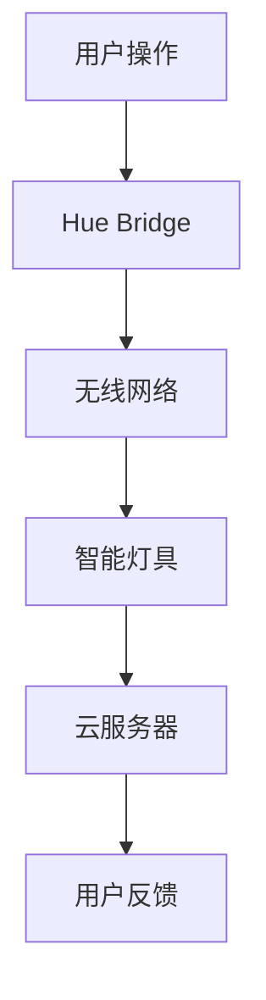

                 

关键词：Hue，光照控制，智能家居，色温，代码实例，硬件接口，智能调光

## 摘要

本文将深入探讨Hue智能照明系统的基本原理，并详细讲解其代码实现。Hue系统通过无线网络与智能设备通信，实现照明设备的远程控制和个性化定制。文章首先介绍了Hue系统的背景和重要性，然后深入解析其核心工作原理，包括硬件接口、通信协议和数据处理。随后，我们将通过具体的代码实例展示如何使用Hue API进行开发，并讨论代码的解读与分析。最后，文章将总结Hue系统在智能家居中的应用场景，并展望其未来的发展前景。

## 1. 背景介绍

### 1.1 Hue系统的起源

Hue系统是由荷兰公司Signify（前飞利浦照明）推出的智能家居照明解决方案。自2012年发布以来，Hue迅速成为智能照明领域的领导者。其核心优势在于通过无线网络连接，实现灯具的远程控制和个性化设置。

### 1.2 智能家居的发展

随着物联网（IoT）技术的兴起，智能家居市场逐渐壮大。Hue系统作为智能家居的重要一环，能够与其他智能设备无缝集成，实现自动化控制和场景联动。这使得家庭生活更加便捷和舒适。

### 1.3 Hue系统的优势

Hue系统的优势主要体现在以下几个方面：

1. **高度可定制化**：用户可以根据需求自定义照明场景，调整色温和亮度。
2. **智能联动**：与其他智能家居设备（如智能音箱、智能锁等）无缝配合，实现更多功能。
3. **远程控制**：通过手机APP或智能设备，随时随地控制家庭照明。
4. **易于安装**：无需复杂布线，即插即用。

## 2. 核心概念与联系

### 2.1 Hue系统的架构

Hue系统的核心组成部分包括：Hue Bridge（智能桥接器）、智能灯具、手机APP和云服务器。

#### 2.1.1 Hue Bridge

Hue Bridge是Hue系统的中心节点，负责接收来自手机APP的命令，并通过无线网络（如Wi-Fi或蓝牙）转发给智能灯具。

#### 2.1.2 智能灯具

智能灯具包括各种类型的照明设备，如LED灯泡、灯带、台灯等。它们内置了无线通信模块，可以接收来自Hue Bridge的指令。

#### 2.1.3 手机APP

手机APP是用户与Hue系统交互的主要途径，提供照明控制、场景设置、日程管理等功能。

#### 2.1.4 云服务器

云服务器负责存储用户的设置和状态信息，并提供数据分析和云端控制功能。

### 2.2 Mermaid流程图

以下是一个简化的Hue系统工作流程的Mermaid流程图：



## 3. 核心算法原理 & 具体操作步骤

### 3.1 算法原理概述

Hue系统主要依赖以下几个核心算法：

1. **通信协议**：Hue Bridge与智能灯具之间的通信采用专用协议，确保数据传输的稳定性和安全性。
2. **数据处理**：Hue系统对用户输入的照明设置进行解析和处理，生成相应的控制指令。
3. **智能调光算法**：根据用户需求，智能灯具会调整亮度，实现平滑的渐变效果。

### 3.2 算法步骤详解

1. **初始化**：用户通过手机APP或智能设备连接到Hue Bridge。
2. **指令解析**：Hue Bridge接收用户指令，解析出相应的控制参数。
3. **数据传输**：Hue Bridge将指令通过无线网络发送给智能灯具。
4. **执行操作**：智能灯具根据收到的指令，调整亮度、色温等参数。
5. **反馈**：智能灯具将操作结果反馈给Hue Bridge，并通过手机APP显示给用户。

### 3.3 算法优缺点

**优点**：

- **稳定性**：采用专用通信协议，确保数据传输的稳定性。
- **安全性**：加密通信，保障用户数据的安全。
- **灵活性**：支持多种类型的智能灯具，满足不同用户需求。

**缺点**：

- **成本**：Hue系统设备价格相对较高。
- **兼容性**：虽然Hue系统支持多种平台，但仍有一定兼容性问题。

### 3.4 算法应用领域

Hue系统主要应用于以下领域：

- **家居照明**：提供个性化的照明场景，提升生活品质。
- **商业照明**：实现场景联动，提升商业氛围。
- **工业照明**：通过智能调光，提高生产效率。

## 4. 数学模型和公式 & 详细讲解 & 举例说明

### 4.1 数学模型构建

Hue系统中的数学模型主要包括：

1. **亮度计算**：根据用户设置的亮度百分比，计算实际输出的光通量。
2. **色温计算**：根据用户设置的色温值，计算实际输出的光色。

### 4.2 公式推导过程

1. **亮度计算公式**：

   $$ L = L_{max} \times \frac{P}{100} $$

   其中，\( L \) 为实际输出的光通量，\( L_{max} \) 为最大光通量，\( P \) 为用户设置的亮度百分比。

2. **色温计算公式**：

   $$ T = T_{min} + (T_{max} - T_{min}) \times \frac{P}{100} $$

   其中，\( T \) 为实际输出的色温，\( T_{min} \) 为最小色温，\( T_{max} \) 为最大色温，\( P \) 为用户设置的亮度百分比。

### 4.3 案例分析与讲解

**案例**：用户希望将客厅的LED灯泡设置为70%的亮度，并调整到2700K的色温。

**计算过程**：

1. **亮度计算**：

   $$ L = L_{max} \times \frac{70}{100} $$

   假设LED灯泡的最大光通量为1000流明，则实际输出的光通量为：

   $$ L = 1000 \times \frac{70}{100} = 700流明 $$

2. **色温计算**：

   $$ T = 2700 + (6500 - 2700) \times \frac{70}{100} $$

   实际输出的色温为：

   $$ T = 2700 + (6500 - 2700) \times \frac{70}{100} = 3110K $$

## 5. 项目实践：代码实例和详细解释说明

### 5.1 开发环境搭建

在进行Hue系统开发之前，需要搭建以下开发环境：

1. **操作系统**：Windows、macOS或Linux。
2. **编程语言**：Python、Java、Node.js等。
3. **Hue Bridge**：连接到家庭Wi-Fi网络。
4. **智能灯具**：至少一个支持Hue系统的智能灯具。

### 5.2 源代码详细实现

以下是一个简单的Python代码示例，用于控制Hue智能灯具的亮度和色温：

```python
import requests
import json

# 配置Hue Bridge的IP地址和用户凭证
HUE_BRIDGE_IP = "192.168.1.100"
USER_CREDENTIAL = "your_user_credentials"

# 设置目标灯具的ID
LAMP_ID = "001782ff00147f34"

# 设置亮度
def set_brightness(brightness):
    url = f"http://{HUE_BRIDGE_IP}/api/{USER_CREDENTIAL}/lights/{LAMP_ID}/state"
    data = {
        "on": True,
        "bri": brightness
    }
    response = requests.put(url, json=data)
    return response.json()

# 设置色温
def set_color_temp(color_temp):
    url = f"http://{HUE_BRIDGE_IP}/api/{USER_CREDENTIAL}/lights/{LAMP_ID}/state"
    data = {
        "on": True,
        "ct": color_temp
    }
    response = requests.put(url, json=data)
    return response.json()

# 测试函数
if __name__ == "__main__":
    print(set_brightness(70))
    print(set_color_temp(2700))
```

### 5.3 代码解读与分析

1. **导入模块**：代码首先导入了`requests`和`json`模块，用于发送HTTP请求和解析JSON数据。
2. **配置Hue Bridge**：通过设置Hue Bridge的IP地址和用户凭证，确保代码可以正确连接到Hue系统。
3. **设置亮度**：`set_brightness`函数用于设置智能灯具的亮度，通过发送PUT请求更新灯具的状态。
4. **设置色温**：`set_color_temp`函数用于设置智能灯具的色温，同样通过发送PUT请求更新灯具的状态。
5. **测试函数**：在主函数中，调用`set_brightness`和`set_color_temp`函数，分别设置亮度和色温，并打印结果。

### 5.4 运行结果展示

在运行代码后，智能灯具的亮度将被设置为70%，色温调整为2700K。用户可以通过手机APP或其他智能设备实时查看和控制这些设置。

## 6. 实际应用场景

### 6.1 家庭照明

Hue系统在家庭照明中的应用非常广泛。用户可以根据不同场景（如阅读、娱乐、休息等）设置个性化的照明场景，提升生活品质。

### 6.2 商业照明

在商场、酒店、餐厅等商业场所，Hue系统可以帮助商家根据顾客需求和氛围，灵活调整照明，提升消费体验。

### 6.3 医疗保健

在医疗领域，Hue系统可以用于病房照明，根据病人的需求和病情，调整色温和亮度，有助于病人恢复和保健。

## 7. 工具和资源推荐

### 7.1 学习资源推荐

- 《Hue API官方文档》：了解Hue系统的详细API接口。
- 《智能家居技术与应用》：探讨智能家居的最新技术和应用案例。

### 7.2 开发工具推荐

- PyCharm：一款功能强大的Python集成开发环境。
- Postman：用于测试Hue API的工具。

### 7.3 相关论文推荐

- "Hue: A Smart Lighting System for the Home"：介绍Hue系统的论文。
- "Intelligent Lighting Control in Smart Homes"：探讨智能家居照明技术的论文。

## 8. 总结：未来发展趋势与挑战

### 8.1 研究成果总结

Hue系统在智能家居领域取得了显著成果，通过无线通信、智能控制和个性化定制，提升了用户的照明体验。

### 8.2 未来发展趋势

未来，Hue系统将继续向智能化、定制化和生态化方向发展。随着物联网技术的进步，Hue系统有望与其他智能家居设备实现更紧密的融合。

### 8.3 面临的挑战

Hue系统在推广和应用过程中，仍面临一些挑战，如成本较高、兼容性不足等。未来，需要进一步优化技术，降低成本，提高兼容性。

### 8.4 研究展望

随着人工智能技术的不断发展，Hue系统有望在智能照明控制方面实现更高程度的智能化和自动化。同时，绿色环保、节能高效也将成为未来研究的重要方向。

## 9. 附录：常见问题与解答

### 问题1：如何连接Hue Bridge？

**解答**：将Hue Bridge连接到家庭Wi-Fi网络，并按照包装盒上的说明进行设置。在手机上下载Hue App，通过App扫描Bridge背面的二维码，完成连接。

### 问题2：如何更换智能灯具？

**解答**：首先关闭电源，然后取下旧灯具，插入新灯具。确保新灯具与Hue Bridge的连接正常后，重新开启电源。

### 问题3：如何保证通信安全？

**解答**：Hue系统采用加密通信，确保用户数据的安全。同时，用户可以设置复杂的用户凭证，提高系统安全性。

---

**作者：禅与计算机程序设计艺术 / Zen and the Art of Computer Programming**

感谢您的阅读，希望本文对您了解Hue智能照明系统有所帮助。在智能家居领域，Hue系统无疑是一个优秀的代表，未来它将在更广泛的场景中得到应用和发展。期待与您共同探索智能家居的无限可能。

