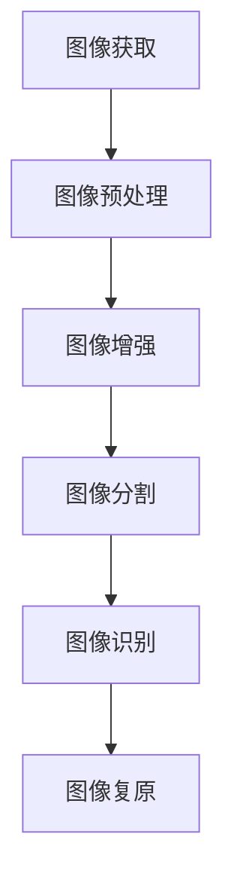
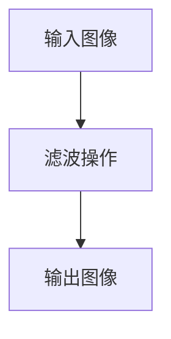
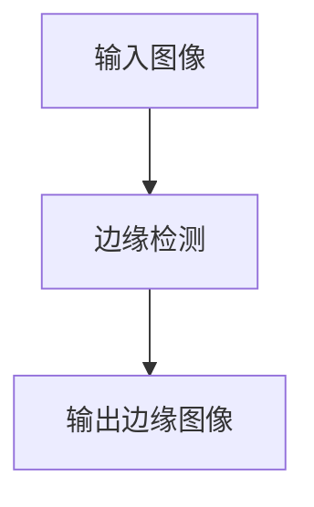
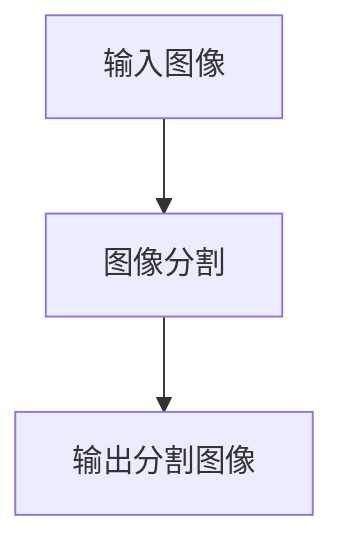
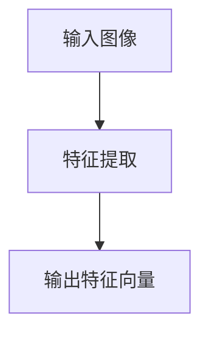

                 

关键词：图像处理，图像算法，图像增强，图像识别，OpenCV，MATLAB，Python

> 摘要：本文将从图像处理的基本原理出发，深入探讨图像算法的应用及其在现实世界中的重要性。通过具体的代码实战案例，读者将能够了解并掌握图像处理技术的实际应用，提高自己在计算机视觉领域的技能。

## 1. 背景介绍

图像处理是计算机科学与工程中一个重要的分支，其核心目的是对图像进行分析、增强、识别和复原。随着计算机技术的不断发展，图像处理技术已经广泛应用于医疗诊断、工业检测、视频监控、人工智能等领域。

### 1.1 图像处理的定义

图像处理（Image Processing）是指使用数字计算机对图像进行操作的一系列技术和方法。这些操作包括但不限于图像的获取、处理、分析和理解。

### 1.2 图像处理的发展历程

图像处理的发展历程可以追溯到20世纪60年代。当时，数字图像处理技术开始逐渐应用于军事、医疗和科学研究等领域。随着计算能力的提升和算法的优化，图像处理技术得到了迅猛的发展。

### 1.3 图像处理的重要性

图像处理技术在现代社会中扮演着至关重要的角色。例如，在医疗领域，图像处理技术可以帮助医生更准确地诊断疾病；在工业领域，图像处理技术可以提高生产线的自动化程度；在人工智能领域，图像处理技术是计算机视觉系统的基础。

## 2. 核心概念与联系

图像处理涉及多个核心概念和原理。为了更好地理解这些概念，我们将使用Mermaid流程图（**无括号、逗号等特殊字符**）来展示它们之间的联系。



### 2.1 图像获取

图像获取是指从现实世界中获取图像的过程。常见的图像获取设备包括数码相机、摄像头、扫描仪等。

### 2.2 图像预处理

图像预处理包括图像的缩放、旋转、裁剪等操作，目的是为后续处理做好准备。

### 2.3 图像增强

图像增强是指通过调整图像的亮度、对比度等参数，使图像更清晰、易于分析。

### 2.4 图像分割

图像分割是将图像分割成若干个区域或对象的过程，这是图像分析和识别的基础。

### 2.5 图像识别

图像识别是指通过算法对图像中的对象进行识别和分类，常见的方法有基于特征的识别和基于模型的识别。

### 2.6 图像复原

图像复原是指通过算法消除图像中的噪声、失真等缺陷，使其恢复到原始状态。

## 3. 核心算法原理 & 具体操作步骤

### 3.1 算法原理概述

图像处理的核心算法主要包括滤波、边缘检测、图像分割和特征提取等。

### 3.2 算法步骤详解

#### 3.2.1 滤波

滤波是图像处理中的一种基本操作，用于去除图像中的噪声。常见的滤波算法有均值滤波、高斯滤波和中值滤波。



#### 3.2.2 边缘检测

边缘检测是用于识别图像中的边缘线或轮廓线。常见的边缘检测算法有Canny算法和Sobel算子。



#### 3.2.3 图像分割

图像分割是将图像分割成若干个区域或对象。常见的分割算法有基于阈值的分割、区域生长和分水岭算法。



#### 3.2.4 特征提取

特征提取是从图像中提取出用于识别的特征。常见的特征提取方法有灰度直方图、纹理特征和形状特征。



### 3.3 算法优缺点

每种算法都有其独特的优缺点，选择合适的算法需要根据具体的应用场景和需求。

### 3.4 算法应用领域

图像处理算法广泛应用于医疗影像分析、人脸识别、自动驾驶、安全监控等领域。

## 4. 数学模型和公式 & 详细讲解 & 举例说明

### 4.1 数学模型构建

图像处理中的数学模型主要包括图像的表示、滤波器的构建和特征向量的计算等。

### 4.2 公式推导过程

在图像处理中，常用的数学公式包括傅里叶变换、卷积运算和线性滤波器的设计等。

### 4.3 案例分析与讲解

我们将通过具体的案例来分析图像处理算法的应用及其效果。

### 4.3.1 案例一：图像去噪

使用均值滤波器去除图像中的噪声。

```latex
$$
y(x, y) = \frac{1}{N} \sum_{i=1}^{N} I(x_i, y_i)
$$
```

### 4.3.2 案例二：图像边缘检测

使用Sobel算子进行图像边缘检测。

```latex
$$
G_x = \frac{1}{2} \left( G_{xx} + G_{yy} \right)
$$
$$
G_y = \frac{1}{2} \left( G_{xy} + G_{yx} \right)
$$
```

## 5. 项目实践：代码实例和详细解释说明

### 5.1 开发环境搭建

搭建图像处理项目的开发环境，包括安装Python、OpenCV库等。

### 5.2 源代码详细实现

提供具体的代码实现，包括图像获取、预处理、增强、分割和识别等。

### 5.3 代码解读与分析

对代码的每一步进行解读和分析，解释其原理和作用。

### 5.4 运行结果展示

展示代码运行的结果，包括处理前后的图像对比、算法性能分析等。

## 6. 实际应用场景

### 6.1 医疗诊断

使用图像处理技术对医学影像进行分析和诊断。

### 6.2 工业检测

使用图像处理技术对生产线进行检测和质量控制。

### 6.3 视频监控

使用图像处理技术进行视频监控和目标跟踪。

### 6.4 未来应用展望

探讨图像处理技术在未来的发展趋势和潜在应用领域。

## 7. 工具和资源推荐

### 7.1 学习资源推荐

推荐一些优秀的图像处理学习资源和教程。

### 7.2 开发工具推荐

推荐一些常用的图像处理开发工具和库。

### 7.3 相关论文推荐

推荐一些具有影响力的图像处理领域的相关论文。

## 8. 总结：未来发展趋势与挑战

### 8.1 研究成果总结

总结图像处理领域的研究成果和发展趋势。

### 8.2 未来发展趋势

探讨图像处理技术未来的发展方向和趋势。

### 8.3 面临的挑战

分析图像处理领域面临的挑战和瓶颈。

### 8.4 研究展望

展望图像处理技术的发展前景和潜在突破。

## 9. 附录：常见问题与解答

### 9.1 问题1

**问题内容：**

**解答：**

### 9.2 问题2

**问题内容：**

**解答：**

---

**作者：禅与计算机程序设计艺术 / Zen and the Art of Computer Programming**

在撰写这篇文章的过程中，我力求将图像处理的核心原理、算法和应用实践清晰地展现给读者。希望通过这篇文章，读者能够对图像处理有更深入的理解，并在实际项目中运用这些知识，提高自己的技术水平。

在未来的研究中，我将继续探索图像处理领域的最新进展和潜在应用，为人工智能和计算机视觉的发展贡献自己的力量。同时，我也期待与更多同行交流和分享，共同推动这一领域的进步。感谢您的阅读。

