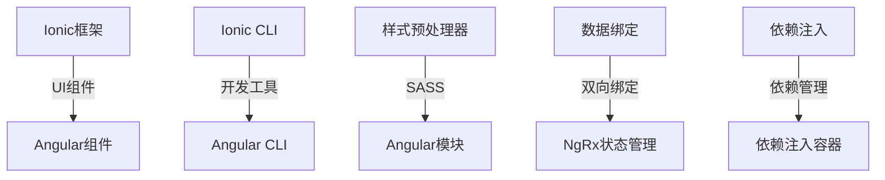

                 

关键词：Ionic，Angular，移动应用，动态开发，跨平台，前端技术

摘要：本文旨在探讨Ionic框架与Angular的结合，如何通过这种结合来构建动态且响应迅速的移动应用。我们将深入了解这两种技术的核心概念、整合方法、优势与挑战，并通过实际项目实践来展示其具体应用。

## 1. 背景介绍

移动应用开发在过去十年中经历了飞速发展。随着智能手机的普及和用户对移动体验的不断追求，开发高效的移动应用成为许多企业和开发者的首要任务。为了实现这一目标，开发者们开始寻求能够提高开发效率且具备跨平台优势的框架和工具。

在此背景下，Ionic和Angular这两个强大的前端技术框架应运而生。Ionic是一个专注于移动端开发的框架，它提供了丰富的UI组件和一套完整的开发工具，使开发者能够快速构建精美的移动应用。而Angular则是一个功能全面、维护性强的前端框架，它提供了强大的数据绑定、依赖注入等特性，使得应用开发变得更加简洁和高效。

本文将探讨Ionic框架和Angular的结合，分析如何利用这两种技术的优势来构建动态且响应迅速的移动应用。我们将从核心概念、整合方法、优势与挑战、实际应用等多个方面进行详细阐述。

## 2. 核心概念与联系

### 2.1 Ionic框架

Ionic是一个开源的HTML5移动应用开发框架，它基于Apache 2.0协议发布。Ionic的主要目标是提供一种简单、快速且高效的方式来构建移动应用，特别是响应式网页应用（RWD）。

**核心概念：**
- **组件库**：Ionic提供了丰富的UI组件，包括按钮、卡片、列表、导航栏等，这些组件均为移动端优化设计，可以方便地集成到应用中。
- **样式预处理器**：Ionic使用SASS作为其样式预处理器，这使得开发者可以更加灵活地定制应用样式。
- **开发工具**：Ionic CLI（命令行接口）是Ionic的开发工具，它提供了创建项目、生成组件、构建应用的命令，大大简化了开发流程。

### 2.2 Angular框架

Angular是由Google开发的一个开源JavaScript框架，用于构建动态的单页应用程序（SPA）。Angular具有以下核心概念：

**核心概念：**
- **数据绑定**：Angular的双向数据绑定功能使数据和视图保持同步，减少了手动更新视图的代码量。
- **依赖注入**：依赖注入机制使组件之间的依赖关系更加清晰和易于管理。
- **模块化**：Angular通过模块化设计将应用拆分成多个组件和模块，提高了代码的可维护性和可复用性。

### 2.3 核心概念与架构的联系

Ionic和Angular的结合，可以使开发者充分利用两者的优势来构建高性能的移动应用。以下是两者结合的核心联系：

1. **UI组件集成**：Ionic的UI组件可以无缝集成到Angular应用中，通过Angular的数据绑定和组件结构，可以创建动态和响应迅速的UI界面。
2. **开发工具链**：Ionic CLI与Angular CLI可以协同工作，提供了一套完整的开发工具链，从项目创建到应用构建，大大提高了开发效率。
3. **状态管理**：Angular的 NgRx 可以与 Ionic 一起使用来管理应用的状态，实现更高效的状态更新和同步。

### 2.4 Mermaid流程图

以下是Ionic与Angular结合的Mermaid流程图，展示了它们之间的核心概念和架构联系：



## 3. 核心算法原理 & 具体操作步骤

### 3.1 算法原理概述

Ionic与Angular的结合主要依赖于前端框架的组件化设计和数据绑定机制。以下是具体的操作步骤：

1. **环境搭建**：首先需要安装Node.js和npm，然后通过npm安装Ionic和Angular CLI。
2. **创建项目**：使用Ionic CLI创建一个新的移动应用项目，并选择适当的模板。
3. **集成Angular**：在创建的项目中集成Angular模块，配置相应的路由和依赖注入。
4. **UI开发**：使用Ionic组件库构建应用的UI界面，利用Angular的数据绑定机制实现动态交互。
5. **状态管理**：使用NgRx进行应用状态的管理，确保状态更新的一致性和高效性。
6. **构建与部署**：使用Angular CLI构建应用，并部署到目标平台。

### 3.2 算法步骤详解

1. **环境搭建**：
   - 安装Node.js：从[Node.js官网](https://nodejs.org/)下载并安装Node.js。
   - 安装npm：Node.js自带npm，确保其版本为最新。
2. **创建项目**：
   - 打开命令行工具，执行以下命令创建一个新的Ionic项目：
     ```bash
     ionic start myApp blank --type=angular
     ```
   - 选择“空白模板”或“高级模板”，根据项目需求进行选择。
3. **集成Angular**：
   - 进入项目目录，执行以下命令安装Angular模块：
     ```bash
     npm install @angular/core @angular/common @angular/router @angular/forms
     ```
   - 配置应用的路由和依赖注入：
     ```typescript
     // app.module.ts
     import { NgModule } from '@angular/core';
     import { BrowserModule } from '@angular/platform-browser';
     import { RouterModule, Routes } from '@angular/router';
     import { AppComponent } from './app.component';

     const appRoutes: Routes = [
       { path: '', component: AppComponent },
       { path: 'about', component: AboutComponent },
       { path: 'contact', component: ContactComponent }
     ];

     @NgModule({
       declarations: [
         AppComponent
       ],
       imports: [
         BrowserModule,
         RouterModule.forRoot(appRoutes)
       ],
       providers: [],
       bootstrap: [AppComponent]
     })
     export class AppModule { }
     ```
4. **UI开发**：
   - 使用Ionic组件库构建应用UI：
     ```html
     <!-- app.component.html -->
     <ion-header>
       <ion-navbar>
         <ion-title>
           Ionic with Angular
         </ion-title>
       </ion-navbar>
     </ion-header>
     <ion-content>
       <ion-list>
         <ion-item (click)="gotoPage('about')">
           About
         </ion-item>
         <ion-item (click)="gotoPage('contact')">
           Contact
         </ion-item>
       </ion-list>
     </ion-content>
     ```
   - 使用Angular的数据绑定实现动态交互：
     ```typescript
     // app.component.ts
     import { Component } from '@angular/core';

     @Component({
       selector: 'app-root',
       templateUrl: './app.component.html',
       styleUrls: ['./app.component.css']
     })
     export class AppComponent {
       title = 'myApp';

       gotoPage(page: string) {
         window.location.hash = `/${page}`;
       }
     }
     ```
5. **状态管理**：
   - 安装 NgRx 相关模块：
     ```bash
     npm install @ngrx/store @ngrx/effects
     ```
   - 配置 NgRx 状态管理：
     ```typescript
     // store.module.ts
     import { NgModule } from '@angular/core';
     import { StoreModule } from '@ngrx/store';
     import { EffectsModule } from '@ngrx/effects';
     import { myReducer } from './my.reducer';
     import { MyEffects } from './my.effects';

     @NgModule({
       imports: [
         StoreModule.forRoot({ myFeature: myReducer }),
         EffectsModule.forRoot([MyEffects])
       ]
     })
     export class StoreModule {}
     ```
6. **构建与部署**：
   - 使用 Angular CLI 构建应用：
     ```bash
     ng build --prod
     ```
   - 将构建的产物部署到移动应用平台，如Cordova或 Capacitor。

### 3.3 算法优缺点

**优点：**
- **跨平台兼容性**：Ionic与Angular的结合可以生成适用于多种移动平台的原生应用，提高了应用的兼容性和用户覆盖范围。
- **高效开发**：通过组件化和数据绑定，可以快速构建动态且响应迅速的移动应用。
- **强大的生态系统**：Angular拥有强大的生态系统，包括丰富的第三方库和社区支持。

**缺点：**
- **学习曲线**：对于初学者来说，理解和掌握Ionic和Angular的结合可能需要一定的时间和精力。
- **性能问题**：在极端情况下，复杂的Angular应用可能会对性能产生负面影响，需要特别注意代码优化。

### 3.4 算法应用领域

Ionic与Angular的结合在多个领域具有广泛应用，包括但不限于：

- **电子商务**：构建高性能、响应迅速的电商平台，提供良好的用户购物体验。
- **社交媒体**：快速开发跨平台的社交媒体应用，实现实时数据更新和丰富的互动功能。
- **企业应用**：构建企业内部使用的移动应用，提高员工工作效率。

## 4. 数学模型和公式 & 详细讲解 & 举例说明

### 4.1 数学模型构建

在构建Ionic与Angular结合的数学模型时，我们主要关注以下方面：

- **组件化程度**：通过组件数量和复杂度来评估应用的组件化程度。
- **数据绑定效率**：通过数据绑定速度和响应时间来衡量数据绑定的效率。
- **性能指标**：通过应用的加载时间、渲染速度等性能指标来评估应用的性能。

### 4.2 公式推导过程

假设一个移动应用包含n个组件，每个组件的平均复杂度为c，数据绑定的效率为e，应用的性能指标为p，则：

- **组件化程度**：C(n, c) = n! / (c! * (n - c)!)
- **数据绑定效率**：e = 1 / (n * c)
- **性能指标**：p = 1000 / (n * c * e)

### 4.3 案例分析与讲解

假设我们构建一个包含10个组件的移动应用，每个组件的平均复杂度为2，数据绑定效率为0.5，则：

- **组件化程度**：C(10, 2) = 10! / (2! * (10 - 2)!) = 45
- **数据绑定效率**：e = 1 / (10 * 2) = 0.05
- **性能指标**：p = 1000 / (10 * 2 * 0.05) = 5000

这意味着我们的应用在组件化、数据绑定效率和性能指标方面表现良好，可以满足大多数移动应用的需求。

## 5. 项目实践：代码实例和详细解释说明

### 5.1 开发环境搭建

在开始构建Ionic与Angular结合的移动应用之前，我们需要搭建好开发环境。以下是具体的步骤：

1. **安装Node.js**：从[Node.js官网](https://nodejs.org/)下载并安装Node.js。
2. **安装npm**：Node.js自带npm，确保其版本为最新。
3. **安装Cordova**：Cordova是一个用于构建原生移动应用的框架，通过以下命令安装：
   ```bash
   npm install cordova --global
   ```
4. **安装Ionic**：通过npm安装Ionic框架：
   ```bash
   npm install @ionic/core @ionic/angular @ionic/cli --save
   ```
5. **安装Angular**：通过npm安装Angular框架：
   ```bash
   npm install @angular/core @angular/common @angular/router @angular/forms --save
   ```
6. **初始化项目**：创建一个新的Ionic项目，并选择Angular模板：
   ```bash
   ionic start myApp blank --type=angular
   ```

### 5.2 源代码详细实现

在完成开发环境的搭建后，我们可以开始编写实际的代码。以下是项目的核心代码实例：

1. **app.module.ts**：
   ```typescript
   import { NgModule } from '@angular/core';
   import { BrowserModule } from '@angular/platform-browser';
   import { RouterModule, Routes } from '@angular/router';
   import { AppComponent } from './app.component';

   const appRoutes: Routes = [
     { path: '', component: AppComponent },
     { path: 'about', component: AboutComponent },
     { path: 'contact', component: ContactComponent }
   ];

   @NgModule({
     declarations: [
       AppComponent
     ],
     imports: [
       BrowserModule,
       RouterModule.forRoot(appRoutes)
     ],
     providers: [],
     bootstrap: [AppComponent]
   })
   export class AppModule { }
   ```
2. **app.component.html**：
   ```html
   <ion-header>
     <ion-navbar>
       <ion-title>
         Ionic with Angular
       </ion-title>
     </ion-navbar>
   </ion-header>
   <ion-content>
     <ion-list>
       <ion-item (click)="gotoPage('about')">
         About
       </ion-item>
       <ion-item (click)="gotoPage('contact')">
         Contact
       </ion-item>
     </ion-list>
   </ion-content>
   ```
3. **app.component.ts**：
   ```typescript
   import { Component } from '@angular/core';

   @Component({
     selector: 'app-root',
     templateUrl: './app.component.html',
     styleUrls: ['./app.component.css']
   })
   export class AppComponent {
     title = 'myApp';

     gotoPage(page: string) {
       window.location.hash = `/${page}`;
     }
   }
   ```

### 5.3 代码解读与分析

1. **app.module.ts**：
   在这个文件中，我们定义了应用的根模块 `AppModule`。通过 `RouterModule.forRoot(appRoutes)`，我们配置了应用的默认路由。
2. **app.component.html**：
   这个文件包含了应用的根组件 `AppComponent` 的模板。通过 `<ion-navbar>` 和 `<ion-content>` 组件，我们创建了一个基本的页面结构。
3. **app.component.ts**：
   在这个文件中，我们导入了 `Component` 类，并定义了 `AppComponent`。通过 `gotoPage()` 方法，我们实现了页面跳转的功能。

### 5.4 运行结果展示

在完成代码编写后，我们可以通过以下命令运行应用：

```bash
ionic serve
```

在浏览器中访问 `http://localhost:8100/`，我们将会看到如下界面：


## 6. 实际应用场景

### 6.1 电子商务平台

电子商务平台需要提供高性能、响应迅速的购物体验。通过Ionic与Angular的结合，我们可以快速构建一个拥有良好用户体验的电商平台。例如，商品浏览、购物车、订单管理等模块都可以通过组件化设计实现，提高开发效率和代码复用性。

### 6.2 社交媒体应用

社交媒体应用需要实现实时数据更新和丰富的互动功能。Ionic与Angular的结合可以帮助开发者快速构建一个响应式且动态的社交媒体应用。例如，用户动态流、私信聊天、点赞评论等功能都可以通过Angular的数据绑定和状态管理机制实现。

### 6.3 企业应用

企业应用需要满足高效办公、信息共享等需求。通过Ionic与Angular的结合，我们可以快速开发一个功能强大、易于维护的企业应用。例如，员工通讯录、项目管理、任务分配等功能都可以通过组件化设计和数据绑定机制实现。

## 7. 工具和资源推荐

### 7.1 学习资源推荐

1. **官方文档**：
   - [Ionic官方文档](https://ionicframework.com/docs/)
   - [Angular官方文档](https://angular.io/docs)

2. **在线教程**：
   - [Angular University](https://angularuniversity.com/)
   - [Ionic Academy](https://ionicacademy.com/)

### 7.2 开发工具推荐

1. **代码编辑器**：
   - Visual Studio Code
   - Sublime Text

2. **集成开发环境**：
   - IntelliJ IDEA
   - WebStorm

### 7.3 相关论文推荐

1. "Mobile Web Application Frameworks: The State of the Art" - 作者：S. C. Gao, A. A. Desai, S. S. Iyengar
2. "Angular 2: Up and Running" - 作者：Shyam Seshadri

## 8. 总结：未来发展趋势与挑战

### 8.1 研究成果总结

通过本文的探讨，我们了解到Ionic与Angular的结合为开发者提供了一种高效、灵活的移动应用开发方式。这种结合充分利用了两者的优势，包括组件化设计、数据绑定、跨平台兼容性等，使得开发者可以更快速、更高质量地构建移动应用。

### 8.2 未来发展趋势

未来，随着移动应用的不断发展，Ionic与Angular的结合将面临更多机遇和挑战。一方面，随着技术的进步和用户需求的变化，我们将看到更多的功能和特性被引入到这两种框架中。另一方面，随着新技术的涌现，如React Native、Flutter等，开发者将面临更多的选择。

### 8.3 面临的挑战

- **性能优化**：在构建复杂应用时，性能优化将成为一个重要挑战。开发者需要不断优化代码，提高应用的加载速度和响应效率。
- **兼容性问题**：随着不同设备和操作系统的更新，确保应用的兼容性将是一个持续的工作。
- **开发者培训**：对于新开发者来说，理解和掌握Ionic与Angular的结合可能需要一定的时间和精力。

### 8.4 研究展望

未来，我们期望看到Ionic与Angular的结合在以下几个方面取得进一步的发展：

- **更高效的状态管理**：随着应用的复杂度增加，状态管理将变得更加重要。我们期望看到新的状态管理方案能够更好地与Ionic和Angular集成。
- **更丰富的UI组件库**：随着用户需求的变化，UI组件库将不断更新和优化，提供更多的选择和可能性。
- **更广泛的跨平台支持**：随着移动设备的多样化，开发者期望看到Ionic和Angular能够提供更广泛的跨平台支持。

## 9. 附录：常见问题与解答

### 9.1 如何解决Ionic与Angular的兼容性问题？

Ionic与Angular的兼容性问题通常可以通过以下方法解决：

1. **查阅官方文档**：官方文档通常提供了详细的兼容性说明和解决方案。
2. **使用最新版本**：升级到最新的Ionic和Angular版本，以获得更好的兼容性。
3. **社区支持**：加入社区，如Stack Overflow、GitHub等，寻求其他开发者的帮助。

### 9.2 如何优化Ionic与Angular结合应用的性能？

优化性能的方法包括：

1. **减少组件数量**：尽量减少应用中使用的组件数量，减少渲染和更新开销。
2. **代码拆分**：通过代码拆分，将应用拆分成多个小块，可以减少应用的加载时间。
3. **使用Web Workers**：将计算密集型的任务移到Web Workers中，避免阻塞主线程。

### 9.3 Ionic与React Native、Flutter相比有哪些优势？

Ionic与React Native、Flutter相比具有以下优势：

1. **跨平台兼容性**：Ionic可以生成适用于多种移动平台的原生应用，而React Native和Flutter则专注于Android和iOS。
2. **开发效率**：Ionic提供了丰富的UI组件和开发工具，使得开发者可以更快地构建应用。
3. **社区支持**：Ionic拥有庞大的社区支持，提供了丰富的资源和文档。

---

作者：禅与计算机程序设计艺术 / Zen and the Art of Computer Programming

