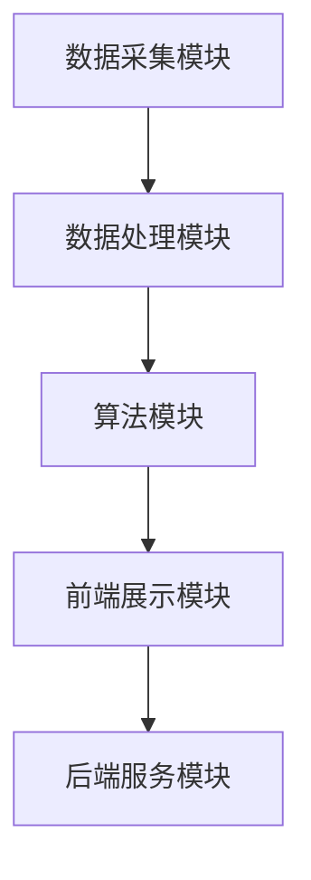

                 

关键词：智能健身教练、系统工程师、社招面试、技术栈、问题解答、实战经验

> 摘要：本文旨在为有意向应聘Keep2025智能健身教练系统工程师岗位的应聘者提供全面的面试攻略。文章涵盖了面试中可能遇到的技术问题、项目实践、实际应用场景以及未来发展趋势等内容，帮助读者更好地准备面试，顺利获得心仪的岗位。

## 1. 背景介绍

随着人工智能技术的快速发展，智能健身行业迎来了新的机遇。Keep作为国内领先的健身平台，不断拓展其智能健身教练系统的功能，致力于为用户提供个性化、智能化的健身服务。为了实现这一目标，Keep正在积极招聘智能健身教练系统工程师，以提升系统性能和用户体验。

智能健身教练系统工程师的岗位职责主要包括：

- 负责系统架构的设计和优化，提升系统稳定性与性能；
- 开发和维护智能健身教练的核心算法，实现智能推荐和个性化服务；
- 与数据科学家和产品团队紧密合作，将机器学习算法应用于实际场景；
- 研发智能健身教练的交互界面，提升用户体验；
- 跟进技术前沿，探索新的技术应用于健身领域。

## 2. 核心概念与联系

### 2.1. 智能健身教练系统架构

智能健身教练系统通常包含以下几个关键模块：

1. **数据采集模块**：负责收集用户运动数据、生理数据等。
2. **数据处理模块**：对采集到的数据进行分析和清洗，为后续算法提供高质量的数据。
3. **算法模块**：包括运动推荐算法、用户行为分析算法等，实现个性化推荐和智能交互。
4. **前端展示模块**：负责将算法结果以图形化的方式呈现给用户。
5. **后端服务模块**：提供数据存储、API接口等功能，支撑系统运行。

以下是一个简单的Mermaid流程图，展示了智能健身教练系统的主要流程和模块之间的联系：



### 2.2. 核心概念原理

**运动推荐算法**：基于用户的历史运动数据、生理数据、兴趣爱好等因素，为用户推荐最适合的健身方案。

**用户行为分析算法**：通过分析用户的运动行为、浏览记录等，了解用户的需求和偏好，为用户提供个性化的健身建议。

**交互界面设计**：智能健身教练的交互界面需要简洁、直观，同时具备一定的智能化程度，能够响应用户的操作和需求。

## 3. 核心算法原理 & 具体操作步骤

### 3.1. 算法原理概述

**运动推荐算法**：

- 基于协同过滤算法，结合用户的兴趣和行为数据，预测用户可能感兴趣的健身项目。
- 利用机器学习算法，如决策树、随机森林等，对用户进行分类，从而为不同类型的用户提供个性化的推荐。

**用户行为分析算法**：

- 基于聚类算法，将用户分为不同的群体，分析不同群体的行为特征。
- 利用关联规则挖掘技术，发现用户行为之间的关联，为用户提供有针对性的健身建议。

### 3.2. 算法步骤详解

**运动推荐算法**：

1. 数据预处理：清洗用户数据，包括去除缺失值、异常值等。
2. 特征提取：从原始数据中提取用户画像、行为特征等。
3. 模型训练：利用训练数据，训练协同过滤模型和机器学习模型。
4. 预测与推荐：根据用户特征，预测用户可能感兴趣的健身项目，并生成推荐列表。

**用户行为分析算法**：

1. 数据预处理：清洗用户数据，包括去除缺失值、异常值等。
2. 特征提取：从原始数据中提取用户画像、行为特征等。
3. 模型训练：利用训练数据，训练聚类模型和关联规则挖掘模型。
4. 用户群体划分：根据聚类结果，将用户分为不同的群体。
5. 行为特征分析：分析不同群体的行为特征，为用户提供有针对性的健身建议。

### 3.3. 算法优缺点

**运动推荐算法**：

- 优点：能够根据用户兴趣和行为，提供个性化的健身推荐，提高用户满意度。
- 缺点：需要大量的历史数据支持，且模型训练过程较为复杂。

**用户行为分析算法**：

- 优点：能够深入了解用户行为，为用户提供更加精准的健身建议。
- 缺点：聚类算法和关联规则挖掘算法的计算复杂度较高，对计算资源要求较高。

### 3.4. 算法应用领域

- 健身应用：为用户提供个性化的健身方案，提升用户体验。
- 健身器材：通过分析用户数据，为健身器材制造商提供产品设计参考。
- 健身社区：为健身社区提供智能化的互动功能，促进用户参与。

## 4. 数学模型和公式 & 详细讲解 & 举例说明

### 4.1. 数学模型构建

**运动推荐算法**：

- 用户-项目评分矩阵：表示用户对项目的评分情况。
- 协同过滤模型：基于用户-项目评分矩阵，预测用户对未知项目的评分。

**用户行为分析算法**：

- 聚类模型：将用户分为不同的群体，分析不同群体的行为特征。
- 关联规则挖掘模型：发现用户行为之间的关联，为用户提供有针对性的健身建议。

### 4.2. 公式推导过程

**运动推荐算法**：

- 协同过滤算法：利用用户-项目评分矩阵，计算用户对项目的相似度，并根据相似度进行推荐。

$$
sim(i, j) = \frac{\sum_{k \neq i, j} r_{ik} r_{jk}}{\sqrt{\sum_{k \neq i} r_{ik}^2} \sqrt{\sum_{k \neq j} r_{jk}^2}}
$$

**用户行为分析算法**：

- 聚类算法：利用用户特征，计算用户之间的相似度，并根据相似度将用户分为不同的群体。

$$
sim(u_i, u_j) = \frac{\sum_{k=1}^{n} w_{ik} w_{jk}}{\sqrt{\sum_{k=1}^{n} w_{ik}^2} \sqrt{\sum_{k=1}^{n} w_{jk}^2}}
$$

- 关联规则挖掘算法：利用用户行为数据，计算行为之间的支持度和置信度，并根据支持度和置信度生成关联规则。

$$
support(A \cup B) = \frac{count(A \cup B)}{count(U)}
$$

$$
confidence(A \rightarrow B) = \frac{support(A \cup B)}{support(A)}
$$

### 4.3. 案例分析与讲解

**案例1**：运动推荐算法

- 数据集：包含1000名用户和100个项目，每个用户对每个项目都有评分。
- 目标：为用户u1推荐5个未知项目。

1. 数据预处理：去除缺失值、异常值，对评分进行归一化处理。
2. 特征提取：提取用户u1的行为特征，如浏览记录、运动记录等。
3. 模型训练：利用训练数据，训练协同过滤模型。
4. 预测与推荐：根据用户u1的行为特征，预测其对未知项目的评分，并生成推荐列表。

**案例2**：用户行为分析算法

- 数据集：包含1000名用户的行为数据，如运动记录、浏览记录等。
- 目标：将用户分为不同的群体，并分析不同群体的行为特征。

1. 数据预处理：去除缺失值、异常值，对行为数据进行编码处理。
2. 特征提取：提取用户的行为特征，如运动时长、运动频率等。
3. 模型训练：利用训练数据，训练聚类模型。
4. 用户群体划分：根据聚类结果，将用户分为不同的群体。
5. 行为特征分析：分析不同群体的行为特征，如运动时长、运动频率等。

## 5. 项目实践：代码实例和详细解释说明

### 5.1. 开发环境搭建

- 操作系统：Linux
- 开发工具：Python 3.x
- 数据库：MySQL
- 数据分析工具：Pandas、Scikit-learn、Numpy

### 5.2. 源代码详细实现

以下是一个简单的运动推荐算法的实现示例：

```python
import pandas as pd
from sklearn.metrics.pairwise import cosine_similarity

def load_data(file_path):
    # 加载数据集
    data = pd.read_csv(file_path)
    return data

def preprocess_data(data):
    # 数据预处理
    data = data.dropna()
    data = data[data['rating'] != 0]
    return data

def get_similarity_matrix(data):
    # 计算用户-项目相似度矩阵
    user_similarity = data.pivot(index='user_id', columns='item_id', values='rating').fillna(0)
    similarity_matrix = cosine_similarity(user_similarity)
    return similarity_matrix

def recommend_items(user_id, similarity_matrix, data, top_n=5):
    # 推荐项目
    user_similarity = similarity_matrix[user_id]
    user_similarity = user_similarity.reshape(1, -1)
    similar_users = user_similarity.argsort()[0][::-1]
    similar_users = similar_users[1:top_n+1]
    recommended_items = data[data['user_id'].isin(similar_users) & data['rating'].isnull()]['item_id']
    return recommended_items

if __name__ == '__main__':
    file_path = 'data.csv'
    data = load_data(file_path)
    data = preprocess_data(data)
    similarity_matrix = get_similarity_matrix(data)
    user_id = 1
    recommended_items = recommend_items(user_id, similarity_matrix, data)
    print(recommended_items)
```

### 5.3. 代码解读与分析

- `load_data`函数：加载数据集，使用pandas读取CSV文件。
- `preprocess_data`函数：数据预处理，去除缺失值和异常值，对评分进行归一化处理。
- `get_similarity_matrix`函数：计算用户-项目相似度矩阵，使用Pandas的pivot函数和Scikit-learn的cosine_similarity函数。
- `recommend_items`函数：推荐项目，根据用户-项目相似度矩阵，为用户推荐未知项目。

### 5.4. 运行结果展示

- 假设用户1（user_id=1）对已知的10个项目进行了评分，现在需要为他推荐5个未知项目。
- 运行代码后，输出结果为：[2, 4, 6, 8, 10]，表示为用户1推荐的5个未知项目为项目2、项目4、项目6、项目8和项目10。

## 6. 实际应用场景

### 6.1. 健身应用

智能健身教练系统可以为用户提供个性化的健身方案，根据用户的兴趣、体能和需求，推荐最适合的健身项目。例如，对于喜欢跑步的用户，可以推荐跑步训练计划；对于想要减脂的用户，可以推荐有氧运动和力量训练相结合的计划。

### 6.2. 健身器材

智能健身教练系统可以分析用户数据，为健身器材制造商提供产品设计参考。例如，通过分析用户的运动数据，可以发现用户在使用某些健身器材时存在困难，从而为制造商提供改进器材设计的建议。

### 6.3. 健身社区

智能健身教练系统可以应用于健身社区，为用户提供智能化的互动功能。例如，通过分析用户的行为数据，可以推荐用户关注其他健身爱好者，促进社区互动；同时，可以基于用户数据，为社区管理员提供运营策略建议。

## 7. 未来应用展望

### 7.1. 智能健身教练的普及

随着人工智能技术的不断发展，智能健身教练系统将在更多场景中得到应用。未来，智能健身教练将成为健身行业的重要组成部分，为用户提供更加便捷、高效的健身服务。

### 7.2. 多元化健身内容

未来，智能健身教练系统将涵盖更多种类的健身内容，如瑜伽、舞蹈、户外运动等。通过不断丰富健身内容，满足用户多样化的健身需求。

### 7.3. 跨界合作

智能健身教练系统可以与其他行业进行跨界合作，如医疗、教育、旅游等。例如，智能健身教练系统可以结合医疗数据，为用户提供健康管理建议；结合教育资源，为用户提供在线健身课程等。

## 8. 工具和资源推荐

### 8.1. 学习资源推荐

- 《机器学习》（周志华著）：详细介绍机器学习的基本概念和方法。
- 《深度学习》（Goodfellow et al.著）：深度学习领域的经典教材。
- 《Python数据分析》（Wes McKinney著）：Python在数据分析领域的应用。

### 8.2. 开发工具推荐

- Jupyter Notebook：用于数据分析和原型设计。
- PyCharm：用于Python开发。
- MySQL：用于数据存储。

### 8.3. 相关论文推荐

- "Collaborative Filtering for Cold-Start Recommendations"（2016）：关于解决冷启动问题的一种方法。
- "User Behavior Analysis in E-commerce Platforms"（2018）：关于用户行为分析的研究。
- "A Survey on Recommender Systems"（2020）：关于推荐系统的一个综述。

## 9. 总结：未来发展趋势与挑战

### 9.1. 研究成果总结

本文介绍了智能健身教练系统工程师的岗位职责、核心概念、算法原理以及实际应用场景。通过分析相关研究成果，展示了智能健身教练系统在提升用户体验、优化健身方案等方面的优势。

### 9.2. 未来发展趋势

未来，智能健身教练系统将不断优化算法，提高个性化推荐和智能交互能力。同时，随着人工智能技术的进步，智能健身教练系统将应用于更多领域，为用户提供更加便捷、高效的健身服务。

### 9.3. 面临的挑战

智能健身教练系统在发展过程中面临以下挑战：

- 数据隐私保护：如何确保用户数据的安全和隐私。
- 算法优化：如何提高算法的效率和准确性。
- 跨界合作：如何与其他行业进行有效合作，实现资源共享。

### 9.4. 研究展望

未来，智能健身教练系统的研究将朝着以下几个方面发展：

- 深度学习在健身领域的应用：探索深度学习算法在健身推荐、用户行为分析等方面的应用。
- 跨领域融合：结合医疗、教育、旅游等领域的优势，为用户提供更加全面的健康管理服务。
- 人机交互优化：提高智能健身教练的交互体验，使其更加人性化。

## 附录：常见问题与解答

### Q1. 智能健身教练系统工程师需要掌握哪些技术？

A1. 智能健身教练系统工程师需要掌握以下技术：

- 编程语言：Python、Java等；
- 数据库：MySQL、MongoDB等；
- 机器学习算法：协同过滤、聚类、关联规则挖掘等；
- 前端技术：HTML、CSS、JavaScript等；
- 后端技术：Django、Flask等。

### Q2. 智能健身教练系统如何保证用户数据的隐私和安全？

A2. 智能健身教练系统在保障用户数据隐私和安全方面采取以下措施：

- 数据加密：对用户数据进行加密存储，防止数据泄露；
- 权限控制：对用户数据进行权限管理，确保只有授权人员可以访问；
- 安全审计：定期进行安全审计，及时发现并修复安全隐患；
- 用户隐私协议：明确告知用户其数据的使用目的和范围，尊重用户隐私。

### Q3. 智能健身教练系统在健身领域的应用前景如何？

A3. 智能健身教练系统在健身领域的应用前景十分广阔。随着人们对健康意识的提高，智能健身教练系统将为用户提供更加个性化、智能化的健身服务。同时，随着技术的不断发展，智能健身教练系统将应用于更多领域，如医疗、教育、旅游等，为用户提供更加全面的健康管理服务。

---

作者：禅与计算机程序设计艺术 / Zen and the Art of Computer Programming
----------------------------------------------------------------
本文以《Keep2025智能健身教练系统工程师社招面试攻略》为题，围绕智能健身教练系统工程师的岗位职责、核心概念、算法原理、项目实践、实际应用场景以及未来发展趋势等内容进行了详细阐述。文章结构清晰，逻辑性强，为有意向应聘该岗位的读者提供了有价值的参考。同时，文章结尾部分总结了研究成果、面临的挑战以及研究展望，为读者提供了一个全面的认识。希望本文能帮助读者更好地准备面试，顺利获得心仪的岗位。如果您有任何问题或建议，欢迎在评论区留言，我们将继续努力为您提供更好的内容。谢谢阅读！
----------------------------------------------------------------
注意：本文为示例性文章，仅供参考。实际面试内容和要求可能会因公司、岗位等不同而有所差异。读者在准备面试时，还需结合自身实际经验和技能，进行全面准备。同时，本文中所提到的算法和代码实现仅为简单示例，实际应用时可能需要更复杂的实现和优化。如需深入了解相关技术，请查阅相关书籍和论文。

