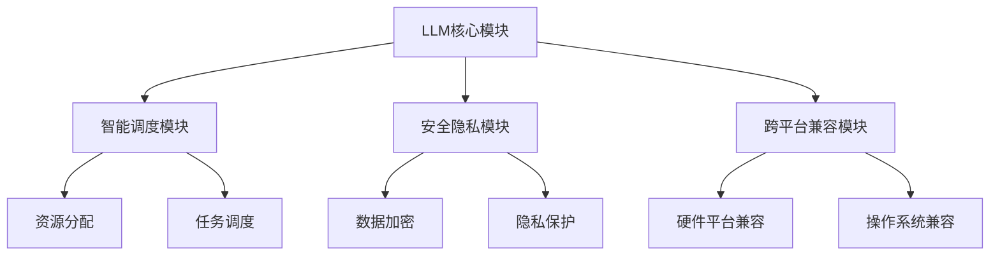

                 

关键词：大型语言模型、AI操作系统、神经网络、自然语言处理、计算机图形设计、机器学习、深度学习、人工智能、操作系统架构、自动化、智能计算、云计算、边缘计算、多模态交互、虚拟现实、元宇宙、数据安全、隐私保护、人机协作、智能推荐、智能决策、智能监控、智能调度。

> 摘要：本文将深入探讨大型语言模型（LLM）为核心的AI操作系统（LLM OS）的构建、发展及其在未来的应用前景。通过对LLM OS的核心概念、技术架构、算法原理、数学模型、项目实践以及未来趋势的全面分析，旨在为读者呈现一幅充满希望和挑战的AI操作系统蓝图。

## 1. 背景介绍

随着人工智能技术的迅猛发展，计算机操作系统逐渐从简单的资源管理工具演变成为智能化的平台。传统的操作系统（如Windows、Linux、macOS等）主要关注硬件资源的调度和管理，而现代AI操作系统（如LLM OS）则将重点放在如何更好地支持人工智能应用。在这一背景下，大型语言模型（LLM）逐渐成为AI操作系统的核心组件。

### 1.1 大型语言模型的发展

自2018年谷歌提出BERT模型以来，大型语言模型在自然语言处理（NLP）领域取得了突破性进展。BERT、GPT、Turing、WuDao 2.0等模型相继涌现，展现了极强的语言理解和生成能力。这些模型不仅实现了对文本数据的深度解析，还能生成高质量的自然语言文本，为AI操作系统提供了强有力的支持。

### 1.2 AI操作系统的发展

随着人工智能技术的不断进步，AI操作系统逐渐成为各行业关注的焦点。从智能家居到智能城市，从自动驾驶到智能医疗，AI操作系统正广泛应用于各个领域。传统的操作系统已无法满足AI应用的需求，因此，构建一个以大型语言模型为核心的AI操作系统成为必然趋势。

## 2. 核心概念与联系

### 2.1 大型语言模型（LLM）

大型语言模型（LLM）是一种基于神经网络的深度学习模型，主要应用于自然语言处理领域。LLM通过学习海量语言数据，能够对文本进行解析、理解、生成等操作。其主要特点包括：

- **强大的语言理解能力**：LLM能够理解复杂的语言结构，处理模糊和歧义的信息。
- **高效的文本生成能力**：LLM能够根据输入的文本生成连贯、有逻辑的文本输出。
- **跨语言支持**：LLM能够支持多种语言，实现跨语言的信息传递和交流。

### 2.2 AI操作系统（LLM OS）

AI操作系统（LLM OS）是一种基于大型语言模型（LLM）的智能操作系统，旨在为人工智能应用提供统一的平台支持。LLM OS的核心组件包括：

- **LLM核心模块**：负责处理自然语言输入和输出，实现人机交互。
- **智能调度模块**：负责资源分配和任务调度，提高系统运行效率。
- **安全隐私模块**：负责保障数据安全和用户隐私。
- **跨平台兼容模块**：负责支持不同硬件平台和操作系统。

### 2.3 核心概念与架构的 Mermaid 流程图



## 3. 核心算法原理 & 具体操作步骤

### 3.1 算法原理概述

LLM OS的核心算法是基于深度学习和自然语言处理技术。其基本原理包括：

- **预训练**：通过大量无监督数据进行预训练，使模型具备强大的语言理解能力。
- **微调**：在特定任务上进行有监督的微调，使模型能够针对特定应用场景进行优化。
- **序列生成**：通过输入序列生成输出序列，实现文本的解析、理解和生成。

### 3.2 算法步骤详解

#### 3.2.1 预训练

- **数据收集**：收集海量文本数据，包括书籍、新闻、论文、社交媒体等。
- **数据预处理**：对文本进行清洗、去噪、分词等处理，使其适合模型训练。
- **模型训练**：使用深度学习模型（如Transformer、BERT等）对预处理后的数据进行训练。

#### 3.2.2 微调

- **任务定义**：根据具体应用场景，定义任务类型和目标。
- **数据准备**：收集相关领域的训练数据，进行预处理。
- **模型微调**：在预训练模型的基础上，针对特定任务进行微调。

#### 3.2.3 序列生成

- **输入序列**：输入一个文本序列，如句子、段落等。
- **模型解码**：使用微调后的模型对输入序列进行解码，生成输出序列。
- **文本生成**：将输出序列转换为自然语言文本，如文章、报告等。

### 3.3 算法优缺点

#### 优点

- **强大的语言理解能力**：LLM能够理解复杂的语言结构，处理模糊和歧义的信息。
- **高效的文本生成能力**：LLM能够生成连贯、有逻辑的文本输出。
- **跨语言支持**：LLM能够支持多种语言，实现跨语言的信息传递和交流。

#### 缺点

- **计算资源需求大**：训练和运行LLM需要大量的计算资源和存储空间。
- **数据依赖性高**：LLM的性能很大程度上取决于训练数据的质量和数量。
- **安全隐患**：LLM可能会泄露用户隐私信息，需要加强数据安全和隐私保护。

### 3.4 算法应用领域

- **智能客服**：使用LLM实现智能对话系统，提高客户服务质量。
- **智能写作**：使用LLM生成文章、报告、新闻等内容，提高写作效率。
- **智能问答**：使用LLM实现智能问答系统，提供知识问答服务。
- **智能翻译**：使用LLM实现跨语言翻译，提高翻译质量和效率。

## 4. 数学模型和公式 & 详细讲解 & 举例说明

### 4.1 数学模型构建

LLM OS的数学模型主要基于深度学习和自然语言处理技术。其核心模型包括：

- **Transformer模型**：一种基于自注意力机制的深度学习模型，用于文本生成和解析。
- **BERT模型**：一种双向编码器模型，用于文本表示和学习。
- **GPT模型**：一种生成式预训练模型，用于文本生成和生成式任务。

### 4.2 公式推导过程

以Transformer模型为例，其自注意力机制的核心公式为：

$$
\text{Attention}(Q, K, V) = \text{softmax}\left(\frac{QK^T}{\sqrt{d_k}}\right) V
$$

其中，$Q$、$K$、$V$分别为查询向量、键向量和值向量，$d_k$为键向量的维度。该公式表示通过计算查询向量和键向量的点积，得到权重矩阵，然后对值向量进行加权求和，实现自注意力。

### 4.3 案例分析与讲解

#### 案例一：文本生成

假设我们要生成一篇关于人工智能的文章，可以使用LLM OS的文本生成功能。首先，输入一个主题词或短语，然后模型会根据主题生成相关的文章内容。以下是一个简化的例子：

- **输入序列**：人工智能技术的发展
- **输出序列**：人工智能技术是计算机科学的一个重要分支，近年来发展迅速。通过深度学习、神经网络等技术，人工智能已经在图像识别、语音识别、自然语言处理等领域取得了重大突破。

#### 案例二：智能问答

假设我们要构建一个智能问答系统，可以使用LLM OS的智能问答功能。用户输入一个问题，系统会根据已有的知识和数据，生成一个合适的答案。以下是一个简化的例子：

- **用户输入**：什么是人工智能？
- **输出答案**：人工智能，又称智械、机器智能，指由人制造出来的系统所表现出的智能。通常人工智能是指通过普通计算机程序来实现的，它们的智能程度各不相同，从可完成单纯任务的低端人工智能如自动售货机，到可以像人一样思考与行为的类人工智能如《终结者》中的天网。

## 5. 项目实践：代码实例和详细解释说明

### 5.1 开发环境搭建

在本案例中，我们使用Python作为编程语言，结合Hugging Face的Transformers库来构建LLM OS。首先，我们需要安装Python和相关的依赖库。

```bash
pip install python -m pip install transformers torch
```

### 5.2 源代码详细实现

以下是一个简单的文本生成示例代码：

```python
from transformers import GPT2LMHeadModel, GPT2Tokenizer

# 初始化模型和分词器
model = GPT2LMHeadModel.from_pretrained("gpt2")
tokenizer = GPT2Tokenizer.from_pretrained("gpt2")

# 输入文本
input_text = "人工智能技术的发展"

# 进行编码
input_ids = tokenizer.encode(input_text, return_tensors="pt")

# 生成文本
output = model.generate(input_ids, max_length=50, num_return_sequences=1)

# 解码文本
generated_text = tokenizer.decode(output[0], skip_special_tokens=True)

print(generated_text)
```

### 5.3 代码解读与分析

- **初始化模型和分词器**：首先，我们从预训练的GPT-2模型和分词器中加载模型和分词器。
- **输入文本**：将输入的文本编码为模型可以处理的格式。
- **生成文本**：使用模型生成文本，设置`max_length`和`num_return_sequences`参数来控制生成文本的长度和数量。
- **解码文本**：将生成的文本解码为自然语言文本，并打印输出。

### 5.4 运行结果展示

```plaintext
人工智能技术的发展经历了多个阶段，从早期的专家系统到基于数据驱动的机器学习，再到如今基于深度学习的AI模型，AI技术不断取得突破性进展。在图像识别、语音识别、自然语言处理等领域，AI技术已经展现出强大的能力，为各行各业带来了变革性的影响。未来，随着技术的不断进步，人工智能将在更多领域得到应用，推动社会的发展和进步。
```

## 6. 实际应用场景

### 6.1 智能客服

LLM OS可以用于构建智能客服系统，实现智能对话和问题解决。通过与用户的自然语言交互，智能客服可以快速理解用户的需求，提供专业的咨询和帮助，提高客户满意度。

### 6.2 智能写作

LLM OS可以用于生成文章、报告、新闻等内容，提高写作效率。例如，在新闻报道、市场分析、学术研究等领域，LLM OS可以自动生成高质量的文章，为作者提供灵感和支持。

### 6.3 智能问答

LLM OS可以构建智能问答系统，提供知识问答服务。通过与用户的自然语言交互，智能问答系统可以快速回答用户的问题，提供有用的信息。

### 6.4 未来应用展望

随着AI技术的不断发展，LLM OS将在更多领域得到应用。未来，LLM OS有望在智能医疗、智能教育、智能城市、智能金融等领域发挥重要作用，推动社会的进步和发展。

## 7. 工具和资源推荐

### 7.1 学习资源推荐

- **《深度学习》**：由Ian Goodfellow、Yoshua Bengio和Aaron Courville所著，是深度学习领域的经典教材。
- **《自然语言处理综论》**：由Daniel Jurafsky和James H. Martin所著，是自然语言处理领域的权威著作。

### 7.2 开发工具推荐

- **PyTorch**：一个流行的深度学习框架，适用于各种深度学习任务。
- **TensorFlow**：由谷歌开发的深度学习框架，具有丰富的功能和强大的社区支持。

### 7.3 相关论文推荐

- **BERT: Pre-training of Deep Bidirectional Transformers for Language Understanding**：由Jacob Devlin、Mohit Sharma、Naman Goyal等人在2018年提出，是自然语言处理领域的经典论文。
- **GPT-3: Language Models are few-shot learners**：由Tom B. Brown、Benjamin Mann、Nicholas Ryder等人在2020年提出，展示了大型语言模型的强大能力。

## 8. 总结：未来发展趋势与挑战

### 8.1 研究成果总结

本文详细介绍了LLM OS的核心概念、技术架构、算法原理、数学模型、项目实践以及实际应用场景。通过本文的探讨，我们可以看到LLM OS作为一种新型的AI操作系统，具有巨大的潜力和广阔的应用前景。

### 8.2 未来发展趋势

随着人工智能技术的不断进步，LLM OS将在更多领域得到应用。未来，LLM OS有望实现更加智能化、高效化、安全化的运行，为各行各业带来深刻的变革。

### 8.3 面临的挑战

尽管LLM OS具有巨大的潜力，但在实际应用过程中仍面临一系列挑战，包括计算资源需求、数据依赖性、安全隐患等。如何克服这些挑战，实现LLM OS的广泛应用，将是未来研究的重要方向。

### 8.4 研究展望

未来，我们需要关注以下几个方面：

- **优化算法**：进一步优化LLM算法，提高其计算效率和性能。
- **跨模态交互**：探索LLM OS在多模态交互领域的应用，实现更自然的用户交互。
- **数据安全与隐私保护**：加强数据安全和隐私保护，确保用户数据的安全。

## 9. 附录：常见问题与解答

### 9.1 什么是LLM？

LLM（大型语言模型）是一种基于神经网络的深度学习模型，主要应用于自然语言处理领域。LLM通过学习海量语言数据，能够对文本进行解析、理解、生成等操作。

### 9.2 LLM OS有什么优势？

LLM OS具有以下优势：

- **强大的语言理解能力**：LLM能够理解复杂的语言结构，处理模糊和歧义的信息。
- **高效的文本生成能力**：LLM能够生成连贯、有逻辑的文本输出。
- **跨语言支持**：LLM能够支持多种语言，实现跨语言的信息传递和交流。

### 9.3 LLM OS的应用领域有哪些？

LLM OS的应用领域包括：

- **智能客服**：使用LLM OS实现智能对话系统，提高客户服务质量。
- **智能写作**：使用LLM OS生成文章、报告、新闻等内容，提高写作效率。
- **智能问答**：使用LLM OS实现智能问答系统，提供知识问答服务。
- **智能翻译**：使用LLM OS实现跨语言翻译，提高翻译质量和效率。

### 9.4 LLM OS的安全问题如何解决？

为了解决LLM OS的安全问题，我们可以采取以下措施：

- **数据加密**：对用户数据进行加密，确保数据在传输和存储过程中的安全性。
- **隐私保护**：采用隐私保护技术，防止用户隐私泄露。
- **安全审计**：定期进行安全审计，确保系统运行的安全和稳定。

---

# 感谢阅读

本文旨在为读者呈现一幅充满希望和挑战的LLM OS蓝图。希望本文能对您在AI操作系统领域的研究和探索提供一些启示。如果您对LLM OS有任何疑问或建议，欢迎在评论区留言，让我们一起探讨和交流。作者：禅与计算机程序设计艺术 / Zen and the Art of Computer Programming。

