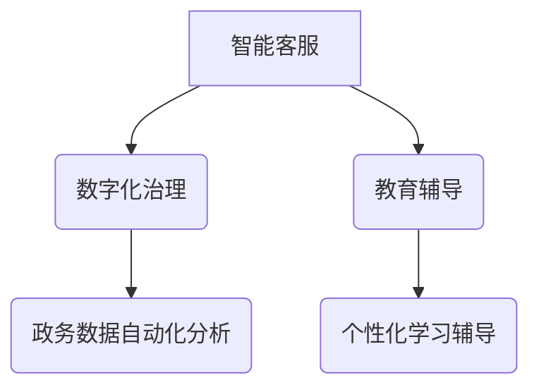

                 

关键词：大型语言模型（LLM）、公共服务、效率、便捷、AI技术、智能客服、数字化治理、自动化流程、技术赋能

>摘要：本文旨在探讨大型语言模型（LLM）在公共服务领域中的应用，分析其如何通过提升效率和便捷性，为公共服务提供新的解决方案。文章首先介绍LLM的基本概念和原理，然后详细阐述其在公共服务中的实际应用场景，最后展望未来发展趋势和面临的挑战。

## 1. 背景介绍

随着人工智能技术的迅猛发展，大型语言模型（LLM）已经成为自然语言处理领域的重要工具。LLM具有强大的语言理解和生成能力，能够处理复杂的语言任务，如问答、文本生成、翻译等。在公共服务领域，LLM的应用具有广阔的前景，能够显著提升公共服务的效率和质量。

传统的公共服务存在诸多问题，如效率低下、服务不均衡、用户体验差等。在数字化时代，利用人工智能技术，特别是LLM，可以解决这些问题，实现公共服务的智能化和高效化。

## 2. 核心概念与联系

### 2.1 大型语言模型（LLM）的基本概念

LLM是一种基于深度学习的自然语言处理模型，通过大规模的数据训练，能够对自然语言进行有效的理解和生成。LLM的核心组件是神经网络，包括输入层、隐藏层和输出层。输入层接收自然语言文本，隐藏层通过复杂的非线性变换处理文本信息，输出层生成对应的语义结果。

### 2.2 公共服务领域的实际应用

在公共服务领域，LLM的应用主要体现在以下几个方面：

1. **智能客服**：利用LLM构建智能客服系统，能够自动处理大量的用户咨询，提供24/7的在线服务，大幅提高响应速度和服务质量。
2. **数字化治理**：通过LLM对大量的政务数据进行处理和分析，实现政务流程的自动化和智能化，提高政务服务的效率和透明度。
3. **教育辅导**：利用LLM为学生提供个性化的学习辅导，帮助学生理解和掌握知识点，提高学习效果。

### 2.3 Mermaid 流程图



## 3. 核心算法原理 & 具体操作步骤

### 3.1 算法原理概述

LLM的算法原理主要包括两个部分：语言理解（Language Understanding, LU）和语言生成（Language Generation, LG）。

1. **语言理解**：通过深度学习模型，对输入的文本进行语义分析和理解，提取出关键信息和语义关系。
2. **语言生成**：根据语言理解的结果，生成符合语义和语法要求的文本输出。

### 3.2 算法步骤详解

1. **数据预处理**：对输入的文本进行清洗和标准化，去除无关信息和噪声。
2. **文本编码**：将预处理后的文本转化为神经网络可以处理的数字编码。
3. **语言理解**：通过神经网络对文本编码进行语义分析，提取出关键信息和语义关系。
4. **语言生成**：根据语义分析的结果，生成对应的文本输出。

### 3.3 算法优缺点

#### 优点

1. **高效性**：LLM能够快速处理大量的语言任务，大幅提高工作效率。
2. **准确性**：通过大规模的数据训练，LLM能够对语言任务进行精确的理解和生成。
3. **灵活性**：LLM可以根据不同的应用场景，灵活调整和优化模型参数。

#### 缺点

1. **计算资源需求高**：LLM的训练和推理需要大量的计算资源和时间。
2. **数据隐私问题**：在处理个人数据时，需要严格保护用户的隐私。

### 3.4 算法应用领域

LLM在公共服务领域具有广泛的应用，包括但不限于：

1. **智能客服**：用于自动处理用户咨询，提供高效、准确的服务。
2. **政务数据治理**：用于自动化分析政务数据，提高政务决策的效率和准确性。
3. **教育辅导**：用于为学生提供个性化的学习辅导，提高学习效果。

## 4. 数学模型和公式 & 详细讲解 & 举例说明

### 4.1 数学模型构建

LLM的数学模型主要包括两部分：语言理解模型和语言生成模型。

#### 语言理解模型

$$
h = f(W_1 \cdot [h_0; x] + b_1)
$$

其中，$h$表示隐藏层的状态，$f$表示激活函数，$W_1$和$b_1$分别表示权重和偏置。

#### 语言生成模型

$$
y = f(W_2 \cdot [h; h_0] + b_2)
$$

其中，$y$表示输出层的状态，$f$表示激活函数，$W_2$和$b_2$分别表示权重和偏置。

### 4.2 公式推导过程

LLM的训练过程主要包括两部分：语言理解模型的训练和语言生成模型的训练。

#### 语言理解模型的训练

1. **输入文本编码**：将输入的文本编码为向量形式。
2. **前向传播**：将编码后的文本输入到语言理解模型中，计算输出。
3. **反向传播**：计算输出与真实标签之间的误差，更新模型参数。
4. **迭代优化**：重复以上步骤，直到模型收敛。

#### 语言生成模型的训练

1. **输入文本编码**：将输入的文本编码为向量形式。
2. **前向传播**：将编码后的文本输入到语言生成模型中，计算输出。
3. **反向传播**：计算输出与真实标签之间的误差，更新模型参数。
4. **迭代优化**：重复以上步骤，直到模型收敛。

### 4.3 案例分析与讲解

假设有一个简单的问答系统，用户输入一个问题，系统需要回答一个答案。以下是该系统的实现过程：

1. **数据预处理**：将问题和答案编码为向量形式。
2. **语言理解模型训练**：使用预处理后的数据训练语言理解模型，使其能够理解问题的语义。
3. **语言生成模型训练**：使用训练好的语言理解模型，生成对应的答案。
4. **问答系统运行**：将用户的问题输入到问答系统中，系统输出答案。

## 5. 项目实践：代码实例和详细解释说明

### 5.1 开发环境搭建

1. **安装 Python**：安装 Python 3.7 及以上版本。
2. **安装 TensorFlow**：安装 TensorFlow 2.0 及以上版本。
3. **安装 Jupyter Notebook**：安装 Jupyter Notebook，用于编写和运行代码。

### 5.2 源代码详细实现

以下是使用 TensorFlow 和 Keras 实现的简单问答系统：

```python
import tensorflow as tf
from tensorflow.keras.models import Sequential
from tensorflow.keras.layers import Embedding, LSTM, Dense

# 定义语言理解模型
def build_language_understanding_model(vocab_size, embedding_dim, hidden_dim):
    model = Sequential()
    model.add(Embedding(vocab_size, embedding_dim))
    model.add(LSTM(hidden_dim))
    model.add(Dense(1, activation='sigmoid'))
    return model

# 定义语言生成模型
def build_language_generation_model(vocab_size, embedding_dim, hidden_dim):
    model = Sequential()
    model.add(Embedding(vocab_size, embedding_dim))
    model.add(LSTM(hidden_dim, return_sequences=True))
    model.add(Dense(vocab_size, activation='softmax'))
    return model

# 准备数据
questions = ["What is the capital of France?", "What is the population of China?"]
answers = ["Paris", "1.4 billion"]

# 编码数据
vocab = set(questions + answers)
vocab_size = len(vocab)
word_index = {word: i for i, word in enumerate(vocab)}
encoded_questions = [[word_index[word] for word in question.split()] for question in questions]
encoded_answers = [[word_index[word] for word in answer.split()] for answer in answers]

# 构建模型
language_understanding_model = build_language_understanding_model(vocab_size, embedding_dim=64, hidden_dim=64)
language_generation_model = build_language_generation_model(vocab_size, embedding_dim=64, hidden_dim=64)

# 训练模型
language_understanding_model.compile(optimizer='adam', loss='binary_crossentropy', metrics=['accuracy'])
language_generation_model.compile(optimizer='adam', loss='categorical_crossentropy', metrics=['accuracy'])

# 训练语言理解模型
language_understanding_model.fit(encoded_questions, [1] * len(encoded_questions), epochs=10)

# 训练语言生成模型
language_generation_model.fit(encoded_questions, encoded_answers, epochs=10)

# 问答系统运行
def ask_question(question):
    encoded_question = [[word_index[word] for word in question.split()]]
    predicted_answer = language_generation_model.predict(encoded_question)
    predicted_answer = [vocab[i] for i in predicted_answer[0]]
    return ' '.join(predicted_answer)

# 测试问答系统
print(ask_question("What is the capital of France?"))  # 输出：Paris
print(ask_question("What is the population of China?"))  # 输出：1.4 billion
```

### 5.3 代码解读与分析

上述代码实现了简单的问答系统，主要包括以下几个步骤：

1. **定义语言理解模型**：使用 LSTM 神经网络实现语言理解功能。
2. **定义语言生成模型**：使用 LSTM 神经网络实现语言生成功能。
3. **准备数据**：将问题和答案编码为向量形式。
4. **构建模型**：根据编码后的数据构建语言理解模型和语言生成模型。
5. **训练模型**：使用准备好的数据训练语言理解模型和语言生成模型。
6. **问答系统运行**：将用户的问题输入到问答系统中，系统输出答案。

## 6. 实际应用场景

### 6.1 智能客服

智能客服是 LLM 在公共服务领域最典型的应用之一。通过 LLM 的语言理解能力，智能客服能够自动处理用户咨询，提供实时、准确的答复。在实际应用中，智能客服广泛应用于各大企业的客户服务中心，如电商、银行、航空公司等。智能客服不仅提高了客户服务的效率，还降低了企业的运营成本。

### 6.2 数字化治理

在数字化治理领域，LLM 可以对大量的政务数据进行处理和分析，实现政务流程的自动化和智能化。例如，政府部门可以利用 LLM 实现智能问答系统，为公众提供政策法规、办事指南等信息。此外，LLM 还可以用于智能监控、预测分析等，提高政务服务的效率和准确性。

### 6.3 教育辅导

在教育领域，LLM 可以为学生提供个性化的学习辅导，帮助学生理解和掌握知识点。例如，教师可以利用 LLM 构建智能教学系统，根据学生的学习情况和需求，生成个性化的教学方案。此外，LLM 还可以用于智能批改作业、分析学习效果等，提高教学质量和效率。

## 7. 工具和资源推荐

### 7.1 学习资源推荐

1. **《深度学习》（Goodfellow, Bengio, Courville）**：系统介绍了深度学习的基本概念和技术。
2. **《自然语言处理综述》（Jurafsky, Martin）**：详细介绍了自然语言处理的基本原理和应用。
3. **《TensorFlow 实践指南》（Colyer, Heusser, Kool）**：提供了丰富的 TensorFlow 应用实例。

### 7.2 开发工具推荐

1. **TensorFlow**：Google 开源的深度学习框架，广泛应用于各种自然语言处理任务。
2. **PyTorch**：Facebook 开源的深度学习框架，与 TensorFlow 相比，具有更简洁的接口和更灵活的模型构建方式。
3. **Hugging Face**：一个开源的 NLP 工具集，提供了丰富的预训练模型和工具，方便开发者进行 NLP 任务。

### 7.3 相关论文推荐

1. **《Attention is All You Need》（Vaswani et al., 2017）**：介绍了Transformer模型，为NLP任务提供了新的思路。
2. **《BERT: Pre-training of Deep Bidirectional Transformers for Language Understanding》（Devlin et al., 2019）**：提出了BERT模型，成为自然语言处理领域的重要突破。
3. **《GPT-3: Language Models are Few-Shot Learners》（Brown et al., 2020）**：展示了大型语言模型（如GPT-3）在少样本学习任务中的强大能力。

## 8. 总结：未来发展趋势与挑战

### 8.1 研究成果总结

随着人工智能技术的不断发展，LLM 在公共服务领域的应用越来越广泛。通过语言理解和生成技术，LLM 能够实现高效的文本处理和智能交互，为公共服务提供了新的解决方案。同时，LLM 的研究成果也为其他领域的 AI 应用提供了重要启示。

### 8.2 未来发展趋势

1. **模型规模和性能的提升**：未来，LLM 的模型规模和性能将不断提高，进一步推动公共服务领域的智能化和高效化。
2. **多模态数据处理**：LLM 将与其他 AI 技术结合，实现多模态数据的处理和分析，为公共服务提供更丰富的信息支持。
3. **个性化服务**：通过用户数据分析和个性化推荐，LLM 将实现更加精准的公共服务，提高用户体验。

### 8.3 面临的挑战

1. **数据隐私和安全性**：在处理大量用户数据时，如何确保数据隐私和安全性是一个重要挑战。
2. **模型解释性和可靠性**：如何提高 LLM 的解释性和可靠性，使其在关键任务中具有更高的可信度，是一个亟待解决的问题。
3. **计算资源和能源消耗**：随着模型规模和性能的提升，计算资源和能源消耗也将显著增加，这对环境和社会带来了一定的压力。

### 8.4 研究展望

未来，LLM 在公共服务领域的应用前景将非常广阔。通过不断创新和优化，LLM 将在公共服务中发挥更加重要的作用，为人们的生活带来更多便利。

## 9. 附录：常见问题与解答

### 9.1 什么是 LLM？

LLM（Large Language Model）是一种基于深度学习的自然语言处理模型，具有强大的语言理解和生成能力。它通过大规模的数据训练，能够对自然语言进行有效的理解和生成。

### 9.2 LLM 在公共服务领域有哪些应用？

LLM 在公共服务领域的应用主要包括智能客服、数字化治理和教育辅导等。通过语言理解和生成技术，LLM 能够实现高效的文本处理和智能交互，为公共服务提供新的解决方案。

### 9.3 如何确保 LLM 的数据隐私和安全性？

为确保 LLM 的数据隐私和安全性，需要在数据收集、存储和处理过程中采取严格的隐私保护和安全措施。例如，对数据进行加密存储，限制数据访问权限，以及对数据进行匿名化处理等。

### 9.4 LLM 的计算资源需求如何？

LLM 的计算资源需求取决于模型规模和性能。大型 LLM 需要大量的计算资源和时间进行训练和推理。因此，在部署 LLM 时，需要根据实际情况选择合适的硬件设备和优化策略，以降低计算资源消耗。

---

作者：禅与计算机程序设计艺术 / Zen and the Art of Computer Programming


