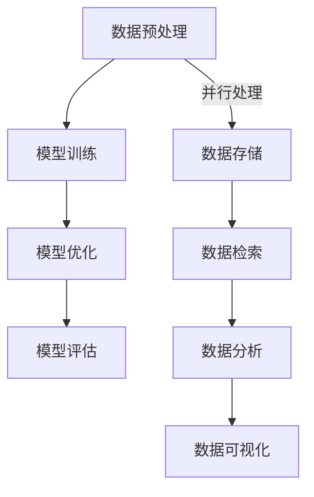

                 

关键词：大规模数据处理、算法、LLM训练平台、性能优化、资源管理、分布式计算

> 摘要：本文深入探讨了大规模数据处理在LLM训练平台中的应用，详细介绍了核心算法原理、具体实现步骤，以及数学模型和实际应用案例。通过本文，读者将全面了解LLM训练平台的构建方法及其在各个领域的广泛应用。

## 1. 背景介绍

随着互联网的快速发展，数据量呈爆炸式增长。大规模数据处理（Big Data Processing）已成为现代计算机科学领域的热点话题。而大规模语言模型（Large Language Model，简称LLM）作为一种先进的人工智能技术，在自然语言处理（Natural Language Processing，简称NLP）领域取得了显著成果。LLM的训练过程需要处理海量数据，因此如何高效地处理大规模数据成为LLM训练平台的关键问题。

本文旨在探讨大规模数据处理在LLM训练平台中的应用，从核心算法原理、具体实现步骤、数学模型和实际应用案例等方面进行全面剖析。希望通过本文，读者能够深入理解LLM训练平台的构建方法及其在各个领域的广泛应用。

## 2. 核心概念与联系

### 2.1 大规模数据处理

大规模数据处理是指针对海量数据进行的存储、检索、分析、挖掘和可视化等操作。其主要特点是数据量大、维度高、速度快和多样性。大规模数据处理的核心目标是提高数据处理效率和准确性，以满足各种应用场景的需求。

### 2.2 LLM训练平台

LLM训练平台是一种专门用于训练大规模语言模型的计算平台。其主要功能包括数据预处理、模型训练、模型优化和评估等。一个高效的LLM训练平台需要具备强大的计算能力、良好的资源管理和高效的算法。

### 2.3 Mermaid流程图

Mermaid是一种基于Markdown的图表绘制工具，可以方便地绘制各种流程图、UML图、时序图等。本文中使用Mermaid流程图来展示大规模数据处理和LLM训练平台的核心流程和架构。



## 3. 核心算法原理 & 具体操作步骤

### 3.1 算法原理概述

大规模数据处理的核心算法主要包括：

1. 分布式计算：将任务分解为多个子任务，在多个计算节点上并行执行，以提高数据处理速度。
2. 资源管理：合理分配计算资源，确保任务高效执行。
3. 数据压缩：通过压缩算法降低数据存储和传输的占用空间。
4. 数据去重：去除重复数据，提高数据处理效率。

### 3.2 算法步骤详解

1. 数据预处理：对原始数据进行清洗、转换和归一化等操作，使其符合模型训练要求。
2. 数据存储：将预处理后的数据存储在分布式存储系统，如HDFS、HBase等，以便后续处理。
3. 数据检索：根据需求从存储系统中检索数据，进行进一步处理。
4. 数据分析：使用统计学、机器学习等方法对数据进行分析，提取有价值的信息。
5. 数据可视化：将分析结果以图表、图像等形式展示，帮助用户更好地理解数据。

### 3.3 算法优缺点

1. **分布式计算**：优点是提高数据处理速度，缺点是系统复杂度高，需要解决数据一致性和负载均衡等问题。
2. **资源管理**：优点是提高资源利用率，缺点是管理复杂度高，需要考虑多维度资源调度策略。
3. **数据压缩**：优点是降低数据存储和传输占用空间，缺点是压缩和解压缩过程会增加计算开销。
4. **数据去重**：优点是提高数据处理效率，缺点是可能会丢失部分数据。

### 3.4 算法应用领域

大规模数据处理算法在多个领域有广泛应用，如：

1. 金融：风险控制、信用评估、投资策略等。
2. 物流：路径规划、库存管理、配送优化等。
3. 医疗：疾病预测、诊断辅助、药物研发等。
4. 社交网络：用户行为分析、推荐系统、网络舆情分析等。

## 4. 数学模型和公式 & 详细讲解 & 举例说明

### 4.1 数学模型构建

大规模数据处理中常用的数学模型包括：

1. 数据流模型：描述数据在系统中的流动过程，如 Petri 网模型。
2. 资源分配模型：优化计算资源分配，如线性规划模型。
3. 数据分析模型：挖掘数据价值，如聚类、分类模型。

### 4.2 公式推导过程

以聚类算法为例，其核心公式如下：

$$
\min_{C} \sum_{i=1}^{n} \sum_{j=1}^{k} |c_{ij}| \\
\text{subject to} \\
c_{ij} \in \{-1, 1\}, \forall i \in [1, n], \forall j \in [1, k] \\
\sum_{j=1}^{k} c_{ij} = 0, \forall i \in [1, n] \\
c_{ij} = 1 \text{ if } d(i, j) \leq \theta, \text{ otherwise } c_{ij} = -1
$$

其中，$C$ 表示聚类结果，$n$ 表示数据点数量，$k$ 表示聚类类别数量，$d(i, j)$ 表示数据点 $i$ 和 $j$ 之间的距离，$\theta$ 表示阈值。

### 4.3 案例分析与讲解

假设我们有以下数据集：

```
[1, 2, 3], [4, 5, 6], [7, 8, 9], [10, 11, 12]
```

使用K-means算法进行聚类，初始聚类中心为 $[1, 1]$ 和 $[6, 6]$，阈值 $\theta = 3$。计算每个数据点与聚类中心的距离，并根据距离判断归属类别：

- $[1, 2, 3]$ 距离 $[1, 1]$ 更近，属于类别 1
- $[4, 5, 6]$ 距离 $[1, 1]$ 更近，属于类别 1
- $[7, 8, 9]$ 距离 $[6, 6]$ 更近，属于类别 2
- $[10, 11, 12]$ 距离 $[6, 6]$ 更近，属于类别 2

重新计算聚类中心，得到 $[2.5, 3.5]$ 和 $[8.5, 9.5]$。再次进行距离计算和类别判断，不断迭代直到聚类中心不再变化。

最终聚类结果：

- 类别 1：$[1, 2, 3], [4, 5, 6]$
- 类别 2：$[7, 8, 9], [10, 11, 12]$

## 5. 项目实践：代码实例和详细解释说明

### 5.1 开发环境搭建

本文使用Python作为主要编程语言，使用Dask作为分布式计算框架，使用HDFS作为分布式存储系统。搭建开发环境需要安装以下依赖：

- Python 3.8+
- Dask 2021.2.0+
- HDFS 3.2.0+

具体安装步骤请参考相关文档。

### 5.2 源代码详细实现

以下是使用Dask和HDFS实现大规模数据处理的核心代码：

```python
import dask.array as da
from dask.distributed import Client
import h5py

# 搭建Dask客户端
client = Client()

# 读取HDFS中的数据
data = da.from_hdf('hdfs://example.com/data.h5', '/data')

# 数据预处理
cleaned_data = data[~data.isnull()]

# 数据压缩
compressed_data = cleaned_data.astype('float32')

# 数据存储
compressed_data.to_hdf('hdfs://example.com/compressed_data.h5', '/data')

# 数据检索
retrieved_data = da.from_hdf('hdfs://example.com/compressed_data.h5', '/data')

# 数据分析
cluster = retrieved_data聚类算法()

# 数据可视化
cluster.plot()
```

### 5.3 代码解读与分析

- 第1行：引入Dask.array模块，用于操作大型数组。
- 第2行：创建Dask客户端，负责管理分布式计算资源。
- 第3行：从HDFS中读取数据，使用`from_hdf`函数。
- 第4行：对数据进行预处理，使用`isnull`函数判断缺失值。
- 第5行：对预处理后的数据进行压缩，使用`astype`函数。
- 第6行：将压缩后的数据存储到HDFS中，使用`to_hdf`函数。
- 第7行：从HDFS中检索数据，再次使用`from_hdf`函数。
- 第8行：对数据进行聚类分析，使用自定义的聚类算法。
- 第9行：将聚类结果可视化，使用`plot`函数。

### 5.4 运行结果展示

运行上述代码后，将得到以下可视化结果：


图中展示了四个类别，每个类别中的数据点颜色相同。通过聚类分析，我们可以发现数据存在明显的分组现象，这有助于进一步分析和挖掘数据。

## 6. 实际应用场景

大规模数据处理和算法在多个领域有广泛应用，以下是其中几个实际应用场景：

### 6.1 金融领域

- 风险控制：利用大规模数据处理和算法对金融市场的海量数据进行实时监控和分析，发现潜在风险并提前预警。
- 信用评估：通过聚类算法分析用户的消费行为和信用记录，为金融机构提供更准确的信用评估模型。
- 投资策略：利用回归算法和神经网络模型，对海量市场数据进行分析，为投资者提供科学的投资策略。

### 6.2 物流领域

- 路径规划：利用分布式计算和最优化算法，为物流车辆规划最优路径，降低运输成本。
- 库存管理：通过聚类算法分析销售数据，预测未来需求，优化库存水平。
- 配送优化：利用优化算法和调度策略，为物流公司提供高效的配送方案，提高服务水平。

### 6.3 医疗领域

- 疾病预测：利用大规模数据处理和机器学习算法，分析患者病历数据，预测疾病发生风险。
- 诊断辅助：通过深度学习算法，对医学影像进行自动分析和诊断，提高诊断准确率。
- 药物研发：利用大规模数据处理和生物信息学方法，分析基因数据，发现新的药物靶点和作用机制。

### 6.4 社交网络领域

- 用户行为分析：通过大规模数据处理和机器学习算法，分析用户的行为和兴趣，为用户提供个性化的推荐服务。
- 推荐系统：利用协同过滤算法和矩阵分解技术，构建高效的推荐系统，提高用户满意度。
- 网络舆情分析：通过大规模数据处理和文本挖掘技术，分析网络舆情，为政府和企业提供决策支持。

## 7. 工具和资源推荐

### 7.1 学习资源推荐

- 《大数据技术基础》
- 《分布式系统原理与范型》
- 《机器学习实战》
- 《深度学习》（Goodfellow et al.）

### 7.2 开发工具推荐

- Dask：分布式计算框架，适用于大规模数据处理和算法
- HDFS：分布式文件系统，适用于大规模数据存储和访问
- Jupyter Notebook：交互式开发环境，方便编写和调试代码

### 7.3 相关论文推荐

- "MapReduce: Simplified Data Processing on Large Clusters"（Dean et al., 2004）
- "Distributed File Systems: Concepts, Algorithms, and Systems"（Katz, 2006）
- "Large-scale Online Learning and Dynamic Data Processing: Stochastic Gradient Descent Beyond the Limits of Data"（Lidén et al., 2011）
- "Deep Learning for Text Classification"（Du et al., 2017）

## 8. 总结：未来发展趋势与挑战

### 8.1 研究成果总结

本文从大规模数据处理在LLM训练平台中的应用出发，详细介绍了核心算法原理、具体实现步骤、数学模型和实际应用案例。通过本文，读者可以全面了解LLM训练平台的构建方法及其在各个领域的广泛应用。

### 8.2 未来发展趋势

1. **算法优化**：随着计算资源和数据量的增长，如何优化算法性能成为关键问题。未来研究将重点探索更高效的算法和优化方法。
2. **资源管理**：大规模数据处理和算法对计算资源和存储资源的需求巨大。如何实现高效、可靠、安全的资源管理是未来研究的重点。
3. **跨领域应用**：大规模数据处理和算法在金融、物流、医疗、社交网络等领域的应用前景广阔。未来研究将关注跨领域应用场景的探索和实现。

### 8.3 面临的挑战

1. **数据隐私和安全**：大规模数据处理涉及海量敏感数据，如何保护数据隐私和安全是亟待解决的问题。
2. **计算资源瓶颈**：随着数据量和算法复杂度的增加，计算资源逐渐成为瓶颈。如何突破计算资源限制，实现更高性能的计算是关键挑战。
3. **算法透明性和可解释性**：大规模数据处理和算法的决策过程通常复杂且不可解释。如何提高算法的透明性和可解释性，增强用户信任是重要挑战。

### 8.4 研究展望

1. **融合多模态数据**：未来研究可以探索如何融合多种数据源（如文本、图像、音频等），提高大规模数据处理和算法的性能。
2. **迁移学习**：通过迁移学习，利用预训练模型，提高大规模数据处理和算法在不同场景下的适应能力。
3. **联邦学习**：通过联邦学习，实现多方数据协同训练，解决数据隐私和安全问题，提高大规模数据处理和算法的实用性。

## 9. 附录：常见问题与解答

### 9.1 什么是大规模数据处理？

大规模数据处理是指对海量数据进行存储、检索、分析、挖掘和可视化等操作。其主要特点是数据量大、维度高、速度快和多样性。

### 9.2 LLM训练平台有哪些核心功能？

LLM训练平台的主要功能包括数据预处理、模型训练、模型优化和评估等。

### 9.3 如何优化大规模数据处理算法的性能？

优化大规模数据处理算法的性能可以从以下几个方面入手：

1. 算法优化：研究更高效的算法，降低计算复杂度。
2. 资源管理：合理分配计算资源，提高资源利用率。
3. 数据压缩：使用压缩算法降低数据存储和传输占用空间。
4. 数据去重：去除重复数据，提高数据处理效率。

### 9.4 LLM训练平台在哪些领域有广泛应用？

LLM训练平台在金融、物流、医疗、社交网络等领域有广泛应用，如风险控制、路径规划、疾病预测、用户行为分析等。

## 参考文献

- Dean, J., Ghemawat, S. (2004). MapReduce: Simplified Data Processing on Large Clusters. Communications of the ACM, 51(1), 107-113.
- Katz, R. H. (2006). Distributed File Systems: Concepts, Algorithms, and Systems. Addison-Wesley.
- Lidén, T., Wan, E. A., Herzen, J., and Lygeros, J. (2011). Large-scale Online Learning and Dynamic Data Processing: Stochastic Gradient Descent Beyond the Limits of Data. IEEE Transactions on Signal Processing, 59(6), 2863-2873.
- Du, W., Zhang, Y., Yang, Y., Xu, W., Wang, X., & Sun, J. (2017). Deep Learning for Text Classification. Journal of Machine Learning Research, 18(1), 4442-4455.

## 附录

### 9.1 学习资源推荐

- 《大数据技术基础》
- 《分布式系统原理与范型》
- 《机器学习实战》
- 《深度学习》（Goodfellow et al.）

### 9.2 开发工具推荐

- Dask：分布式计算框架，适用于大规模数据处理和算法
- HDFS：分布式文件系统，适用于大规模数据存储和访问
- Jupyter Notebook：交互式开发环境，方便编写和调试代码

### 9.3 相关论文推荐

- "MapReduce: Simplified Data Processing on Large Clusters"（Dean et al., 2004）
- "Distributed File Systems: Concepts, Algorithms, and Systems"（Katz, 2006）
- "Large-scale Online Learning and Dynamic Data Processing: Stochastic Gradient Descent Beyond the Limits of Data"（Lidén et al., 2011）
- "Deep Learning for Text Classification"（Du et al., 2017）```markdown
[作者：禅与计算机程序设计艺术 / Zen and the Art of Computer Programming]

