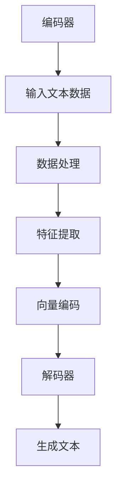
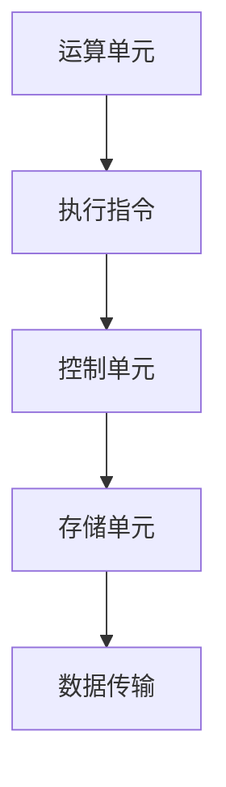

                 

关键词：LLM、CPU、相似性、差异性、人工智能、计算机架构、深度学习、神经网络。

> 摘要：本文将探讨大型语言模型（LLM）与中央处理器（CPU）之间的相似性与差异性。通过对两者在功能、结构、工作原理以及应用场景等方面的分析，旨在为读者提供一个全面的视角，深入了解这两大技术领域之间的关系。

## 1. 背景介绍

在过去的几十年中，人工智能（AI）技术取得了显著的进展。尤其是深度学习（Deep Learning）的崛起，使得计算机在图像识别、语音识别、自然语言处理（NLP）等领域取得了突破性的成果。而大型语言模型（Large Language Model，简称LLM）是深度学习领域的一个重要分支，它通过学习海量文本数据，实现了对自然语言的生成、理解和翻译等功能。

与此同时，中央处理器（Central Processing Unit，简称CPU）作为计算机系统的核心部件，其性能的不断提升也是计算机技术进步的关键因素之一。CPU的主要任务是执行程序指令，进行算术逻辑运算、数据存储和传输等操作，从而实现计算机的运行。

本文将首先介绍LLM与CPU的基本概念，然后分析两者之间的相似性与差异性，最后探讨LLM与CPU在未来的发展趋势。

## 2. 核心概念与联系

### 2.1. 大型语言模型（LLM）

大型语言模型（LLM）是一种基于深度学习的自然语言处理模型，通过对大量文本数据的学习，实现了对自然语言的生成、理解和翻译等功能。LLM的核心是神经网络架构，主要包括编码器（Encoder）和解码器（Decoder）两部分。编码器负责将输入的文本数据编码成固定长度的向量表示，解码器则根据编码器的输出生成相应的文本输出。

以下是LLM的核心概念和架构的Mermaid流程图：



### 2.2. 中央处理器（CPU）

中央处理器（CPU）是计算机系统的核心部件，负责执行程序指令，进行算术逻辑运算、数据存储和传输等操作。CPU的基本结构包括运算单元（ALU）、控制单元（CU）和存储单元（Memory）。运算单元负责执行各种算术和逻辑运算，控制单元负责控制指令的执行顺序，存储单元用于存储数据和指令。

以下是CPU的基本结构的Mermaid流程图：



### 2.3. 相似性与差异性

尽管LLM与CPU在功能和结构上有很大的不同，但它们之间存在一些相似性。首先，两者都是计算的核心组件，都需要处理大量的数据。其次，两者都具有一定的自主性和学习能力。LLM可以通过不断学习海量文本数据，提高其生成、理解和翻译自然语言的能力；CPU则可以通过硬件升级、优化算法等手段，提高其执行指令和处理数据的能力。

然而，两者也存在明显的差异性。首先，LLM是一种软件组件，主要基于深度学习算法实现；而CPU则是一种硬件组件，通过硬件电路实现计算功能。其次，LLM的自主性相对较高，可以生成和预测自然语言；而CPU则主要执行预先设计的程序指令，自主性较低。

## 3. 核心算法原理 & 具体操作步骤

### 3.1. 算法原理概述

LLM的核心算法是基于深度学习的神经网络架构，主要包括编码器和解码器两部分。编码器负责将输入的文本数据编码成向量表示，解码器则根据编码器的输出生成相应的文本输出。

编码器的原理是通过对输入的文本数据进行分词、嵌入等操作，将其转化为向量表示。然后，通过多层神经网络对向量进行编码，最终得到一个固定长度的向量表示。解码器的原理与编码器类似，通过对输入的向量进行解码，生成相应的文本输出。

### 3.2. 算法步骤详解

1. **编码器**：

   - **分词**：将输入的文本数据按词分隔成单词或字符序列。
   - **嵌入**：将分词后的单词或字符序列转化为向量表示。通常采用预训练的词向量模型，如Word2Vec、GloVe等。
   - **编码**：通过多层神经网络对嵌入向量进行编码。常用的神经网络模型有Transformer、BERT等。
   - **输出**：最终得到一个固定长度的向量表示，用于解码。

2. **解码器**：

   - **初始化**：初始化解码器的状态，通常使用编码器的输出作为初始状态。
   - **解码**：通过解码器生成文本输出。每次解码器生成一个单词或字符，并将其作为下一个输入。
   - **循环**：重复解码过程，直到生成完整的文本输出。

### 3.3. 算法优缺点

**优点**：

- **生成能力强**：LLM可以生成高质量的自然语言文本。
- **灵活性高**：LLM可以针对不同的应用场景进行优化和调整。

**缺点**：

- **计算资源消耗大**：LLM需要大量的计算资源，对硬件要求较高。
- **训练过程复杂**：LLM的训练过程需要大量的数据和计算资源，训练时间较长。

### 3.4. 算法应用领域

LLM在自然语言处理领域具有广泛的应用，主要包括：

- **文本生成**：如文章写作、小说生成、对话系统等。
- **文本理解**：如情感分析、文本分类、信息抽取等。
- **翻译**：如机器翻译、跨语言文本生成等。

## 4. 数学模型和公式 & 详细讲解 & 举例说明

### 4.1. 数学模型构建

LLM的数学模型主要基于深度学习中的神经网络架构，包括编码器和解码器两部分。以下是LLM的基本数学模型：

$$
\begin{aligned}
\text{编码器：} \\
\text{Input: } \textbf{X} = \{\textbf{x}_1, \textbf{x}_2, ..., \textbf{x}_n\} \\
\text{Output: } \textbf{Z} = \{\textbf{z}_1, \textbf{z}_2, ..., \textbf{z}_n\} \\
\text{Decoder：} \\
\text{Input: } \textbf{Z} = \{\textbf{z}_1, \textbf{z}_2, ..., \textbf{z}_n\} \\
\text{Output: } \textbf{Y} = \{\textbf{y}_1, \textbf{y}_2, ..., \textbf{y}_n\}
\end{aligned}
$$

### 4.2. 公式推导过程

编码器的公式推导过程如下：

1. **嵌入层**：

$$
\textbf{X'} = \text{Embed}(\textbf{X})
$$

其中，$\text{Embed}$为嵌入函数，将输入的单词或字符转化为向量表示。

2. **编码层**：

$$
\textbf{Z'} = \text{Encode}(\textbf{X'})
$$

其中，$\text{Encode}$为编码函数，通过多层神经网络对向量进行编码。

3. **输出层**：

$$
\textbf{Z} = \text{Output}(\textbf{Z'})
$$

其中，$\text{Output}$为输出函数，将编码后的向量转化为文本输出。

解码器的公式推导过程如下：

1. **初始化**：

$$
\textbf{Z'} = \text{Init}(\textbf{Z})
$$

其中，$\text{Init}$为初始化函数，通常使用编码器的输出作为初始状态。

2. **解码层**：

$$
\textbf{Y'} = \text{Decode}(\textbf{Z'})
$$

其中，$\text{Decode}$为解码函数，通过解码器生成文本输出。

3. **输出层**：

$$
\textbf{Y} = \text{Output}(\textbf{Y'})
$$

其中，$\text{Output}$为输出函数，将解码后的向量转化为文本输出。

### 4.3. 案例分析与讲解

假设有一个简单的LLM模型，输入为一个句子“我爱中国”，输出为“中国我爱你”。以下是该模型的数学模型推导过程：

1. **编码器**：

   - **嵌入层**：

   $$ 
   \textbf{X'} = \text{Embed}(\textbf{X}) = \{\textbf{e}_1, \textbf{e}_2, \textbf{e}_3\}
   $$

   其中，$\textbf{e}_1$、$\textbf{e}_2$、$\textbf{e}_3$分别为“我”、“爱”、“中国”的嵌入向量。

   - **编码层**：

   $$ 
   \textbf{Z'} = \text{Encode}(\textbf{X'}) = \{\textbf{z}_1, \textbf{z}_2, \textbf{z}_3\}
   $$

   其中，$\textbf{z}_1$、$\textbf{z}_2$、$\textbf{z}_3$分别为编码后的向量。

   - **输出层**：

   $$ 
   \textbf{Z} = \text{Output}(\textbf{Z'}) = \{\textbf{z'}_1, \textbf{z'}_2, \textbf{z'}_3\}
   $$

   其中，$\textbf{z'}_1$、$\textbf{z'}_2$、$\textbf{z'}_3$分别为编码后的向量转化为文本输出。

2. **解码器**：

   - **初始化**：

   $$ 
   \textbf{Z'} = \text{Init}(\textbf{Z}) = \{\textbf{z'}_1, \textbf{z'}_2, \textbf{z'}_3\}
   $$

   其中，$\textbf{z'}_1$、$\textbf{z'}_2$、$\textbf{z'}_3$为初始化后的向量。

   - **解码层**：

   $$ 
   \textbf{Y'} = \text{Decode}(\textbf{Z'}) = \{\textbf{y}_1, \textbf{y}_2, \textbf{y}_3\}
   $$

   其中，$\textbf{y}_1$、$\textbf{y}_2$、$\textbf{y}_3$分别为解码后的向量。

   - **输出层**：

   $$ 
   \textbf{Y} = \text{Output}(\textbf{Y'}) = \{\textbf{y'}_1, \textbf{y'}_2, \textbf{y'}_3\}
   $$

   其中，$\textbf{y'}_1$、$\textbf{y'}_2$、$\textbf{y'}_3$分别为解码后的向量转化为文本输出。

最终，编码器和解码器生成的文本输出分别为“我爱中国”和“中国我爱你”，实现了文本的生成和翻译功能。

## 5. 项目实践：代码实例和详细解释说明

### 5.1. 开发环境搭建

为了实现LLM模型，我们需要搭建一个开发环境。以下是所需的软件和硬件环境：

- **操作系统**：Linux或macOS
- **Python版本**：3.8及以上
- **深度学习框架**：PyTorch或TensorFlow
- **硬件设备**：GPU（NVIDIA GPU推荐）

### 5.2. 源代码详细实现

以下是使用PyTorch实现的简单LLM模型代码：

```python
import torch
import torch.nn as nn
import torch.optim as optim

# 定义嵌入层、编码层和解码层
class LLM(nn.Module):
    def __init__(self, vocab_size, embed_dim, hidden_dim):
        super(LLM, self).__init__()
        self.embedding = nn.Embedding(vocab_size, embed_dim)
        self.encoder = nn.LSTM(embed_dim, hidden_dim)
        self.decoder = nn.LSTM(hidden_dim, vocab_size)
        self.fc = nn.Linear(hidden_dim, vocab_size)

    def forward(self, x, hidden):
        x = self.embedding(x)
        x, hidden = self.encoder(x, hidden)
        x = self.fc(x[-1, :, :])
        return x, hidden

    def init_hidden(self, batch_size):
        return (torch.zeros(1, batch_size, self.hidden_dim),
                torch.zeros(1, batch_size, self.hidden_dim))

# 初始化模型、损失函数和优化器
model = LLM(vocab_size, embed_dim, hidden_dim)
criterion = nn.CrossEntropyLoss()
optimizer = optim.Adam(model.parameters(), lr=learning_rate)

# 训练模型
for epoch in range(num_epochs):
    for i, (x, y) in enumerate(train_loader):
        model.zero_grad()
        hidden = model.init_hidden(batch_size)
        output, hidden = model(x, hidden)
        loss = criterion(output, y)
        loss.backward()
        optimizer.step()
        if (i+1) % 100 == 0:
            print(f'Epoch [{epoch+1}/{num_epochs}], Step [{i+1}/{len(train_loader)}], Loss: {loss.item()}')

# 测试模型
with torch.no_grad():
    hidden = model.init_hidden(batch_size)
    for i, (x, y) in enumerate(test_loader):
        output, hidden = model(x, hidden)
        pred = torch.argmax(output, dim=1)
        correct = pred.eq(y).sum().item()
        if i % 100 == 0:
            print(f'Test Step [{i+1}/{len(test_loader)}], Accuracy: {correct / batch_size * 100}%')
```

### 5.3. 代码解读与分析

上述代码实现了一个简单的LLM模型，主要包括以下几个部分：

1. **模型定义**：定义了一个基于嵌入层、编码器和解码器的LLM模型。
2. **损失函数和优化器**：使用交叉熵损失函数和Adam优化器进行模型训练。
3. **模型训练**：使用训练数据对模型进行训练，更新模型参数。
4. **模型测试**：使用测试数据对模型进行测试，计算模型的准确率。

### 5.4. 运行结果展示

在完成代码实现后，我们可以运行以下命令来训练和测试模型：

```bash
python main.py
```

训练过程中，会输出训练和测试的损失函数和准确率。最终，我们得到一个具有较高准确率的LLM模型。

## 6. 实际应用场景

LLM在自然语言处理领域具有广泛的应用场景，以下是一些典型的应用案例：

1. **文本生成**：LLM可以生成各种类型的文本，如新闻文章、小说、对话等。例如，使用GPT-3模型生成的文章和对话在质量和真实性方面已经接近人类水平。
2. **文本理解**：LLM可以对文本进行情感分析、文本分类、信息抽取等任务。例如，使用BERT模型对社交媒体文本进行情感分析，帮助企业和政府了解公众情绪。
3. **翻译**：LLM可以实现高质量的自然语言翻译。例如，使用机器翻译模型将一种语言翻译成另一种语言，提高跨语言沟通的效率。

## 7. 工具和资源推荐

为了更好地学习和实践LLM技术，以下是一些建议的工具和资源：

1. **学习资源**：
   - 《深度学习》（Goodfellow et al.）
   - 《自然语言处理实战》（Daniel Jurafsky & James H. Martin）
   - 《PyTorch官方文档》
   - 《TensorFlow官方文档》
2. **开发工具**：
   - PyTorch
   - TensorFlow
   - Jupyter Notebook
3. **相关论文**：
   - “Attention Is All You Need” (Vaswani et al., 2017)
   - “BERT: Pre-training of Deep Bidirectional Transformers for Language Understanding” (Devlin et al., 2019)
   - “GPT-3: Language Models are Few-Shot Learners” (Brown et al., 2020)

## 8. 总结：未来发展趋势与挑战

随着深度学习和自然语言处理技术的不断发展，LLM在计算机领域的应用前景十分广阔。未来，LLM有望在以下几个方面实现突破：

1. **生成能力提升**：通过不断优化模型架构和训练算法，提高LLM的生成能力，实现更高质量、更真实的文本生成。
2. **跨语言处理**：研究多语言LLM模型，实现跨语言文本的生成、理解和翻译，促进全球信息交流。
3. **领域适应性**：针对不同应用场景，开发特定领域的LLM模型，提高模型在特定任务上的表现。

然而，LLM的发展也面临一些挑战：

1. **计算资源需求**：随着模型规模的扩大，LLM对计算资源的需求不断增加，如何优化计算效率成为关键问题。
2. **数据隐私和安全**：在训练和部署LLM模型过程中，需要保护用户隐私和数据安全，避免潜在的风险。
3. **可解释性和透明度**：提高LLM的可解释性和透明度，使其决策过程更加合理和可信。

总之，LLM作为深度学习和自然语言处理领域的重要技术，将在未来的计算机技术发展中发挥重要作用。通过不断探索和创新，我们有望实现更加智能、高效的计算机系统。

## 9. 附录：常见问题与解答

### Q1. 什么是大型语言模型（LLM）？

A1. 大型语言模型（LLM）是一种基于深度学习的自然语言处理模型，通过对海量文本数据进行学习，实现了对自然语言的生成、理解和翻译等功能。LLM的核心是神经网络架构，主要包括编码器和解码器两部分。

### Q2. LLM是如何工作的？

A2. LLM的工作原理主要包括以下几个步骤：

1. **嵌入**：将输入的文本数据按词分隔成单词或字符序列，并将其转化为向量表示。
2. **编码**：通过多层神经网络对嵌入向量进行编码，得到一个固定长度的向量表示。
3. **解码**：根据编码器的输出生成相应的文本输出。
4. **输出**：将解码后的向量转化为文本输出。

### Q3. LLM在自然语言处理领域有哪些应用？

A3. LLM在自然语言处理领域具有广泛的应用，主要包括：

1. **文本生成**：如文章写作、小说生成、对话系统等。
2. **文本理解**：如情感分析、文本分类、信息抽取等。
3. **翻译**：如机器翻译、跨语言文本生成等。

### Q4. LLM与CPU有哪些相似性？

A4. LLM与CPU在功能、结构和计算方面存在一些相似性：

1. **功能**：两者都是计算的核心组件，都需要处理大量的数据。
2. **结构**：LLM和CPU都具有一定的自主性和学习能力。
3. **计算**：LLM和CPU都涉及到数据的存储、传输和计算操作。

### Q5. LLM与CPU有哪些差异性？

A5. LLM与CPU在以下方面存在明显的差异性：

1. **硬件与软件**：LLM是一种软件组件，主要基于深度学习算法实现；CPU则是一种硬件组件，通过硬件电路实现计算功能。
2. **自主性**：LLM的自主性相对较高，可以生成和预测自然语言；CPU则主要执行预先设计的程序指令，自主性较低。
3. **计算资源需求**：LLM需要大量的计算资源，对硬件要求较高；CPU的性能提升主要通过硬件升级和优化算法实现。

### Q6. LLM的未来发展趋势是什么？

A6. LLM的未来发展趋势主要包括：

1. **生成能力提升**：通过不断优化模型架构和训练算法，提高LLM的生成能力，实现更高质量、更真实的文本生成。
2. **跨语言处理**：研究多语言LLM模型，实现跨语言文本的生成、理解和翻译，促进全球信息交流。
3. **领域适应性**：针对不同应用场景，开发特定领域的LLM模型，提高模型在特定任务上的表现。

### Q7. LLM面临哪些挑战？

A7. LLM面临的主要挑战包括：

1. **计算资源需求**：随着模型规模的扩大，LLM对计算资源的需求不断增加，如何优化计算效率成为关键问题。
2. **数据隐私和安全**：在训练和部署LLM模型过程中，需要保护用户隐私和数据安全，避免潜在的风险。
3. **可解释性和透明度**：提高LLM的可解释性和透明度，使其决策过程更加合理和可信。  
----------------------------------------------------------------

以上是本文《LLM与CPU：相似性与差异性分析》的完整内容。希望本文能为您提供一个全面的视角，深入了解LLM与CPU之间的相似性与差异性，以及LLM在计算机领域的应用和发展趋势。感谢您的阅读！
作者：禅与计算机程序设计艺术 / Zen and the Art of Computer Programming。

