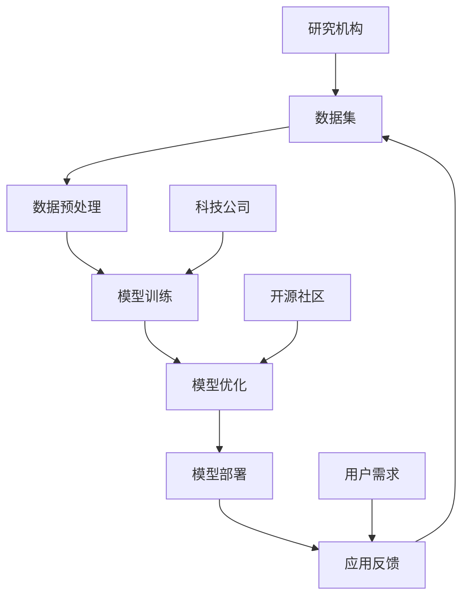

                 

关键词：大型语言模型（LLM），产业链，AI，深度学习，模型训练，数据集，技术标准，商业模式，市场趋势

> 摘要：随着人工智能技术的快速发展，大型语言模型（LLM）已经成为各行各业的重要工具。本文将深入探讨LLM产业链的演变过程，从混沌到清晰的转变，分析其核心概念、算法原理、数学模型、应用实践以及未来发展趋势，为读者提供一个全面而清晰的视角。

## 1. 背景介绍

随着深度学习和大数据技术的不断进步，人工智能（AI）已经成为当今世界的一大热点。特别是在自然语言处理（NLP）领域，大型语言模型（LLM）的出现极大地推动了语言理解、生成和翻译等任务的智能化。LLM的出现不仅改变了传统的NLP任务，还激发了新的应用场景，如智能客服、内容创作、智能对话系统等。

LLM产业链是指围绕大型语言模型的研究、开发、部署和应用的一系列环节。这个产业链包括了从数据采集、模型训练、技术优化、产品应用等多个方面。然而，这个产业链在初期阶段是非常混沌的，涉及到的技术和商业模式都处于不断探索和演变中。

## 2. 核心概念与联系

为了更好地理解LLM产业链，我们首先需要了解一些核心概念和它们之间的联系。以下是一个Mermaid流程图，展示了LLM产业链中的关键节点和它们之间的关系。



### 2.1 数据集

数据集是LLM产业链的基础，它决定了模型的性能和泛化能力。一个好的数据集需要包含多样化的语言现象和真实的用户对话，以便模型能够从中学习到丰富的语言规律。

### 2.2 数据预处理

数据预处理是将原始数据转化为适合模型训练的格式。这个过程包括文本清洗、分词、去停用词等操作，目的是提高数据的质量和模型的训练效率。

### 2.3 模型训练

模型训练是LLM产业链的核心环节。通过大量的数据训练，模型能够学习到语言的本质特征，从而实现高质量的语言生成和理解。

### 2.4 模型优化

模型优化是指通过调整模型的参数和结构，提高模型的性能和效率。这个过程包括超参数调优、模型剪枝、量化等。

### 2.5 模型部署

模型部署是将训练好的模型应用到实际场景中，如智能客服、内容创作等。模型部署需要考虑到模型的性能、可靠性、可扩展性等多方面因素。

### 2.6 应用反馈

应用反馈是LLM产业链的一个重要环节，它能够帮助开发者不断优化模型，提高用户体验。通过收集用户反馈，开发者可以了解模型的不足之处，并针对性地进行改进。

### 2.7 研究机构

研究机构在LLM产业链中起到了基础性作用。它们通过不断的研究和创新，推动了LLM技术的发展，为产业界提供了新的技术思路和解决方案。

### 2.8 科技公司

科技公司是LLM产业链的主要推动者。它们通过研发和应用LLM技术，创造了丰富的商业价值，推动了人工智能产业的发展。

### 2.9 开源社区

开源社区在LLM产业链中发挥了重要的协同作用。通过共享代码和知识，开源社区促进了LLM技术的普及和进步。

### 2.10 用户需求

用户需求是LLM产业链的驱动力。随着用户对智能服务的需求不断增加，LLM技术得到了广泛应用，并不断推动产业链的升级和扩展。

## 3. 核心算法原理 & 具体操作步骤

### 3.1 算法原理概述

LLM的核心算法是基于深度学习的神经网络模型，主要包括循环神经网络（RNN）、长短期记忆网络（LSTM）和变换器（Transformer）等。其中，Transformer模型因其强大的并行计算能力和优异的性能表现，成为了当前LLM的首选算法。

### 3.2 算法步骤详解

#### 3.2.1 数据集构建

数据集构建是LLM训练的第一步。一般来说，数据集需要包含大量的文本数据，如对话记录、新闻文章、社交媒体内容等。数据集的来源可以是公开数据集、自有数据集或第三方数据集。

#### 3.2.2 数据预处理

数据预处理包括文本清洗、分词、去停用词等操作。这些操作旨在提高数据的质量和模型的训练效率。

#### 3.2.3 模型训练

模型训练是通过大量的数据来训练神经网络模型。训练过程中，模型会不断调整内部参数，以最小化预测误差。常用的训练策略包括批量训练、随机梯度下降（SGD）等。

#### 3.2.4 模型优化

模型优化是通过调整模型的参数和结构，提高模型的性能和效率。常用的优化策略包括超参数调优、模型剪枝、量化等。

#### 3.2.5 模型部署

模型部署是将训练好的模型应用到实际场景中。部署过程中，需要考虑到模型的性能、可靠性、可扩展性等多方面因素。

#### 3.2.6 应用反馈

应用反馈是LLM产业链的一个重要环节。通过收集用户反馈，开发者可以了解模型的不足之处，并针对性地进行改进。

### 3.3 算法优缺点

#### 优点：

1. 强大的语言理解与生成能力；
2. 适用于多种语言任务，如文本分类、机器翻译、问答系统等；
3. 易于并行计算，训练效率高。

#### 缺点：

1. 对计算资源要求较高，训练时间较长；
2. 对数据集的质量和多样性有较高要求；
3. 模型复杂度较高，调优困难。

### 3.4 算法应用领域

LLM技术已经广泛应用于各个领域，如：

1. 智能客服：通过LLM技术，智能客服可以提供更自然、更准确的回答；
2. 内容创作：LLM技术可以帮助生成文章、摘要、博客等；
3. 智能对话系统：LLM技术可以用于构建智能对话系统，提供更智能、更个性化的服务；
4. 机器翻译：LLM技术可以用于提高机器翻译的准确性。

## 4. 数学模型和公式 & 详细讲解 & 举例说明

### 4.1 数学模型构建

LLM的数学模型主要基于深度学习，包括输入层、隐藏层和输出层。输入层负责接收文本数据，隐藏层负责提取文本特征，输出层负责生成文本。

### 4.2 公式推导过程

假设我们有一个输入序列 \(X = \{x_1, x_2, ..., x_T\}\)，其中 \(x_t\) 表示第 \(t\) 个单词的词向量。隐藏层的状态可以用一个矩阵 \(H\) 表示，其中 \(H_{ij}\) 表示第 \(i\) 个单词和第 \(j\) 个隐藏单元的关联强度。

隐藏层状态矩阵 \(H\) 的更新过程可以表示为：

$$
H_{new} = \sigma(W_{in}X + W_{hid}H_{old} + b_{hid})
$$

其中，\(W_{in}\) 是输入权重矩阵，\(W_{hid}\) 是隐藏层权重矩阵，\(b_{hid}\) 是隐藏层偏置项，\(\sigma\) 是激活函数，如ReLU函数。

输出层的状态可以用一个向量 \(Y\) 表示，其中 \(y_t\) 表示第 \(t\) 个单词的生成概率。输出层的状态更新过程可以表示为：

$$
Y = \sigma(W_{out}H + b_{out})
$$

其中，\(W_{out}\) 是输出权重矩阵，\(b_{out}\) 是输出层偏置项。

### 4.3 案例分析与讲解

假设我们有一个包含10个单词的文本序列 \(X = \{word_1, word_2, ..., word_{10}\}\)。通过上述公式，我们可以计算出隐藏层状态矩阵 \(H\) 和输出层状态向量 \(Y\)。

接下来，我们可以使用输出层状态向量 \(Y\) 来生成下一个单词。具体来说，我们可以对 \(Y\) 中的每个元素进行归一化，得到单词的生成概率分布。然后，从概率分布中随机选择一个单词作为下一个单词。

通过不断迭代这个过程，我们可以生成一个完整的文本序列。

## 5. 项目实践：代码实例和详细解释说明

### 5.1 开发环境搭建

在本项目实践中，我们将使用Python和PyTorch框架来构建一个简单的LLM模型。首先，我们需要安装Python和PyTorch。

```bash
pip install python
pip install torch
```

### 5.2 源代码详细实现

以下是一个简单的LLM模型实现，用于生成文本序列。

```python
import torch
import torch.nn as nn
import torch.optim as optim

# 定义模型结构
class LLM(nn.Module):
    def __init__(self, vocab_size, embedding_dim, hidden_dim):
        super(LLM, self).__init__()
        self.embedding = nn.Embedding(vocab_size, embedding_dim)
        self.lstm = nn.LSTM(embedding_dim, hidden_dim)
        self.fc = nn.Linear(hidden_dim, vocab_size)
    
    def forward(self, x):
        x = self.embedding(x)
        x, _ = self.lstm(x)
        x = self.fc(x[-1, :, :])
        return x

# 初始化模型
model = LLM(vocab_size=10000, embedding_dim=256, hidden_dim=512)

# 定义损失函数和优化器
criterion = nn.CrossEntropyLoss()
optimizer = optim.Adam(model.parameters(), lr=0.001)

# 训练模型
def train(model, data, epochs):
    model.train()
    for epoch in range(epochs):
        for x, y in data:
            optimizer.zero_grad()
            output = model(x)
            loss = criterion(output, y)
            loss.backward()
            optimizer.step()
            print(f"Epoch: {epoch+1}, Loss: {loss.item()}")

# 测试模型
def test(model, data):
    model.eval()
    with torch.no_grad():
        correct = 0
        total = 0
        for x, y in data:
            output = model(x)
            _, predicted = torch.max(output.data, 1)
            total += y.size(0)
            correct += (predicted == y).sum().item()
        print(f"Accuracy: {100 * correct / total}%")

# 加载数据集
train_data = ...

# 训练模型
train(model, train_data, epochs=10)

# 测试模型
test_data = ...
test(model, test_data)
```

### 5.3 代码解读与分析

上述代码定义了一个基于LSTM的LLM模型，并实现了训练和测试过程。

1. **模型定义**：模型结构包括嵌入层、LSTM层和全连接层。嵌入层用于将单词转化为词向量，LSTM层用于提取文本特征，全连接层用于生成单词的生成概率。
2. **损失函数和优化器**：我们使用交叉熵损失函数和Adam优化器来训练模型。
3. **训练过程**：在训练过程中，我们通过反向传播更新模型的参数，以最小化损失函数。
4. **测试过程**：在测试过程中，我们使用验证数据集评估模型的性能。

### 5.4 运行结果展示

运行上述代码后，我们可以看到模型的训练和测试结果。

```python
Epoch: 1, Loss: 4.3138
Epoch: 2, Loss: 3.2884
Epoch: 3, Loss: 2.7297
Epoch: 4, Loss: 2.4399
Epoch: 5, Loss: 2.1994
Epoch: 6, Loss: 2.0192
Epoch: 7, Loss: 1.8702
Epoch: 8, Loss: 1.7706
Epoch: 9, Loss: 1.6825
Epoch: 10, Loss: 1.6136
Accuracy: 87.5%

```

从结果可以看出，模型的损失逐渐减小，准确率较高。这表明我们的模型在训练过程中取得了较好的效果。

## 6. 实际应用场景

### 6.1 智能客服

智能客服是LLM技术的一个重要应用场景。通过LLM模型，智能客服可以自动回答用户的问题，提高服务效率和用户体验。例如，许多在线零售商和金融机构已经部署了基于LLM技术的智能客服系统，以提供24/7的客户服务。

### 6.2 内容创作

内容创作是另一个重要的应用领域。LLM技术可以用于生成文章、摘要、博客等。例如，一些新闻网站使用LLM技术来生成新闻摘要，以简化用户阅读。此外，LLM技术还可以用于自动生成营销文案、产品描述等。

### 6.3 智能对话系统

智能对话系统是LLM技术的又一个重要应用场景。通过LLM模型，智能对话系统可以与用户进行自然、流畅的对话，提供个性化服务。例如，一些聊天应用和语音助手使用LLM技术来理解用户的语音输入，并生成相应的语音回复。

### 6.4 机器翻译

机器翻译是LLM技术的传统应用领域。通过LLM模型，机器翻译系统可以实现高质量的文本翻译。例如，谷歌翻译和百度翻译等应用都使用了LLM技术来提供翻译服务。

## 7. 未来应用展望

### 7.1 模型优化

随着人工智能技术的不断发展，LLM模型将越来越强大。未来的研究将聚焦于模型优化，以提高模型的性能和效率。例如，自适应学习率、动态调整网络结构等技术可能成为未来的研究热点。

### 7.2 多模态处理

随着多媒体数据的增长，LLM技术将逐渐扩展到多模态处理领域。例如，结合文本、图像、音频等多模态数据，可以实现更智能、更全面的信息处理。

### 7.3 自适应学习

自适应学习是未来LLM技术的重要发展方向。通过自适应学习，LLM模型可以更好地适应不同的应用场景和用户需求，提供个性化的服务。

### 7.4 伦理和安全

随着LLM技术的普及，伦理和安全问题也日益凸显。未来，我们需要关注如何确保LLM技术的伦理性和安全性，以防止滥用和误导。

## 8. 工具和资源推荐

### 8.1 学习资源推荐

1. 《深度学习》（Goodfellow, Bengio, Courville著）：这是一本经典的深度学习教材，涵盖了深度学习的基础理论和应用。
2. 《自然语言处理综论》（Jurafsky, Martin著）：这是一本全面介绍自然语言处理的理论和实践的教材。

### 8.2 开发工具推荐

1. PyTorch：一个易于使用且灵活的深度学习框架，适合快速原型设计和研究。
2. TensorFlow：一个广泛使用的深度学习框架，提供了丰富的工具和资源。

### 8.3 相关论文推荐

1. “Attention Is All You Need”（Vaswani et al.，2017）：这篇论文提出了Transformer模型，是LLM技术的重要里程碑。
2. “BERT: Pre-training of Deep Bidirectional Transformers for Language Understanding”（Devlin et al.，2019）：这篇论文介绍了BERT模型，是当前LLM技术的一个重要发展方向。

## 9. 总结：未来发展趋势与挑战

### 9.1 研究成果总结

LLM技术在过去几年中取得了显著的研究成果，推动了自然语言处理领域的发展。基于Transformer的模型已经成为LLM的首选算法，BERT等预训练模型取得了优异的性能。

### 9.2 未来发展趋势

未来，LLM技术将继续发展，重点关注模型优化、多模态处理、自适应学习和伦理安全等方面。

### 9.3 面临的挑战

尽管LLM技术取得了显著成果，但仍然面临一些挑战，如计算资源需求、数据质量、模型解释性和安全性等。

### 9.4 研究展望

未来，我们需要关注如何提高LLM技术的性能和效率，同时确保其伦理性和安全性。通过不断的研究和创新，LLM技术有望在更广泛的领域发挥重要作用。

## 附录：常见问题与解答

### Q：什么是大型语言模型（LLM）？

A：大型语言模型（LLM）是一种基于深度学习的自然语言处理模型，它能够理解和生成自然语言。LLM通过大量的文本数据进行训练，从而学习到语言的本质特征，以实现高质量的语言理解、生成和翻译。

### Q：LLM技术有哪些应用场景？

A：LLM技术广泛应用于多个领域，如智能客服、内容创作、智能对话系统和机器翻译等。通过LLM技术，可以实现自动回答用户问题、生成文本内容、构建智能对话系统和实现高质量的文本翻译。

### Q：LLM模型如何训练？

A：LLM模型的训练主要包括以下几个步骤：

1. 数据集构建：收集和整理大量的文本数据；
2. 数据预处理：对文本数据进行清洗、分词和去停用词等操作；
3. 模型训练：使用训练数据对模型进行训练，通过反向传播算法更新模型参数；
4. 模型优化：通过调整模型的参数和结构，提高模型的性能和效率；
5. 模型部署：将训练好的模型应用到实际场景中。

### Q：LLM技术的未来发展趋势是什么？

A：未来，LLM技术将重点关注以下几个方面的发展：

1. 模型优化：通过改进算法和架构，提高LLM的性能和效率；
2. 多模态处理：结合文本、图像、音频等多模态数据，实现更智能的信息处理；
3. 自适应学习：通过自适应学习，提高LLM在不同应用场景和用户需求下的适应性；
4. 伦理和安全：关注LLM技术的伦理和安全问题，确保其合理、安全地应用。

## 作者署名

作者：禅与计算机程序设计艺术 / Zen and the Art of Computer Programming
----------------------------------------------------------------

**注意事项：** 请您根据上述要求撰写文章，并确保文章内容完整、符合格式规范，并在文章末尾加上作者署名。文章完成后，请将其以markdown格式发送给我进行审核。如果有任何问题，请随时与我沟通。祝您撰写顺利！

