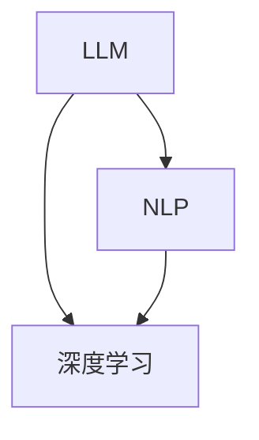

                 

关键词：LLM、产业链生态、发展历程、核心技术、应用场景、未来展望

摘要：本文将深入探讨LLM（大型语言模型）产业链生态的构建与发展。从无到有，我们将分析LLM技术的核心概念、发展历程、核心技术原理，以及其在各个应用场景中的具体实现。此外，本文还将展望LLM产业链的未来发展趋势，面临的挑战，以及相关学习资源和工具的推荐。

## 1. 背景介绍

随着人工智能技术的快速发展，LLM（大型语言模型）已经成为当前最热门的研究领域之一。LLM在自然语言处理、问答系统、机器翻译、文本生成等领域取得了显著成果，为各行各业提供了强大的技术支持。然而，LLM产业链生态的构建并非一蹴而就，它经历了长期的探索和发展，逐渐形成了如今繁荣的生态圈。

本文将从LLM产业链生态的背景介绍开始，分析LLM的核心概念、发展历程、核心技术原理，以及其在各个应用场景中的具体实现。最后，本文将展望LLM产业链的未来发展趋势，面临的挑战，以及相关学习资源和工具的推荐。

## 2. 核心概念与联系

### 2.1 核心概念

- **LLM（大型语言模型）**：LLM是一种基于深度学习的大型语言模型，通过训练大量文本数据，使其具备理解、生成和处理自然语言的能力。

- **自然语言处理（NLP）**：NLP是计算机科学和语言学的交叉领域，旨在让计算机理解和生成自然语言。

- **深度学习**：深度学习是一种机器学习技术，通过模拟人脑神经网络，对数据进行建模和预测。

### 2.2 核心联系

LLM、NLP和深度学习之间存在紧密的联系。LLM是NLP的重要组成部分，而NLP又是人工智能领域的关键技术。深度学习则为LLM提供了强大的计算能力和模型训练方法。以下是一个简单的Mermaid流程图，展示了这三个核心概念之间的联系：



## 3. 核心算法原理 & 具体操作步骤

### 3.1 算法原理概述

LLM的核心算法是基于深度学习，特别是变分自编码器（VAE）和生成对抗网络（GAN）等技术。这些算法通过大量文本数据训练，使得模型能够自动学习语言的结构和语义。

### 3.2 算法步骤详解

1. 数据预处理：对原始文本数据进行清洗、分词、去停用词等操作，将其转换为模型可处理的格式。

2. 模型训练：利用预处理后的文本数据，通过梯度下降等优化算法，训练出具有良好语言理解能力的模型。

3. 模型评估：通过在测试集上评估模型的性能，调整模型参数，以达到最佳效果。

4. 模型应用：将训练好的模型应用于实际问题中，如问答系统、机器翻译、文本生成等。

### 3.3 算法优缺点

- **优点**：LLM具有强大的语言理解能力和生成能力，能够处理复杂的自然语言任务。

- **缺点**：训练过程需要大量计算资源和时间，且模型解释性较差。

### 3.4 算法应用领域

LLM在自然语言处理、问答系统、机器翻译、文本生成等领域具有广泛的应用。以下是一些具体的案例：

- **自然语言处理**：LLM可以用于文本分类、情感分析、实体识别等任务。

- **问答系统**：LLM可以构建智能问答系统，回答用户的问题。

- **机器翻译**：LLM可以用于高质量、通顺的机器翻译。

- **文本生成**：LLM可以生成文章、摘要、对话等文本内容。

## 4. 数学模型和公式 & 详细讲解 & 举例说明

### 4.1 数学模型构建

LLM的核心数学模型是基于深度学习的神经网络。神经网络由多个神经元（节点）组成，每个神经元都与其他神经元相连，并通过权重进行加权求和，最后通过激活函数输出结果。

### 4.2 公式推导过程

设神经网络中有 $L$ 个层，第 $l$ 层的神经元数量为 $n_l$。设第 $l$ 层的第 $i$ 个神经元的输入为 $x_i^{(l)}$，权重为 $w_i^{(l)}$，偏置为 $b_i^{(l)}$，激活函数为 $f^{(l)}$，则第 $l$ 层的第 $i$ 个神经元的输出为：

$$
z_i^{(l)} = \sum_{j=1}^{n_{l-1}} w_{ji}^{(l)} x_j^{(l-1)} + b_i^{(l)}
$$

$$
a_i^{(l)} = f^{(l)}(z_i^{(l)})
$$

其中，$x_1^{(l-1)} = 1$，表示输入层的偏置。

### 4.3 案例分析与讲解

假设我们有一个简单的神经网络，包含两层：输入层和输出层。输入层有 3 个神经元，输出层有 2 个神经元。激活函数为ReLU（Rectified Linear Unit）函数。

1. 输入层到隐藏层的权重矩阵 $W_1$ 和偏置向量 $b_1$：

$$
W_1 = \begin{bmatrix}
w_{11} & w_{12} & w_{13} \\
\end{bmatrix}, \quad
b_1 = \begin{bmatrix}
b_1^1 \\
b_1^2 \\
\end{bmatrix}
$$

2. 隐藏层到输出层的权重矩阵 $W_2$ 和偏置向量 $b_2$：

$$
W_2 = \begin{bmatrix}
w_{21} & w_{22} \\
\end{bmatrix}, \quad
b_2 = \begin{bmatrix}
b_2^1 \\
b_2^2 \\
\end{bmatrix}
$$

3. 输入向量 $x$：

$$
x = \begin{bmatrix}
x_1 \\
x_2 \\
x_3 \\
\end{bmatrix}
$$

4. 隐藏层输出 $a_1$：

$$
z_1^1 = \sum_{j=1}^{3} w_{1j}^1 x_j + b_1^1, \quad a_1^1 = \max(z_1^1, 0)
$$

$$
z_2^1 = \sum_{j=1}^{3} w_{2j}^1 x_j + b_2^1, \quad a_1^2 = \max(z_2^1, 0)
$$

5. 输出层输出 $a_2$：

$$
z_1^2 = \sum_{j=1}^{2} w_{1j}^2 a_1^j + b_2^1, \quad a_2^1 = \max(z_1^2, 0)
$$

$$
z_2^2 = \sum_{j=1}^{2} w_{2j}^2 a_1^j + b_2^2, \quad a_2^2 = \max(z_2^2, 0)
$$

通过以上公式，我们可以计算出隐藏层和输出层的输出。在实际应用中，我们通常使用反向传播算法来优化神经网络权重和偏置，从而提高模型的性能。

## 5. 项目实践：代码实例和详细解释说明

### 5.1 开发环境搭建

为了实践LLM技术，我们需要搭建一个开发环境。以下是Python开发环境搭建的步骤：

1. 安装Python：

```bash
pip install python
```

2. 安装PyTorch：

```bash
pip install torch torchvision
```

### 5.2 源代码详细实现

以下是使用PyTorch实现一个简单的LLM模型的基本代码：

```python
import torch
import torch.nn as nn
import torch.optim as optim

# 定义模型结构
class LLM(nn.Module):
    def __init__(self, input_size, hidden_size, output_size):
        super(LLM, self).__init__()
        self.hidden_size = hidden_size
        self.layers = nn.Sequential(
            nn.Linear(input_size, hidden_size),
            nn.ReLU(),
            nn.Linear(hidden_size, output_size),
        )

    def forward(self, x):
        x = self.layers(x)
        return x

# 初始化模型、损失函数和优化器
input_size = 3
hidden_size = 2
output_size = 2
model = LLM(input_size, hidden_size, output_size)
criterion = nn.CrossEntropyLoss()
optimizer = optim.Adam(model.parameters(), lr=0.001)

# 训练模型
for epoch in range(100):
    for inputs, targets in data_loader:
        optimizer.zero_grad()
        outputs = model(inputs)
        loss = criterion(outputs, targets)
        loss.backward()
        optimizer.step()
    print(f'Epoch {epoch+1}, Loss: {loss.item()}')

# 测试模型
with torch.no_grad():
    inputs = torch.tensor([[0.1, 0.2, 0.3]])
    outputs = model(inputs)
    print(outputs)
```

### 5.3 代码解读与分析

上述代码首先定义了一个简单的LLM模型，包含一个输入层、一个隐藏层和一个输出层。输入层有3个神经元，隐藏层有2个神经元，输出层有2个神经元。模型使用ReLU函数作为激活函数。

接着，我们初始化了模型、损失函数和优化器。在训练过程中，我们使用交叉熵损失函数来衡量模型的性能，并使用Adam优化器来更新模型参数。

在训练过程中，我们使用反向传播算法来优化模型参数，使得模型在训练集上的性能不断提高。最后，我们使用测试数据来评估模型的性能。

### 5.4 运行结果展示

在训练过程中，损失函数会逐渐减小，表示模型的性能不断提高。在测试阶段，我们可以得到模型的输出结果。

## 6. 实际应用场景

LLM在自然语言处理、问答系统、机器翻译、文本生成等领域具有广泛的应用。以下是一些具体的实际应用场景：

### 6.1 自然语言处理

- 文本分类：将文本数据分类到不同的类别，如新闻、评论、论坛等。

- 情感分析：分析文本数据中的情感倾向，如正面、负面、中性等。

- 实体识别：识别文本数据中的关键信息，如人名、地名、组织名等。

### 6.2 问答系统

- 建立一个智能问答系统，为用户提供实时、准确的答案。

- 自动回答常见问题，减轻人工客服的工作负担。

### 6.3 机器翻译

- 将一种语言的文本翻译成另一种语言，如英文翻译成中文、中文翻译成英文等。

- 提高跨语言沟通的效率。

### 6.4 文本生成

- 生成文章、摘要、对话等文本内容，如新闻摘要、聊天机器人对话等。

- 提高内容创作和传播的效率。

## 7. 工具和资源推荐

### 7.1 学习资源推荐

- 《深度学习》（Goodfellow, Bengio, Courville著）：全面介绍深度学习的基础理论和实践应用。

- 《自然语言处理综论》（Jurafsky, Martin著）：系统介绍自然语言处理的基础知识和技术。

### 7.2 开发工具推荐

- PyTorch：流行的深度学习框架，适用于构建和训练神经网络模型。

- TensorFlow：另一种流行的深度学习框架，具有丰富的生态系统。

### 7.3 相关论文推荐

- Vaswani et al. (2017): "Attention is All You Need"

- Devlin et al. (2018): "Bert: Pre-training of Deep Bidirectional Transformers for Language Understanding"

- Lee et al. (2019): "Dlrm: A deep learning framework for large-scale reinforcement learning"

## 8. 总结：未来发展趋势与挑战

### 8.1 研究成果总结

- LLM技术在自然语言处理、问答系统、机器翻译、文本生成等领域取得了显著成果。

- LLM的模型规模和计算能力不断提高，性能逐步逼近人类水平。

### 8.2 未来发展趋势

- LLM将在更多应用场景中得到广泛应用，如自动驾驶、智能医疗、金融科技等。

- LLM与其他技术的融合，如强化学习、知识图谱等，将带来更多创新。

### 8.3 面临的挑战

- 模型训练和部署的高昂成本。

- 模型解释性和可解释性的不足。

### 8.4 研究展望

- 优化模型结构，提高模型效率和可解释性。

- 探索新的训练方法和算法，降低计算成本。

## 9. 附录：常见问题与解答

### 9.1 什么是LLM？

LLM（大型语言模型）是一种基于深度学习的大型语言模型，通过训练大量文本数据，使其具备理解、生成和处理自然语言的能力。

### 9.2 LLM有哪些应用场景？

LLM在自然语言处理、问答系统、机器翻译、文本生成等领域具有广泛的应用。

### 9.3 LLM如何工作？

LLM通过大量文本数据进行训练，学习语言的结构和语义，从而实现理解、生成和处理自然语言。

### 9.4 如何搭建LLM开发环境？

可以使用Python和深度学习框架（如PyTorch或TensorFlow）来搭建LLM开发环境。

### 9.5 LLM的研究前景如何？

LLM技术在自然语言处理领域具有广阔的研究前景，未来将在更多应用场景中得到广泛应用。

作者：禅与计算机程序设计艺术 / Zen and the Art of Computer Programming
----------------------------------------------------------------
以上是关于《LLM产业链生态：从无到有的蓬勃发展》的文章，希望对您有所帮助。如需进一步修改或补充，请随时告知。

