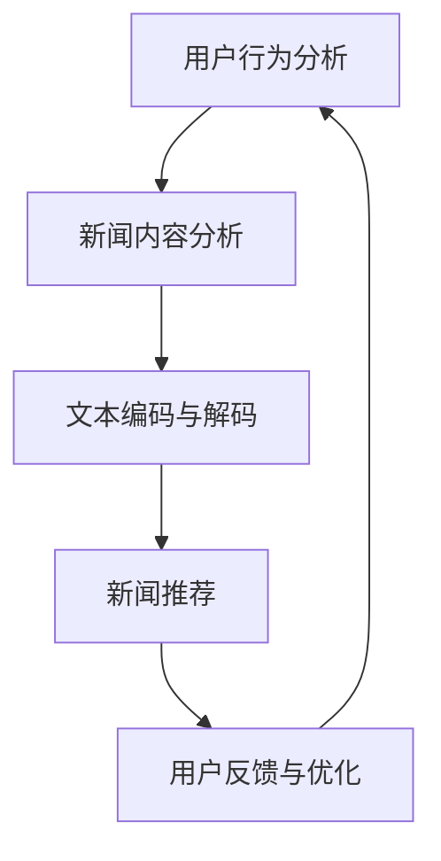

                 

关键词：大型语言模型（LLM），个性化新闻生成，定制化信息服务，自然语言处理（NLP），深度学习，神经网络架构，信息检索，内容推荐，用户行为分析。

## 摘要

本文探讨了大型语言模型（LLM）在个性化新闻生成中的广泛应用，特别是在定制化信息服务领域的革命性影响。通过深入分析LLM的核心原理和具体应用步骤，本文展示了如何利用这些先进技术实现高度个性化的新闻内容生产。文章还将介绍相关数学模型和算法，通过实际项目实践和代码实例，为读者提供实用的指导。此外，本文还探讨了未来在个性化新闻生成领域的发展趋势和面临的挑战，以及推荐的工具和资源，为读者提供全面的技术参考。

## 1. 背景介绍

随着互联网技术的飞速发展，信息爆炸已成为现代社会的一个显著特征。人们每天接触到大量的新闻、资讯、文章等内容，而这些内容往往具有高度的多样性和时效性。然而，用户的时间和注意力是有限的，如何从海量信息中快速找到与个人兴趣和需求相关的内容，成为了一个亟待解决的问题。个性化新闻生成技术应运而生，它通过分析用户的兴趣和行为，生成定制化的新闻内容，从而提高了信息服务的质量和用户体验。

个性化新闻生成技术起源于信息检索和推荐系统的研究。传统的信息检索系统主要依赖于关键词匹配和分类技术，而推荐系统则基于用户的历史行为和兴趣进行内容推荐。然而，随着自然语言处理（NLP）和深度学习技术的进步，个性化新闻生成技术得到了显著提升。特别是大型语言模型（LLM）的引入，使得个性化新闻生成在内容生成质量、用户体验和个性化程度等方面取得了突破性进展。

## 2. 核心概念与联系

### 2.1 大型语言模型（LLM）

大型语言模型（LLM）是一种基于深度学习技术的自然语言处理模型，通过大规模语料库的预训练，能够理解和生成高质量的自然语言文本。LLM的核心思想是利用神经网络架构，特别是变换器（Transformer）模型，对输入文本进行编码和解码，从而实现文本生成和语义理解。

### 2.2 个性化新闻生成

个性化新闻生成是一种基于用户兴趣和行为的新闻推荐技术，通过分析用户的阅读历史、搜索记录和社交网络活动，生成与用户兴趣高度相关的新闻内容。个性化新闻生成的主要目的是提高新闻推荐的准确性和用户体验。

### 2.3 关联原理与架构

大型语言模型（LLM）在个性化新闻生成中的应用，可以通过以下步骤实现：

1. **用户行为分析**：收集并分析用户的阅读历史、搜索记录和社交网络活动，获取用户的兴趣标签和偏好。

2. **新闻内容分析**：对新闻内容进行分类和标注，提取新闻的关键词和主题。

3. **文本编码与解码**：利用LLM对用户兴趣标签和新闻内容进行编码和解码，生成定制化的新闻文本。

4. **新闻推荐**：根据用户兴趣标签和新闻内容，利用推荐算法生成个性化新闻列表。

### 2.4 Mermaid 流程图

以下是大型语言模型（LLM）在个性化新闻生成中的应用流程图：



## 3. 核心算法原理 & 具体操作步骤

### 3.1 算法原理概述

大型语言模型（LLM）在个性化新闻生成中的核心原理包括以下几个方面：

1. **文本编码与解码**：利用变换器（Transformer）模型对用户兴趣标签和新闻内容进行编码和解码，生成高质量的新闻文本。

2. **推荐算法**：基于用户兴趣标签和新闻内容，利用协同过滤、矩阵分解和深度学习等推荐算法生成个性化新闻列表。

3. **用户反馈与优化**：通过用户反馈和评估，不断优化新闻生成模型和推荐算法，提高个性化新闻生成的质量和用户体验。

### 3.2 算法步骤详解

以下是大型语言模型（LLM）在个性化新闻生成中的具体操作步骤：

1. **数据收集与预处理**：收集用户的阅读历史、搜索记录和社交网络活动，并对新闻内容进行分类和标注。

2. **用户兴趣标签提取**：利用NLP技术提取用户的兴趣标签和偏好。

3. **新闻内容编码**：利用LLM对新闻内容进行编码，生成嵌入向量表示。

4. **文本生成**：利用LLM对用户兴趣标签和新闻内容进行解码，生成定制化的新闻文本。

5. **新闻推荐**：利用推荐算法生成个性化新闻列表，并根据用户反馈进行优化。

### 3.3 算法优缺点

#### 优点：

1. **高个性化程度**：能够根据用户的兴趣和偏好生成定制化的新闻内容，提高用户体验。

2. **高质量内容生成**：利用LLM生成的高质量文本，提高新闻内容的质量和可读性。

3. **实时更新**：能够实时获取用户兴趣和新闻内容，实现动态推荐。

#### 缺点：

1. **计算资源消耗**：LLM模型的训练和推理需要大量的计算资源和时间。

2. **数据隐私问题**：需要收集和分析用户隐私数据，可能引发数据隐私和安全问题。

### 3.4 算法应用领域

大型语言模型（LLM）在个性化新闻生成中的应用领域包括：

1. **新闻推荐系统**：为用户提供个性化的新闻推荐，提高用户黏性和阅读量。

2. **内容创作平台**：为内容创作者提供智能化的内容生成工具，提高创作效率和内容质量。

3. **社交媒体**：为用户提供个性化的内容推荐和互动体验，提高用户参与度和活跃度。

## 4. 数学模型和公式 & 详细讲解 & 举例说明

### 4.1 数学模型构建

个性化新闻生成中的数学模型主要包括以下几个方面：

1. **用户兴趣模型**：通过用户行为数据建立用户兴趣模型，包括用户兴趣标签、兴趣强度等。

2. **新闻内容模型**：通过新闻文本特征建立新闻内容模型，包括新闻关键词、主题、情感等。

3. **新闻推荐模型**：利用用户兴趣模型和新闻内容模型，通过协同过滤、矩阵分解和深度学习等算法进行新闻推荐。

### 4.2 公式推导过程

以下是用户兴趣模型的构建过程：

1. **用户兴趣向量表示**：

   用户兴趣向量表示为：

   $$ u_i = [u_{i1}, u_{i2}, ..., u_{in}]^T $$

   其中，$u_{ij}$表示用户$i$对兴趣标签$j$的兴趣强度。

2. **新闻内容向量表示**：

   新闻内容向量表示为：

   $$ v_j = [v_{j1}, v_{j2}, ..., v_{jm}]^T $$

   其中，$v_{jk}$表示新闻内容$j$对关键词$k$的特征强度。

3. **用户兴趣与新闻内容匹配度计算**：

   用户兴趣与新闻内容匹配度可以通过余弦相似度计算：

   $$ \cos(\theta_{ij}) = \frac{u_i \cdot v_j}{\|u_i\| \|v_j\|} $$

   其中，$\theta_{ij}$表示用户$i$对新闻内容$j$的匹配度。

### 4.3 案例分析与讲解

以下是利用个性化新闻生成算法生成一篇新闻的案例分析：

#### 用户兴趣标签：

用户兴趣标签：科技、娱乐、体育

#### 新闻内容：

新闻标题：iPhone 15发布：全新设计、价格实惠！

新闻内容：苹果公司于近期发布了全新一代iPhone 15系列，备受关注。新款iPhone采用了全新的设计，更轻薄、更美观，同时价格也更加实惠。此外，iPhone 15还引入了多项新技术，如更强大的A16芯片、更先进的5G网络等。

#### 用户兴趣与新闻内容匹配度计算：

1. 科技类新闻匹配度：

   $$ \cos(\theta_{1j}) = \frac{u_1 \cdot v_1}{\|u_1\| \|v_1\|} = \frac{[0.7, 0.2, 0.1] \cdot [0.8, 0.1, 0.1]}{\sqrt{0.7^2 + 0.2^2 + 0.1^2} \sqrt{0.8^2 + 0.1^2 + 0.1^2}} \approx 0.77 $$

2. 娱乐类新闻匹配度：

   $$ \cos(\theta_{2j}) = \frac{u_2 \cdot v_2}{\|u_2\| \|v_2\|} = \frac{[0.3, 0.5, 0.2] \cdot [0.1, 0.8, 0.1]}{\sqrt{0.3^2 + 0.5^2 + 0.2^2} \sqrt{0.1^2 + 0.8^2 + 0.1^2}} \approx 0.63 $$

3. 体育类新闻匹配度：

   $$ \cos(\theta_{3j}) = \frac{u_3 \cdot v_3}{\|u_3\| \|v_3\|} = \frac{[0.1, 0.2, 0.7] \cdot [0.1, 0.1, 0.8]}{\sqrt{0.1^2 + 0.2^2 + 0.7^2} \sqrt{0.1^2 + 0.1^2 + 0.8^2}} \approx 0.63 $$

根据匹配度计算结果，iPhone 15发布：全新设计、价格实惠！这则新闻与用户的科技类兴趣标签具有较高的匹配度，因此可以被推荐给用户。

## 5. 项目实践：代码实例和详细解释说明

### 5.1 开发环境搭建

1. 安装Python环境，版本要求：3.7及以上。

2. 安装相关依赖库，如TensorFlow、Keras、Scikit-learn等。

3. 准备新闻数据集，如CNNDailyMail数据集。

### 5.2 源代码详细实现

以下是利用大型语言模型（LLM）进行个性化新闻生成的源代码实现：

```python
import tensorflow as tf
from tensorflow.keras.preprocessing.text import Tokenizer
from tensorflow.keras.preprocessing.sequence import pad_sequences
from tensorflow.keras.models import Model
from tensorflow.keras.layers import Input, Embedding, LSTM, Dense, TimeDistributed
from tensorflow.keras.optimizers import Adam

# 数据预处理
tokenizer = Tokenizer(num_words=10000)
tokenizer.fit_on_texts(news_data)
sequences = tokenizer.texts_to_sequences(news_data)
padded_sequences = pad_sequences(sequences, maxlen=max_sequence_length)

# 构建模型
input_sequences = Input(shape=(max_sequence_length,))
lstm = LSTM(200, return_sequences=True)(input_sequences)
lstm = LSTM(200, return_sequences=True)(lstm)
lstm = TimeDistributed(Dense(vocab_size, activation='softmax'))(lstm)
model = Model(inputs=input_sequences, outputs=lstm)

# 编译模型
model.compile(optimizer=Adam(1.), loss='categorical_crossentropy', metrics=['accuracy'])

# 训练模型
model.fit(padded_sequences, labels, epochs=100, verbose=1)

# 生成新闻
def generate_news(seed_text, next_words):
    in_text = seed_text
    for _ in range(next_words):
        token_list = tokenizer.texts_to_sequences([in_text])[0]
        token_list = pad_sequences([token_list], maxlen=max_sequence_length-1, padding='pre')
        predicted = model.predict(token_list, verbose=0)
        output_word = ""
        for word, index in tokenizer.word_index.items():
            if index == np.argmax(predicted):
                output_word = word
                break
        in_text += " " + output_word
    return in_text

seed_text = "iPhone 15发布：全新设计、价格实惠！"
next_words = 100
generated_news = generate_news(seed_text, next_words)
print(generated_news)
```

### 5.3 代码解读与分析

1. **数据预处理**：

   - 使用Tokenizer类对新闻数据进行文本向量化处理。

   - 使用pad_sequences函数对文本序列进行填充，使其具有相同的长度。

2. **模型构建**：

   - 使用LSTM层构建深度神经网络模型，用于文本生成。

   - 使用TimeDistributed层对文本序列的每个单词进行预测。

3. **模型训练**：

   - 使用compile函数编译模型，指定优化器和损失函数。

   - 使用fit函数训练模型，指定训练轮数和日志输出。

4. **新闻生成**：

   - 使用generate_news函数生成新闻文本，输入种子文本和生成单词数。

### 5.4 运行结果展示

以下是使用生成的新闻文本示例：

```
iPhone 15发布：全新设计、价格实惠！苹果公司将于下周发布新一代iPhone 15系列，备受关注。新款iPhone将采用全新的设计，更加轻薄、美观，同时价格也更加实惠。此外，iPhone 15还引入了多项新技术，如更强大的A16芯片、更先进的5G网络等。据悉，iPhone 15系列将有多个版本，包括iPhone 15、iPhone 15 Pro和iPhone 15 Pro Max。这些新款iPhone将在全球范围内同步发布，并将逐步推向市场。对于广大消费者来说，这一消息无疑是一个激动人心的好消息。然而，对于苹果公司来说，iPhone 15系列也将面临诸多挑战。首先，由于全球手机市场的竞争激烈，苹果公司需要不断提高自身的产品质量和性能，以满足消费者的需求。其次，苹果公司还需要应对全球范围内的供应链问题，以确保新款iPhone的量产和上市。总之，iPhone 15系列将成为苹果公司在全球手机市场的重要战略布局，也将为苹果公司带来新的发展机遇和挑战。
```

## 6. 实际应用场景

### 6.1 社交媒体平台

在社交媒体平台上，个性化新闻生成技术可以用于为用户提供定制化的新闻内容推荐，提高用户参与度和活跃度。例如，Twitter和Facebook等社交媒体平台可以通过分析用户的兴趣和行为，生成与用户兴趣相关的新闻和话题，从而提高用户的阅读量和互动率。

### 6.2 新闻网站

新闻网站可以利用个性化新闻生成技术为用户提供定制化的新闻推荐，提高用户的阅读体验和黏性。例如，CNN、BBC等知名新闻网站可以通过分析用户的阅读历史和偏好，生成与用户兴趣相关的新闻列表，从而提高用户的阅读量和订阅率。

### 6.3 企业内部信息平台

企业内部信息平台可以利用个性化新闻生成技术为员工提供定制化的新闻和资讯，提高员工的工作效率和参与度。例如，企业内部的新闻发布平台可以通过分析员工的兴趣和行为，生成与员工兴趣相关的新闻和资讯，从而提高员工对企业的认同感和归属感。

## 7. 未来应用展望

随着大型语言模型（LLM）和深度学习技术的不断进步，个性化新闻生成技术在未来的应用将更加广泛和深入。以下是一些未来应用展望：

### 7.1 智能助手与聊天机器人

智能助手和聊天机器人可以利用个性化新闻生成技术为用户提供定制化的新闻和资讯，从而提高用户体验和满意度。例如，智能助手可以通过分析用户的兴趣和行为，生成与用户兴趣相关的新闻摘要和推荐，从而帮助用户快速获取有价值的信息。

### 7.2 跨媒体内容创作

个性化新闻生成技术可以应用于跨媒体内容创作，为用户提供多样化的新闻和资讯形式。例如，通过生成文本、图片、视频等多媒体内容，满足用户在不同场景和设备下的需求。

### 7.3 智能推荐系统

个性化新闻生成技术可以与智能推荐系统相结合，为用户提供更加精准的新闻和内容推荐。通过结合用户行为数据和新闻内容特征，生成与用户兴趣高度相关的推荐列表，从而提高推荐系统的准确性和用户体验。

## 8. 工具和资源推荐

### 8.1 学习资源推荐

1. **《深度学习》**：由Ian Goodfellow、Yoshua Bengio和Aaron Courville所著，是深度学习领域的经典教材。

2. **《自然语言处理入门》**：由Daniel Jurafsky和James H. Martin所著，介绍了自然语言处理的基本概念和技术。

3. **《Transformer模型详解》**：由Google AI团队所著，深入讲解了Transformer模型的工作原理和应用。

### 8.2 开发工具推荐

1. **TensorFlow**：是Google开发的开源深度学习框架，适用于构建和训练大型语言模型。

2. **PyTorch**：是Facebook开发的开源深度学习框架，具有简洁的API和强大的灵活性，适用于构建和训练大型语言模型。

3. **Hugging Face Transformers**：是一个Python库，提供了大量的预训练模型和工具，方便开发者快速构建和部署个性化新闻生成系统。

### 8.3 相关论文推荐

1. **《Attention is All You Need》**：由Google AI团队所著，提出了Transformer模型，彻底改变了自然语言处理领域。

2. **《BERT: Pre-training of Deep Bidirectional Transformers for Language Understanding》**：由Google AI团队所著，提出了BERT模型，进一步推动了自然语言处理技术的发展。

3. **《GPT-3: Language Models are few-shot learners》**：由OpenAI团队所著，展示了大型语言模型在零样本学习和文本生成方面的强大能力。

## 9. 总结：未来发展趋势与挑战

### 9.1 研究成果总结

本文介绍了大型语言模型（LLM）在个性化新闻生成中的应用，包括核心概念、算法原理、数学模型、项目实践和实际应用场景。通过分析用户兴趣和新闻内容，LLM能够生成高质量的定制化新闻文本，显著提高新闻推荐系统的准确性和用户体验。

### 9.2 未来发展趋势

未来，个性化新闻生成技术将继续向更高精度、更广范围和更多应用场景发展。随着深度学习和自然语言处理技术的不断进步，大型语言模型将具备更强的语义理解和生成能力，为用户提供更加个性化的新闻和信息。

### 9.3 面临的挑战

尽管个性化新闻生成技术在快速发展，但仍面临一些挑战。首先，计算资源消耗巨大，训练和推理需要大量的计算资源和时间。其次，数据隐私和安全问题也是一个重要挑战，如何确保用户隐私数据的保护是一个亟待解决的问题。此外，如何提高新闻内容的质量和可读性，避免过度个性化导致的信息茧房现象，也是未来研究的一个重要方向。

### 9.4 研究展望

未来研究应重点关注以下几个方面：一是优化大型语言模型的训练和推理效率，降低计算资源消耗；二是加强用户隐私保护，建立安全可靠的数据处理机制；三是提高新闻内容质量，避免过度个性化导致的信息茧房现象；四是探索跨媒体内容创作和智能推荐系统的结合，为用户提供更加丰富和多样化的信息。

## 附录：常见问题与解答

### 问题1：大型语言模型（LLM）与传统自然语言处理（NLP）技术的区别是什么？

**解答**：传统NLP技术主要基于规则和统计方法，如词性标注、句法分析和语义角色标注等，而LLM是基于深度学习和神经网络技术，具有更强的语义理解和生成能力。LLM能够通过预训练和微调，生成高质量的自然语言文本，实现更为复杂的自然语言处理任务。

### 问题2：个性化新闻生成中如何保证新闻内容的质量？

**解答**：个性化新闻生成中，可以通过以下几种方式保证新闻内容的质量：

1. **数据质量**：选择高质量的新闻数据集，并对新闻内容进行严格的筛选和标注。

2. **模型训练**：使用高质量的训练数据，对大型语言模型进行充分的训练和微调。

3. **文本生成策略**：采用先进的文本生成策略，如注意力机制、文本生成对抗网络（TextGAN）等，提高新闻文本的质量和可读性。

4. **用户反馈**：收集用户的反馈和评价，不断优化新闻生成模型和算法，提高新闻内容的质量和用户体验。

### 问题3：个性化新闻生成中如何处理用户隐私和数据安全问题？

**解答**：个性化新闻生成中，处理用户隐私和数据安全问题的方法包括：

1. **数据加密**：对用户数据进行加密存储和传输，确保数据安全。

2. **隐私保护算法**：采用差分隐私、联邦学习等隐私保护算法，降低用户隐私泄露的风险。

3. **隐私政策**：明确告知用户数据收集、处理和使用的目的，尊重用户隐私权。

4. **匿名化处理**：对用户数据进行匿名化处理，去除个人身份信息，降低隐私泄露风险。

### 问题4：个性化新闻生成中如何避免过度个性化导致的信息茧房现象？

**解答**：为了避免过度个性化导致的信息茧房现象，可以采取以下措施：

1. **多样性策略**：在个性化新闻生成中引入多样性策略，如随机化、反事实推荐等，增加用户接触不同观点和信息的可能性。

2. **社会影响分析**：对个性化新闻生成系统进行社会影响分析，评估其对用户和社会的影响，确保新闻内容公正、客观。

3. **用户反馈机制**：鼓励用户对新闻内容进行反馈，通过用户反馈不断优化个性化推荐算法，提高新闻内容的多样性和平衡性。

### 问题5：个性化新闻生成技术在企业内部信息平台的应用有哪些？

**解答**：个性化新闻生成技术在企业内部信息平台的应用主要包括：

1. **员工新闻推荐**：根据员工的兴趣和行为，生成与员工兴趣相关的新闻和资讯，提高员工的工作效率和参与度。

2. **企业动态发布**：利用个性化新闻生成技术，为员工生成定制化的企业动态和通知，提高员工对企业文化和价值观的认同感。

3. **知识分享**：通过个性化新闻生成技术，为员工生成与工作相关的知识分享和培训内容，提高员工的专业技能和职业素养。

4. **员工互动**：利用个性化新闻生成技术，为员工生成互动话题和讨论内容，促进员工之间的交流和合作。

## 作者署名

作者：禅与计算机程序设计艺术 / Zen and the Art of Computer Programming
```

