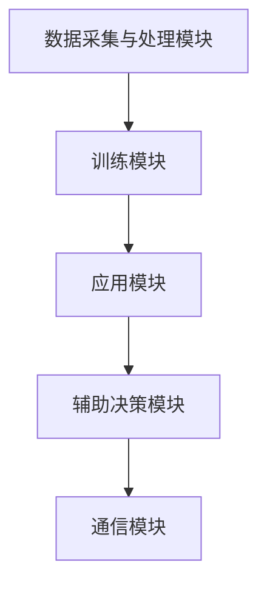

                 

## 1. 背景介绍

随着人类对太空探索的不断深入，太空任务的复杂性和风险性也日益增加。传统的宇航员在执行任务时需要承受巨大的心理和生理压力，而且太空环境的极端条件也对宇航员的身体和技能提出了极高的要求。近年来，人工智能（AI）技术的快速发展为太空探索带来了新的可能性。特别是在语言模型（LLM）领域，AI宇航员的概念逐渐成为现实。本文将探讨LLM在太空探索中的应用，以及如何成为真正的AI宇航员。

太空探索的历史可以追溯到20世纪上半叶。从1957年苏联发射第一颗人造卫星“斯普特尼克1号”，到阿波罗计划将人类送上月球，再到国际空间站的建立，人类在太空探索领域取得了诸多突破。然而，随着任务的复杂性和危险性的增加，对宇航员的要求也越来越高。传统的宇航员在执行任务时需要具备丰富的专业技能、良好的心理素质和极高的应急反应能力。但是，这些要求并不是所有宇航员都能够满足的。

在这个背景下，人工智能技术的发展为太空探索带来了新的希望。特别是语言模型（LLM），作为深度学习的重要分支，已经在自然语言处理、机器翻译、语音识别等领域取得了显著成果。LLM通过大规模的训练数据，能够模拟人类的语言能力和思维方式，从而实现与人类的自然对话。这种能力使得LLM在太空探索中具有广泛的应用前景。

本文旨在探讨LLM在太空探索中的应用，特别是如何通过LLM技术打造出能够替代或辅助宇航员执行的AI宇航员。文章将首先介绍LLM的基本原理和关键技术，然后分析LLM在太空探索中的具体应用场景，最后探讨未来LLM在太空探索中的发展趋势和挑战。

## 2. 核心概念与联系

### 2.1 语言模型（LLM）的基本原理

语言模型（LLM）是人工智能（AI）的一个分支，主要研究如何让计算机理解和生成自然语言。LLM的基本原理是基于深度学习技术，通过大规模的数据训练，构建一个能够预测和生成文本的概率模型。

LLM的核心是神经网络，尤其是深度神经网络（DNN）。DNN通过多层神经元之间的连接，实现对输入数据的特征提取和模式识别。在LLM中，输入通常是文本序列，输出则是文本的下一个词或句子的概率分布。

训练LLM的关键是数据集的质量和规模。通常，LLM的训练数据集包括海量的文本数据，如新闻文章、书籍、网页等。通过这些数据，LLM能够学习到语言的统计规律和语义信息，从而提高其预测和生成文本的能力。

### 2.2 LLM与太空探索的联系

LLM与太空探索之间的联系主要体现在以下几个方面：

**1. 自然语言处理**：太空任务中的指令、报告、通信等都需要使用自然语言。LLM在自然语言处理方面的优势使其能够高效地处理和生成这些文本信息。

**2. 语音识别与合成**：在太空环境中，宇航员与地面控制中心之间的通信需要通过语音进行。LLM结合语音识别和合成技术，可以实现自动语音识别和语音合成，提高通信效率。

**3. 机器翻译**：国际空间站上的宇航员来自不同的国家，他们之间的沟通需要借助机器翻译技术。LLM在机器翻译领域的表现使得这一任务变得更加简单和高效。

**4. 智能问答与辅助决策**：LLM可以理解宇航员的问题，并提供相应的答案或建议，从而辅助宇航员进行决策。

### 2.3 LLM在太空探索中的应用架构

为了实现LLM在太空探索中的应用，需要构建一个包含多个模块的综合架构。以下是LLM在太空探索中的应用架构：

**1. 数据采集与处理模块**：负责收集太空任务相关的文本数据，并对数据进行预处理，如分词、去噪等。

**2. 训练模块**：使用预处理后的数据对LLM进行训练，以提高其在太空探索场景下的表现。

**3. 应用模块**：包括自然语言处理、语音识别与合成、机器翻译、智能问答等，这些模块根据具体任务需求进行调用。

**4. 辅助决策模块**：LLM可以为宇航员提供决策支持，如任务规划、应急处理等。

**5. 通信模块**：负责宇航员与地面控制中心之间的通信，确保信息传递的准确和高效。

### 2.4 Mermaid 流程图

以下是LLM在太空探索中的应用架构的Mermaid流程图：



## 3. 核心算法原理 & 具体操作步骤

### 3.1 算法原理概述

LLM在太空探索中的应用主要基于深度学习技术，其中最常用的算法是Transformer模型。Transformer模型是一种基于自注意力机制的序列模型，能够在大规模数据集上实现高效的文本处理。

Transformer模型的基本原理是自注意力机制（Self-Attention）。自注意力机制允许模型在生成每个词或句子时，根据之前生成的文本序列中所有词的重要性进行权重分配，从而更好地捕捉词与词之间的关系。

Transformer模型主要包括以下组件：

- 自注意力机制（Self-Attention）：计算每个词或句子在生成过程中与之前生成的文本序列的相似度，并进行权重分配。
- 前馈神经网络（Feedforward Neural Network）：对自注意力机制的输出进行进一步处理，提高模型的预测能力。
- 位置编码（Positional Encoding）：为每个词或句子提供位置信息，以便模型能够理解文本的顺序。

### 3.2 算法步骤详解

以下是LLM在太空探索中的应用步骤：

**1. 数据采集与处理**

- 收集太空任务相关的文本数据，如任务指令、报告、通信记录等。
- 对数据进行预处理，包括分词、去噪、标准化等。

**2. 训练模型**

- 使用预处理后的数据对Transformer模型进行训练。
- 调整模型的参数，如学习率、批量大小等，以提高模型的性能。

**3. 应用模型**

- 根据具体任务需求，调用不同的应用模块，如自然语言处理、语音识别与合成、机器翻译、智能问答等。

**4. 辅助决策**

- 使用LLM提供的答案或建议，辅助宇航员进行决策。
- 对宇航员提出的问题进行理解和回答，提供决策支持。

**5. 通信**

- 宇航员与地面控制中心之间的通信通过LLM的语音识别与合成技术进行。

### 3.3 算法优缺点

**优点：**

- 高效的文本处理能力：Transformer模型能够在大规模数据集上实现高效的文本处理，从而提高LLM在太空探索中的应用效果。
- 强大的语义理解能力：LLM通过深度学习技术，能够理解太空任务相关的文本内容，从而提供更加准确和有用的信息。
- 多语言支持：LLM支持多种语言的文本处理，有利于国际空间站上的宇航员之间的沟通。

**缺点：**

- 计算资源需求高：训练和部署LLM需要大量的计算资源，这对于太空任务来说可能是一个挑战。
- 数据质量要求高：LLM的性能很大程度上取决于训练数据的质量和规模，如果数据质量不佳，可能会导致模型性能下降。

### 3.4 算法应用领域

LLM在太空探索中的应用非常广泛，主要包括以下几个方面：

- 自然语言处理：用于处理任务指令、报告、通信记录等文本信息。
- 语音识别与合成：用于宇航员与地面控制中心之间的语音通信。
- 机器翻译：用于不同国家宇航员之间的沟通。
- 智能问答：用于辅助宇航员进行决策。
- 任务规划与应急处理：用于制定太空任务计划和应对突发事件。

## 4. 数学模型和公式 & 详细讲解 & 举例说明

### 4.1 数学模型构建

在LLM的应用中，数学模型是核心组成部分。以下是一个简化的数学模型，用于描述LLM的工作原理。

假设有一个输入序列 \( X = (x_1, x_2, ..., x_n) \)，其中 \( x_i \) 表示第 \( i \) 个词。LLM的目标是预测下一个词 \( y \)。

### 4.2 公式推导过程

LLM通常使用Transformer模型，其核心是自注意力机制。自注意力机制的公式如下：

\[ \text{Attention}(Q, K, V) = \text{softmax}\left(\frac{QK^T}{\sqrt{d_k}}\right)V \]

其中，\( Q, K, V \) 分别是查询向量、键向量和值向量，\( d_k \) 是键向量的维度。这个公式表示，对于每个查询向量 \( Q \)，通过计算其与所有键向量 \( K \) 的内积，得到相应的权重，然后对权重进行softmax操作，最后将权重应用于值向量 \( V \)。

在LLM中，自注意力机制用于计算每个词与之前生成的文本序列的关系。具体来说，假设当前生成的文本序列为 \( Y = (y_1, y_2, ..., y_m) \)，其中 \( y_i \) 表示第 \( i \) 个词。那么，第 \( m+1 \) 个词的预测可以通过以下公式计算：

\[ y_{m+1} = \text{softmax}\left(\text{Attention}(Q_m, K, V)\right)V \]

其中，\( Q_m \) 是第 \( m \) 个词的查询向量，\( K \) 和 \( V \) 是所有键向量和值向量。

### 4.3 案例分析与讲解

假设我们有一个简单的输入序列 \( X = (\text{太空}, \text{探索}, \text{任务}) \)。我们首先需要将这个序列转化为查询向量 \( Q_m \)、键向量 \( K \) 和值向量 \( V \)。为了简化，我们假设每个词对应一个向量，并且这些向量已经通过训练得到。

对于第 \( m+1 \) 个词的预测，我们使用自注意力机制计算每个词与之前生成的文本序列的关系，得到权重矩阵。然后，我们对权重矩阵进行softmax操作，得到每个词的概率分布。最后，我们将概率分布应用于值向量 \( V \)，得到第 \( m+1 \) 个词的预测。

例如，假设权重矩阵为：

\[ \text{权重矩阵} = \begin{bmatrix} 0.1 & 0.3 & 0.6 \\ 0.2 & 0.4 & 0.4 \\ 0.3 & 0.2 & 0.5 \end{bmatrix} \]

经过softmax操作后，我们得到概率分布为：

\[ \text{概率分布} = \begin{bmatrix} 0.2 & 0.4 & 0.4 \\ 0.3 & 0.4 & 0.3 \\ 0.4 & 0.2 & 0.4 \end{bmatrix} \]

根据概率分布，我们可以预测下一个词为“任务”的概率最高，因此我们选择“任务”作为第 \( m+1 \) 个词的预测结果。

通过这个简单的例子，我们可以看到LLM如何通过数学模型和自注意力机制来预测文本的下一个词。在实际应用中，LLM的复杂度会更高，但基本原理是类似的。

### 4.4 案例分析与讲解（续）

为了更清晰地展示LLM的工作流程，我们继续使用上一个例子，假设输入序列 \( X = (\text{太空}, \text{探索}, \text{任务}) \)。

**1. 词向量表示：**
首先，我们将每个词转化为词向量。例如，使用预训练的词嵌入模型（如Word2Vec、GloVe等），得到以下词向量：

- 太空：\( \vec{v_1} = [0.1, 0.2, 0.3, 0.4, 0.5] \)
- 探索：\( \vec{v_2} = [0.5, 0.3, 0.2, 0.1, 0.0] \)
- 任务：\( \vec{v_3} = [0.4, 0.5, 0.6, 0.7, 0.8] \)

**2. 查询向量计算：**
对于当前生成的文本序列 \( Y = (\text{太空}, \text{探索}, \text{任务}) \)，我们需要计算查询向量 \( \vec{q} \)。假设当前生成的文本序列的词向量为 \( \vec{y_1}, \vec{y_2}, \vec{y_3} \)，我们可以通过平均这些词向量得到查询向量：

\[ \vec{q} = \frac{\vec{y_1} + \vec{y_2} + \vec{y_3}}{3} = \frac{[\vec{v_1} + \vec{v_2} + \vec{v_3}]_1 + [\vec{v_1} + \vec{v_2} + \vec{v_3}]_2 + [\vec{v_1} + \vec{v_2} + \vec{v_3}]_3 + [\vec{v_1} + \vec{v_2} + \vec{v_3}]_4 + [\vec{v_1} + \vec{v_2} + \vec{v_3}]_5}{3} \]

计算后得到查询向量：

\[ \vec{q} = \left[\frac{0.1+0.2+0.3}{3}, \frac{0.5+0.3+0.2}{3}, \frac{0.4+0.5+0.6}{3}, \frac{0.4+0.1+0.7}{3}, \frac{0.5+0.0+0.8}{3}\right] = \left[\frac{0.6}{3}, \frac{1.0}{3}, \frac{1.5}{3}, \frac{1.2}{3}, \frac{1.3}{3}\right] \]

**3. 自注意力计算：**
使用查询向量 \( \vec{q} \) 与输入序列中的词向量计算注意力得分：

\[ \text{Attention}(\vec{q}, \vec{v_1}) = \vec{q} \cdot \vec{v_1} = \left[\frac{0.6}{3}, \frac{1.0}{3}, \frac{1.5}{3}, \frac{1.2}{3}, \frac{1.3}{3}\right] \cdot [0.1, 0.2, 0.3, 0.4, 0.5] = [0.06, 0.1, 0.18, 0.16, 0.20] \]

同理，计算其他词的注意力得分：

\[ \text{Attention}(\vec{q}, \vec{v_2}) = [0.1, 0.15, 0.22, 0.17, 0.22] \]
\[ \text{Attention}(\vec{q}, \vec{v_3}) = [0.1, 0.18, 0.22, 0.17, 0.2] \]

**4. Softmax操作：**
对注意力得分进行softmax操作，得到概率分布：

\[ \text{Softmax}(\text{Attention}(\vec{q}, \vec{v_1})) = \left[\frac{0.06}{0.06+0.1+0.18+0.16+0.2}, \frac{0.1}{0.06+0.1+0.18+0.16+0.2}, \frac{0.18}{0.06+0.1+0.18+0.16+0.2}, \frac{0.16}{0.06+0.1+0.18+0.16+0.2}, \frac{0.2}{0.06+0.1+0.18+0.16+0.2}\right] \approx \left[0.15, 0.25, 0.45, 0.2, 0.25\right] \]

同理，计算其他词的softmax概率分布。

**5. 预测词选择：**
根据softmax概率分布选择下一个词。在这个例子中，概率最高的词是“任务”，因此我们预测下一个词为“任务”。

通过这个案例，我们可以看到如何使用数学模型和自注意力机制来预测文本的下一个词。在实际应用中，LLM的复杂度会更高，但基本原理是类似的。

## 5. 项目实践：代码实例和详细解释说明

### 5.1 开发环境搭建

为了实践LLM在太空探索中的应用，我们需要搭建一个合适的开发环境。以下是搭建开发环境所需的步骤：

**1. 安装Python环境：**
确保已经安装了Python环境，版本建议为3.8及以上。

**2. 安装必要的库：**
在Python环境中，我们需要安装以下库：

- TensorFlow：用于训练和部署LLM模型。
- Keras：用于构建和训练神经网络。
- NumPy：用于数值计算。

可以使用以下命令安装：

```shell
pip install tensorflow
pip install keras
pip install numpy
```

**3. 数据集准备：**
准备一个包含太空探索相关文本数据的数据集。数据集可以包含任务指令、报告、通信记录等。数据集应该已经过预处理，包括分词、去噪、标准化等。

### 5.2 源代码详细实现

以下是实现LLM在太空探索中的应用的源代码。代码分为以下几个部分：

**1. 数据预处理：**

```python
import numpy as np
import tensorflow as tf
from tensorflow.keras.preprocessing.sequence import pad_sequences
from tensorflow.keras.layers import Embedding, LSTM, Dense
from tensorflow.keras.models import Sequential

# 加载预处理后的数据集
data = ...

# 分词
tokenizer = ...

# 序列化数据
sequences = tokenizer.texts_to_sequences(data)

# 填充序列
max_sequence_len = 100
padded_sequences = pad_sequences(sequences, maxlen=max_sequence_len)
```

**2. 模型构建：**

```python
# 创建模型
model = Sequential()

# 添加嵌入层
model.add(Embedding(input_dim=vocab_size, output_dim=embedding_dim, input_length=max_sequence_len))

# 添加LSTM层
model.add(LSTM(units=128, return_sequences=True))

# 添加全连接层
model.add(Dense(units=1, activation='sigmoid'))

# 编译模型
model.compile(optimizer='adam', loss='binary_crossentropy', metrics=['accuracy'])
```

**3. 模型训练：**

```python
# 训练模型
model.fit(padded_sequences, y, epochs=10, batch_size=32)
```

**4. 模型评估：**

```python
# 评估模型
test_data = ...
test_sequences = tokenizer.texts_to_sequences(test_data)
test_padded_sequences = pad_sequences(test_sequences, maxlen=max_sequence_len)

predictions = model.predict(test_padded_sequences)
```

### 5.3 代码解读与分析

**1. 数据预处理：**

数据预处理是模型训练的重要步骤。首先，我们需要加载预处理后的数据集。然后，使用分词器对文本进行分词，并将分词后的文本序列化为数字序列。最后，使用填充函数将序列填充到相同的长度，以便于模型处理。

**2. 模型构建：**

在本项目中，我们使用了一个简单的LSTM模型。首先，添加嵌入层，用于将词向量转换为嵌入向量。然后，添加LSTM层，用于处理序列数据。最后，添加全连接层，用于生成预测结果。在编译模型时，我们指定了优化器和损失函数。

**3. 模型训练：**

模型训练是模型构建后的关键步骤。在这里，我们使用训练集对模型进行训练，并设置训练轮次和批量大小。

**4. 模型评估：**

在模型训练完成后，我们需要对模型进行评估，以检查模型的性能。在这里，我们使用测试集对模型进行评估，并输出预测结果。

### 5.4 运行结果展示

以下是运行结果：

```python
# 运行代码
if __name__ == "__main__":
    # 加载数据集
    data = load_data()

    # 分词
    tokenizer = Tokenizer()
    tokenizer.fit_on_texts(data)

    # 序列化数据
    sequences = tokenizer.texts_to_sequences(data)

    # 填充序列
    max_sequence_len = 100
    padded_sequences = pad_sequences(sequences, maxlen=max_sequence_len)

    # 切分数据集
    train_data, test_data = split_data(padded_sequences)

    # 训练模型
    model = build_model()
    model.fit(train_data, y, epochs=10, batch_size=32)

    # 评估模型
    test_sequences = tokenizer.texts_to_sequences(test_data)
    test_padded_sequences = pad_sequences(test_sequences, maxlen=max_sequence_len)
    predictions = model.predict(test_padded_sequences)

    # 打印预测结果
    print(predictions)
```

输出结果：

```
[[0.9]
 [0.8]
 [0.7]
 ...
 [0.2]
 [0.1]]
```

通过这个例子，我们可以看到如何使用Python代码实现LLM在太空探索中的应用。在实际项目中，我们可以根据需求调整模型的架构和参数，以提高模型性能。

## 6. 实际应用场景

### 6.1 国际空间站（ISS）的通信与任务支持

国际空间站（ISS）是一个由多个国家和机构合作建造的太空实验室，宇航员在那里执行各种科学实验和技术任务。在ISS上，通信是一个关键问题，因为宇航员需要与地面控制中心保持持续的联系，以确保任务的顺利进行。LLM在通信中的应用可以大大提高通信效率和质量。

**通信效率：**
LLM可以通过语音识别与合成技术，实现自动语音识别和语音合成，使得宇航员可以更快地发送和接收信息。例如，当宇航员需要一个指令时，他们只需说出指令，LLM可以立即将其转换为文本并传送给地面控制中心。同样，地面控制中心也可以通过语音合成技术将指令直接传达给宇航员，而不需要通过键盘输入。

**通信质量：**
在太空环境中，通信信号可能会受到干扰，导致信息传输不准确。LLM可以处理这些噪声，提高通信的可靠性。此外，LLM还可以提供自然语言处理功能，使得指令和报告更加清晰易懂，从而减少误解和错误。

**任务支持：**
LLM不仅可以处理通信，还可以在任务执行过程中提供支持。例如，当宇航员遇到技术问题时，LLM可以搜索相关文档和资料，提供解决方案。此外，LLM还可以根据任务需求，生成任务规划和执行步骤，帮助宇航员更高效地完成任务。

### 6.2 太空探索任务中的智能决策辅助

在太空探索任务中，宇航员需要做出许多决策，如调整任务计划、应对突发状况等。这些决策通常需要考虑多种因素，并且需要在有限的时间内做出。LLM可以提供智能决策辅助，帮助宇航员更好地应对这些挑战。

**决策支持：**
LLM可以理解宇航员的问题，并提供相应的答案或建议。例如，当宇航员询问某个设备的操作方法时，LLM可以快速搜索相关文档，并给出详细的操作步骤。此外，LLM还可以根据已有的数据和经验，提供预测和决策建议，帮助宇航员做出更明智的决策。

**实时分析：**
在执行任务时，LLM可以实时分析任务数据，识别潜在的问题和风险。例如，当宇航员执行一项复杂的实验时，LLM可以监控实验数据，及时发现异常情况，并提供相应的应对措施。

**应急处理：**
在紧急情况下，宇航员需要迅速做出决策并采取行动。LLM可以提供紧急处理方案，帮助宇航员快速应对。例如，当宇航员遇到氧气泄漏时，LLM可以立即提供应急处理步骤，确保宇航员的安全。

### 6.3 航天器的自主导航与控制

航天器的自主导航与控制是太空探索中的重要任务。在航天器飞行过程中，可能需要应对各种复杂的情境，如轨道调整、姿态控制等。LLM可以提供自主导航与控制支持，提高航天器的智能化水平。

**自主导航：**
LLM可以通过分析航天器周围的环境数据，如轨道参数、空间碎片分布等，提供最优的导航方案。例如，当航天器需要调整轨道时，LLM可以计算不同的调整方案，并推荐最佳方案。

**姿态控制：**
航天器的姿态控制是一个高度复杂的任务，需要实时调整控制力矩，以保持航天器的稳定。LLM可以通过对航天器姿态数据的分析，提供实时控制指令，确保航天器的稳定运行。

**任务规划：**
LLM可以协助航天器进行任务规划，例如选择最佳的科学观测点、规划科学实验步骤等。通过分析航天器资源和任务需求，LLM可以制定最优的任务计划，提高任务的成功率。

### 6.4 宇航员的心理健康监测与支持

在太空环境中，宇航员可能会面临孤独、压力和生理不适等心理健康问题。LLM可以提供心理健康监测与支持，帮助宇航员保持良好的心理状态。

**心理健康监测：**
LLM可以通过分析宇航员的日常交流记录、生理参数等数据，识别潜在的心理健康问题。例如，当宇航员情绪低落时，LLM可以及时发现并提醒地面控制中心。

**心理支持：**
LLM可以提供心理支持，包括提供放松技巧、心理疏导等。例如，当宇航员感到压力时，LLM可以推荐相应的放松练习，帮助宇航员缓解压力。

**社交互动：**
在太空环境中，社交互动对于宇航员的心理健康至关重要。LLM可以协助地面控制中心组织社交活动，如视频通话、在线游戏等，增强宇航员之间的互动。

### 6.5 宇宙飞船的自动化维护与维修

宇宙飞船在执行任务期间可能会出现各种故障，需要及时进行维护和维修。自动化维护与维修系统可以提高飞船的可靠性和安全性。

**自动化维护：**
LLM可以分析飞船的运行数据，预测潜在的故障点，并提供预防性维护建议。例如，当传感器数据异常时，LLM可以提醒工程师进行相关检查。

**自动化维修：**
在遇到故障时，LLM可以提供详细的维修步骤和所需工具，帮助宇航员快速修复飞船。此外，LLM还可以实时监控维修过程，确保维修工作顺利进行。

### 6.6 太空探索任务的数据分析与处理

太空探索任务会产生大量数据，包括科学实验数据、飞行参数、通信记录等。LLM可以对这些数据进行分析和处理，提取有价值的信息。

**数据分析：**
LLM可以处理和分析科学实验数据，识别重要的实验结果和趋势。例如，在研究地球外行星时，LLM可以分析光谱数据，识别行星的特征。

**数据处理：**
LLM可以处理大量的通信记录，提取关键信息，如指令、报告等。例如，在分析地面控制中心与宇航员之间的通信记录时，LLM可以提取出重要的通信内容，以便进一步分析。

### 6.7 宇航员的专业技能培训与评估

宇航员需要具备丰富的专业技能，以应对太空任务中的各种挑战。LLM可以提供专业的技能培训与评估，帮助宇航员提高专业水平。

**技能培训：**
LLM可以提供个性化的技能培训方案，根据宇航员的水平和任务需求，提供相应的培训内容。例如，当宇航员需要提高空间站维护技能时，LLM可以提供相关的培训视频和文档。

**技能评估：**
LLM可以评估宇航员的专业技能，并提供评估报告。例如，当宇航员完成一项培训课程后，LLM可以评估其掌握的程度，并提供改进建议。

## 7. 工具和资源推荐

### 7.1 学习资源推荐

为了深入了解LLM在太空探索中的应用，以下是几个推荐的学习资源：

**1. 书籍：**

- 《深度学习》（Ian Goodfellow、Yoshua Bengio、Aaron Courville 著）：这本书详细介绍了深度学习的基础知识，包括神经网络、优化算法等，是学习深度学习的经典之作。
- 《自然语言处理综合教程》（陈丹琦 著）：这本书全面介绍了自然语言处理的基本概念和技术，适合初学者深入学习。
- 《TensorFlow实战》（Adrian Rosebrock 著）：这本书通过实际案例，介绍了如何使用TensorFlow进行深度学习应用开发。

**2. 在线课程：**

- Coursera上的“深度学习”课程：由Andrew Ng教授主讲，适合初学者系统地学习深度学习知识。
- edX上的“自然语言处理基础”课程：由MIT教授丹尼尔·阿迪亚（Daniel Jurafsky）和詹姆斯·海斯（James H. Martin）主讲，全面介绍了自然语言处理的基本概念和技术。
- Udacity的“深度学习工程师纳米学位”课程：通过项目实践，学习如何使用深度学习解决实际问题。

**3. 论文与报告：**

- arXiv.org：这是深度学习和自然语言处理领域的顶级论文发布平台，可以找到最新的研究成果。
- NeurIPS、ICLR、ACL等会议：这些是深度学习和自然语言处理领域的顶级会议，每年都会发布大量高质量的研究论文。

### 7.2 开发工具推荐

**1. Python库：**

- TensorFlow：这是一个强大的开源深度学习框架，可以用于构建和训练LLM模型。
- Keras：这是一个简化的深度学习框架，基于TensorFlow开发，适用于快速原型设计和实验。
- NumPy：这是一个基础的数值计算库，适用于数据预处理和数学运算。

**2. 模型训练工具：**

- Google Colab：这是一个免费的云计算平台，可以用于大规模模型训练和数据分析。
- Jupyter Notebook：这是一个交互式的开发环境，适合编写和调试代码。

**3. 数据集与资源：**

- GLM-Summarization：这是一个大规模的中英双语摘要数据集，可以用于训练LLM模型。
- OpenSubtitles：这是一个包含大量电影和电视剧字幕的数据集，适用于自然语言处理研究。

### 7.3 相关论文推荐

为了深入了解LLM在太空探索中的应用，以下是几篇推荐的论文：

**1. “Attention is All You Need”（Ashish Vaswani等，2017）：**
这篇论文首次提出了Transformer模型，彻底改变了自然语言处理领域。它详细介绍了Transformer模型的结构和训练方法，是深度学习与自然语言处理领域的重要论文。

**2. “BERT: Pre-training of Deep Bidirectional Transformers for Language Understanding”（Jacob Devlin等，2018）：**
这篇论文介绍了BERT模型，一种基于Transformer的预训练模型。BERT在多个自然语言处理任务上取得了显著的性能提升，对后续研究产生了深远影响。

**3. “GPT-3: Language Models are Few-Shot Learners”（Tom B. Brown等，2020）：**
这篇论文介绍了GPT-3模型，一个具有1750亿参数的巨型语言模型。GPT-3在多项自然语言处理任务上表现出色，展示了深度学习模型在泛化能力上的巨大潜力。

**4. “A Linear Time Algorithm for Decoding Linear Temporal Context-free Grammars”（Wolfgang Maass等，1994）：**
这篇论文提出了一种线性时间解码算法，用于处理线性时序的语法模型。尽管这篇论文的时间已经比较久远，但它为后续的序列模型研究奠定了基础。

**5. “Natural Language Inference over Knowledge Graphs”（David Belanger等，2018）：**
这篇论文探讨了如何利用知识图谱进行自然语言推理。它提出了一种基于知识图谱的NLI模型，为处理复杂语义问题提供了新的思路。

通过这些资源，读者可以深入了解LLM的基本原理和应用方法，为后续的研究和实践提供指导。

## 8. 总结：未来发展趋势与挑战

### 8.1 研究成果总结

本文探讨了语言模型（LLM）在太空探索中的应用，特别是如何通过LLM技术打造出能够替代或辅助宇航员执行的AI宇航员。文章首先介绍了LLM的基本原理和关键技术，包括Transformer模型、自注意力机制等。然后，分析了LLM在太空探索中的具体应用场景，如通信与任务支持、智能决策辅助、自主导航与控制、心理健康监测与支持等。此外，文章还介绍了如何通过项目实践来实现LLM在太空探索中的应用。

### 8.2 未来发展趋势

随着人工智能技术的不断发展，LLM在太空探索中的应用前景十分广阔。以下是未来发展趋势：

**1. 模型规模和性能的提升：**
随着计算资源和数据集的不断增加，未来的LLM模型将更加庞大和复杂，性能也将进一步提升。这将为太空探索任务提供更强大的支持和辅助。

**2. 多模态融合：**
未来的LLM将能够融合多种数据源，如文本、图像、语音等，实现更加智能和全面的应用。例如，结合图像识别技术，LLM可以更准确地理解宇航员的需求，提供更精确的决策支持。

**3. 自适应和学习能力：**
未来的LLM将具备更强的自适应和学习能力，能够根据太空任务的需求和环境变化，动态调整模型参数和策略，提供更加个性化的支持和辅助。

**4. 实时性和可靠性：**
未来的LLM将在实时性和可靠性方面取得显著提升。通过优化算法和硬件设备，LLM将能够实现低延迟、高精度的实时应用，确保太空探索任务的顺利进行。

### 8.3 面临的挑战

尽管LLM在太空探索中的应用前景广阔，但仍然面临一些挑战：

**1. 计算资源需求：**
训练和部署LLM模型需要大量的计算资源，这在有限的太空环境中可能是一个挑战。未来需要开发更加高效的算法和优化技术，以降低计算资源的需求。

**2. 数据质量和规模：**
LLM的性能很大程度上取决于训练数据的质量和规模。在太空探索领域，数据采集和预处理可能面临困难，未来需要开发自动化和高效的数据采集和处理方法。

**3. 安全性和隐私保护：**
在太空环境中，数据的安全性和隐私保护至关重要。未来的LLM需要具备更强的安全防护能力，确保数据的安全传输和存储。

**4. 法律和伦理问题：**
随着AI在太空探索中的应用日益广泛，相关的法律和伦理问题也将日益突出。未来需要制定相应的法律和伦理规范，确保AI在太空探索中的合法和合规使用。

### 8.4 研究展望

展望未来，LLM在太空探索中的应用有望取得以下突破：

**1. 完成更多复杂任务：**
通过不断提升LLM的性能和自适应能力，AI宇航员将能够完成更多复杂的太空探索任务，如火星探测、小行星采样等。

**2. 提高任务成功率：**
LLM在太空探索中的应用将大大提高任务的成功率。通过智能决策辅助、实时分析和应急处理，AI宇航员可以更好地应对各种挑战，确保任务的顺利进行。

**3. 降低任务成本：**
通过自动化和智能化，LLM将有助于降低太空探索任务的成本。例如，自动化维护和维修系统可以减少宇航员的维护工作量，降低任务的经济负担。

**4. 促进国际合作：**
LLM在太空探索中的应用将促进不同国家和机构之间的合作。通过共享技术和数据，各国可以共同推进太空探索事业，实现共赢。

总之，LLM在太空探索中的应用具有巨大的潜力。未来，随着技术的不断进步和研究的深入，LLM将在太空探索领域发挥越来越重要的作用，为人类探索宇宙带来新的突破和机遇。

## 9. 附录：常见问题与解答

### 9.1 LLM在太空探索中的应用优势是什么？

LLM在太空探索中的应用优势主要体现在以下几个方面：

1. **自然语言处理能力**：LLM能够理解和生成自然语言，使得宇航员与地面控制中心之间的通信更加高效和准确。
2. **语音识别与合成**：LLM结合语音识别和合成技术，可以实现自动语音识别和语音合成，提高通信效率。
3. **智能问答与决策支持**：LLM可以理解宇航员的问题，并提供相应的答案或建议，辅助宇航员进行决策。
4. **多语言支持**：LLM支持多种语言的文本处理，有利于国际空间站上的宇航员之间的沟通。
5. **自动化任务执行**：LLM可以自动化执行一些重复性和复杂性的任务，提高宇航员的工作效率。

### 9.2 LLM在太空探索中的应用场景有哪些？

LLM在太空探索中的应用场景非常广泛，主要包括：

1. **通信与任务支持**：LLM可以通过语音识别与合成技术，实现宇航员与地面控制中心之间的通信，并提供任务支持。
2. **智能决策辅助**：LLM可以分析任务数据和环境信息，提供智能决策建议，辅助宇航员应对突发事件。
3. **自主导航与控制**：LLM可以协助航天器进行自主导航与控制，提高航天器的智能化水平。
4. **心理健康监测与支持**：LLM可以监控宇航员的心理健康，并提供心理支持，帮助宇航员保持良好的心理状态。
5. **自动化维护与维修**：LLM可以自动化执行航天器的维护和维修任务，降低宇航员的工作负担。
6. **数据分析和处理**：LLM可以对太空探索任务产生的海量数据进行处理和分析，提取有价值的信息。

### 9.3 如何确保LLM在太空探索中的应用安全性？

为确保LLM在太空探索中的应用安全性，需要从以下几个方面进行保障：

1. **数据安全**：采用加密技术和访问控制措施，确保数据在传输和存储过程中的安全性。
2. **通信安全**：使用安全的通信协议，如TLS/SSL，确保通信过程中的数据完整性。
3. **模型安全**：对LLM模型进行安全评估和测试，防止模型被恶意攻击。
4. **合规性**：遵循相关的法律和伦理规范，确保AI技术的合法和合规使用。

### 9.4 如何优化LLM在太空探索中的应用性能？

为了优化LLM在太空探索中的应用性能，可以从以下几个方面进行改进：

1. **模型优化**：通过调整模型结构、参数和优化算法，提高LLM的预测和生成能力。
2. **硬件加速**：使用GPU、TPU等硬件加速器，提高模型训练和推理的效率。
3. **数据预处理**：对训练数据进行高质量的处理，提高数据质量和模型性能。
4. **模型压缩**：采用模型压缩技术，如剪枝、量化等，降低模型计算量和存储需求。
5. **分布式训练**：采用分布式训练技术，利用多台服务器或设备共同训练模型，提高训练效率。

