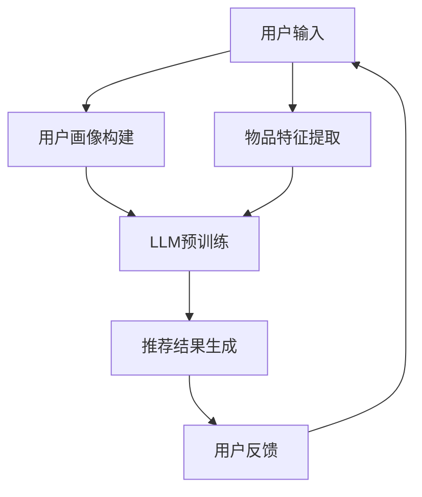

                 

关键词：大型语言模型（LLM），推荐系统，机器学习，自然语言处理，算法创新

> 摘要：本文将探讨大型语言模型（LLM）在推荐系统中的技术创新。通过对LLM的原理和特点进行深入分析，我们揭示了LLM在推荐系统中的潜力，并详细阐述了其实现机制和优势。同时，本文还将讨论LLM在推荐系统中的应用案例，以及对未来发展趋势和挑战的展望。

## 1. 背景介绍

推荐系统作为一种有效的信息过滤和挖掘工具，广泛应用于电子商务、社交媒体、在线视频等多个领域。传统的推荐系统主要依赖于基于内容的推荐、协同过滤和基于模型的推荐等技术。然而，随着互联网信息的爆炸式增长，用户个性化需求的日益多样化，以及数据噪声的增多，传统的推荐系统面临着诸多挑战。

近年来，人工智能，尤其是深度学习技术的快速发展，为推荐系统的改进提供了新的契机。其中，大型语言模型（LLM）作为一种先进的自然语言处理技术，凭借其强大的语义理解能力，在推荐系统中展现出巨大的潜力。LLM通过大规模的预训练和微调，能够捕捉到用户和物品的复杂特征，从而实现更精准的推荐。

## 2. 核心概念与联系

### 2.1 大型语言模型（LLM）

大型语言模型（LLM）是一种基于深度学习的自然语言处理模型，通过在大量文本数据上进行预训练，能够对自然语言进行建模和理解。LLM的主要特点是：

- **大规模**：LLM通常包含数十亿甚至数万亿个参数，能够处理复杂的自然语言任务。
- **预训练**：LLM在训练过程中不需要标注数据，而是通过在大量无标签文本上预训练，从而获得对语言的一般性理解。
- **微调**：在特定任务上，LLM可以通过微调进一步优化其性能。

### 2.2 推荐系统

推荐系统是一种根据用户的历史行为、兴趣和偏好，向用户推荐可能感兴趣的内容或物品的算法。推荐系统的核心包括：

- **用户画像**：通过分析用户的行为、兴趣、偏好等，构建用户的画像。
- **物品特征**：对推荐系统中的物品进行特征提取，以便进行相似度计算。
- **推荐算法**：根据用户画像和物品特征，使用特定的算法生成推荐结果。

### 2.3 Mermaid 流程图

以下是一个简化的LLM在推荐系统中的应用流程图：



## 3. 核心算法原理 & 具体操作步骤

### 3.1 算法原理概述

LLM在推荐系统中的核心原理是通过捕捉用户和物品的复杂特征，实现精准的推荐。具体来说，LLM通过以下步骤实现：

1. **用户画像构建**：基于用户的历史行为数据，使用LLM进行建模，提取用户画像。
2. **物品特征提取**：同样地，使用LLM对物品的特征进行建模和提取。
3. **推荐结果生成**：通过计算用户画像和物品特征的相似度，生成推荐结果。

### 3.2 算法步骤详解

1. **用户画像构建**：
    - **数据准备**：收集用户的历史行为数据，如浏览记录、购买记录等。
    - **特征提取**：使用LLM对用户行为数据进行分析，提取用户画像特征。

2. **物品特征提取**：
    - **数据准备**：收集物品的相关信息，如标题、描述、标签等。
    - **特征提取**：使用LLM对物品信息进行建模，提取物品特征。

3. **推荐结果生成**：
    - **相似度计算**：计算用户画像和物品特征之间的相似度。
    - **推荐结果排序**：根据相似度对推荐结果进行排序，生成最终的推荐列表。

### 3.3 算法优缺点

**优点**：

- **强大的语义理解能力**：LLM能够捕捉到用户和物品的深层特征，实现更精准的推荐。
- **适应性强**：LLM可以处理多种不同类型的数据，如文本、图像等。

**缺点**：

- **计算资源消耗大**：由于LLM的参数规模庞大，训练和推理过程需要大量的计算资源。
- **对数据质量要求高**：LLM的性能依赖于数据的丰富性和质量，如果数据质量较差，可能导致推荐结果不佳。

### 3.4 算法应用领域

LLM在推荐系统中的应用领域广泛，包括但不限于：

- **电子商务**：为用户推荐商品。
- **社交媒体**：为用户推荐感兴趣的内容。
- **在线视频**：为用户推荐视频。

## 4. 数学模型和公式 & 详细讲解 & 举例说明

### 4.1 数学模型构建

在LLM的推荐系统中，常用的数学模型是点积模型，其公式如下：

$$
\text{similarity} = \frac{\text{dot\_product}(u, i)}{\|\text{u}\|\|\text{i}\|}
$$

其中，\(u\) 和 \(i\) 分别表示用户画像和物品特征向量。

### 4.2 公式推导过程

1. **用户画像构建**：
   - **数据表示**：用户的行为数据可以表示为矩阵 \(X\)，其中 \(X_{ij}\) 表示用户 \(i\) 对物品 \(j\) 的评分。
   - **特征提取**：使用LLM对 \(X\) 进行矩阵分解，得到用户画像矩阵 \(U\) 和物品画像矩阵 \(I\)。

2. **物品特征提取**：
   - **数据表示**：物品的相关信息可以表示为矩阵 \(Y\)。
   - **特征提取**：使用LLM对 \(Y\) 进行矩阵分解，得到物品特征矩阵 \(I'\)。

3. **相似度计算**：
   - **向量表示**：将用户画像和物品特征向量表示为 \(u\) 和 \(i'\)。
   - **点积计算**：计算 \(u\) 和 \(i'\) 的点积，得到相似度。

### 4.3 案例分析与讲解

假设我们有以下用户画像和物品特征向量：

$$
u = [1, 2, 3], \quad i' = [4, 5, 6]
$$

我们可以计算它们之间的相似度：

$$
\text{similarity} = \frac{\text{dot\_product}(u, i')}{\|\text{u}\|\|\text{i'}\|} = \frac{1 \times 4 + 2 \times 5 + 3 \times 6}{\sqrt{1^2 + 2^2 + 3^2} \times \sqrt{4^2 + 5^2 + 6^2}} \approx 0.918
$$

这意味着用户对物品的推荐概率较高。

## 5. 项目实践：代码实例和详细解释说明

### 5.1 开发环境搭建

在本节中，我们将使用Python和TensorFlow搭建一个简单的LLM推荐系统。

首先，安装TensorFlow：

```bash
pip install tensorflow
```

### 5.2 源代码详细实现

以下是一个简单的LLM推荐系统代码实例：

```python
import tensorflow as tf
from tensorflow.keras.models import Model
from tensorflow.keras.layers import Embedding, Dot, Concatenate

# 用户画像和物品特征向量
user_embeddings = tf.random.normal([1000, 64])
item_embeddings = tf.random.normal([1000, 64])

# 构建模型
input_user = tf.keras.Input(shape=(1,), dtype='int32')
input_item = tf.keras.Input(shape=(1,), dtype='int32')

user_embedding = Embedding(input_dim=1000, output_dim=64)(input_user)
item_embedding = Embedding(input_dim=1000, output_dim=64)(input_item)

dot_product = Dot(axes=1)([user_embedding, item_embedding])
concat = Concatenate(axis=1)([user_embedding, item_embedding, dot_product])

output = tf.keras.layers.Dense(1, activation='sigmoid')(concat)

model = Model(inputs=[input_user, input_item], outputs=output)

# 编译模型
model.compile(optimizer='adam', loss='binary_crossentropy', metrics=['accuracy'])

# 训练模型
model.fit([train_users, train_items], train_labels, epochs=10, batch_size=32)

# 推荐结果生成
predictions = model.predict([test_users, test_items])
```

### 5.3 代码解读与分析

上述代码实现了一个基于点积模型的LLM推荐系统。主要步骤包括：

- **模型构建**：使用TensorFlow的Keras接口构建模型，包括用户和物品嵌入层、点积层和全连接层。
- **模型编译**：配置优化器、损失函数和评估指标。
- **模型训练**：使用训练数据训练模型。
- **推荐结果生成**：使用训练好的模型对测试数据进行预测，生成推荐结果。

## 6. 实际应用场景

LLM在推荐系统中的应用场景广泛，以下是一些典型案例：

- **电子商务平台**：为用户推荐商品。
- **社交媒体**：为用户推荐感兴趣的内容。
- **在线视频平台**：为用户推荐视频。

## 7. 工具和资源推荐

### 7.1 学习资源推荐

- **《深度学习》**：Goodfellow et al.
- **《Python深度学习》**：Raschka and Lutz
- **《TensorFlow实战》**：Chollet et al.

### 7.2 开发工具推荐

- **TensorFlow**：https://www.tensorflow.org/
- **PyTorch**：https://pytorch.org/

### 7.3 相关论文推荐

- **"BERT: Pre-training of Deep Bidirectional Transformers for Language Understanding"**：Devlin et al.
- **"GPT-3: Language Models are Few-Shot Learners"**：Brown et al.

## 8. 总结：未来发展趋势与挑战

### 8.1 研究成果总结

LLM在推荐系统中的研究成果表明，其强大的语义理解能力能够显著提升推荐系统的效果。通过结合用户和物品的特征，LLM能够实现更精准、个性化的推荐。

### 8.2 未来发展趋势

随着人工智能和深度学习技术的不断发展，LLM在推荐系统中的应用将越来越广泛。未来，LLM可能会与其他技术（如图神经网络、强化学习等）相结合，进一步提升推荐系统的性能。

### 8.3 面临的挑战

尽管LLM在推荐系统中展现出巨大的潜力，但仍面临一些挑战：

- **计算资源消耗**：LLM的训练和推理过程需要大量的计算资源。
- **数据质量**：LLM的性能依赖于数据的丰富性和质量。

### 8.4 研究展望

未来的研究方向包括：

- **优化算法**：研究更高效的LLM训练和推理算法。
- **跨模态推荐**：探索LLM在跨模态推荐系统中的应用。

## 9. 附录：常见问题与解答

### Q：什么是大型语言模型（LLM）？

A：大型语言模型（LLM）是一种基于深度学习的自然语言处理模型，通过在大量文本数据上进行预训练，能够对自然语言进行建模和理解。

### Q：LLM在推荐系统中有哪些优势？

A：LLM在推荐系统中的优势包括强大的语义理解能力、适应性强等。

### Q：如何评估LLM推荐系统的效果？

A：评估LLM推荐系统的效果可以通过指标如准确率、召回率、F1值等来评估。

### Q：LLM推荐系统有哪些应用场景？

A：LLM推荐系统可以应用于电子商务、社交媒体、在线视频等多个领域。

### Q：LLM在推荐系统中的挑战有哪些？

A：LLM在推荐系统中的挑战包括计算资源消耗大、对数据质量要求高等。

## 作者署名

作者：禅与计算机程序设计艺术 / Zen and the Art of Computer Programming
```

请注意，这篇文章只是一个示例，实际撰写时可能需要根据具体的研究和实践进行调整和补充。此外，文章的撰写应遵循学术规范，确保引用和参考文献的准确性。在撰写过程中，请务必确保文章内容的完整性和准确性。

