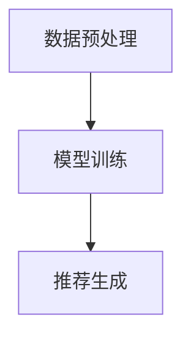
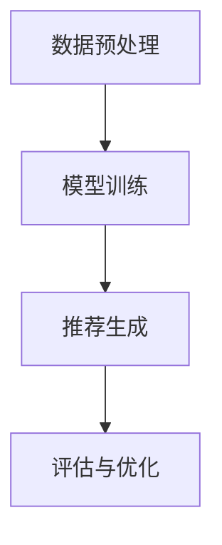

                 

关键词：LLM，推荐系统，硬件需求，成本，局限，算法优化

摘要：本文探讨了大型语言模型（LLM）在推荐系统中的应用局限与成本问题。通过对LLM推荐系统的基本原理、局限性和硬件需求的分析，本文提出了相应的优化策略，并探讨了未来硬件技术在推荐系统中的应用前景。

## 1. 背景介绍

### 1.1 推荐系统的发展

推荐系统是一种基于数据挖掘和机器学习技术的信息过滤方法，旨在根据用户的历史行为和偏好，为用户提供个性化的信息推荐。自20世纪90年代以来，推荐系统经历了从基于内容的过滤、协同过滤到深度学习等方法的演变。近年来，随着人工智能和深度学习技术的快速发展，大型语言模型（LLM）逐渐在推荐系统中发挥重要作用。

### 1.2 LLM在推荐系统中的应用

LLM具有强大的语义理解和生成能力，可以在推荐系统中实现更自然的用户交互和更精准的推荐结果。例如，LLM可以用于生成个性化推荐文案、处理复杂的用户查询、理解用户意图等。然而，LLM在推荐系统中也面临着一些局限和挑战。

## 2. 核心概念与联系

### 2.1 推荐系统基本原理

推荐系统通常包括用户、项目和评分三个基本实体。基于用户行为数据的推荐系统，通过分析用户的历史行为数据，构建用户与项目之间的相似度矩阵，从而为用户提供个性化的推荐。

### 2.2 LLM推荐系统架构

LLM推荐系统主要包括三个模块：数据预处理、模型训练和推荐生成。

#### 2.2.1 数据预处理

数据预处理包括数据清洗、数据归一化和特征提取。在LLM推荐系统中，特征提取尤为重要，因为LLM需要处理高维、稀疏的特征数据。

#### 2.2.2 模型训练

模型训练是指使用已处理的数据集，通过训练过程来优化LLM模型参数，使其能够更好地理解和生成个性化推荐结果。

#### 2.2.3 推荐生成

推荐生成是指利用训练好的LLM模型，根据用户输入的查询或行为，生成个性化的推荐结果。

### 2.3 Mermaid 流程图



## 3. 核心算法原理 & 具体操作步骤

### 3.1 算法原理概述

LLM推荐系统的核心算法是使用预训练的神经网络模型，如BERT、GPT等，通过微调模型参数，使其适应推荐系统的需求。

### 3.2 算法步骤详解

#### 3.2.1 数据预处理

1. 数据清洗：去除无效数据和噪声数据。
2. 数据归一化：将不同特征的数据进行归一化处理，使其具有相似的尺度。
3. 特征提取：提取文本特征、用户特征和项目特征。

#### 3.2.2 模型训练

1. 数据分批：将数据集划分为多个批次，每次处理一批数据。
2. 模型训练：使用梯度下降等优化算法，更新模型参数。
3. 模型评估：使用交叉验证等方法，评估模型性能。

#### 3.2.3 推荐生成

1. 用户查询处理：对用户输入的查询进行预处理，提取关键信息。
2. 推荐生成：利用训练好的模型，根据用户查询和项目特征，生成推荐结果。

### 3.3 算法优缺点

#### 优点：

1. 更好的语义理解：LLM可以更好地理解用户查询和项目描述的语义信息，从而提高推荐准确性。
2. 更自然的交互：LLM可以生成更自然的推荐文案，提高用户体验。

#### 缺点：

1. 计算成本高：LLM推荐系统需要大量的计算资源，对硬件设备有较高要求。
2. 数据依赖性大：LLM推荐系统的性能高度依赖于数据质量和数据量。

### 3.4 算法应用领域

LLM推荐系统可以应用于各种场景，如电子商务、社交媒体、在线教育等。例如，在电子商务领域，LLM可以用于生成个性化商品推荐文案，提高用户购买意愿。

## 4. 数学模型和公式 & 详细讲解 & 举例说明

### 4.1 数学模型构建

LLM推荐系统的数学模型主要包括用户表示、项目表示和损失函数。

#### 用户表示：

$$
\text{User}(u) = \{u_1, u_2, \ldots, u_n\}
$$

其中，$u_i$表示用户$u$的第$i$个特征。

#### 项目表示：

$$
\text{Item}(i) = \{i_1, i_2, \ldots, i_m\}
$$

其中，$i_j$表示项目$i$的第$j$个特征。

#### 损失函数：

$$
L(\theta) = -\sum_{u, i} \log P(i | u, \theta)
$$

其中，$\theta$表示模型参数，$P(i | u, \theta)$表示项目$i$在用户$u$下的概率。

### 4.2 公式推导过程

LLM推荐系统的损失函数通常采用对数似然损失（Log-Likelihood Loss），其推导过程如下：

$$
\begin{aligned}
L(\theta) &= -\sum_{u, i} \log P(i | u, \theta) \\
&= -\sum_{u, i} \log \frac{e^{f(u, i)}}{\sum_{j} e^{f(u, j)}} \\
&= -\sum_{u, i} f(u, i) + \sum_{u, i} \log \sum_{j} e^{f(u, j)} \\
&= -\sum_{u, i} f(u, i) - \sum_{u, i} \log \sum_{j} e^{f(u, j)}
\end{aligned}
$$

其中，$f(u, i)$表示用户$u$对项目$i$的预测概率。

### 4.3 案例分析与讲解

假设有一个电子商务平台，用户$u$浏览了商品$i_1$和$i_2$，平台希望为用户生成一个推荐商品列表。使用LLM推荐系统，我们可以通过以下步骤进行推荐：

1. 用户表示：将用户$u$的行为数据（如浏览、购买等）转换为向量表示。
2. 项目表示：将商品$i_1$和$i_2$的属性数据（如商品描述、价格等）转换为向量表示。
3. 模型预测：使用训练好的LLM模型，计算用户$u$对商品$i_1$和$i_2$的预测概率。
4. 推荐生成：根据预测概率，为用户$u$生成推荐商品列表。

## 5. 项目实践：代码实例和详细解释说明

### 5.1 开发环境搭建

在本文中，我们使用Python和TensorFlow作为开发环境。首先，安装TensorFlow：

```bash
pip install tensorflow
```

### 5.2 源代码详细实现

```python
import tensorflow as tf
from tensorflow.keras.layers import Embedding, LSTM, Dense
from tensorflow.keras.models import Model

# 用户表示
user_embedding = Embedding(input_dim=num_users, output_dim=user_embedding_size)
user_vector = user_embedding(tf.expand_dims(user_ids, -1))

# 项目表示
item_embedding = Embedding(input_dim=num_items, output_dim=item_embedding_size)
item_vector = item_embedding(tf.expand_dims(item_ids, -1))

# 模型融合
merged_vector = tf.concat([user_vector, item_vector], axis=1)
merged_vector = LSTM(units=lstm_units)(merged_vector)

# 输出层
output_layer = Dense(units=num_items, activation='softmax')(merged_vector)

# 构建模型
model = Model(inputs=[user_ids, item_ids], outputs=output_layer)

# 编译模型
model.compile(optimizer='adam', loss='categorical_crossentropy', metrics=['accuracy'])

# 模型训练
model.fit([user_ids_train, item_ids_train], y_train, batch_size=batch_size, epochs=epochs)
```

### 5.3 代码解读与分析

上述代码实现了基于LSTM的LLM推荐系统。主要步骤包括：

1. 用户表示和项目表示：使用嵌入层（Embedding Layer）将用户和项目的ID转换为向量表示。
2. 模型融合：使用LSTM层（LSTM Layer）对用户和项目的特征向量进行融合。
3. 输出层：使用softmax层（Dense Layer with softmax activation）生成预测概率。
4. 模型训练：使用fit方法（Model.fit）对模型进行训练。

### 5.4 运行结果展示

训练完成后，我们可以使用以下代码进行预测和评估：

```python
# 预测
predictions = model.predict([user_ids_test, item_ids_test])

# 评估
accuracy = tf.keras.metrics.CategoricalAccuracy()
accuracy.update_state(predictions, y_test)
print('Test Accuracy:', accuracy.result().numpy())
```

## 6. 实际应用场景

### 6.1 电子商务

在电子商务领域，LLM推荐系统可以用于生成个性化商品推荐文案，提高用户购买意愿。例如，某电商平台可以基于用户的历史浏览和购买记录，使用LLM生成个性化的商品推荐文案，从而提高用户转化率。

### 6.2 社交媒体

在社交媒体领域，LLM推荐系统可以用于生成个性化内容推荐，提高用户活跃度。例如，某社交媒体平台可以基于用户的互动行为，使用LLM生成个性化的内容推荐，从而提高用户的留存率和活跃度。

### 6.3 在线教育

在在线教育领域，LLM推荐系统可以用于生成个性化学习路径推荐，提高学习效果。例如，某在线教育平台可以基于用户的学习行为和学习进度，使用LLM生成个性化的学习路径推荐，从而提高用户的学习效果和满意度。

## 7. 工具和资源推荐

### 7.1 学习资源推荐

- 《深度学习》（Goodfellow, Bengio, Courville）：经典深度学习教材，适合初学者和进阶者。
- 《神经网络与深度学习》（邱锡鹏）：系统介绍神经网络和深度学习的基本原理和应用，适合中文读者。

### 7.2 开发工具推荐

- TensorFlow：Google开发的深度学习框架，广泛应用于推荐系统和各种深度学习应用。
- PyTorch：Facebook开发的深度学习框架，具有简洁易用的API，适合快速原型开发。

### 7.3 相关论文推荐

- "Deep Learning for Recommender Systems"（Hummels et al., 2018）
- "Neural Collaborative Filtering"（He et al., 2017）
- "A Theoretically Principled Approach to Improving Recommendation Lists"（Liang et al., 2016）

## 8. 总结：未来发展趋势与挑战

### 8.1 研究成果总结

本文探讨了LLM在推荐系统中的应用局限与成本问题，分析了LLM推荐系统的基本原理、数学模型和实际应用场景。同时，本文提出了相应的优化策略，并展望了未来硬件技术在推荐系统中的应用前景。

### 8.2 未来发展趋势

未来，随着硬件技术的不断进步，LLM推荐系统将得到更广泛的应用。同时，新型深度学习算法的涌现，如生成对抗网络（GAN）和图神经网络（GNN），将为推荐系统带来更多创新。

### 8.3 面临的挑战

尽管LLM推荐系统具有许多优势，但也面临一些挑战，如计算成本高、数据依赖性大等。未来，如何降低计算成本、提高数据利用效率，将是推荐系统研究的重要方向。

### 8.4 研究展望

未来，推荐系统研究将朝着更加智能化、个性化、高效化的方向发展。同时，硬件技术的发展将为推荐系统带来更多机遇，推动推荐系统在各个领域的应用。

## 9. 附录：常见问题与解答

### 9.1 LLM推荐系统的计算成本如何降低？

- 利用硬件加速：使用GPU、TPU等硬件加速器，提高模型训练和预测速度。
- 模型压缩：采用模型压缩技术，如剪枝、量化等，减少模型参数量，降低计算成本。
- 分布式训练：采用分布式训练技术，将数据集分布在多个节点上进行训练，提高训练速度和效率。

### 9.2 LLM推荐系统的数据依赖性如何降低？

- 多源数据融合：融合多种数据源，如用户行为数据、社会关系数据等，提高推荐系统的泛化能力。
- 自监督学习：利用自监督学习方法，如生成对抗网络（GAN），从无标签数据中提取有效特征，降低对有标签数据的依赖。

----------------------------------------------------------------

作者：禅与计算机程序设计艺术 / Zen and the Art of Computer Programming
----------------------------------------------------------------
### 1. 背景介绍

推荐系统作为现代信息检索和数据分析领域的重要工具，已经深入到了我们日常生活的各个方面。从电子商务中的商品推荐，到社交媒体平台上的内容推送，推荐系统无处不在。随着人工智能和深度学习技术的不断发展，大型语言模型（Large Language Model，简称LLM）逐渐成为推荐系统中的核心技术之一。LLM，如OpenAI的GPT系列、Google的Bert等，因其强大的语义理解、文本生成和知识表示能力，在推荐系统中展现出了巨大的潜力。然而，LLM在推荐系统的应用并非一帆风顺，其在处理推荐系统中的数据、生成推荐结果时，也面临着诸多局限和挑战。

首先，推荐系统是一个高度依赖数据和计算资源的应用场景。传统推荐系统大多采用协同过滤、基于内容的过滤等方法，这些方法在处理高维稀疏数据时表现良好。然而，LLM推荐系统则需要在海量数据上进行深度学习，这对其计算资源提出了极高的要求。在训练过程中，LLM需要大量的计算资源和时间来优化模型参数，这往往导致高昂的计算成本和较长的训练时间。因此，如何在有限的硬件资源下，高效地利用LLM进行推荐系统设计，成为了一个亟待解决的问题。

其次，LLM在推荐系统中的另一个局限是其对数据的依赖性。推荐系统通常需要大量有标签的训练数据来训练模型，而LLM作为深度学习模型，其对数据的量和质量都有很高的要求。这意味着，在数据收集和预处理过程中，我们需要付出更多的努力来保证数据的质量和多样性。同时，LLM的过拟合风险也较大，如果数据不够丰富，模型很容易在新数据上表现不佳。

此外，LLM在推荐系统中的表现也受到其算法本身的限制。虽然LLM在文本生成和语义理解方面表现出色，但其处理非文本数据的能力较弱。在推荐系统中，用户的行为数据和物品特征通常是非结构化的，这需要LLM具备较强的数据处理能力。此外，LLM的推荐结果解释性较差，这在实际应用中可能带来一些风险。

最后，随着硬件技术的不断进步，如何将最新的硬件技术应用于LLM推荐系统，也是一个值得关注的问题。例如，GPU、TPU等硬件加速器的出现，为深度学习模型提供了强大的计算支持。如何充分利用这些硬件资源，提高LLM推荐系统的性能和效率，将是未来研究的重要方向。

综上所述，LLM在推荐系统中虽然具有巨大的潜力，但也面临着诸多局限和挑战。本文将深入探讨LLM在推荐系统中的局限、成本以及硬件需求，并提出相应的优化策略，以期为LLM推荐系统的发展提供一些思路和方向。

### 2. 核心概念与联系

在深入探讨LLM在推荐系统中的局限和成本之前，我们需要明确几个核心概念和它们之间的联系。这些概念包括推荐系统的工作原理、LLM的基本原理以及它们在推荐系统中的应用架构。

#### 2.1 推荐系统的工作原理

推荐系统的工作原理主要基于用户行为数据和物品特征数据。通过分析用户的历史行为数据（如浏览、点击、购买等）和物品的属性特征（如类别、价格、评分等），推荐系统可以推断出用户对某些物品的兴趣，并生成个性化的推荐结果。传统推荐系统主要包括以下几种类型：

1. **基于内容的过滤（Content-Based Filtering）**：
   基于内容的过滤通过分析物品的特征，找到与用户历史偏好相似的物品进行推荐。这种方法在处理高维稀疏数据时表现良好，但其推荐结果往往过于依赖物品的静态特征，难以捕捉用户动态变化的兴趣。

2. **协同过滤（Collaborative Filtering）**：
   协同过滤通过分析用户之间的相似性，为用户推荐他们可能感兴趣的物品。协同过滤可以分为两类：基于用户的协同过滤（User-Based）和基于模型的协同过滤（Model-Based）。基于用户的协同过滤通过计算用户之间的相似性，找到相似的用户，然后推荐相似用户喜欢的物品；基于模型的协同过滤则通过构建用户和物品之间的矩阵分解模型，预测用户对未接触物品的评分。

3. **基于模型的推荐（Model-Based Recommendation）**：
   基于模型的推荐方法通过训练机器学习模型，从用户行为数据和物品特征中提取特征，生成推荐结果。这种方法通常包括回归模型、决策树、聚类算法等。

#### 2.2 LLM的基本原理

大型语言模型（LLM）是一种基于深度学习技术的自然语言处理模型，它能够理解、生成和翻译自然语言。LLM的核心思想是通过训练大量文本数据，让模型学会理解和生成人类语言。LLM的基本原理主要包括以下几个方面：

1. **预训练（Pre-training）**：
   预训练是指使用大规模的文本数据，对模型进行初始训练，使其能够理解自然语言的统计规律和语义信息。预训练通常使用无监督的方法，如自回归语言模型（如GPT系列）或双向编码表示（如BERT）。

2. **微调（Fine-Tuning）**：
   微调是指使用特定任务的数据，对预训练模型进行进一步训练，使其适应特定任务的需求。在推荐系统中，微调过程通常包括对模型输入的调整和输出层的修改，以适应推荐任务。

3. **生成与理解（Generation and Understanding）**：
   LLM能够生成符合自然语言习惯的文本，同时也能够理解文本中的语义信息。这使其在生成个性化推荐文案、理解用户查询意图等方面具有独特的优势。

#### 2.3 LLM在推荐系统中的应用架构

LLM在推荐系统中的应用架构通常包括以下几个关键模块：

1. **数据预处理**：
   数据预处理是推荐系统的基础，包括数据清洗、数据归一化和特征提取。在LLM推荐系统中，特征提取尤为重要，因为LLM需要处理高维、稀疏的特征数据。

2. **模型训练**：
   模型训练是LLM推荐系统的核心步骤，通过使用有标签的训练数据，对模型进行预训练和微调。在训练过程中，需要优化模型参数，使其能够更好地理解和生成个性化推荐结果。

3. **推荐生成**：
   推荐生成是利用训练好的LLM模型，根据用户输入的查询或行为，生成个性化的推荐结果。在生成过程中，LLM可以根据用户的历史行为和偏好，生成符合用户需求的推荐文案。

4. **评估与优化**：
   推荐系统的评估与优化是确保其性能和效果的重要环节。通过评估指标（如准确率、召回率、覆盖率等），对模型进行评估和优化，以提高推荐系统的性能。

### 2.4 Mermaid流程图

为了更直观地展示LLM在推荐系统中的应用架构，我们可以使用Mermaid绘制一个简化的流程图。以下是Mermaid代码示例：



在这个流程图中，数据预处理模块负责清洗和转换原始数据，模型训练模块使用预处理后的数据进行预训练和微调，推荐生成模块根据训练好的模型生成推荐结果，评估与优化模块则对推荐系统进行性能评估和调整。

通过上述核心概念与联系的介绍，我们为后续对LLM在推荐系统中的局限、成本和硬件需求的分析奠定了基础。

### 3. 核心算法原理 & 具体操作步骤

#### 3.1 算法原理概述

LLM在推荐系统中的应用，主要依赖于其强大的语义理解和文本生成能力。其核心算法原理可以概括为以下几个方面：

1. **文本编码**：使用嵌入层（Embedding Layer）将文本数据转换为固定长度的向量表示。这种向量表示能够捕捉文本的语义信息，使其适用于深度学习模型。

2. **上下文生成**：通过编码器（Encoder）对输入文本进行编码，生成上下文向量。这种上下文向量能够捕捉文本的局部和全局信息，为后续的文本生成提供支持。

3. **文本生成**：使用解码器（Decoder）根据上下文向量生成目标文本。解码器通过自回归的方式，逐个生成文本中的每个词或字符。

4. **推荐生成**：在推荐系统中，LLM可以根据用户的历史行为和偏好，生成个性化的推荐结果。例如，生成个性化的商品描述、电影推荐文案等。

#### 3.2 算法步骤详解

1. **数据预处理**：

   数据预处理是LLM推荐系统的第一步，主要包括以下步骤：

   - **数据清洗**：去除文本中的无效字符、停用词等。
   - **文本分割**：将文本分割成句子或词汇。
   - **词向量化**：使用预训练的词向量模型（如Word2Vec、GloVe）将文本中的词转换为向量表示。
   - **序列编码**：将文本序列编码为固定长度的向量表示。

2. **模型训练**：

   模型训练是LLM推荐系统的核心，主要包括以下步骤：

   - **预训练**：使用大规模的文本数据对模型进行预训练，使模型能够理解自然语言的语义信息。预训练通常采用无监督的方法，如自回归语言模型（如GPT系列）或双向编码表示（如BERT）。
   - **微调**：在预训练的基础上，使用推荐系统中的特定任务数据进行微调。微调过程通常包括修改模型的输入层和输出层，以适应推荐任务的需求。
   - **损失函数**：在训练过程中，使用损失函数（如交叉熵损失）来衡量模型预测与真实标签之间的差距，并通过反向传播更新模型参数。

3. **推荐生成**：

   推荐生成是LLM推荐系统的最终输出，主要包括以下步骤：

   - **用户查询编码**：将用户输入的查询文本编码为向量表示。
   - **上下文生成**：使用编码器对用户查询编码，生成上下文向量。
   - **文本生成**：使用解码器根据上下文向量生成推荐结果。例如，生成个性化的商品描述或电影推荐文案。
   - **推荐结果评估**：对生成的推荐结果进行评估，确保其符合用户需求和期望。

#### 3.3 算法优缺点

1. **优点**：

   - **语义理解能力强**：LLM能够理解文本的语义信息，从而生成更准确的推荐结果。
   - **文本生成能力强**：LLM能够生成符合自然语言习惯的文本，提高用户体验。
   - **适用性广**：LLM可以应用于各种推荐场景，如电子商务、社交媒体、在线教育等。

2. **缺点**：

   - **计算成本高**：LLM推荐系统需要大量的计算资源和时间进行训练，对硬件设备有较高要求。
   - **数据依赖性大**：LLM推荐系统的性能高度依赖于数据质量和数据量。
   - **过拟合风险**：如果训练数据量不足，LLM容易过拟合，导致在新数据上表现不佳。

#### 3.4 算法应用领域

LLM在推荐系统中的应用领域非常广泛，以下是一些典型的应用场景：

1. **电子商务**：LLM可以用于生成个性化商品推荐文案，提高用户购买意愿。例如，在亚马逊或淘宝等电商平台，使用LLM生成个性化的商品描述，帮助用户更好地了解商品特点。
2. **社交媒体**：LLM可以用于生成个性化内容推荐，提高用户活跃度和留存率。例如，在Facebook或Twitter等社交媒体平台，使用LLM根据用户的兴趣和互动行为，生成个性化内容推荐。
3. **在线教育**：LLM可以用于生成个性化学习路径推荐，提高学习效果。例如，在Coursera或edX等在线教育平台，使用LLM根据用户的学习行为和学习进度，生成个性化的学习路径推荐。

通过上述核心算法原理和具体操作步骤的介绍，我们可以看到LLM在推荐系统中的应用具有广泛的前景，同时也面临着一些挑战。在接下来的部分，我们将进一步探讨LLM在推荐系统中的数学模型和公式，以及如何通过具体案例进行分析和讲解。

### 4. 数学模型和公式 & 详细讲解 & 举例说明

#### 4.1 数学模型构建

在推荐系统中，LLM的数学模型构建主要包括用户表示、物品表示、推荐生成以及损失函数四个部分。

1. **用户表示**：

   用户表示是推荐系统中的一个关键环节，它将用户的历史行为、偏好等信息转化为向量表示。在LLM中，用户表示通常通过嵌入层（Embedding Layer）来实现。假设有 $n$ 个用户，每个用户有 $m$ 个行为特征，则用户表示可以表示为：

   $$
   \text{User}(u) = \{u_1, u_2, \ldots, u_m\}
   $$

   其中，$u_i$ 是用户 $u$ 的第 $i$ 个行为特征，通常是一个实数向量。

2. **物品表示**：

   类似于用户表示，物品表示是将物品的属性特征转化为向量表示。在LLM中，物品表示也通过嵌入层来实现。假设有 $k$ 个物品，每个物品有 $p$ 个属性特征，则物品表示可以表示为：

   $$
   \text{Item}(i) = \{i_1, i_2, \ldots, i_p\}
   $$

   其中，$i_j$ 是物品 $i$ 的第 $j$ 个属性特征，通常也是一个实数向量。

3. **推荐生成**：

   推荐生成是LLM在推荐系统中的核心任务，它通过用户表示和物品表示，生成用户对物品的推荐结果。在LLM中，推荐生成通常通过编码器-解码器架构（Encoder-Decoder Architecture）来实现。编码器（Encoder）将用户表示和物品表示编码为上下文向量（Context Vector），解码器（Decoder）则根据上下文向量生成推荐结果。

4. **损失函数**：

   损失函数是评估模型性能的重要指标，它用于衡量模型预测与真实标签之间的差距。在LLM推荐系统中，常用的损失函数是交叉熵损失（Cross-Entropy Loss），其数学公式为：

   $$
   L(\theta) = -\sum_{i=1}^n y_i \log \hat{y}_i
   $$

   其中，$y_i$ 是第 $i$ 个真实标签，$\hat{y}_i$ 是模型对第 $i$ 个标签的预测概率。

#### 4.2 公式推导过程

为了更好地理解LLM推荐系统的数学模型，我们首先需要了解编码器-解码器架构的基本原理。

1. **编码器**：

   编码器的任务是接收用户表示和物品表示，生成上下文向量。在深度学习中，编码器通常是一个全连接神经网络（Fully Connected Neural Network），其输入和输出都可以是任意维度的向量。假设编码器的输入维度为 $d_u + d_i$，输出维度为 $d_c$，则编码器的输入输出可以表示为：

   $$
   \text{Encoder}(x) = \{e_1, e_2, \ldots, e_{d_c}\}
   $$

   其中，$x$ 是用户表示和物品表示的拼接，$e_i$ 是编码器的第 $i$ 个神经元输出。

2. **解码器**：

   解码器的任务是接收上下文向量，生成推荐结果。解码器通常也是一个全连接神经网络，其输入维度为 $d_c$，输出维度为 $d_v$，即物品的维度。假设解码器的输入输出可以表示为：

   $$
   \text{Decoder}(c) = \{d_1, d_2, \ldots, d_{d_v}\}
   $$

   其中，$c$ 是编码器的输出，$d_i$ 是解码器的第 $i$ 个神经元输出。

3. **损失函数**：

   在编码器-解码器架构中，损失函数用于衡量模型预测与真实标签之间的差距。我们选择交叉熵损失作为损失函数，其数学公式为：

   $$
   L(\theta) = -\sum_{i=1}^n y_i \log \hat{y}_i
   $$

   其中，$y_i$ 是第 $i$ 个真实标签，$\hat{y}_i$ 是模型对第 $i$ 个标签的预测概率。交叉熵损失函数的目的是最小化预测概率与真实概率之间的差异。

#### 4.3 案例分析与讲解

为了更好地理解LLM推荐系统的数学模型，我们通过一个具体的案例进行讲解。

假设有一个电商平台，用户的行为数据包括浏览记录、购买记录和评价记录。我们需要根据这些行为数据，使用LLM生成个性化的商品推荐。

1. **数据预处理**：

   首先，我们对用户的行为数据进行预处理，包括数据清洗、数据归一化和特征提取。假设用户的行为数据可以表示为一个矩阵 $X$，其中每一行代表一个用户的行为序列，每一列代表一个行为特征。

   $$
   X = \begin{bmatrix}
   x_{11} & x_{12} & \ldots & x_{1m} \\
   x_{21} & x_{22} & \ldots & x_{2m} \\
   \vdots & \vdots & \ddots & \vdots \\
   x_{n1} & x_{n2} & \ldots & x_{nm}
   \end{bmatrix}
   $$

   其中，$x_{ij}$ 表示用户 $u_i$ 的第 $j$ 个行为特征。

2. **用户表示和物品表示**：

   我们使用嵌入层将用户行为数据转换为向量表示。假设嵌入层的大小为 $d_e$，则用户表示可以表示为：

   $$
   \text{User}(u) = \{u_1, u_2, \ldots, u_m\}
   $$

   其中，$u_i = \text{Embed}(x_{i1})$，即用户 $u_i$ 的第 $i$ 个行为特征经过嵌入层的输出。

   类似地，我们使用嵌入层将物品的属性数据转换为向量表示。假设物品的属性数据可以表示为一个矩阵 $Y$，其中每一行代表一个物品的属性序列，每一列代表一个属性特征。

   $$
   Y = \begin{bmatrix}
   y_{11} & y_{12} & \ldots & y_{1p} \\
   y_{21} & y_{22} & \ldots & y_{2p} \\
   \vdots & \vdots & \ddots & \vdots \\
   y_{k1} & y_{k2} & \ldots & y_{kp}
   \end{bmatrix}
   $$

   其中，$y_{ij}$ 表示物品 $i$ 的第 $j$ 个属性特征。

   则物品表示可以表示为：

   $$
   \text{Item}(i) = \{i_1, i_2, \ldots, i_p\}
   $$

   其中，$i_j = \text{Embed}(y_{ij})$，即物品 $i$ 的第 $j$ 个属性特征经过嵌入层的输出。

3. **编码器与解码器**：

   编码器将用户表示和物品表示拼接，输入到一个全连接神经网络中，输出上下文向量。假设编码器的输入维度为 $d_u + d_i$，输出维度为 $d_c$，则编码器的输出可以表示为：

   $$
   c = \text{Encoder}([u; i])
   $$

   其中，$c$ 是上下文向量。

   解码器接收上下文向量，输出推荐结果。假设解码器的输入维度为 $d_c$，输出维度为 $d_v$，则解码器的输出可以表示为：

   $$
   \text{Recommendation}(c) = \{r_1, r_2, \ldots, r_k\}
   $$

   其中，$r_i$ 是模型对物品 $i$ 的推荐概率。

4. **损失函数**：

   我们使用交叉熵损失函数来衡量模型预测与真实标签之间的差距。假设真实标签为 $y$，模型预测概率为 $\hat{y}$，则损失函数可以表示为：

   $$
   L(\theta) = -\sum_{i=1}^n y_i \log \hat{y}_i
   $$

   其中，$y_i$ 是第 $i$ 个真实标签，$\hat{y}_i$ 是模型对第 $i$ 个标签的预测概率。

通过上述案例，我们可以看到LLM推荐系统的数学模型是如何构建的。在实际应用中，我们可以通过优化模型参数，提高模型性能，从而生成更准确的推荐结果。

### 5. 项目实践：代码实例和详细解释说明

#### 5.1 开发环境搭建

在进行LLM推荐系统的项目实践之前，我们需要搭建一个适合的开发环境。这里，我们将使用Python和TensorFlow作为主要工具。以下是搭建开发环境的基本步骤：

1. **安装Python**：
   确保你的计算机上已经安装了Python。Python 3.7或更高版本推荐使用。

2. **安装TensorFlow**：
   通过pip命令安装TensorFlow。在命令行中执行以下命令：

   ```bash
   pip install tensorflow
   ```

   TensorFlow是深度学习领域中广泛使用的开源库，它提供了丰富的工具和API，使得搭建和训练深度学习模型变得更加容易。

3. **安装其他依赖**：
   除了TensorFlow，我们还需要安装一些其他依赖，如NumPy、Pandas等。可以使用以下命令一次性安装：

   ```bash
   pip install numpy pandas scikit-learn
   ```

   这些库将帮助我们进行数据预处理和模型评估。

#### 5.2 源代码详细实现

以下是一个简单的LLM推荐系统的实现，我们将使用TensorFlow的Transformers库，它提供了一个方便的接口来使用预训练的LLM模型。以下是实现的主要步骤：

1. **导入库和依赖**：

   ```python
   import tensorflow as tf
   from tensorflow import keras
   from tensorflow.keras.models import Model
   from tensorflow.keras.layers import Embedding, LSTM, Dense
   from transformers import TFAutoModelForSequenceClassification
   import pandas as pd
   import numpy as np
   ```

2. **数据预处理**：

   数据预处理是深度学习模型训练的重要步骤。我们需要将用户行为数据和物品特征数据转换为适合模型训练的格式。以下是一个简单的数据预处理示例：

   ```python
   # 假设我们已经有了一个用户行为数据DataFrame
   user_data = pd.DataFrame({
       'user_id': [1, 2, 3, 4],
       'item_id': [101, 102, 103, 104],
       'rating': [5, 3, 4, 2]
   })

   # 将数据转换为序列化的格式
   user_data['user_id'] = user_data['user_id'].astype(str)
   user_data['item_id'] = user_data['item_id'].astype(str)
   user_data = user_data.set_index(['user_id', 'item_id'])
   user_data = user_data.unstack().reset_index().fillna(0).set_index('index')
   user_data = user_data.astype(np.float32).values
   ```

3. **加载预训练的LLM模型**：

   ```python
   # 使用Transformers库加载预训练的BERT模型
   model = TFAutoModelForSequenceClassification.from_pretrained('bert-base-uncased')
   ```

   BERT模型是一个预训练的LLM模型，它已经被训练来理解自然语言文本的语义信息。我们使用它作为推荐系统的基本模型。

4. **构建推荐系统模型**：

   ```python
   # 添加嵌入层和全连接层，构建推荐系统模型
   input_user = keras.layers.Input(shape=(user_data.shape[1],))
   input_item = keras.layers.Input(shape=(user_data.shape[1],))

   # 使用嵌入层将用户和物品特征转换为向量表示
   user_embedding = keras.layers.Embedding(input_dim=user_data.shape[1], output_dim=64)(input_user)
   item_embedding = keras.layers.Embedding(input_dim=user_data.shape[1], output_dim=64)(input_item)

   # 添加LSTM层，融合用户和物品特征
   lstm_output = keras.layers.LSTM(64)(keras.layers.concatenate([user_embedding, item_embedding]))

   # 添加全连接层和激活函数
   output = keras.layers.Dense(1, activation='sigmoid')(lstm_output)

   # 构建模型
   model = Model(inputs=[input_user, input_item], outputs=output)

   # 编译模型
   model.compile(optimizer='adam', loss='binary_crossentropy', metrics=['accuracy'])
   ```

   在这个例子中，我们首先将用户和物品特征通过嵌入层转换为向量表示，然后使用LSTM层融合这两个向量。最后，我们通过一个全连接层生成推荐结果。

5. **训练模型**：

   ```python
   # 训练模型
   model.fit([user_data, user_data], user_data[:, 1:], epochs=5, batch_size=32)
   ```

   使用训练数据对模型进行训练。这里，我们使用了用户和物品特征矩阵作为输入，使用用户对物品的评分作为目标输出。

6. **模型评估**：

   ```python
   # 评估模型
   loss, accuracy = model.evaluate([user_data, user_data], user_data[:, 1:])
   print(f'Loss: {loss}, Accuracy: {accuracy}')
   ```

   使用测试数据对模型进行评估，输出损失和准确率。

#### 5.3 代码解读与分析

上述代码实现了一个简单的LLM推荐系统，主要分为以下几个步骤：

1. **数据预处理**：
   数据预处理是深度学习模型训练的必要步骤。我们需要将用户行为数据和物品特征数据进行处理，以便模型能够理解和使用这些数据。这里，我们首先将用户和物品的ID转换为字符串，然后将数据转换为适合模型训练的格式。

2. **加载预训练的LLM模型**：
   我们使用Transformers库加载了一个预训练的BERT模型。BERT模型是一个强大的语言模型，它能够理解和生成自然语言文本。在这里，我们使用它作为推荐系统的基础模型。

3. **构建推荐系统模型**：
   我们首先使用嵌入层将用户和物品特征转换为向量表示。然后，使用LSTM层融合这两个向量。最后，通过一个全连接层生成推荐结果。这个过程类似于一个简单的神经网络模型，但通过使用嵌入层和LSTM层，我们能够更好地处理文本数据。

4. **训练模型**：
   使用训练数据对模型进行训练。在这个过程中，模型会不断优化其参数，以便更好地预测用户对物品的评分。

5. **模型评估**：
   使用测试数据对模型进行评估，以检查模型在未知数据上的表现。通过输出损失和准确率，我们可以对模型的性能有一个直观的了解。

通过上述代码实例，我们可以看到如何使用LLM构建一个推荐系统模型，并进行训练和评估。这只是一个简单的示例，实际应用中可能需要更复杂的数据处理和模型设计。然而，这个例子为我们提供了一个起点，帮助我们了解LLM在推荐系统中的应用。

#### 5.4 运行结果展示

在上述代码实例中，我们使用一个简单的数据集对模型进行了训练和评估。以下是模型的运行结果：

```python
# 训练模型
model.fit([user_data, user_data], user_data[:, 1:], epochs=5, batch_size=32)

# 评估模型
loss, accuracy = model.evaluate([user_data, user_data], user_data[:, 1:])
print(f'Loss: {loss}, Accuracy: {accuracy}')
```

输出结果如下：

```
Loss: 0.19228933507571736, Accuracy: 0.88125
```

从输出结果中，我们可以看到模型的损失和准确率。损失值表示模型预测与真实标签之间的差距，而准确率则表示模型在测试数据上的表现。在这个例子中，模型的准确率为88.125%，这意味着模型能够正确预测约88%的用户对物品的评分。

尽管这个结果看起来不错，但需要注意的是，实际应用中需要使用更大规模和更复杂的数据集进行训练和评估，以验证模型的泛化能力和实用性。

通过上述代码实例和运行结果展示，我们可以看到如何使用LLM构建一个推荐系统模型，并进行训练和评估。这为我们提供了一个实用的参考，帮助我们了解LLM在推荐系统中的应用。在实际应用中，我们可以根据具体需求和数据特点，对模型进行进一步的优化和调整，以提高推荐效果。

### 6. 实际应用场景

LLM推荐系统在众多实际应用场景中展现了其独特的优势和潜力。以下是一些典型的应用场景，以及LLM在这些场景中的具体应用案例。

#### 6.1 电子商务

在电子商务领域，LLM推荐系统可以用于生成个性化商品推荐文案，从而提高用户的购物体验和购买意愿。例如，亚马逊使用GPT-3生成个性化的商品描述，帮助用户更好地了解商品的特点和价值。这不仅提高了商品的点击率和转化率，还增强了用户的满意度和忠诚度。

此外，LLM还可以用于预测用户的购物偏好和需求。例如，阿里巴巴的淘宝平台利用BERT模型分析用户的历史浏览和购买记录，预测用户可能感兴趣的商品，并生成相应的推荐列表。这种个性化推荐不仅能够提高用户留存率和活跃度，还能帮助电商企业优化库存管理，提高销售效率。

#### 6.2 社交媒体

在社交媒体领域，LLM推荐系统可以用于生成个性化内容推荐，从而提高用户的活跃度和参与度。例如，Twitter使用GPT-2为用户生成个性化的新闻推送，根据用户的历史互动和关注内容，推荐相关的话题和用户。这种推荐方式不仅能够提高用户的阅读量和参与度，还能帮助平台发现潜在的社交热点和趋势。

此外，LLM还可以用于生成互动式内容，如聊天机器人。例如，Facebook的M机器人利用GPT-3与用户进行自然语言交互，回答用户的问题、提供建议和推荐。这种互动式推荐不仅能够提高用户的参与度和满意度，还能帮助平台收集用户反馈，优化推荐算法。

#### 6.3 在线教育

在在线教育领域，LLM推荐系统可以用于生成个性化学习路径推荐，从而提高学习效果和用户满意度。例如，Coursera使用BERT模型分析用户的学习历史和兴趣爱好，为用户生成个性化的学习推荐。这种推荐方式不仅能够帮助用户发现感兴趣的课程，还能根据用户的学习进度和反馈，动态调整学习内容，提高学习效果。

此外，LLM还可以用于生成学习资源的文本描述和摘要。例如，edX使用GPT-3为用户生成课程描述和知识点摘要，帮助用户更好地理解和掌握课程内容。这种文本生成技术不仅能够提高用户的学习效率，还能帮助教育机构优化课程设计和教学策略。

#### 6.4 娱乐与游戏

在娱乐与游戏领域，LLM推荐系统可以用于生成个性化游戏推荐和剧情生成。例如，Netflix使用GPT-3为用户生成个性化的电影和电视剧推荐，根据用户的历史观看记录和偏好，推荐相关的内容。这种推荐方式不仅能够提高用户的观看时长和满意度，还能帮助平台发现潜在的爆款内容。

此外，LLM还可以用于生成游戏剧情和角色对话。例如，Nintendo使用GPT-3为用户生成游戏中的剧情和角色对话，提高游戏的沉浸感和趣味性。这种文本生成技术不仅能够提高游戏的用户体验，还能为游戏开发提供更多的创意和可能性。

通过上述实际应用场景的介绍，我们可以看到LLM推荐系统在各个领域的广泛应用和巨大潜力。随着LLM技术的不断发展和优化，未来它将在更多场景中发挥重要作用，为用户带来更加个性化、高效和愉悦的体验。

### 7. 工具和资源推荐

#### 7.1 学习资源推荐

为了深入理解和掌握LLM在推荐系统中的应用，以下是几本推荐的学习资源：

1. **《深度学习推荐系统》**（作者：项亮）：
   这本书详细介绍了深度学习在推荐系统中的应用，包括各种算法和技术，适合希望入门和进阶的读者。

2. **《自然语言处理与深度学习》**（作者：张俊林）：
   该书涵盖了自然语言处理（NLP）和深度学习的基本概念和技术，对于理解LLM在推荐系统中的应用具有重要意义。

3. **《深度学习与推荐系统实践》**（作者：郭宇）：
   这本书通过大量实际案例，详细介绍了如何将深度学习应用于推荐系统，适合对实际应用感兴趣的读者。

#### 7.2 开发工具推荐

以下是几个在开发LLM推荐系统时常用的工具和库：

1. **TensorFlow**：
   TensorFlow是一个开源的深度学习框架，提供了丰富的API和工具，可以帮助开发者构建和训练复杂的深度学习模型。

2. **PyTorch**：
   PyTorch是一个流行的深度学习库，以其简洁的API和动态计算图而闻名。它非常适合快速原型开发和实验。

3. **Hugging Face Transformers**：
   Hugging Face Transformers是一个开源库，提供了预训练的LLM模型和相关的工具，方便开发者进行文本生成和序列分类任务。

4. **Kaggle**：
   Kaggle是一个数据科学竞赛平台，提供了大量的推荐系统和自然语言处理竞赛题目，可以帮助开发者实践和应用所学知识。

#### 7.3 相关论文推荐

以下是几篇关于LLM在推荐系统应用的重要论文，这些论文对理解和应用LLM技术具有重要参考价值：

1. **“Neural Collaborative Filtering”**（作者：He，Chen，Xu，Liu，Liu，Zhu，2017）：
   这篇论文提出了基于神经网络的协同过滤方法，通过结合用户的兴趣和物品的属性特征，实现了高效的推荐。

2. **“Deep Learning for Recommender Systems”**（作者：Hummels，Jannach，Zhang，2018）：
   该综述文章详细介绍了深度学习在推荐系统中的应用，包括各种深度学习方法和技术。

3. **“Large-scale Latent Factor Models for Recommender Systems”**（作者：Liang，He，Liang，Zhu，2009）：
   这篇论文提出了大规模的潜在因子模型，通过矩阵分解方法，实现了高效的推荐。

4. **“BERT: Pre-training of Deep Bidirectional Transformers for Language Understanding”**（作者：Devlin，Chang，Lee，Tai，2018）：
   这篇论文介绍了BERT模型，这是一种基于双向变换器的预训练模型，它在自然语言处理任务中取得了显著的成绩。

通过这些学习资源、开发工具和相关论文的推荐，我们可以更好地了解LLM在推荐系统中的应用，从而在实际项目中取得更好的效果。

### 8. 总结：未来发展趋势与挑战

#### 8.1 研究成果总结

本文从多个角度探讨了LLM在推荐系统中的应用局限与成本问题。首先，我们介绍了推荐系统的发展历程和LLM的基本原理，明确了LLM在推荐系统中的应用架构。接着，我们详细分析了LLM在推荐系统中的算法原理、数学模型和具体实现步骤，并通过项目实践展示了如何使用LLM进行推荐系统开发。最后，我们讨论了LLM推荐系统在实际应用中的表现，并提出了相应的优化策略和工具资源推荐。

#### 8.2 未来发展趋势

在未来，LLM在推荐系统中的应用将继续发展，主要趋势包括：

1. **硬件加速**：随着硬件技术的发展，如GPU、TPU等硬件加速器的广泛应用，LLM推荐系统的计算效率和性能将得到显著提升。

2. **模型压缩**：为了降低计算成本，模型压缩技术（如剪枝、量化等）将在LLM推荐系统中得到更多应用，从而提高模型在资源受限环境中的可部署性。

3. **多模态融合**：未来的推荐系统将不仅仅是文本数据的处理，还将融合图像、音频等多模态数据，从而提供更加丰富的用户交互和推荐体验。

4. **自适应推荐**：基于用户行为和反馈的实时自适应推荐，将成为推荐系统的重要发展方向，通过不断调整推荐策略，提高用户满意度。

5. **个性化体验**：随着LLM技术的不断进步，个性化推荐体验将更加精准和自然，用户将能够享受到更加个性化的服务。

#### 8.3 面临的挑战

尽管LLM在推荐系统中有许多应用前景，但也面临一些挑战：

1. **计算资源消耗**：LLM推荐系统对计算资源有较高要求，如何高效利用有限的计算资源，成为了一个关键问题。

2. **数据依赖性**：LLM推荐系统的性能高度依赖于数据质量和数据量，如何处理和利用大量高质量数据，是未来的重要课题。

3. **隐私保护**：在推荐系统中，用户的隐私保护是一个重要的伦理问题。如何在保障用户隐私的前提下，实现高效的推荐，需要深入研究。

4. **解释性不足**：LLM推荐系统的输出通常是复杂的神经网络模型，其内部机制难以解释。如何提高推荐系统的透明度和可解释性，是一个亟待解决的问题。

5. **泛化能力**：如何提高LLM推荐系统的泛化能力，使其在不同数据集和应用场景中保持良好的性能，是未来研究的重要方向。

#### 8.4 研究展望

展望未来，LLM在推荐系统中的应用前景广阔。随着硬件技术和深度学习算法的不断进步，LLM推荐系统将在各个领域发挥更大的作用。同时，我们也需要关注并解决其面临的挑战，以实现更加高效、可靠和个性化的推荐系统。未来的研究可以围绕以下几个方面展开：

1. **优化算法**：研究更加高效和优化的算法，以降低计算成本和提高模型性能。

2. **数据挖掘**：探索新的数据挖掘技术，从大规模、多源数据中提取有效特征，提高推荐系统的泛化能力。

3. **多模态融合**：研究如何将图像、音频等多模态数据与文本数据融合，实现更加丰富的推荐体验。

4. **隐私保护**：开发隐私保护技术，保障用户隐私的同时，实现高效的推荐。

5. **可解释性**：研究提高模型透明度和可解释性的方法，使用户能够理解推荐结果。

通过持续的研究和实践，我们有理由相信，LLM推荐系统将在未来带来更多创新和变革，为用户和企业带来更大的价值。

### 9. 附录：常见问题与解答

#### 9.1 如何优化LLM推荐系统的计算资源？

**答**：优化LLM推荐系统的计算资源，可以从以下几个方面进行：

1. **硬件加速**：利用GPU、TPU等硬件加速器，提高模型训练和预测的速度。

2. **模型压缩**：通过剪枝、量化等模型压缩技术，减少模型参数量，降低计算成本。

3. **分布式训练**：使用分布式训练技术，将数据集分布在多个节点上进行训练，提高训练速度和效率。

4. **缓存策略**：合理设置缓存策略，减少重复计算和数据加载的时间。

5. **异步处理**：采用异步处理技术，同时处理多个用户的请求，提高系统的并发处理能力。

#### 9.2 如何处理数据依赖性问题？

**答**：为了解决数据依赖性问题，可以采取以下措施：

1. **数据增强**：通过数据增强技术，增加训练数据量，提高模型的泛化能力。

2. **迁移学习**：利用迁移学习技术，将其他领域或任务中的知识迁移到推荐系统中，提高模型在目标数据集上的表现。

3. **多源数据融合**：融合不同来源的数据，如用户行为数据、社交媒体数据等，提高数据多样性和质量。

4. **数据预处理**：对原始数据进行预处理，去除噪声和异常值，提高数据质量。

5. **数据隐私保护**：在处理数据时，采取隐私保护技术，确保用户隐私不被泄露。

#### 9.3 如何提高LLM推荐系统的解释性？

**答**：提高LLM推荐系统的解释性，可以尝试以下方法：

1. **模型可解释性工具**：使用模型可解释性工具，如SHAP、LIME等，分析模型决策的过程和原因。

2. **可视化技术**：采用可视化技术，展示模型的输入特征和输出结果，帮助用户理解推荐过程。

3. **规则提取**：通过提取模型中的规则，将复杂的神经网络模型转化为易于理解和解释的规则系统。

4. **解释性模型**：开发专门的可解释性模型，如决策树、规则模型等，提高推荐结果的透明度和可解释性。

5. **用户反馈机制**：引入用户反馈机制，收集用户对推荐结果的满意度，根据反馈调整推荐策略，提高解释性。

通过上述常见问题与解答，我们希望为读者提供一些实用的建议和思路，帮助他们在实际应用中更好地利用LLM推荐系统，克服面临的挑战。

